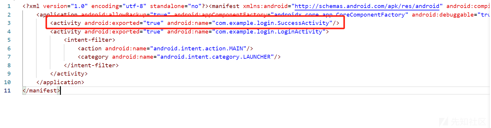
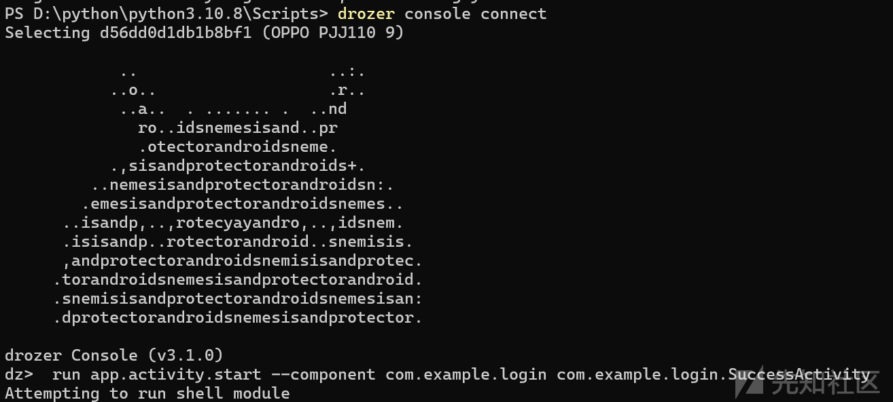
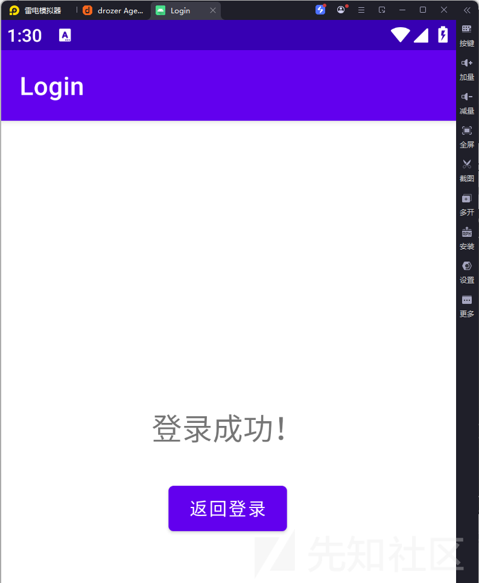
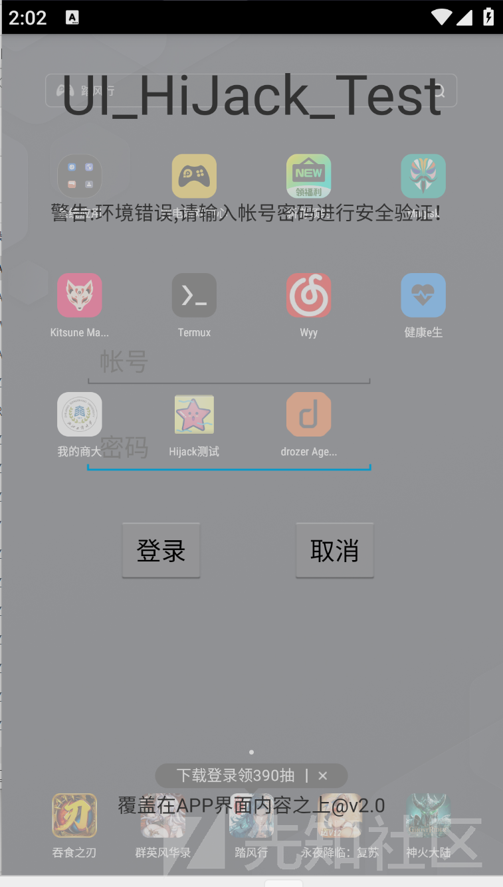
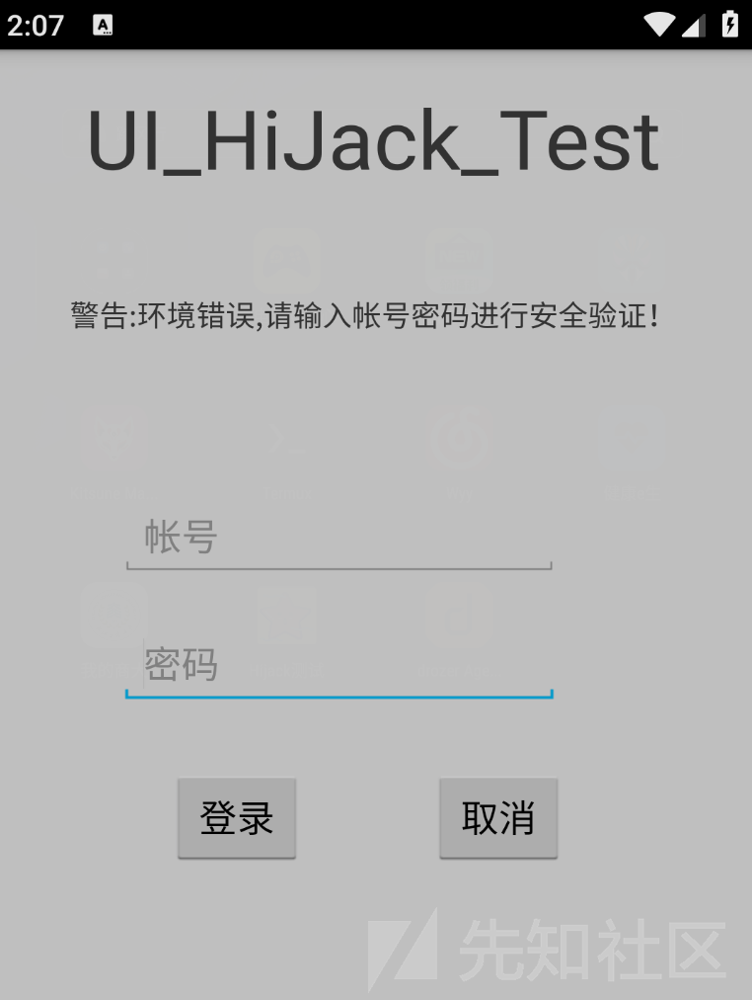
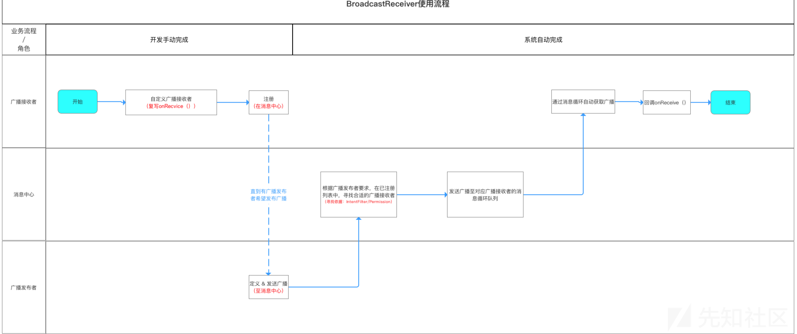
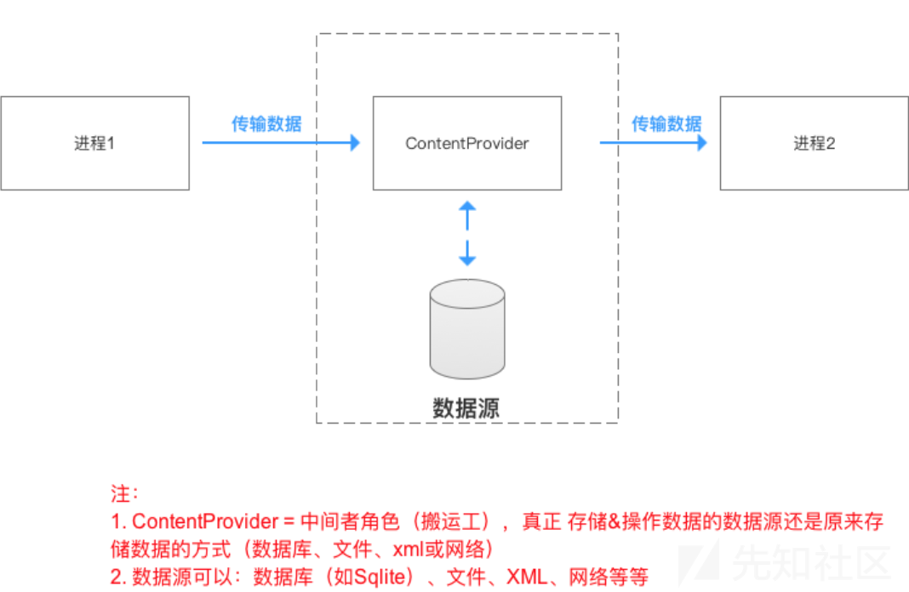
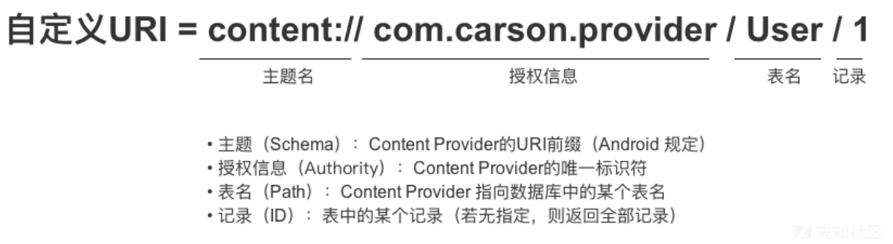
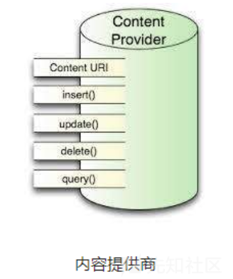

# Android四大组件常见漏洞-先知社区

> **来源**: https://xz.aliyun.com/news/18366  
> **文章ID**: 18366

---

## Activity

### 基本介绍

显式打开Activity通过putExtra和getStringExtra传参

隐式Intent打开Activity只有<action>和<category>中的内容能够匹配上Intent中指定的action和category时，这个活动才能响应Intent，1个action n个catagory

隐式Intent通过Uri.parse打开程序外Activity，需在<intent-filter>中配置<data>标签里的特定协议

​

通过Intent向下一个Activity传递数据，也可以通过startActivityForResult()来启动活动，该方法在活动销毁时能返回一个结果给上一个活动；当活动销毁后，就会回调到上一个活动，需要用onActivityResult接收

​

Activity生命周期

Activity启动模式：standard模式、singleTop模式、singleTask模式、singleInstance模式

### 越权绕过

如果设置exported = "true" 或者Android12以下不设置exported属性就会默认true



adb forward tcp:31415 tcp:31415

直接用dozer启动：run app.activity.start --component com.example.login com.example.login.SuccessActivity





只添加了<intent-filter>的属性，有 <intent-filter> 的 Activity 默认就是导出的

```
<activity android:name=".SensitiveActivity">
    <intent-filter>
        <action android:name="com.example.SENSITIVE_ACTION" />
        <category android:name="android.intent.category.DEFAULT" />
    </intent-filter>
</activity>
```

先用adb启动：adb shell am start -n com.victim.app/.SensitiveActivity或者adb shell am start -a com.example.SENSITIVE\_ACTION

```
Intent intent = new Intent();
intent.setAction("com.example.SENSITIVE_ACTION");
// 可以添加额外数据欺骗参数
intent.putExtra("cmd", "leak_sensitive_data");
intent.setFlags(Intent.FLAG_ACTIVITY_NEW_TASK);
context.startActivity(intent);
```

### activity劫持



run app.activity.start --component com.test.uihijack com.test.uihijack.MainActivity

劫持完之后发现背景消失



### 拒绝服务攻击

通过intent发送空数据、异常或畸形数据给应用，调用的组件在处理Intent附加数据的时候，没有进行异常捕获，来实现让应用崩溃的目的

​

### 安全防护

* 私有activity不定义intent-filter并且设置exported为false
* 公开activity应明确配置 intent-filter，并设置权限控制，敏感组件使用权限保护（android:permission）、
* 合作activity需对合作方的app签名做校验
* 校验 Intent 来源和参数
* 用try catch方式进行捕获所有异常
* 设置调用频率限制
* 校验当前顶层应用是否为自己：topActivity.getPackageName
* 私有activity不设置launchMode和taskAffinity（允许其他 app 插入任务栈）

​

excludeFromRecents="true" 主要用于保护自己 App 的隐私页面

signature级别表示签名相同才能调用

## Service

### 基本介绍

startService：必须用stopService来结束，不调用会导致Activity结束而Service还运行

bindService：可以由unbindService来结束，也可以在Activity结束之后自动结束

混合：停止服务应同时使用stepService与unbindService

​

startService分为隐式启动和显式启动，隐式启动分为用Action启动和用包名启动

bindService使用bind通信机制，bindService启动的服务和调用者是典型的client-server模式。调用者是client，service是server端；client可以通过IBinder接口获取Service实例，从而实现在client端直接调用Service，实现灵活交互

### 权限提升

猎豹清理大师内存清理权限泄露漏洞：4.0.1及以下版本存在权限泄漏漏洞，泄露的权限为android.permission.RESTART\_PACKAGES，**结束进程**来达到**清理内存**的目的。当没有申请此权限的app向猎豹清理大师发送相应的intent时，便可以结束后台运行的部分app进程

乐phone手机任意软件包安装删除漏洞：通过向**ApkInstaller**服务传递构造好的参数，没有声明任何权限的应用即可达到安装和删除任意Package的行为

​

### Service劫持

原理：隐式启动services，当存在同名service，先安装应用的services优先级高

​

### 消息伪造

优酷Android 4.5客户端升级漏洞：升级所需的相关数据如app的下载地址等也是从该序列化数据中获取，发现升级过程未对下载地址等进行判断，因此可以任意指定该地址

​

### 拒绝服务

同activity

### 安全防护

* 私有service不定义intent-filter并且设置exported为false
* 公开service应明确配置 intent-filter，并设置权限控制，敏感组件使用权限保护（android:permission）
* 合作service需对合作方的app签名做校验
* 校验 Intent 来源和参数
* 用try catch方式进行捕获所有异常
* 设置调用频率限制

## Broadcast Recevier

### 基本介绍

基本角色：消息订阅者，消息发布者和消息中心 异步通信



自定义广播接收者复写抽象方法onReceive()方法

注册分为静态注册和动态注册：静态注册在<receive>标签声明，不受任何组件生命周期影响，耗电占内存；动态注册在代码中调用Context.registerReceiver()方法，随组件生命周期变化

广播定义与发送：广播发送 = 广播发送者 将此广播的“意图（Intent）”通过sendBroadcast（）方法发送出去

广播类型：

1. 标准广播（异步）和有序广播（同步）
2. 普通广播，系统广播，有序广播，粘性广播，App应用内广播

### 敏感信息泄露

发送的intent没有明确指定接收者，而是简单的通过action进行匹配，恶意应用便可以注册一个广播接收者嗅探拦截到这个广播，如果这个广播存在敏感数据，就被恶意应用窃取了

​

​

### 权限绕过

动态注册的广播默认都是导出的，如果导出的BroadcastReceiver没有做权限控制，导致BroadcastReceiver组件可以接收一个外部可控的url、或者其他命令，导致攻击者可以越权利用应用的一些特定功能，比如发送恶意广播、伪造消息、任意应用下载安装、打开钓鱼网站等

小米MIUI漏洞：MIUI内置的手电筒软件中，TorchService服务没有对广播来源进行验证，导致任何程序可以调用这个服务，打开或关闭手电筒，利用这个漏洞，可以导致系统电源迅速消耗

​

### 消息伪造

暴露的Receiver对外接收Intent，如果构造恶意的消息放在Intent中传输，被调用的Receiver接收可能产生安全隐患

百度云盘手机版存在高危漏洞，恶意攻击者通过该漏洞可以对手机用户进行**钓鱼欺骗**，盗取用户隐私文件和信息，以**百度云盘APP权限执行任何代码**。百度云盘有一个**广播接收器没有**对消息进行安全**验证**，通过发送恶意的消息，攻击者可以在用户手机通知栏上**推送任意消息**，点击消息后可以**利用webview组件**盗取本地**隐私文件**和执行**任意代码**

**​**

### 拒绝服务

传递恶意畸形的intent数据给广播接收器，广播接收器无法处理异常导致crash

​

### 安全防护

* 私有广播接收器不定义intent-filter并且设置exported为false
* 内部app之间的广播使用protectionLevel=‘signature’ 验证其是否真是内部app
* 发送的广播包含敏感信息时需指定广播接收器，使用显示意图
* 对接收来的广播进行验证
* 使用LocalBroadcastManager，发出的广播就只能被app自身广播接收器接收

## ContentProvider

### 基本介绍

不同应用之间共享数据，跨进程通信，统一数据的访问方式，通过Binder进程间通信机制以及匿名共享内存机制来实现



URI：Uniform Resource Identifier，唯一标识ContentProvider &其中的数据



标准前缀:content:// ,用来说明一个Content Provider控制这些数据

​

当外部应用需要对ContentProvider中的数据进行添加、删除、修改及查询操作时，可以使用ContentResolver类来完成，要获取ContentResolver对象，可以使用Activity提供getContentResolver()

ContentResolver类提供了与ContentProvider类相同签名的四个方法



### 信息泄露

如果对ContentProvider的权限没有做好控制

可以分析目标程序的provider的进程名和授权的URI，构建一个URI，然后通过contentresolver去读取里面的的列表名信息

​

### SQL注入漏洞

对Content Provider进行增删改查操作时，程序没有对用户的输入进行过滤，未采用参数化查询的方式，可能会导致sql注入攻击

### 目录遍历

Content Provider组件实现了openFile()接口，如果没有对访问权限控制和对访问的Uri进行有效判断，利用该接口进行文件目录遍历可以达到访问任意可读文件

ContentProvider.openFile（Uri uri，String mode）

### 安全防护

* 部app通过content provider交换数据时，设置protectionLevel=”signature”验证签名
* 公开的content provider确保不存储敏感数据
* 使用Context.checkCallingPermission()来确保调用者拥有相应的权限
* 使用参数化查询语句，比如SQLiteStatement；过滤用户的输入
* 去除没有必要的openFile()接口，并过滤../等
* 过滤限制跨域访问，对访问的目标文件的路径进行有效判断

​

​

参考链接：

<https://www.cnblogs.com/GGbomb/p/18067207>

<https://xz.aliyun.com/news/11538>

<https://bbs.kanxue.com/thread-269211.htm#msg_header_h3_0>
