# AFL源码审计-Fuzz学习-先知社区

> **来源**: https://xz.aliyun.com/news/18375  
> **文章ID**: 18375

---

来自<https://www.ruanx.net/afl-source-1/>前辈文章指导(小白第一次审计)

可先在github看到最新的源码拉取下来利用understand可以快速查看依赖关系

## 项目框架

基本可以确定这个项目的主体就是afl-fuzz.c文件

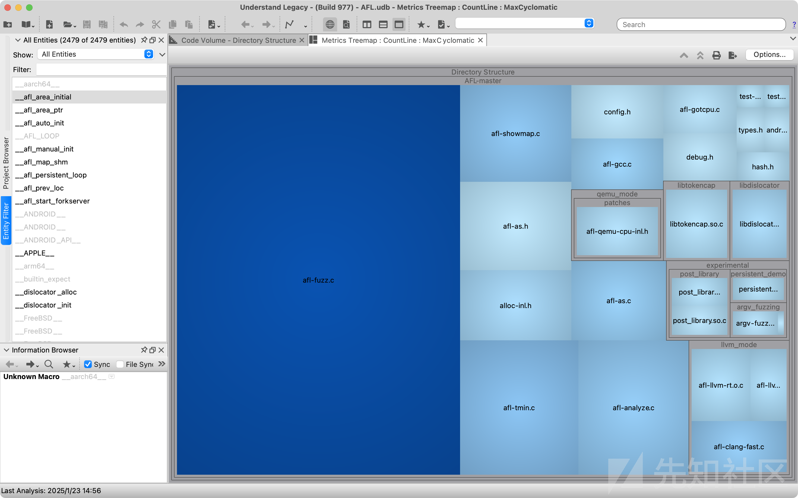


## CI配置

先编译AFL,再执行项目运行测试

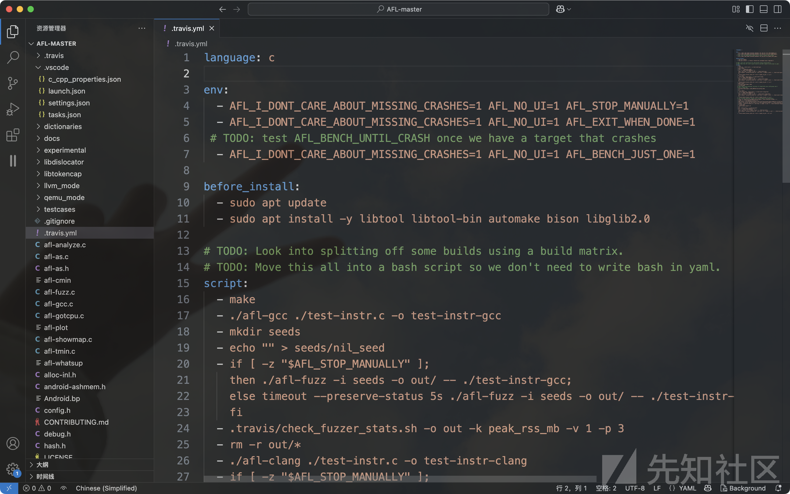

```
language: c

env:
  - AFL_I_DONT_CARE_ABOUT_MISSING_CRASHES=1 AFL_NO_UI=1 AFL_STOP_MANUALLY=1
  - AFL_I_DONT_CARE_ABOUT_MISSING_CRASHES=1 AFL_NO_UI=1 AFL_EXIT_WHEN_DONE=1
 # TODO: test AFL_BENCH_UNTIL_CRASH once we have a target that crashes
  - AFL_I_DONT_CARE_ABOUT_MISSING_CRASHES=1 AFL_NO_UI=1 AFL_BENCH_JUST_ONE=1

before_install:
  - sudo apt update
  - sudo apt install -y libtool libtool-bin automake bison libglib2.0

# TODO: Look into splitting off some builds using a build matrix.
# TODO: Move this all into a bash script so we don't need to write bash in yaml.
script:
#编译AFL
  - make
#afl-gcc编译目标程序(采用静态层面插桩)
  - ./afl-gcc ./test-instr.c -o test-instr-gcc
#准备语料集
  - mkdir seeds
  - echo "" > seeds/nil_seed
#执行time=5s的fuzz测试
  - if [ -z "$AFL_STOP_MANUALLY" ];
    then ./afl-fuzz -i seeds -o out/ -- ./test-instr-gcc;
    else timeout --preserve-status 5s ./afl-fuzz -i seeds -o out/ -- ./test-instr-gcc;
    fi
#检查fuzzer_stats文件是否正确生成
  - .travis/check_fuzzer_stats.sh -o out -k peak_rss_mb -v 1 -p 3
#清理
  - rm -r out/*
#.......执行一次afl-clang编译
  - ./afl-clang ./test-instr.c -o test-instr-clang
  - if [ -z "$AFL_STOP_MANUALLY" ];
    then ./afl-fuzz -i seeds -o out/ -- ./test-instr-clang;
    else timeout --preserve-status 5s ./afl-fuzz -i seeds -o out/ -- ./test-instr-clang;
    fi
  - .travis/check_fuzzer_stats.sh -o out -k peak_rss_mb -v 1 -p 2
  - make clean
#测试执行llvm_mode模式fuzz
  - CC=clang CXX=clang++ make
  - cd llvm_mode
  # TODO: Build with different versions of clang/LLVM since LLVM passes don't
  # have a stable API.
  - CC=clang CXX=clang++ LLVM_CONFIG=llvm-config make
  - cd ..
  - rm -r out/*
  - ./afl-clang-fast ./test-instr.c -o test-instr-clang-fast
  - if [ -z "$AFL_STOP_MANUALLY" ];
    then ./afl-fuzz -i seeds -o out/ -- ./test-instr-clang-fast;
    else timeout --preserve-status 5s ./afl-fuzz -i seeds -o out/ -- ./test-instr-clang-fast;
    fi
  - .travis/check_fuzzer_stats.sh -o out -k peak_rss_mb -v 1 -p 3
#libfuzzer兼容性测试
  - clang -g -fsanitize-coverage=trace-pc-guard ./test-libfuzzer-target.c -c
  - clang -c -w llvm_mode/afl-llvm-rt.o.c
  - wget https://raw.githubusercontent.com/llvm/llvm-project/main/compiler-rt/lib/fuzzer/afl/afl_driver.cpp
  - clang++ afl_driver.cpp afl-llvm-rt.o.o test-libfuzzer-target.o -o test-libfuzzer-target
  - timeout --preserve-status 5s ./afl-fuzz -i seeds -o out/ -- ./test-libfuzzer-target
#qemu_mode测试
  - cd qemu_mode
  - ./build_qemu_support.sh
  - cd ..
  - gcc ./test-instr.c -o test-no-instr
  - if [ -z "$AFL_STOP_MANUALLY" ];
    then ./afl-fuzz -Q -i seeds -o out/ -- ./test-no-instr;
    else timeout --preserve-status 5s ./afl-fuzz -Q -i seeds -o out/ -- ./test-no-instr;
    fi
  - .travis/check_fuzzer_stats.sh -o out -k peak_rss_mb -v 12 -p 9
```

## FUZZ基本概述

### 测试框架

程序基本框架：存在一个输入，经过处理后，输出回显

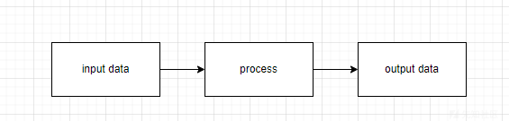

模糊测试框架：将data数据经过变异，测试回显是否出现问题

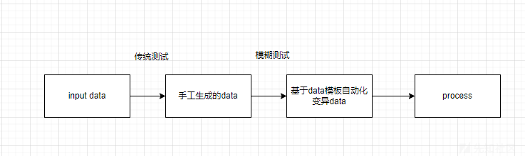

### AFL模糊测试

1. 审计→利用
2. 适应改造

### 代码审计漏洞

1. 手工审计
2. codeql辅助审计

## 模糊测试概念

通过自动化生成并执行大量的随机测试用例来发现产品或协议的未知漏洞

### 自动化FUZZ

1. 生成data

* 随机
* 基于模板的data生成fuzz

2. 覆盖制导FUZZ

* 感知进程→路径反馈→基于反馈的路径变异

### 测试工具

1. 基于变异（覆盖制导FUZZ）

1. AFL
2. libfl

* api fuzz
* frida模式无源码fuzz

3. honggfuzz（可用于无源码fuzz）
4. winafl（windows下的fuzz）
5. syzkaller（内核fuzz）

2. 基于生成的FUZZ

* peach（数据模板fuzz）

## AFL原理

### 基本概述

基于覆盖制导的模糊测试工具

基本逻辑结构：

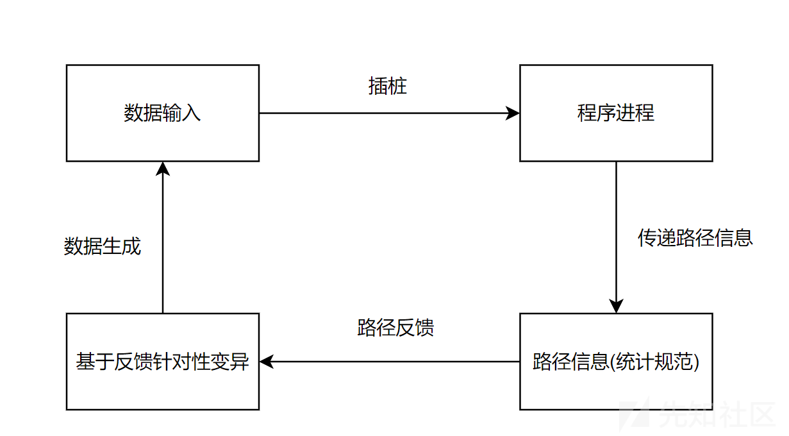

AFL通过插桩基本反馈路径信息的基本方式：

```
#include<stdio.h>
void func()
{
  int data[];
  if (data[] == 0) {
    //插入alf_maybe_log（插桩）
  }
  else {
    //插入alf_maybe_log函数（插桩）
  }
}
//通过进程向外部传递路径信息
```

### AFL插桩

AFL的插桩分为两种：汇编层插桩和LLVM PASS插桩

* 汇编层插桩

高级语言→汇编语言→二进制数据

在汇编层寻找条件跳转（插入func），例如jnz addr等这种位置

问题：要针对每种汇编语言架构实现不同的插桩逻辑，不通用

* LLVM PASS插桩

使用clang（gcc使用，前端语法解析器）//llvm（后端语法引擎）

通过clang来实现转换为中间语言的过程

通过这个llvm项目实现不同

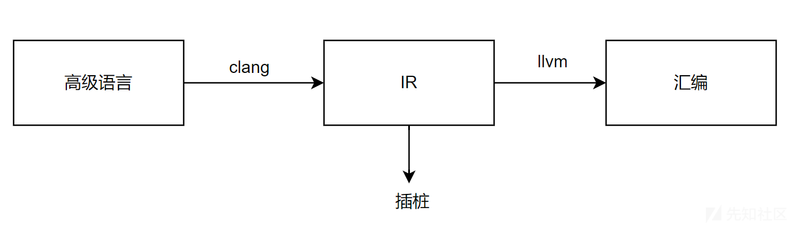

#### 插桩功能解析

整体实现框架：

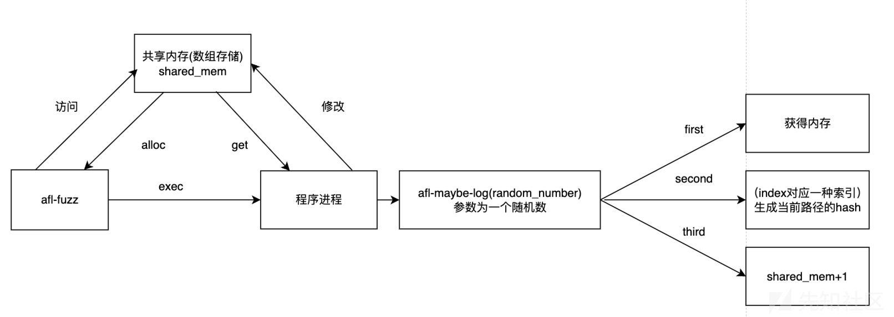

index生成框架:

在第一个节点处定义为节点（随机数num0），该结点下的第一个支路的结点定义为（随机数num2），该结点下的第二个支路对应的结点定义为（num2），计算生成两个hash值，hash（01）和hash（02），依次类推生成的hash路径表，就可以根据hash后的值比较的结果进行路径反馈

#### 插桩逻辑分析

* 获得共享内存

```
v17 = v4;
v18 = random_num;

// 获取共享内存句柄，通过环境变量 "__AFL_SHM_ID" 传递
const char *afl_shm_id_str = getenv("__AFL_SHM_ID");

if (!afl_shm_id_str || 
    (v11 = atoi(afl_shm_id_str), 
     afl_shm_addr = shmat(v11, NULL, 0), 
     afl_shm_addr == (_BYTE *)-1LL)) 
{
    // 如果获取共享内存句柄失败，增加失败计数器
    ++_afl_setup_failure;
    return v17 + 127;  // 返回错误状态
}

// 初始化共享内存区域
*afl_shm_addr = 1;
_afl_area_ptr = (_int64)afl_shm_addr;  // 目标地址
afl_global_area_ptr = afl_shm_addr;
v16 = afl_shm_addr;

// 通知 af1-fuzz forkserver 已准备完毕，写入管道 199
if (write(199, &_afl_temp, 4uLL) == 4) {
    // 进入 forkserver 循环
    while (1) {
        v13 = 198;
        // forkserver
    }
}
```

* 获取hash路径逻辑：（这里hash算法的本质就是xor）

```
// 计算索引值，基于 _afl_prev_loc 和随机数 random_num
index = _afl_prev_loc ^ random_num;

// 更新 _afl_prev_loc
_afl_prev_loc ^= index;  // _afl_prev_loc = random_num
_afl_prev_loc = (unsigned _int64)_afl_prev_loc >> 1;  // 右移 1 位

// 预防整数溢出处理
v8 = _CFADD_((*(_BYTE *)(v5 + index))++, 1);
/**
 * 模板函数：检测加法运算是否导致进位 (Carry Flag)
 * @param T x 第一个操作数
 * @param U y 第二个操作数
 * @return 是否进位 (1 表示进位，0 表示无进位)
 */
template <class T, class U>
int8 _CFADD_(T x, U y) {
    // 确定操作数的最大字节大小
    int size = sizeof(T) > sizeof(U) ? sizeof(T) : sizeof(U);

    // 根据不同字节大小进行进位检查
    if (size == 1) 
        return (uint8_t(x) > uint8_t(x + y));
    if (size == 2) 
        return (uint16_t(x) > uint16_t(x + y));
    if (size == 4) 
        return (uint32_t(x) > uint32_t(x + y));
    
    // 默认情况为 64 位检测
    return (uint64_t(x) > uint64_t(x + y));
}

// 更新共享内存区域的值
*(_BYTE *)(v6 + index) += v8;

// 返回错误状态
return v5 + 127;
```

#### afl-as源码分析

main函数逻辑:

1. 初始化随机数种子
2. 汇编指令插桩
3. as参数修改
4. as生成可执行文件+clean配置文件

```
int main(int argc, char** argv) {

  s32 pid;                   // 子进程 PID
  u32 rand_seed;             // 随机数种子
  int status;                // 子进程退出状态
  u8* inst_ratio_str = getenv("AFL_INST_RATIO");  // 从环境变量中获取 AFL_INST_RATIO 的值

  struct timeval tv;
  struct timezone tz;

  clang_mode = !!getenv(CLANG_ENV_VAR); // 如果设置了 CLANG_ENV_VAR 环境变量，则启用 clang 模式

  // 如果是终端输出且没有设置静默模式，则输出版本信息
  if (isatty(2) && !getenv("AFL_QUIET")) {
    SAYF(cCYA "afl-as " cBRI VERSION cRST " by <lcamtuf@google.com>
");
  } else be_quiet = 1;  // 启用静默模式，不输出额外信息

  // 如果参数少于 2（即没有指定要汇编的文件），则提示用户不要直接运行本程序
  if (argc < 2) {
    SAYF("
"
         "This is a helper application for afl-fuzz. It is a wrapper around GNU 'as',
"
         "executed by the toolchain whenever using afl-gcc or afl-clang. You probably
"
         "don't want to run this program directly.

"

         "Rarely, when dealing with extremely complex projects, it may be advisable to
"
         "set AFL_INST_RATIO to a value less than 100 in order to reduce the odds of
"
         "instrumenting every discovered branch.

");
    exit(1);
  }

  // 初始化随机数种子
  gettimeofday(&tv, &tz);
  rand_seed = tv.tv_sec ^ tv.tv_usec ^ getpid(); // 混合时间与 PID 生成种子
  srandom(rand_seed); // 设置随机数种子

  edit_params(argc, argv); // 编辑参数，构造传递给 'as' 的命令参数

  // 如果设置了 AFL_INST_RATIO，解析它并验证是否合法（0-100）
  if (inst_ratio_str) {
    if (sscanf(inst_ratio_str, "%u", &inst_ratio) != 1 || inst_ratio > 100) 
      FATAL("Bad value of AFL_INST_RATIO (must be between 0 and 100)");
  }

  // 防止无限循环调用自身（比如 PATH 中有当前目录）
  if (getenv(AS_LOOP_ENV_VAR))
    FATAL("Endless loop when calling 'as' (remove '.' from your PATH)");

  // 设置 AS_LOOP_ENV_VAR 环境变量以标记程序已运行过一次
  setenv(AS_LOOP_ENV_VAR, "1", 1);

  // 如果使用了 ASAN 或 MSAN（内存检测工具），降低插桩比率来避免误报
  if (getenv("AFL_USE_ASAN") || getenv("AFL_USE_MSAN")) {
    sanitizer = 1;
    inst_ratio /= 3; // 将插桩比率降为原来的三分之一
  }

  // 如果不是只显示版本号，执行插桩处理
  if (!just_version) add_instrumentation();

  // 创建子进程，执行真正的 as 汇编程序
  if (!(pid = fork())) {
    execvp(as_params[0], (char**)as_params); // 执行 as
    FATAL("Oops, failed to execute '%s' - check your PATH", as_params[0]);
  }

  // fork 失败
  if (pid < 0) PFATAL("fork() failed");

  // 等待子进程执行完毕
  if (waitpid(pid, &status, 0) <= 0) PFATAL("waitpid() failed");

  // 如果没有设置保留汇编文件的选项，则删除修改后的临时汇编文件
  if (!getenv("AFL_KEEP_ASSEMBLY")) unlink(modified_file);

  // 使用子进程的退出状态码退出主程序
  exit(WEXITSTATUS(status));
}
```

as参数修改逻辑:

```
/* 处理并修改传递给as的参数。注意，GCC 传递的参数中，源文件名总是最后一个参数，
   利用这个特性可以简化处理逻辑。*/

static void edit_params(int argc, char** argv) {

  u8 *tmp_dir = getenv("TMPDIR"), *afl_as = getenv("AFL_AS");
  u32 i;

  // 如果没有设置 TMPDIR，还要兼容 TEMP 和 TMP 环境变量（一些非标准实现会用到）
  if (!tmp_dir) tmp_dir = getenv("TEMP");
  if (!tmp_dir) tmp_dir = getenv("TMP");
  if (!tmp_dir) tmp_dir = "/tmp";  // 如果都没有，就默认使用 /tmp

  // 分配用于保存传递给 as 的参数数组，额外分配一些空间（+32）避免溢出
  as_params = ck_alloc((argc + 32) * sizeof(u8*));

  // 设置第一个参数为实际要调用的 as 程序（可通过 AFL_AS 指定）
  as_params[0] = afl_as ? afl_as : (u8*)"as";

  // 参数数组的最后一个元素置为 NULL，用于 execvp 结束判断
  as_params[argc] = 0;

  // 从第一个参数开始遍历到倒数第二个（最后一个是源文件名）
  for (i = 1; i < argc - 1; i++) {

    // 判断是否设置了 --64 或 --32 参数，记录是否为 64 位模式
    if (!strcmp(argv[i], "--64")) use_64bit = 1;
    else if (!strcmp(argv[i], "--32")) use_64bit = 0;

    // 将参数复制到新的参数数组中
    as_params[as_par_cnt++] = argv[i];
  }

  // 获取最后一个参数，即输入源文件
  input_file = argv[argc - 1];

  // 如果输入文件以 '-' 开头，说明可能是特殊参数
  if (input_file[0] == '-') {

    // 判断是否是 '--version' 参数
    if (!strcmp(input_file + 1, "-version")) {
      just_version = 1;        // 设置只显示版本号标志
      modified_file = input_file; // 不修改文件
      goto wrap_things_up;     // 跳转到最后统一处理逻辑
    }

    // 如果是其他以 '-' 开头的非法参数，直接报错（可能不是通过 afl-gcc 调用的）
    if (input_file[1]) FATAL("Incorrect use (not called through afl-gcc?)");
    else input_file = NULL; // 单独的 '-' 可能表示标准输入

  } else {

    // 判断输入文件路径是否为编译临时文件（通常在 /tmp 下），如果不是则设置为 pass_thru 模式
    // 这是为了解决像 NSS 这样的项目在编译时可能传入手动生成的 .s 文件
    if (strncmp(input_file, tmp_dir, strlen(tmp_dir)) &&
        strncmp(input_file, "/var/tmp/", 9) &&
        strncmp(input_file, "/tmp/", 5)) pass_thru = 1;
  }

  // 构造修改后的中间文件名，保存在临时目录下
  modified_file = alloc_printf("%s/.afl-%u-%u.s", tmp_dir, getpid(),
                               (u32)time(NULL));

wrap_things_up:

  // 将修改后的文件名作为最后一个参数传递给 as
  as_params[as_par_cnt++] = modified_file;

  // 参数数组结束标志
  as_params[as_par_cnt]   = NULL;
}
```

确定as名称(GNU as)➡️检查临时目录(TMPDIR → TEMP → TMP → 默认 /tmp)➡️参数拷贝(原始命令行参数 argv,存储在as\_params[]用于execvp)➡️识别+检查输入文件➡️创建插桩后内容

```
afl-as 收到 argv --> 提取参数 --> 替换源文件为 modified_file
                             |
                             +--> 插桩写入 modified_file
                             |
                             +--> execvp(as, as_params)
```

#### 插桩实例分析

案例源码:

```
#include <stdio.h>

void work() {
    for(int i=1; i<=10; i++) {
        printf("Hello, world %d
", i);
    }
}

int main(void) {
    work();
    return 0;
}
```

##### 插桩指令

(使用 -fno-asynchronous-unwind-tables以去除 .cfi 指令)

AFL\_DONT\_OPTIMIZE=1 ../afl-gcc target.c -o target -O0 -fno-asynchronous-unwind-tables

##### 汇编层插桩

前汇编代码:

```
.file "target.c"
  .text
  .section  .rodata
.LC0:
  .string "Hello, world %d
"
  .text
  .globl  work
  .type work, @function
work:
  pushq %rbp
  movq  %rsp, %rbp
  subq  $16, %rsp
  movl  $1, -4(%rbp)
  jmp .L2
.L3:
  movl  -4(%rbp), %eax
  movl  %eax, %esi
  leaq  .LC0(%rip), %rax
  movq  %rax, %rdi
  movl  $0, %eax
  call  printf@PLT
  addl  $1, -4(%rbp)
.L2:
  cmpl  $10, -4(%rbp)
  jle .L3
  nop
  nop
  leave
  ret
  .size work, .-work
  .globl  main
  .type main, @function
main:
  pushq %rbp
  movq  %rsp, %rbp
  movl  $0, %eax
  call  work
  movl  $0, %eax
  popq  %rbp
  ret
  .size main, .-main
  .ident  "GCC: (Debian 12.2.0-14) 12.2.0"
  .section  .note.GNU-stack,"",@progbits
```

后汇编代码:

```
.file "target.c"
  .text
  .section  .rodata
.LC0:
  .string "Hello, world %d
"
  .text
  .globl  work
  .type work, @function
work:

/* --- AFL TRAMPOLINE (64-BIT) --- */

.align 4

leaq -(128+24)(%rsp), %rsp
movq %rdx,  0(%rsp)
movq %rcx,  8(%rsp)
movq %rax, 16(%rsp)
movq $0x00000af3, %rcx
call __afl_maybe_log
movq 16(%rsp), %rax
movq  8(%rsp), %rcx
movq  0(%rsp), %rdx
leaq (128+24)(%rsp), %rsp

/* --- END --- */

  pushq %rbp
  movq  %rsp, %rbp
  subq  $16, %rsp
  movl  $1, -4(%rbp)
  jmp .L2
.L3:

/* --- AFL TRAMPOLINE (64-BIT) --- */

.align 4

leaq -(128+24)(%rsp), %rsp
movq %rdx,  0(%rsp)
movq %rcx,  8(%rsp)
movq %rax, 16(%rsp)
movq $0x00003d9b, %rcx
call __afl_maybe_log
movq 16(%rsp), %rax
movq  8(%rsp), %rcx
movq  0(%rsp), %rdx
leaq (128+24)(%rsp), %rsp

/* --- END --- */

  movl  -4(%rbp), %eax
  movl  %eax, %esi
  leaq  .LC0(%rip), %rax
  movq  %rax, %rdi
  movl  $0, %eax
  call  printf@PLT
  addl  $1, -4(%rbp)
.L2:

/* --- AFL TRAMPOLINE (64-BIT) --- */

.align 4

leaq -(128+24)(%rsp), %rsp
movq %rdx,  0(%rsp)
movq %rcx,  8(%rsp)
movq %rax, 16(%rsp)
movq $0x0000d5a5, %rcx
call __afl_maybe_log
movq 16(%rsp), %rax
movq  8(%rsp), %rcx
movq  0(%rsp), %rdx
leaq (128+24)(%rsp), %rsp

/* --- END --- */

  cmpl  $10, -4(%rbp)
  jle .L3

/* --- AFL TRAMPOLINE (64-BIT) --- */

.align 4

leaq -(128+24)(%rsp), %rsp
movq %rdx,  0(%rsp)
movq %rcx,  8(%rsp)
movq %rax, 16(%rsp)
movq $0x000078e0, %rcx
call __afl_maybe_log
movq 16(%rsp), %rax
movq  8(%rsp), %rcx
movq  0(%rsp), %rdx
leaq (128+24)(%rsp), %rsp

/* --- END --- */

  nop
  nop
  leave
  ret
  .size work, .-work
  .globl  main
  .type main, @function
main:

/* --- AFL TRAMPOLINE (64-BIT) --- */

.align 4

leaq -(128+24)(%rsp), %rsp
movq %rdx,  0(%rsp)
movq %rcx,  8(%rsp)
movq %rax, 16(%rsp)
movq $0x0000c35b, %rcx
call __afl_maybe_log
movq 16(%rsp), %rax
movq  8(%rsp), %rcx
movq  0(%rsp), %rdx
leaq (128+24)(%rsp), %rsp

/* --- END --- */

  pushq %rbp
  movq  %rsp, %rbp
  movl  $0, %eax
  call  work
  movl  $0, %eax
  popq  %rbp
  ret
  .size main, .-main
  .ident  "GCC: (Debian 12.2.0-14) 12.2.0"
  .section  .note.GNU-stack,"",@progbits

/* --- AFL MAIN PAYLOAD (64-BIT) --- */
/* 此处省略 300 余行 */
```

基本块入口插桩

```
.align 4
//指令对齐
leaq -(128+24)(%rsp), %rsp
//分配栈空间
movq %rdx,  0(%rsp)
movq %rcx,  8(%rsp)
movq %rax, 16(%rsp)
//上下文状态保存(寄存器)
movq $0x000078e0, %rcx
//设置基本块的id
call __afl_maybe_log
movq 16(%rsp), %rax
movq  8(%rsp), %rcx
movq  0(%rsp), %rdx
//上下文状态恢复(寄存器)
leaq (128+24)(%rsp), %rsp
//栈空间恢复
```

逻辑转换

```
cur_location = <COMPILE_TIME_RANDOM>; // 编译时生成的随机位置标识，唯一表示当前基本块
shared_mem[cur_location ^ prev_location]++; // 以当前路径作为 key，命中共享内存中的一个字节，自增记录命中次数）
prev_location = cur_location >> 1; // 更新 prev_location，用于下一条路径计算，右移是为了区分路径方向
```

### AFL MAIN PAYLOAD

这里针对32 bit的版本进行分析

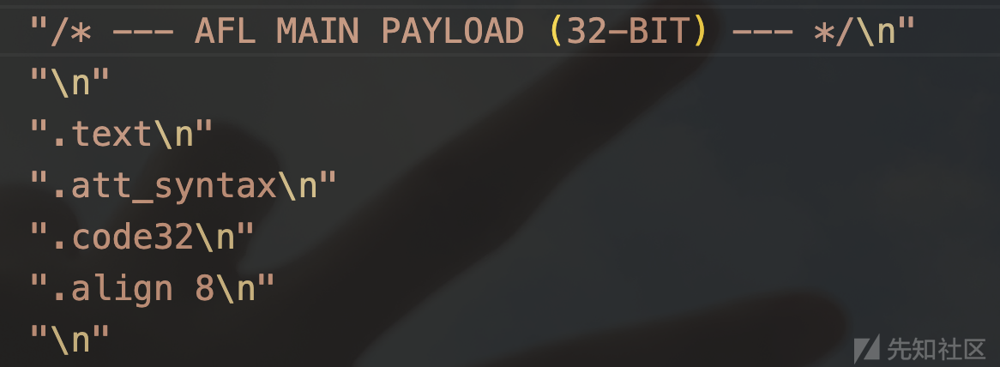

##### afl\_maybe\_log

AFL中将程序中的寄存器中的值保存到栈上后,调用afl\_maybe\_log 函数➡️保存当前EFLAGES寄存器状态➡️检查shm区域➡️进入afl\_store进程(shm区添加hit count)

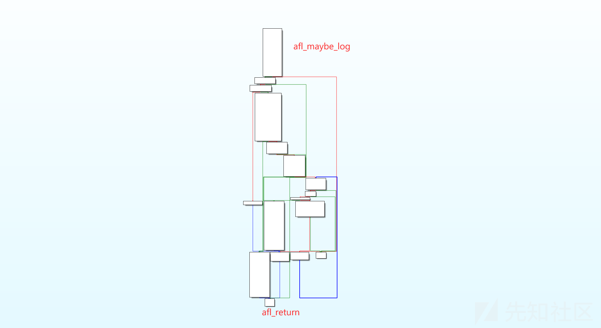

注释:

* shm区域:share memory共享内存区域➡️多个进程同时访问的内存,一下是常见的shm区域系统调用

```
int shmget(key_t key, size_t size, int shmflg);   // 创建共享内存
void* shmat(int shmid, const void *shmaddr, int shmflg); // 映射到进程地址空间
int shmdt(const void *shmaddr);                  // 解除映射
int shmctl(int shmid, int cmd, struct shmid_ds *buf); // 控制共享内存
```

* hit count:即是指我们在这里对这块shm区域的记录的访问次数(主要在afl中用于路径遍历的路径计数)
* EFLAGS寄存器:x86架构中记录控制CPU状态(ZF,CF,SF,IF,OF标志位)

代码具体实现:

\_\_afl\_area\_ptr(存储于.bss段的位置)参数判定➡️shm是否映射成功

```
"__afl_maybe_log:
"
  "
"
  "  lahf
"
  "  seto %al
"
  "
"
  "  /* Check if SHM region is already mapped. */
"//检查shm区域是否准备好映射
  "
"
  "  movl  __afl_area_ptr, %edx
"
  "  testl %edx, %edx
"
  "  je    __afl_setup
"
  "
"
  "__afl_store:
"
  "
"
  "  /* Calculate and store hit for the code location specified in ecx. There
"
  "     is a double-XOR way of doing this without tainting another register,
"
  "     and we use it on 64-bit systems; but it's slower for 32-bit ones. */
"
  "
"
#ifndef COVERAGE_ONLY
  "  movl __afl_prev_loc, %edi
"
  "  xorl %ecx, %edi
"
  "  shrl $1, %ecx
"
  "  movl %ecx, __afl_prev_loc
"
#else
  "  movl %ecx, %edi
"
#endif /* ^!COVERAGE_ONLY */
  "
"
#ifdef SKIP_COUNTS
  "  orb  $1, (%edx, %edi, 1)
"
#else
  "  incb (%edx, %edi, 1)
"
#endif /* ^SKIP_COUNTS */
  "
"
  "__afl_return:
"
  "
"
  "  addb $127, %al
"
  "  sahf
"
  "  ret
"
  "
"
```

##### \_\_afl\_setup

根据\_\_afl\_setup\_failure是否为0决定是否进行初始化shm区操作,以及shm区初始化相关操作

```
"__afl_setup:
"
  "
"
  "  /* Do not retry setup if we had previous failures. */
"
  "
"
//初始化判断
  "  cmpb $0, __afl_setup_failure
"
  "  jne  __afl_return
"
  "
"
  "  /* Map SHM, jumping to __afl_setup_abort if something goes wrong.
"
  "     We do not save FPU/MMX/SSE registers here, but hopefully, nobody
"
  "     will notice this early in the game. */
"
  "
"
  "  pushl %eax
"
  "  pushl %ecx
"
  "
"
//获取共享内存环境变量
  "  pushl $.AFL_SHM_ENV
"
  "  call  getenv
"
  "  addl  $4, %esp
"
  "
"
//环境变量检测
  "  testl %eax, %eax
"
  "  je    __afl_setup_abort
"
  "
"
//共享内存标志符解析(atoi将环境变量值转换为整数➡️作为标志符)
  "  pushl %eax
"
  "  call  atoi
"
  "  addl  $4, %esp
"
  "
"
//shmat将进程附加到shm区域中
  "  pushl $0          /* shmat flags    */
"
  "  pushl $0          /* requested addr */
"
  "  pushl %eax        /* SHM ID         */
"
  "  call  shmat
"
  "  addl  $12, %esp
"
  "
"
  "  cmpl $-1, %eax
"
  "  je   __afl_setup_abort
"
  "
"
  "  /* Store the address of the SHM region. */
"
  "
"
//shm区地址存储
  "  movl %eax, __afl_area_ptr
"
  "  movl %eax, %edx
"
  "
"
//恢复寄存器状态(返回调用前)
  "  popl %ecx
"
  "  popl %eax
"
```

shmat:share memmory attach➡️用于attach共享内存

```
shmat(int shmid, const void *shmaddr, int shmflg){
//shmid:对应环境变量中的参数;shmadder:操作系统选择的地址空间;shmflg=0默认设置
  ......
  retrun shm address/-1;
}
//attch失败返回-1,成功则返回返回共享内存在进程中的起始地址
```

### ForkServer

每次数据输入（对应一次进程的创建），性能开销很大，所以创建fokserver,利用fokeserver创建进程

forkserver和afl-fuzz存在两个进程(一个是afl-fuzz向forkserver发送命令,forkserver在子进程崩溃后向afl-fuzz发送当先的信息样本导致进程crush的信息)

#### 基本框架

基于伪代码进行逻辑解析:

```
// 通过199管道通知afl-fuzz，forkserver已准备完毕
    if (write(pipe_to_fuzzer, &afl_temp, sizeof(afl_temp)) != sizeof(afl_temp)) {
        perror("Error: write to afl-fuzz failed");
        return -1;
    }
    while (1) {
        // 等待从198管道接收afl-fuzz的指令
        if (read(pipe_from_fuzzer, &afl_temp, sizeof(afl_temp)) != sizeof(afl_temp)) {
            perror("Error: read from afl-fuzz failed or pipe closed");
            break; // 如果管道关闭，forkserver退出
        }
        // fork新进程
        afl_fork_pid = fork();
        if (afl_fork_pid < 0) {
            perror("Error: fork failed");
            break;
        }
        if (afl_fork_pid == 0) {
            // 子进程：关闭继承自父进程的管道，正常执行
            close(pipe_to_fuzzer);
            close(pipe_from_fuzzer);
            // 子进程进入afl的fork_resume流程
            goto _afl_fork_resume;
        }
        // 父进程：将子进程PID通过199管道发送给afl-fuzz
        if (write(pipe_to_fuzzer, &afl_fork_pid, sizeof(afl_fork_pid)) != sizeof(afl_fork_pid)) {
            perror("Error: write child PID to afl-fuzz failed");
            break;
        }
        // 父进程等待子进程退出
        int status;
        pid_t wait_result = waitpid(afl_fork_pid, &status, 0);
        if (wait_result <= 0) {
            perror("Error: waitpid failed");
            break;
        }
        // 将子进程退出信息通过199管道发送给afl-fuzz
        if (write(pipe_to_fuzzer, &status, sizeof(status)) != sizeof(status)) {
            perror("Error: write child exit status to afl-fuzz failed");
            break;
        }
    }
    return 0;
_afl_fork_resume:
    // 子进程正常执行代码
    // ...
    return 0;
}
```

#### 源码分析

```
"__afl_forkserver:
"
  "
"
  "  /* Enter the fork server mode to avoid the overhead of execve() calls. */
"
  "
"
  "  pushl %eax
"
  "  pushl %ecx
"
  "  pushl %edx
"
  "
"
  "  /* Phone home and tell the parent that we're OK. (Note that signals with
"
  "     no SA_RESTART will mess it up). If this fails, assume that the fd is
"
  "     closed because we were execve()d from an instrumented binary, or because
" 
  "     the parent doesn't want to use the fork server. */
"
  "
"
  "  pushl $4          /* length    */
"
  "  pushl $__afl_temp /* data      */
"
  "  pushl $" STRINGIFY((FORKSRV_FD + 1)) "  /* file desc */
"
  "  call  write
"
  "  addl  $12, %esp
"
  "
"
  "  cmpl  $4, %eax
"
  "  jne   __afl_fork_resume
"
  "
"
```

连续两次延展shm地址(保证esp16位对齐),结合前面伪代码的部分很清晰的知道,write(198+1, \_\_afl\_temp, 4)调用198/199 fd 传递指令(magic number➡️config.h中FORKSRV\_FD常量)

* \_\_afl\_temp(4个字节),使用write()写入失败➡️返回不等于4,进入afl\_fork\_resume逻辑

```
"__afl_fork_resume:
"
  "
"
  "  /* In child process: close fds, resume execution. */
"
  "
"
  "  pushl $" STRINGIFY(FORKSRV_FD) "
"
  "  call  close
"
  "
"
  "  pushl $" STRINGIFY((FORKSRV_FD + 1)) "
"
  "  call  close
"
  "
"
  "  addl  $8, %esp
"
  "
"
  "  popl %edx
"
  "  popl %ecx
"
  "  popl %eax
"
  "  jmp  __afl_store
"
  "
"
```

关闭父进程中的fd199 ,fd 198数据➡️恢复所有寄存器,以及栈地址➡️跳转afl\_store,增加hit count➡️跳转回AFL基本块头部的插桩代码

* 写入成功则进入\_\_afl\_fork\_wait\_loop逻辑

```
"__afl_fork_wait_loop:
"
  "
"
  "  /* Wait for parent by reading from the pipe. Abort if read fails. */
"
  "
"
  "  pushl $4          /* length    */
"
  "  pushl $__afl_temp /* data      */
"
  "  pushl $" STRINGIFY(FORKSRV_FD) "        /* file desc */
"
  "  call  read
"
  "  addl  $12, %esp
"
  "
"
  "  cmpl  $4, %eax
"
  "  jne   __afl_die
"
  "
"
```

fd 198 读取4字节,系统默认调用read()接受管道通信数据,在接收到数据前都处于阻塞等待(直到数据写入)➡️forkserver关键:通过管道通信来控制子进程的执行

* 读取失败➡️跳转执行\_\_afl\_die

```
"__afl_die:
"
  "
"
  "  xorl %eax, %eax
"
  "  call _exit
"
  "
"
  "__afl_setup_abort:
"
  "
"
  "  /* Record setup failure so that we don't keep calling
"
  "     shmget() / shmat() over and over again. */
"
  "
"
  "  incb __afl_setup_failure
"
  "  popl %ecx
"
  "  popl %eax
"
  "  jmp __afl_return
"
  "
"
  ".AFL_VARS:
"
  "
"
  "  .comm   __afl_area_ptr, 4, 32
"
  "  .comm   __afl_setup_failure, 1, 32
"
#ifndef COVERAGE_ONLY
  "  .comm   __afl_prev_loc, 4, 32
"
#endif /* !COVERAGE_ONLY */
  "  .comm   __afl_fork_pid, 4, 32
"
  "  .comm   __afl_temp, 4, 32
"
  "
"
  ".AFL_SHM_ENV:
"
  "  .asciz "" SHM_ENV_VAR ""
"
  "
"
  "/* --- END --- */
"
  "
";
```

* 读取成功执行下述代码

```
"  /* Once woken up, create a clone of our process. This is an excellent use
"
  "     case for syscall(__NR_clone, 0, CLONE_PARENT), but glibc boneheadedly
"
  "     caches getpid() results and offers no way to update the value, breaking
"
  "     abort(), raise(), and a bunch of other things :-( */
"
  "
"
  "  call fork
"
  "
"
  "  cmpl $0, %eax
"
  "  jl   __afl_die
"
  "  je   __afl_fork_resume
"
  "
"
  "  /* In parent process: write PID to pipe, then wait for child. */
"
  "
"
```

对程序进行fork,失败跳转执行\_\_afl\_die;成功则父进程执行下述操作,子进程执行alf\_fork\_resume

```
"  movl  %eax, __afl_fork_pid
"
  "
"
  "  pushl $4              /* length    */
"
  "  pushl $__afl_fork_pid /* data      */
"
  "  pushl $" STRINGIFY((FORKSRV_FD + 1)) "      /* file desc */
"
  "  call  write
"
  "  addl  $12, %esp
"
  "
"
  "  pushl $0             /* no flags  */
"
  "  pushl $__afl_temp    /* status    */
"
  "  pushl __afl_fork_pid /* PID       */
"
  "  call  waitpid
"
  "  addl  $12, %esp
"
  "
"
  "  cmpl  $0, %eax
"
  "  jle   __afl_die
"
  "
"
  "  /* Relay wait status to pipe, then loop back. */
"
  "
"
  "  pushl $4          /* length    */
"
  "  pushl $__afl_temp /* data      */
"
  "  pushl $" STRINGIFY((FORKSRV_FD + 1)) "  /* file desc */
"
  "  call  write
"
  "  addl  $12, %esp
"
  "
"
  "  jmp __afl_fork_wait_loop
"
  "
"
```

将子进程pid存储于afl\_fork\_pid变量中➡️fd 199中写入子进程pid➡️调用waitpid()等待子进程执行完毕(失败跳转执行afl\_die)➡️子进程退出情况写入fd 199➡️返回afl\_fork\_wait\_loop

### afl-tmin

我个人对这个部分的功能实现不感兴趣,后续再详细分析

### afl-showmap

主要用于[人类可观的方式]展示程序运行后的hit count统计情况

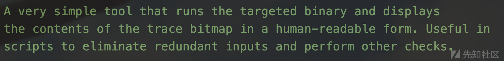

#### main函数分析

从main函数整体结构对整个hitcount规整框架进行发散分析

##### 参数定义和初始化

```
int main(int argc, char** argv) {
  s32 opt;
  u8  mem_limit_given = 0, timeout_given = 0, qemu_mode = 0;
  u32 tcnt;//程序流程中边统计
  char** use_argv;
  doc_path = access(DOC_PATH, F_OK) ? "docs" : DOC_PATH;
```

##### 调用getopt()处理命令行参数

case分类:

* -o: 输出文件名
* -m:内存限制
* -t:超时时间
* -e:只记录边（edges\_only）
* -q:静默模式
* -Z:特殊模式，用于 afl-cmin
* -A:输入文件，afl-cmin 使用
* -Q:QEMU 模式
* -b:输出原始 bitmap
* -c:保留 core 文件
* -V:显示版本并退出
* default:出错时显示用法

```
while ((opt = getopt(argc,argv,"+o:m:t:A:eqZQbcV")) > 0)
    switch (opt) {
      case 'o':
        if (out_file) FATAL("Multiple -o options not supported");
        out_file = optarg;
        break;
      case 'm': {
          u8 suffix = 'M';
          if (mem_limit_given) FATAL("Multiple -m options not supported");
          mem_limit_given = 1;
          if (!strcmp(optarg, "none")) {
            mem_limit = 0;
            break;
          }
          if (sscanf(optarg, "%llu%c", &mem_limit, &suffix) < 1 ||
              optarg[0] == '-') FATAL("Bad syntax used for -m");
          switch (suffix) {
            case 'T': mem_limit *= 1024 * 1024; break;
            case 'G': mem_limit *= 1024; break;
            case 'k': mem_limit /= 1024; break;
            case 'M': break;
            default:  FATAL("Unsupported suffix or bad syntax for -m");
          }
          if (mem_limit < 5) FATAL("Dangerously low value of -m");
          if (sizeof(rlim_t) == 4 && mem_limit > 2000)
            FATAL("Value of -m out of range on 32-bit systems");
        }
        break;
      case 't':
        if (timeout_given) FATAL("Multiple -t options not supported");
        timeout_given = 1;
        if (strcmp(optarg, "none")) {
          exec_tmout = atoi(optarg);
          if (exec_tmout < 20 || optarg[0] == '-')
            FATAL("Dangerously low value of -t");
        }
        break;
      case 'e':
        if (edges_only) FATAL("Multiple -e options not supported");
        edges_only = 1;
        break;
      case 'q':
        if (quiet_mode) FATAL("Multiple -q options not supported");
        quiet_mode = 1;
        break;
      case 'Z':
        /* This is an undocumented option to write data in the syntax expected
           by afl-cmin. Nobody else should have any use for this. */
        cmin_mode  = 1;
        quiet_mode = 1;
        break;
      case 'A':
        /* Another afl-cmin specific feature. */
        at_file = optarg;
        break;
      case 'Q':
        if (qemu_mode) FATAL("Multiple -Q options not supported");
        if (!mem_limit_given) mem_limit = MEM_LIMIT_QEMU;
        qemu_mode = 1;
        break;
      case 'b':
        /* Secret undocumented mode. Writes output in raw binary format
           similar to that dumped by afl-fuzz in <out_dir/queue/fuzz_bitmap. */
        binary_mode = 1;
        break;
      case 'c':
        if (keep_cores) FATAL("Multiple -c options not supported");
        keep_cores = 1;
        break;
      case 'V':
        show_banner();
        exit(0);
      default:
        usage(argv[0]);
    }
```

##### 目标程序校验

检验是否存在指定目标程序或者 -o 输出文件➡️否则打印help文件

if (optind == argc || !out\_file) usage(argv[0]);

##### 初始化环境

创建共享内存空间+设定崩溃,超时信号收集+环境变量配置申请

```
setup_shm();
  setup_signal_handlers();
  set_up_environment();
```

##### 路径查找保存

查找并保存目标可执行文件的路径➡️optind:目标程序

find\_binary(argv[optind]);

##### show banner信息

```
if (!quiet_mode) {
    show_banner();
    ACTF("Executing '%s'...
", target_path);
  }
```

非静默模式下,显示版本以及执行信息

##### 输入文件(方式)检验

detect\_file\_args(argv + optind);

检查目标程序是否使用了 @@ 表示输入文件

##### qemu模式检验及运行

```
if (qemu_mode)
    use_argv = get_qemu_argv(argv[0], argv + optind, argc - optind);
  else
    use_argv = argv + optind;
```

* 调用qemu模式:处理argv参数通过qemu启动程序
* 非调用qemu模式:直接使用argv参数

程序运行

run\_target(use\_argv);

结果写入

tcnt = write\_results();

##### 输出结果分析

```
if (!quiet_mode) {
    if (!tcnt) FATAL("No instrumentation detected" cRST);
    OKF("Captured %u tuples in '%s'." cRST, tcnt, out_file);
  }
  exit(child_crashed * 2 + child_timed_out);
}
```

无路径边缘检测➡️程序未被成功插桩

有路径边缘检测➡️打印成功数据分析

#### hit count分桶

这里的实现逻辑与前面的数据规整是一样的

针对每条路径的信息进行统计,对该数据进行规整,不同路径信息进行统一规范以减小路径的信息差异

两种模式的数据规整

* 人类可观式(afl-showmap):桶 id 是从 0 到 8 的自然数
* 二进制模式(afl-tmin):桶 id 与 afl-tmin 是一致的

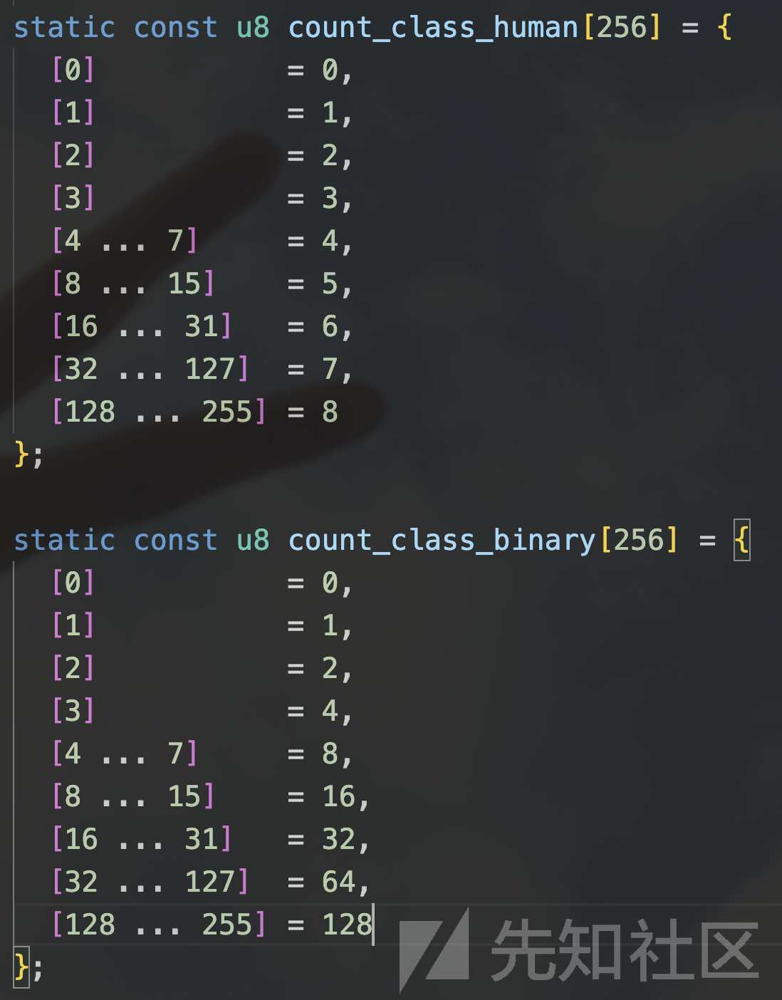

#### write\_results 函数

将所有命中的边都输出➡️%06u:%u(占位符)保证每一行的输出都为8个字符(人类可观模式)

注意:每条边的hit count对应一个字节，但是当hit count为255时,增加1,会导致hitcount归零➡️即是这条边没有被命中过(为了保证计算速度牺牲部分的数据量)

```
static u32 write_results(void) {
  s32 fd;
  u32 i, ret = 0;
  u8  cco = !!getenv("AFL_CMIN_CRASHES_ONLY"),
      caa = !!getenv("AFL_CMIN_ALLOW_ANY");
  if (!strncmp(out_file, "/dev/", 5)) {
    fd = open(out_file, O_WRONLY, 0600);
    if (fd < 0) PFATAL("Unable to open '%s'", out_file);
  } else if (!strcmp(out_file, "-")) {
    fd = dup(1);
    if (fd < 0) PFATAL("Unable to open stdout");
  } else {
    unlink(out_file); /* Ignore errors */
    fd = open(out_file, O_WRONLY | O_CREAT | O_EXCL, 0600);
    if (fd < 0) PFATAL("Unable to create '%s'", out_file);
  }
  if (binary_mode) {
    for (i = 0; i < MAP_SIZE; i++)
      if (trace_bits[i]) ret++;
    ck_write(fd, trace_bits, MAP_SIZE, out_file);
    close(fd);
  } else {
    FILE* f = fdopen(fd, "w");
    if (!f) PFATAL("fdopen() failed");
    for (i = 0; i < MAP_SIZE; i++) {
      if (!trace_bits[i]) continue;
      ret++;
      if (cmin_mode) {
        if (child_timed_out) break;
        if (!caa && child_crashed != cco) break
        fprintf(f, "%u%u
", trace_bits[i], i);
      } else fprintf(f, "%06u:%u
", i, trace_bits[i]);
    }
    fclose(f);
  }
  return ret;
}
```

### afl-ananlyze

afl在针对测试magic number,length等数据时效率并不太高,因此针对这部分的变异数据进行测试

#### main函数

解析传入参数➡️检查环境变量配置➡️find target程序➡️进行一次dry run测试➡️反馈正常则进入正常分析并退出

重要逻辑存在analyze函数中

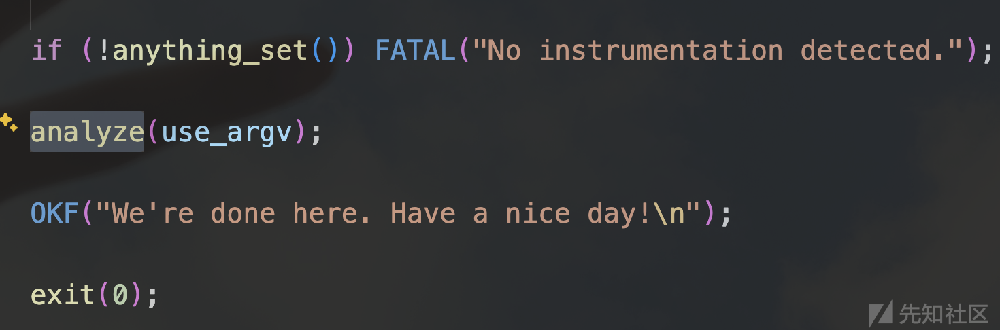

```
int main(int argc, char** argv) {
  s32 opt;
  u8  mem_limit_given = 0, timeout_given = 0, qemu_mode = 0;
  char** use_argv;

  // 检查 docs 目录是否存在
  doc_path = access(DOC_PATH, F_OK) ? "docs" : DOC_PATH;

  // 打印程序标题
  SAYF(cCYA "afl-analyze " cBRI VERSION cRST " by <lcamtuf@google.com>
");

  // 解析命令行参数
  while ((opt = getopt(argc, argv, "+i:f:m:t:eQV")) > 0)
    switch (opt) {
      case 'i': // 指定输入文件
        if (in_file) FATAL("Multiple -i options not supported");
        in_file = optarg;
        break;
      case 'f': // 指定程序输入文件（重定向stdin）
        if (prog_in) FATAL("Multiple -f options not supported");
        use_stdin = 0;
        prog_in = optarg;
        break;
      case 'e': // 只分析边（edges only 模式）
        if (edges_only) FATAL("Multiple -e options not supported");
        edges_only = 1;
        break;
      case 'm': { // 设置内存限制
          u8 suffix = 'M';
          if (mem_limit_given) FATAL("Multiple -m options not supported");
          mem_limit_given = 1;
          if (!strcmp(optarg, "none")) {
            mem_limit = 0;
            break;
          }
          if (sscanf(optarg, "%llu%c", &mem_limit, &suffix) < 1 ||
              optarg[0] == '-') FATAL("Bad syntax used for -m");

          switch (suffix) { // 支持 T (TB)、G (GB)、M (MB)、k (KB)
            case 'T': mem_limit *= 1024 * 1024; break;
            case 'G': mem_limit *= 1024; break;
            case 'k': mem_limit /= 1024; break;
            case 'M': break;
            default:  FATAL("Unsupported suffix or bad syntax for -m");
          }

          if (mem_limit < 5) FATAL("Dangerously low value of -m");
          if (sizeof(rlim_t) == 4 && mem_limit > 2000)
            FATAL("Value of -m out of range on 32-bit systems");
        }
        break;
      case 't': // 设置超时时间
        if (timeout_given) FATAL("Multiple -t options not supported");
        timeout_given = 1;
        exec_tmout = atoi(optarg);
        if (exec_tmout < 10 || optarg[0] == '-')
          FATAL("Dangerously low value of -t");
        break;
      case 'Q': // 启动 QEMU 模式
        if (qemu_mode) FATAL("Multiple -Q options not supported");
        if (!mem_limit_given) mem_limit = MEM_LIMIT_QEMU;
        qemu_mode = 1;
        break;
      case 'V': // 打印版本信息然后退出
        exit(0);
      default: // 参数错误，显示用法
        usage(argv[0]);
    }

  // 检查必须的参数
  if (optind == argc || !in_file) usage(argv[0]);

  // 检查是否启用十六进制偏移显示（环境变量）
  use_hex_offsets = !!getenv("AFL_ANALYZE_HEX");

  // 初始化共享内存
  setup_shm();

  // 安装信号处理器
  setup_signal_handlers();

  // 设置运行环境（比如 CPU亲和性、性能模式等）
  set_up_environment();

  // 找到并检查待测目标程序
  find_binary(argv[optind]);

  // 检测目标程序是否需要额外参数替换
  detect_file_args(argv + optind);

  // 如果启用QEMU模式，准备QEMU包装器
  if (qemu_mode)
    use_argv = get_qemu_argv(argv[0], argv + optind, argc - optind);
  else
    use_argv = argv + optind;

  SAYF("
");

  // 读取初始测试用例（in_file）
  read_initial_file();

  // 执行一次干跑（dry run），确保程序能跑通
  ACTF("Performing dry run (mem limit = %llu MB, timeout = %u ms%s)...",
       mem_limit, exec_tmout, edges_only ? ", edges only" : "");
  run_target(use_argv, in_data, in_len, 1);

  // 检查干跑时是否超时
  if (child_timed_out)
    FATAL("Target binary times out (adjusting -t may help).");

  // 检查目标程序是否有插桩点
  if (!anything_set()) FATAL("No instrumentation detected.");

  // 开始正式分析输入文件
  analyze(use_argv);

  OKF("We're done here. Have a nice day!
");

  exit(0);
}
```

#### analyze函数

```
/* Actually analyze! */

static void analyze(char** argv) {

  u32 i;
  u32 boring_len = 0, prev_xff = 0, prev_x01 = 0, prev_s10 = 0, prev_a10 = 0;

  u8* b_data = ck_alloc(in_len + 1);
  u8  seq_byte = 0;

  b_data[in_len] = 0xff; /* Intentional terminator. */

  ACTF("Analyzing input file (this may take a while)...
");

#ifdef USE_COLOR
  show_legend();
#endif /* USE_COLOR */

  for (i = 0; i < in_len; i++) {

    u32 xor_ff, xor_01, sub_10, add_10;
    u8  xff_orig, x01_orig, s10_orig, a10_orig;

    /* Perform walking byte adjustments across the file. We perform four
       operations designed to elicit some response from the underlying
       code. */

    // a^0xff
    in_data[i] ^= 0xff;
    xor_ff = run_target(argv, in_data, in_len, 0);

    // a^0x01
    in_data[i] ^= 0xfe;
    xor_01 = run_target(argv, in_data, in_len, 0);

    // a-0x10
    in_data[i] = (in_data[i] ^ 0x01) - 0x10;
    sub_10 = run_target(argv, in_data, in_len, 0);

    // a+0x10
    in_data[i] += 0x20;
    add_10 = run_target(argv, in_data, in_len, 0);
    in_data[i] -= 0x10;

    // 观察 4 次运行路径与原始路径是否相同
    /* Classify current behavior. */
    xff_orig = (xor_ff == orig_cksum);
    x01_orig = (xor_01 == orig_cksum);
    s10_orig = (sub_10 == orig_cksum);
    a10_orig = (add_10 == orig_cksum);

    if (xff_orig && x01_orig && s10_orig && a10_orig) {
      // 4 次变异都不改变路径，则这个位置不重要
      b_data[i] = RESP_NONE;
      boring_len++;
    } else if (xff_orig || x01_orig || s10_orig || a10_orig) {
      // 有至少一个不改变路径的变异，说明这个位置不关键，可以变异
      b_data[i] = RESP_MINOR;
      boring_len++;
    } else if (xor_ff == xor_01 && xor_ff == sub_10 && xor_ff == add_10) {
      // 4 次实验都与原路径不同，且这 4 次实验的路径一致，说明这个地方不能改
      // 典型场景是 magic 检查，magic 不对就退出程序
      b_data[i] = RESP_FIXED;
    } else b_data[i] = RESP_VARIABLE;
    // 4 次实验都与原路径不同，且各次实验的执行路径也不一致，说明这位置对控制流很重要

    // 看这个位置与前一个位置的行为是否完全不一样，给 field 划定边界
    /* When all checksums change, flip most significant bit of b_data. */
    if (prev_xff != xor_ff && prev_x01 != xor_01 &&
        prev_s10 != sub_10 && prev_a10 != add_10) seq_byte ^= 0x80;

    b_data[i] |= seq_byte;

    prev_xff = xor_ff;
    prev_x01 = xor_01;
    prev_s10 = sub_10;
    prev_a10 = add_10;

  } 

  dump_hex(in_data, in_len, b_data);

  SAYF("
");

  OKF("Analysis complete. Interesting bits: %0.02f%% of the input file.",
      100.0 - ((double)boring_len * 100) / in_len);

  if (exec_hangs)
    WARNF(cLRD "Encountered %u timeouts - results may be skewed." cRST,
          exec_hangs);

  ck_free(b_data);

}
```

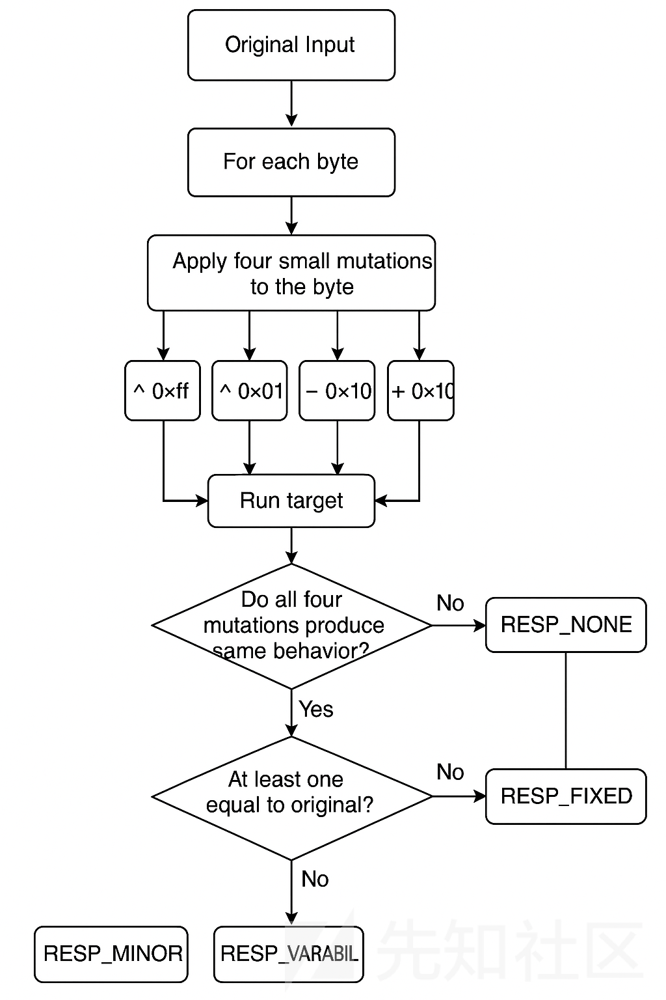

遍历每个字节➡️对当前字节进行四种变异(^0x01/0xff,+/-0x10)➡️分别记录每次运行路径数据➡️记录不同变异对应的路径变化情况➡️输出变异数据对应路径情况结果

基于字段中/外(跨字段)更改做了变化标识(同一字段内在变异后出现的路径偏差与跨字段变异之间的偏差通常来讲更加微小)

#### dump\_hex 函数

```
static void dump_hex(u8* buf, u32 len, u8* b_data) {
  u32 i;

  for (i = 0; i < len; i++) {
    u32 rlen = 1, off;
    u8  rtype = b_data[i] & 0x0f; // 当前字节初步推断的类型

    // 找到连续行为一致（同一 field）的块，并确定整个块的最终标签（取优先级最高的）
    while (i + rlen < len && (b_data[i] >> 7) == (b_data[i + rlen] >> 7)) {
      if (rtype < (b_data[i + rlen] & 0x0f)) rtype = b_data[i + rlen] & 0x0f;
      rlen++;
    }

    // 如果块是 FIXED 类型，进一步细分类（长度字段、checksum等）
    if (rtype == RESP_FIXED) {
      switch (rlen) {
        case 2: {
          u16 val = *(u16*)(in_data + i);
          if (val && (val <= in_len || SWAP16(val) <= in_len)) rtype = RESP_LEN;
          else if (val && abs(in_data[i] - in_data[i + 1]) > 32) rtype = RESP_CKSUM;
          break;
        }
        case 4: {
          u32 val = *(u32*)(in_data + i);
          if (val && (val <= in_len || SWAP32(val) <= in_len)) rtype = RESP_LEN;
          else if (val && (in_data[i] >> 7 != in_data[i + 1] >> 7 ||
                           in_data[i] >> 7 != in_data[i + 2] >> 7 ||
                           in_data[i] >> 7 != in_data[i + 3] >> 7)) rtype = RESP_CKSUM;
          break;
        }
        case 1: case 3: case 5 ... MAX_AUTO_EXTRA - 1:
          // 短小的 fixed 块，不再细分
          break;
        default:
          // 长且固定的块，怀疑是被 checksum 保护的，标记为 SUSPECT
          rtype = RESP_SUSPECT;
      }
    }

    // 输出块的内容，每16个字节换行并标出偏移
    for (off = 0; off < rlen; off++) {
      if (!((i + off) % 16)) {
        if (off) SAYF(cRST cLCY ">");
        if (use_hex_offsets)
          SAYF(cRST cGRA "%s[%06x] " cRST, (i + off) ? "
" : "", i + off);
        else
          SAYF(cRST cGRA "%s[%06u] " cRST, (i + off) ? "
" : "", i + off);
      }

      // 根据块类型设置颜色
      switch (rtype) {
        case RESP_NONE:     SAYF(cLGR bgGRA); break;
        case RESP_MINOR:    SAYF(cBRI bgGRA); break;
        case RESP_VARIABLE: SAYF(cBLK bgCYA); break;
        case RESP_FIXED:    SAYF(cBLK bgMGN); break;
        case RESP_LEN:      SAYF(cBLK bgLGN); break;
        case RESP_CKSUM:    SAYF(cBLK bgYEL); break;
        case RESP_SUSPECT:  SAYF(cBLK bgLRD); break;
      }

      // 打印当前字节（可显示为可见字符或十六进制）
      show_char(in_data[i + off]);

      if (off != rlen - 1 && (i + off + 1) % 16) SAYF(" "); else SAYF(cRST " ");
    }

    i += rlen - 1; // 跳到块尾，准备处理下一个块
  }

  SAYF(cRST "
"); // 输出结束，重置颜色
}
```

基本分区流程

```
开始
  |
  v
遍历每个字节 (i from 0 to len)
  |
  v
确定块 (rlen)：
  - 连续相同 seq_bit
  - 块内取优先级最高的标签 rtype
  |
  v
进一步细分 rtype (仅在 rtype == RESP_FIXED)：
  - 2字节或4字节：判断是 length / checksum
  - 其他情况：可能是被校验的字段
  |
  v
打印块：
  - 每16个字节换行显示偏移
  - 根据 rtype 设置颜色
  |
  v
更新 i += rlen，处理下一个块
  |
  v
结束
```

* length=2/4字节,length<input length➡️length字段
* length=2字节,两个字节差距>32字节➡️chaecksum字段
* length=4字节,first byte‘MSB different with other 3byte➡️checksum字段
* length<32 and odd number➡️magic字段(不更改标签)
* all not➡️checksum字段

### afl-fuzz

### 样本变异

* 确定性变异
* 不确定性变异

AFL认为在拥有覆盖制导的路径算法的前提下,简单的路径变异算法(只需要提供足够的变异数据即可)就能满足fuzz的需求

#### 按位翻转(bitflip)

将数据转换为n个bit位,然后按照每次按位翻转1个...4个bit进行数据的变异

```
原始数据:1011
翻转1个bit:0011 1111 1001 1010
翻转2个bit:0111 1101 1000
翻转3个bit:0101 1100
翻转4个bit:0100
```

##### 实现主体

* 1~4个位翻转→调用FLIP\_BIT逐位翻转,再调用common\_fuzz\_stuff进行数据测试

以单个位翻转为例:

```
/* 单个位翻转 */
stage_short = "flip1";
stage_max   = len << 3;  // 总共需要翻转的位数，即字节数乘以8
stage_name  = "bitflip 1/1";
stage_val_type = STAGE_VAL_NONE;
orig_hit_cnt = queued_paths + unique_crashes;  // 记录初始的路径和崩溃数
prev_cksum = queue_cur->exec_cksum;  // 保存当前队列条目的执行校验和
for (stage_cur = 0; stage_cur < stage_max; stage_cur++) {
  stage_cur_byte = stage_cur >> 3;  // 当前处理的字节位置
  FLIP_BIT(out_buf, stage_cur);  // 翻转当前位
  if (common_fuzz_stuff(argv, out_buf, len)) goto abandon_entry;  // 执行模糊测试，如果失败则跳转到 abandon_entry
  FLIP_BIT(out_buf, stage_cur);  // 恢复当前位
  /* 在翻转每个字节的最低有效位时，检测可能的语法标记。 */
  if (!dumb_mode && (stage_cur & 7) == 7) {  // 每处理完一个字节的最低有效位时进行检查
    u32 cksum = hash32(trace_bits, MAP_SIZE, HASH_CONST);  // 计算当前执行路径的校验和
    if (stage_cur == stage_max - 1 && cksum == prev_cksum) {
      /* 如果在文件末尾且仍在收集字符串，则抓取最后一个字符并强制输出。 */
      if (a_len < MAX_AUTO_EXTRA) a_collect[a_len] = out_buf[stage_cur >> 3];  // 收集最后一个字符
      a_len++;
      if (a_len >= MIN_AUTO_EXTRA && a_len <= MAX_AUTO_EXTRA)
        maybe_add_auto(a_collect, a_len);  // 如果收集的字符串长度在允许范围内，则添加到自动字典中
    } else if (cksum != prev_cksum) {
      /* 如果校验和已更改，检查是否有值得收集的内容。 */
      if (a_len >= MIN_AUTO_EXTRA && a_len <= MAX_AUTO_EXTRA)
        maybe_add_auto(a_collect, a_len);  // 如果收集的字符串长度在允许范围内，则添加到自动字典中
      a_len = 0;  // 重置收集的字符串长度
      prev_cksum = cksum;  // 更新前一个校验和
    }
    /* 继续收集字符串，但仅当位翻转确实产生了影响时。 */
    if (cksum != queue_cur->exec_cksum) {  // 如果当前校验和与初始校验和不同
      if (a_len < MAX_AUTO_EXTRA) a_collect[a_len] = out_buf[stage_cur >> 3];  // 收集当前字符
      a_len++;
    }
  }
}
new_hit_cnt = queued_paths + unique_crashes;  // 更新路径和崩溃数
stage_finds[STAGE_FLIP1]  += new_hit_cnt - orig_hit_cnt;  // 记录在此阶段找到的新路径和崩溃数
stage_cycles[STAGE_FLIP1] += stage_max;  // 记录此阶段的循环次数
```

* 效应器映射→用于筛选优秀的变异数据进行更复杂的数据变异

依旧以一个字节的翻转为例

```
/* 效应器映射设置 */

#define EFF_APOS(_p)          ((_p) >> EFF_MAP_SCALE2)  // 计算效应器映射中的位置
#define EFF_REM(_x)           ((_x) & ((1 << EFF_MAP_SCALE2) - 1))  // 计算剩余部分
#define EFF_ALEN(_l)          (EFF_APOS(_l) + !!EFF_REM(_l))  // 计算效应器映射的长度
#define EFF_SPAN_ALEN(_p, _l) (EFF_APOS((_p) + (_l) - 1) - EFF_APOS(_p) + 1)  // 计算效应器映射的跨度

/* 初始化效应器映射 */

eff_map = ck_alloc(EFF_ALEN(len));  // 为效应器映射分配内存
eff_map[0] = 1;  // 标记第一个字节为有效

if (EFF_APOS(len - 1) != 0) {  // 如果最后一个字节的位置不在第一个位置
  eff_map[EFF_APOS(len - 1)] = 1;  // 标记最后一个字节为有效
  eff_cnt++;  // 增加有效字节计数
}

/* 单字节翻转 */

stage_name = "bitflip 8/8";  // 设置阶段名称
stage_short = "flip8";  // 设置阶段简短名称
stage_max = len;  // 设置最大循环次数为输入长度

orig_hit_cnt = new_hit_cnt;  // 记录初始的路径和崩溃数

for (stage_cur = 0; stage_cur < stage_max; stage_cur++) {  // 翻转字节操作

  stage_cur_byte = stage_cur;  // 当前处理的字节位置

  out_buf[stage_cur] ^= 0xFF;  // 翻转当前字节

  if (common_fuzz_stuff(argv, out_buf, len)) goto abandon_entry;  // 执行模糊测试，如果失败则跳转到 abandon_entry

  /* 识别对当前执行路径没有影响的字节 */

  if (!eff_map[EFF_APOS(stage_cur)]) {  // 如果当前字节未被标记为有效

    u32 cksum;

    if (!dumb_mode && len >= EFF_MIN_LEN)
      cksum = hash32(trace_bits, MAP_SIZE, HASH_CONST);  // 计算当前执行路径的校验和
    else
      cksum = ~queue_cur->exec_cksum;  // 使用反转的初始校验和

    if (cksum != queue_cur->exec_cksum) {  // 如果当前校验和与初始校验和不同
      eff_map[EFF_APOS(stage_cur)] = 1;  // 标记当前字节为有效
      eff_cnt++;  // 增加有效字节计数
    }

  }

  out_buf[stage_cur] ^= 0xFF;  // 恢复当前字节

}

/* 如果效应器映射过于密集，则标记整个映射 */

if (eff_cnt != EFF_ALEN(len) &&
    eff_cnt * 100 / EFF_ALEN(len) > EFF_MAX_PERC) {

  memset(eff_map, 1, EFF_ALEN(len));  // 将整个映射标记为有效

  blocks_eff_select += EFF_ALEN(len);  // 增加选择的有效块数

} else {

  blocks_eff_select += eff_cnt;  // 增加选择的有效字节数

}

blocks_eff_total += EFF_ALEN(len);  // 增加总的有效块数

new_hit_cnt = queued_paths + unique_crashes;  // 更新路径和崩溃数

stage_finds[STAGE_FLIP8] += new_hit_cnt - orig_hit_cnt;  // 记录在此阶段找到的新路径和崩溃数
stage_cycles[STAGE_FLIP8] += stage_max;  // 记录此阶段的循环次数
```

##### 辅助算法

针对这个变异算法,最新版本的afl-fuzz还有辅助算法(就是检测某变异数据变异数据是否可以通过按位翻转得到,避免去测试其他变异而导致的性能消耗)

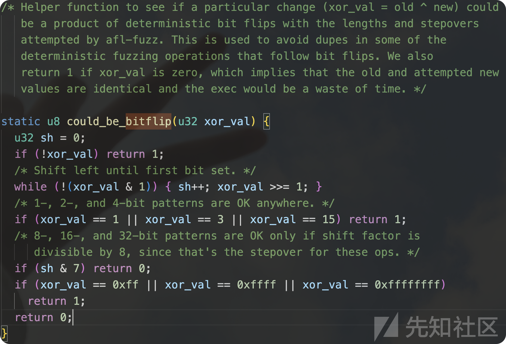

#### 算术增减(arithmetic)

针对输入数据进行加减操作，以检测这些变异是否会引起被测程序的行为变化

三个阶段：

* 8位算术运算
* 16位算术运算
* 32位算术运算调用

最后common\_fuzz\_stuff函数进行测试

以8位算数进行分析

```
// 设置阶段名称和简短名称
stage_name  = "arith 8/8";
stage_short = "arith8";
// 初始化当前阶段的计数器和最大值
stage_cur   = 0;
stage_max   = 2 * len * ARITH_MAX;  // 每个字节进行加减操作，乘以2表示加和减，乘以 ARITH_MAX 表示最大加减值
// 设置阶段值类型为小端
stage_val_type = STAGE_VAL_LE;
// 记录初始的路径和崩溃数
orig_hit_cnt = new_hit_cnt;
// 遍历输入缓冲区的每个字节
for (i = 0; i < len; i++) {
  // 保存当前字节的原始值
  u8 orig = out_buf[i];
  /* 咨询效应器映射 */
  // 如果当前字节未被标记为有效，则跳过该字节
  if (!eff_map[EFF_APOS(i)]) {
    stage_max -= 2 * ARITH_MAX;  // 减少总的最大值
    continue;
  }
  // 设置当前处理的字节位置
  stage_cur_byte = i;
  // 对当前字节进行加减操作
  for (j = 1; j <= ARITH_MAX; j++) {
    // 计算加法后的异或值
    u8 r = orig ^ (orig + j);
    /* 仅当结果不能是位翻转的产物时才进行算术运算。 */
    // 如果异或结果不是通过位翻转得到的，则进行加法操作
    if (!could_be_bitflip(r)) {
      // 设置当前阶段的值
      stage_cur_val = j;
      // 对当前字节进行加法操作
      out_buf[i] = orig + j;
      // 执行模糊测试，如果失败则跳转到 abandon_entry
      if (common_fuzz_stuff(argv, out_buf, len)) goto abandon_entry;
      // 增加当前阶段的计数器
      stage_cur++;
    } else stage_max--;  // 否则减少总的最大值
    // 计算减法后的异或值
    r =  orig ^ (orig - j);
    // 如果异或结果不是通过位翻转得到的，则进行减法操作
    if (!could_be_bitflip(r)) {
      // 设置当前阶段的值
      stage_cur_val = -j;
      // 对当前字节进行减法操作
      out_buf[i] = orig - j;
      // 执行模糊测试，如果失败则跳转到 abandon_entry
      if (common_fuzz_stuff(argv, out_buf, len)) goto abandon_entry;
      // 增加当前阶段的计数器
      stage_cur++;
    } else stage_max--;  // 否则减少总的最大值
    // 恢复当前字节的原始值
    out_buf[i] = orig;
  }
}
// 更新路径和崩溃数
new_hit_cnt = queued_paths + unique_crashes;
// 记录在此阶段找到的新路径和崩溃数
stage_finds[STAGE_ARITH8]  += new_hit_cnt - orig_hit_cnt;
// 记录此阶段的循环次数
stage_cycles[STAGE_ARITH8] += stage_max;
```

#### 特殊值测试(interset)

输入数据进行特定值的插入和替换，以检测这些变异是否会引起被测程序的行为变化(常见的边界值或特殊值)

以8bit的数据插入为例:

设置interesting数据就是如下数据:

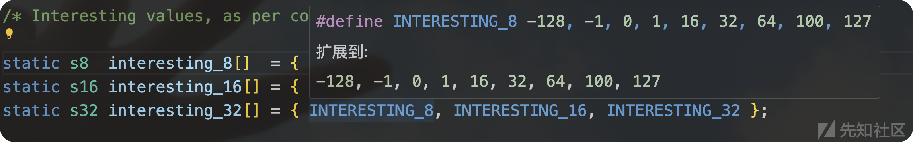

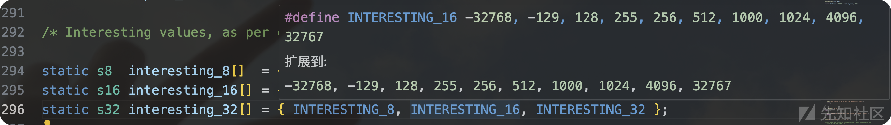

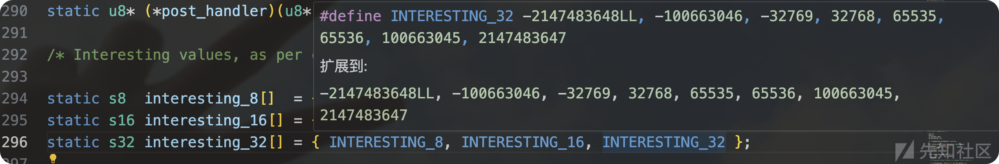

```
// 设置阶段名称和简短名称
stage_name  = "interest 8/8";
stage_short = "int8";
// 初始化当前阶段的计数器和最大值
stage_cur   = 0;
stage_max   = len * sizeof(interesting_8);  // 每个字节尝试所有有趣值
// 设置阶段值类型为小端
stage_val_type = STAGE_VAL_LE;
// 记录初始的路径和崩溃数
orig_hit_cnt = new_hit_cnt;
/* 设置 8 位整数 */
for (i = 0; i < len; i++) {
  // 保存当前字节的原始值
  u8 orig = out_buf[i];
  /* 咨询效应器映射 */
  // 如果当前字节未被标记为有效，则跳过该字节
  if (!eff_map[EFF_APOS(i)]) {
    stage_max -= sizeof(interesting_8);  // 减少总的最大值
    continue;
  }
  // 设置当前处理的字节位置
  stage_cur_byte = i;
  // 尝试替换为有趣值
  for (j = 0; j < sizeof(interesting_8); j++) {
    /* 如果值可能是位翻转或算术运算的结果，则跳过 */
    if (could_be_bitflip(orig ^ (u8)interesting_8[j]) ||
        could_be_arith(orig, (u8)interesting_8[j], 1)) {
      stage_max--;  // 减少总的最大值
      continue;
    }
    // 设置当前阶段的值
    stage_cur_val = interesting_8[j];
    // 将当前字节替换为有趣值
    out_buf[i] = interesting_8[j];
    // 执行模糊测试，如果失败则跳转到 abandon_entry
    if (common_fuzz_stuff(argv, out_buf, len)) goto abandon_entry;
    // 恢复当前字节的原始值
    out_buf[i] = orig;
    // 增加当前阶段的计数器
    stage_cur++;
  }
}
// 更新路径和崩溃数
new_hit_cnt = queued_paths + unique_crashes;
// 记录在此阶段找到的新路径和崩溃数
stage_finds[STAGE_INTEREST8]  += new_hit_cnt - orig_hit_cnt;
// 记录此阶段的循环次数
stage_cycles[STAGE_INTEREST8] += stage_max;
```

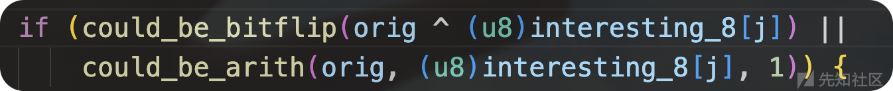

这里就是前面说的调用辅助函数,减少性能消耗

#### 字典替换(DICTIONARY)

通过使用用户提供的字典条目进行覆盖操作，可以检测这些预定义的输入片段是否会引起被测程序的行为变化

```
/********************
 * DICTIONARY STUFF *
 ********************/
// 如果没有用户提供的字典条目，则跳过这个阶段
if (!extras_cnt) goto skip_user_extras;
/* 使用用户提供的字典条目进行覆盖操作 */
// 设置阶段名称和简短名称
stage_name  = "user extras (over)";
stage_short = "ext_UO";
// 初始化当前阶段的计数器和最大值
stage_cur   = 0;
stage_max   = extras_cnt * len;  // 每个字节尝试所有字典条目
// 设置阶段值类型为无
stage_val_type = STAGE_VAL_NONE;
// 记录初始的路径和崩溃数
orig_hit_cnt = new_hit_cnt;
// 遍历输入缓冲区的每个字节
for (i = 0; i < len; i++) {
  // 初始化上一个字典条目的长度为 0
  u32 last_len = 0;
  // 设置当前处理的字节位置
  stage_cur_byte = i;
  // 尝试使用字典条目进行覆盖
 /* Extras are sorted by size, from smallest to largest. This means
       that we don't have to worry about restoring the buffer in
       between writes at a particular offset determined by the outer
       loop.
     无需担心后续的缓冲区的恢复,因为从小到大进行排序
     例如:条目按大小从小到大排序
     extra1：长度为 2
     extra2：长度为 4
     extra3：长度为 6
首先处理 extra1，然后是 extra2，最后是 extra3
由于 extra2 和 extra3 的长度都大于 extra1，它们会覆盖 extra1 的内容，因此不需要在每次写入后恢复缓冲区*/
  for (j = 0; j < extras_cnt; j++) {
    // 跳过长度大于剩余字节数或与上一个字典条目长度相同的条目
    if (extras[j].len > len - i || extras[j].len == last_len) continue;
    // 更新上一个字典条目的长度
    last_len = extras[j].len;
    // 将字典条目复制到当前字节位置
    memcpy(out_buf + i, extras[j].data, extras[j].len);
    // 执行模糊测试，如果失败则跳转到 abandon_entry
    if (common_fuzz_stuff(argv, out_buf, len)) goto abandon_entry;
    // 增加当前阶段的计数器
    stage_cur++;
  }
}
// 更新路径和崩溃数
new_hit_cnt = queued_paths + unique_crashes;

// 记录在此阶段找到的新路径和崩溃数
stage_finds[STAGE_EXTRAS_UO]  += new_hit_cnt - orig_hit_cnt;
// 记录此阶段的循环次数
stage_cycles[STAGE_EXTRAS_UO] += stage_max;
skip_user_extras:
```

TIPS

针对程序中的特殊的绕过字符(路径制导没有反馈导致字节变异出来这样的数据异常困难)

```
if(stmcmp(buf(“adcdefg”))	{
.....
}
```

除了编译对应的字典(AFL++存储部分通用字典)同时也可以针对这里的stmcmp函数进行插桩(利用llvm ir),然后逐步测试出这里的buf数据(AFL++的特性)

#### 随机变异(havoc)

对输入数据进行各种随机变异操作，进一步测试输入空间(支持多种变异方法)

1. 单个位翻转 (Single Bit Flip)

随机翻转输入数据的一个位

```
case 0:
  FLIP_BIT(out_buf, UR(temp_len << 3));
  break;
```

2. 设置字节为有趣值 (Set Byte to Interesting Value)

将输入数据的一个字节设置为预定义的有趣值

```
case 1:
  out_buf[UR(temp_len)] = interesting_8[UR(sizeof(interesting_8))];
  break;
```

3. 设置字为有趣值 (Set Word to Interesting Value)

将输入数据的一个字（2 字节）设置为预定义的有趣值，随机选择大小端

```
case 2:
  /* 如果输入数据的长度小于 2 字节，则跳过此变异操作 */
  if (temp_len < 2) break;
  /* 随机选择大小端进行操作 */
  if (UR(2)) {
    /* 小端：将输入数据的一个字（2 字节）设置为预定义的有趣值 */
    *(u16*)(out_buf + UR(temp_len - 1)) = interesting_16[UR(sizeof(interesting_16) >> 1)];
  } else {
    /* 大端：将输入数据的一个字（2 字节）设置为预定义的有趣值，并进行字节交换 */
    *(u16*)(out_buf + UR(temp_len - 1)) = SWAP16(interesting_16[UR(sizeof(interesting_16) >> 1)]);
  }
  break;
```

4. 设置双字为有趣值 (Set Dword to Interesting Value)

将输入数据的一个双字（4 字节）设置为预定义的有趣值，随机选择大小端

```
case 3:
  if (temp_len < 4) break;
  if (UR(2)) {
    *(u32*)(out_buf + UR(temp_len - 3)) = interesting_32[UR(sizeof(interesting_32) >> 2)];
  } else {
    *(u32*)(out_buf + UR(temp_len - 3)) = SWAP32(interesting_32[UR(sizeof(interesting_32) >> 2)]);
  }
  break;
```

5. 随机减去字节 (Randomly Subtract from Byte)

从输入数据的一个字节中随机减去一个值

```
case 4:
  out_buf[UR(temp_len)] -= 1 + UR(ARITH_MAX);
  break;
```

6. 随机增加字节 (Randomly Add to Byte)

向输入数据的一个字节中随机增加一个值

```
case 5:
  out_buf[UR(temp_len)] += 1 + UR(ARITH_MAX);
  break;
```

7. 随机减去字 (Randomly Subtract from Word)

从输入数据的一个字（2 字节）中随机减去一个值，随机选择大小端

```
case 6:
  /* 如果输入数据的长度小于 2 字节，则跳过此变异操作 */
  if (temp_len < 2) break;
  /* 随机选择大小端进行操作 */
  if (UR(2)) {
    /* 小端：从输入数据的一个字（2 字节）中随机减去一个值 */
    u32 pos = UR(temp_len - 1);
    *(u16*)(out_buf + pos) -= 1 + UR(ARITH_MAX);

  } else {
    /* 大端：从输入数据的一个字（2 字节）中随机减去一个值，并进行字节交换 */
    u32 pos = UR(temp_len - 1);
    u16 num = 1 + UR(ARITH_MAX);
    *(u16*)(out_buf + pos) = SWAP16(SWAP16(*(u16*)(out_buf + pos)) - num);

  }

  break;
```

8. 随机增加字 (Randomly Add to Word)

向输入数据的一个字（2 字节）中随机增加一个值，随机选择大小端

```
case 7:
  if (temp_len < 2) break;
  if (UR(2)) {
    u32 pos = UR(temp_len - 1);
    *(u16*)(out_buf + pos) += 1 + UR(ARITH_MAX);
  } else {
    u32 pos = UR(temp_len - 1);
    u16 num = 1 + UR(ARITH_MAX);
    *(u16*)(out_buf + pos) = SWAP16(SWAP16(*(u16*)(out_buf + pos)) + num);
  }
  break;
```

9. 随机减去双字 (Randomly Subtract from Dword)

从输入数据的一个双字（4 字节）中随机减去一个值，随机选择大小端

```
case 8:
  if (temp_len < 4) break;
  if (UR(2)) {
    u32 pos = UR(temp_len - 3);
    *(u32*)(out_buf + pos) -= 1 + UR(ARITH_MAX);
  } else {
    u32 pos = UR(temp_len - 3);
    u32 num = 1 + UR(ARITH_MAX);
    *(u32*)(out_buf + pos) = SWAP32(SWAP32(*(u32*)(out_buf + pos)) - num);
  }
  break;
```

10. 随机增加双字 (Randomly Add to Dword)

向输入数据的一个双字（4 字节）中随机增加一个值，随机选择大小端

```
case 9:
  if (temp_len < 4) break;
  if (UR(2)) {
    u32 pos = UR(temp_len - 3);
    *(u32*)(out_buf + pos) += 1 + UR(ARITH_MAX);
  } else {
    u32 pos = UR(temp_len - 3);
    u32 num = 1 + UR(ARITH_MAX);
    *(u32*)(out_buf + pos) = SWAP32(SWAP32(*(u32*)(out_buf + pos)) + num);
  }
  break;
```

11. 随机设置字节为随机值 (Set Random Byte to Random Value)

将输入数据的一个字节设置为随机值

```
case 10:
  out_buf[UR(temp_len)] ^= 1 + UR(255);
  break;
```

12. 删除字节 (Delete Bytes)

从输入数据中删除一个随机长度的块

```
case 11 ... 12: {
  u32 del_from, del_len;
  /* 如果输入数据的长度小于 2 字节，则跳过此变异操作 */
  if (temp_len < 2) break;
  /* 选择要删除的块的长度 */
  del_len = choose_block_len(temp_len - 1);
  /* 选择要删除的块的起始位置 */
  del_from = UR(temp_len - del_len + 1);
  /* 将删除块后的数据向前移动，覆盖删除块 */
  memmove(out_buf + del_from, out_buf + del_from + del_len, temp_len - del_from - del_len);
  /* 更新输入数据的长度 */
  temp_len -= del_len;
  break;
}
```

13. 克隆或插入字节 (Clone or Insert Bytes)

克隆输入数据的一个随机长度的块，或插入一个随机长度的块

```
case 13:
  if (temp_len + HAVOC_BLK_XL < MAX_FILE) { // 确保新长度不超过最大文件大小
    u8 actually_clone = UR(4); // 随机决定是克隆还是插入常量字节
    u32 clone_from, clone_to, clone_len;
    u8* new_buf;
    if (actually_clone) { // 如果是克隆操作
      clone_len = choose_block_len(temp_len); // 选择克隆块的长度
      clone_from = UR(temp_len - clone_len + 1); // 选择克隆块的起始位置
    } else { // 如果是插入常量字节
      clone_len = choose_block_len(HAVOC_BLK_XL); // 选择插入块的长度
      clone_from = 0; // 插入块的起始位置为0
    }
    clone_to = UR(temp_len); // 选择插入位置
    new_buf = ck_alloc_nozero(temp_len + clone_len); // 分配新的缓冲区
    memcpy(new_buf, out_buf, clone_to); // 复制插入位置之前的数据
    if (actually_clone)
      memcpy(new_buf + clone_to, out_buf + clone_from, clone_len); // 复制克隆块
    else
      memset(new_buf + clone_to, UR(2) ? UR(256) : out_buf[UR(temp_len)], clone_len); // 插入常量字节
    memcpy(new_buf + clone_to + clone_len, out_buf + clone_to, temp_len - clone_to); // 复制插入位置之后的数据
    ck_free(out_buf); // 释放旧的缓冲区
    out_buf = new_buf; // 更新缓冲区指针
    temp_len += clone_len; // 更新缓冲区长度
  }
  break;
```

14. 覆盖字节 (Overwrite Bytes)

用一个随机选择的块或固定字节覆盖输入数据的一个块

```
case 14: {
  u32 copy_from, copy_to, copy_len;
  if (temp_len < 2) break; // 如果输入数据的长度小于 2 字节，则跳过此变异操作
  copy_len = choose_block_len(temp_len - 1); // 选择要复制的块的长度
  copy_from = UR(temp_len - copy_len + 1); // 选择要复制的块的起始位置
  copy_to = UR(temp_len - copy_len + 1); // 选择要复制到的目标位置
  if (UR(4)) { // 75% 的概率进行块复制
    if (copy_from != copy_to)
      memmove(out_buf + copy_to, out_buf + copy_from, copy_len); // 将块从源位置复制到目标位置
  } else // 25% 的概率用固定字节覆盖目标位置
    memset(out_buf + copy_to, UR(2) ? UR(256) : out_buf[UR(temp_len)], copy_len); // 用随机值或现有字节覆盖目标位置
  break;
}
```

15. 用字典条目覆盖字节 (Overwrite Bytes with Extra)

用一个字典条目覆盖输入数据的一个块

```
case 15: {
  if (!extras_cnt || (a_extras_cnt && UR(2))) { // 如果没有用户字典,或者有自动检测字典且随机选中自动检测字典
    u32 use_extra = UR(a_extras_cnt); // 随机选择一个自动检测字典条目
    u32 extra_len = a_extras[use_extra].len; // 获取选中条目的长度
    u32 insert_at;
    if (extra_len > temp_len) break; // 如果条目长度大于输入数据长度则跳过
    insert_at = UR(temp_len - extra_len + 1); // 随机选择插入位置
    memcpy(out_buf + insert_at, a_extras[use_extra].data, extra_len); // 将自动检测字典条目复制到选中位置
  } else { // 使用用户提供的字典
    u32 use_extra = UR(extras_cnt); // 随机选择一个用户字典条目
    u32 extra_len = extras[use_extra].len; // 获取选中条目的长度
    u32 insert_at;
    if (extra_len > temp_len) break; // 如果条目长度大于输入数据长度则跳过
    insert_at = UR(temp_len - extra_len + 1); // 随机选择插入位置
    memcpy(out_buf + insert_at, extras[use_extra].data, extra_len); // 将用户字典条目复制到选中位置
  }
  break;
}
```

16. 插入字典条目 (Insert Extra)

在输入数据的一个位置插入一个字典条目

```
case 16: {
  // 声明变量:使用的字典条目索引、条目长度和插入位置
  u32 use_extra, extra_len, insert_at = UR(temp_len + 1); 
  u8* new_buf;

  if (!extras_cnt || (a_extras_cnt && UR(2))) { // 如果没有用户字典,或者有自动检测字典且随机选中自动检测字典
    use_extra = UR(a_extras_cnt); // 随机选择一个自动检测字典条目
    extra_len = a_extras[use_extra].len; // 获取选中条目的长度
    if (temp_len + extra_len >= MAX_FILE) break; // 如果插入后总长度超过最大文件限制则跳过
    new_buf = ck_alloc_nozero(temp_len + extra_len); // 分配新的缓冲区
    memcpy(new_buf, out_buf, insert_at); // 复制插入位置之前的数据
    memcpy(new_buf + insert_at, a_extras[use_extra].data, extra_len); // 在插入位置复制自动检测字典条目
  } else { // 使用用户提供的字典
    use_extra = UR(extras_cnt); // 随机选择一个用户字典条目
    extra_len = extras[use_extra].len; // 获取选中条目的长度
    if (temp_len + extra_len >= MAX_FILE) break; // 如果插入后总长度超过最大文件限制则跳过
    new_buf = ck_alloc_nozero(temp_len + extra_len); // 分配新的缓冲区
    memcpy(new_buf, out_buf, insert_at); // 复制插入位置之前的数据
    memcpy(new_buf + insert_at, extras[use_extra].data, extra_len); // 在插入位置复制用户字典条目
  }

  // 复制插入位置之后的数据到新缓冲区
  memcpy(new_buf + insert_at + extra_len, out_buf + insert_at, temp_len - insert_at);
  ck_free(out_buf); // 释放旧的缓冲区
  out_buf = new_buf; // 更新缓冲区指针
  temp_len += extra_len; // 更新缓冲区长度
  break;
}
```

#### 拼接(SPLICING)

当其他变异策略没有新发现时的最后手段,通过将当前输入与其他输入文件拼接来产生新的测试用例

主体实现:

```
retry_splicing: // 拼接重试标签
  /* 检查是否满足拼接条件:
   * 1. use_splicing 开启拼接功能
   * 2. splice_cycle++ < SPLICE_CYCLES 未超过最大拼接次数
   * 3. queued_paths > 1 队列中至少有两个样本
   * 4. queue_cur->len > 1 当前样本长度大于1字节
   */
  if (use_splicing && splice_cycle++ < SPLICE_CYCLES && queued_paths > 1 && 
      queue_cur->len > 1) {
    struct queue_entry* target; // 目标队列项指针
    u32 tid, split_at; // tid:目标ID, split_at:拼接点
    u8* new_buf; // 新缓冲区
    s32 f_diff, l_diff; // 用于计算差异的变量

    /* 从队列中随机选择一个不同的输入文件作为拼接目标
     * 1. 使用UR()随机选择目标ID
     * 2. 确保不会选择当前文件自身
     */
    do {
      tid = UR(queued_paths);
    } while (tid == current_entry && queued_paths > 1);
    /* 根据随机选择的tid查找目标队列项
     * 1. 首先从队列头开始
     * 2. 每100个项串成一组,快/************
 * SPLICING * - 文件拼接变异策略
 ************/
retry_splicing: // 拼接重试标签
  /* 检查是否满足拼接条件:
   * 1. use_splicing 开启拼接功能
   * 2. splice_cycle++ < SPLICE_CYCLES 未超过最大拼接次数
   * 3. queued_paths > 1 队列中至少有两个样本
   * 4. queue_cur->len > 1 当前样本长度大于1字节
   */
  if (use_splicing && splice_cycle++ < SPLICE_CYCLES && queued_paths > 1 && 
      queue_cur->len > 1) {
    struct queue_entry* target; // 目标队列项指针
    u32 tid, split_at; // tid:目标ID, split_at:拼接点
    u8* new_buf; // 新缓冲区
    s32 f_diff, l_diff; // 用于计算差异的变量
    /* 从队列中随机选择一个不同的输入文件作为拼接目标
     * 1. 使用UR()随机选择目标ID
     * 2. 确保不会选择当前文件自身
     */
    do {
      tid = UR(queued_paths);
    } while (tid == current_entry && queued_paths > 1);
    /* 根据随机选择的tid查找目标队列项
     * 1. 首先从队列头开始
     * 2. 每100个项串成一组,快
```

## AFL拓展

### 测试用例统计

这里希望我们对测试的案例有一个更加直观的反馈

#### 基本原理

common\_fuzz\_stuff函数中,fuzzer生成的用例经过处理传递给目标程序

```
if (post_handler) {
    out_buf = post_handler(out_buf, &len);
    if (!out_buf || !len) return 0;
  }
```

这里的post\_handler参数通过动态库调用,将它写入afl\_postprocess函数,编译成动态哭,再加载在AFL\_POST\_LIBRARY环境变量中传递给fuzzer

#### 拓展源码

```
#include <stdio.h>
#include <stdint.h>

uint8_t* afl_postprocess(uint8_t* buf, uint32_t* len) {
    // 取过去 100 次执行的平均值

    static uint32_t len_sum, cnt;

    len_sum += *len;
    cnt++;

    if(cnt == 100) {
        puts("save avg length");

        FILE* fp = fopen("/tmp/avg_len", "a");
        fprintf(fp, "%lf
", (double)(len_sum) / cnt);
        fclose(fp);

        len_sum = 0;
        cnt = 0;
    }

    return buf;
}
```

编译调用:

gcc -fPIC -shared work.c -o mypost.so

#### 工具测试

测试对象

```
#include <stdio.h>
#include <unistd.h>

int main(void) {
    char s[150];
    read(0, s, 400);

    int len = -1;

    do {
        len++;
    } while(s[len] == 'a');

    printf("%d
", len);


    return 0;
}

// 编译指令：AFL_DONT_OPTIMIZE=1  ../afl-gcc app.c -o app -g
```

调用fuzz测试

AFL\_NO\_UI=1 AFL\_POST\_LIBRARY=./mypost.so ../afl-fuzz -i ./corpus -o ./work -- ./app

/tmp/avg\_len目录下读取测试数据

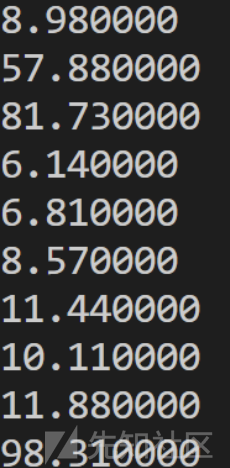

#### 可视化处理

```
import numpy as np
import matplotlib.pyplot as plt

with open('avg_len') as f:
    data = f.readlines()

data = [float(x) for x in data][:1500]

plt.xlabel('exec/100')
plt.ylabel('avg len')

plt.plot(range(len(data)), data)
plt.show()
```

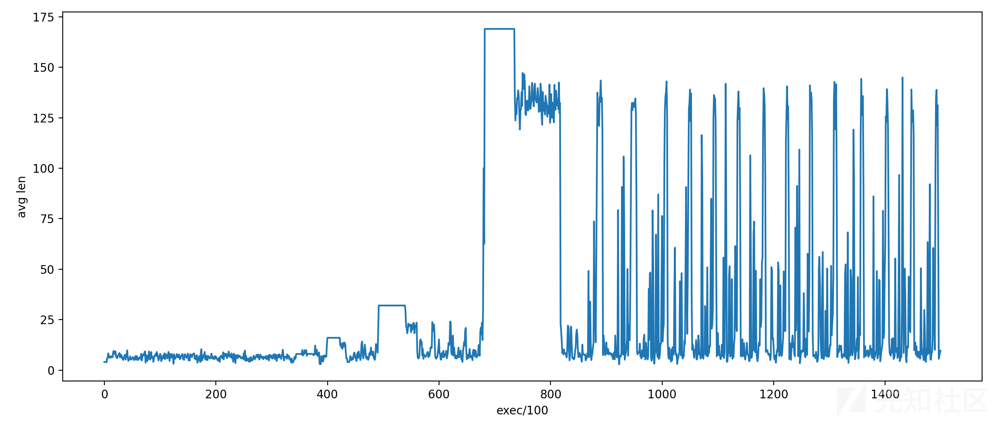

程序初期变异出的数据很少,测试的数据也比较少,在发现16个a的书籍后开始大量编译测试输出,以及32个数据后出现栈溢出效果,同样视为有效变异,开始大量测试

### 变异算子添加

基于更加定制划的fuzz测试

#### 基本原理

由于afl几乎不能测试出magic number的数据进行更深层次的crash,说通过前面的afl样本变异的过程中的havoc函数,将里面的变异参数针对某个程序进行更改,以便能够找到更多的有效crash

#### 更改源码

```
stage_cur_val = use_stacking;
 
    for (i = 0; i < use_stacking; i++) {

      // 添加两个算子
      switch (UR(15 + 2 + ((extras_cnt + a_extras_cnt) ? 2 : 0))) {

        case 0:

          /* Flip a single bit somewhere. Spooky! */
```

AFL 自带的 havoc 变异算子(编号 0 - 16)中,最后两个算子(15,16)是在有词典可用的情况下，才会被选取

将定制算子放在 15,16 而词典相关的算子放置于17,18

```
case 15: {
            // 我们添加的第一个算子，负责随便找个 dword 替换成 0xcafe1234
            
            // 若输入长度不够，则跳过
            if (temp_len < 4) break;

            // 找一个合适的位置
            u32 pos = UR(temp_len - 3);
            *(u32*)(out_buf + pos) = 0xcafe1234;
            
            break;
          }
        
        case 16: {
            // 我们添加的第二个算子，负责随便找个 dword 替换成 0xbabe5678
            
            // 若输入长度不够，则跳过
            if (temp_len < 4) break;

            // 找一个合适的位置
            u32 pos = UR(temp_len - 3);
            *(u32*)(out_buf + pos) = 0xbabe5678;
            
            break;
          }
        // 以下是 AFL 自带的词典相关算子，将其挪到 17、18
        
        /* Values 15 and 16 can be selected only if there are any extras
           present in the dictionaries. */
        case 17: {

            /* Overwrite bytes with an extra. */
```

#### 重新编译

```
make clean
make
```

### virgin\_bits追踪

|  |  |  |
| --- | --- | --- |
| **trace\_bits** | **virgin\_bits** | **解释** |
| 0 | 1 | 还没探索到的路径 |
| 1 | 1 | 新路径➡️virgin\_bits变为0 |
| 1 | 0 | 已经探索过的路径 |
| 0 | 0 | 无变化 |

希望通过virgin\_bits来检查整个fuzz的探索进度的同时,更加直观的看到有效用例的测试发现

AFL测试中,在用例完成virgin\_bits后未达成的任务,将存储于queue中➡️追踪这里的virgin\_bits可以直观的观察fuzz目标的进程

AFL定期将virgin\_bits写入fuzz\_bitmap中➡️优化为有效用例的virgin\_bits立即保保存

#### 修改源码

储存 virgin\_bits的代码添加到 AFL 原有的「把一个有趣用例保存进文件系统」之前,virgin map先存储于/tmp/virgin\_bits目录下

```
// 如果没发现新的路径，就忽略
    // has_new_bits 返回值：0 表示无成果；1 表示 hit count 变动；2 表示发现了新的边
    if (!(hnb = has_new_bits(virgin_bits))) {
      if (crash_mode) total_crashes++;
      return 0;
    }
    
    // ++++++++++++++++++++++++++++++++++++++++++++++++++++++++++
    // 这里产生了 virgin_bits 的更新，因此把现在的 virgin_bits 保存进文件
    {
      printf("save virgin bits for id %06u
", queued_paths);
      u8* virgin_filename = alloc_printf("/tmp/virgin_bits/id:%06u,%s", queued_paths, describe_op(hnb));

      FILE *virgin_fp = fopen(virgin_filename, "w");

      fwrite(virgin_bits, 1, sizeof(virgin_bits), virgin_fp);

      fclose(virgin_fp);
      ck_free(virgin_filename);
    }
    // ++++++++++++++++++++++++++++++++++++++++++++++++++++++++++
    
    
    // 发现了新的路径，要将其加入 queue 并存到文件中

#ifndef SIMPLE_FILES

    // 这是用例的文件名，描述了 id、来历
    fn = alloc_printf("%s/queue/id:%06u,%s", out_dir, queued_paths,
                      describe_op(hnb));
    // ...
```

#### 可视化virgin map

```
import numpy as np
import os
import matplotlib.pyplot as plt

data = []

for name in sorted(os.listdir('bits/virgin_bits')):
    with open(os.path.join('bits', 'virgin_bits', name), 'rb') as f:
        data.append(list(f.read()))

data = np.array(data)
data = (data != 255)
map_touched = data.any(axis=0)

data = data[:, map_touched]

plt.xlabel('virgin map')

plt.imshow(data, cmap='Blues')
plt.show()
```

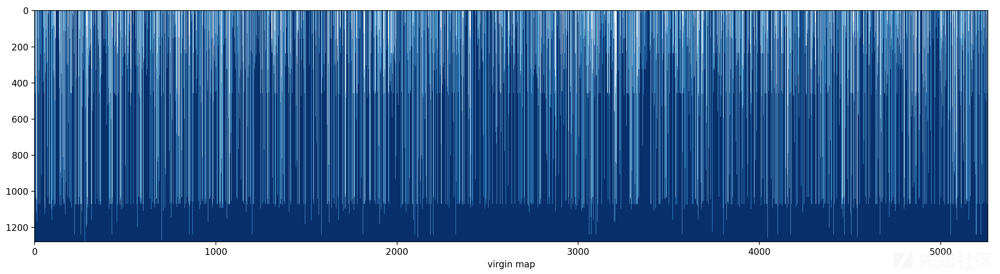

## AFL使用教程

这里利用libxml2-2.94的版本的进行fuzz测试

### libxml2的fuzz流程

afl编译➡️准备输入文件➡️fuzzing(多进程)

#### 下载并编译:

* afl-clang-lto模式编译➡️在编译过程中记录插桩
* CXXFLAGS="-fsanitize=address" LDFLAGS="-fsanitize=address" ➡️内存错误崩溃后更快的捕捉crash
* --disable-shared➡️编译位静态库

```
wget http://xmlsoft.org/download/libxml2-2.9.4.tar.gz
tar -xzvf libxml2-2.9.4.tar.gz
cd libxml2-2.9.4

CC=afl-clang-lto CXX=afl-clang-lto++ \
CFLAGS="-fsanitize=address" CXXFLAGS="-fsanitize=address" LDFLAGS="-fsanitize=address" \
./configure --prefix="/root/work/libxml/install/" \
    --disable-shared \
    --without-debug \
    --without-ftp \
    --without-http \
    --without-legacy \
    --without-python \
    LIBS='-ldl'

make
make install
```

#### 准备输入文件

利用合理且简单的输入进行变异➡️更加容易的探测复杂逻辑

输入文件存储<root>等标签的内容能够触发程序的正常流程

```
mkdir input
wget -O input/SampleInput.xml https://raw.githubusercontent.com/antonio-morales/Fuzzing101/main/Exercise%205/SampleInput.xml
```

#### fuzzing:

* -x xml.dict指定专属字典
* -M m0设定主/从节点➡️并行加速fuzz:主节点:探索新路径,从节点:挖掘已有路径下更深层次的bug

主节点(master)

```
afl-fuzz -m none -i ./input/ -o ./output -x xml.dict -M m0 \
    /root/work/libxml/install/bin/xmllint --memory --noenc --nocdata --dtdattr --loaddtd --valid --xinclude @@
```

从节点1(slave0)

```
afl-fuzz -m none -i ./input/ -o ./output -x xml.dict -S s0 \
    /root/work/libxml/install/bin/xmllint --memory --noenc --nocdata --dtdattr --loaddtd --valid --xinclude @@
```

从节点(slave1)

```
afl-fuzz -m none -i ./input/ -o ./output -x xml.dict -S s1 \
    /root/work/libxml/install/bin/xmllint --memory --noenc --nocdata --dtdattr --loaddtd --valid --xinclude @@
```

## AFL白皮书(附)

### ENG

原文链接<https://lcamtuf.coredump.cx/afl/technical_details.txt>

```
===================================
Technical "whitepaper" for afl-fuzz
===================================

  This document provides a quick overview of the guts of American Fuzzy Lop.
  See README for the general instruction manual; and for a discussion of
  motivations and design goals behind AFL, see historical_notes.txt.

0) Design statement
-------------------

American Fuzzy Lop does its best not to focus on any singular principle of
operation and not be a proof-of-concept for any specific theory. The tool can
be thought of as a collection of hacks that have been tested in practice,
found to be surprisingly effective, and have been implemented in the simplest,
most robust way I could think of at the time.

Many of the resulting features are made possible thanks to the availability of
lightweight instrumentation that served as a foundation for the tool, but this
mechanism should be thought of merely as a means to an end. The only true
governing principles are speed, reliability, and ease of use.

1) Coverage measurements
------------------------

The instrumentation injected into compiled programs captures branch (edge)
coverage, along with coarse branch-taken hit counts. The code injected at
branch points is essentially equivalent to:

  cur_location = <COMPILE_TIME_RANDOM>;
  shared_mem[cur_location ^ prev_location]++; 
  prev_location = cur_location >> 1;

The cur_location value is generated randomly to simplify the process of
linking complex projects and keep the XOR output distributed uniformly.

The shared_mem[] array is a 64 kB SHM region passed to the instrumented binary
by the caller. Every byte set in the output map can be thought of as a hit for
a particular (branch_src, branch_dst) tuple in the instrumented code.

The size of the map is chosen so that collisions are sporadic with almost all
of the intended targets, which usually sport between 2k and 10k discoverable
branch points:

   Branch cnt | Colliding tuples | Example targets
  ------------+------------------+-----------------
        1,000 | 0.75%            | giflib, lzo
        2,000 | 1.5%             | zlib, tar, xz
        5,000 | 3.5%             | libpng, libwebp
       10,000 | 7%               | libxml
       20,000 | 14%              | sqlite
       50,000 | 30%              | -

At the same time, its size is small enough to allow the map to be analyzed
in a matter of microseconds on the receiving end, and to effortlessly fit
within L2 cache.

This form of coverage provides considerably more insight into the execution
path of the program than simple block coverage. In particular, it trivially
distinguishes between the following execution traces:

  A -> B -> C -> D -> E (tuples: AB, BC, CD, DE)
  A -> B -> D -> C -> E (tuples: AB, BD, DC, CE)

This aids the discovery of subtle fault conditions in the underlying code,
because security vulnerabilities are more often associated with unexpected
or incorrect state transitions than with merely reaching a new basic block.

The reason for the shift operation in the last line of the pseudocode shown
earlier in this section is to preserve the directionality of tuples (without
this, A ^ B would be indistinguishable from B ^ A) and to retain the identity
of tight loops (otherwise, A ^ A would be obviously equal to B ^ B).

The absence of simple saturating arithmetic opcodes on Intel CPUs means that
the hit counters can sometimes wrap around to zero. Since this is a fairly
unlikely and localized event, it's seen as an acceptable performance trade-off.

2) Detecting new behaviors
--------------------------

The fuzzer maintains a global map of tuples seen in previous executions; this
data can be rapidly compared with individual traces and updated in just a couple
of dword- or qword-wide instructions and a simple loop.

When a mutated input produces an execution trace containing new tuples, the
corresponding input file is preserved and routed for additional processing
later on (see section #3). Inputs that do not trigger new local-scale state
transitions in the execution trace (i.e., produce no new tuples) are discarded,
even if their overall control flow sequence is unique.

This approach allows for a very fine-grained and long-term exploration of
program state while not having to perform any computationally intensive and
fragile global comparisons of complex execution traces, and while avoiding the
scourge of path explosion.

To illustrate the properties of the algorithm, consider that the second trace
shown below would be considered substantially new because of the presence of
new tuples (CA, AE):

  #1: A -> B -> C -> D -> E
  #2: A -> B -> C -> A -> E

At the same time, with #2 processed, the following pattern will not be seen
as unique, despite having a markedly different overall execution path:

  #3: A -> B -> C -> A -> B -> C -> A -> B -> C -> D -> E

In addition to detecting new tuples, the fuzzer also considers coarse tuple
hit counts. These are divided into several buckets:

  1, 2, 3, 4-7, 8-15, 16-31, 32-127, 128+

To some extent, the number of buckets is an implementation artifact: it allows
an in-place mapping of an 8-bit counter generated by the instrumentation to
an 8-position bitmap relied on by the fuzzer executable to keep track of the
already-seen execution counts for each tuple.

Changes within the range of a single bucket are ignored; transition from one
bucket to another is flagged as an interesting change in program control flow,
and is routed to the evolutionary process outlined in the section below.

The hit count behavior provides a way to distinguish between potentially
interesting control flow changes, such as a block of code being executed
twice when it was normally hit only once. At the same time, it is fairly
insensitive to empirically less notable changes, such as a loop going from
47 cycles to 48. The counters also provide some degree of "accidental"
immunity against tuple collisions in dense trace maps.

The execution is policed fairly heavily through memory and execution time
limits; by default, the timeout is set at 5x the initially-calibrated
execution speed, rounded up to 20 ms. The aggressive timeouts are meant to
prevent dramatic fuzzer performance degradation by descending into tarpits
that, say, improve coverage by 1% while being 100x slower; we pragmatically
reject them and hope that the fuzzer will find a less expensive way to reach
the same code. Empirical testing strongly suggests that more generous time
limits are not worth the cost.

3) Evolving the input queue
---------------------------

Mutated test cases that produced new state transitions within the program are
added to the input queue and used as a starting point for future rounds of
fuzzing. They supplement, but do not automatically replace, existing finds.

In contrast to more greedy genetic algorithms, this approach allows the tool
to progressively explore various disjoint and possibly mutually incompatible
features of the underlying data format, as shown in this image:

  http://lcamtuf.coredump.cx/afl/afl_gzip.png

Several practical examples of the results of this algorithm are discussed
here:

  http://lcamtuf.blogspot.com/2014/11/pulling-jpegs-out-of-thin-air.html
  http://lcamtuf.blogspot.com/2014/11/afl-fuzz-nobody-expects-cdata-sections.html

The synthetic corpus produced by this process is essentially a compact
collection of "hmm, this does something new!" input files, and can be used to
seed any other testing processes down the line (for example, to manually
stress-test resource-intensive desktop apps).

With this approach, the queue for most targets grows to somewhere between 1k
and 10k entries; approximately 10-30% of this is attributable to the discovery
of new tuples, and the remainder is associated with changes in hit counts.

The following table compares the relative ability to discover file syntax and
explore program states when using several different approaches to guided
fuzzing. The instrumented target was GNU patch 2.7.3 compiled with -O3 and
seeded with a dummy text file; the session consisted of a single pass over the
input queue with afl-fuzz:

    Fuzzer guidance | Blocks  | Edges   | Edge hit | Highest-coverage
      strategy used | reached | reached | cnt var  | test case generated
  ------------------+---------+---------+----------+---------------------------
     (Initial file) | 156     | 163     | 1.00     | (none)
                    |         |         |          |
    Blind fuzzing S | 182     | 205     | 2.23     | First 2 B of RCS diff
    Blind fuzzing L | 228     | 265     | 2.23     | First 4 B of -c mode diff
     Block coverage | 855     | 1,130   | 1.57     | Almost-valid RCS diff
      Edge coverage | 1,452   | 2,070   | 2.18     | One-chunk -c mode diff
          AFL model | 1,765   | 2,597   | 4.99     | Four-chunk -c mode diff

The first entry for blind fuzzing ("S") corresponds to executing just a single
round of testing; the second set of figures ("L") shows the fuzzer running in a
loop for a number of execution cycles comparable with that of the instrumented
runs, which required more time to fully process the growing queue.

Roughly similar results have been obtained in a separate experiment where the
fuzzer was modified to compile out all the random fuzzing stages and leave just
a series of rudimentary, sequential operations such as walking bit flips.
Because this mode would be incapable of altering the size of the input file,
the sessions were seeded with a valid unified diff:

    Queue extension | Blocks  | Edges   | Edge hit | Number of unique
      strategy used | reached | reached | cnt var  | crashes found
  ------------------+---------+---------+----------+------------------
     (Initial file) | 624     | 717     | 1.00     | -
                    |         |         |          |
      Blind fuzzing | 1,101   | 1,409   | 1.60     | 0
     Block coverage | 1,255   | 1,649   | 1.48     | 0
      Edge coverage | 1,259   | 1,734   | 1.72     | 0
          AFL model | 1,452   | 2,040   | 3.16     | 1

At noted earlier on, some of the prior work on genetic fuzzing relied on
maintaining a single test case and evolving it to maximize coverage. At least
in the tests described above, this "greedy" approach appears to confer no
substantial benefits over blind fuzzing strategies.

4) Culling the corpus
---------------------

The progressive state exploration approach outlined above means that some of
the test cases synthesized later on in the game may have edge coverage that
is a strict superset of the coverage provided by their ancestors.

To optimize the fuzzing effort, AFL periodically re-evaluates the queue using a
fast algorithm that selects a smaller subset of test cases that still cover
every tuple seen so far, and whose characteristics make them particularly
favorable to the tool.

The algorithm works by assigning every queue entry a score proportional to its
execution latency and file size; and then selecting lowest-scoring candidates
for each tuple.

The tuples are then processed sequentially using a simple workflow:

  1) Find next tuple not yet in the temporary working set,

  2) Locate the winning queue entry for this tuple,

  3) Register *all* tuples present in that entry's trace in the working set,

  4) Go to #1 if there are any missing tuples in the set.

The generated corpus of "favored" entries is usually 5-10x smaller than the
starting data set. Non-favored entries are not discarded, but they are skipped
with varying probabilities when encountered in the queue:

  - If there are new, yet-to-be-fuzzed favorites present in the queue, 99%
    of non-favored entries will be skipped to get to the favored ones.

  - If there are no new favorites:

    - If the current non-favored entry was fuzzed before, it will be skipped
      95% of the time.

    - If it hasn't gone through any fuzzing rounds yet, the odds of skipping
      drop down to 75%.

Based on empirical testing, this provides a reasonable balance between queue
cycling speed and test case diversity.

Slightly more sophisticated but much slower culling can be performed on input
or output corpora with afl-cmin. This tool permanently discards the redundant
entries and produces a smaller corpus suitable for use with afl-fuzz or
external tools.

5) Trimming input files
-----------------------

File size has a dramatic impact on fuzzing performance, both because large
files make the target binary slower, and because they reduce the likelihood
that a mutation would touch important format control structures, rather than
redundant data blocks. This is discussed in more detail in perf_tips.txt.

The possibility that the user will provide a low-quality starting corpus aside,
some types of mutations can have the effect of iteratively increasing the size
of the generated files, so it is important to counter this trend.

Luckily, the instrumentation feedback provides a simple way to automatically
trim down input files while ensuring that the changes made to the files have no
impact on the execution path.

The built-in trimmer in afl-fuzz attempts to sequentially remove blocks of data
with variable length and stepover; any deletion that doesn't affect the checksum
of the trace map is committed to disk. The trimmer is not designed to be
particularly thorough; instead, it tries to strike a balance between precision
and the number of execve() calls spent on the process, selecting the block size
and stepover to match. The average per-file gains are around 5-20%.

The standalone afl-tmin tool uses a more exhaustive, iterative algorithm, and
also attempts to perform alphabet normalization on the trimmed files. The
operation of afl-tmin is as follows.

First, the tool automatically selects the operating mode. If the initial input
crashes the target binary, afl-tmin will run in non-instrumented mode, simply
keeping any tweaks that produce a simpler file but still crash the target. If
the target is non-crashing, the tool uses an instrumented mode and keeps only
the tweaks that produce exactly the same execution path.

The actual minimization algorithm is:

  1) Attempt to zero large blocks of data with large stepovers. Empirically,
     this is shown to reduce the number of execs by preempting finer-grained
     efforts later on.

  2) Perform a block deletion pass with decreasing block sizes and stepovers,
     binary-search-style. 

  3) Perform alphabet normalization by counting unique characters and trying
     to bulk-replace each with a zero value.

  4) As a last result, perform byte-by-byte normalization on non-zero bytes.

Instead of zeroing with a 0x00 byte, afl-tmin uses the ASCII digit '0'. This
is done because such a modification is much less likely to interfere with
text parsing, so it is more likely to result in successful minimization of
text files.

The algorithm used here is less involved than some other test case
minimization approaches proposed in academic work, but requires far fewer
executions and tends to produce comparable results in most real-world
applications.

6) Fuzzing strategies
---------------------

The feedback provided by the instrumentation makes it easy to understand the
value of various fuzzing strategies and optimize their parameters so that they
work equally well across a wide range of file types. The strategies used by
afl-fuzz are generally format-agnostic and are discussed in more detail here:

  http://lcamtuf.blogspot.com/2014/08/binary-fuzzing-strategies-what-works.html

It is somewhat notable that especially early on, most of the work done by
afl-fuzz is actually highly deterministic, and progresses to random stacked
modifications and test case splicing only at a later stage. The deterministic
strategies include:

  - Sequential bit flips with varying lengths and stepovers,

  - Sequential addition and subtraction of small integers,

  - Sequential insertion of known interesting integers (0, 1, INT_MAX, etc),

The purpose of opening with deterministic steps is related to their tendency to
produce compact test cases and small diffs between the non-crashing and crashing
inputs.

With deterministic fuzzing out of the way, the non-deterministic steps include
stacked bit flips, insertions, deletions, arithmetics, and splicing of different
test cases.

The relative yields and execve() costs of all these strategies have been
investigated and are discussed in the aforementioned blog post.

For the reasons discussed in historical_notes.txt (chiefly, performance,
simplicity, and reliability), AFL generally does not try to reason about the
relationship between specific mutations and program states; the fuzzing steps
are nominally blind, and are guided only by the evolutionary design of the
input queue.

That said, there is one (trivial) exception to this rule: when a new queue
entry goes through the initial set of deterministic fuzzing steps, and tweaks to
some regions in the file are observed to have no effect on the checksum of the
execution path, they may be excluded from the remaining phases of
deterministic fuzzing - and the fuzzer may proceed straight to random tweaks.
Especially for verbose, human-readable data formats, this can reduce the number
of execs by 10-40% or so without an appreciable drop in coverage. In extreme
cases, such as normally block-aligned tar archives, the gains can be as high as
90%.

Because the underlying "effector maps" are local every queue entry and remain
in force only during deterministic stages that do not alter the size or the
general layout of the underlying file, this mechanism appears to work very
reliably and proved to be simple to implement.

7) Dictionaries
---------------

The feedback provided by the instrumentation makes it easy to automatically
identify syntax tokens in some types of input files, and to detect that certain
combinations of predefined or auto-detected dictionary terms constitute a
valid grammar for the tested parser.

A discussion of how these features are implemented within afl-fuzz can be found
here:

  http://lcamtuf.blogspot.com/2015/01/afl-fuzz-making-up-grammar-with.html

In essence, when basic, typically easily-obtained syntax tokens are combined
together in a purely random manner, the instrumentation and the evolutionary
design of the queue together provide a feedback mechanism to differentiate
between meaningless mutations and ones that trigger new behaviors in the
instrumented code - and to incrementally build more complex syntax on top of
this discovery.

The dictionaries have been shown to enable the fuzzer to rapidly reconstruct
the grammar of highly verbose and complex languages such as JavaScript, SQL,
or XML; several examples of generated SQL statements are given in the blog
post mentioned above.

Interestingly, the AFL instrumentation also allows the fuzzer to automatically
isolate syntax tokens already present in an input file. It can do so by looking
for run of bytes that, when flipped, produce a consistent change to the
program's execution path; this is suggestive of an underlying atomic comparison
to a predefined value baked into the code. The fuzzer relies on this signal
to build compact "auto dictionaries" that are then used in conjunction with
other fuzzing strategies.

8) De-duping crashes
--------------------

De-duplication of crashes is one of the more important problems for any
competent fuzzing tool. Many of the naive approaches run into problems; in
particular, looking just at the faulting address may lead to completely
unrelated issues being clustered together if the fault happens in a common
library function (say, strcmp, strcpy); while checksumming call stack
backtraces can lead to extreme crash count inflation if the fault can be
reached through a number of different, possibly recursive code paths.

The solution implemented in afl-fuzz considers a crash unique if any of two
conditions are met:

  - The crash trace includes a tuple not seen in any of the previous crashes,

  - The crash trace is missing a tuple that was always present in earlier
    faults.

The approach is vulnerable to some path count inflation early on, but exhibits
a very strong self-limiting effect, similar to the execution path analysis
logic that is the cornerstone of afl-fuzz.

9) Investigating crashes
------------------------

The exploitability of many types of crashes can be ambiguous; afl-fuzz tries
to address this by providing a crash exploration mode where a known-faulting
test case is fuzzed in a manner very similar to the normal operation of the
fuzzer, but with a constraint that causes any non-crashing mutations to be
thrown away.

A detailed discussion of the value of this approach can be found here:

  http://lcamtuf.blogspot.com/2014/11/afl-fuzz-crash-exploration-mode.html

The method uses instrumentation feedback to explore the state of the crashing
program to get past the ambiguous faulting condition and then isolate the
newly-found inputs for human review.

On the subject of crashes, it is worth noting that in contrast to normal
queue entries, crashing inputs are *not* trimmed; they are kept exactly as
discovered to make it easier to compare them to the parent, non-crashing entry
in the queue. That said, afl-tmin can be used to shrink them at will.

10) The fork server
-------------------

To improve performance, afl-fuzz uses a "fork server", where the fuzzed process
goes through execve(), linking, and libc initialization only once, and is then
cloned from a stopped process image by leveraging copy-on-write. The
implementation is described in more detail here:

  http://lcamtuf.blogspot.com/2014/10/fuzzing-binaries-without-execve.html

The fork server is an integral aspect of the injected instrumentation and
simply stops at the first instrumented function to await commands from
afl-fuzz.

With fast targets, the fork server can offer considerable performance gains,
usually between 1.5x and 2x. It is also possible to:

  - Use the fork server in manual ("deferred") mode, skipping over larger,
    user-selected chunks of initialization code. It requires very modest
    code changes to the targeted program, and With some targets, can
    produce 10x+ performance gains.

  - Enable "persistent" mode, where a single process is used to try out
    multiple inputs, greatly limiting the overhead of repetitive fork()
    calls. This generally requires some code changes to the targeted program,
    but can improve the performance of fast targets by a factor of 5 or more
    - approximating the benefits of in-process fuzzing jobs while still
    maintaining very robust isolation between the fuzzer process and the
    targeted binary.

11) Parallelization
-------------------

The parallelization mechanism relies on periodically examining the queues
produced by independently-running instances on other CPU cores or on remote
machines, and then selectively pulling in the test cases that, when tried
out locally, produce behaviors not yet seen by the fuzzer at hand.

This allows for extreme flexibility in fuzzer setup, including running synced
instances against different parsers of a common data format, often with
synergistic effects.

For more information about this design, see parallel_fuzzing.txt.

12) Binary-only instrumentation
-------------------------------

Instrumentation of black-box, binary-only targets is accomplished with the
help of a separately-built version of QEMU in "user emulation" mode. This also
allows the execution of cross-architecture code - say, ARM binaries on x86.

QEMU uses basic blocks as translation units; the instrumentation is implemented
on top of this and uses a model roughly analogous to the compile-time hooks:

  if (block_address > elf_text_start && block_address < elf_text_end) {

    cur_location = (block_address >> 4) ^ (block_address << 8);
    shared_mem[cur_location ^ prev_location]++; 
    prev_location = cur_location >> 1;

  }

The shift-and-XOR-based scrambling in the second line is used to mask the
effects of instruction alignment.

The start-up of binary translators such as QEMU, DynamoRIO, and PIN is fairly
slow; to counter this, the QEMU mode leverages a fork server similar to that
used for compiler-instrumented code, effectively spawning copies of an
already-initialized process paused at _start.

First-time translation of a new basic block also incurs substantial latency. To
eliminate this problem, the AFL fork server is extended by providing a channel
between the running emulator and the parent process. The channel is used
to notify the parent about the addresses of any newly-encountered blocks and to
add them to the translation cache that will be replicated for future child
processes.

As a result of these two optimizations, the overhead of the QEMU mode is
roughly 2-5x, compared to 100x+ for PIN.

13) The afl-analyze tool
------------------------

The file format analyzer is a simple extension of the minimization algorithm
discussed earlier on; instead of attempting to remove no-op blocks, the tool
performs a series of walking byte flips and then annotates runs of bytes
in the input file.

It uses the following classification scheme:

  - "No-op blocks" - segments where bit flips cause no apparent changes to
    control flow. Common examples may be comment sections, pixel data within
    a bitmap file, etc.

  - "Superficial content" - segments where some, but not all, bitflips
    produce some control flow changes. Examples may include strings in rich
    documents (e.g., XML, RTF).

  - "Critical stream" - a sequence of bytes where all bit flips alter control
    flow in different but correlated ways. This may be compressed data, 
    non-atomically compared keywords or magic values, etc.

  - "Suspected length field" - small, atomic integer that, when touched in
    any way, causes a consistent change to program control flow, suggestive
    of a failed length check.

  - "Suspected cksum or magic int" - an integer that behaves similarly to a
    length field, but has a numerical value that makes the length explanation
    unlikely. This is suggestive of a checksum or other "magic" integer.

  - "Suspected checksummed block" - a long block of data where any change 
    always triggers the same new execution path. Likely caused by failing
    a checksum or a similar integrity check before any subsequent parsing
    takes place.

  - "Magic value section" - a generic token where changes cause the type
    of binary behavior outlined earlier, but that doesn't meet any of the
    other criteria. May be an atomically compared keyword or so.
```

### CN

翻译版本➡️建议对照阅读

#### 0）设计说明

American Fuzzy Lop 尽力避免专注于任何单一操作原则，也不是针对特定理论的概念验证。这个工具可以被视为一系列经过实践测试、被证实具有惊人有效性，并且在当时我能想到的最简单、最健壮的方式下实施的一些技巧的集合。

其中许多特性的实现得益于轻量级插装技术的可用性，这为该工具提供了基础，但这个机制仅仅应被视为达到目的的手段。唯一真正的主导原则是速度、可靠性和易用性。

#### 1）覆盖率测量

在编译程序中注入的插装代码会捕获分支（边缘）覆盖率，以及粗略的分支执行次数。在分支点注入的代码本质上等同于：

```
cur_location = <COMPILE_TIME_RANDOM>;
shared_mem[cur_location ^ prev_location]++; 
prev_location = cur_location >> 1;
```

cur\_location的值是随机生成的，以简化复杂项目的链接过程，并保持XOR输出均匀分布。

shared\_mem[]数组是一个64KB的共享内存区域，由调用方传递给插桩二进制文件。在输出映射中设置的每个字节可以看作是插装代码中特定的（branch\_src，branch\_dst）元组的执行次数。

映射（map）的大小被选择为几乎所有预期目标的碰撞都是零散的，这些目标通常具有2k到10k个可发现的分支点：

|  |  |  |
| --- | --- | --- |
| **Branch cnt** | **Colliding tuples** | **Example targets** |
| 1,000 | 0.75% | giflib, lzo |
| 2,000 | 1.5% | zlib, tar, xz |
| 5,000 | 3.5% | libpng, libwebp |
| 10,000 | 7% | libxml |
| 50,000 | 30% | - |

同时，映射的大小足够小，以便在接收端可以在微秒级别内进行分析，并且轻松适应L2缓存中。

这种形式的覆盖率比简单的块覆盖率提供了更多关于程序执行路径的信息。特别地，它可以轻松区分以下执行跟踪：

```
A -> B -> C -> D -> E (tuples: AB, BC, CD, DE)
A -> B -> D -> C -> E (tuples: AB, BD, DC, CE)
```

这有助于发现底层代码中的微妙错误条件，因为安全漏洞通常与意外或错误的状态转换相关，而不仅仅是到达一个新的基本块。

在之前展示的伪代码中，最后一行进行的位移操作是为了保留元组的方向性（否则，A ^ B 将无法区分于 B ^ A），并保持紧密循环的身份（否则，A ^ A 显然等于 B ^ B）。

在 Intel CPU 上缺乏简单的饱和算术操作码意味着命中计数器有时可能会归零。由于这是一个相当不太可能和局部化的事件，因此被视为可接受的性能权衡。

#### 2）检测新的行为

模糊测试器维护着一个全局元组映射表，其中记录了先前执行中出现的元组。这些数据可以与单个执行跟踪快速比较，并通过几个双字或四字宽的指令和简单的循环进行更新。

当经过变异的输入产生了包含新元组的执行跟踪时，相应的输入文件将被保留并路由到后续的额外处理中（参见第3节）。那些在执行跟踪中没有触发新的局部状态转换（即没有产生新元组）的输入将被丢弃，即使它们的整体控制流序列是唯一的。

这种方法可以在程序状态上进行非常精细和长期的探索，而无需执行计算密集型且易于出错的复杂执行跟踪的全局比较，并避免了路径爆炸的问题。

为了说明该算法的特性，考虑下面所示的第二个执行跟踪，由于存在新的元组（CA、AE），它将被认为是显著新的：

```
#1: A -> B -> C -> D -> E
#2: A -> B -> C -> A -> E
```

同时，经过#2的处理后，尽管具有明显不同的整体执行路径，以下模式将不被视为唯一：

#3: A -> B -> C -> A -> B -> C -> A -> B -> C -> D -> E

除了检测新的元组之外，模糊测试工具还考虑了粗粒度元组的命中计数。这些计数被分为几个桶：

1, 2, 3, 4-7, 8-15, 16-31, 32-127, 128+

在某种程度上，桶的数量是一种实现的产物：它允许将插装生成的8位计数器就地映射到模糊测试工具可执行文件所依赖的8位位图中，以跟踪每个元组的已见执行计数。

单个桶范围内的更改将被忽略；从一个桶到另一个桶的转换被标记为程序控制流的有趣变化，并被路由到下面一节中概述的进化过程中。

命中计数的行为提供了一种区分潜在有趣的控制流变化的方式，例如某段代码在通常只执行一次的情况下执行两次。同时，它对经验上不太显著的变化（例如循环从47个周期变为48个周期）相对不敏感。计数器还在稠密的跟踪图中提供了一定程度的“偶然”抵抗元组碰撞的能力。

执行受到内存和执行时间限制的严格监控；默认情况下，超时时间设置为初始校准执行速度的5倍，向上取整为20毫秒。这种激进的超时设置旨在防止模糊测试器性能因陷入”粘着陷阱”而严重下降，即在性能提升1%的同时变慢100倍；我们实用主义地拒绝它们，并希望模糊测试器能找到更廉价的方式达到相同的代码。经验测试强烈表明，更宽松的时间限制不值得代价。

#### 3）演化输入队列

将产生了程序内新状态转换的突变测试用例添加到输入队列中，并作为未来一轮模糊测试的起点。它们是对现有发现的补充，而不是自动替换。

与更贪婪的遗传算法相比，这种方法允许工具逐步探索底层数据格式的各种不相交且可能相互不兼容的特征，如下图所示：

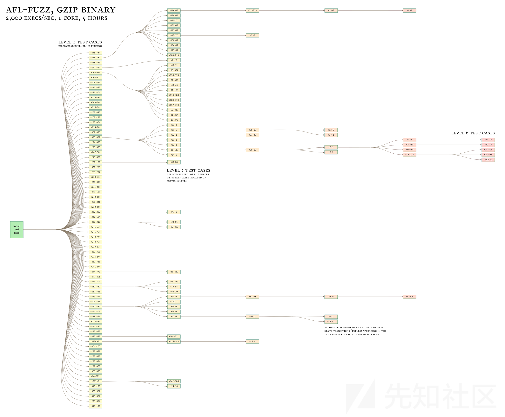

这个算法的几个实际例子在这里进行了讨论：

<http://lcamtuf.blogspot.com/2014/11/pulling-jpegs-out-of-thin-air.html><http://lcamtuf.blogspot.com/2014/11/afl-fuzz-nobody-expects-cdata-sections.html>

通过这个过程产生的合成语料库实质上是一组紧凑的“嗯，这个做了一些新的事情！”输入文件的集合，并可用于后续的任何其他测试过程中（例如，手动对资源密集型桌面应用程序进行压力测试）。

采用这种方法，大多数目标的队列增长到大约1,000到10,000个条目之间；其中大约10-30％归因于新元组的发现，其余则与命中计数的变化有关。

下表比较了在使用几种不同的引导模糊测试方法时，发现文件语法和探索程序状态的相对能力。被插装的目标是使用-O3编译的GNU patch 2.7.3，并使用虚拟文本文件进行种子；会话包括对输入队列的单次遍历，使用afl-fuzz进行模糊测试：

|  |  |  |  |  |
| --- | --- | --- | --- | --- |
| **Fuzzer guidance strategy used** | **Blocks reached** | **Edges reached** | **Edge hit cnt var** | **Highest-coverage test case generated** |
| (Initial file) | 156 | 163 | 1.00 | (none) |
| Blind fuzzing S | 182 | 205 | 2.23 | First 2 B of RCS diff |
| Blind fuzzing L | 228 | 265 | 2.23 | First 4 B of -c mode diff |
| Block coverage | 855 | 1,130 | 1.57 | Almost-valid RCS diff |
| Edge coverage | 1,452 | 2,070 | 2.18 | One-chunk -c mode diff |
| AFL model | 1,765 | 2,597 | 4.99 | Four-chunk -c mode diff |

盲目模糊测试的第一个条目（“S”）表示只执行了一轮测试；第二组数据（“L”）显示模糊器循环运行的次数与插装运行的次数相当，但需要更多时间来完全处理不断增长的队列。

在另一个单独的实验中，将模糊器修改为编译掉所有随机模糊阶段，只保留一系列基本的顺序操作，例如逐位翻转。由于这种模式无法改变输入文件的大小，因此会话使用有效的统一差异进行种子操作，大致获得了类似的结果：

|  |  |  |  |  |
| --- | --- | --- | --- | --- |
| **Queue extension strategy used** | **Blocks reached** | **Edges reached** | **Edge hit cnt var** | **Number of unique crashes found** |
| (Initial file) | 624 | 717 | 1.00 | - |
| Blind fuzzing | 1,101 | 1,409 | 1.60 | 0 |
| Block coverage | 1,255 | 1,649 | 1.48 | 0 |
| Edge coverage | 1,259 | 1,734 | 1.72 | 0 |
| AFL model | 1,452 | 2,040 | 3.16 | 1 |

正如前面所提到的，一些关于遗传模糊测试的先前工作依赖于维护单个测试用例并通过演化来最大化覆盖率。至少在上述描述的测试中，这种“贪婪”的方法似乎并没有比盲目模糊测试策略带来实质性的好处。

#### 4）精简语料库

上述的渐进状态探索方法意味着在游戏的后期合成的一些测试用例的边缘覆盖范围可能是其祖先所提供的覆盖范围的严格超集。

为了优化模糊测试的效果，AFL定期使用一种快速算法重新评估队列，选择一个更小的子集，仍然覆盖到目前为止见到的每个元组，并具有使它们对该工具特别有利的特征。

该算法通过为每个队列条目分配与其执行延迟和文件大小成比例的分数来工作，然后选择每个元组的得分最低的候选项。

然后，这些元组按顺序使用简单的工作流程进行处理：

1. 找到尚未在临时工作集中的下一个元组，
2. 定位该元组的获胜队列条目，
3. 在工作集中注册该条目的跟踪中存在的*所有*元组，
4. 如果集合中存在任何缺失的元组，则返回到步骤#1。

生成的“favored”条目语料库通常比起始数据集小5-10倍。Non-favored 条目不会被丢弃，但在队列中遇到时，它们以不同的概率被跳过。

* 如果队列中存在尚未进行模糊测试的新的优选条目，将跳过99%的非优选条目以便处理这些优选条目。
* 如果没有新的优选条目：

* 如果当前的非优选条目之前已经进行过模糊测试，则有95%的概率跳过它。
* 如果它尚未进行过任何模糊测试轮次，则跳过的概率降低到75%。

根据实证测试，这提供了队列循环速度和测试用例多样性之间的合理平衡。

稍微更复杂但速度较慢的剪枝可以使用afl-cmin在输入或输出语料库上进行。该工具永久丢弃冗余条目并生成适用于afl-fuzz或外部工具的较小语料库。

#### 5）裁剪输入文件

文件大小对模糊测试性能有着显著影响，原因在于大文件使目标二进制文件变得更慢，并且它们减少了变异会触及重要格式控制结构而不是冗余数据块的可能性。这一点在《perf\_tips.txt》中有更详细的讨论。

除了用户提供低质量的起始语料库之外，某些类型的变异可能会导致生成的文件大小逐步增加，因此重要的是要抵消这种趋势。

幸运的是，插桩反馈提供了一种自动修剪输入文件的简单方法，同时确保对文件所做的更改不会影响执行路径。

afl-fuzz 中内置的修剪器尝试顺序地移除具有可变长度和跳过步骤的数据块；对于不会影响跟踪映射校验和的删除操作，将其保存到磁盘上。修剪器并不设计得非常彻底；相反，它试图在精度和进程上的 execve() 调用次数之间取得平衡，选择与块大小和跳过步骤匹配的设置。平均每个文件的收益约为 5-20%。

独立的 afl-tmin 工具使用一种更详尽、迭代的算法，还尝试对修剪后的文件进行字母归一化。afl-tmin 的操作如下。

首先，该工具会自动选择操作模式。如果初始输入导致目标二进制文件崩溃，afl-tmin 将以非插桩模式运行，只保留那些生成了更简单的文件但仍导致目标崩溃的调整。如果目标不会崩溃，该工具将使用插桩模式，并仅保留产生完全相同执行路径的调整。

实际的最小化算法如下：

1. 尝试用大的步长将大块数据置零。经验证明，这可以在后续更细粒度的尝试之前减少执行次数。
2. 以二分搜索的方式，使用逐渐减小的块大小和步长进行块删除。
3. 通过计算唯一字符的数量，尝试用零值进行批量替换，进行字母归一化。
4. 作为最后的结果，在非零字节上进行逐字节的归一化处理。

相比使用0x00字节将数据置零，afl-tmin使用ASCII数字’0’进行替换。这样做的原因是这种修改更不容易干扰文本解析，因此更有可能成功地对文本文件进行最小化处理。

这里使用的算法比一些学术工作中提出的其他测试用例最小化方法要简单，但需要更少的执行次数，并且在大多数实际应用中产生相当的结果。

#### 6）Fuzzing策略

插桩提供的反馈信息使得理解各种模糊测试策略的价值并优化其参数，以便在广泛的文件类型上同样发挥作用变得容易。afl-fuzz使用的策略通常不依赖于特定文件格式，并在此处进行了更详细的讨论：

<http://lcamtuf.blogspot.com/2014/08/binary-fuzzing-strategies-what-works.html>

值得注意的是，特别是在早期阶段，afl-fuzz的大部分工作实际上是高度确定性的，并且仅在后期才逐渐转向随机的叠加修改和测试用例拼接。确定性策略包括：

* 以不同的长度和步进进行顺序位翻转，
* 逐个添加和减去小整数，
* 逐个插入已知的有趣整数（0、1、INT\_MAX等），

以确定性步骤开头的目的与它们倾向于产生紧凑的测试案例和非崩溃输入与崩溃输入之间的小差异有关。

完成确定性模糊测试后，非确定性步骤包括堆叠的位翻转、插入、删除、算术运算和不同测试案例的拼接。

所有这些策略的相对收益和execve()成本已经进行了调查，并在上述博客文章中进行了讨论。

由于性能、简单性和可靠性等原因，AFL通常不尝试推理特定变异和程序状态之间的关系；模糊测试步骤在名义上是盲目的，仅由输入队列的演化设计指导。

尽管如此，这个规则有一个（微不足道的）例外：当一个新的队列条目经过初始的确定性模糊测试步骤，并且观察到对文件中某些区域的调整对执行路径的校验和没有影响时，它们可以被排除在剩余的确定性模糊测试阶段之外，模糊测试器可以直接进行随机调整。对于冗长、可读性强的数据格式，这可以减少大约10-40%的执行次数，而覆盖率几乎没有明显下降。在极端情况下，比如通常以块对齐的tar档案，收益可以高达90%。

由于底层的”效应器映射”是每个队列条目局部的，并且仅在不改变底层文件的大小或一般布局的确定性阶段有效，这个机制似乎非常可靠，并且证明了实现起来很简单。

#### 7）字典

插桩提供的反馈信息使得在某些类型的输入文件中自动识别语法标记变得容易，并且可以检测到预定义或自动检测的字典术语的某些组合构成了被测试解析器的有效语法。

可以在这里找到有关在afl-fuzz中实现这些特性的讨论：

<http://lcamtuf.blogspot.com/2015/01/afl-fuzz-making-up-grammar-with.html>

基本上，当基本的、通常容易获取的语法标记以纯随机的方式组合在一起时，插桩和队列的进化设计共同提供了一种反馈机制，用于区分无意义的突变和触发插桩代码中新行为的突变，并逐步构建更复杂的语法。

使用词典已被证明能够使模糊测试工具快速重构高度冗长和复杂的语言的语法，例如JavaScript、SQL或XML。在上述提到的博客文章中，给出了几个生成的SQL语句的示例。

有趣的是，AFL的插桩机制还使得模糊测试工具能够自动分离已存在于输入文件中的语法标记。它可以通过查找连续的字节序列，当进行位翻转时，会对程序的执行路径产生一致的变化；这暗示了代码中固定值的原子比较。模糊测试工具依靠这个信号来构建紧凑的”自动词典”，然后与其他模糊测试策略结合使用。

#### 8）De-duping crashes去除复制的崩溃

在任何高效的模糊测试工具中，崩溃去重是一个非常重要的问题。许多朴素的方法都会遇到问题。特别是，仅仅关注错误地址可能会导致完全不相关的问题被聚集在一起，如果错误发生在一个常见的库函数（比如strcmp、strcpy）中；而对调用堆栈回溯进行校验和计算可能会导致崩溃次数极度膨胀，如果故障可以通过多个不同的、可能是递归的代码路径到达。

afl-fuzz实现的解决方案在以下两种情况下将考虑崩溃为唯一：

* 崩溃跟踪包含了之前崩溃中未见过的元组，
* 崩溃跟踪缺少之前所有故障中始终存在的元组。

这种方法在早期可能会导致一些路径计数的膨胀，但它表现出非常强的自限制效应，类似于afl-fuzz的执行路径分析逻辑，这也是afl-fuzz的基石。

#### 9）调查崩溃

许多类型的崩溃漏洞的可利用性是模棱两可的。afl-fuzz尝试通过提供崩溃探索模式来解决这个问题。在这种模式下，一个已知会导致故障的测试样本被以与模糊测试器正常操作非常相似的方式进行模糊测试，但有一个限制条件，即任何非崩溃的变异都会被丢弃。

关于这种方法的价值的详细讨论可以在这里找到：

<http://lcamtuf.blogspot.com/2014/11/afl-fuzz-crash-exploration-mode.html>

该方法利用插桩反馈来探索崩溃程序的状态，以克服模糊的故障条件，并将新发现的输入进行隔离，供人工审查。

关于崩溃问题，值得注意的是，与普通队列条目不同，崩溃输入不会被修剪；它们会被保留原样，以便更容易将它们与队列中的父级非崩溃条目进行比较。不过，可以使用afl-tmin来根据需要缩小它们的大小。

#### 10）The fork server

为了提高性能，afl-fuzz使用了一个”fork server”（分叉服务器），其中模糊的进程只需要通过一次execve()、链接和libc初始化，并且通过利用写时复制（copy-on-write）从一个停止的进程镜像进行克隆。具体的实现细节可以在这里找到：

<http://lcamtuf.blogspot.com/2014/10/fuzzing-binaries-without-execve.html>

fork server 是注入的插装功能的重要组成部分，它会在第一个插装函数处停止，并等待来自afl-fuzz的命令。

使用快速目标时，fork server可以带来相当大的性能提升，通常在1.5倍到2倍之间。还有其他可能的优化方式，包括：

* 在手动（”延迟”）模式下使用分叉服务器，跳过较大的、用户选择的初始化代码块。这只需要对目标程序进行很小的代码修改，并且对于某些目标，可以实现10倍以上的性能提升。
* 启用”持久”模式，在单个进程中尝试多个输入，大大减少了重复fork()调用的开销。这通常需要对目标程序进行一些代码修改，但可以将快速目标的性能提升5倍以上，接近在进程内进行模糊测试作业的好处，同时仍保持非常强大的分离性，将模糊器进程和目标二进制之间进行隔离。

#### 11）并行化

并行化机制依赖于定期检查在其他CPU核心或远程机器上独立运行的实例产生的队列，然后有选择性地引入在本地尝试时产生的尚未被当前fuzzer看到的行为的测试用例。

这种设计允许在fuzzer设置中具有极大的灵活性，包括针对共同数据格式的不同解析器运行同步实例，通常会产生协同效应。

有关这一设计的更多信息，请参阅parallel\_fuzzing.txt。

#### 12）二进制插桩

对于黑盒的二进制目标，使用单独构建的 QEMU 版本在“用户仿真”模式下完成插桩。这也允许在不同架构之间执行代码，例如在 x86 上执行 ARM 二进制代码。

QEMU 将基本块作为翻译单元；插桩是在此基础上实现的，并使用类似于编译时钩子的模型：

```
if (block_address > elf_text_start && block_address < elf_text_end) {

    cur_location = (block_address >> 4) ^ (block_address << 8);
    shared_mem[cur_location ^ prev_location]++; 
    prev_location = cur_location >> 1;

  }
```

第二行中基于移位和异或的混淆用于遮蔽指令对齐的影响。

QEMU、DynamoRIO 和 PIN 等二进制翻译器的启动速度相对较慢；为了解决这个问题，QEMU 模式利用了类似于编译器插桩代码中使用的 fork 服务器，有效地生成已在 \_start 处暂停的已初始化进程的副本。

首次翻译新的基本块也会产生相当大的延迟。为了消除这个问题，AFL fork 服务器通过在运行的模拟器和父进程之间提供通道进行扩展。该通道用于通知父进程有关任何新遇到的块的地址，并将它们添加到将来的子进程中将被复制的翻译缓存中。

由于这两个优化，QEMU 模式的开销约为 2-5 倍，而 PIN 则为 100 倍以上。

#### 13）afl-analyze工具

文件格式分析器是先前讨论的最小化算法的简单扩展；该工具不是试图删除无操作块，而是执行一系列字节翻转，然后对输入文件中的字节序列进行注释标记。

它使用以下分类方案：

* “无操作块”（No-op blocks） - 在这些段中，位翻转对控制流没有明显的变化。常见的例子可能是注释部分、位图文件中的像素数据等。
* “表面内容”（Superficial content） - 在这些段中，一些位翻转会引起一些控制流的变化，但并非所有的位翻转都会产生变化。例如，富文档（如XML、RTF）中的字符串。
* “关键流”（Critical stream） - 一系列字节，其中所有的位翻转以不同但相关的方式改变控制流。这可能是压缩数据、非原子比较的关键字或魔术值等。
* “疑似长度字段”（Suspected length field） - 一个小的原子整数，在任何方式下触摸时都会引起一致的控制流变化，暗示长度检查失败。
* “疑似校验和或魔术整数”（Suspected cksum or magic int） - 一个整数，行为类似于长度字段，但其数值使得长度解释不太可能。这暗示着校验和或其他”魔术”整数。
* “疑似校验和块”（Suspected checksummed block） - 一个较长的数据块，任何变化总是触发相同的新执行路径。很可能是在后续解析之前，未通过校验和或类似完整性检查。
* “魔法值段”（Magic value section） - 一种通用的令牌，其中的变化会导致前面概述的二进制行为类型，但不符合其他任何标准。可能是原子比较的关键字或其他内容
