# JAVA代码审计之从若依任意文件读取学防护-先知社区

> **来源**: https://xz.aliyun.com/news/18384  
> **文章ID**: 18384

---

#### 产品介绍

RuoYi是一个后台管理系统，它主要基于经典技术(Spring Boot、Apache Shiro、MyBatis、Thymeleaf)组合构建而成，主要目的让开发者注重专注业务，降低技术难度，从而节省人力成本，缩短项目周期，提高软件安全质量

​

#### 环境搭建

产品源码：<https://github.com/yangzongzhuan/RuoYi>

​

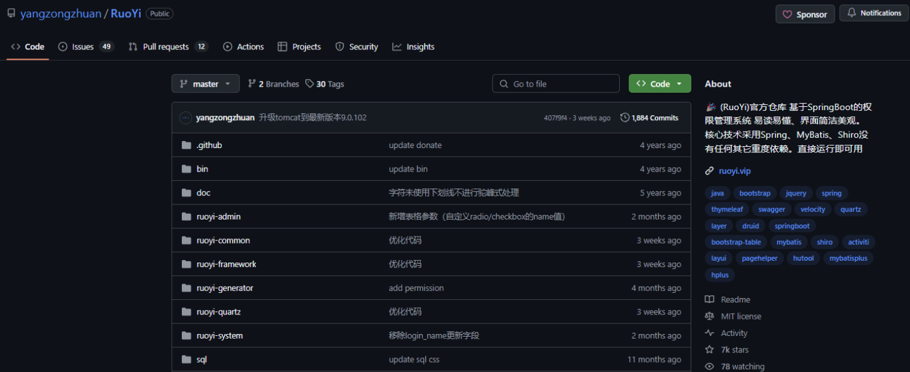

下载好对应的CMS安装部署包之后使用IDEA打开工程等待程序自动加载三方的JAR包：

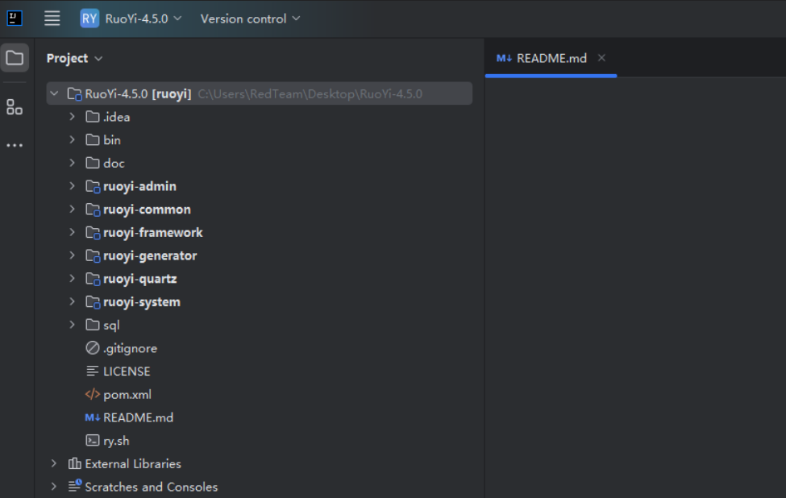

变更Server的端口规避端口冲突问题：

​

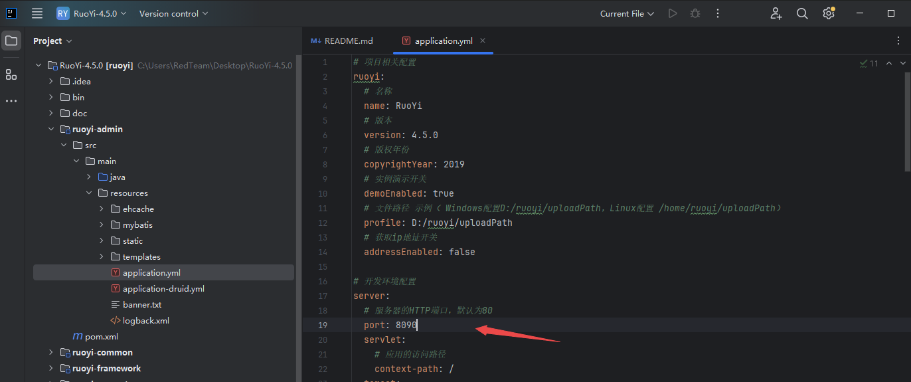

随后启动PHPStudy并新建数据库RY，随后导入数据库文件并更改配置文件application-druid.yml

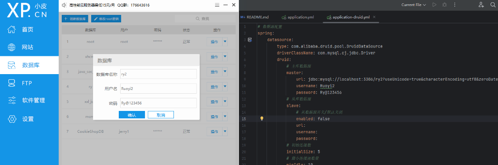

随后运行RuoYIApplication启动项目

​

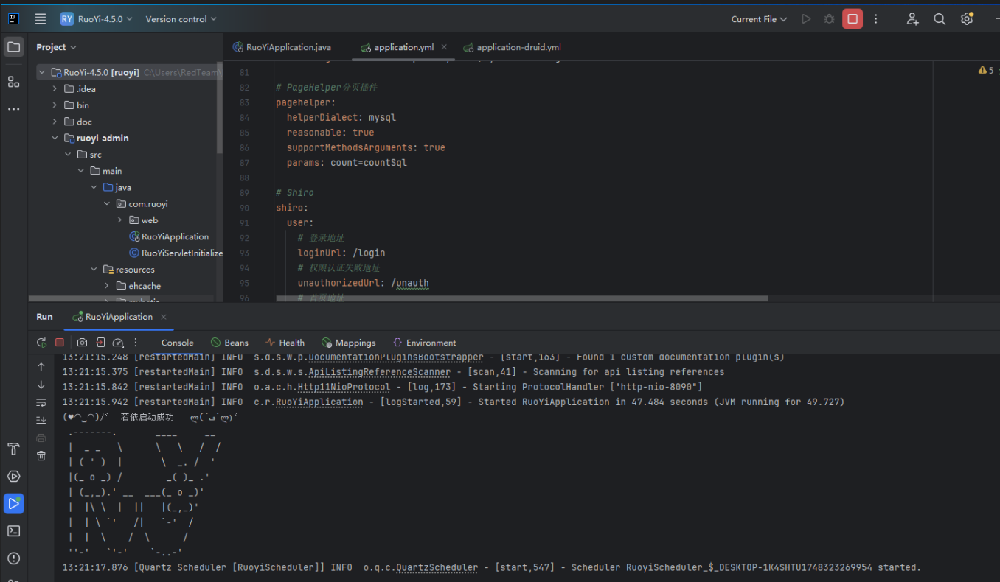

#### 代码审计

全局搜索关键字——"download"，随后定位到几处关键的代码部分

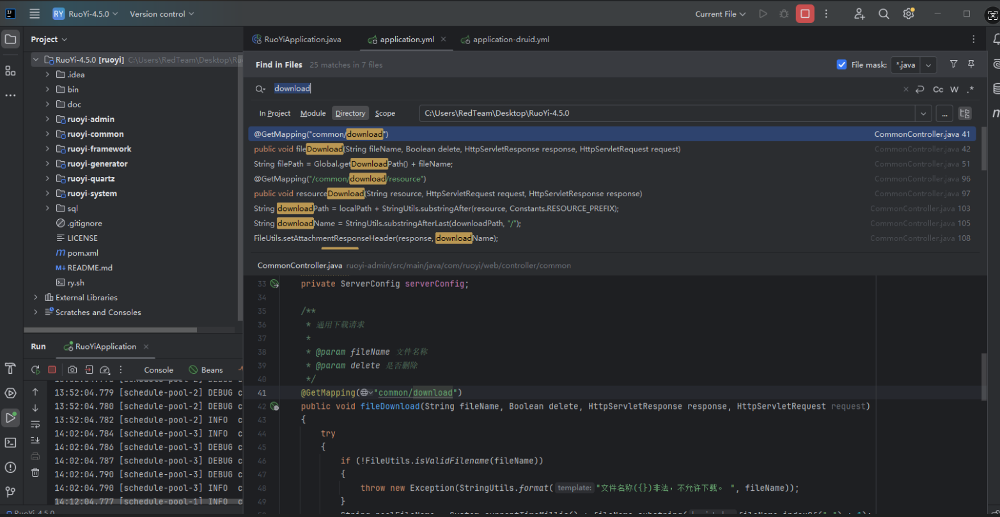

首先查看第一处common/download，可以看到这里首先对filename名称进行了校验检查

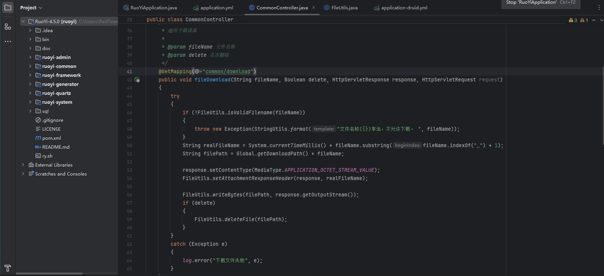

这里要求文件名中可以包含字母、数字、下划线、破折号、竖线、点和汉字字符，也就是说这里其实是对文件名称进行近似白名单的正则匹配，由于没法使用"/"导致我们这里虽然可以使用".."但是无法进行目录穿越来读取任意磁盘目录下的文件

​

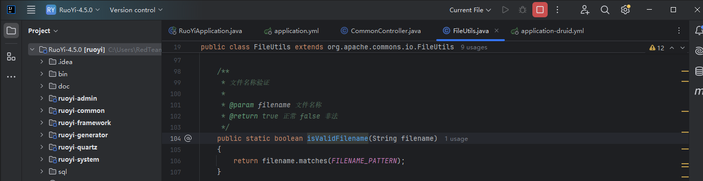

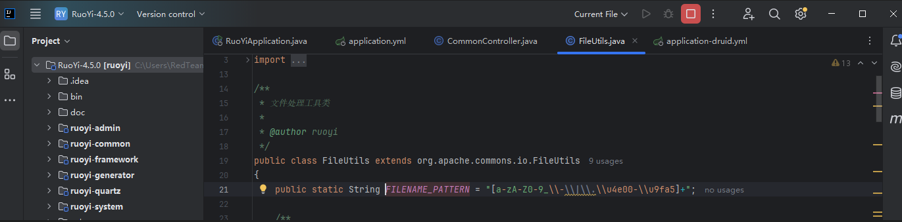

随后根据入参来创建一个新的文件名，将当前的时间戳加载原文件名的前面(去掉前缀\_后的部分)，随后设置下载文件的路径、响应包的ContentType和头部信息，随后写文件并进行Delete删除文件操作

​

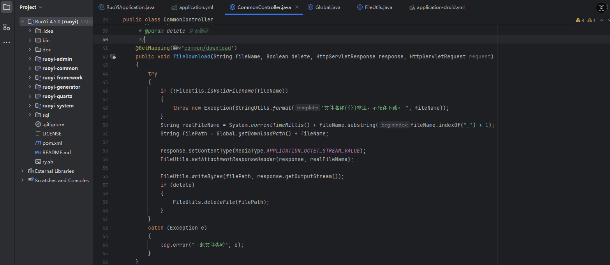

通过上面的分析我们可以知晓在这里登录之后的用户可以调用接口/common/download?fileName=xxxx来下载指定目录(application.yaml中的profile+"/download")下的文件并对文件进行删除操作，无法进行深入利用，这里和我们的预期不符，随后继续进行审计其他的地方

​

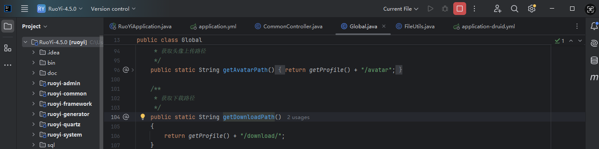

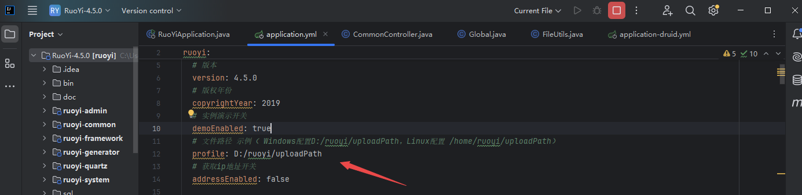

随后来到第二处可以调用的点——/common/download/resource，可以看到这里首先是获取了localPath(也就是配置文件中的profile)，随后调用StringUtils.substringAfter来截取/profile后面的路径信息并与前面的localPath进行拼接作为downloadPath，也就是下载的文件的物理路径，随后获取下载的文件名的名称信息并设置响应报文的ContentType，随后写数据流到响应报文中去，可以看到这里并未做任何的路径校验检查，例如:对文件路径中的../../等的过滤处理，所以可以用于实现任意文件下载/读取的目的

​

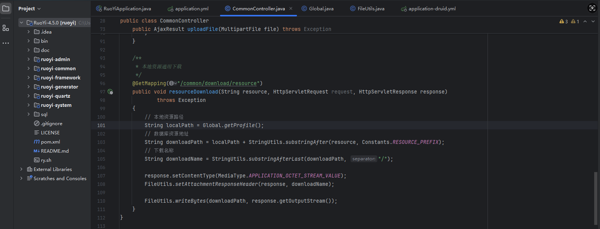

构造漏洞利用载荷如下所示：

```
/common/download/resource?resource=/profile/../../../../C:/windows/win.ini
```

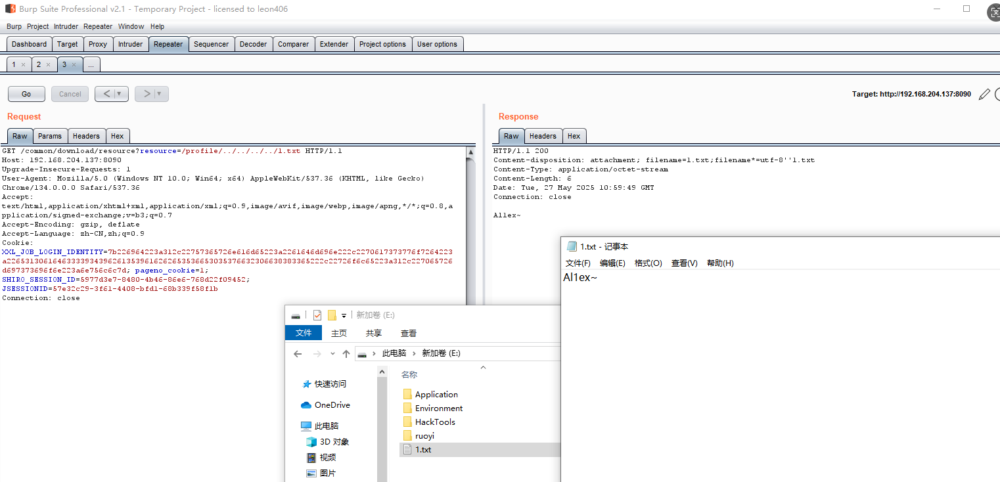

```
GET /common/download/resource?resource=/profile/../../../../1.txt HTTP/1.1
Host: 192.168.204.137:8090
Upgrade-Insecure-Requests: 1
User-Agent: Mozilla/5.0 (Windows NT 10.0; Win64; x64) AppleWebKit/537.36 (KHTML, like Gecko) Chrome/134.0.0.0 Safari/537.36
Accept: text/html,application/xhtml+xml,application/xml;q=0.9,image/avif,image/webp,image/apng,*/*;q=0.8,application/signed-exchange;v=b3;q=0.7
Accept-Encoding: gzip, deflate
Accept-Language: zh-CN,zh;q=0.9
Cookie: XXL_JOB_LOGIN_IDENTITY=7b226964223a312c22757365726e616d65223a2261646d696e222c2270617373776f7264223a226531306164633339343962613539616262653536653035376632306638383365222c22726f6c65223a312c227065726d697373696f6e223a6e756c6c7d; pageno_cookie=1; SHIRO_SESSION_ID=5977d3e7-8480-4b46-86e6-768d22f09452; JSESSIONID=57e32c29-3f61-4408-bfd1-68b339f58f1b
Connection: close

```

#### 修复方案

在Ruoyi CMS 4.5.1版本中增加了对下载文件的校验检查：

```
    /**
     * 本地资源通用下载
     */
    @GetMapping("/common/download/resource")
    public void resourceDownload(String resource, HttpServletRequest request, HttpServletResponse response)
            throws Exception
    {
        try
        {
            if (!FileUtils.checkAllowDownload(resource))
            {
                throw new Exception(StringUtils.format("资源文件({})非法，不允许下载。 ", resource));
            }
            // 本地资源路径
            String localPath = RuoYiConfig.getProfile();
            // 数据库资源地址
            String downloadPath = localPath + StringUtils.substringAfter(resource, Constants.RESOURCE_PREFIX);
            // 下载名称
            String downloadName = StringUtils.substringAfterLast(downloadPath, "/");
            response.setContentType(MediaType.APPLICATION_OCTET_STREAM_VALUE);
            FileUtils.setAttachmentResponseHeader(response, downloadName);
            FileUtils.writeBytes(downloadPath, response.getOutputStream());
        }
        catch (Exception e)
        {
            log.error("下载文件失败", e);
        }
    }
}
```

在这里通过checkAllowDownload对资源文件进行合法性检查

```
    /**
     * 检查文件是否可下载
     * 
     * @param resource 需要下载的文件
     * @return true 正常 false 非法
     */
    public static boolean checkAllowDownload(String resource)
    {
        // 禁止目录上跳级别
        if (StringUtils.contains(resource, ".."))
        {
            return false;
        }

        // 检查允许下载的文件规则
        if (ArrayUtils.contains(MimeTypeUtils.DEFAULT_ALLOWED_EXTENSION, FileTypeUtils.getFileType(resource)))
        {
            return true;
        }

        // 不在允许下载的文件规则
        return false;
    }
```

文件白名单列表如下：

```
    public static final String[] DEFAULT_ALLOWED_EXTENSION = {
            // 图片
            "bmp", "gif", "jpg", "jpeg", "png",
            // word excel powerpoint
            "doc", "docx", "xls", "xlsx", "ppt", "pptx", "html", "htm", "txt",
            // 压缩文件
            "rar", "zip", "gz", "bz2",
            // 视频格式
            "mp4", "avi", "rmvb",
            // pdf
            "pdf" };
```

​

最后不得不说这种修复方案确实很哇塞，一个是对下载的文件路径进行了检查，另外一个是建立了下载的文件规则，只允许在规则内的文件下载，腻害，腻害~
