# 使用api hash技术的Amadey Bot样本分析-先知社区

> **来源**: https://xz.aliyun.com/news/18397  
> **文章ID**: 18397

---

### 样本信息

HASH: 449d9e29d49dea9697c9a84bb7cc68b50343014d9e14667875a83cade9adbc60

基本信息：32位exe程序

DIE分析为cab文件，cab文件可理解为压缩的可执行文件，因此可通过解压缩程序将cab文件进行解压。

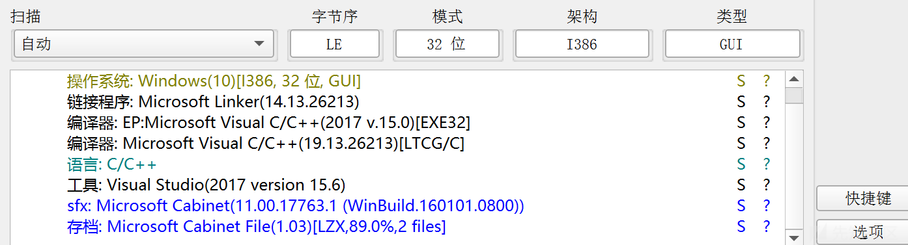

样本解压后将获得2个exe文件，分别为si684017.exe和un007241.exe

### si684017.exe

si684017.exe同样是一个32位exe程序。查看si684017.exe的基础信息，发现其.data节rawsize和virtualsize大小不一致。

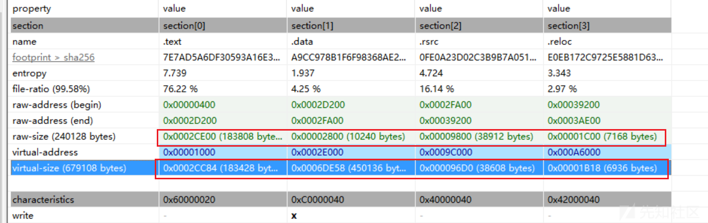

查看其导入函数，存在文件操作、内存分配等。推测为加载器。

使用x32dbg动态调试程序，重点关注内存分配函数。使用IDA进行静态分析，分析过程中发现该样本存在大量垃圾代码被用于反分析（示例见下图）。

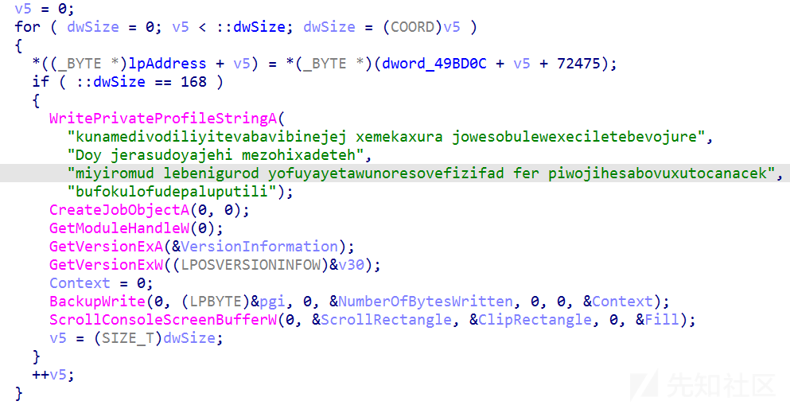

程序进行第一次内存分配使用GlobalAlloc，随后调用virtualprotect，给予40权限，即读写执行权限。并且利用函数4032e0计算并填充分配的空间，每次填充8字节。

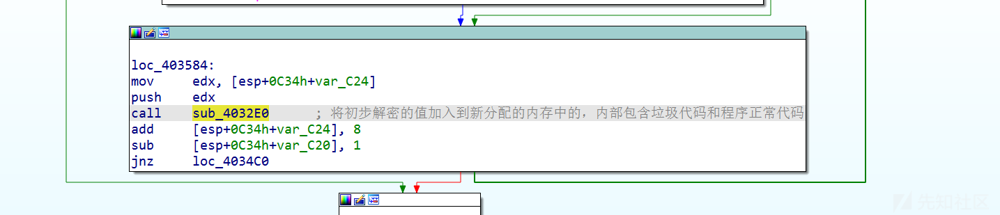

回到原代码，样本将继续执行多段无效垃圾代码，随后调用Loadlibrary加载msimg32.dll，然后通过call跳转到此前分配的内存空间执行解密的代码。在Loadlibrary和getprocessaddress函数处下条件断点，记录其参数，发现样本获取了如下函数的地址。

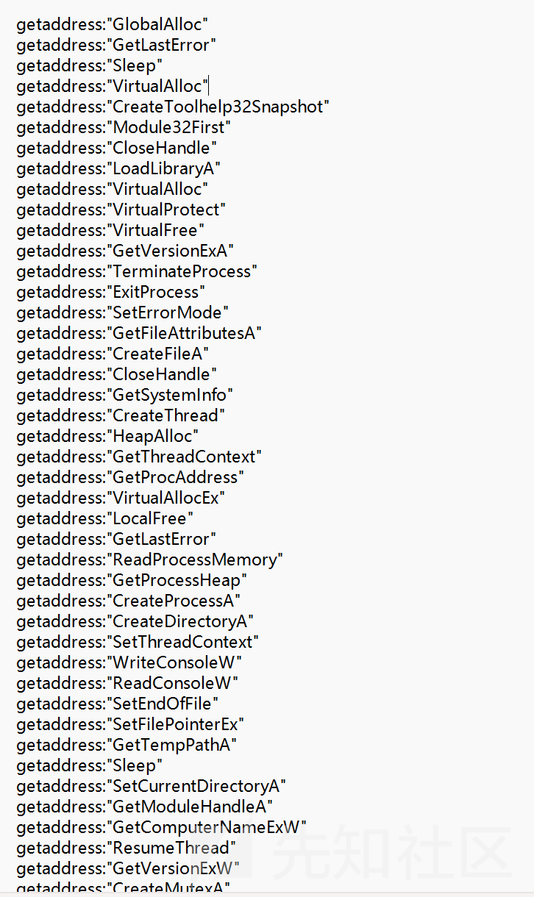

程序进入第一层分配的内存空间，前期初始化后，获取[PEB的地址](https://bbs.kanxue.com/thread-266678.htm)，通过PEB获取kernel32.dll库的基址，并根据其基址获取函数名称表。

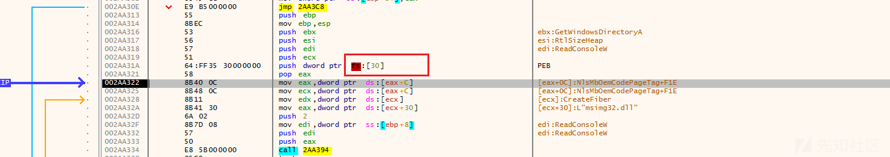

随后程序将自定义函数hash传参，通过遍历dll库函数名称计算特定hash，与传入的参数值做对比。经调试当函数名称为LoadlibraryA时，函数hash符合已有值D5786。函数名称为GetProcAddress时，函数hash符合已有值348BFA。

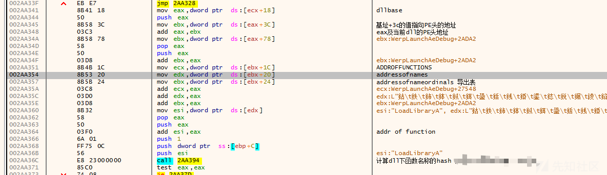

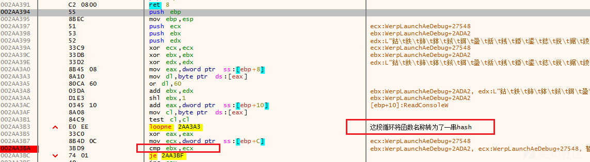

程序将kernel32.dll字符串的十六进制拆成三组倒序进行拼装来调用

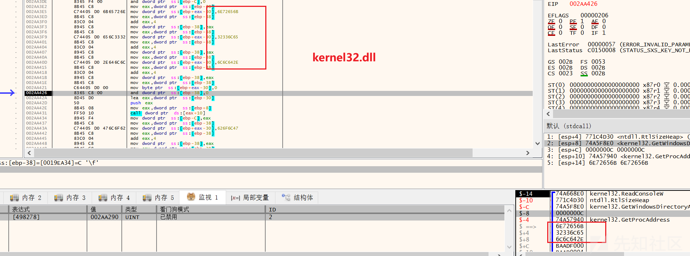

通过Loadlirary加载kernel32.dll

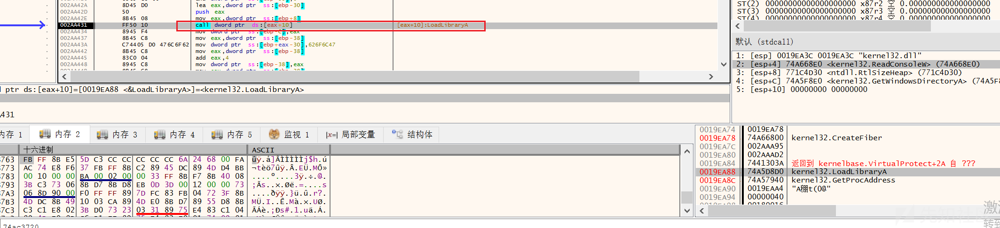

后续通过同样的方法调用getprocaddress获取globalalloc、getlasterror、sleep、virtualalloc、CreateToolhelp32Snapshot、module32first、closehandle的地址。

随后样本通过virtualalloc分配新的内存空间，并将上次内存空间中的部分内容转存到新的内存空间。

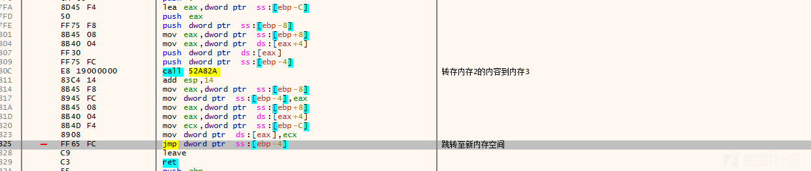

在新内存中，通过PEB获取kernel32dll基址，调用getprocaddress函数获取Loadlibrary函数地址

并且使用老方法，在加载kernel32dll后，同样通过getprocaddress获取多个需要的函数地址，函数名称如下：

```
getaddress:"LoadLibraryA"
getaddress:"VirtualAlloc"
getaddress:"VirtualProtect"
getaddress:"VirtualFree"
getaddress:"GetVersionExA"
getaddress:"TerminateProcess"
getaddress:"ExitProcess"
getaddress:"SetErrorMode"
```

随后程序通过getversion获取版本号，若版本低于Windows Vista，则返回。


获取操作系统的[主版本号](https://learn.microsoft.com/zh-cn/windows-hardware/drivers/install/inf-manufacturer-section)及内部号

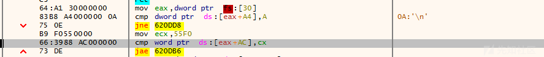

样本调用virtualalloc分配新的内存空间，并将此前内存空间中的特定内容结果处理后写入新的内存空间，查看可知写入的内容是一个可执行文件（导出了文件内容，后面动静态结合分析）。

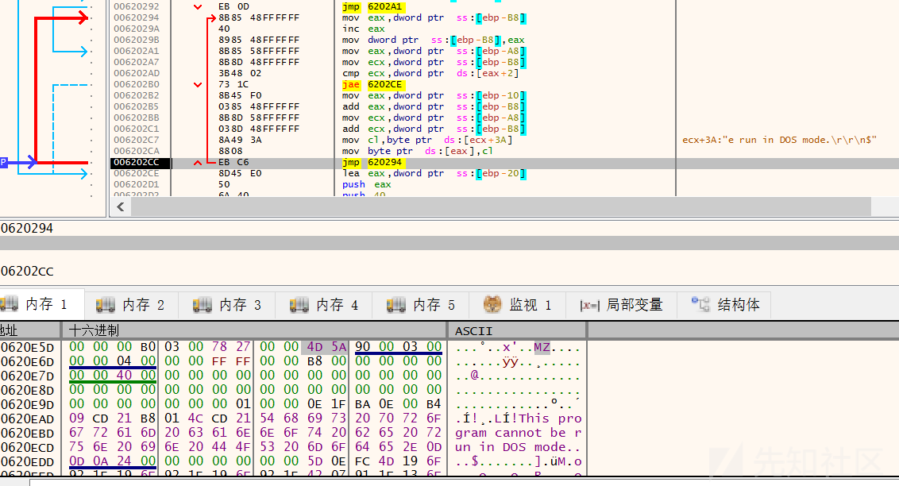

随后代码将新内存空间的内容写入si684017.exe。

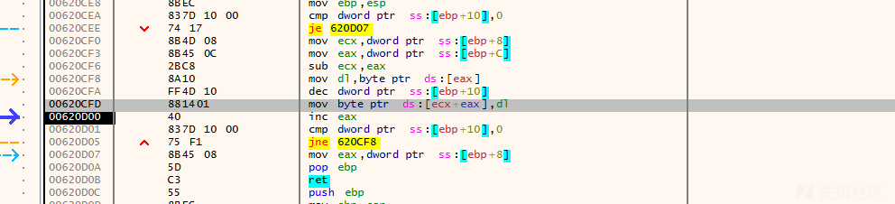

写入完毕后，释放内存。

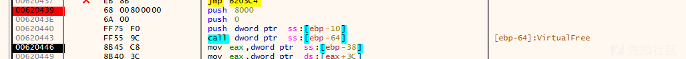

样本获取其所需的库函数地址填写入si684017.exe的指定位置，该过程分四次填充完成

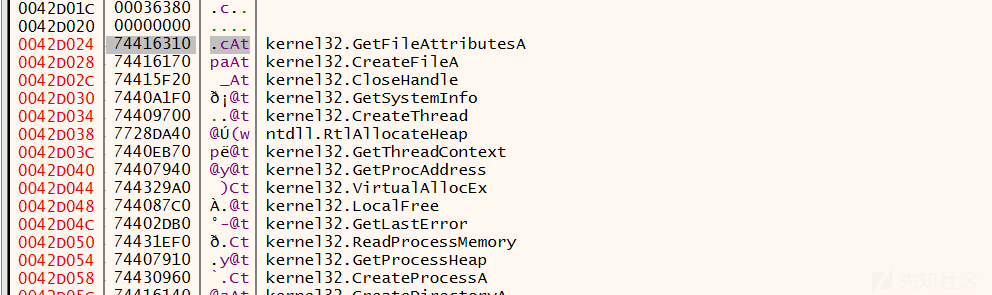

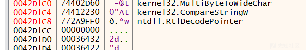

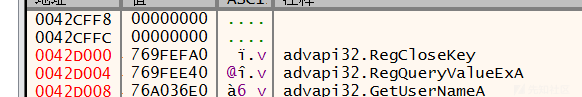

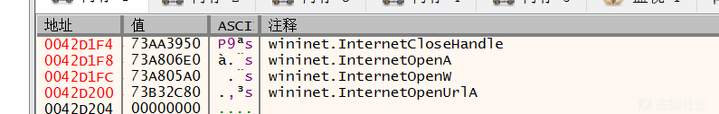

获取地址完毕后，地址跳转到si684017.exe的内存空间（地址416025）中继续执行（这里开始为此前新加载的内容）。

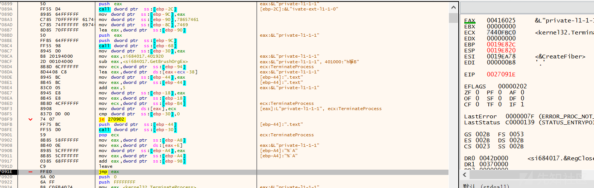

代码创建新的内存区域存放并处理了环境变量信息

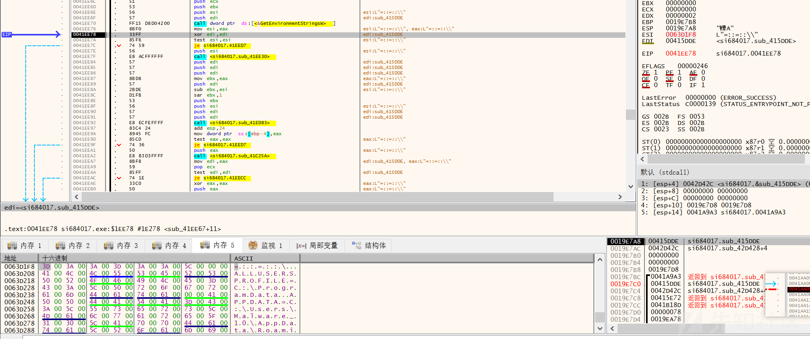

代码开始执行此前写入的可执行文件内容（关键地址为00414040），通过其自定义解密函数解密后为595f021478，

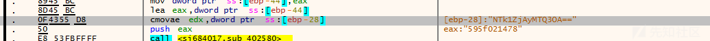

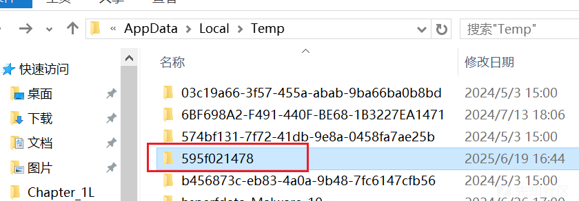

解密出文件名称oneetx.exe，

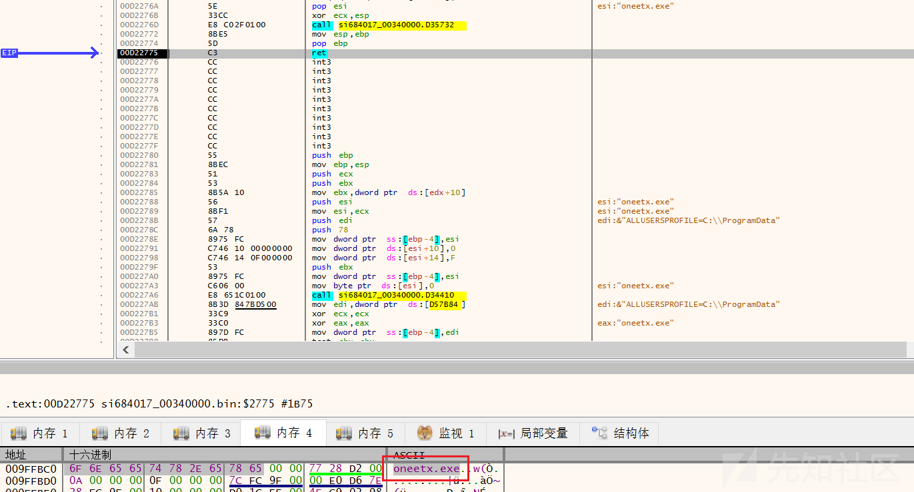

并且通过shellexecute创建了文件oneetx.exe，oneetx.exe是原始样本加载了新的恶意内容后的程序。

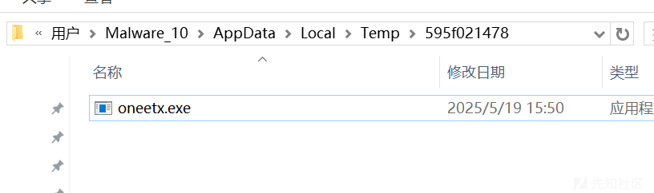

综上可知该样本的关键恶意内容就是此前写入的那部分，因此在最后一次virtualalloc后对这新内存的内容进行了导出，接下来会结合导出内容的静态分析结果一起分析。

#### 静态分析

首先静态分析发现新内容包含多条疑似base64编码的数据，base64解码均为乱码。说明加密方式并非base64编码。

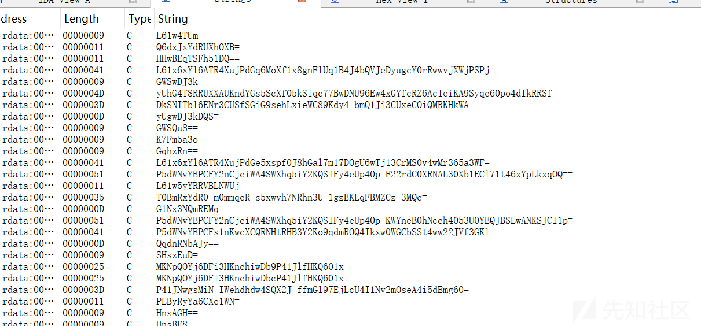

其次代码包含多个敏感的导入函数，涉及网络连接、内存读写、文件编辑、命令执行、注册表修改等功能。

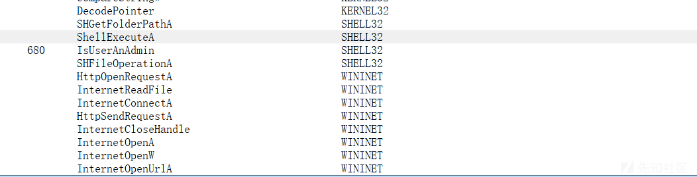

#### 动态分析

经过反复调试和静态代码分析发现程序中有两处地方需要手动修改以避免程序终止运行，第一处为下图中的bl值，修改为1即可。

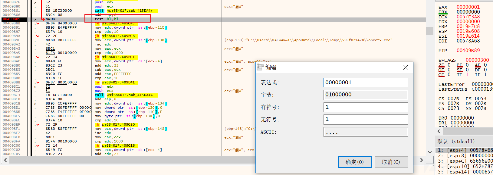

第二处在创建互斥量之后(407B94)，代码会检测当前环境是否已创建互斥量，互斥量值为"006700e5a2ab05704bbb0c589b88924d"。若已创建互斥量，程序将终止运行。修改eax值为b7以外的值继续运行代码。

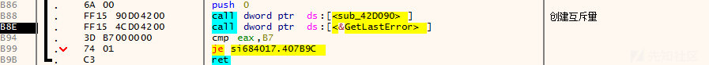

之后，恶意代码将以KEY\_ALL\_ACCESS的权限获取注册表HKEY\_CURRENT\_USER\SOFTWARE\Microsoft\Windows\CurrentVersion\Explorer\User Shell Folders的句柄。

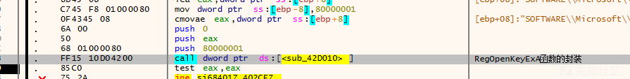

将当前恶意程序所属的路径设置为启动目录(用户登入会检测)

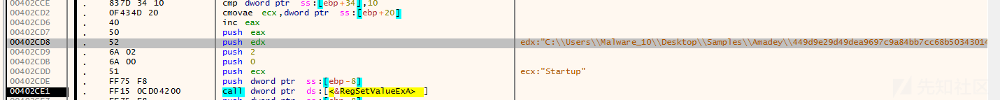

通过其自定义解密函数解密（4141f0结合4029b0，静态分析之前导出的内容知道恶意代码包含很多加密字符串与base64编码的很相似）其携带的字符串，该字符串实际为创建计划任务的命令。


计划任务命令通过shellexecute函数执行，命令如下

schtasks /Create /SC MINUTE /MO 1 /TN si684017.exe /TR \"当前进程的绝对路径" /F"

获取当前操作系统的信息，返回值9，代表当前环境为PROCESSOR\_ARCHITECTURE\_AMD64。

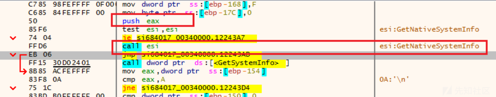

样本通过getcomputername等函数还会获取主机名称、用户名称、主机SID、杀软程序名称等值，通过解密的参数拼接。

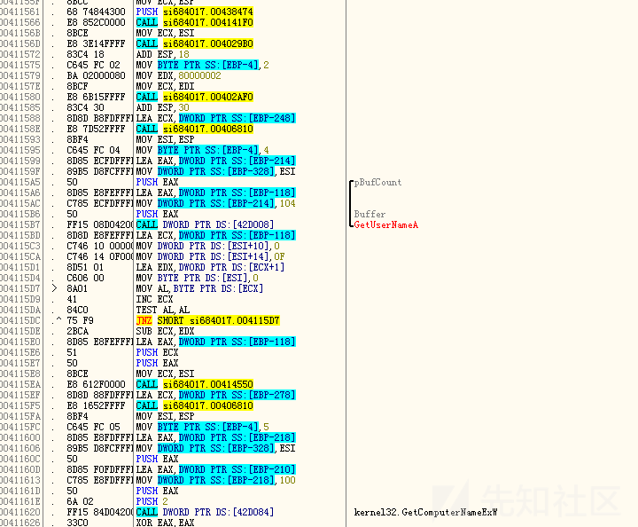

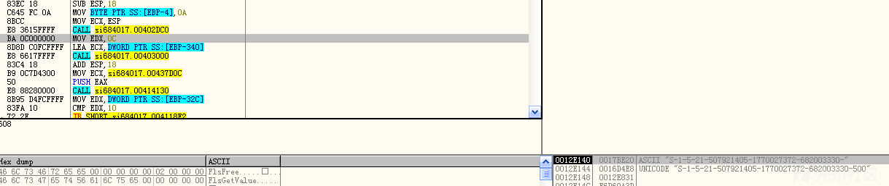

分析中环境出了问题，换了个环境继续分析。

解密依然使用4141f0函数和4029b0函数结合。

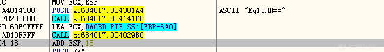

最后程序将获取内容与解密内容进行拼接，并通过特定url发送，测试环境的参数结果如下

&id=667007790723&vs=3.70&sd=b50502&os=1&bi=1&ar=1&pc=DESKTOP-534ND1J&un=Malware\_10&dm=&av=13&lv=0&og=1"

通过解密函数获取其解密的其他字符串内容如下，可知程序将通过：

```
decoded "Startup"
decoded &"SOFTWARE\Microsoft\Windows\CurrentVersion\Explorer\User Shell Folders"
decoded "" /F"
decoded " /TR ""
decoded &"/Create /SC MINUTE /MO 1 /TN "
decoded &"GetNativeSystemInfo"
decoded "kernel32.dll"
decoded "CurrentBuild"
decoded &"SOFTWARE\Microsoft\Windows NT\CurrentVersion"
decoded &"GetNativeSystemInfo"
decoded "kernel32.dll"
decoded "ComputerName"
decoded &"SYSTEM\CurrentControlSet\Control\ComputerName\ComputerName"
decoded &"abcdefghijklmnopqrstuvwxyz0123456789-_"
decoded &"abcdefghijklmnopqrstuvwxyz0123456789-_"
decoded &"abcdefghijklmnopqrstuvwxyz0123456789-_"
decoded "AVAST Software"
decoded "ProgramData\"
decoded "Avira"
decoded "ProgramData\"
decoded "Kaspersky Lab"
decoded "ProgramData\"
decoded "ESET"
decoded "ProgramData\"
decoded "Panda Security"
decoded "ProgramData\"
decoded "Doctor Web"
decoded "ProgramData\"
decoded "AVG"
decoded "ProgramData\"
decoded &"360TotalSecurity"
decoded "ProgramData\"
decoded "Bitdefender"
decoded "ProgramData\"
decoded "Norton"
decoded "ProgramData\"
decoded "Sophos"
decoded "ProgramData\"
decoded "Comodo"
decoded "ProgramData\"
decoded &"GetNativeSystemInfo"
decoded "kernel32.dll"
decoded "CurrentBuild"
decoded &"SOFTWARE\Microsoft\Windows NT\CurrentVersion"
decoded "&og="
decoded "&lv="
decoded "&av="
decoded "&dm="
decoded "&un="
decoded "&pc="
decoded "&ar="
decoded "&bi="
decoded "&os="
decoded "&sd="
decoded "3.70"
decoded "&vs="
decoded "id="
decoded &"/plays/chapter/index.php"
decoded "
77.91.124.207
"
decoded "POST"
decoded &"Content-Type: application/x-www-form-urlencoded"
decoded &"Content-Type: application/x-www-form-urlencoded"
decoded "<c>"
decoded &"GetNativeSystemInfo"
decoded "kernel32.dll"
decoded "dll"
decoded "dll"
decoded &"/plays/chapter/index.php"
decoded "
77.91.124.207
"
decoded "Plugins/"
decoded "http://"
decoded "https://"
decoded "http://"
```

### 参考链接

[x32dbg条件输出格式](https://help.x64dbg.com/en/latest/introduction/Formatting.html)

[PEB](https://www.vergiliusproject.com/kernels/x64/windows-10/22h2/_TEB32)

[pebshellcode分析](https://www.anquanke.com/post/id/237127)

[0xFC=> CLD](https://ieeexplore.ieee.org/stamp/stamp.jsp?arnumber=10963744)

[API HASH技术](https://nosec.org/home/detail/4647.html)

[shellcode特征识别](https://x.com/embee_research/status/1568910996395425793)
