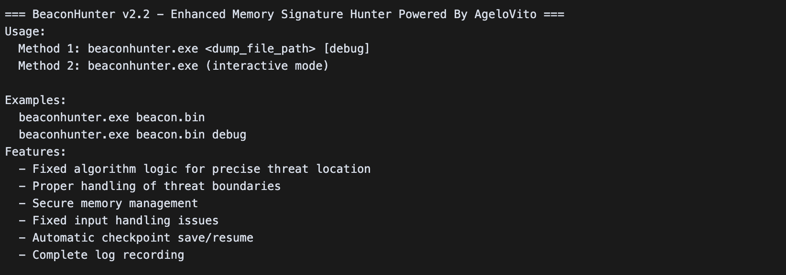
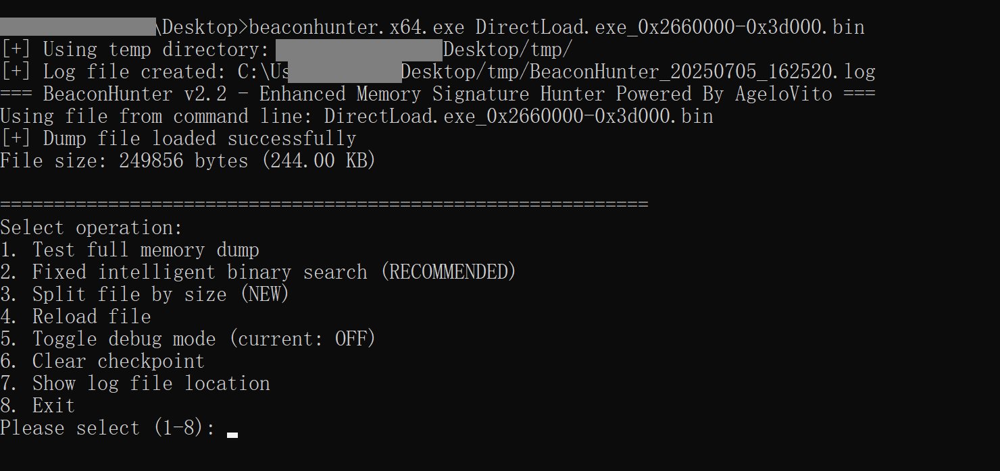
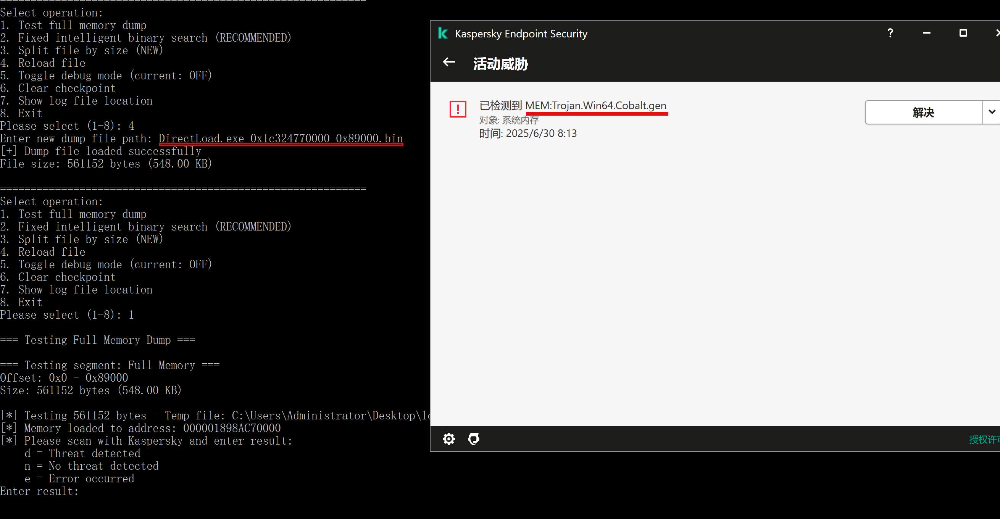
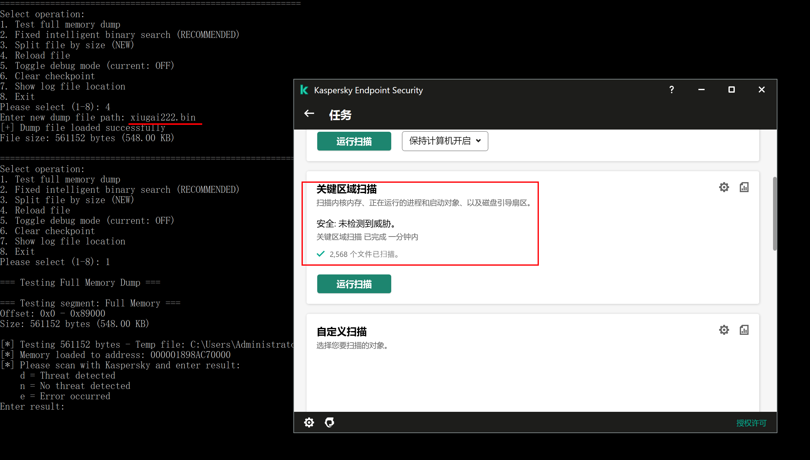
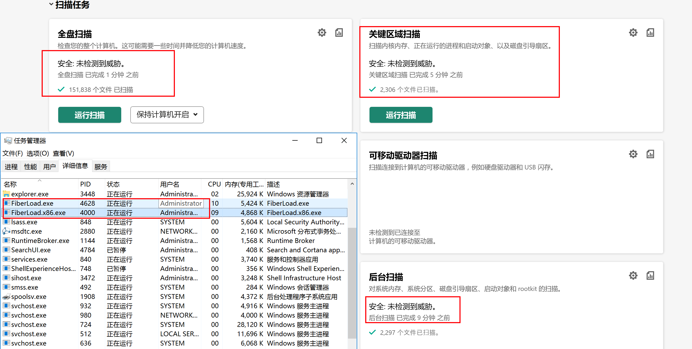
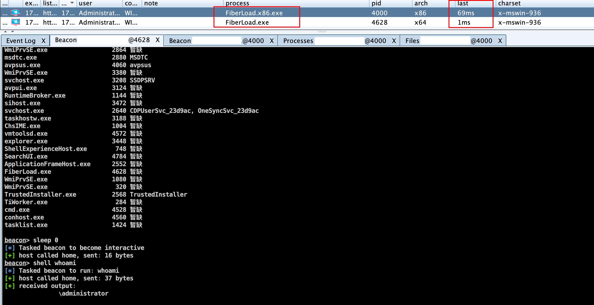
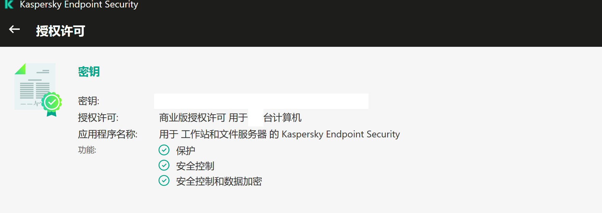

# MEM Defense Evasion-先知社区

> **来源**: https://xz.aliyun.com/news/18407  
> **文章ID**: 18407

---

# MEM Defense Evasion

**Posted on** **July 5, 2025** **by AgeloVito**

简单记录下 bypass Kaspersky 针对 Cobalt Stike 的内存扫描（MEM:Trojan.Win64.Cobalt.gen）

## 0x01 手动定位

手动定位内存特征

以卡巴斯基为例，存在内存特征的时候，beacon.dll在内存展开后，当我们使用点击扫描关键区域或者自动的后台扫描功能时，它在扫描内存的时候就会根据自身的特征库将匹配到的内存特征识别出来，各种防护软件的特征库不一样，其他edr或者av同理。

在没有yara规则文件的情况下，就只能手动去定位。

1、首先用processhacker找到beacon内存区域并且dump下来；

2、用工具读取保存到文件的内存数据然后申请rwx放到内存中去；

3、使用带有内存扫描的功能，如果扫描到报毒后不要让其自动处理；

4、重复这个过程使用二分法定位即可；

为此写了辅助的小工具（BeaconHunter），需要的朋友自取

​



​



这个是使用过程中找到的两张图，具体怎么用，参考下面的简介吧，实在不会用你就自己写吧，我反正是够用了，不接受建议。

​



​



### beaconhunter功能简介

#### 1. 内存转储文件加载与分析

程序可以加载指定的内存转储文件，等待你反馈对其内容扫描的结果，寻找特定的威胁特征。

#### 2. 智能二分查找与分段检测

具备智能二分查找算法，可以高效定位内存中的可疑区域，并支持对指定内存段进行详细检测。

#### 3. 检测结果反馈分类

检测结果分为：

* 发现威胁
* 未发现威胁
* 扫描错误
* 超时

#### 4. 日志与调试功能

支持详细的日志记录（含时间戳），可输出到文件和控制台，并有调试模式便于问题排查。

#### 5. 断点续扫与检查点机制

检查点机制允许在扫描过程中保存进度，支持断点续扫，避免大文件分析时因中断而重复劳动。

#### 6. 辅助功能

* 支持将大文件按指定大小分割
* 可以打印内存十六进制数据
* 提供安全的内存分配与释放接口
* 具备命令行参数解析和使用说明输出

#### 7. 平台与用途

该工具主要面向 Windows 平台，适用于安全研究人员、应急响应人员对内存转储文件进行恶意代码或威胁特征的快速定位和分析。

## 0x02 分析指令码

1、将定位出来的十六进制指令码上下几段多复制些；

2、让ai分析下其反汇编对应的指令并推测其大概的伪代码，或者手动使用其他工具自己去反汇编并分析；

3、有些指令码可能会对应多个地方，所以多尝试多分析；

## 0x03 修改内存特征

根据分析结果定位出大概是哪些地方的功能代码产生的内存特征

1、有自实现beaon端源代码的情况下去修改你的代码即可；

2、没源代码的情况下用一些思路去 patch beacon.dll 即可；

3、大致根据记忆说一些点，rdll，sleep，sleepmask，inject，一些hash和加密算法，一些struct ...

4、多看看公开的那些yara规则是怎么写的，了解他们提取特征的思路，然后将其打乱(流程和结构)或者等效替换 ...

比如下面这个就收集的挺不错

YARA rules for MemProcFS-Analyzer

```
https://github.com/evild3ad/yara

```

**5、建议各环节都善用各类AI，它们的能力偏重点都不一样！！！**

## 0x04 最终效果

最终在 no sleep ，no mask 的情况下也能达到卡巴斯基内存扫描无法检出的效果；

扫描的时候没有测太多，就简单用了下些 cobalt strike 的功能；

后来花了点时间把 x86 也完善了下，为了兼容性需求，x8 6支持到 xp 2003（原生cobalt strike功能全兼容）

MEM这块儿算是阶段性达到目标了

​



​





没啥新的技术，只是回应下大家的私信，将思路文字化一下，有耐心多学习多实践就好了。
