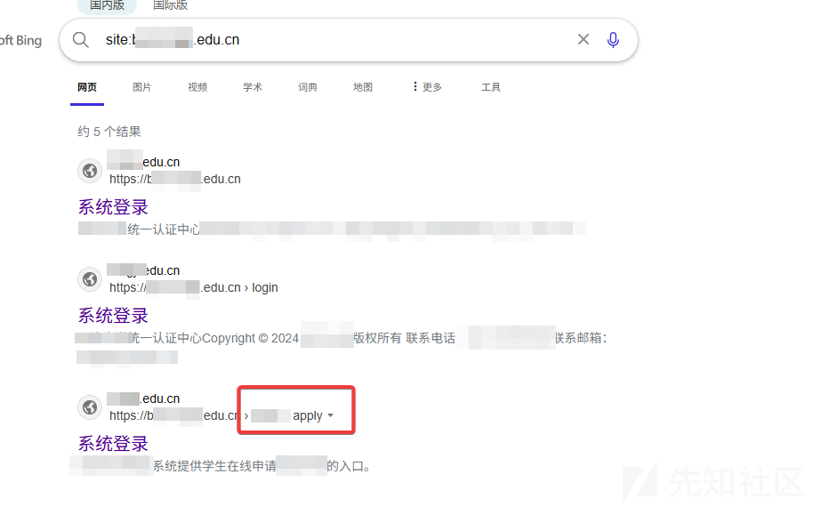
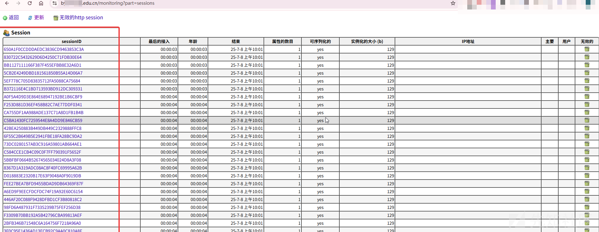
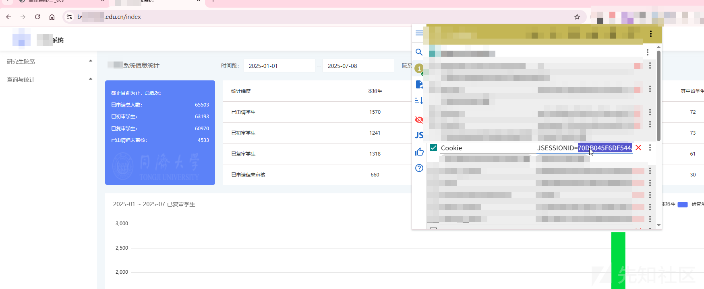
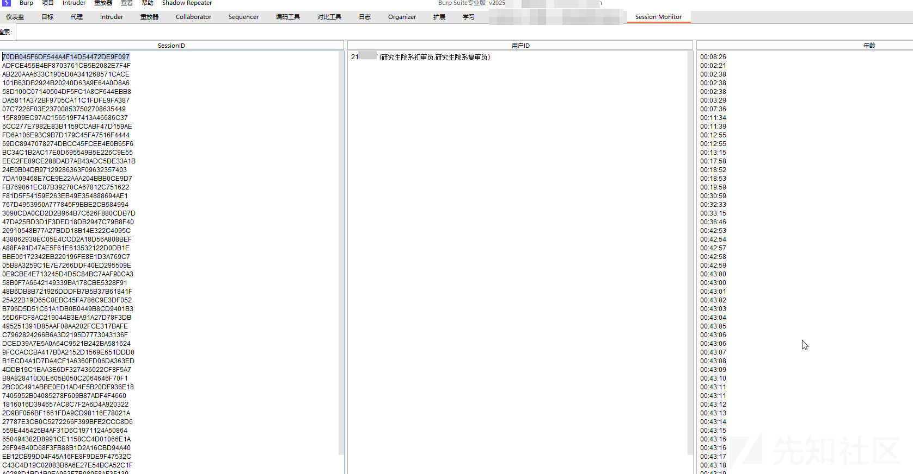
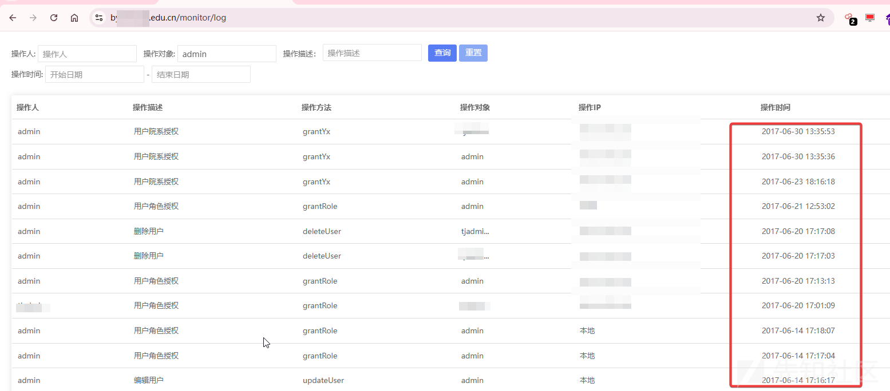
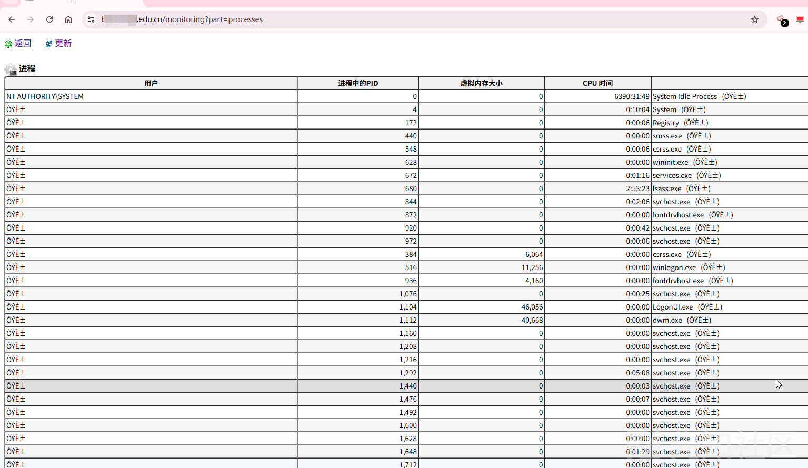
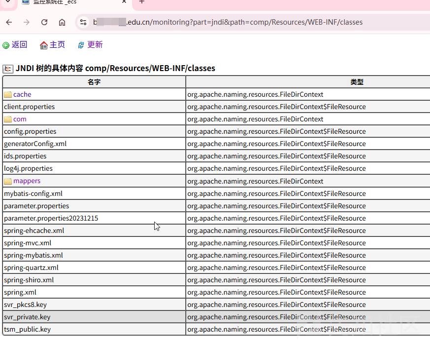
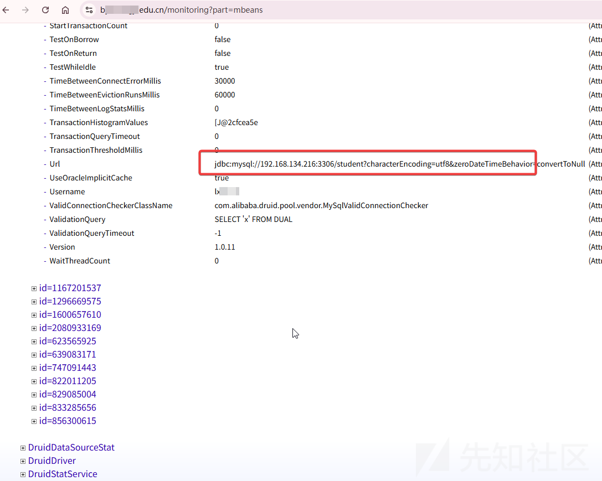

# 记一次某985名校的javaMelody未授权漏洞-先知社区

> **来源**: https://xz.aliyun.com/news/18425  
> **文章ID**: 18425

---

> 前言：之前遇到过很多次的有waf保护的网站或者是跳转到统一身份认证的网站，遇到这种情况往往使我束手无策，一般都是直接跳过，但是这种反而容易留下没有人发现的漏洞

首先我拿到一个目标，发现它会直接跳转到统一身份认证，我这里让它加载了一半就停止了，还没来得及跳转。

​

但是js也没有泄露什么路由信息

​

这种情况下我肯定是要去爆破目录的，然后同时使用google语法搜索网上泄露的路由

​

如下找到了一个路由

​

​

随便找一个用户的session，然后修改cookie，发现竟然成功的访问系统了

​

按照道理来说如果管理员登录的话也可以使用这方法来接管，所以我们需要监控管理员的登录

​

写了一个burpsuite插件可以监控session信息

​

但是很遗憾管理员很久都没有登陆了，我也没有蹲到高权限的管理员

继续回到melody的界面

还可以查看系统的进程

查看jndi树

能够看到项目结构，但是文件无法查看

查看mbeans

可以看到数据库的地址和用户名

​

​

​

​

​

​

​

​

​
