# RuoYi-Vue-Plus sendMessageWithAttachment 任意文件读取漏洞-先知社区

> **来源**: https://xz.aliyun.com/news/18429  
> **文章ID**: 18429

---

# RuoYi-Vue-Plus sendMessageWithAttachment 任意文件读取漏洞

## 漏洞简介

RuoYi-Vue-Plus 是一个基于 Vue3 和 Spring Boot 3.x 构建的多租户权限管理系统，具备强大的功能模块，如代码生成器、分布式任务调度、多数据源事务等，支持多种数据库和第三方集成。其在sendMessageWithAttachment中存在任意文件读取可能导致敏感信息泄露、权限提升、数据篡改、业务逻辑攻击等多种危害，严重威胁系统的安全性、稳定性和合规性。

## 影响版本

<=v5.4.0

## fofa

body="RuoYi-Vue-Plus后台管理框架"

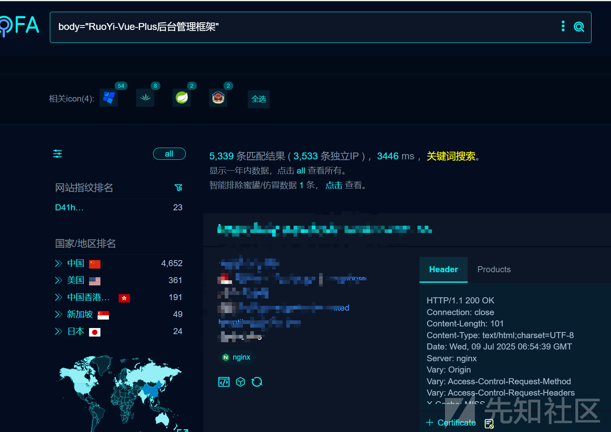

## 漏洞分析

双击shift全局搜索sendMessageWithAttachment

来到org.dromara.demo.controller.Mailcontroller中

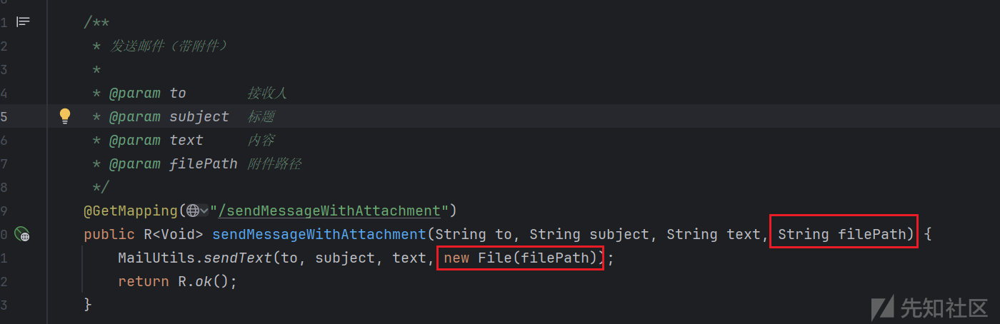

**分析**：在该方法中可以看到filepath是我们可以控制的参数表示附件路径，然后就调用了SendText方法

然后将内嵌调用了3次send方法

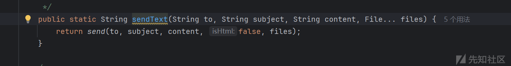

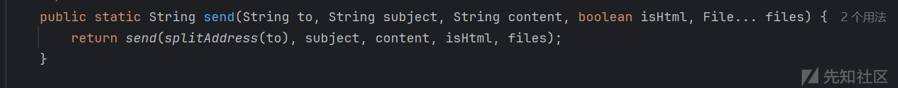

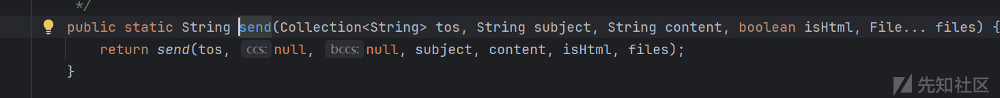

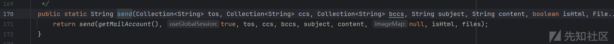

最终来到MailUtils类中的一个send方法中

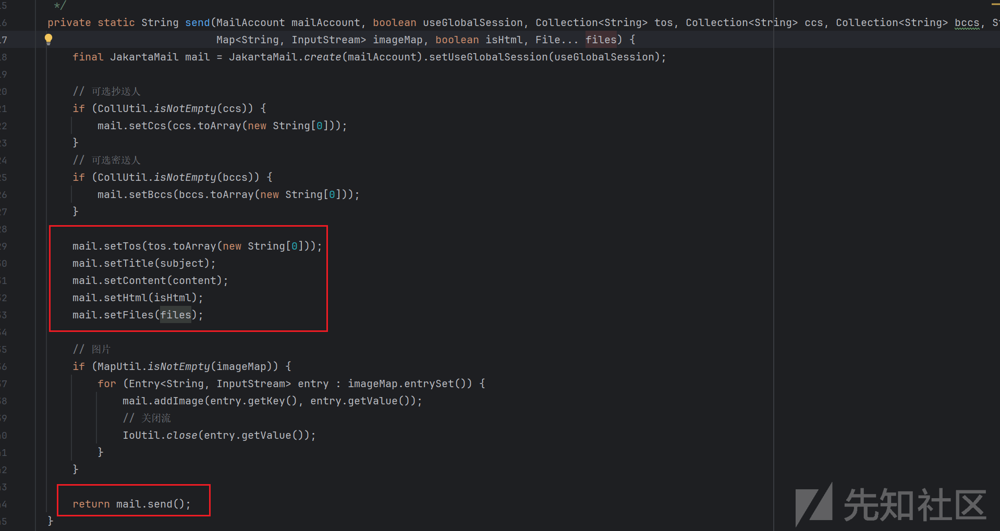

**分析**：在这个方法中允许给多人发送一个文件列表，可以看到依次调用了setTos、setTitle、setContent、setHtml、setFiles进行收件人、标题、正文、是否为HTML格式、以及附件的设置，接着到最后又调用了一个mail.send方法

毕竟是任意文件读取，我们关系的是本地文件是在哪里读取的，我们先看看setFiles方法

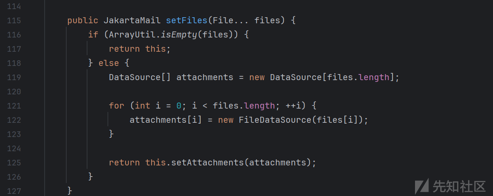

**分析**：在该方法中首先创建一个file.length的DataSource数组对象，然后依次遍历每一个然后创建一个FileDateSource对象赋值给对应的attachments数组中，然后调用setAttachments方法，FileDateSource构造方法如下

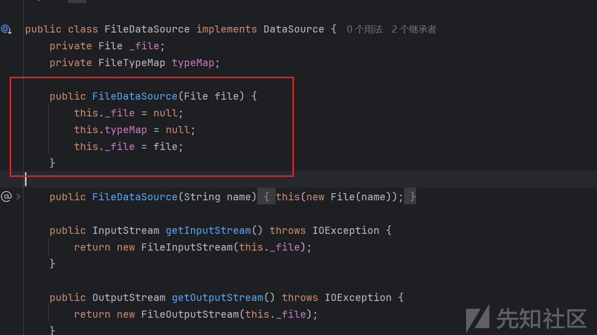

接着来到setAttachments方法中

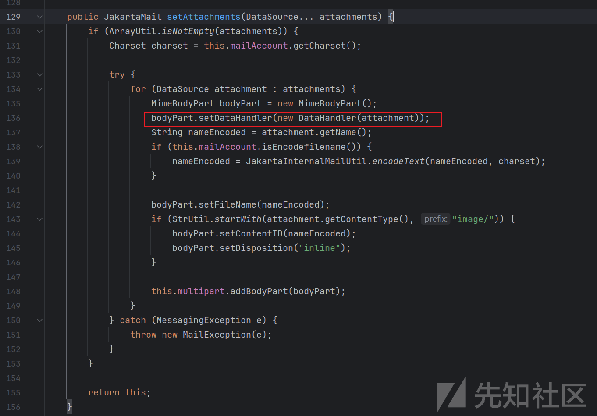

**分析**：这个方法它接收一个或多个 DataSource 类型的附件，对每个附件进行处理：设置附件名称（支持编码以避免乱码），并根据附件类型是否为图片来设置是否内嵌显示。处理后的附件被添加到邮件的多部件消息中

可以看到我们追踪的setFiles只要主要是将 FileDataSource 封装进 DataHandler，为文件的读取做准备

接着我们回到之前的send方法中，要知道在调用完setFiles等方法之后，然后将其都添加到了mail变量中，之后又调用了mail.send方法

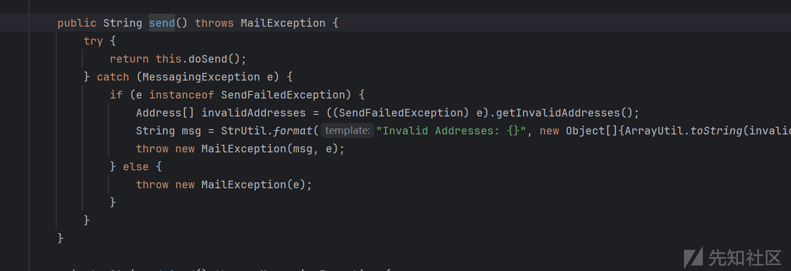

接着就调用了doSend方法

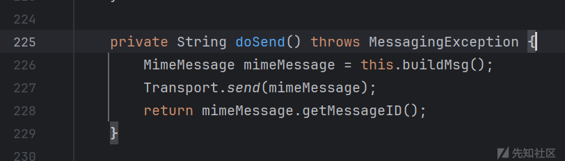

在这个方法中首先创建了一个buidMsg方法，这个方法主要是用于设置一封完整的邮件消息的信息。它根据邮件账户配置和邮件内容，设置邮件的发件人、主题、发送日期、正文内容、收件人、抄送人、密送人和回复地址等信息，然后将这些信息赋值给mimeMessge变量，然后将其作为参数调用send方法

接着就调用了Transport.send方法，在该方法中有调用了send0方法

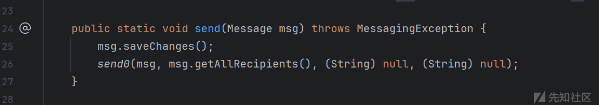

来到send0方法中

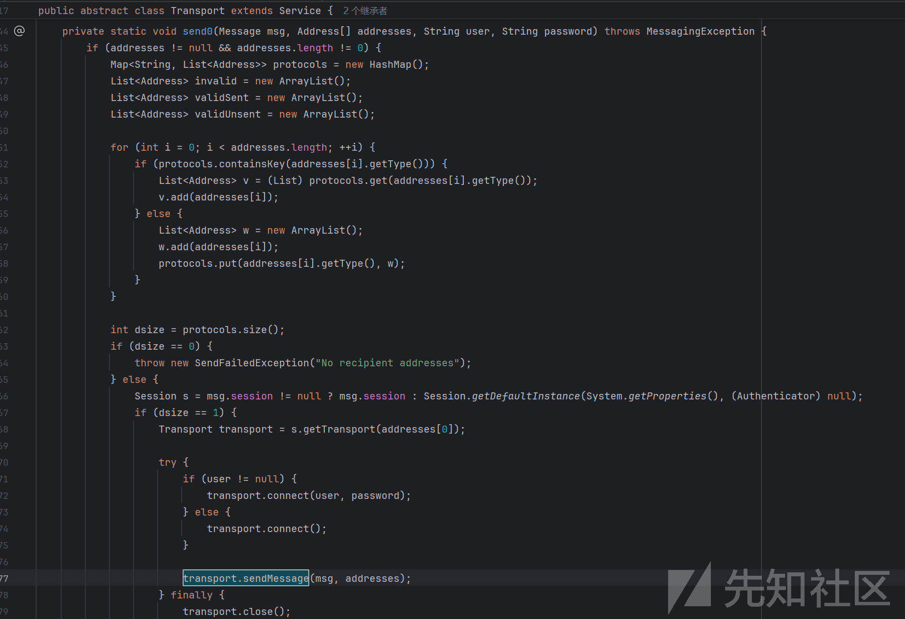

**分析**：它的主要功能是根据收件人的协议类型（如 SMTP、IMAP 等）将收件人地址分组，并通过相应的协议发送邮件，首先参数msg中存储着邮件内容（这里就包括了附件信息），发件人，收件人等信息，首先对收件人地址进行非空判断，然后就遍历所有收件人地址，根据地址的协议类型（通过 getType() 方法获取）将它们分组到 protocols 中。接着检测protocols的大小是否为0，接着就是获取邮箱会话然后调用sendMessage发送邮件

接着来到sendMessage方法中,因为这个方法太长了，只分析中重要的片段

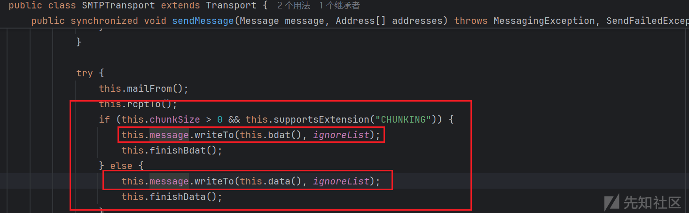

**分析**：this.message 是一个 MimeMessage，其中包含正文和附件。

调用 writeTo(...) 会将邮件内容序列化为标准 MIME 格式，包括正文、附件、嵌入图片等。

每个附件对应的 MimeBodyPart 会调用 writeTo(...)。

接着我们来到writeTo方法中

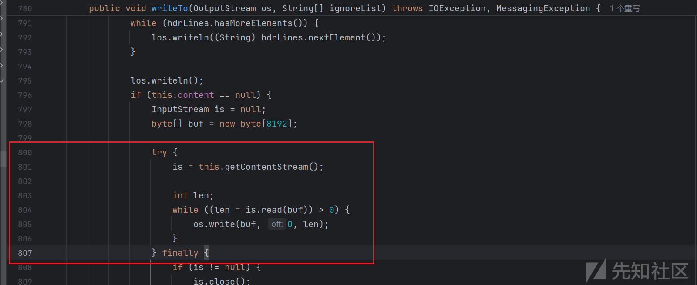

**分析**：这个方法其实就是将邮件内容（包括头部和正文）写入到指定的输出流中。在第800~807中处理邮件正文时，它通过 getContentStream 方法获取输入流，并使用缓冲区逐块读取内容，然后将其写入到输出流中。

最后来到getcontentStream方法中

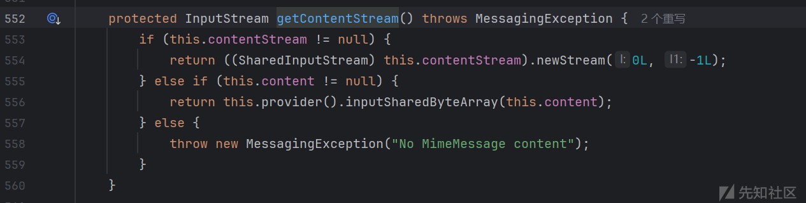

**分析**：contentStream 非空时：

* 返回一个 SharedInputStream 的新流，实际上是基于底层文件或内存流的分段流。
* 这里的 contentStream 很可能是封装了邮件附件数据的流，实际可能是文件流。

content 非空时：

* 返回一个基于字节数组的流（inputSharedByteArray），意味着内容在内存里。

两者都为空：

* 抛异常，表示没有邮件内容。

### 总结

这就是整个文件读取的过程，产生的原因就是因为sendMessageWithAttachment中的filePath是我们可以控制并且对读取的内容没有限制导致的，整个文件读取的流程如下

```
Transport.send0
Transport.sendMessage()
  └── message.writeTo(os)
       └── MimeBodyPart.writeTo()
            └── getContentStream()  ← 返回附件文件流
                 └── 底层调用 FileDataSource.getInputStream()
                      └── 真实打开文件，读取数据
```

## 漏洞复现

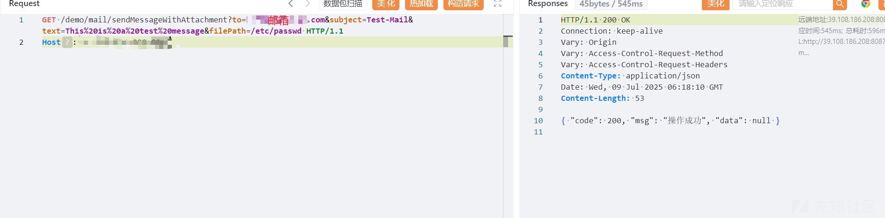

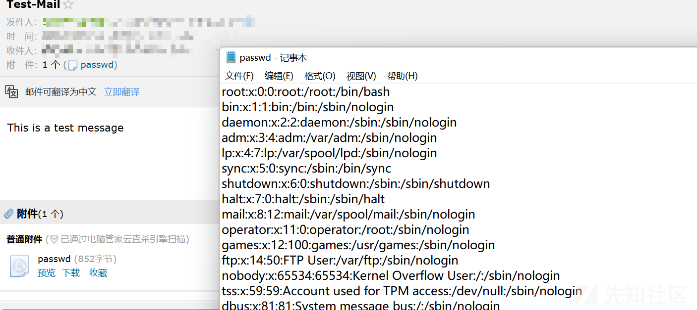

## 修复意见

更新到最新版或对filePath参数值进行限制

在最新版的sendMessageWithAttachment可以看到已经不允许用户控制filepath参数，这样就很好地避免了任意文件读取的发生

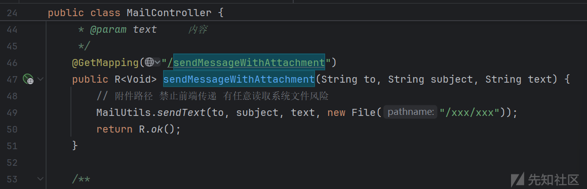
