# COFF文件解析 | CoffLdr-先知社区

> **来源**: https://xz.aliyun.com/news/18434  
> **文章ID**: 18434

---

<https://github.com/Cen4enCen/CenCoffLdr> 所有本文提到的代码都可以在这里找到，师傅们觉得好用的话点点Star :P

# Coff

COFF(Common Object Files)，COFF是在程序编译过程中生成的二进制文件。然后链接生成的目标文件以生成 `PE` 可执行文件（其中的.o .obj 文件就是我们的Coff文件）

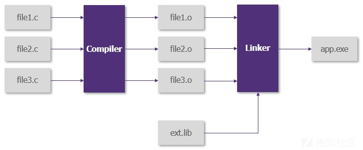

当然，他还有升级版，也就是我们常听到的BOF，可以用于Beacon后渗透的操作，输出结果回传到C2端

# Coff结构

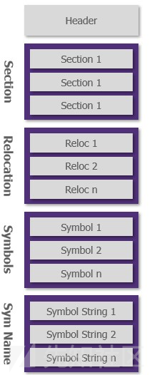

Coff的大致结构如下，和PE的有点相似所以后续的一些展开的过程也会有点相似

## CoffHead

```
struct CoffFileHeader {
    uint16_t machine;                  // 机器类型（如 x86、x64）
    uint16_t number_of_sections;       // 节区数量
    uint32_t time_date_stamp;          // 时间戳
    uint32_t pointer_to_symbol_table;  // 符号表偏移
    uint32_t number_of_symbols;        // 符号数量
    uint16_t size_of_optional_header;  // 可选头大小，0，忽略
    uint16_t characteristics;          // 文件特征
};
```

其中这个CoffHead里面是没有StringTable的偏移的，但是我们可以通过StringTable紧跟在符号表后面进行定位

## Section Header

```
struct CoffSectionHeader {
    char name[8];                     // 节区名称
    uint32_t virtual_size;            // 虚拟内存大小，0，忽略
    uint32_t virtual_address;         // 虚拟地址，0，忽略
    uint32_t size_of_raw_data;        // 节区数据的大小
    uint32_t pointer_to_raw_data;     // 节区数据的偏移
    uint32_t pointer_to_relocations;  // 该节区的重定位表的偏移
    uint32_t pointer_to_line_numbers; // 行号表偏移，忽略，已废弃
    uint16_t number_of_relocations;   // 重定位项数量
    uint16_t number_of_line_numbers;  // 行号项数量，忽略，已废弃
    uint32_t characteristics;         // 节区特征
};
```

其中virtualAddr是没有的，我们需要关注的就是就是他的pointer\_to\_raw\_data，size\_of\_raw\_data，pointer\_to\_relocations，number\_of\_relocations，characteristics

## SectionData

这里就是每一个节的内容了

## Reloc Table

```
struct CoffReloc {
    uint32_t virtual_address;      // 需要重定位的地址
    uint32_t symbol_table_index;   // 符号表索引
    uint16_t type;                 // 重定位类型
};
```

这个就和PE的重定位解析差不多

## Symbol Table

```
struct CoffSymbol {
    union {
        char name[8];              // 短名称（8字节以内）
        uint32_t value[2];         // 长名称偏移（value[0]=0时，value[1]是字符串表中的偏移）
    } first;
    uint32_t value;                // 符号值（节区内的偏移）
    uint16_t section_number;       // 节区号（0表示外部符号）
    uint16_t type;                 // 符号类型
    uint8_t storage_class;         // 存储类
    uint8_t number_of_aux_symbols; // 辅助符号数量
};
```

## String Table

# 对比CoffLdr在其他C2的实现

## 1.No slot for function

玩过CS的人都难免碰到过这样的问题

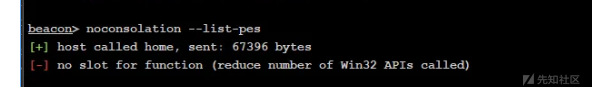

至于是为什么，我们去看CS 的源代码，从下图，我们发现如果dynamicFuntcion 是空的话，那么就会抛出这个提示，那么我们跟进去 FindOrAddDynamicFunction

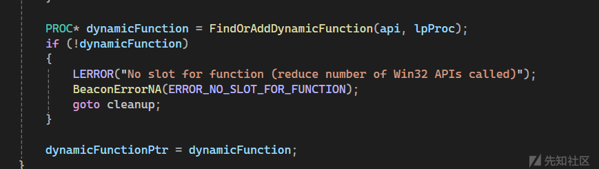

我们可以知道，如果新解析出来的函数在MAX\_DYNAMIC\_FUNCTIONS之内找不到一个空的Slot的话，那么他就会抛出上面的报错

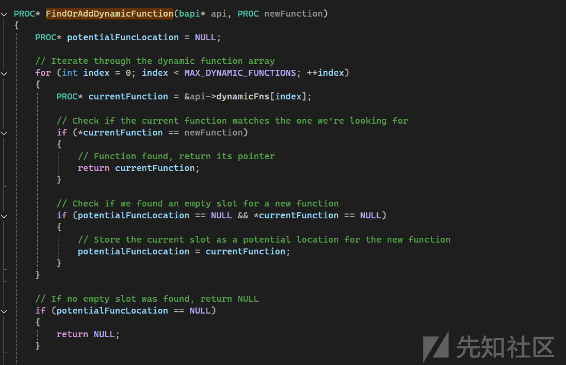

在CS 4.5下 MAX\_DYNAMIC\_FUNCTIONS 这个宏的数量是32（后续增多了）

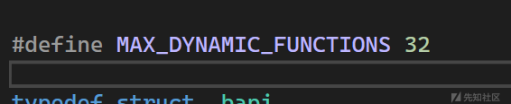

显然这种通过硬编码函数个数的是欠妥的，毕竟有的时候BOF会调用很多函数，如果仅凭有没有Slot判断的话，这样很明显对一些后渗透的BOF就是灾难

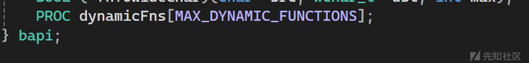

那么我们正确的做法是什么呢，应该是像Havoc一样通过遍历对应的symbolName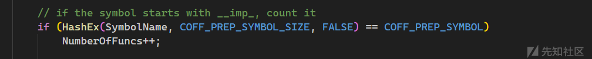

然后去动态分配GOT(Global Offset Table)的大小

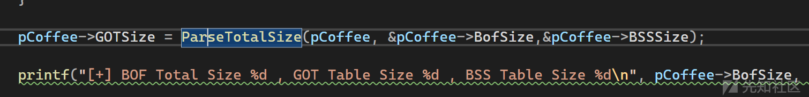

## 2.".BSS段未处理"

通过对PE的学习，我们可以知道有一个.bss段，用来存放未初始化的全局变量等，所以COff也不例外，接下来我们有一个简单的BOF代码来对比(注意，这里MSVC 和 MINGW的编译会产生不同)

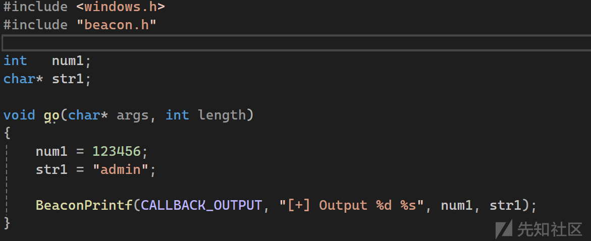

### CS 4.9.1

MSVC

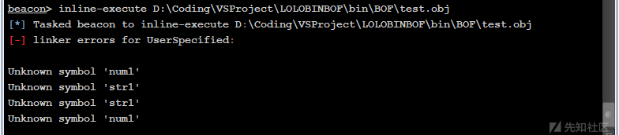

Mingw

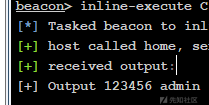

### Havoc

MingW

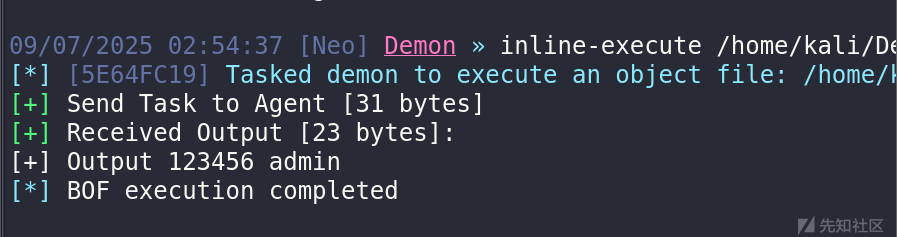

MSVC

Beacon崩溃

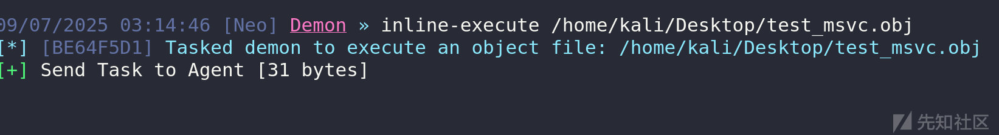

其实我们去翻他的源代码也能发现 他的那个TODO那里

```
 should we also fail if the symbol is not a function?
```

其实就是缺了一个BSS的处理，

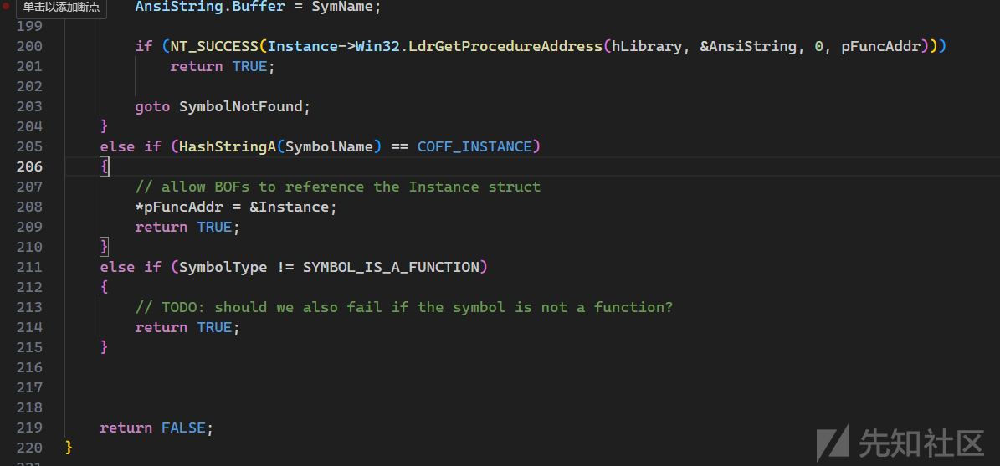

### BRC4

Brc4就要用新的API格式了，不过大体的代码不变

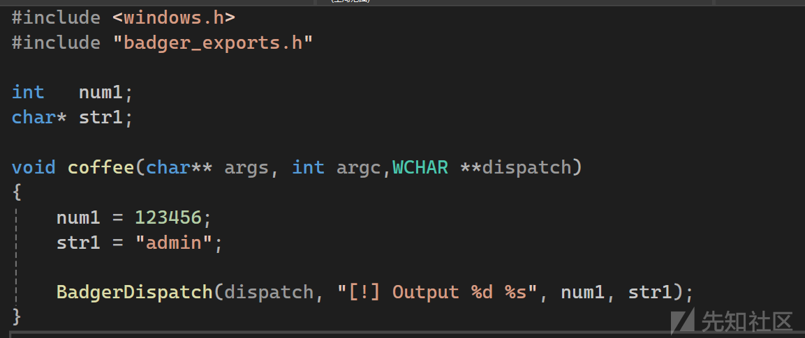

Mingw

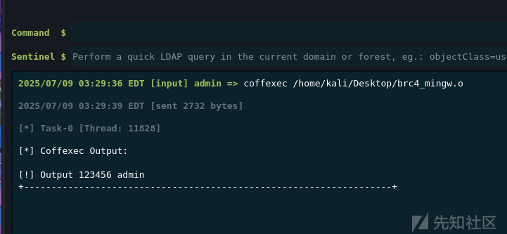

MSVC

没有输出，但是Badger也不会崩溃

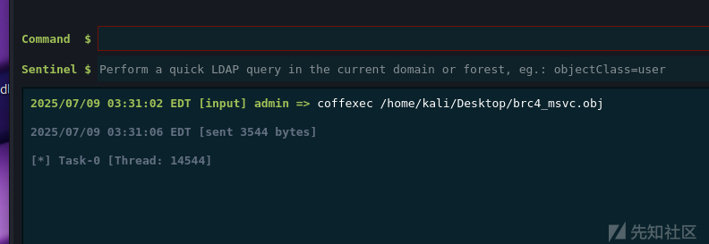

### AdaptixC2

这个前一段时间新出的C2就不测了，他的BOF解析逻辑缺失，以及BSS段也没有处理，朋友给我的反馈就是很多BOF都用不了

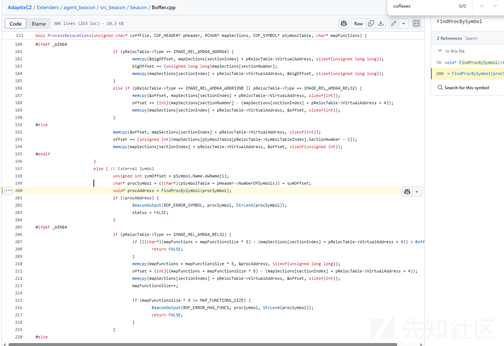

那么如果处理完成BSS段之后的效果因该如下，无论是MSVC 还是 Mingw编译都是正常输出

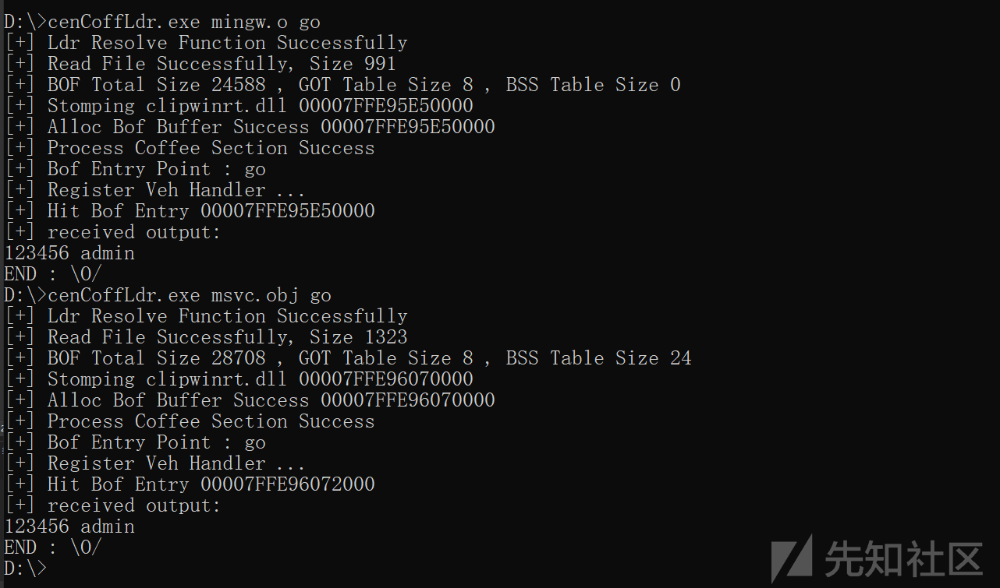

对比我们也不难发现我们在处理Mingw的BOF的时候是不用我们自己去独立分配BSS的空间的，毕竟在解析的时候就会有BSS段

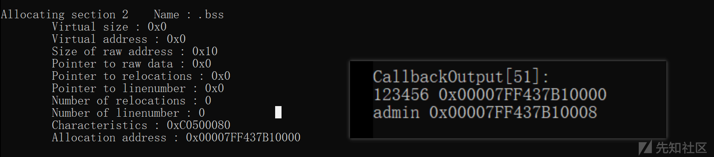

然而我们再用VS 2022 去编译BOF下的话，却是不存在.BSS段的

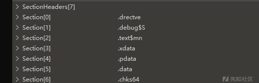

这个其实就是MSVC和GCC编译的不同, 在像 **MINGW**（基于 GCC 的编译器）这样的编译器中，编译过程中会显式创建 `.bss` 段来存储这些未初始化的全局变量，而**MSVC** 编译器在默认情况下并不会创建 `.bss` 段。相反，MSVC 会将未初始化的全局变量放入 **数据段（data segment）** 或 **堆（heap）** 中，并且在程序运行时通过程序初始化代码将其设置为零。 所以我们就要去手动去创建一个BSS Table来实现兼容

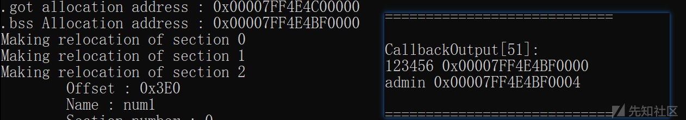

通过上面的解释，我相信你已经对"BSS段未处理"这个小标题有了理解，毕竟对于Mingw编译的我们根本就不需要去处理，但是MSVC编译我们就要去处理了，为了普遍性，我们需要在后续的Coff解析的时候也顺带处理

## 3.捕获异常

Why BOF，比起 Fork && Run无疑提高了他的Opsec，但是随之带来的也有一个缺点，那就是如果我的BOF崩溃了，那么我的Beacon也会崩溃（艰辛的拿下内网的访问权限就没了） Be like :


所以就可以通过VEH尽可能的捕获BOF的异常，下图来自菊师傅的CS 1.6

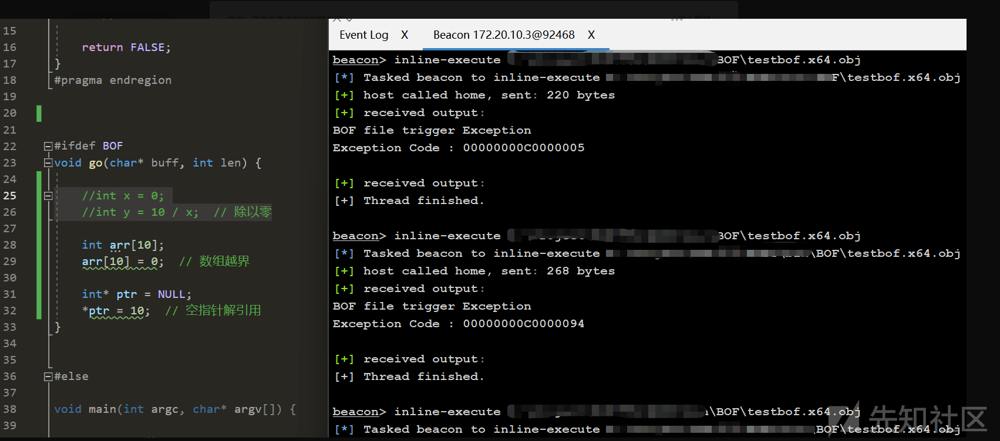

当然，C5也是在Havoc中对异常捕获进行了实现

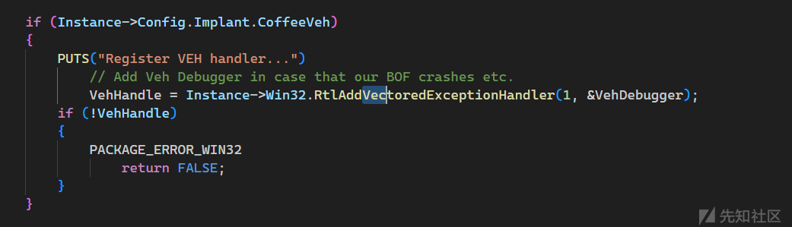

触发异常就让RIP指向 CoffeeFunctionReturn

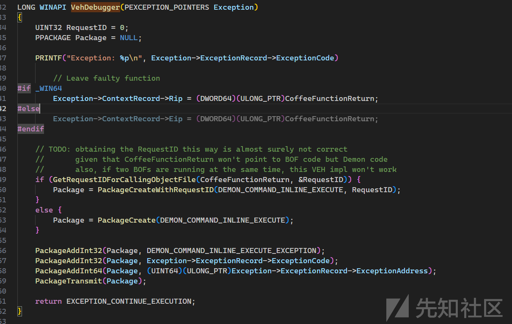

其中这个 CoffeeFunctionReturn 是执行COff的返回地址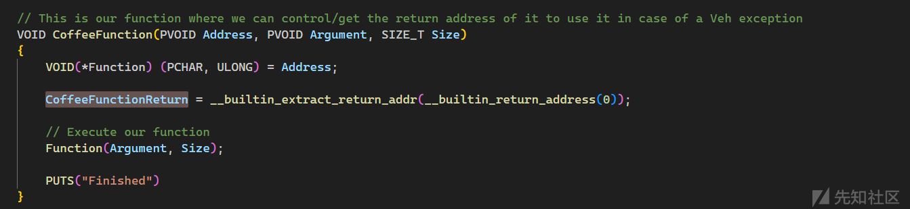

上面的实现都非常的不错，尽可能的捕获了BOF的异常，但是，凡是总有例外，我们来看这个BOF

```
https://github.com/outflanknl/C2-Tool-Collection/blob/main/BOF/Askcreds/SOURCE/Askcreds.c
```

当我们去运行的时候，我们就能捕获到一个异常

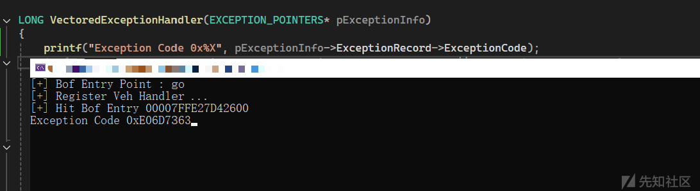

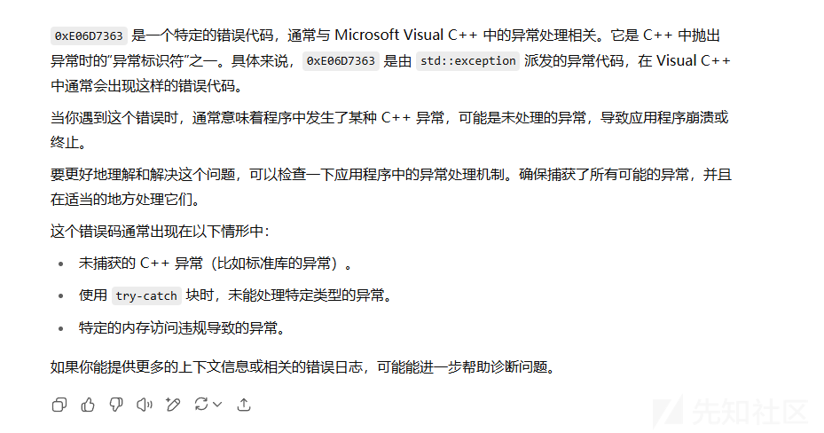

但是如果我们直接运行这个BOF，却是不会有任何的问题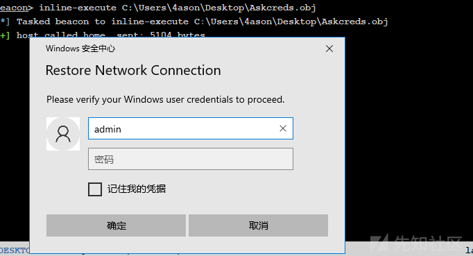

所以我的做法就是加多了一个这个判断，来兼容某些BOF所抛出的异常

```
else if (pExceptionInfo->ExceptionRecord->ExceptionCode == 0xE06D7363) // Some BOF Will Cause System Exception , we Need To Let it Go :P
{
	return EXCEPTION_CONTINUE_SEARCH;
}
```

## 4.OpSec

我们知道我们的BOF是得分配内存，或者踩踏内存的，那么就会产生对应的检测了，Havoc的规避性是很高的，部分体现如下

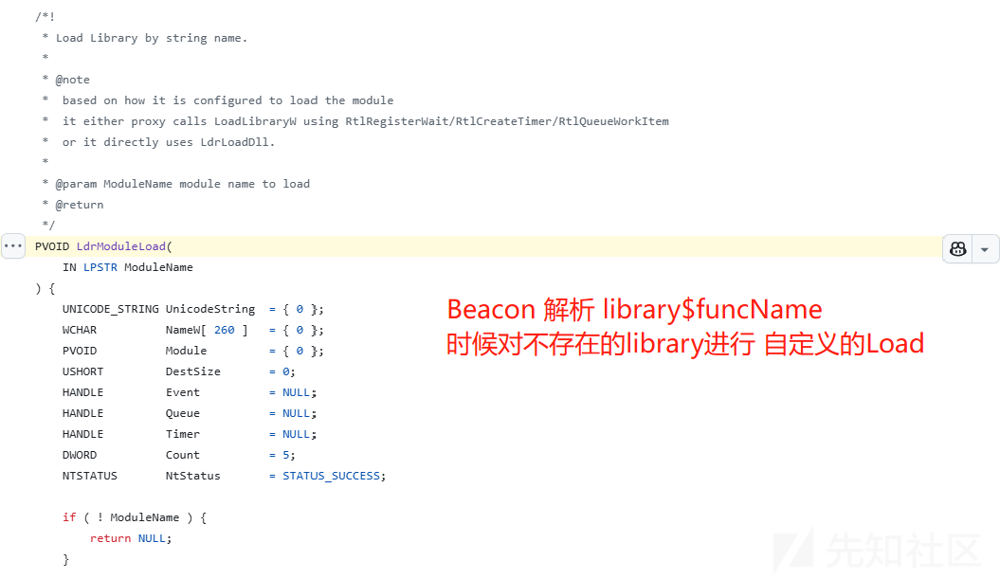

Native Api call

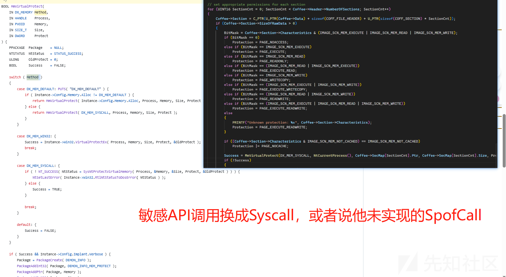

除了Havoc，BRC4也对BOF提供了模块踩踏，这样调用栈将会更加正常

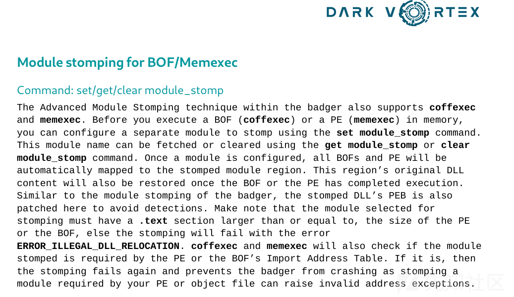

于是可以在COffLdr里面加一个模块踩踏

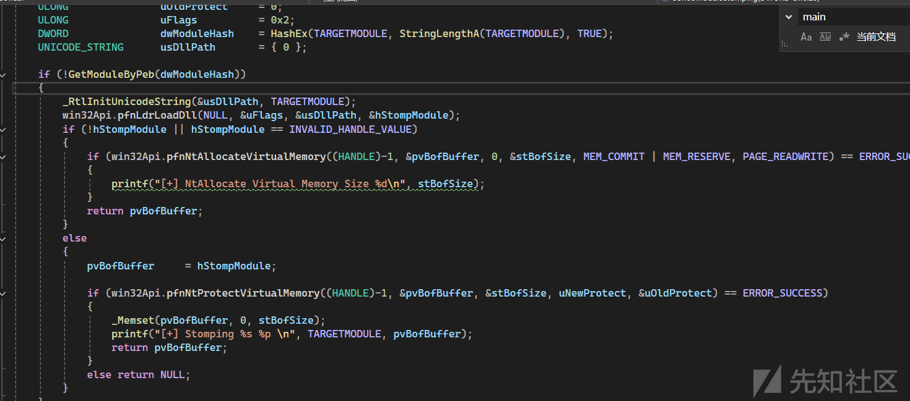

当然了，可以做的Opsec操作并不只有这些，剩下的留给读者探索

## 5.BeaconGate ?

CS在4.10的时候引入了BeaconGate

```
https://www.cobaltstrike.com/blog/cobalt-strike-410-through-the-beacongate
```

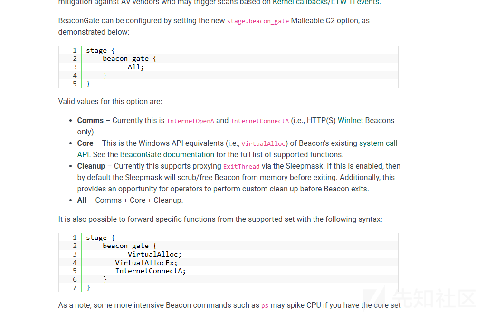

通过BeaconGate，我们可以对Beacon后续的一些API调用进行控制，更加Opsec，但是如果我们的C2并不是CS呢，更或者说CS4.10都还没泄露，很多人都是没法用这个功能，那么有没有办法实现类似BeaconGate的功能呢

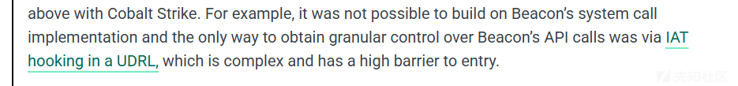

官方说了上面这一段话，其实就是IAT Hook，为什么我们能在UDRL里面对敏感API进行处理 ? 其实就是IAT Hook ，那么同理，我们也可以在Coff的展开过程让他走我们自己的 "Gate" ，同样也是能达到BeaconGate的效果，当然了这也不是必做的，毕竟在我们对于装载之后的beacon.dll他的一些API调用我们能控制有限，但是对于BOF里面的API调用我们还是可以控制的，我们完全可以直接控制BOF的API调用（这种"Gate"的实现更像是为了实现随便拿到一个BOF就有开箱即用的规避效果）

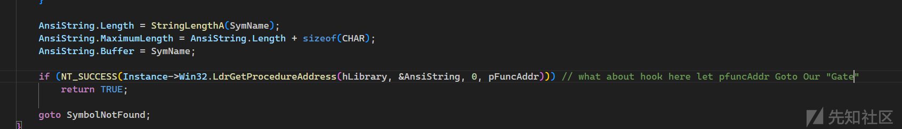

## 6.参数解析

Cobalt Strike Beacon有他自己的一套API，部分如下

* BeaconDataPrase
* BeaconDataExtract
* BeaconDataInt
* BeaconPrintf
* .....

对于格式解析，遵循如下规律

```
${totalLength}${stringArgumentLength}${stringArgument}${intArgument} .... 
```

Beacon会在运行时候接受参数，我们跟进去BeaconDataPrase，

```
VOID BeaconDataParse(PDATA parser, PCHAR buffer, INT size)
{
    if (parser == NULL)
        return;

    parser->original = buffer;
    parser->buffer = buffer;
    parser->length = size - 4;
    parser->size = size - 4;
    parser->buffer += 4;
}
```

其中他的 parser->buffer += 4; 是为了跳过他的Buffer总长度的这一字段，所以我们在BofPack里面就要进行处理，跳过他的前四个字段

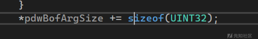

然后就是分别BeaconDataInt 和BeaconDataExtract ，由于这两个的对应保存不一样，所以我统一结构，如下

```
{TotalSize}{Arg1Size}{Arg1}{Arg2Size}{Arg2} .... 
```

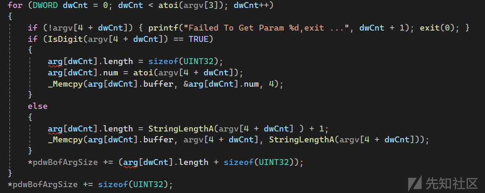

所以对应的解析函数也要发生改变(BeaconDataExtract不用动)

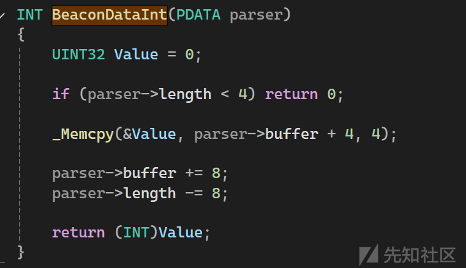

# Coff解析

## 1.TotalSize

```
TotalSize = BOFSectionSize + GOT Size + BSS Table Size
```

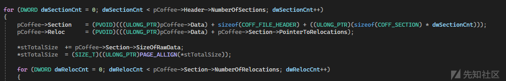

我们定义一个函数ParseTotalSize，在遍历每一个节的时候记录节的大小，对齐，并且在每一个节中找对应的重定向条目，然后再去找每一个符号，记录对应的BSSTable Size 和 GOT Table Szie

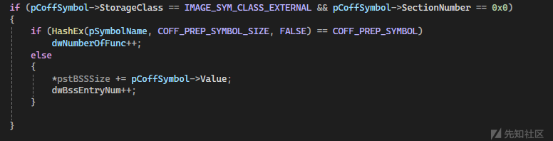

获取了TotalSize之后我们就可以分配一块完整区域而不是像其他CoffLdr一样分配多次，后续在清理阶段也会更加方便

## 2.Process BSS && GOT

这两个要处理起来会有一个共同的特性

```
pCoffSymbol->StorageClass == IMAGE_SYM_CLASS_EXTERNAL) && pCoffSymbol->SectionNumber == 0x0
```

所以我们首先先判断是不是Beacon的内部函数

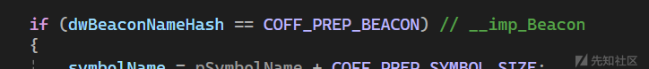

如果是Beacon的内部函数，我们就去遍历我们的函数数组然后返回对应的地址

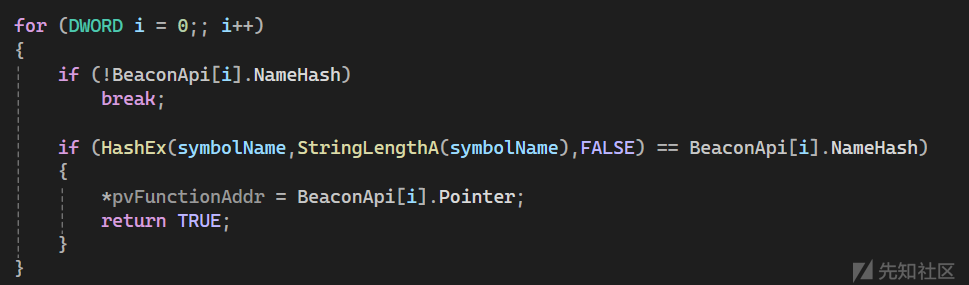

其中我们需要维护一个BeaconApi来实现我们后续Beacon的一些行为的函数

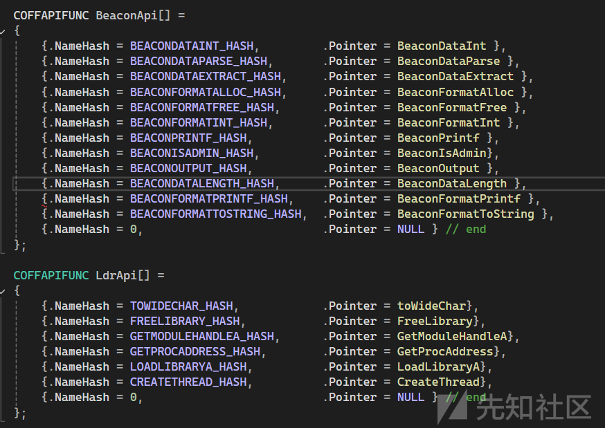

如果是 library$function 或者 function 的格式，那么我们就去GetModule/LoadDll ，然后返回函数地址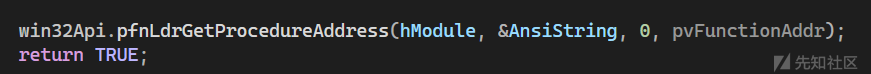

如果还不是，那么就剩下一个.bss的处理了，处理过程可以遵循如下流程

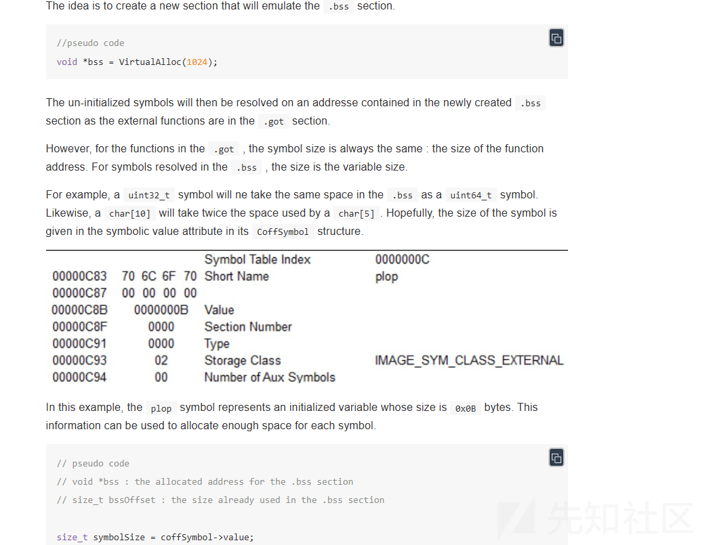其中为了实现部分解析的机制，我跳过了BSS Table的0x4,然后对应返回BSStable的OffSet

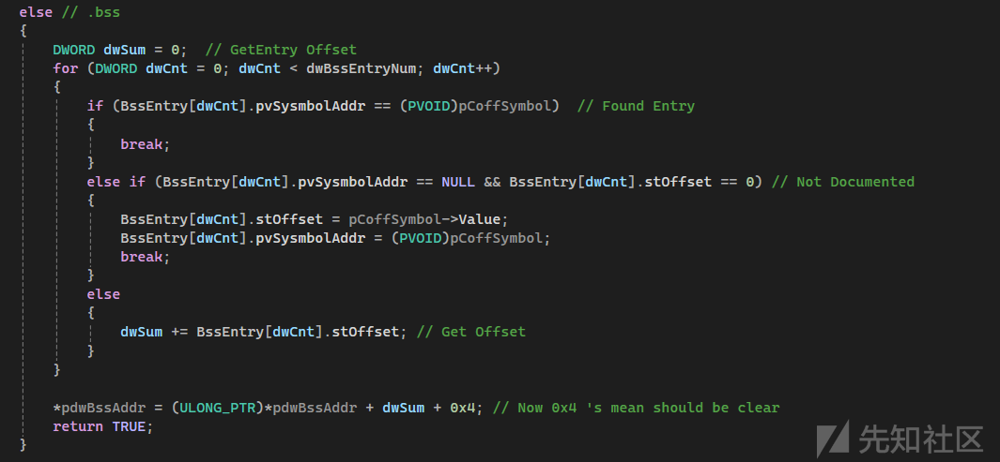

上面这种处理其实就是同理与把 pCoffSymbol->SectionNumber 改成对应的 BSSTable Section 和GOTSection

## 3.Process Reloacation

这里可以分四种大情况

1. IMAGE\_REL\_AMD64\_REL32 && functionPtr != NULL
2. IMAGE\_REL\_AMD64\_REL32 -> IMAGE\_REL\_AMD64\_REL32\_5
3. IMAGE\_REL\_AMD64\_ADDR32NB
4. IMAGE\_REL\_AMD64\_ADDR64

然后就是对应去做解析即可

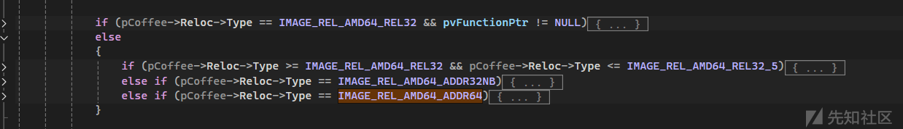

## 4.Get EntryPoint

遍历所有符号，获取EntryPoint所在的地址，这里允许我们的入口点不再是 go，而是可以自定义

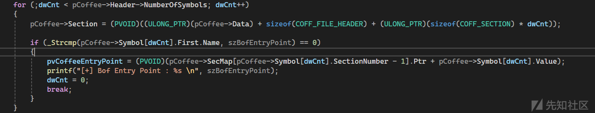

## 5.RunCoffee

注册VEH，尽可能的捕获BOF的运行时崩溃

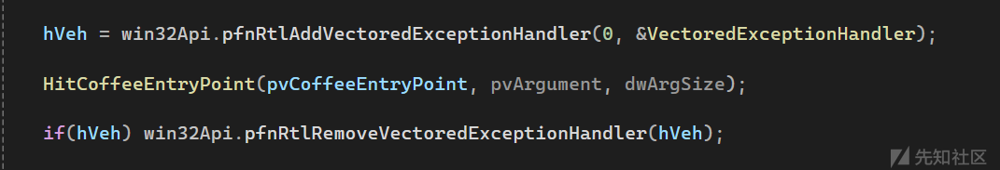

然后就是常见的欺骗挂起线程创建，恢复线程的执行

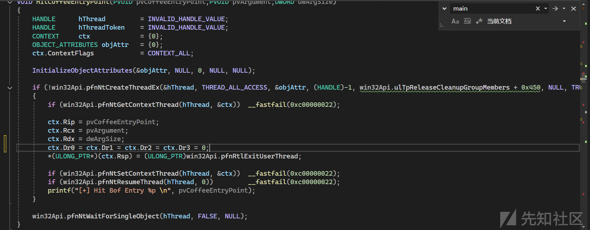

最终部分BOF的效果如下

Askcreds.obj

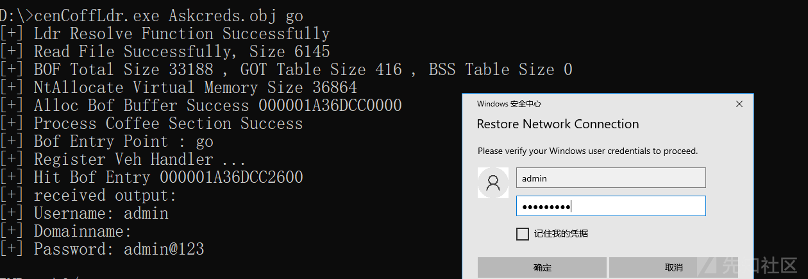

whoami.o

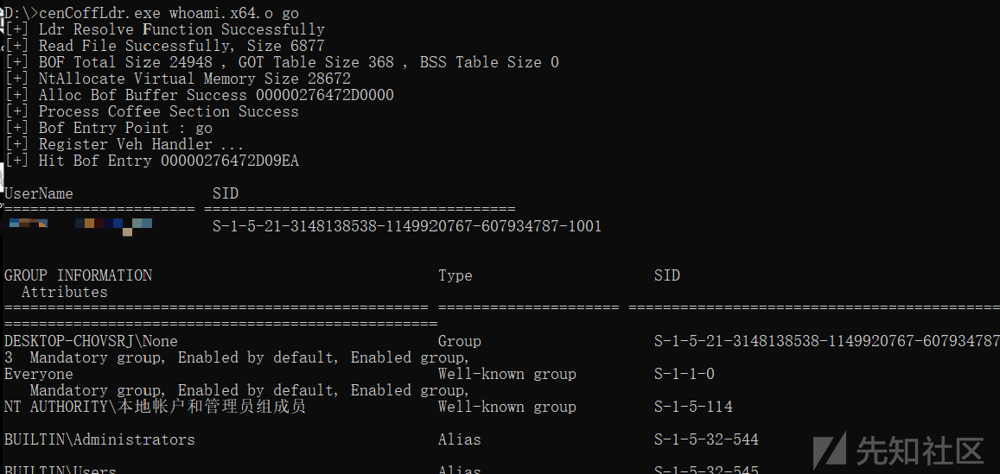

CheckAV.o

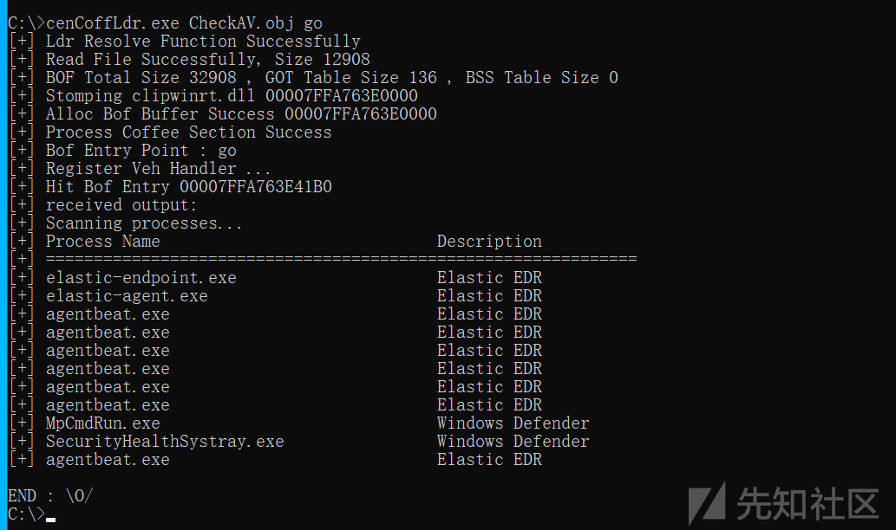

# 参考文章

<https://github.com/HavocFramework/Havoc/blob/main/payloads/Demon/src/core/CoffeeLdr.c>

<https://otterhacker.github.io/Malware/CoffLoader.html>
