# 从一次waf绕过来学习.Net javascriptserializer反序列化漏洞-先知社区

> **来源**: https://xz.aliyun.com/news/18435  
> **文章ID**: 18435

---

### 前言

笔者在某次攻防活动中遇到了CVE-2019-18935,但是由于采用某国际厂waf，有针对该漏洞编写的规则拦截，最终通过从代码测分析该漏洞从而编写exp来绕过waf成功rce，整个过程收获颇多，记录一下。

#### 一、漏洞发现：

通过源码确定使用了该组件

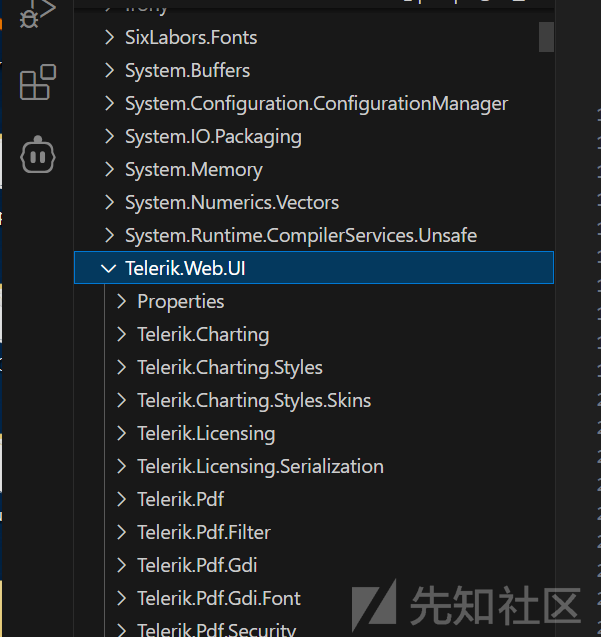

并且确认版本在漏洞版本内：

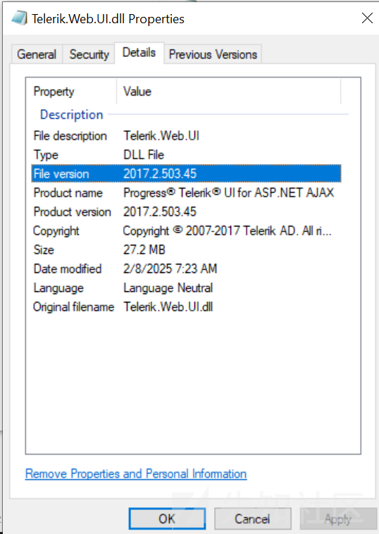

#### 二、尝试利用（waf拦截）

尝试访问漏洞路由

构造exp（waf拦截）

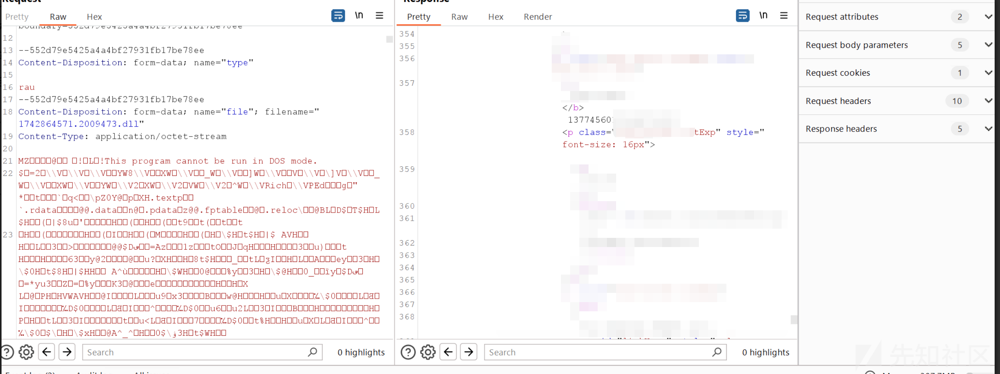

尝试了脏数据 并发 畸形数据包等等方式均无效，这样只能从源码测进行waf绕过

#### 三、解析漏洞原理&.NET javascriptserializer反序列化漏洞：

这个组件漏洞，是使用JavaScriptSerializer序列化器，在网上net反序列化文章中多数提到，该库要利用反序列化漏洞必须满足一个条件，实例化 SimpleTypeResolver，但他并没有实例化 SimpleTypeResolver，还是能够rce，接下来一起分析一下：

首先我们看一下常规的JavaScripSerializer反序列化漏洞

使用ysoserial.net生成payload

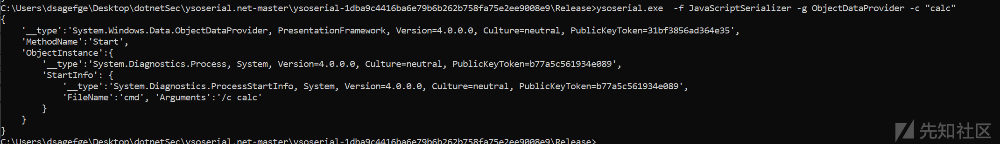

实例化了SimpleTypeResolver

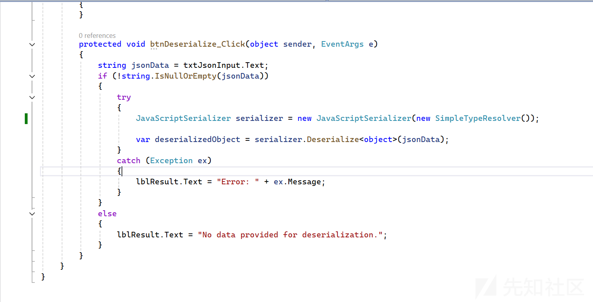

目前yso默认打JavaScirptSerilize的只有ObjectDataProvider链，但是还有其他链能打，我们后面在说。

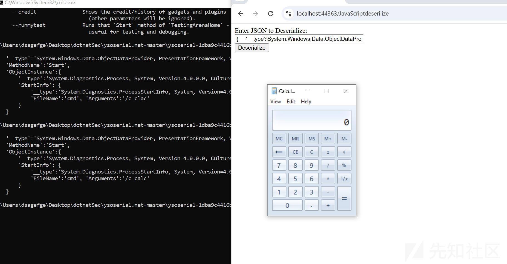

没有实例化SimpleTypeResolver

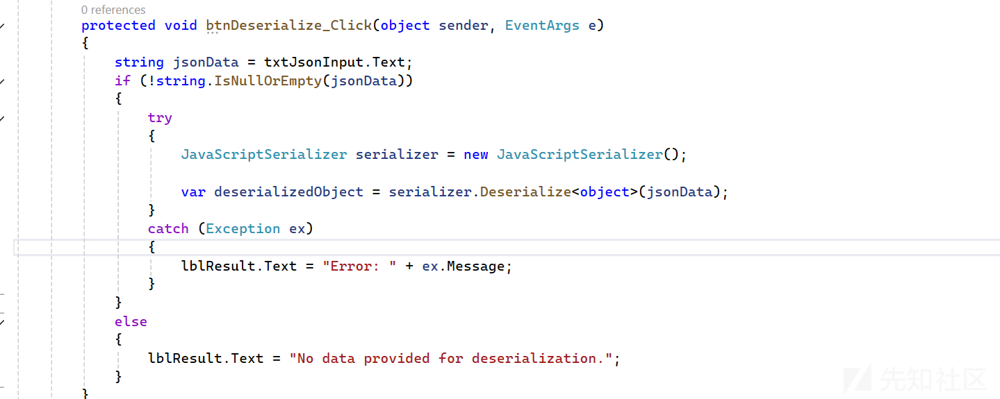

报错

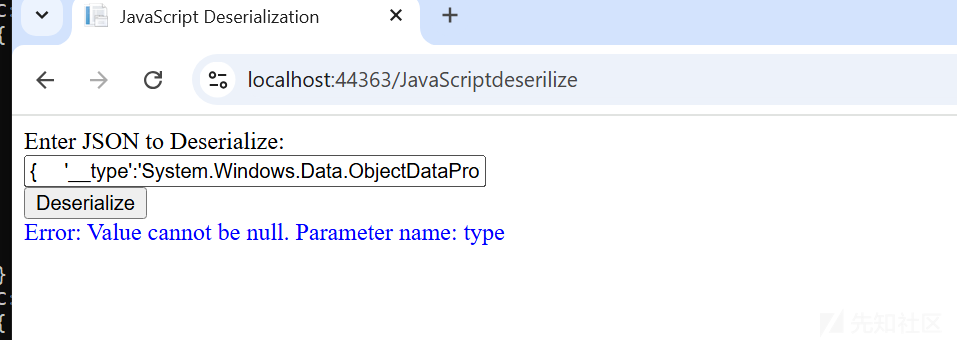

原因简单点来说就是没有实例化SimpleTypeResolver 就不会使用类型解析器，也就是不会解析我们json中的\_type的值，从而导致漏洞利用失败

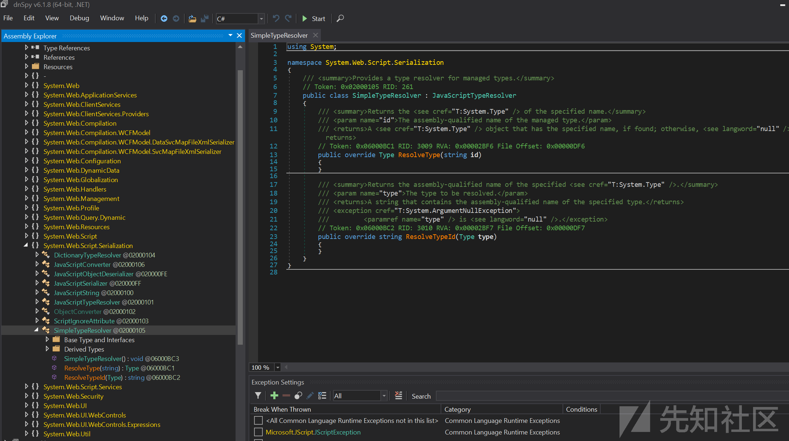

而一般开发者并不会实例化 SimpleTypeResolver，这个组件漏洞也是，但是为什么会存在漏洞呢？我们进入代码看看

接受请求，首先调用EnsureSetup函数，然后判断是否是分块上传进行后续上传操作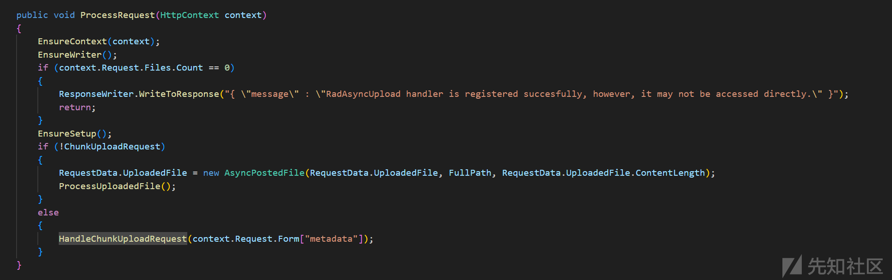

EnsureSetup函数 ：判断一些属性然后赋值，其中将通过Context.Request() 函数获取rauPostData的值传入给GetConfiguration

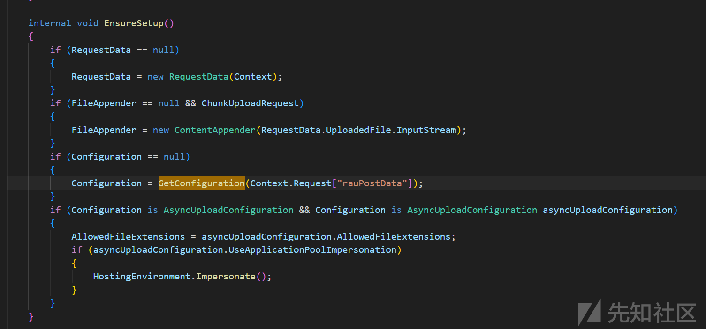

该函数就是漏洞的核心点：将传入的值以&进行分割，前一部分作为obj，后部分经过解密后作为Type一起传入Dserialize函数继续反序列化

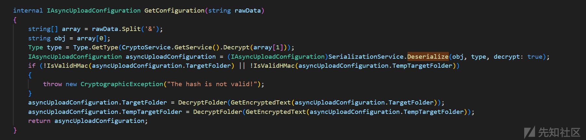

跟踪来看该Dserialize函数反序列化方法实现就是通过反射调用的JavaScriptSerializer库进行反序列化，但是并未实例化SimpleTypeResolver，漏洞是如何触发的呢？还记得我们刚开始说的关键点 \_type参数的内容是否会被解析，而该函数我们可以直接通过数据包传入type

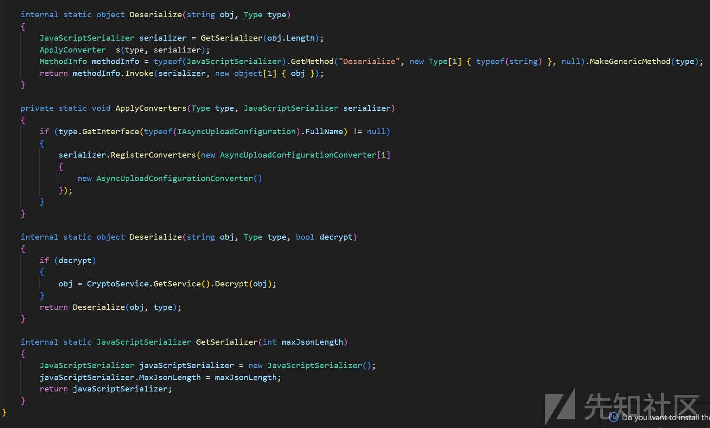

因此产生了反序列化漏洞

#### 四、反序列化攻击利用链条

由上一节可知漏洞原理是没有实例化SimpleTypeResolver，而是从外部传入的type 所以不能使用ObjectDataProvider链和 System.Windows.Forms.BindingSource链。

github公开的exp是使用 System.Configuration.Install.AssemblyInstaller 链条

该链主要核心是设置path属性时会加载指定路径的程序集dll（正好该漏洞是上传文件功能，可以上传恶意dll到目标服务器）

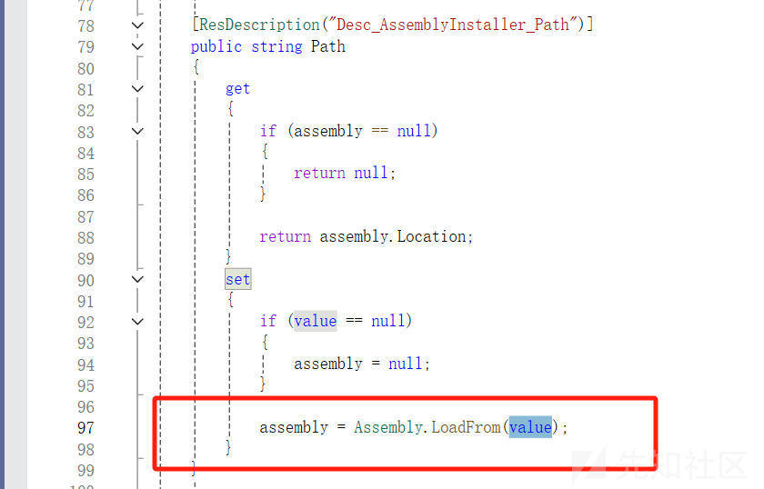

payload

```
{
    "__type": "System.Configuration.Install.AssemblyInstaller,System.Configuration.Install, Version=4.0.0.0, Culture=neutral,PublicKeyToken=b03f5f7f11d50a3a",
    "Path": "file:///E:\sec\NET\calcdll\calcdll\bin\calcdll.dll"
}
```

注意：这个如果直接是net的dll，加载后不能触发静态构造函数，所以是不能进行rce的，需要结合HelpText属性中的getter方法触发构造函数从而rce(在实例化了 SimpleTypeResolver类可以用，这里是直接传入type使用不了)

解决办法是在Assembly.LoadFrom加载的时候会执行DllMain() 从而让它加载 mixed assemblies（混合程序集）来实现rce

github中的payload也是这样写的：<https://github.com/noperator/CVE-2019-18935>

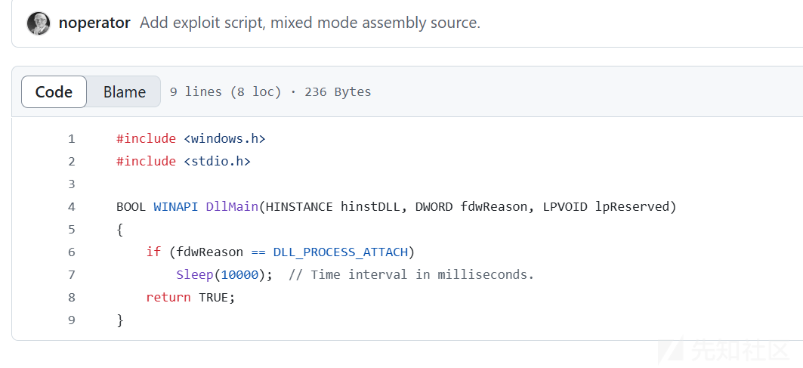

编译混合程序集

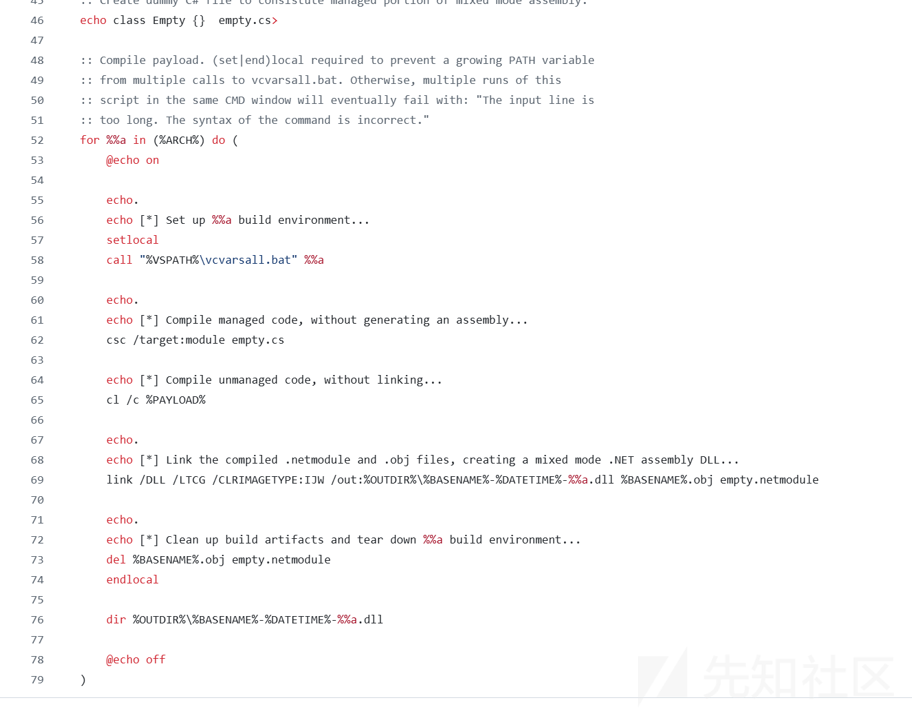

混合程序集简单来说就是可以将.NET 程序集注入 Windows 进程中来执行详细技术细节参考：<https://thewover.github.io/Introducing-Donut/>

然后就可以通过加载该dll执行命令了

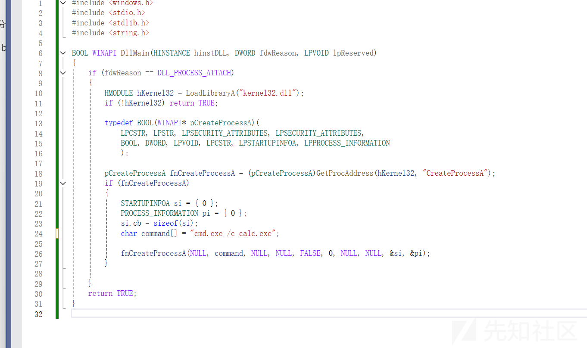

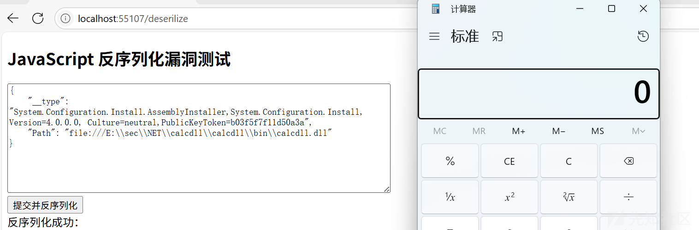

#### 五、waf绕过

通过fuzz 发现该waf是针对该漏洞写的特殊规则

1. rauPostDate值是加密后的序列化内容，此处检测from表单rauPostDate参数内容中&后有jyggli开头的字符即拦截 原理就是上一节所说&后是Type的值也就是漏洞利用链输入的地方 而利用链System加密后正好是jyggli256.... 所以waf的规则也是按照该漏洞定制化的。

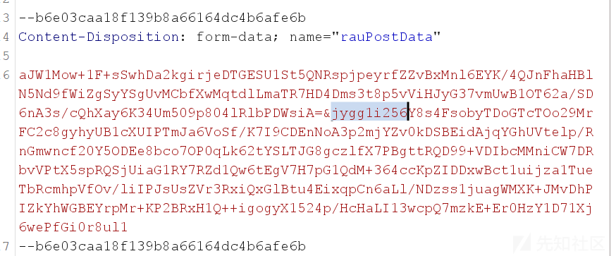

2. 拦截漏洞利用路由 Telerik.Web.UI.WebResource.axd?type=rau

传入时调用的是Context.Request() 方法，该方法是从所有请求中获取内容，我们就可以将rauPostDate参数从cookie中传入规避一下waf。


加密处只需要在system前加一个空格即可,加密后的内容即完全改变 不影响服务端解析

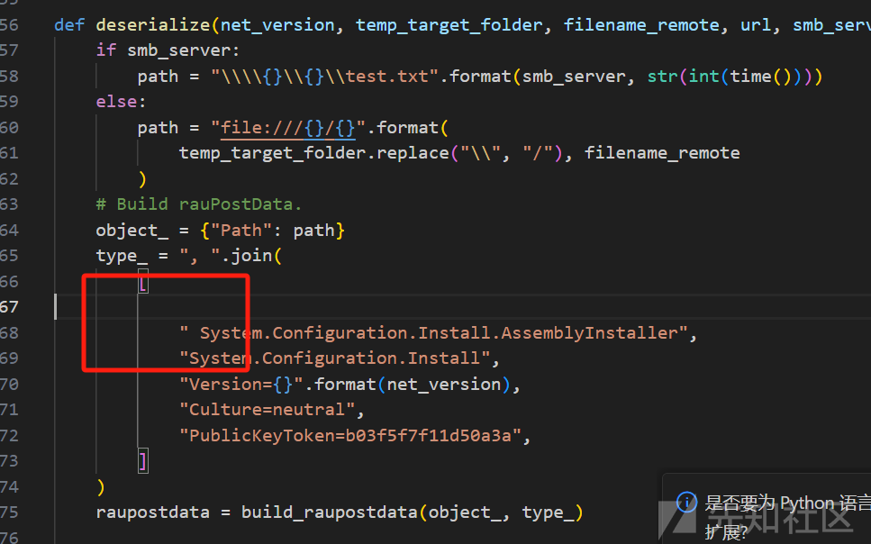

数据包如下

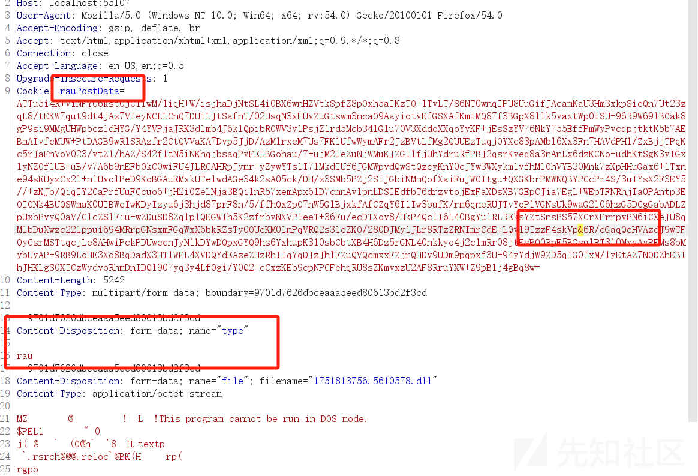

3.拦截metadata 未加密的json值 此处检测metadata的值里有符号即拦截

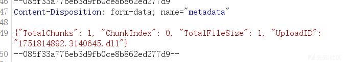

这个到后端本质还是需要反序列化为对象，为必要操作，那么我们就可以将他加密以raupostdata参数进行发送后端就会加密反序列化接口先解密然后再进行反序列化

本地部署使用dnSpy动态调试出属性信息

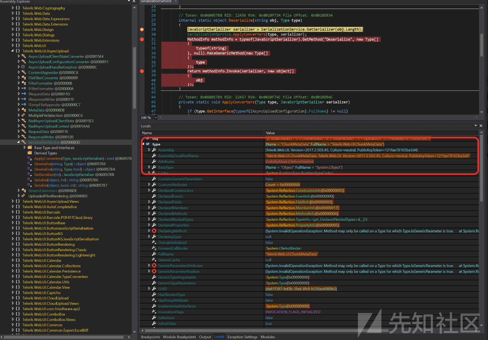

以加密接口进行发送反序列化绕过waf

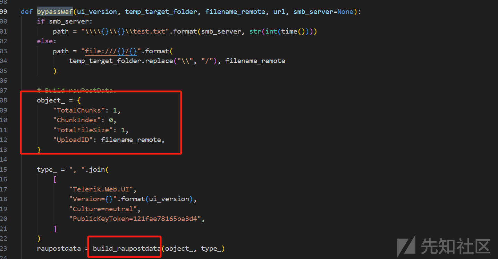

4.拦截上传dll时dll中的特征内容。

这个就比较好处理了，直接用winhex替换头部特征即可，至此成功绕过某国际waf，原来的脚本exp发两个包，我们发三个包，基本都是加密后的数据，waf很难识别。

#### 六、内存马注入

这块主要还是参考dust-life师傅的exp，是使用HostingCLR技术注入的，项目里也描述的很完善，我就不过多赘述了。

<https://github.com/dust-life/CVE-2019-18935-memShell>

### 参考

<https://github.com/noperator/CVE-2019-18935>

<https://thewover.github.io/Introducing-Donut/>

<https://github.com/dust-life/CVE-2019-18935-memShell>
