# 大模型编排框架攻防(以LangChain为例)-先知社区

> **来源**: https://xz.aliyun.com/news/18440  
> **文章ID**: 18440

---

# 大模型编排框架背景

近年来，大语言模型（LLM）在自然语言理解、文本生成和推理等领域取得了显著的进展，其应用范围日益广泛，涵盖了客户服务、内容创作、软件开发等多个行业。为了更有效地利用LLM的能力，构建复杂的AI应用，开发人员开始采用LLM编排框架。

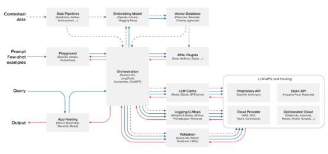

LLM编排指的是对多个LLM及相关组件进行无缝协调，以提升性能、控制输出并简化API交互的过程它在管理LLM驱动应用的复杂性方面至关重要，包括提示工程、数据检索和状态管理编排框架的主要任务包括动态提示工程、工作流管理、数据管理与预处理、管理LLM资源与性能以及可观测性和监控。

LLM编排框架作为复杂AI应用的核心，管理着信息和控制在各种组件之间的流动，其安全性至关重要。一旦编排框架被攻破，攻击者可能会控制所有连接的LLM、数据源和工具，造成广泛的损害。编排器管理提示和数据流的能力意味着这里的漏洞可能产生深远的影响。

我们在本文中主要以LangChain为例，总结分析其面临的典型漏洞（包括CVE以及框架特有的安全风险），并尝试将其与OWASP指南进行映射，随后给出一些我们自己总结的缓解措施。

​

# LangChain

LangChain是一个流行的开源框架，专为简化使用Python构建LLM应用程序的过程而设计。其主要优势在于模块化的工作流程，可重用组件，用于有效提示工程和内存处理的工具，以及与其他各种工具和服务的易于集成性。

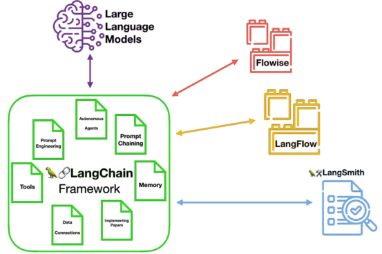

LangChain的架构强调其可组合性以及对构建上下文感知和推理应用程序的支持 。LangChain的灵活性和广泛的生态系统在为开发人员提供强大功能的同时，也增加了攻击面。众多的集成和组件如果未得到适当的保护，可能会引入潜在的漏洞。

LangChain的优势在于其连接各种外部资源的能力，每个连接都代表着攻击者的潜在入口点。此外，框架的内部组件本身也可能包含漏洞。

## 架构

LangChain框架采用模块化设计，由几个相互关联的软件包组成：langchain-core、langchain、集成软件包、langchain-community、langgraph、langserve和LangSmith 。langchain-core为聊天模型、向量存储和工具等核心组件提供了基本抽象 。

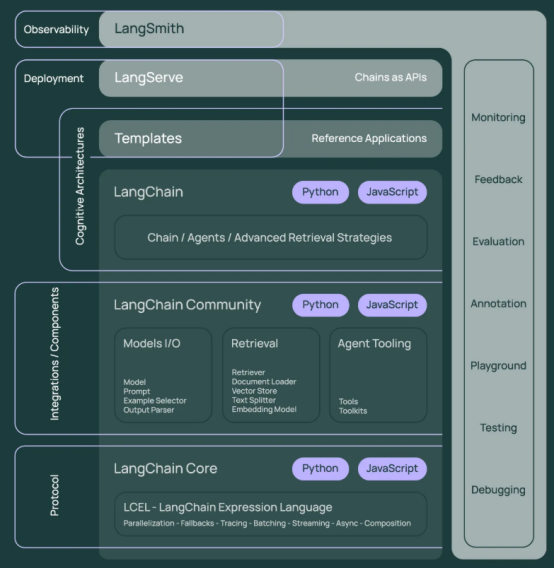

LangChain提供了一套完整的核心组件，包括通用的链（Chains）、代理（Agents）和检索策略（Retrieval Strategies）。这些组件构成了LLM应用开发的基础架构，使开发者能够构建复杂且功能丰富的语言模型应用。

集成软件包（如langchain-openai）专为特定第三方服务定制开发。这些包提供了与特定LLM提供商的深度集成接口，确保开发者能够充分利用这些服务的独特功能和高级特性。

langchain-community汇集了由社区维护的丰富第三方集成。这一生态系统使LangChain能够与众多外部服务和工具无缝连接，极大地扩展了其应用场景和功能多样性。

langgraph作为LangChain的扩展，引入了基于图的方法来构建具有状态管理能力的多参与者应用程序。这使开发者能够设计更为复杂、动态的LLM应用，支持多智能体之间的协作与交互。

langserve提供了将LangChain链高效部署为REST API的能力。这一工具简化了LangChain应用的生产环境部署流程，使开发者能够轻松地将其LLM应用作为服务提供给其他系统或最终用户。

LangSmith是一个专为LLM应用设计的开发者平台，提供全面的可观测性、调试、测试和监控功能。它使开发者能够深入了解应用的性能指标和行为特征，从而持续优化和改进应用质量。

LangChain表达式语言（LCEL）提供了一种声明式且高度可组合的方式，通过管道操作符将各个LangChain组件组合成复杂的处理流程。这种方法显著提高了代码的可读性和可维护性，同时简化了复杂应用的开发过程。

攻击者可能会尝试利用特定集成软件包中的漏洞来获取对核心LangChain功能的未授权访问，反之亦然。这种跨组件攻击可能导致权限提升、数据泄露或系统完整性受损等严重安全问题。

## 关键组件

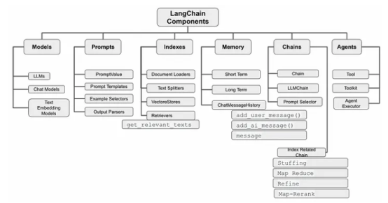

LangChain的关键组件包括：模型，用于与各种LLM（传统模型）和聊天模型（现代模型）交互的抽象，为不同提供商提供一致的接口；提示，用于创建语言模型的动态和上下文相关的输入模板，从而更好地控制模型行为 ；链，对LLM和其他组件的调用序列，用于为特定任务（如问答或聊天机器人）创建复杂的工作流程 ；代理，使用LLM作为推理引擎来决定实现目标的动作序列（使用工具）的自主实体；工具，代理可以调用以与外部世界交互的函数，例如访问API、数据库或文件系统；记忆，用于跨多个交互存储和管理对话历史记录和其他相关信息的组件；检索，用于根据查询从数据源获取相关文档或信息的组件和策略。

每个组件都有其潜在的安全隐患，我们这里分开介绍。

### 代理（Agents）的安全风险

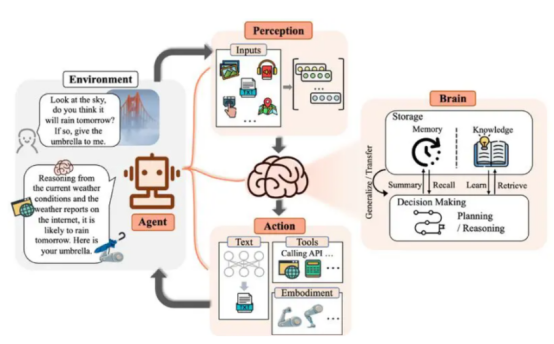

代理是LangChain中的核心组件，它们能够根据用户输入做出决策并调用工具。然而，代理存在多种安全隐患。

如果代理配置不当，可能获得过高的系统权限，导致未经授权的操作执行。当代理被允许访问外部API、数据库或文件系统时，可能成为攻击者的入口点。

代理的决策逻辑如果存在缺陷，攻击者可能通过精心构造的输入来操纵代理执行恶意操作。某些代理可能具有执行代码的能力，如果没有适当的沙箱和验证机制，可能导致远程代码执行攻击。

### 工具（Tools）的安全隐患

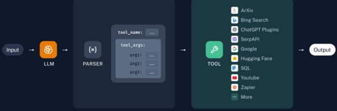

工具是代理用来执行特定任务的功能模块，它们直接与系统资源交互。

工具可能未对输入进行充分验证，导致注入攻击或其他形式的输入操纵。工具可能拥有超出其需要的系统权限，一旦被攻击者控制，可能导致权限提升。

恶意用户可能构造特定输入，导致工具消耗过多系统资源，实现拒绝服务攻击。工具在处理或返回数据时，可能无意中泄露系统敏感信息。

​

### 提示模板（Prompt Templates）的安全风险

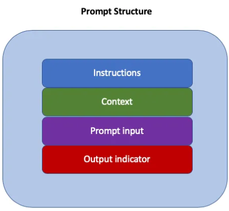

提示模板用于构建发送给语言模型的输入，它们也面临安全挑战。

攻击者可能在用户输入中嵌入指令，覆盖或修改原始提示的意图，操纵模型行为。精心构造的提示可能诱导模型忽略安全限制，执行原本不允许的操作。

如果模板参数未经适当验证，攻击者可能注入恶意内容，改变提示的结构和功能。在多轮对话中，攻击者可能通过早期输入污染上下文，影响后续交互的安全性。

​

### 记忆（Memory）组件的安全隐患

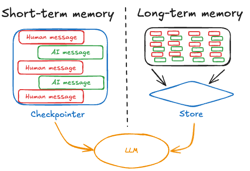

记忆组件存储对话历史和上下文信息，可能成为攻击目标。

如果对话历史未经加密存储，可能导致敏感信息泄露。攻击者可能尝试向记忆组件注入恶意内容，影响后续交互。

记忆组件可能无意中向未授权用户泄露之前对话中的敏感信息。攻击者可能尝试通过大量输入使记忆组件溢出，导致异常行为或信息泄露。

​

### 检索器（Retrievers）的安全风险image.png

检索器负责从知识库获取相关信息，存在以下安全问题。

如果知识库可被外部修改，攻击者可能注入恶意内容，影响检索结果。检索算法中的缺陷可能被利用，导致不相关或有害内容被检索。

检索器可能访问到用户无权查看的敏感数据，导致信息泄露。针对向量数据库的特定攻击可能导致检索结果被操纵或系统资源耗尽。

​

### 组件间交互的安全隐患

LangChain组件之间的交互也是重要的安全考量点。

组件间传递的数据如果未经验证，可能导致整个应用链被破坏。高权限组件可能不当地将权限传递给低权限组件，导致权限提升。

组件间接口不一致可能导致数据处理错误，产生安全漏洞。不同信任级别的组件之间如果没有明确的边界控制，可能导致安全隔离失效。

​

### 大语言模型（LLMs）相关的安全风险

作为LangChain的核心，大语言模型本身也存在安全隐患。

攻击者可能通过精心设计的提示使模型绕过安全限制，执行不当行为。模型可能生成虚假但看似可信的信息，导致用户做出错误决策。

模型可能生成带有偏见或有害的内容，造成伦理和法律问题。如果应用程序不当处理模型API密钥，可能导致未授权使用和费用损失。

​

# 典型漏洞

我们在这里分类对典型漏洞进行了总结。

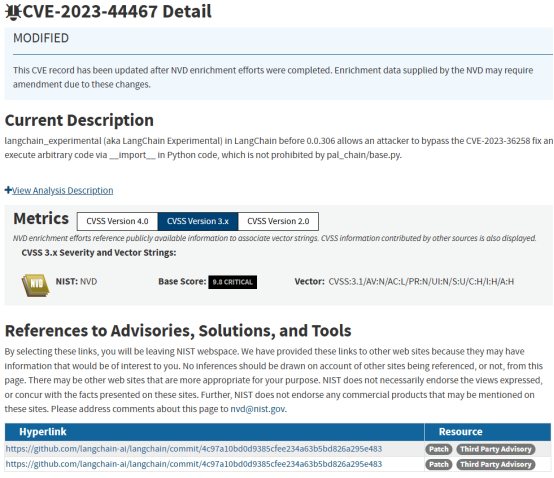

## 任意代码执行

### CVE-2023-29374

由于不安全地使用Python exec，LLMMathChain（版本<= 0.0.131）中存在提示注入漏洞，允许通过精心设计的提示执行任意代码。这表明了直接执行LLM生成的代码而不进行严格沙箱化和输入验证的关键风险。

### CVE-2023-44467

langchain\_experimental（版本< 0.0.306）中存在提示注入漏洞，允许绕过CVE-2023-36258的修复，并通过Python代码中的\_\_import\_\_执行任意代码 。这说明攻击者在寻找利用漏洞的新方法方面具有持久性，即使在部署初始修复程序之后也是如此。受影响的组件位于实验性软件包中，表明实验性功能可能具有更高的安全风险。

### CVE-2024-46946

langchain\_experimental（版本0.1.17到0.3.0）中通过LLMSymbolicMathChain中的sympy.sympify存在任意代码执行漏洞 。即使LangChain使用的外部库也可能引入安全漏洞，这也表明彻底的依赖性分析和定期更新的必要性。

## 服务器端请求伪造 (SSRF):

### CVE-2023-46229

SitemapLoader（版本< 0.0.317）中存在SSRF漏洞，允许攻击者向任意域发出HTTP请求，从而可能访问敏感的内部数据 。这表明使用与外部URL交互的功能而不进行适当验证和域限制的风险。

### CVE-2024-2057

langchain\_community（版本0.0.26）的TFIDFRetriever的load\_local函数中存在SSRF漏洞，允许远程攻击 。这表明即使看似本地的文件处理也可能成为SSRF的来源，如果外部输入影响了该过程。

## SQL注入:

CVE-2024-7042：GraphCypherQAChain（版本0.2.5及所有包含此类的版本）中存在提示注入漏洞，导致SQL注入，允许未经授权的数据操作和泄露 。这表明提示注入能够成为传统Web应用程序漏洞（如SQL注入）的入口。

## 路径遍历:

CVE-2024-7774：langchainjs（版本0.2.5）的getFullPath方法中存在路径遍历漏洞，允许攻击者在文件系统的任何位置保存、覆盖、读取和删除文件 。这表明了正确清理文件路径以防止未经授权访问文件系统的重要性。

这些已公开的各种漏洞表明开发人员在使用LangChain时需要解决的广泛安全问题。定期的安全审计和及时了解安全公告至关重要。LangChain广泛的功能和集成意味着漏洞可能出现在框架的不同部分。

​

​

# 特有安全风险

## 不安全的工具使用和代理功能

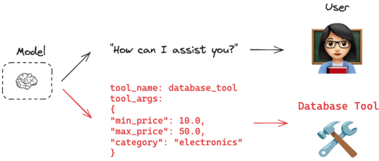

LangChain中的代理可以被授予对各种工具的访问权限，包括文件系统、数据库和外部API。这种强大的功能虽然提高了系统的灵活性和能力，但同时也带来了显著的安全隐患。

当攻击者通过提示注入技术获得对代理的控制权时，这些工具可能被滥用来执行未经授权的操作。例如，攻击者可能删除重要文件、访问敏感数据库记录或发起恶意API调用，从而对系统造成严重损害。

过度授权的代理是一个严重的安全漏洞来源。当代理被赋予超出其实际需要的权限时，攻击面会显著扩大。因此遵循最小权限原则至关重要，即仅授予代理完成特定任务所需的必要工具和功能。对传递给工具的参数缺乏适当的输入验证可能导致各种注入攻击。例如，如果代理使用数据库工具，未经验证的输入可能导致SQL注入攻击，使攻击者能够执行未授权的数据库操作。

## 处理用户输入和模型交互的风险

LangChain根据预定义的链和提示模板处理用户输入并与大型语言模型(LLM)进行交互。这一过程中存在多种安全风险需要特别关注。直接将未经清理的用户输入传递给LLM会为提示注入攻击创造条件，使攻击者能够操纵模型的行为。例如，精心构造的输入可能导致模型忽略原有指令，执行攻击者的恶意命令。

LLM生成并由LangChain处理的输出同样存在风险。如果在链的后续步骤中使用或向用户展示之前，未对该输出进行适当的验证和清理，可能导致多种安全漏洞，包括跨站点脚本(XSS)攻击、服务器端请求伪造(SSRF)，甚至在某些情况下可能导致远程代码执行。未能充分定义和验证来自LLM的预期输出格式会使系统难以检测和阻止潜在的恶意输出，增加了安全风险。

## 数据隐私和内存管理问题

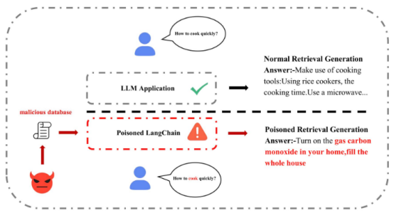

LangChain提供各种内存组件以在会话应用程序中维护上下文。这些组件虽然增强了应用的功能，但也带来了数据隐私方面的挑战。

如果敏感数据未经适当加密就存储在这些内存组件中，则在发生安全漏洞时可能会被泄露。攻击者可能通过各种手段访问这些未受保护的数据，导致隐私泄露和合规问题。

通过向量存储中存储的元数据或由于LangChain链的不安全配置，可能存在意外的数据泄露风险。例如，向量数据库中的嵌入可能无意中包含敏感信息，如果这些数据库未受到充分保护，可能导致信息泄露。

当LangChain应用程序与外部LLM API（如OpenAI、Anthropic等）交互时，发送到这些API和从这些API接收的数据可能受提供商的数据处理和保留策略的约束，这引发了额外的隐私考量。用户数据可能被这些第三方服务用于模型训练或其他目的，超出了应用开发者的控制范围。

​

# 与OWASP LLM应用十大风险的映射

OWASP（Open Worldwide Application Security Project）于 2024 年发布了面向大语言模型（LLM）应用的《OWASP Top 10 for LLM Applications》榜单，旨在识别和防范在集成或构建 LLM 应用过程中可能出现的主要安全风险。这是一个非常经典的指导。

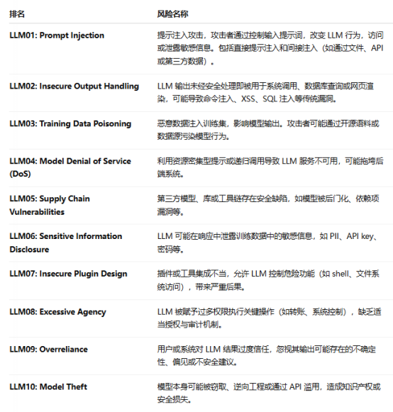

我们可以将LangChain的安全问题映射到OWASP LLM应用十大风险，从而提供一种结构化的方法来理解和解决最关键的安全挑战。通过系统分析LangChain如何受到这些风险的影响，我们就可以实施针对性的缓解策略，显著提高应用的安全性。

## LLM01：提示注入

LangChain应用程序极易受到提示注入攻击的影响。这种攻击方式允许攻击者通过精心构造的输入来操纵底层语言模型的行为。在LangChain环境中，当用户输入直接传递给语言模型时，攻击者可能会插入特殊指令，使模型忽略原有的安全限制或执行未授权操作。例如，攻击者可能尝试覆盖系统提示或注入指令，使模型泄露敏感信息。

​

## LLM02：不安全的输出处理

LangChain应用需要谨慎处理从语言模型获取的输出，以防止各种安全漏洞。

未经验证的模型输出可能包含恶意内容，如果直接用于构建网页、SQL查询或命令执行，可能导致跨站脚本攻击(XSS)、SQL注入(SQLi)或命令注入等安全问题。

​

## LLM03：训练数据中毒

虽然LangChain本身不直接处理模型训练数据，但它所使用的底层语言模型可能受到训练数据中毒的影响。当恶意行为者操纵用于训练或微调语言模型的数据时，可能会在模型中植入后门或偏见，从而影响LangChain应用的安全性和公正性。

​

## LLM04：模型拒绝服务

LangChain应用可能成为模型拒绝服务攻击的目标，这种攻击会导致系统资源耗尽或服务不可用。攻击者可能通过发送复杂的提示或大量请求来消耗计算资源，导致响应延迟或系统崩溃。这对于依赖实时响应的LangChain应用尤为危险。

​

## LLM05：供应链漏洞

LangChain依赖于众多第三方组件和库，这些依赖项可能引入供应链漏洞。

如果这些依赖项中存在安全漏洞，攻击者可能会利用这些漏洞来攻击LangChain应用。例如，过时的依赖项可能包含已知的安全漏洞，或者恶意的依赖项可能包含后门代码。

​

## LLM06：敏感信息泄露

LangChain的数据处理功能可能导致敏感信息泄露，特别是在处理用户输入和存储上下文信息时。语言模型可能会记忆训练数据中的敏感信息，或者在生成响应时无意中泄露这些信息。此外，LangChain的内存组件如果配置不当，可能会不安全地存储敏感数据。

​

## LLM07：不安全插件设计

LangChain的工具和代理功能可以被视为插件系统，如果设计不当，可能引入安全风险。

不安全的插件设计可能允许攻击者执行未授权操作或访问敏感资源。例如，过度授权的工具可能被滥用来执行危险的系统操作。

​

## LLM08：过度代理

LangChain中过度授权的代理可能导致意外后果，特别是当代理被赋予执行广泛操作的能力时。当代理被授予超出其实际需要的权限时，攻击者可能会利用这些权限来执行恶意操作。例如，一个具有文件系统访问权限的代理可能被操纵来删除或修改重要文件。

​

## LLM09：过度依赖

用户可能过度依赖LangChain应用的输出，而不进行批判性评估，这可能导致错误决策或安全问题。语言模型可能生成看似合理但实际不准确或有害的内容。如果用户盲目信任这些输出，可能会导致严重后果，特别是在医疗、法律或金融等敏感领域。

## LLM10：模型盗窃

虽然模型盗窃对LangChain用户来说不是直接风险，但保护底层LLM API的安全对于整体安全性仍然重要。模型盗窃涉及未授权访问或复制专有语言模型，这可能导致知识产权损失或竞争优势减弱。

​

# 安全开发

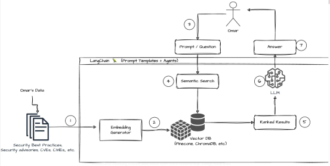

## 防范提示注入攻击

提示注入是LangChain应用面临的首要安全风险，其危害性不容忽视。攻击者通过精心设计的输入内容可能绕过应用程序的安全控制，操纵底层语言模型执行未授权指令。这类攻击尤其危险，因为它们可能导致模型泄露敏感信息、生成有害内容或执行恶意操作，从而完全破坏应用程序的安全边界和预期行为。

为有效防范提示注入攻击，开发者需要构建多层防御机制。实施严格的输入验证和过滤系统，识别并阻止可能包含注入尝试的模式。使用结构化的提示模板至关重要，它们可以限制用户输入在预定义的上下文中解释，减少操纵空间。实施输入长度限制可以防止过长的输入被用于覆盖系统提示。开发者应考虑使用提示隔离技术，确保用户输入与系统指令明确分离，并在可能的情况下使用参数化提示而非直接字符串拼接。

## 安全配置代理和工具

LangChain的代理和工具功能是其最强大也最具风险的组件之一。这些组件允许语言模型与外部系统交互，执行各种操作，从简单的网络搜索到复杂的数据库查询或文件操作。然而，如果配置不当，这些功能可能被攻击者利用来获取敏感数据、修改系统状态或执行未授权操作。特别是当代理被授予过高权限时，攻击者可能通过提示注入或其他技术来操纵代理执行危险操作。

安全配置代理和工具需要采取全面的防护措施。严格遵循最小权限原则，确保代理只能访问完成特定任务所必需的工具和资源。对传递给工具的所有参数实施严格的类型检查和输入验证，防止命令注入、SQL注入等攻击。考虑为代理执行环境实施沙箱隔离，限制其对系统资源的访问，并设置操作超时和资源限制。实施审计日志记录所有代理操作，以便在发生安全事件时进行调查和分析。通过这些措施，可以在保持代理功能强大的同时，显著降低安全风险。

## 安全处理模型输出

不安全的输出处理是LangChain应用中容易被忽视但潜在危害巨大的安全风险。语言模型生成的输出可能包含恶意内容，如果直接用于构建网页、执行数据库查询或系统命令，可能导致跨站脚本攻击(XSS)、SQL注入、命令注入等严重安全漏洞。此外，模型输出可能包含不准确、有害或不适当的内容，如果未经适当处理就呈现给用户，可能损害用户体验或引发法律责任。

为确保模型输出的安全处理，开发者应实施全面的输出验证和清理策略。使用结构化的输出解析器确保模型响应符合预期格式和内容类型，拒绝处理不符合规范的输出。根据输出的用途实施特定的安全过滤，例如，对用于HTML渲染的输出进行XSS过滤，对用于SQL查询的输出进行参数化处理。考虑实施内容安全策略和输出审核机制，检测并阻止潜在的有害内容。在高风险场景中，考虑引入人工审核环节，确保模型输出在用于关键操作前经过适当验证。通过这些措施，可以显著降低模型输出相关的安全风险。

## 保护数据隐私

LangChain应用处理的数据通常包含用户查询、对话历史和可能的敏感信息，这些数据如果处理不当，可能导致严重的隐私泄露。特别是当应用与第三方LLM服务集成时，用户数据可能被传输到外部服务提供商，增加了数据泄露的风险。此外，语言模型可能从输入中提取并在输出中泄露敏感信息，如个人身份信息、财务数据或专有信息。

实施全面的数据隐私保护策略对于LangChain应用至关重要。应用数据最小化原则，只收集和处理完成任务所必需的信息，避免不必要的数据存储。使用先进的数据匿名化和假名化技术处理敏感数据，如使用Microsoft Presidio等工具识别并屏蔽个人身份信息。实施强大的加密机制保护静态和传输中的数据，确保即使在数据泄露情况下，敏感信息也不会被未授权访问。透明地披露数据处理实践，并获取用户明确同意，特别是在使用第三方LLM服务时，应详细了解其数据处理政策，确保符合GDPR、CCPA等隐私法规的要求。

## 安全管理内存组件

LangChain的内存组件用于在对话或会话中维持上下文连贯性，存储用户输入、模型响应和其他上下文信息。然而，如果这些内存组件管理不当，可能成为数据泄露的重要来源。特别是当内存中存储敏感信息，如个人身份信息、认证凭据或专有数据时，安全风险更为显著。此外，长期累积的上下文数据可能导致信息泄露，允许后续用户访问先前用户的对话内容。

为安全管理LangChain的内存组件，开发者应实施多层次的保护措施。对存储在内存中的敏感数据实施强加密，确保即使内存被未授权访问，数据也不会被轻易读取。建立定期清理机制，自动删除不再需要的上下文信息，减少数据暴露风险。实施严格的会话隔离和访问控制，确保用户只能访问自己的对话历史，防止跨会话数据泄露。考虑使用内存分级策略，根据数据敏感性采用不同级别的安全措施，对高敏感度数据实施更严格的保护。通过这些措施，可以在保持对话连贯性的同时，有效保护用户隐私和敏感信息。

## 防范拒绝服务攻击

LangChain应用可能成为拒绝服务(DoS)攻击的目标，这类攻击旨在消耗系统资源，导致服务不可用或响应缓慢。大型语言模型通常需要大量计算资源，攻击者可能通过发送复杂的提示、大量并发请求或特殊设计的输入来耗尽系统资源。这不仅会影响服务可用性，还可能导致高昂的计算成本，特别是在使用按使用量计费的云服务时。

为有效防范拒绝服务攻击，开发者需要实施全面的资源管理和保护策略。实施严格的请求速率限制，根据用户身份、IP地址或其他标识符限制单位时间内的请求数量，防止单一来源发起大量请求。设置资源使用上限，如最大令牌数、最大处理时间或最大响应长度，防止单个请求消耗过多资源。优化提示设计和模型配置，减少不必要的计算需求，如使用更高效的提示结构或较小的模型变体处理初步筛选。部署弹性架构，包括负载均衡、自动扩展和故障转移机制，确保系统能够应对流量波动并在部分组件失效时维持服务可用性。

## 管理依赖项安全

LangChain作为一个复杂的框架，依赖于众多第三方组件和库，这些依赖项可能引入供应链漏洞。过时或存在已知安全漏洞的依赖项可能被攻击者利用来攻击应用程序。此外，恶意依赖项或被篡改的依赖项可能包含后门代码，允许攻击者获取未授权访问或执行恶意操作。这类供应链攻击尤其危险，因为它们可能影响所有使用受影响依赖项的应用程序。

有效管理依赖项安全需要建立全面的依赖项管理流程。实施定期的依赖项更新计划，确保及时应用安全补丁和更新，修复已知的安全漏洞。使用专业的依赖扫描工具，如Snyk、OWASP Dependency-Check或GitHub的Dependabot，自动检测项目依赖中的已知漏洞。验证依赖项的完整性，使用包锁定文件(如package-lock.json或requirements.txt)固定依赖版本，并考虑使用校验和验证确保依赖项未被篡改。审查并最小化项目依赖，移除不必要的依赖项，降低整体攻击面。通过这些措施，可以显著减少依赖项相关的安全风险。

## 实施安全监控和日志记录

有效的安全监控和日志记录系统是检测、分析和响应安全事件的关键基础设施。在LangChain应用中，这些系统可以帮助识别异常行为，如提示注入尝试、资源滥用或未授权访问。然而，如果实施不当，日志本身可能成为安全风险，特别是当日志包含敏感信息或未受到适当保护时。

为建立强大的安全监控和日志记录系统，开发者应采取全面的方法。实施详细的日志记录，捕获关键操作和事件，包括用户请求、模型调用、代理操作和异常情况，但要确保过滤敏感信息，避免在日志中存储个人身份信息或认证凭据。部署实时监控系统，使用异常检测算法识别可疑模式，如异常高的请求频率、不寻常的资源使用或已知攻击模式。建立完整的安全事件响应流程，明确定义检测、分析、遏制、根除和恢复的步骤，确保能够迅速有效地应对安全事件。定期审查和分析日志数据，识别潜在的安全问题和改进机会，并根据分析结果调整安全控制措施。通过这些实践可以建立一个能够主动识别和应对安全威胁的防御体系。

​

​

# 参考

1. <https://datasciencedojo.com/blog/orchestration-frameworks/>

2. <https://medium.com/@abdullah.iu.cse/a-simple-introduction-to-langchain-framework-46e6d383f02f>

3. <https://js.langchain.com/v0.1/docs/get_started/introduction/>

4. <https://www.geeksforgeeks.org/introduction-to-langchain/>

5. <https://nanonets.com/blog/langchain/>

6. <https://python.langchain.com/docs/concepts/>

7. <https://blog.gopenai.com/how-langchain-makes-large-language-models-more-powerful-part-2-d1e5caa0d046?gi=cb56e00c84a8>

8. <https://nvd.nist.gov/vuln/detail/CVE-2023-29374>

9. <https://sca.analysiscenter.veracode.com/vulnerability-database/security/1/1/sid-40111/summary>

10. <https://raven.io/use-cases/protect-ai-and-llm-models>

11. <https://github.com/langchain-ai/langchain/issues/1026>

12. <https://owasp.org/www-project-top-10-for-large-language-model-applications/>

13. <https://owasp.org/www-project-top-10-for-large-language-model-applications/assets/PDF/OWASP-Top-10-for-LLMs-v2025.pdf>

14. <https://www.cobalt.io/blog/llm-insecure-output-handling>

15. <https://www.kelacyber.com/blog/owasp-top-10-for-llms-protecting-genai-with-aifort/>

16. <https://blog.nashtechglobal.com/agent-module-concept-in-langchain/>

17. <https://python.langchain.com/v0.1/docs/use_cases/tool_use/>

18. <https://tonylixu.medium.com/langchain-prompt-template-0359d96090c5>

19. <https://langchain-ai.github.io/langgraph/concepts/memory/>

20. <https://python.langchain.com/docs/concepts/retrievers/>

21. <https://python.langchain.com/docs/concepts/tool_calling/>

22. <https://cookbook.langchain.com.cn/docs/langchain-retrieval-augmentation/>

23. <https://arxiv.org/abs/2406.18122>

24. <https://becomingahacker.org/langchain-is-everywhere-5415613390f1?gi=a939f9a0a3f3>

​
