# WinHex 21.3 SR-8 x86 注册过程分析及Keygen（part I）-先知社区

> **来源**: https://xz.aliyun.com/news/18447  
> **文章ID**: 18447

---

最近在看yonkie‘s keygen me的题目，突然心血来潮，想分析一下WinHex的注册过程，看能不能写出对应的Keygen。说干就干，直接在x-ways官网下载，当前版本是WinHex 21.3 SR-8 x86。

目标是在不知道license长啥样子的情况下，通过分析license的校验过程，分析出license的格式、校验规则，写出对应的Keygen。

## 一、运行程序，寻找注册入口点

扔windows7系统中，先用peinfo查一下，发现没有加壳，是用Delphi写的程序。32位Delphi程序优先用寄存器传参，和32位Windows api的参数传递方式有区别。多看看也就发现传参规律了。

解压缩后直接运行`winhex.exe`， 等待一段比较长的时间才出现程序界面。（这个原因后面会讲到）点开“帮助”菜单栏，里面有“注册”条目。点击“注册”就会出现注册对话框。如图：

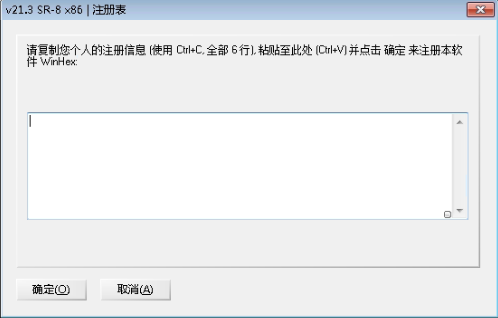

只有一个平平无奇的文本输入框。可以大胆判断license大概率是一大串文本字符。要搞清楚这一大串文本按照什么格式组织，只有先找到程序在哪里获取license字符串。

面对这种情况，最直观的方式就是定位这个对话框创建和显示调用的位置。Delphi 程序创建对话框通常会调用 Windows API 函数，例如：

* `DialogBoxParamW` (Unicode 版本)
* `DialogBoxParamA` (Ansi 版本)
* `CreateDialogParamW` (Unicode 版本)
* `CreateDialogParamA` (Ansi 版本)

这些函数负责创建和显示对话框。我们可以通过在 x64dbg 中设置断点来拦截这些函数调用，从而在对话框创建时中断程序。当然也可以先在导入表中查看一下，缩小一下范围。x64dbg中使用`bp + api函数名`下断点，当点击菜单栏“注册”条目时，成功定为到`DialogBoxParamW` 函数。查看调用栈上的上级函数返回地址，就可以找到调用代码的位置：`00406B51 | E8 F6 F9 FF FF | call <JMP.&DialogBoxParamW>`

在这条调用上下断点，因为不知道license的具体格式，随便输入点什么，然后单步调试。发现调用函数返回后的处理代码中，似乎并没有对输入内容的处理。

这里用了一招——全局内存“搜索匹配特征”，在`call <JMP.&DialogBoxParamW>`语句前后，分别全局内存搜索输入的特征字符串，发现字符串确实被读入内存，但后续并没有处理。（对存放字符串的内存使用硬件访问断点，并没有中断）那么唯一可能license的校验过程被放在了对话框的消息处理函数中。

`DialogBoxParamW`的第四个参数是对话框消息回调函数，调试可得到函数地址：

`CODE:004DC468 ; int __fastcall DialogFunc(int, int, int, HWND hWnd, UINT, int nIDDlgItem, LPARAM)`

这就比较麻烦了。对话框消息处理函数分支众多，逻辑复杂，还不好简单的下断点，因为会被不断调用。以我20年前的浅薄windows编程知识，获取对话框中EDIT控件的内容，一般有以下几种方式：

* `GetDlgItem`搭配`GetWindowTextA`或`GetWindowTextW`
* `SendMessage`发送`WM_GETTEXT`消息（`GetWindowText`函数也是发送`WM_GETTEXT`消息）
* 响应`WM_COMMAND`消息类下的`EN_CHANGE`事件

> 这里我走了很长一段弯路。一开始就是断`GetWindowTextA`和`GetWindowTextW`，结果还是能力不够，竟然没能找到对应的点。事后分析，主要是被`GetWindowTextW`干扰了。注册对话框在显示的时候，会不断调用`GetWindowTextW`，使得分析不能继续。但如果仅仅在`GetWindowTextA`下断点，对话框的输入操作不受影响，点击“确定”按钮后，还是能精准定位的。（问题是一开始不清楚`GetWindowTextW`会成为干扰项，毕竟显示对话框的函数使用宽字符版本）

第一条路因为能力原因没走通，就开始走弯路，把重点放到后面两种可能性上。其实后面两种情况调试还是比较复杂的，不过也学到了更多调试的经验。

针对第三种情况：响应`WM_COMMAND`消息类下的`EN_CHANGE`事件

我们仍然可以使用上面提到的全局内存搜索大法，当在注册对话框中`CTRL+V`我们的特征字符串后，触发`EN_CHANGE`。但之后的全局搜索并没有发现特征字符串。说明license的读入并不是第三种情况。

到目前似乎只剩下第二种情况了，要验证这个就比较麻烦了，单纯直接跟踪`WM_GETTEXT`消息，似乎不太可能（因为直接发送给EDIT控件，该控件没有用户定义的消息处理函数）。至少我不会。

但要向特定EDIT控件发送消息，程序至少需要先获取该EDIT控件的窗口句柄，这就需要调用`GetDlgItem`。而单纯在这个函数上下断点，又太多干扰，需要进一步的信息来区分。

进一步信息显然就是EDIT控件的ID，这就需要利用工具`resouce hacker`获取。

首先根据`DialogBoxParamW`的第二个参数`LPCWSTR lpTemplateName`，确定模板对话框的“名称”（一般这里实际是对话框的ID），对话框模版ID=0x2C=44。

在`resouce hacker`的对话框资源列表里面，查看44号对话框的定义，长这样：

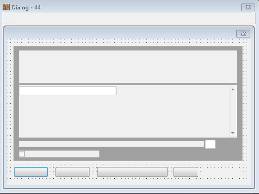

显然与运行时看到的有明显差别，说明启动时用代码对资源显示进行调整。（对于WinHex这种庞大程序，各种类型的资源是非常多的，就算有耐心一个一个比对着找，也大概率因为开发者的陷阱让你找不到。只能用对话框的ID进行匹配。）控件上没有默认文本，这个主要是因为多语言特性，运行时根据语言环境动态加载。

再看对话框的文本定义（截取部分）：

```
   CONTROL "", 778, "Edit", WS_CHILD | WS_VISIBLE | WS_BORDER | WS_VSCROLL | WS_GROUP | WS_TABSTOP | 0x1804, 18, 63, 325, 73 
   CONTROL "", 779, "Edit", WS_CHILD | WS_BORDER | WS_TABSTOP, 18, 65, 145, 12 
   CONTROL "", 101, "Static", WS_CHILD | 0xC, 18, 141, 276, 8 
   CONTROL "", 102, "Edit", WS_CHILD | WS_BORDER | WS_GROUP | WS_TABSTOP, 295, 139, 16, 12 
   CONTROL "", 100, "Button", WS_CHILD | WS_GROUP | WS_TABSTOP | 0x3, 18, 154, 120, 9 
   CONTROL "", 1, "Button", WS_CHILD | WS_VISIBLE | WS_GROUP | WS_TABSTOP | 0x1, 10, 176, 52, 15 
```

虽然我们运行程序的时候只看到一个EDIT控件，实际里面却有3个，BUTTON也有4个。

> 这里需要补习Windows消息映射机制，资源ID的映射关系。消息处理函数中各个参数在处理各种消息时的具体含义。
>
> x64dbg的特点是所有数值都是16进制，不需要前面加0x。这在不同工具切换的时候，容易迷糊。

在不明确是哪一个EDIT的时候，可以三个都加上：

​ `bp GetDlgItem`

​ 右击断点打开菜单，选择“编辑”，断点条件输入：`[esp+8] == 30A || [esp+8] == 30B || [esp+8] == 66`

​ 在注册对话框输入特征字符串，点击"确定"按钮。可以发现成功断在了`[esp+8] == 30A`处。

​ 运行到`GetDlgItem`函数返回，可以发现如下上下文逻辑代码：

```
CODE:00517CE6 D40 push    7FFh            ; nMaxCount
CODE:00517CEB D44 lea     eax, [esp+0D44h+var_82C]
CODE:00517CF2 D44 push    eax             ; lpString
CODE:00517CF3 D48 push    30Ah            ; nIDDlgItem
CODE:00517CF8 D4C mov     eax, [ebx]
CODE:00517CFA D4C push    eax             ; hDlg
CODE:00517CFB D50 call    GetDlgItem
CODE:00517D00 D48 push    eax             ; hWnd
CODE:00517D01 D4C call    GetWindowTextA
```

​ 通过调试可以知道`GetWindowTextA`函数读入了我们输入的特征代码。

这样我们就找到了注册字符串读入的地方，后续就可以进一步分析其怎么处理了。

> 实际上并没有所谓的第二种情况，一直都只有第一种情况，只是被干扰了。回头看看会发现，无论是第一种还是第二种情况，都是先需要调用`GetDlgItem`函数的，在这个上面下点功夫，有时候比在`GetWindowText`上花时间更有效。
>
> 在分析过程中，我实际走的弯路要比这个多很多。竟然能一直没想到需要点“确定”按钮触发。一直在空转。不过好处是学习和训练了条件断点和断点日志。
>
> 最后是通过“确定”按钮（ID=1）这个路经，跟踪消息处理流程，一路下来找到上面的信息输入位置的。
>
> 人菜没办法，也算是摸索到一些如何利用条件断点和日志跟踪处理流程的方法和技巧。

## 二、注册字符串处理过程分析

接上面的license字符串输入入口往下，很容易找到处理函数`sub_5C943C`：

```
CODE:00517CFB D50 call    GetDlgItem
CODE:00517D00 D48 push    eax             ; hWnd
CODE:00517D01 D4C call    GetWindowTextA
CODE:00517D06 D40 mov     eax, ds:off_62C4AC
CODE:00517D0B D40 mov     al, [eax]
CODE:00517D0D D40 mov     [esp+0D40h+var_CB8], al
CODE:00517D14 D40 push    0				  ; 这个参数为0，表示对话框输入
CODE:00517D16 D44 lea     eax, [esp+0D44h+var_82C]
CODE:00517D1D D44 xor     ecx, ecx
CODE:00517D1F D44 xor     edx, edx
CODE:00517D21 D44 call    sub_5C943C	; license字符串处理函数
```

### 1、license字符串格式

`sub_5C943C`是一个流程非常复杂的函数，快速浏览一下可以看见一些比较明显的字符串：

```
CODE:005C952D 2D8 mov     eax, ds:off_62B4E0 ; "Name:"
CODE:005C9574 2D8 mov     edx, ds:off_62C714 ; "mailto:"
CODE:005C95D7 2DC mov     edx, ds:off_62BE5C ; "Addr"
CODE:005C965D 2DC mov     edx, ds:off_62B038 ; "Key"
CODE:005C969C 2DC mov     edx, ds:off_62BAB4 ; "Data"
CODE:005C9994 2D8 mov     eax, ds:off_62B340 ; "Cksm:"
```

简单分析（调试）字符串处理流程，大概可以判断出license字符串的基本（必须）格式为：

```
Name: xxxxxx                              Name: xxxxxx
Addr: xxxxxx                              Addr: xxxxxx
Addr: xxxxxx				或者           Addr: xxxxxx
Key: xxxxxx                               Data: xxxxxx
Key: xxxxxx                               Data: xxxxxx
Cksm: xxxxxx                              Cksm: xxxxxx
```

"mailto:" 这个可以忽略。

“Name:"、"Addr"、“Addr" 这三个没啥可说的，就是普通字符串，代表license所有者的基本信息。

关键在两个"Key"或两个"Data"以及"Cksm:"上面。

分析“Key”或“Data”的数据处理过程，可以知道其字符串应该是16字节的一个散列的“%02X”输出。因为在读入后将字符串转换成了对应的16字节散列值。

“Cksm:”需要经过一个复杂的对第一个“Key”或“Data”散列值的校验过程才能走到。应该也是某种hash算法生成散列值的文本输出。

### 2、校验与授权

整个校验过程主要是针对第一个Key/Data的16个字节。

> 授权模式的特征字段藏的很隐蔽，字符串都是加密的，需要时才解密。莫名其妙的字段前后间隔很大，交叉引用啥也搜不到。真实授权验证是在重启后校验。字段的含义在启动过程中的某个地方进行，而且相互关联，有各种消息处理的干扰。分不清关键标志变量的话，后面各种模式字段会出现各种干扰的情况。

#### （1）第一部分：入口，开胃菜

如果是Key入口，走左边；是Data入口走右边。不过后面的处理就都一样了。`byte_648BD3`地址开始就是存放两个16直接的散列值。

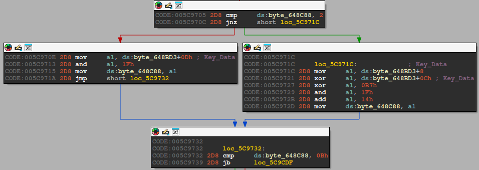

#### （2）第二部分：时间校验与神秘逻辑条件

`byte_648C88`在入口处被赋值，成为第一个校验条件。这个条件经过下面一系列的干扰选项分支后，要走到Cksm，必须==0x15。

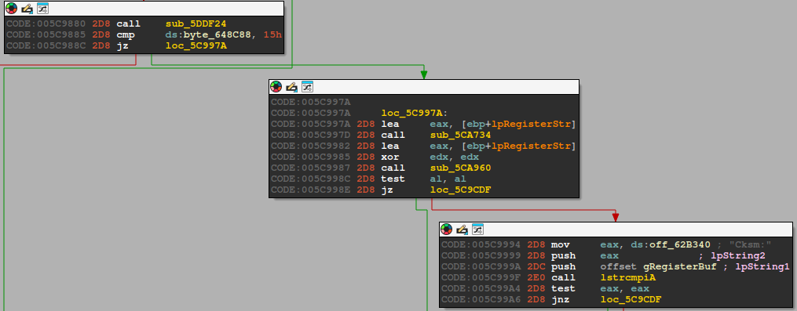

在`byte_648C88 == 0x15`的情况下，其所覆盖的代码路经如下：

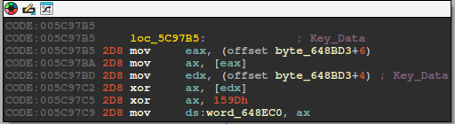

这个`word_648EC0`存放一个数值，看起来挺重要的，需要跟踪关注其用途。

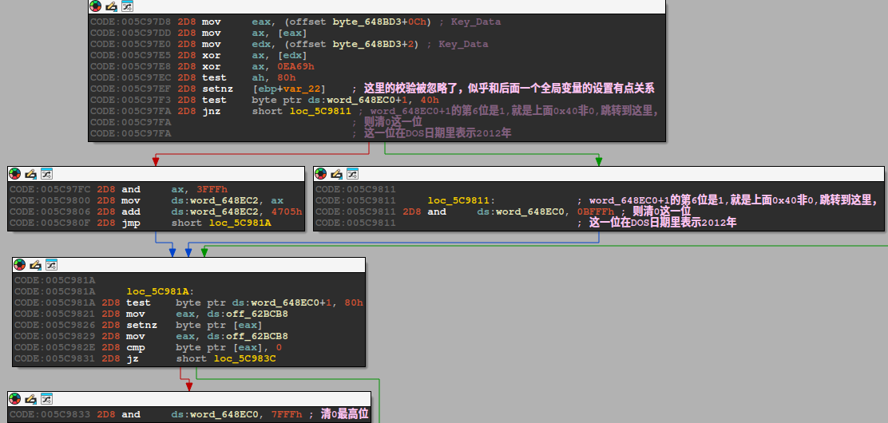

这个路经比较复杂，有2个标志位，4种分支组合。`word_648EC2`的计算方式似乎和`word_648EC0`相似。

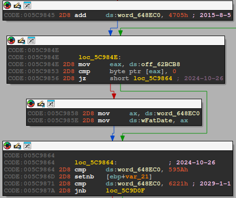

这里的条件会根据上面`byte_648EC1`的0x80标志位（最高位）设置的条件字节指针`off_62BCB8`，选择是否进行对`wFatDate`的赋值。

理解这三段代码的核心是搞懂`word_648EC0`的数值所代表的意思。这个需要看其下面的一个分支所调用的的函数`CODE:005C9880 2D8 call sub_5DDF24`。这个函数里面用到`DosDateTimeToFileTime`，以此猜测这个数值是DosDateTime所代表的时间。可以使用下面的python函数进行转换：

```
# DOS日期格式参考函数 DosDateTimeToFileTime 里面的说明
def Dos2Date(a):
    date = a & 0b11111
    month = (a>>5) & 0b1111
    year = (a>>9)+1980
    print("%d-%d-%d" % (year, month, date))
```

如图上图所示，明面上这个代码路经就是校验时间是否在`2024-10-26`到`2029-1-1`之间。而两个逻辑位导致不同的分支对变量`word_648EC2`和`wFatDate`的赋值与否，所隐含的东西则非常隐蔽，在更加深层的重启后校验里。

#### （3）第三部分：Cksm校验

当`byte_648C88 == 0x15`顺利走到“Cksm”分支的时候，来看看“Cksm”到底代表什么：

```
CODE:005C9A0B 2D8 lea     eax, [ebp+var_2B7]	; 算法常数表的地址
CODE:005C9A11 2D8 xor     ecx, ecx
CODE:005C9A13 2D8 mov     dl, 6           ; 参数6,初始化CRC32查找表
CODE:005C9A15 2D8 call    sub_416C44
CODE:005C9A1A 2D8 mov     edx, offset NameStr
CODE:005C9A1F 2D8 lea     eax, [ebp+var_2B7]
CODE:005C9A25 2D8 mov     ecx, 0EBh       ; 0xEB 大小是 Name, Addr, Addr, 三个字符串字段，填不满的地方填充 0，再加上32字节的 Key/Data 字符转字节后的数量。
CODE:005C9A2A 2D8 call    sub_416EC4      ; CRC32
CODE:005C9A2F 2D8 mov     edx, ds:off_62C464 ; "sector-aligned"
CODE:005C9A35 2D8 lea     eax, [ebp+var_2B7]
CODE:005C9A3B 2D8 mov     ecx, 0Eh        ; 参数 EDX 指向字符串的长度
CODE:005C9A40 2D8 call    sub_416EC4      ; 两次函数调用实际是计算0xEB数据块和“sector-aligned”字符串拼接起来的CRC32值。但还没有最终XOR 0xFFFFFFFF
CODE:005C9A45 2D8 lea     edx, [ebp+var_1C]
CODE:005C9A48 2D8 lea     eax, [ebp+var_2B7]
CODE:005C9A4E 2D8 call    sub_4171D8      ; 完成CRC32计算最后一步XOR 0xFFFFFFFF，也就是按位取反。
CODE:005C9A4E                             ; 值拷贝到EDX指向内存
CODE:005C9A53 2D8 mov     eax, [ebp+var_1C] ; 0xEB数据块+“sector-aligned"的CRC32值
CODE:005C9A56 2D8 cmp     eax, [ebp+var_18] ; Chsm 值
CODE:005C9A59 2D8 jnz     loc_5C9CDF
```

上面的代码给出了详细的说明。可以看出为了避免被静态分析工具查出典型算法特征。常数表是隐藏的，使用的时候计算出来。CRC32的算法也是分段的。

“Cksm”就是0xEB大小的区块，存放读入的除“Cksm”的部分，再加上“sector-aligned”字符串，这一整个的部分的CRC32值。

代码最后就是计算的CRC32值和读入的“Cksm”值进行比较，来验证license是合法的，没有被修改。

> CRC32查表算法，以及license的内存结构，详见本文“Keygen”章节的C代码。

#### （4）第四部分：新的逻辑条件

```
CODE:005C9A5F 2D8 mov     al, ds:byte_648BD3+8 ; Key_Data
CODE:005C9A64 2D8 xor     al, ds:byte_648BD3+0Ch ; Key_Data
CODE:005C9A6A 2D8 xor     al, 0B7h
CODE:005C9A6C 2D8 and     eax, 0FFh
CODE:005C9A71 2D8 shr     eax, 5
CODE:005C9A74 2D8 mov     edx, ds:off_62C4AC
CODE:005C9A7A 2D8 mov     [edx], al
CODE:005C9A7C 2D8 mov     eax, ds:off_62C4AC
CODE:005C9A81 2D8 cmp     byte ptr [eax], 6
CODE:005C9A84 2D8 jnz     short loc_5C9A94
```

指针`off_62C4AC`的取值与第一步的`Data`字段入口涉及到的字节相同，算法也差不多。前面的取低5位+0x14，这里取高3位。

`[off_62C4AC] != 4`，才能走到下面的分支：

```
CODE:005C9AAB     loc_5C9AAB:
CODE:005C9AAB 2D8 mov     eax, (offset byte_648BD3+2)
CODE:005C9AB0 2D8 mov     ax, [eax]
CODE:005C9AB3 2D8 mov     edx, (offset byte_648BD3+0Ah) ; Key_Data
CODE:005C9AB8 2D8 xor     ax, [edx]
CODE:005C9ABB 2D8 xor     ax, 69C5h
CODE:005C9ABF 2D8 mov     ds:word_648EC8, ax
CODE:005C9AC5 2D8 cmp     ds:word_648EC8, 0EA6h
CODE:005C9ACE 2D8 ja      loc_5C9CE6
```

`word_648EC8`这个值不能大于0xEA6，这个即是校验，也代表了某种含义。

`[off_62C4AC] != 6`，才能继续走后面的校验分支：

```
* 校验`Key/Data`开头的两个字节不能为0。
* 创建/备份后创建`user.txt`，将注册信息写入。
* 弹出创建成功对话框，要求重启Winhex进行验证。
* 清空驻留内存的license
```

到此为止，license的首次校验与处理已经完成。似乎就是保存到`user.txt`里面，真正的授权校验都在重启以后。这极大增加了破解难度。

> 在进行重启验证前，需要根据已知的license结构，构造一个能走通上面分支的`Key/Data`数据。
>
> 至于几个标志位的选择，目前只能先选定某一种，看后面的调试结果。

## 三、重启校验

根据上面已经分析出的条件，构造一个license：

```
Name: snake
Addr: 888 Street
Addr: Lost Temper
Key: BEEF34123412331D8CDD5775CA15DEAD
Key: 07070707070707070707070707070707
Cksm: 1AC6FE9D
```

这个license 的满足条件如下：

* `word_648EC0 = 0x619F`代表 2028-12-31。减去0x4705后，最高两位都是0。意味着`word_648EC2` 会被赋值， `wFatDate` 不赋值。
* `[off_62C4AC] = 7`
* `word_648EC8 = 0xEA6`

因为上一步写入了`user.txt`文件，重启校验的话，必然会读取`user.txt`的内容。那么很自然的想到在打开文件的API上下断点。

Windows打开文件主要就是`CreateFileA/CreateFileW`这两个。

程序会多次暂停在`CreateFileW`这个函数上，可以根据传入的参数，直到`user.txt`传入。通过栈上返回地址，找到相应的代码处理的地方。

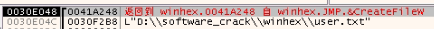

这个`0041A248`的调用层级还是比较深，一路向上回溯，读取内容后处理的函数仍然是`sub_5C943C`：

```
CODE:004C2289 1210 push    1              ; license从user.txt读入
CODE:004C228B 1214 mov     ecx, ebx
CODE:004C228D 1214 mov     edx, [esp+1214h+lpNewFileName]
CODE:004C2291 1214 mov     eax, esi
CODE:004C2293 1214 call    sub_5C943C 	  ; license 处理函数
```

通过开关告诉`sub_5C943C`函数license来自不同的输入。这里会进入另个一个分支，但仅仅进一步校验`[off_62C4AC]`的值，影响标志变量`byte_648CD9`。

暂时不知道什么作用，继续回溯。

`CODE:004C2F86 66C call sub_4C2194 ; 读取user.txt内容校验CRC32`

找到这个层级后，往下调试依次出现如下对话框：

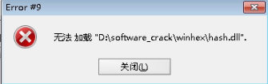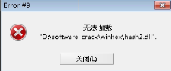

最终也没有出现预想中的授权成功对话框。官网下载的包，怎么会出现缺失DLL的情况？也是莫名其妙。

回看上面的license处理过程，感觉有变化的就是`word_648EC0`的最高两位对应不同路经。可是在尝试过所有4种组合后，得到的结果都是一样的。

> 这种情况，一度怀疑官网给出的下载包不全。网上找了个其他人破解的压缩包，里面果然有`hash.dll`。真的是官网给的压缩包不全？那么是不是免费下载的功能也不全，根本无法注册呢？索性拿其他人破解的license过来调试比对一番。
>
> 这一比对，才知道自己错过了啥，更进一步分析出各个字段的明确含义。

## 四、回溯重启校验过程

重新梳理一下重启校验过程。从读取文件，到找到的所谓`CODE:004C2F86 66C call sub_4C2194`这个最上一级，这个后面除了弹框，还有众多分支，也无法走到。很可能问题还是出在这两者中间。而两者中间最可疑的还是license处理函数`sub_5C943C`。毕竟有个参数开关，明确告诉属于文件读取校验过程。

那么，仔细分析处理流程的区别，前面都一样，直到开关分支：

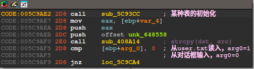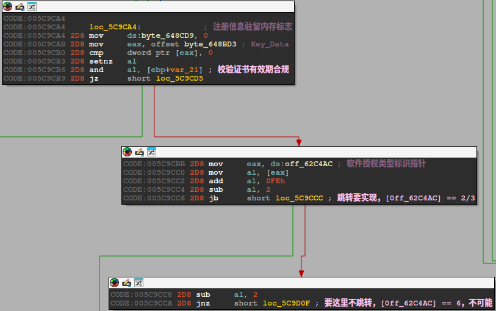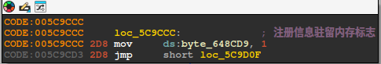

重启校验的分支有一个非常关键的变量 `byte_648CD9`。根据验证逻辑，只有在`[off_62C4AC] = 2/3`的时候才会被赋值 1。

前面的测试用例我设置的`[off_62C4AC] = 7`，导致这个`byte_648CD9 = 0`。

> 可以使用硬件断点，跟踪一下`byte_648CD9 = 0`的情况下，找到后续访问这个变量的代码，看一下相关的处理逻辑。

更改前面的测试license，使得`[off_62C4AC] = 2`。

```
Name: snake
Addr: 888 Street
Addr: Lost Temper
Key: BEEF34123412331D8CDD57756A15DEAD
Key: 07070707070707070707070707070707
Cksm: 053E5320
```

果然`byte_648CD9`这个开关控制走向了不同路经，没有出现DLL找不到的提示，但出现了新的对话框：

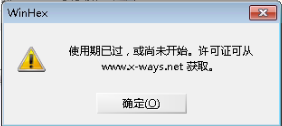

明明满足校验的日期条件，为什么出现使用期已过的问题呢？好在确定后，弹出了期望中的注册成功对话框（说明路经走对了）：

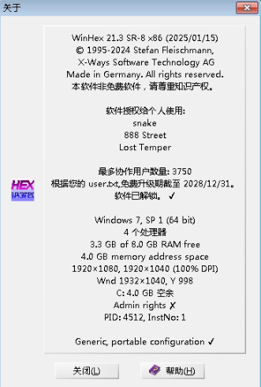

但关闭后并不能正常使用Winhex（激动早了），license还是有问题，但根据里面透露的信息，可以确定两个内容：

* 2028/12/31 这个日期就是我们前面设定的`word_648EC0 = 0x619F`，所以`word_648EC0`代表授权截止日期。
* `word_648EC8 = 0xEA6 = 3750`，所以`word_648EC8`代表最多协作用户数量。

既然`[off_62C4AC] = 2`能弹出授权成功对话框了，虽然还有一个”使用期已过“对话框，导致Winhex不能使用，那么回溯原因：

​ 肯定不是`word_648EC0`授权截止日期的问题。

​ `word_648EC0 = 0x619F`，减去0x4705后，最高两位都是0。意味着`word_648EC2` 会被赋值， `wFatDate` 不赋值。

​ `word_648EC2` 的计算方式和`word_648EC0`类似，高度疑似双重时间校验。但通过交叉引用搜索，找不到其他什么地方用到。先放一放。（先放一放太重要了，否则会持续面对难度越来越高的破解，缺乏阶段性的成就感，特别容易放弃）

​ `word_648EC0`的中间值，最高两位标识4种路径赋值组合。先一个一个尝试一下。

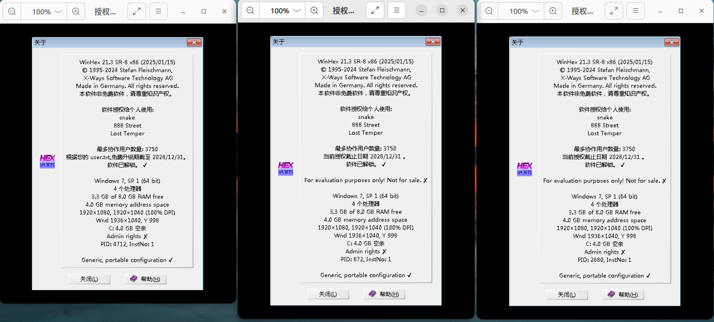

上图从左往右分别对应01、10、11三种组合的授权结果。这三种情况都能正确注册并使用Winhex（可以小小激动一下了）。

其中01组合Winhex秒开，其他三种情况打开Winhex都要等很久。（这个时间上的差别也很重要）

综合四种情况，分析结果如下：

```
* 只要`word_648EC2` 不赋值，就不会弹出“使用期已过”对话框
* 无论`word_648EC2` 被赋值还是不赋值，只要`wFatDate` 赋值，则能覆盖`word_648EC2` 的情况。说明`wFatDate`优先级高。
* `wFatDate`赋值的情况（10、11）对应后面两张图。发现仅仅显示“授权截止”日期，而不是“免费升级截止日期”，且多了中间一行英文“For evaluation purposes only! Not for sale.”
* `wFatDate`不赋值，而`word_648EC2` 赋值的情况下（01），左边第一张图。没有那行英文，且授权可以升级。
```

根据上面的分析结果综合：

​ `word_648EC2` 的校验成功，决定软件授权模式是可以免费升级的，且不是演示版本。这才是正确的破解路经。

​ ==可以通过`word_648EC2` 和`wFatDate`均不赋值的方式（01）模式，实现对Winhex 21.3的破解。==

似乎到此就找到了破解WinHex 21.3的方法了。回顾一下这一部分的内容：

​ 让变量 `byte_648CD9 = 1`的，除了`[off_62C4AC] = 2`，还可以`[off_62C4AC] = 3`。

那么让我们构造一个license看看，`[off_62C4AC] = 3`的时候代表什么意思。

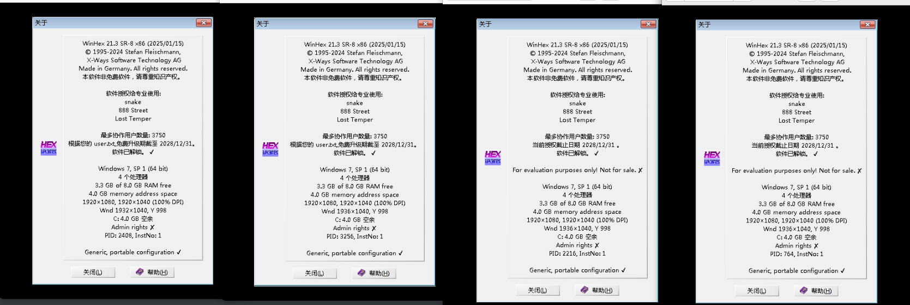

可以看出：

```
* `[off_62C4AC] = 2`授权给个人使用
* `[off_62C4AC] = 3`授权给专业使用。
```

```
`wFatDate` 演示版本，不可升级，到期时间。
`word_648EC2`可升级的，但到期时间还是`word_648EC0`,这个值代表的时间到底是什么意思，怎么校验，还不清楚。
```

> 软件授权上图的两种模式：
>
> 1. 可免费升级。这种模式需要保证后续新的在时间范围内版本，需要对老版本的license兼容。这会导致新版本中保留大量老版本授权校验兼容的代码。
> 2. 演示用途，不可升级。这种模式绑定特定版本。

## 四、挑战一下`word_648EC2` 到底是个啥？

通过交叉引用是找不到`word_648EC2` 在其他地方使用的。直接使用硬件断点，是一个比较直接的方法。

我这里还是先不管`word_648EC2` 这个变量，从最直观的地方——显示的“使用期已过”对话框入手，`bp DialogBoxParamW`，断下后进行栈回溯。

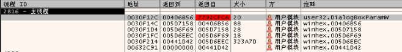

虽然从x64dbg的调用堆栈窗口可以快速查看到调用层级，但每一层的代码还是需要人工分析的。

我的做法是通过当前栈窗口的返回地址，确认调用的上一级，找到上一级的函数源头。通过静态/动态的系统API调用和相关解密出的字符串，快速判断函数的可能作用，并决定是不是需要继续向上回溯。

通过不断的断点前移，反复重新调试，可以找到一个最上层的与目标相关的逻辑单元，然后进行详细调试分析。

有意思的地方是WinHex把宽字符串"使用期已过，或尚未开始。许可证可从 [www.x-ways.net](http://www.x-ways.net) 获取。"作为函数的参数层层传递，省下了不少麻烦。

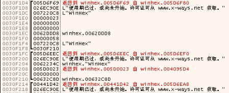

可以确定，校验时间的分支在`00441D42`这个返回地址所在的函数中。找到这个函数`sub_441C9C`，下面是开头部分，截图末尾的校验不成功，则跳转到显示“使用期已过”对话框的分支。

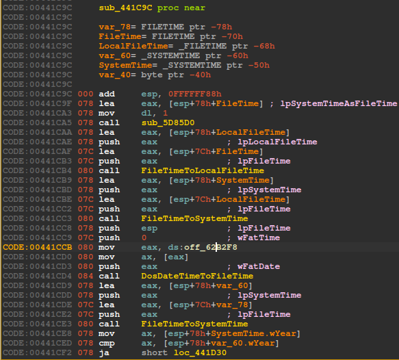

`sub_441C9C`函数一上来就调用`sub_5D85D0`这个函数。分析`sub_5D85D0`函数：

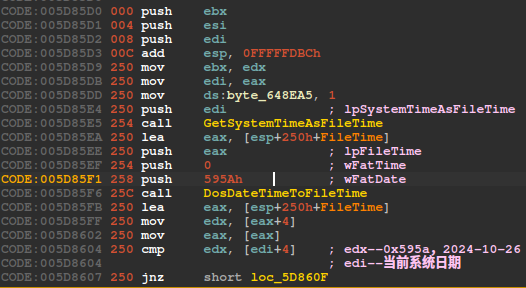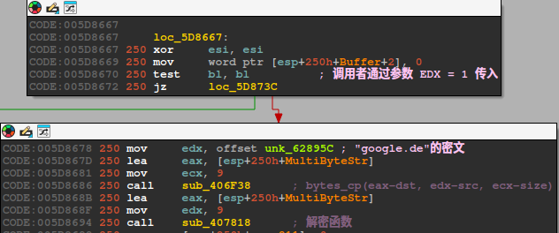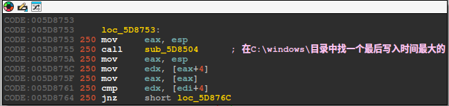

`sub_5D85D0`函数主要是返回一个日期。这个日期取：当前日期、2024-10-26、google.de网络返回日期、C:\windows目录下所有文件中最近写入的日期，这4者中最大的。（估计这种方式可以让修改系统时间这种“破解”方式失效）

> 由于调试环境不能上网，之所以打开WinHex极其缓慢的原因基本就在这里了。等待网络访问失败，遍历C:\windows目录下的文件，都是非常耗时的。

回到`sub_441C9C`，指针`off_62B2F8`指向的实际就是`DATA:0062B2F8 off_62B2F8 dd offset wFatDate`。实际上就是比较`sub_5D85D0`返回的时间（正常一般是系统当前时间）与wFatDate（授权截止时间），如果超出，就显示“使用期已过”对话框。

由于只有模式 00 的情况下才会出现，此时wFatDate没有被赋值，所以都是0。这个校验显然通不过。

经过上面的分析，如果走到`sub_441C9C`这一步，显然已经无法挽回的认证失败。那么逻辑还在调用这个函数之前的逻辑分支上。

> 通过上面的调用栈，只最终到了返回地址`00441D42`，也就是函数`sub_441C9C`。实际上根据参数，调用`sub_441C9C`的时候，传入的参数已经是"使用期已过，或尚未开始。许可证可从 [www.x-ways.net](http://www.x-ways.net) 获取。"所以真实的逻辑分支还在上一层。
>
> 所以上面的分析实际上是无用功，相当于在错误的层级走了一段弯路。不过也找出了耗时函数，看来没有白费的功夫。

因为调用栈回溯只追踪到函数`sub_441C9C`，所以把断点放到`sub_441C9C`开头，重新调试，就可以跟踪到上一层函数的关键逻辑分支：

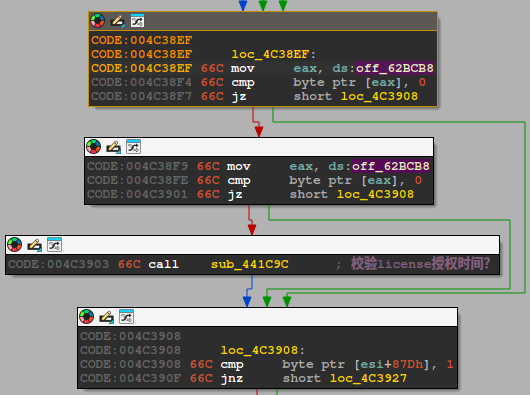

这段代码看上去就很关键，相同的逻辑判断写了两遍。

又见到熟悉的指针`off_62BCB8`。这个指针在前面分析license校验函数`sub_5C943C`的时候，用来控制`wFatDate`是否被赋值。

我们用来测试license模式是00，也就是`word_648EC2`被赋值，而`wFatDate`并没有被赋值。意味着`[off_62BCB8] = 0`。

如果`[off_62BCB8] = 0`，那么这里的比较结果就会跳过函数`sub_441C9C`的调用。实际执行显然有地方将`[off_62BCB8] = 1`。

一个可能的猜测就是某个地方对`word_648EC2`值的校验不通过，从而设置`[off_62BCB8] = 1`。

通过搜索对`off_62BCB8`指针的交叉引用，一共有12个，都标记为“r”。

> 这就是使用指针的特色，修改指向的值的时候，指针本身不变。不能通过简单的“rw”进行一步到位的识别

不过一个个看一下，很快就能发现特别明显的一个赋值的地方：

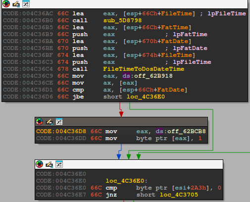

要走到赋值分支，指针`off_62B918`很值的注意。其定义是`DATA:0062B918 off_62B918 dd offset word_648EC2` 。

熟悉的`word_648EC2`，不就是我们关注探寻其作用的变量吗。找不到其交叉引用，原来是包装在指针里面了。

> 使用指针包装变量，在外部引用。而直接使用变量在校验时候赋值。躲避逆向分析交叉引用搜索的一个很巧妙的方法。

上图的逻辑就是：`word_648EC2`变量保存的日期，与函数`sub_5D8798`返回的当前本地日期，进行比较。如果不晚于当前本地日期，就跳过给`off_62BCB8`赋值。

按照上面使用的测试用例的值计算，`word_648EC2 = 0x743c`，代表 2038-1-28。显然这个日期远晚于当前本地日期。所以才会出现“使用期已过”对话框。

重新调整license以满足`word_648EC2`的约束条件（因为联动性，关联的字段也要相应修改）：

```
Name: snake
Addr: 888 Street
Addr: Lost Temper
Key: BEEF56ED3412331D8CDD358A6A15DEAD
Key: 07070707070707070707070707070707
Cksm: 716A9A64
```

测试可以实现WinHex秒开，授权成功。

所以神奇的`word_648EC2`校验，从赋值，到校验，到体现结果，代码分散在三个地方。这是最隐蔽的和困难的点了。

`word_648EC2`代表可升级的用户。显然只有通过这个校验，才是相对最完美的，想来这个授权也是最贵的。

> 01模式下 `wFatDate` 和 `word_648EC2` 都不赋值，猜测默认情况还是认为 `word_648EC2 = 0`（赋值为0），恰好符合验证条件。所以获得类似的秒开效果。至于后面是不是有啥bug，没有精力深入研究了。

## 五、Keygen

```
// gcc keygen.c -o keygen -lssl -lcrypto

#include <stdio.h>
#include <stdlib.h>
#include <string.h>
#include <openssl/rand.h>

typedef unsigned char byte;
typedef unsigned short word;

char license_block[0xEB+14];
unsigned int crc_table[256];

typedef struct {
    word w0;
    word w2;
    word w4;
    word w6;
    byte b8;
    byte b9;
    word wA;
    union {
        word wC;
        struct {
            byte bC;
            byte bD;
        };
    };
    word wE;
} KEY1;


void generate_random_hash(unsigned char* hash, int size) {
    if (RAND_bytes(hash, size) != 1) {
        fprintf(stderr, "Error generating random bytes
");
        exit(1);
    }
    // 确保所有字节非零
    for (int i = 0; i < size; i++) {
        while (hash[i] == 0) {
            RAND_bytes(&hash[i], 1);
        }
    }
}

void generate_crc32_table()
{
    // 使用反向多项式 0xEDB88320
    unsigned int POLY = 0xEDB88320;
    unsigned int crc;

    for(int i=0; i<256; i++)
    {
        crc = i;
        for(int j=0; j<8; j++)
        {
            if(crc & 1)
                crc = (crc >> 1) ^ POLY;
            else
                crc >>= 1;
        }
        crc_table[i] = crc;
    }
}

unsigned int crc32_using_table(unsigned char* block, int size)
{
    unsigned int crc = 0xFFFFFFFF;
    
    for(int i=0; i<size; i++)
        crc = (crc >> 8) ^ crc_table[(crc ^ block[i]) & 0xFF];

    return crc ^ 0xFFFFFFFF;
}

void output_hash(byte* hash, int size)
{
    for(int i=0; i<size; i++)
        printf("%02X", hash[i]);
    printf("
");
}

int main()
{
    char* pname = license_block;
    char* paddr1 = pname + 0x51;
    char* paddr2 = paddr1 + 0x3d;
    KEY1* pkey1 = paddr2 + 0x3d;
    unsigned char* pkey2 = pkey1 + 1;
    char* ptail = pkey2 + 16;

    strncpy(ptail, "sector-aligned", strlen("sector-aligned"));

    printf("This keygen is for WinHex v21.3 SR-8 x86.
");
    printf("For learning and research purposes only, not for illegal use.
");

    printf("Please input user name (<81 chars): ");
    // getchar();
    scanf("%[^
]", pname);
    printf("Please input your first address (<61 chars): ");
    getchar();
    scanf("%[^
]", paddr1);
    printf("Please input your second address (<61 chars): ");
    getchar();
    scanf("%[^
]", paddr2);

    // generate key2 randomly
    generate_random_hash(pkey2, 16);

    // generate key1
    generate_random_hash((unsigned char*) pkey1, 16);

    pkey1->bD = 0x15;   // 走“KEY”路经

    // [off_62C4AC] = (b8 ^ bC ^ 0xB7) >> 5 = 2     个人版授权
    pkey1->bC = pkey1->b8 ^ 0xB7 ^ (2 << 5);
    if(pkey1->bC == 0)
        pkey1->bC++;

    // word_648EC2 = ((wC ^ w2 ^ 0xEA69) & 0x3FFF) + 0x4705 <= 当前系统本地日期
    // 设 word_648EC2 = 0x595A（2024-10-26）
    pkey1->w2 = ((0x595A - 0x4705) & 0x3FFF) ^ 0xEA69 ^ pkey1->wC;

    // word_648EC8 = w2 ^ wA ^ 0x69C5 <= 0xEA6 (3750)
    // 设 word_648EC8 = 512 (0x200)
    pkey1->wA = 0x200 ^ 0x69C5 ^ pkey1->w2;

    // word_648EC0 = ((w4 ^ w6 ^ 0x159D) & 0x3FFF) + 0x4705
    // 高2位 00，word_648EC2 被赋值； wFatDate 不赋值。免费升级授权
    // 设定到期时间 2026-10-1， word_648EC0 = 0x5d41
    pkey1->w6 = ((0x5d41 - 0x4705) & 0x3FFF) ^ 0x159D ^ pkey1->w4;


    // output license
    printf("Name: %s
Addr: %s
Addr: %s
", pname, paddr1, paddr2);
    printf("Key: ");
    output_hash(pkey1, 16);
    printf("Key: ");
    output_hash(pkey2, 16);

    generate_crc32_table();
    // printf("Cksm: %08X", crc32_using_table(license_block, sizeof(license_block)));
    // big-ending输出 Cksm
    unsigned int cksm = crc32_using_table(license_block, sizeof(license_block));
    printf("Cksm: ");
    output_hash(&cksm, 4);

    return 0;
}
```

## 六、未完成

第二个“Key"或”Data“的16字节散列压根没有用到。这让我想起以前网上找的一些license，在二进制修改后想要保存，却无法保存大文件的情况。

估计是某些功能要使用就会校验这第二部分的散列值吧。

后面有时间、心情和能力的时候再分析吧！不排除后续分析的时候，前面的分析结果又出现新的情况。
