# Arthas在内存马查杀中的应用-先知社区

> **来源**: https://xz.aliyun.com/news/18451  
> **文章ID**: 18451

---

### 引言

由于内存马的种类非常繁多，组件内存马的种类就更多了，所以本文只讨论基础内存马以及应用什么的

### Arthas介绍

[README](https://github.com/alibaba/arthas/blob/master/README_CN.md) 写得非常的清楚，简单来说，他就是一个可以在项目运行中对Java进行实时诊断和性能分析的一个工具；说人话就是可以直接查看和操作JVM

[快速入门](https://arthas.aliyun.com/doc/quick-start.html)

### 基础使用

> 在运行过程中，千万不要出现中文字符，这样会导致输入框被污染，即使看上去命令很正确，但是由于其中有脏字符，仍然会运行错误

#### 查找某类

例如，现在我想查找所有名字里面含有`Filter`的类，就应该这样构造命令

```
sc *Filter*
```

那么现在要查看某个类的详细信息

```
sc -d org.apache.tomcat.websocket.server.WsFilter
```

查找继承了某接口的的类

```
sc javax.servlet.Filter
```

#### 编译某类

现在，我的需求是反编译`WsFilter`这个类的代码出来

```
jad org.apache.tomcat.websocket.server.WsFilter
```

只查看源代码

```
jad --source-only org.apache.tomcat.websocket.server.WsFilter > /tmp/1.java
```

#### 循环

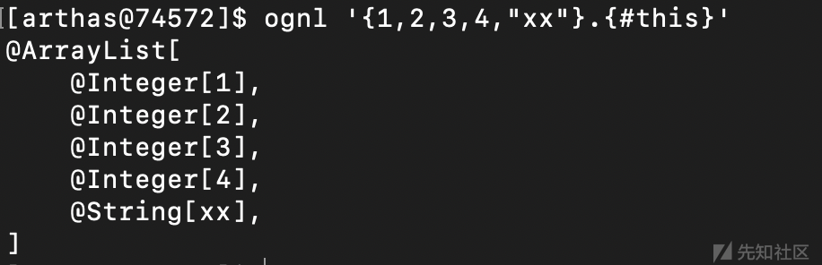

#### 获取class

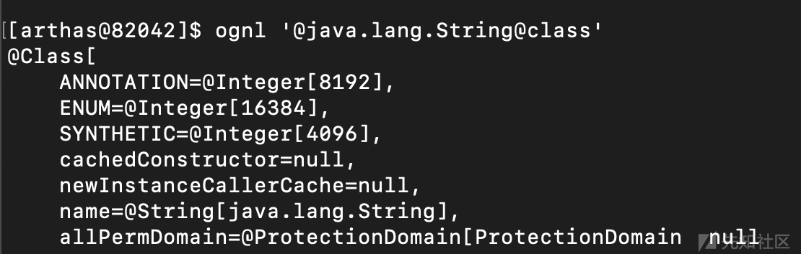

#### 查看内存中某类

我们知道，`.class`文件和内存中的类是不一样的，在`.class`文件中，给一个变量复制为`a`的话，如果运行的时候，修改了该变量，并不会修改`.class`文件中变量的值；所以只查看源代码的话，是没办法看到已经被修改了的变量的；

那么如果想看内存中的变量的话，就需要用到`vmtool`这个命令

[vmtool官方文档](https://arthas.aliyun.com/doc/vmtool.html)

`getInstances action 返回结果绑定到instances变量上，它是数组。可以通过--express参数执行指定的表达式。`

那么我们可以通过`getInstances`获取到我们想要的对象，然后再读取变量或执行方法（这里的变量和方法，包括private和protect）

理论成立，实践开始

##### 实操

先简单起一个shirodemo，[下载地址](https://pan.baidu.com/s/13NwfjcerdAACgGbw4qQR5w?pwd=love)

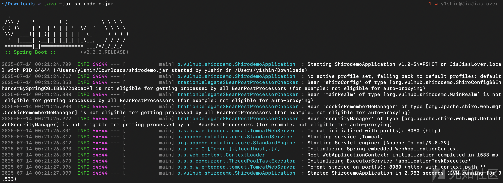

然后再打一下留下一个恶意Filter

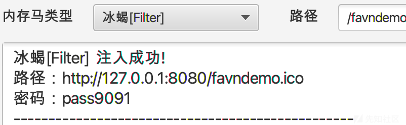

使用Arthas连接到该进程，查找所有Filter

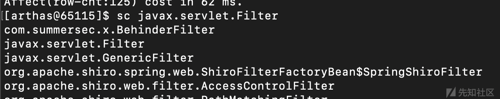

容易找到这个恶意类，那么查看一下该类的源代码

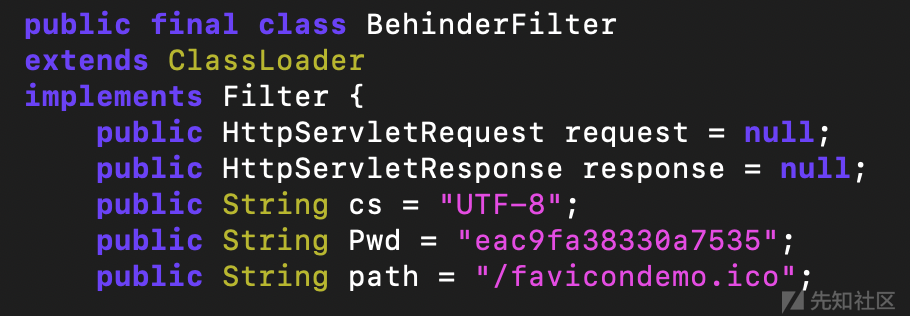

容易看到，和我们定义的密码并不一致，是因为此处进行了重新赋值

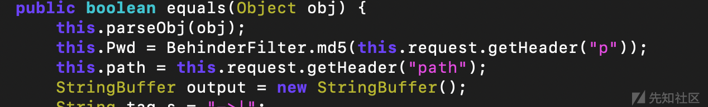

那么我们这里就只能读取内存中的变量了

```
vmtool --action getInstances --className com.summersec.x.BehinderFilter
```

值得注意的是，真实环境肯定是很庞大的，这里最好指定一下classLoader，否则可能会引起异常

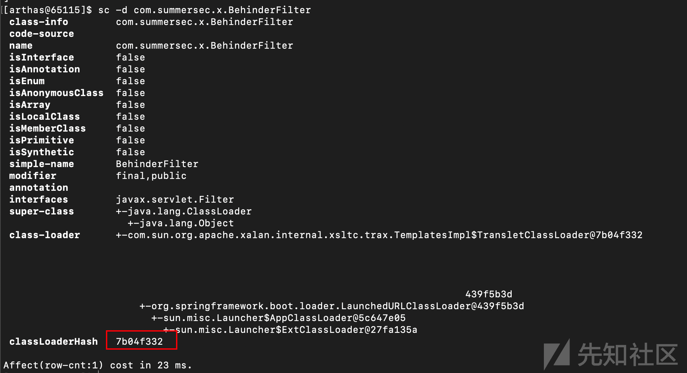

```
vmtool --action getInstances -c 7b04f332 --className com.summersec.x.BehinderFilter
```

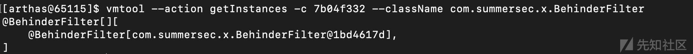

注意，这里返回的是一个数组，需要给他指定到第一个对象

```
vmtool --action getInstances -c 7b04f332 --className com.summersec.x.BehinderFilter --express 'instances[0]'
```

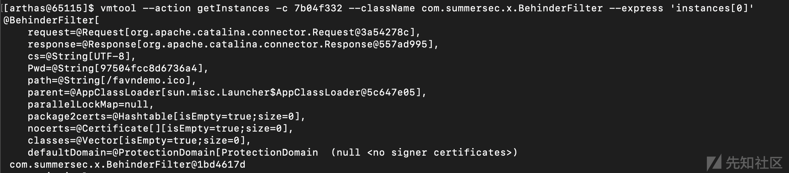

能看到这个时候`path`就已经对上了

现在已经会基础使用了，可以进行内存马的查杀了

> 下面五种基础内存马，都是基于该文章中实现的<https://xz.aliyun.com/news/18301>
>
> 复现代码<https://github.com/y1shiny1shin/servletDemo，tomcat> 8.5.31，jdk 8.202

### Serlvet 内存马

基础`Servlet`马的逻辑，是新建一个`Wrapper`之后，将`恶意Servlet`用`Wrapper`包装，再写入到StandardContext

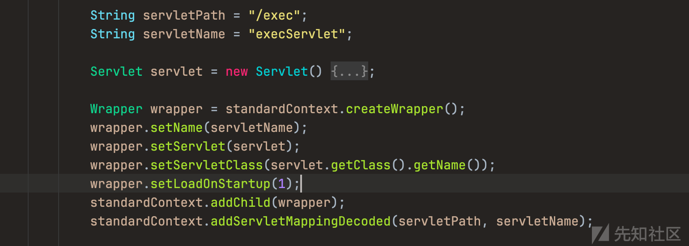

首先直接删掉Servlet对象肯定是不可取的，如果是报错处理不太行的系统，直接删对象可能服务直接就崩了；

那么我们进入`StandardContext`中，分析一下`addChild`和`addServletMappingDecoded`是怎么个逻辑；

去掉一些报错处理的代码之后的核心代码如下

```
// addChild核心代码
boolean isJspServlet = "jsp".equals(child.getName());

// Allow webapp to override JspServlet inherited from global web.xml.
if (isJspServlet) {
    oldJspServlet = (Wrapper) findChild("jsp");
    if (oldJspServlet != null) {
        removeChild(oldJspServlet);
    }
}

super.addChild(child);

if (isJspServlet && oldJspServlet != null) {
    /*
     * The webapp-specific JspServlet inherits all the mappings
     * specified in the global web.xml, and may add additional ones.
     */
    String[] jspMappings = oldJspServlet.findMappings();
    for (int i=0; jspMappings!=null && i<jspMappings.length; i++) {
        addServletMappingDecoded(jspMappings[i], child.getName());
    }
}
```

```
//addServletMappingDecoded
String adjustedPattern = adjustURLPattern(pattern);

synchronized (servletMappingsLock) {
    String name2 = servletMappings.get(adjustedPattern);
    if (name2 != null) {
        // Don't allow more than one servlet on the same pattern
        Wrapper wrapper = (Wrapper) findChild(name2);
        wrapper.removeMapping(adjustedPattern);
    }
    servletMappings.put(adjustedPattern, name);
}
Wrapper wrapper = (Wrapper) findChild(name);
wrapper.addMapping(adjustedPattern);

fireContainerEvent("addServletMapping", adjustedPattern);
```

那么很明显的，`addServletMappingDecoded`中的`servletMapping`将`servletPath`和`servletName`进行了绑定；

那么运行环境之后，访问<http://127.0.0.1:8082/servletDemo_war_exploded/injectServlet，执行命令成功之后>

使用Arthas连接到进程中，获取到`StandardContext`先

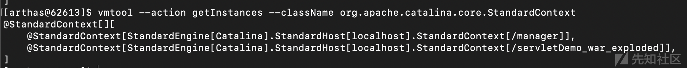

那么选择到第二个

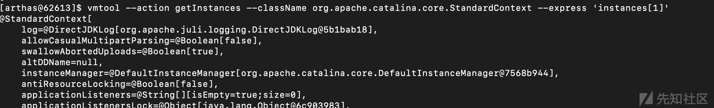

这样就可以获取到该类了，那么现在需要获取到类中的`servletMapping`

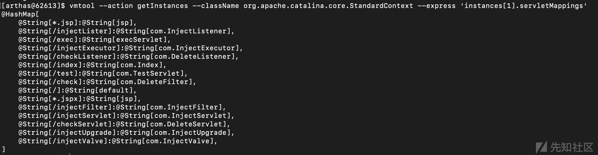

其实一眼就能看出来exec这个路由是恶意的，值得注意的是，这里的`servletMappings`是hashmap，那么可以直接尝试`remove`掉这个路由

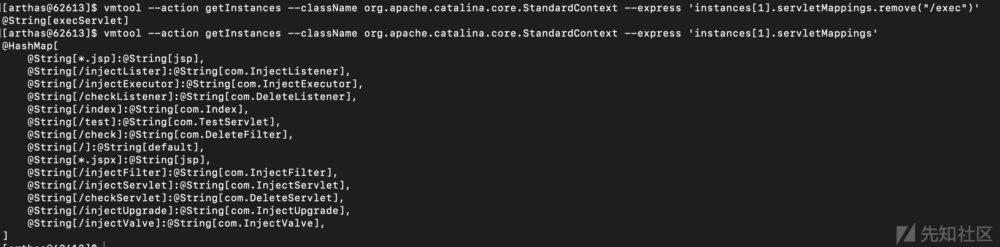

移除成功，再执行一下命令，发现仍然可以执行

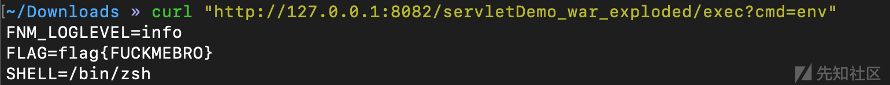

那么说明直接删路由并不能直接导致木马失效，那么再找一下代码

非常的幸运，找到了

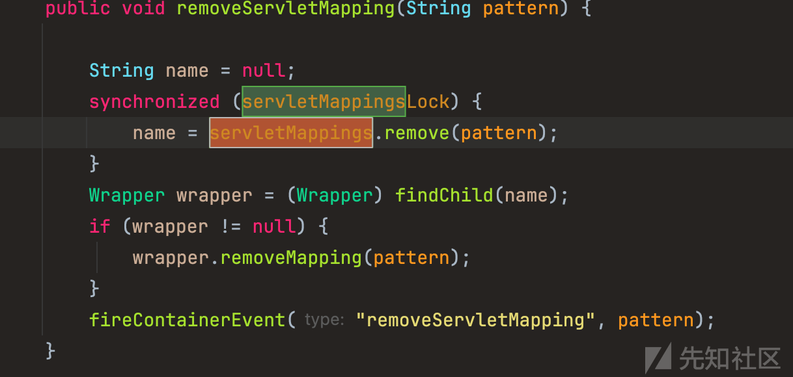

那么既然这里封装好了移除servlet的方法，直接调用试试看

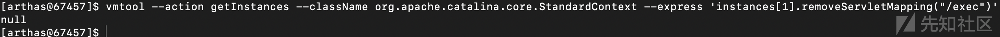

访问木马路由返回404，那么就说明删除成功了

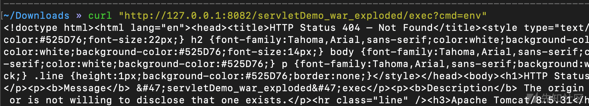

值得注意的是，这里如果你是删除了`servletMappings`中的`/exec`之后，再执行`removeServletMapping`的话，那么代码将不会执行`wrapper.removeMapping(pattern);`

因为`HashMap`中的`remove`方法，会返回`key`对应的`value`值

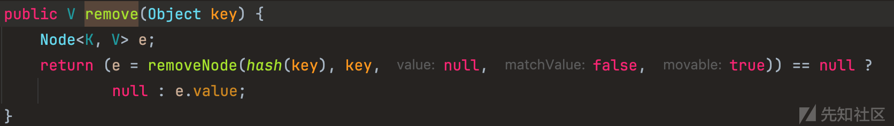

那么如果`remove`之后，在`remove`的话，就会返回`null`

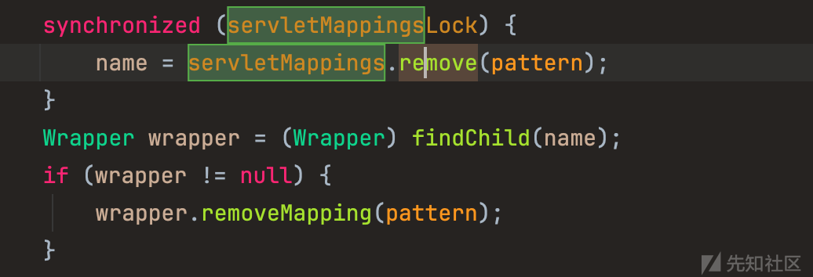

`name=null`，那么`wrapper=null`，if语句就不会执行

那如果说，手贱不小心remove了呢，还有补救方法吗？

补救方法就是再手动执行一遍`removeMapping`方法就可以了

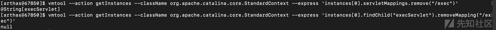

也是可以成功移除的

### Listener 内存马

这类内存马偏简单，新建一个继承了`javax.servlet.ServletRequestListener`的恶意`Listener`，再把恶意`Listener`给添加到`StandardContext`中

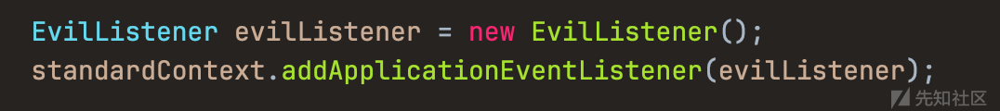

`addApplicationEventListener`方法体如下

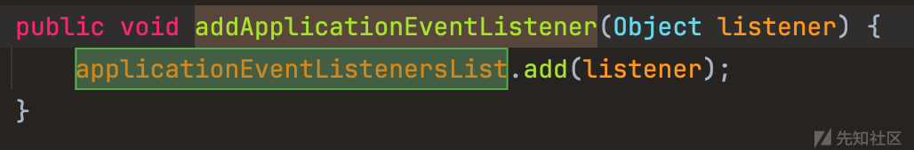

看起来只是简单的添加到`applicationEventListenersList`中

那么用Arthas从`applicationEventListenersList`中去掉指定的`listener`试试看

访问`http://127.0.0.1:8082/servletDemo_war_exploded/injectLister`可以注入恶意listener后启动Arthas，执行命令成功

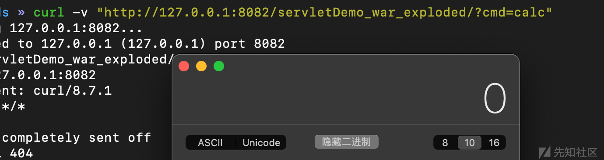

```
vmtool --action getInstances --className org.apache.catalina.core.StandardContext --express 'instances[0].applicationEventListenersList'
```

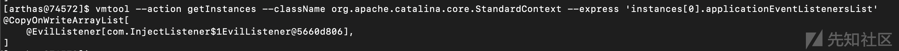

由于这是一个`List`对象，所以只能用索引来删除，

```
vmtool --action getInstances --className org.apache.catalina.core.StandardContext --express 'instances[0].applicationEventListenersList.remove(0)'
```

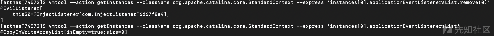

执行命令将不会弹计算器

### Filter 内存马

这个稍微麻烦一点点，但是麻烦的也只是步骤

访问`http://127.0.0.1:8082/servletDemo_war_exploded/injectFilter` 注入内存马

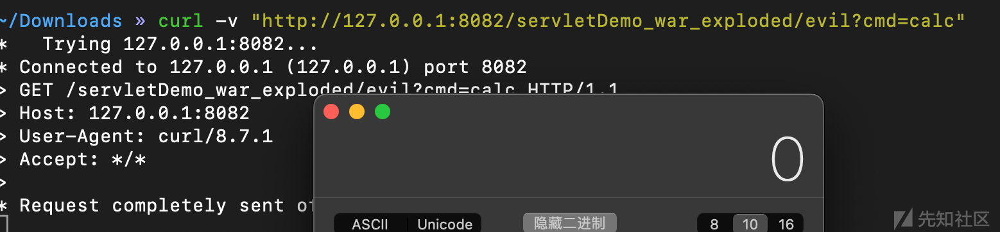

#### 查

Filter内存马是需要写入到`FilterMap`和`FilterDef`的

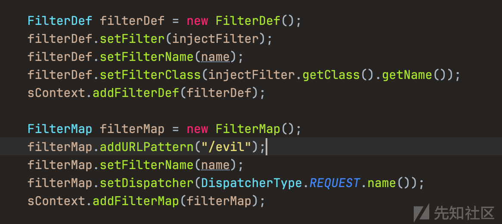

并且是在`FilterMap`处绑定了路由，那么我们查就需要获取到`FilterMap`对象，而`FilterMap`又是通过`addFilterMap`添加的，进入该方法看看

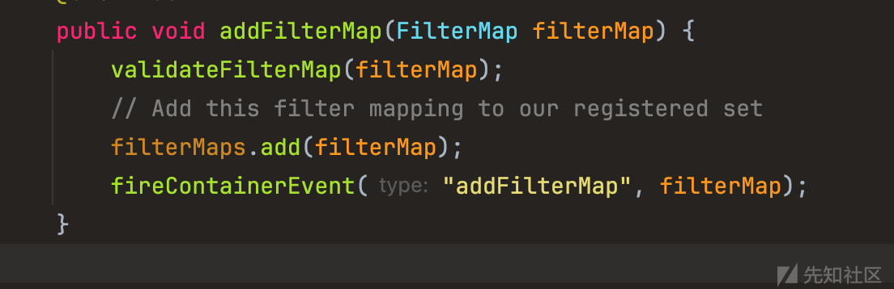

那么我们使用Arthas看看`filterMaps`这个变量

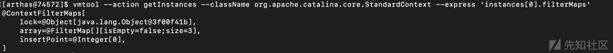

其中含有array变量，并且`isEmpty=false`，看看

```
vmtool --action getInstances --className org.apache.catalina.core.StandardContext --express 'instances[0].filterMaps.array'
```

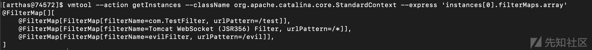

那么就已经查到了恶意路由

#### 杀

现在从上方获取到路由了，那么是不是直接从这个array删除就可以了？

刚好`FilterMaps`封装了一个remove

ctrl+左键 `filterMaps->ContextFilterMaps->remove`

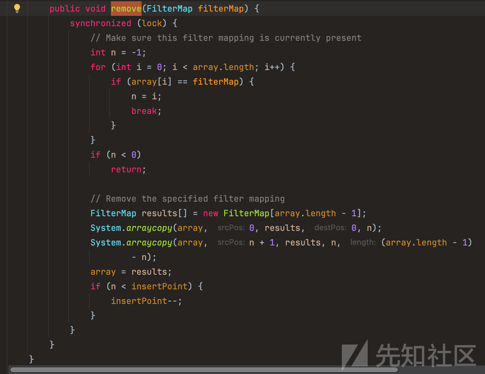

但是这里的参数是`FilterMap`，所以需要获取到恶意的`FilterMap`，刚好上一步的返回值为`FilterMap`对象

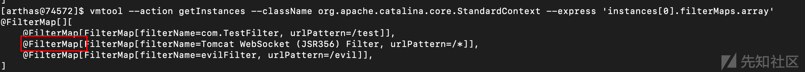

那么使用一个变量储存起来

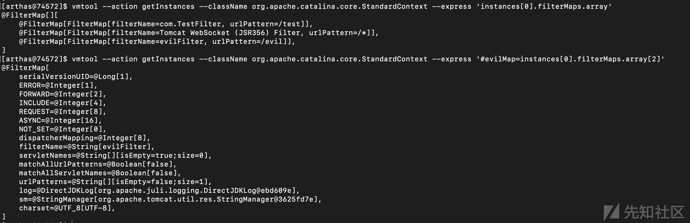

获取到恶意的`FilterMap`之后，调用`org.apache.catalina.core.StandardContext.ContextFilterMaps#remove`

或者是往上一层

`org.apache.catalina.core.StandardContext#removeFilterMap`

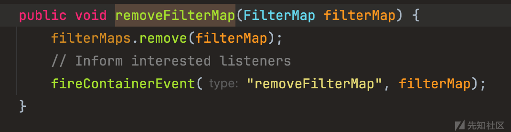

那么既然`StandardContext`都已经封装好了，那么就用封装好的

```
vmtool --action getInstances --className org.apache.catalina.core.StandardContext --express '#evilMap=instances[0].filterMaps.array[2],#standardContext=instances[0],#standardContext.removeFilterMap(#evilMap)'
```

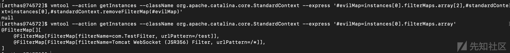

删除成功，那么现在访问恶意路由看看

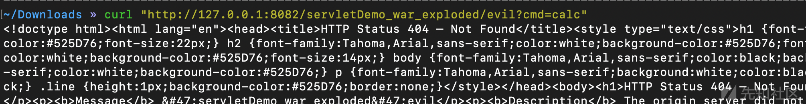

直接404，说明杀马成功

### Valve 内存马

这个注入很简单，将`恶意Valve`对象添加进`StandardPipeline`就可以了

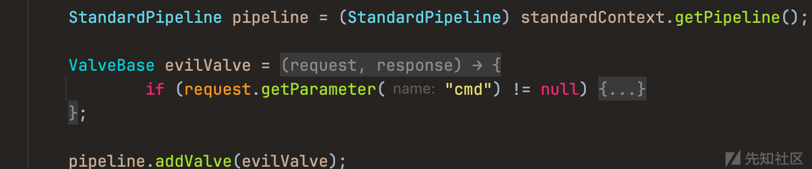

访问`http://127.0.0.1:8082/servletDemo_war_exploded/injectValve`注入内存马

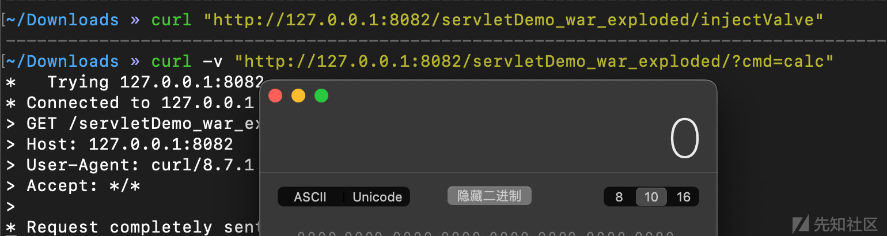

进入`StandardPipeline`之后，看有什么方法

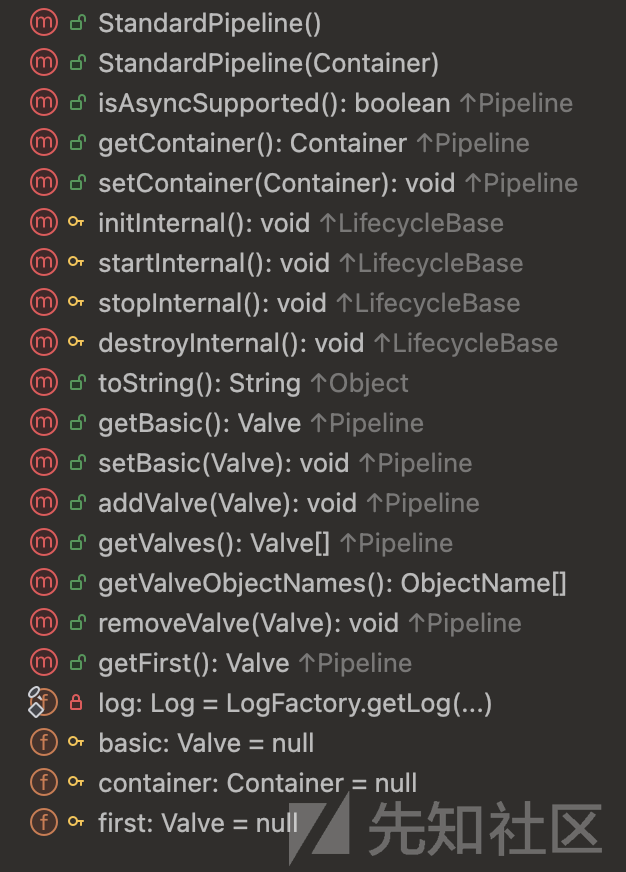

存在一个`getValves`，那么调用看看

```
vmtool --action getInstances --className org.apache.catalina.core.StandardContext --express 'instances[0].getPipeline'

vmtool --action getInstances --className org.apache.catalina.core.StandardContext --express 'instances[0].getPipeline.getValves'
```

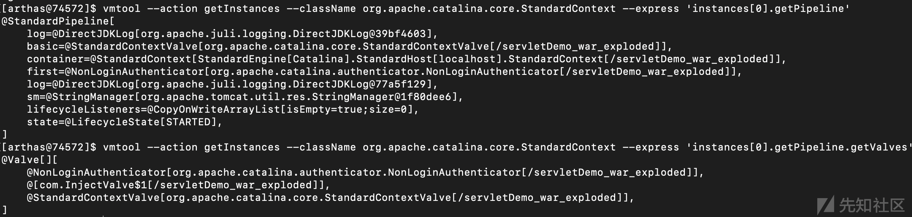

刚好也封装有`removeValve`方法，那么直接调用该方法

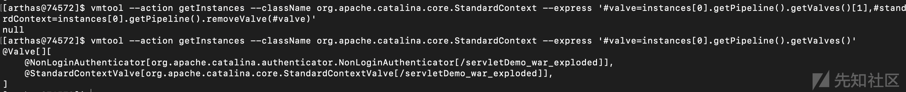

删除成功，并且马子不能执行命令，杀马成功

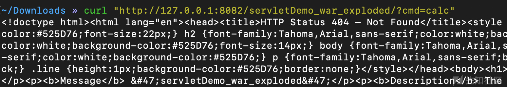

### Upgrade 内存马

访问`http://127.0.0.1:8082/servletDemo_war_exploded/injectUpgrade`生成内存马

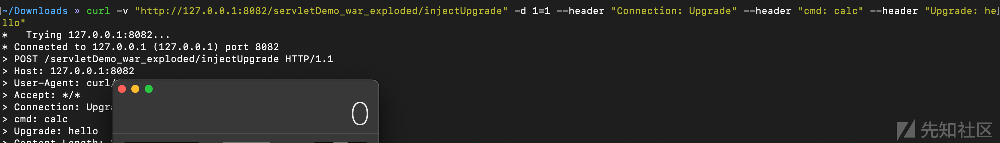

这个和上面那个`Valve`内存马差不多，本质都是新建一个恶意Upgrade对象，再添加

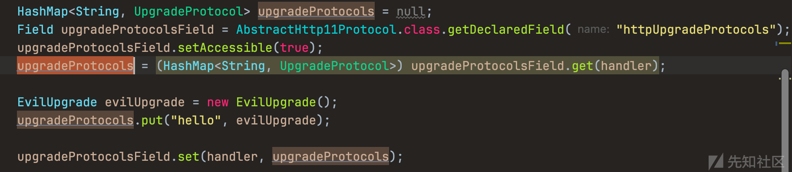

这里是需要获取到`org.apache.coyote.http11.AbstractHttp11Protocol#httpUpgradeProtocols`

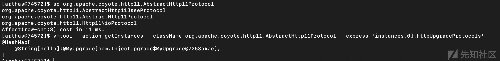

可以看到这个变量是一个`hashmap`，那么直接尝试remove掉

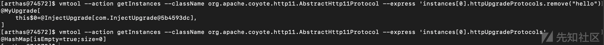

但是仍然可以访问？

因为`Upgrade内存马`需要触发点，可能是恶意的Servlet，可能是一个jsp文件，也可能是一个Filter，所以如果要彻底杀死`Upgrade内存马`，就需要找到这个触发点然后处理掉；

直接移除httpUpgradeProtocols中的恶意键对值，治标不治本

### Executor 内存马

执行命令`curl -v "http://127.0.0.1:8082/servletDemo_war_exploded/injectExecutor" --header "hacku: calc"`

然后访问任意接口，执行命令成功

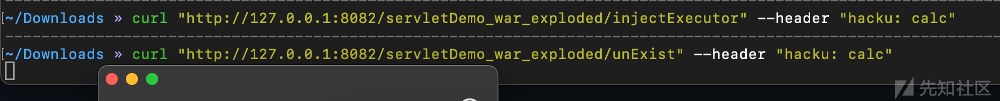

这个木马处理起来是相对比较麻烦的

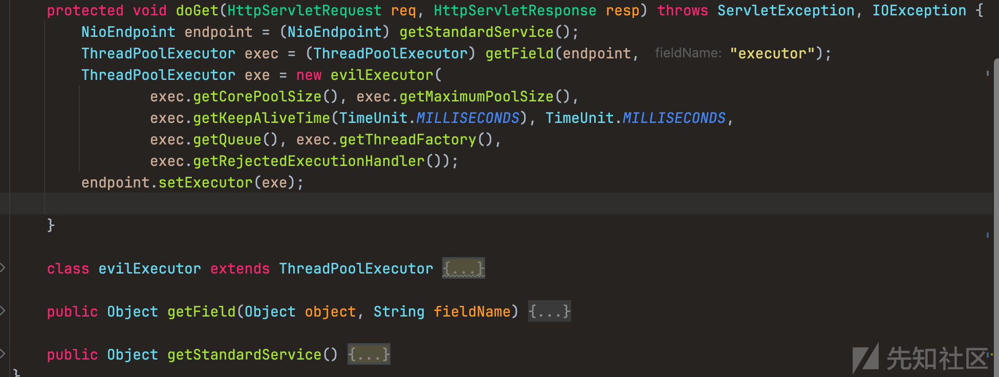

因为这个木马的原理就是，用`恶意的executor`来替换掉原本的，如果你直接删除掉恶意的`executor`，就会导致服务死掉

所以，如果需要处理掉这个`恶意的executor`，就需要新建一个新的`executor`来替换掉原来的恶意`executor`

如果是Java代码，就很好写

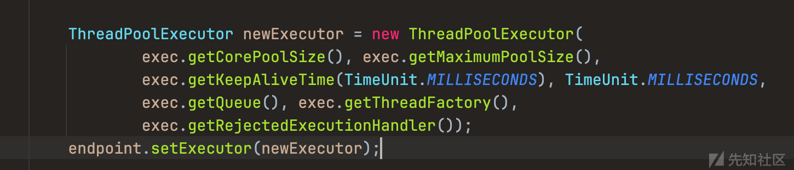

但是没有平台让你直接执行Java代码，所以你需要将这串代码转为ognl表达式的格式

而ognl表达式并没有new关键词，所以只能通过`newInstance`来新建对象，这就让步骤很繁杂

那么第一步还是获取到`executor`对象

```
vmtool --action getInstances --className org.apache.tomcat.util.net.NioEndpoint --express 'instances[1].executor'
```

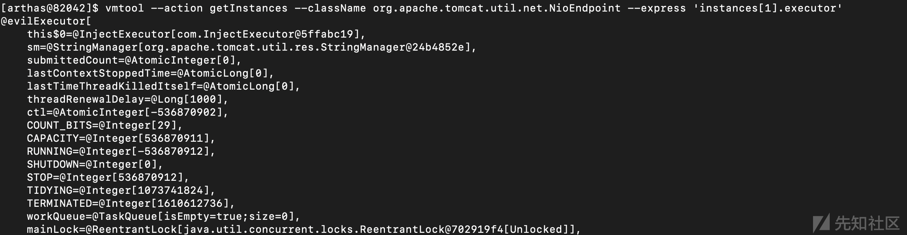

看第一条，还是比较明显的被修改过的

第二步就是新建一个`executor`对象，其中就需要获取到`Constructor`，再`newInstance`新建一个对象

```
vmtool --action getInstances --className org.apache.tomcat.util.net.NioEndpoint --express '
#nio=instances[1],
#exe=instances[1].executor,
#constructor=@java.util.concurrent.ThreadPoolExecutor@class.getConstructor(@int@class,@int@class,@long@class,@java.util.concurrent.TimeUnit@class,@java.util.concurrent.BlockingQueue@class,@java.util.concurrent.ThreadFactory@class,@java.util.concurrent.RejectedExecutionHandler@class),
#newexe=#constructor.newInstance(#exe.getCorePoolSize(),#exe.getMaximumPoolSize(),#exe.getKeepAliveTime(@java.util.concurrent.TimeUnit@MILLISECONDS),@java.util.concurrent.TimeUnit@MILLISECONDS,#exe.getQueue(),#exe.getThreadFactory(),#exe.getRejectedExecutionHandler()),
'
```

第三步就是替换掉`恶意的Executor`

这里直接给出完整命令

```
vmtool --action getInstances --className org.apache.tomcat.util.net.NioEndpoint --express '
#nio=instances[1],
#exe=instances[1].executor,
#constructor=@java.util.concurrent.ThreadPoolExecutor@class.getConstructor(@int@class,@int@class,@long@class,@java.util.concurrent.TimeUnit@class,@java.util.concurrent.BlockingQueue@class,@java.util.concurrent.ThreadFactory@class,@java.util.concurrent.RejectedExecutionHandler@class),
#newexe=#constructor.newInstance(#exe.getCorePoolSize(),#exe.getMaximumPoolSize(),#exe.getKeepAliveTime(@java.util.concurrent.TimeUnit@MILLISECONDS),@java.util.concurrent.TimeUnit@MILLISECONDS,#exe.getQueue(),#exe.getThreadFactory(),#exe.getRejectedExecutionHandler()),
#nio.setExecutor(#newexe)
'
```

注意执行的时候需要删除换行那些，这里换行方便理解

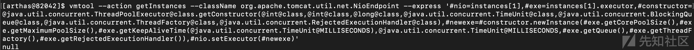

再访问，返回404，说明木马已经被杀

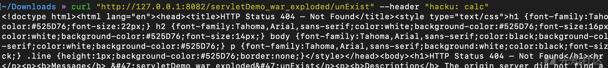

### 一些问题

这个问题是我在钻研的时候，有其他的思路，但是没实现的

能不能直接删除内存中的恶意class达到杀马的目的？

我尝试过删除class，但是由于恶意class本身和其他类的关联性，直接删没删成功；

我尝试过给恶意class清空，再重新编译又挂进内存，还是失败，并且不知道怎么解决了；

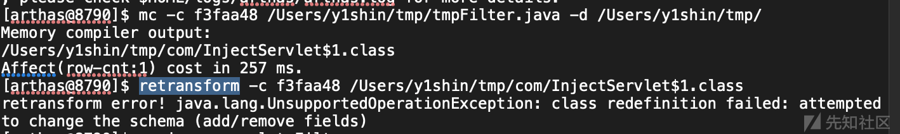

### 结语

如同这篇文章一样，只是给师傅们提供一个新的思路，本人才疏学浅，有错误还请指出；

PS. Arthas真的是一个很好的工具，大家都可以去关注一下
