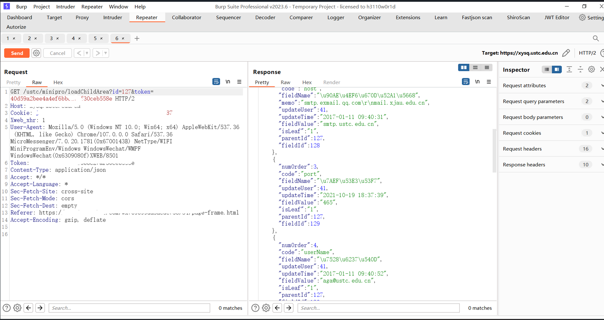
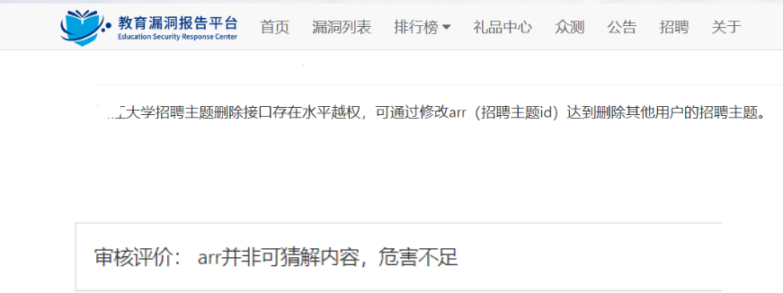
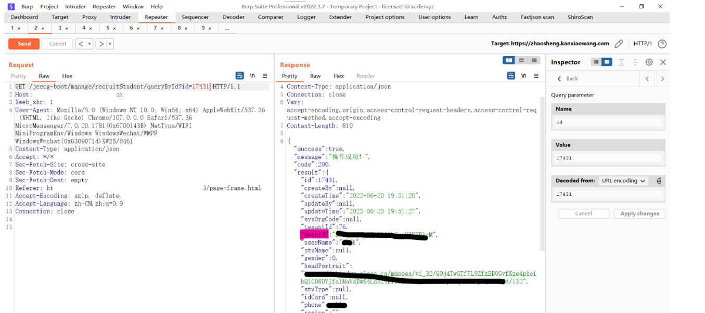
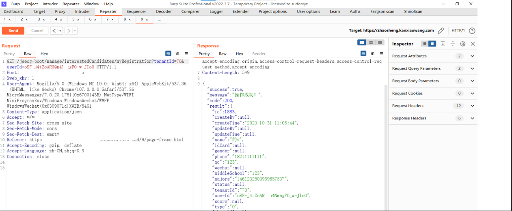
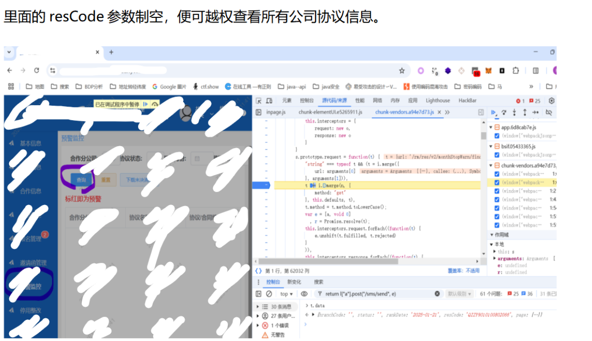
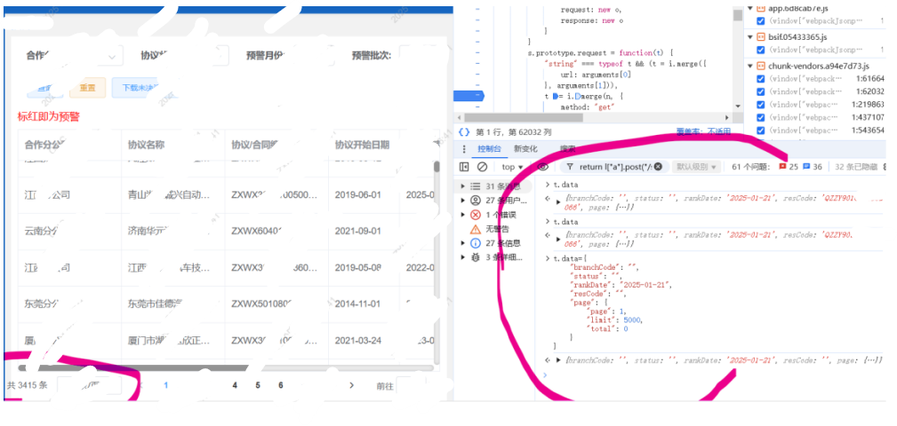
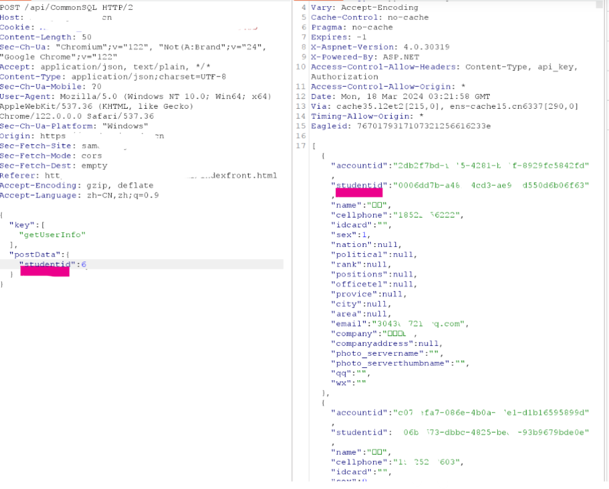
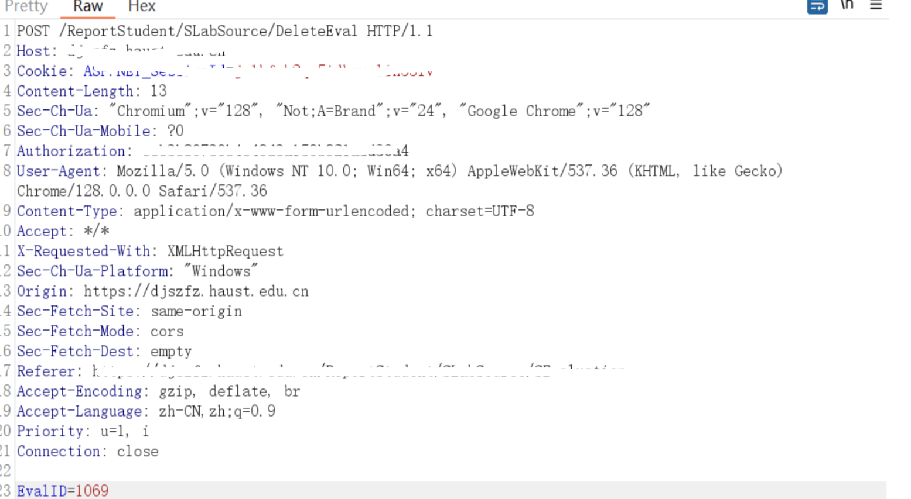

# src/众测中的一些越权方式-先知社区

> **来源**: https://xz.aliyun.com/news/18457  
> **文章ID**: 18457

---

**1.参数可遍历**  
最常见的越权出现在参数为数字的地方

案例：  
xx科学院大学某接口越权

```
GET /keyuanhui/alumnus/8979 HTTP/1.1

GET /keyuanhui/alumnus/8979/career HTTP/1.1

GET /keyuanhui/user/campus?userId=8979&timestamp=1700983242380 HTTP/1.1
```



**2.参数不可遍历**

遇见参数不可遍历的地方一般是注册2个账号然后替换参数尝试越权，但是这样在一些src中会以危害不足被打回。



这种时候，我们需要扩大危害，看看在那些地方有泄露arr的值：  
1.js全局搜索arr。  
2.可以去bp使用hex之类的插件正则匹配arr。

3.bp搜索arr。

4.在其他接口查看是否有arr。

案例：  
xx国防工业职业技术学院

```
/jeecg-boot/manage/interestedCandidates/myRegistration?tenantId=70&userId=oSF-j4tZoARUQn4NmbgFO_w-JIo0
该接口存在越权，可通过userId获取用户的敏感信息（name,idcard，手机号等）。通过两个账号替换userId发现可越权。但是userId不可遍历。需要去寻找，那些地方会泄露userId。最后在一个查询接口找到。
/jeecg-boot/manage/recruitStudent/queryById?id=174311
该查询接口可遍历id获取用户部分信息，其中有个openid对应上面接口的userId。阔以遍历id去获取所有用户的openid。在到上面接口去获取用户的敏感信息。
```





**3.参数制空越权**

在很多情况下，如果用户传入的值为空（例如，查询条件为空），数据库查询可能会返回所有记录。这通常是因为 SQL 查询没有正确处理空值。

**默认查询所有：** 开发人员可能在代码中写入了这样的逻辑：如果传入的 `id` 参数为空（`null`、`""`、`undefined` 等），则程序默认执行一个“查询所有记录”的操作（例如执行 `SELECT * FROM table_name`），而不是返回一个错误。

**错误处理不当：** 当后端尝试解析或处理一个空的 `id` 值时，可能会触发一个异常。如果开发人员在异常处理代码中没有正确地返回错误信息，而是选择返回所有数据（可能作为“兜底”或“默认”行为），就会导致这个问题。

类似的我们也可以传入，%，\*。让查询语句，返回所有数据。当传入%时如果返回所有数据，此处大多数情况还存在sql注入。在使用like语句的时候大多数情况下没有使用预编译处理。因为like、order by直接使用#{}预编译会进行sql报错，所以开发人员在使用${}不当后会造成like注入和oder by注入。

案例：

xxx公司制空越权





**4.参数类型越权**

类似上面的制空越权，本来的查询逻辑你传入字符串admin，然后它查询。

可能的处理逻辑：

1.当你传入数字类型参数时它内部没有正确的处理逻辑，默认就全表查询（可能的处理逻辑）。

2.当你传入数字类型参数时，类型转化出现问题

```

SELECT \* FROM users WHERE name = 'admin'

```

案例：

此处studentid一开始是字符串类型，如响应里的studentid，尝试制空和%，\*后无果。尝试传入1，2，3.等数字发现只要是数字类型的。都会返回所有数据



**5.无身份参数的查询功能**  
在一些查询功能处一般没有关于身份的参数，但是响应里有类似id之类的。可以尝试将id参数加到请求参数中，然后修改为其他用户的id看看是否返回其他用户的信息。比如你的id为123，你可以添加id为124的参数在请求里。

```
user/info
user/info?id=123
```

```
POST /api/users/current/profile/email HTTP/2

Host: api.example.com
Authorization: Bearer eyJ... 
Content-Type: application/json


{
}

#响应:
HTTP/2 200 OK
Server: nginx/1.19.0
Date: Fri, 16 Feb 2024 13:37:00 GMT
Content-Type: application/json

{
  "Id": 1234,
  "email": "user@example.com"
}
```

**6.修改接口的越权**  
1.在接口查询自己信息时，开发者经常会用current和me,my这种关键字,可以尝试利用用户id(数字)来替代current他们。  
正常请求：

```
POST /api/users/current/profile/email HTTP/2

Host: api.example.com
Authorization: Bearer eyJ... 
Content-Type: application/json


{
  "email": "user@example.com"
}

#响应:
HTTP/2 200 OK
Server: nginx/1.19.0
Date: Fri, 16 Feb 2024 13:37:00 GMT
Content-Type: application/json

{
  "Id": 1234,
  "email": "user@example.com"
}
```

修改current为1234后的请求：（如果修改后请求成功，说明可以将current替换为id，这时候就可以修改id为其他用户的值越权）

```
PUT /api/users/1235/profile/email HTTP/2

Host: api.example.com
Authorization: Bearer eyJ... 
Content-Type: application/json


{
  "email": "changed@example.com"
}


#响应:
HTTP/2 200 OK
Server: nginx/1.19.0
Date: Fri, 16 Feb 2024 13:37:00 GMT
Content-Type: application/json

{
  "Id": 1235,
  "email": "changed@example.com"
}

```

2.老接口越权

```
/v3/user/123
/v2/user/123
```

3.如果发现查询功能，添加功能不能越权（增删改查不全的情况）可以猜测接口名称去访问增删改查的其他接口看是否越权。

案例：

功能界面只有一个addeval接口，添加评论。该接口无越权，猜测删除接口后成功越权。


