# 还原漏洞调用链：CVE-2025-24813 Tomcat 反序列化漏洞源码深度解析（下篇）-先知社区

> **来源**: https://xz.aliyun.com/news/18458  
> **文章ID**: 18458

---

## 漏洞描述

该漏洞的核心在于 Tomcat 在处理不完整PUT请求上传时，会使用了一个基于用户提供的文件名和路径生成的临时文件。

若同时满足以下条件，攻击者可执行任意代码：

默认 Servlet 启用了写权限（默认禁用）  
启用了部分PUT请求支持（默认启用）  
应用程序使用 Tomcat 的基于文件的会话持久化（默认存储位置）  
应用程序包含可被利用于反序列化攻击的库

## 受影响版本

Apache Tomcat 11.0.0-M1 至 11.0.2  
Apache Tomcat 10.1.0-M1 至 10.1.34  
Apache Tomcat 9.0.0-M1 至 9.0.98

## 漏洞分析

## 第一部分：上传恶意代码保存成文件

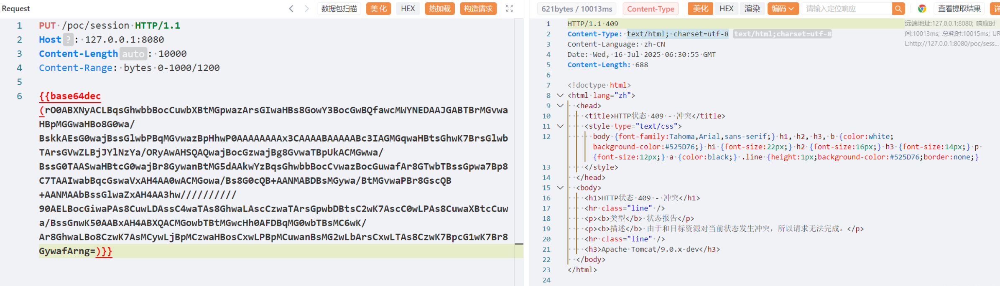  
poc生成请参考上篇文章  
在`org.apache.catalina.servlets.DefaultServlet#doPut`处打断点  
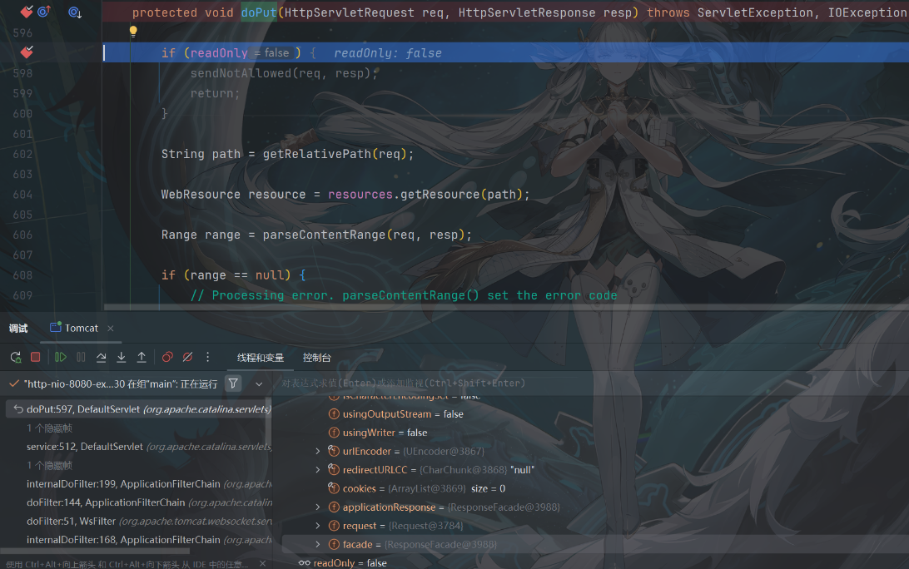  
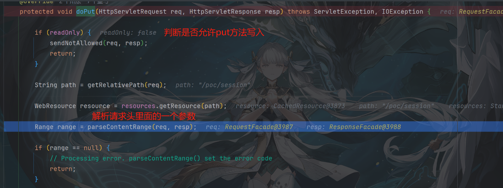  
跟进`parseContentRange`，看看怎么获取的Content-Range是否有限制  
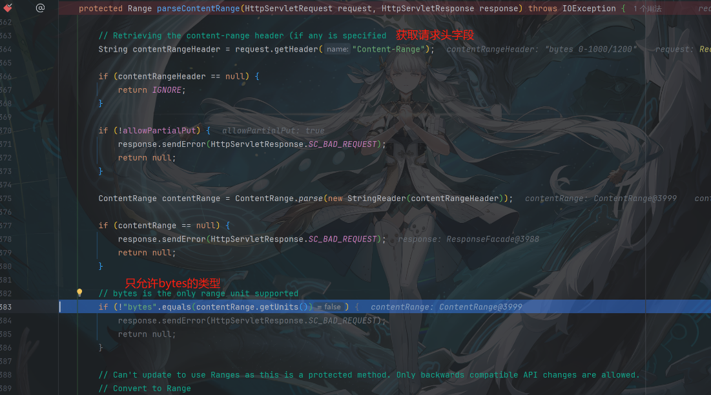  
发现只能使用bytes类型，其他不支持  
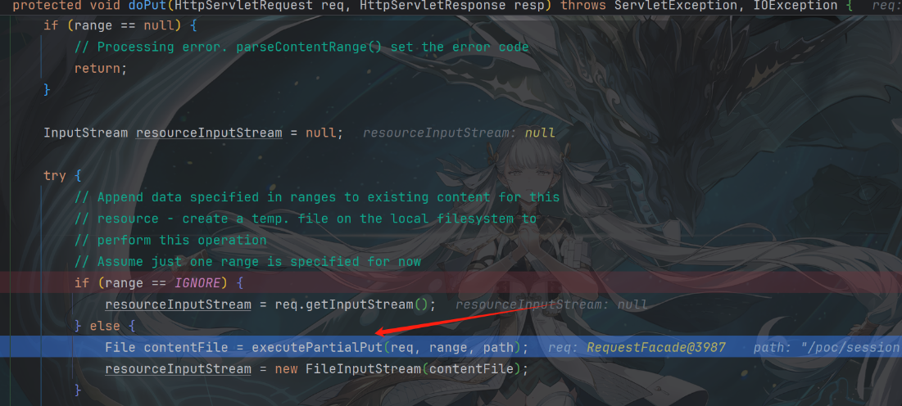  
第一部分重点跟进这个方法：`executePartialPut`  
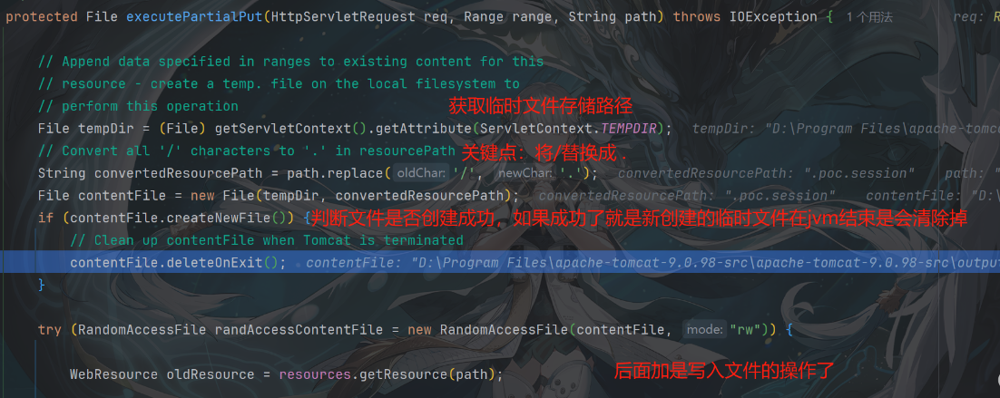  
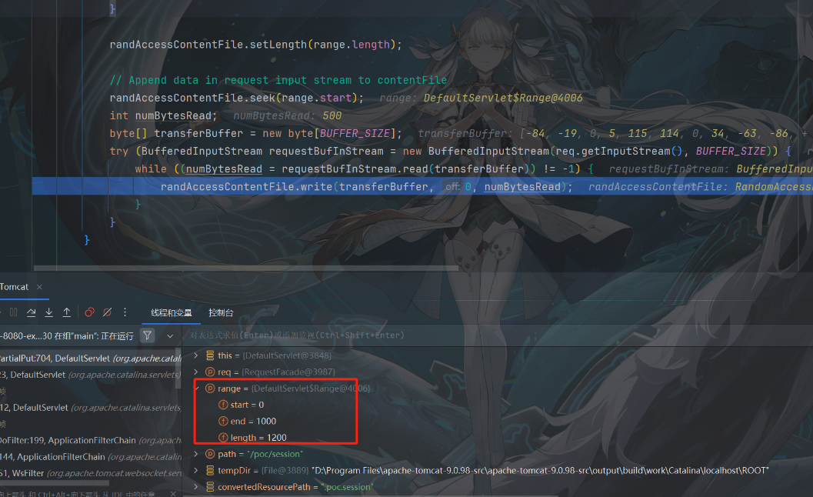  
这里会根据最开始请求包传入的`Content-Range: bytes 0-1000/1200`，设置写入位置和写入字节总量，所以设置的值要比请求体中实际恶意代码的byte大，不然会造成恶意代码保存不完整

跳出该方法时文件已经成功写到磁盘，后面流程就暂时先不关注

## 第二部分：从文件中反序列化恶意代码

在`org.apache.catalina.connector.Request#getSessionInternal(boolean)`处下断点  
为什么在这里下断点，因为通过对最终反序列化的`org.apache.catalina.session.FileStore#load`的调用栈发现，这里是比较容易解释和理解的  
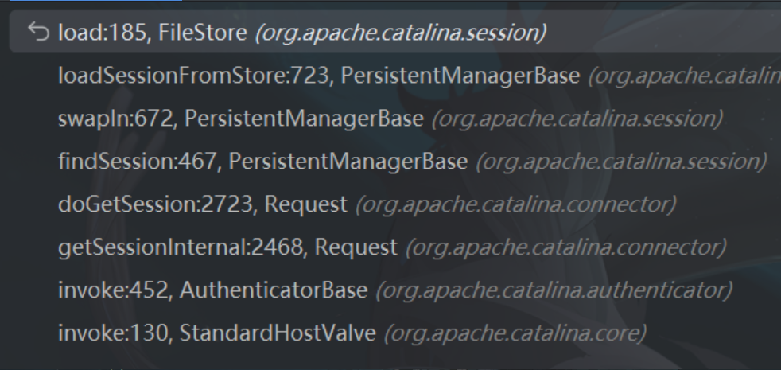

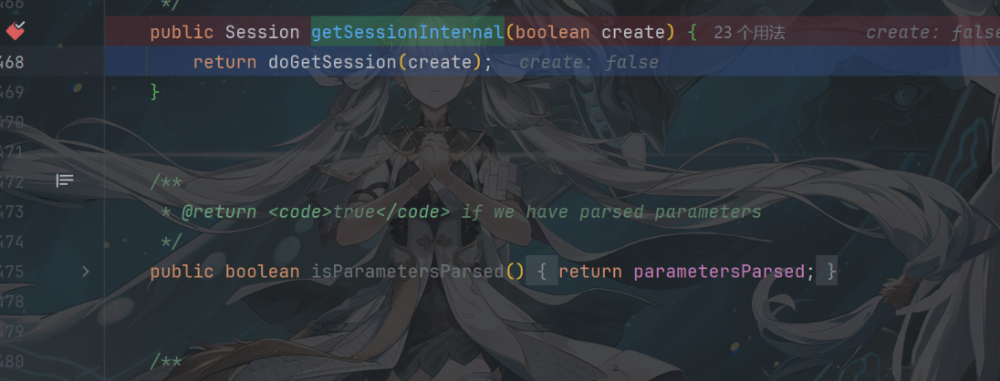  
因为传入的请求头中带有`Cookie: JSESSIONID=.poc`，不会再去创建新的session，会去寻找已经有session  
跟进下面方法

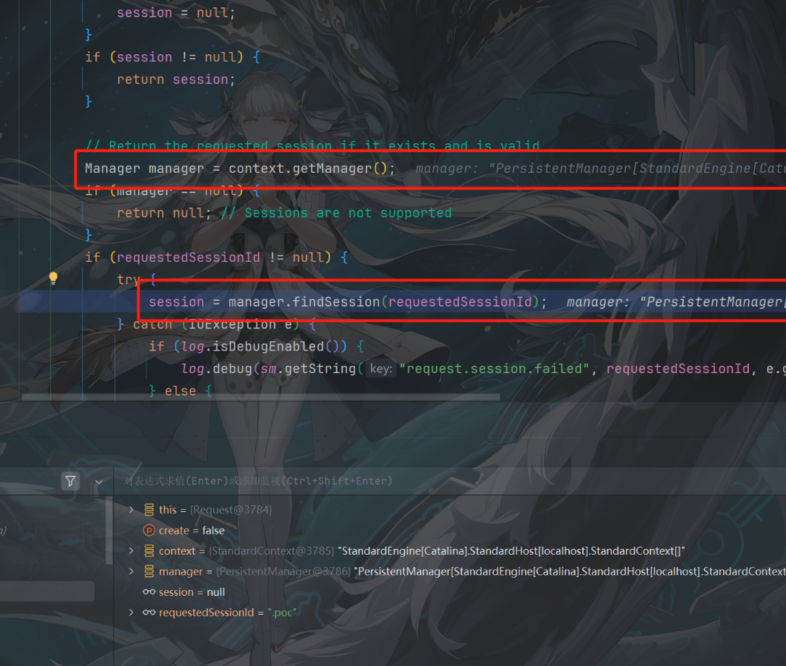  
其中PersistentManager 是 Tomcat 中用于 持久化 session（跨重启） 的 Manager 实现，它在 Tomcat 启动时会尝试从磁盘或其他持久化存储中加载 session。  
跟进`findSession`方法，`session`一直为null，现在跟进`swapIn`方法  
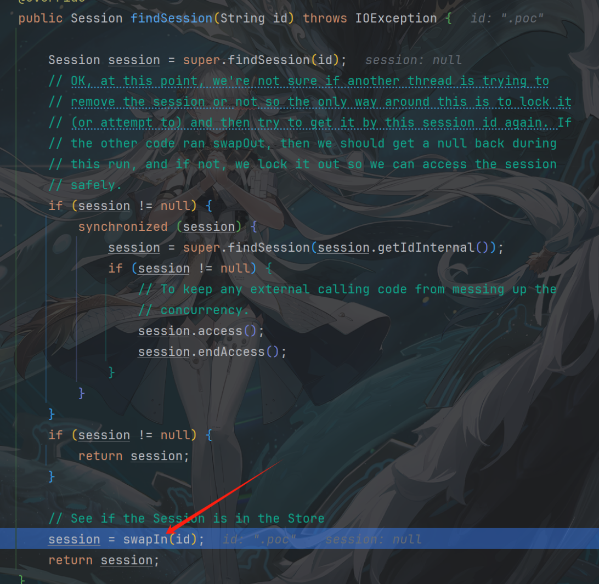

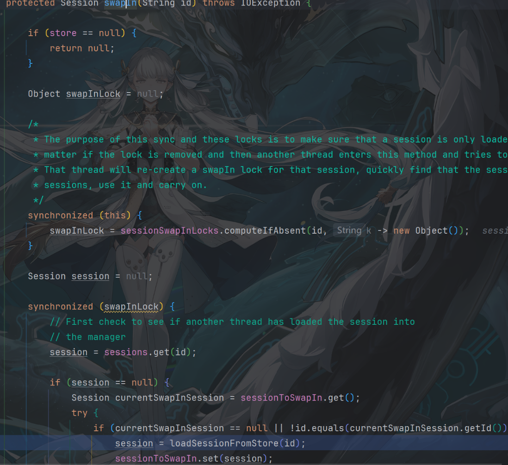

```
protected Session swapIn(String id) throws IOException {

    // 如果没有配置持久化存储（Store），则无法加载 session，直接返回 null
    if (store == null) {
        return null;
    }

    Object swapInLock = null;

    /*
     * 为每个 session ID 建立一个独立的锁对象，避免多线程同时加载同一个 session。
     * synchronized (this) 保证 sessionSwapInLocks 的并发安全。
     */
    synchronized (this) {
        // 如果当前 sessionId 没有锁对象，就新建一个 Object 作为锁
        swapInLock = sessionSwapInLocks.computeIfAbsent(id, k -> new Object());
    }

    Session session = null;

    // 进入该 sessionId 的专属锁，确保并发下只有一个线程加载这个 session
    synchronized (swapInLock) {

        // 再次检查内存中是否已经存在该 session（可能刚刚被其他线程加载）
        session = sessions.get(id);

        if (session == null) {
            // ThreadLocal：记录当前线程正在加载的 session，用于防止递归加载等问题
            Session currentSwapInSession = sessionToSwapIn.get();
            try {
                // 如果当前线程未加载，或者加载的是另一个 session，则继续加载当前 id
                if (currentSwapInSession == null || !id.equals(currentSwapInSession.getId())) {
                    // 核心加载逻辑：从 Store 中反序列化加载 session（如从文件 .session 文件中）
                    session = loadSessionFromStore(id);

                    // 设置当前线程正在加载的 session，供其他地方检测
                    sessionToSwapIn.set(session);
                }
```

跟进`loadSessionFromStore`  
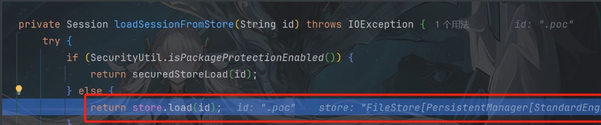  
继续跟进

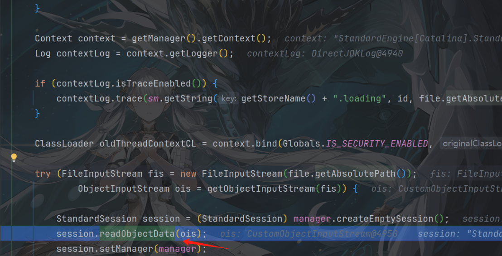

```
StandardSession.readObjectData(ObjectInputStream ois) 是 Tomcat 中用于从反序列化输入流中恢复 Session 状态的核心方法，它不像普通 Java Bean 使用 readObject() 自动反序列化，而是自己手动读取每个字段，以便保持更好的兼容性和安全性控制。
```

其实到这里就可以结束了，漏洞已经触发了  
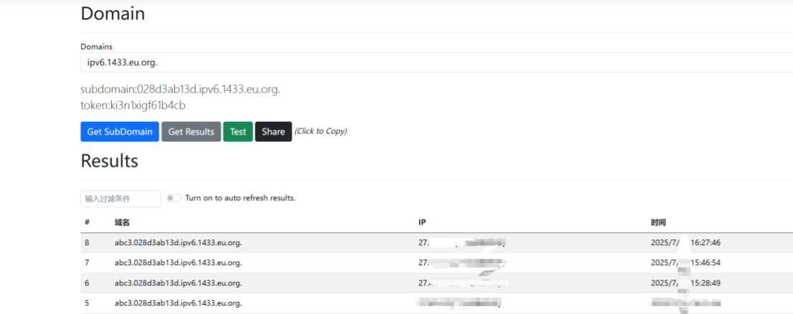  
今天时间不够了，晚点会把`StandardSession.readObjectData`底层实现和普通`readobject`看一下有什么区别

## 总结

本文从源码角度深入分析了 CVE-2025-24813 所涉及的反序列化漏洞，梳理了从 PersistentManager 到 StandardSession 的完整调用链，并定位了实际触发漏洞的反序列化入口。与市面上仅停留在 POC 运行的“复现文”不同，本文聚焦于漏洞的底层实现与运行机制，揭示了漏洞触发所需的关键条件与约束场景。希望本文能为读者提供不仅能“复现”，更能“理解”的漏洞研究视角。

​
