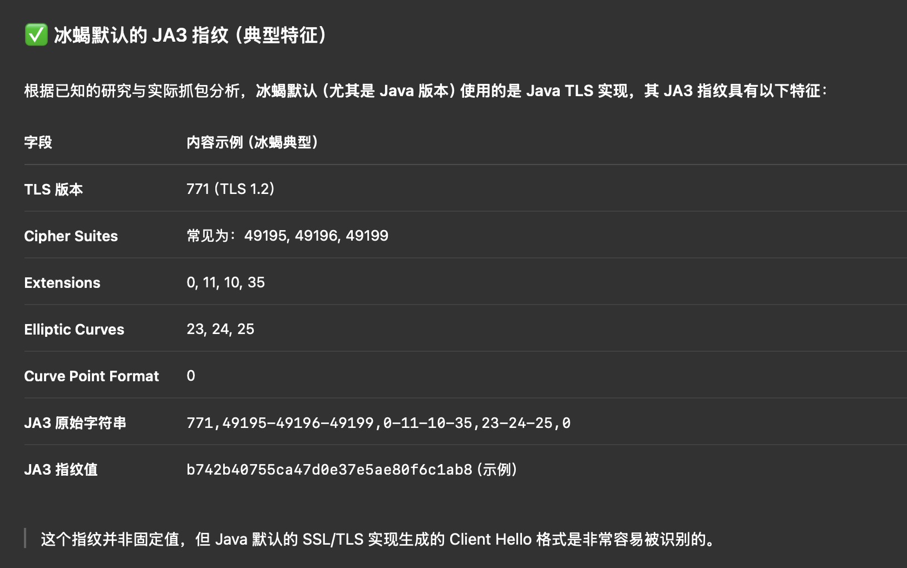
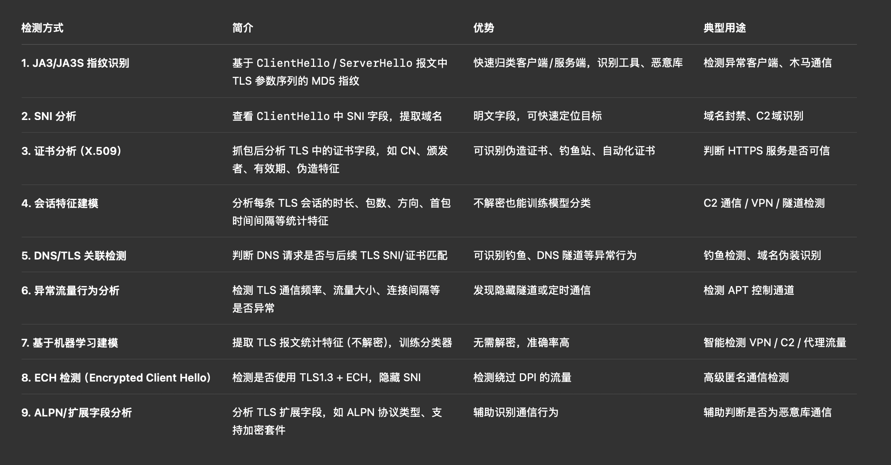
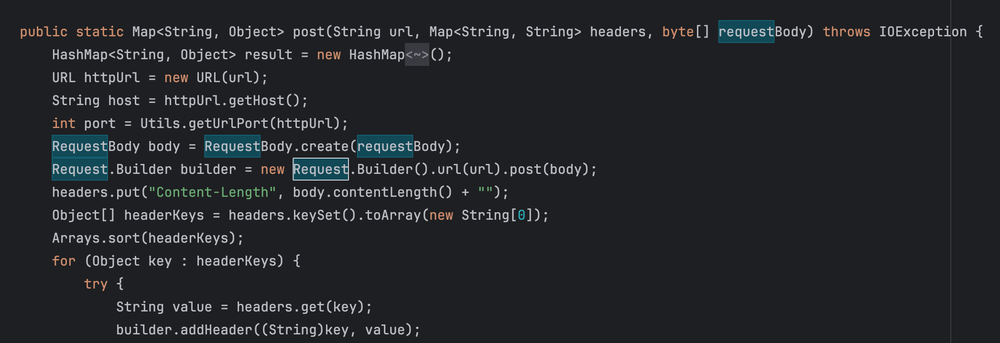
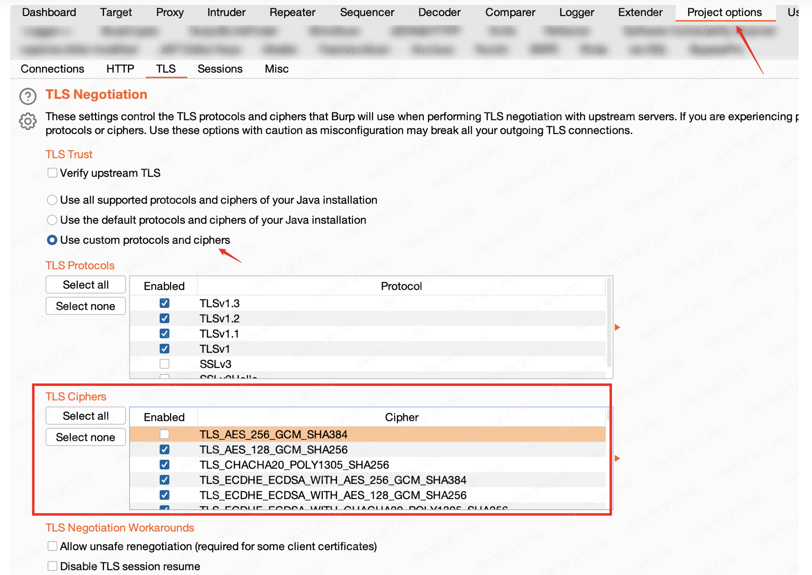

# 为什么明明是TLS，你的冰蝎流量还是被检测到了-先知社区

> **来源**: https://xz.aliyun.com/news/18472  
> **文章ID**: 18472

---

# 碎碎念

原本只是打算对冰蝎做个简单的二次开发，目的是修改其流量特征以绕过检测。实际动手之后却发现，可供修改的空间并不算大。比如：  
 • UA头：冰蝎4已支持自定义；  
 • Header：可以自定义；  
 • POST 数据发送/接收方式：可以通过自定义通信协议进行调整。

最终可操作空间主要集中在：  
 • Accept 头部；  
 • JA3 指纹；  
 • TLS 证书等方面。

于是我查阅了一些资料，意外地发现，网络上关于“冰蝎 + HTTPS 通信 + JA3指纹”的讨论几乎很少，大多数的JA3分析文章都是围绕 Cobalt Strike（CS）展开的。下面就简单梳理一下关于 TLS加密流量检测的必要性 和 绕过JA3指纹检测的一些方法。

# 一、检测TLS加密流量的必要性

1. 外到内的流量（攻击者上传 WebShell）

当前大部分主流安全设备如果想要对 外部流入内部 的 TLS 流量进行解密，通常需要配置SSL证书。但实际部署中会面临多种问题：  
 • 客户侧无法配合安装代理证书；  
 • HTTPS证书管理混乱；  
 • 不同安全产品厂家的兼容性。

这导致很难实现对所有TLS流量的解密与分析。此时，若某台服务器存在漏洞并被植入冰蝎、哥斯拉等 WebShell，我们该如何检测其通信流量呢？

2. 内到外的流量（终端中毒C2连接）

若某终端用户被钓鱼攻击成功，恶意程序尝试通过 TLS 与外部C2服务器通信，且该通信并未被代理解密，如何识别这种行为，也成为检测中的一个难点。

# 二、常见的TLS流量检测方式

## JA3 指纹检测

JA3 是一种基于客户端在 TLS 握手阶段 ClientHello 中字段特征的指纹识别方式，主要包括：  
 • TLS版本  
 • 支持的 Cipher Suites  
 • 支持的 Extensions  
 • 椭圆曲线（Elliptic Curves）  
 • EC Point Formats

```
JA3 字符串 = md5(<Version>,<Cipher Suites>,<Extensions>,<Elliptic Curves>,<EC Point Formats>)
```

以冰蝎为例  


## TLS证书特征

常用于检测 CS、Sliver 等 C2 工具。部分证书有固定特征，如：  
 • 相同的自签名信息；  
 • 不合理的有效期；  
 • 异常的公钥长度等。

## 流量元数据特征

包括：  
 • 可疑的域名（如极长的子域名、看似随机的字符串）；  
 • TLS连接频率异常；  
 • IP归属异常等。

## 机器学习与图模型检测

谷歌学术上搜索关键词如 “[Encrypted Malicious Traffic](https://scholar.google.com.sg/scholar?as_ylo=2024&q=Encrypted+Malicious+Traffic&hl=zh-CN&as_sdt=0,5&as_vis=1)” 会出现大量这类研究。常见做法是使用海量加密流量数据训练分类器（机器学习/深度学习/图神经网络），来识别恶意行为。

但目前在工业界应用较少。国内真正实现并落地这类技术的平台不多（可能是我见识少）。本文也不打算深入讨论这类绕过方式。

## 其他方式

例如：  
 • 恶意软件生成的流量中可能存在可识别的明文片段；  
 • TLS通信结构上的异常等。



如果自己从头实现通信模块，那基本能绕过大多数基于特征的检测方法（滑稽）。

# 三、绕过 JA3 指纹的思路（以冰蝎为例）

```
JA3 字符串 = md5(<Version>,<Cipher Suites>,<Extensions>,<Elliptic Curves>,<EC Point Formats>)
```

只要能修改其中任意一个字段，就可以改变最终的 JA3 哈希值。但实际操作中并不简单，因为：  
 • 冰蝎的HTTPS请求是通过 okhttp 发起的（源码位于net.rebeyond.behinder.utils）；  
 • okhttp 和 Java 中其他发起HTTPS请求的类，大多底层都使用 SSLSocketFactory 或 SSLContext；  
 • 这意味着 JA3 指纹几乎是由 JDK 决定的。



所以要实现绕过，有以下几种方案：

## 方案一：寻找第三方类

使用不依赖 SSLSocketFactory/SSLContext 实现 TLS 握手的第三方库，例如：  
 • JNI 方式调用 C/C++ 实现的 OpenSSL；  
 • 使用 native socket 实现 TLS 握手。

## 方案二：自实现 TLS 握手

更极端的方法是：  
 • 修改JNI，自行构建TLS协议栈；  
 • 从TLS ClientHello开始构建各字段，完全控制字段内容；  
 • 这样可构造出任意想要的JA3指纹。

## 方案三：中间人代理修改JA3

比如：  
 • 使用 Burp Suite 作为中间人代理；  
 • 搭配 burp 插件 **burp-awesome-tls**，可以修改 TLS 握手相关参数；  
 • 注意：记得同时修改默认CA证书内容，以免特征被识别。

某些[CS的JA3指纹绕过方式](https://www.cnblogs.com/thebeastofwar/p/17839287.html#ja3ja3sjarm-%E6%8C%87%E7%BA%B9%E4%BF%AE%E6%94%B9)也适用于冰蝎

# 四、总结

虽然冰蝎相比CS在流量指纹研究上存在“冷门”的问题，但其HTTPS流量同样具有明确的TLS特征。通过理解 JA3 的组成结构并控制TLS握手逻辑，就可以有效实现指纹混淆，从而绕过部分基于指纹的检测系统。

​

# 参考资料

• <https://www.freebuf.com/sectool/374321.html>  
 • <https://zhuanlan.zhihu.com/p/597466186>  
 • <https://cloud.tencent.com/developer/article/2280114>  
 • <https://www.cnblogs.com/thebeastofwar/p/17839287.html#ja3ja3sjarm-%E6%8C%87%E7%BA%B9%E4%BF%AE%E6%94%B9>
