# 契约锁电子签章系统 pdfverifier 远程代码执行漏洞分析（补丁包逆向分析）-先知社区

> **来源**: https://xz.aliyun.com/news/18482  
> **文章ID**: 18482

---

# 一、漏洞简介

契约锁，是一个电子签章及印章管控平台，提供的电子文件具有与纸质文件一样的法律效力。2025年7月，契约锁发布安全补丁修复了远程代码执行漏洞。该漏洞允许未授权攻击者通过特定方式在服务器上执行任意代码。

# 二、影响版本

4.3.8 <= 契约锁 <= 5.x.x && 补丁版本 < 2.1.8  
4.0.x <= 契约锁 <= 4.3.7 && 补丁版本 < 1.3.8

# 三、漏洞原理分析

根据情报，契约锁最新的补丁修复了该漏洞，那我们就可以从补丁包的逆向分析入手，看看这个漏洞的路径及原理。  
先从官网上把最新的补丁包1.3.8下载下来：

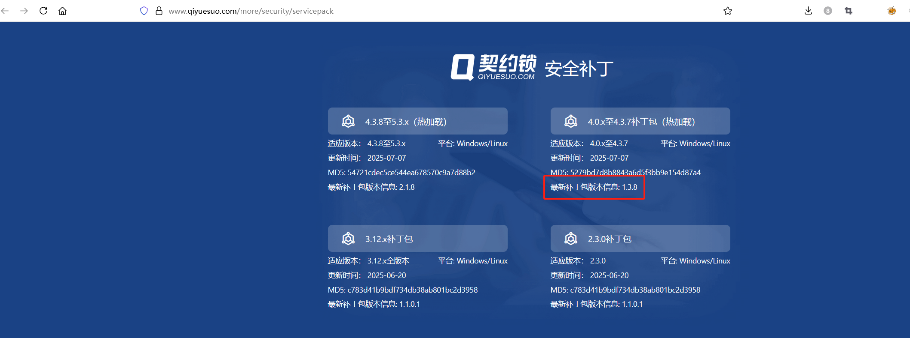补丁包中是这个样子的：

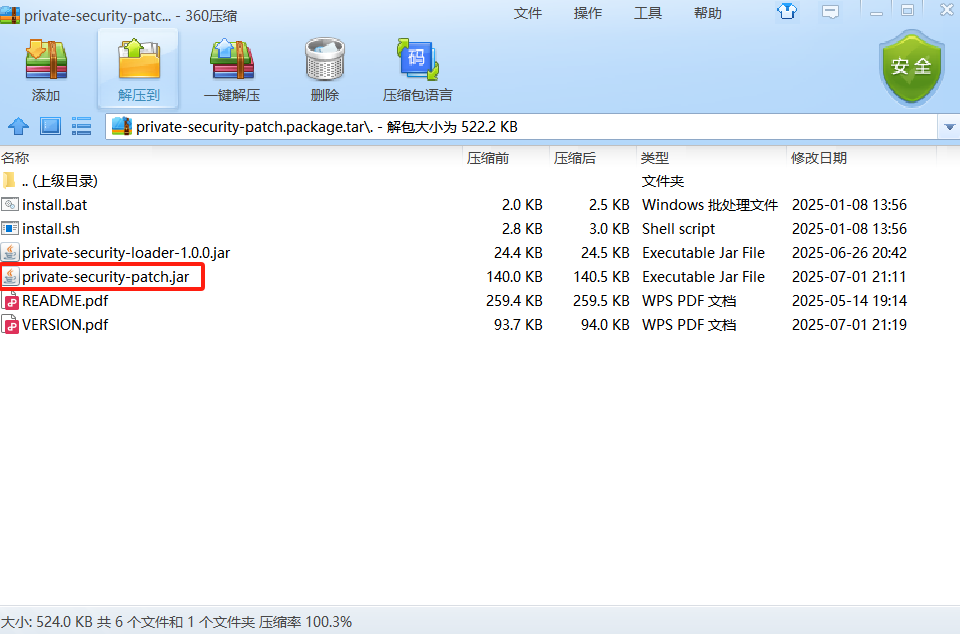其中修复的代码是在private-security-patch.jar中，我们将它反编译：

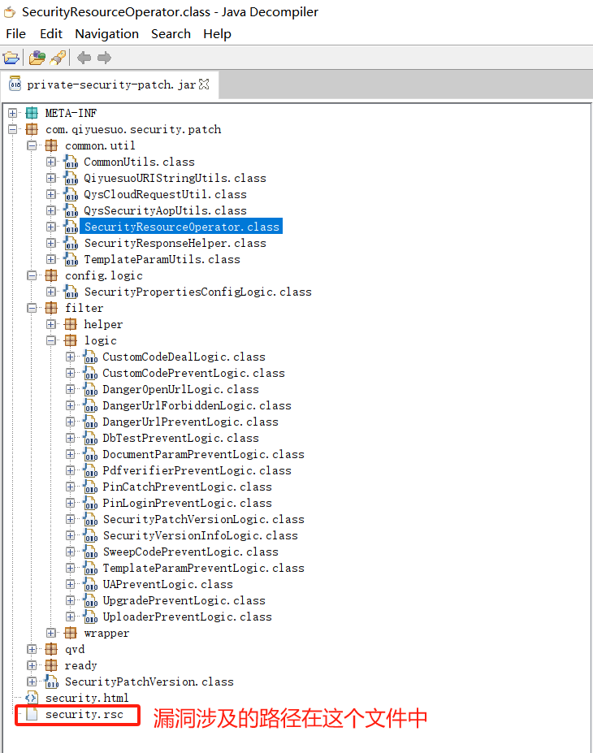其中漏洞涉及的路径就在静态文件security.rsc中，但是它被加密了：

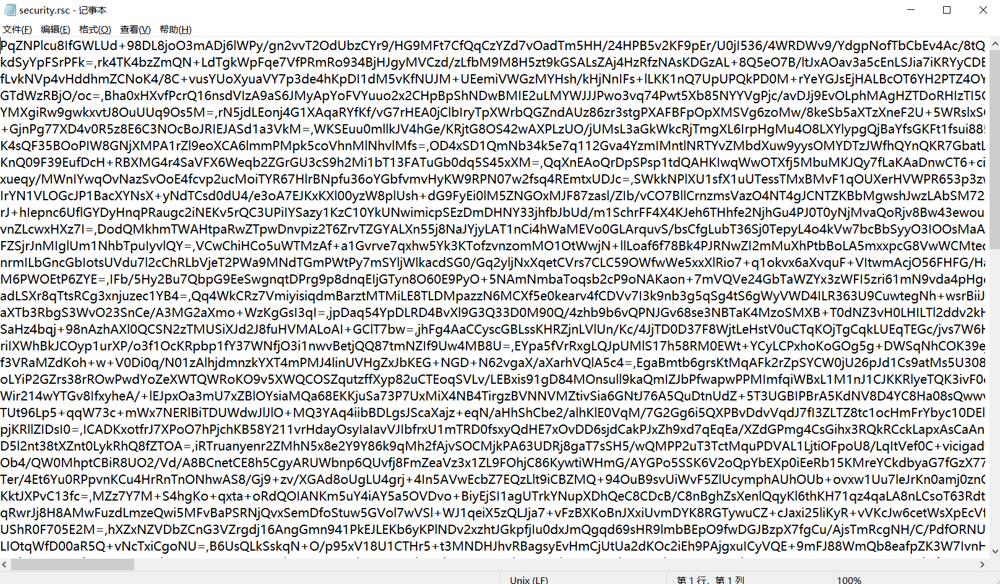考虑到文件被加载的时候肯定会解密，解密的逻辑大概率就是在补丁包的代码中，我们继续审计补丁包代码，在SecurityResourceOperator类中发现security.rsc的加载逻辑：

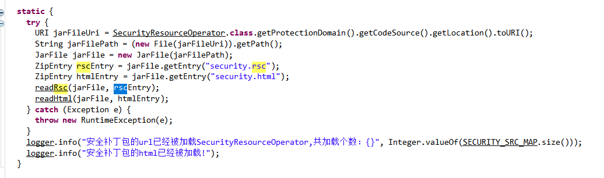跟进readRsc方法，发现rsc文件的解密逻辑，通过调用RSAUtils.decryptByDefaultPrivateKey实现RSA加解密：

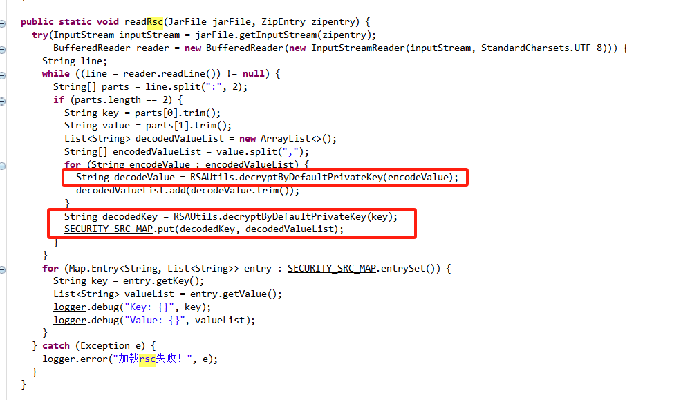我们编写脚本进行解密，成功解密得到漏洞相关的路径：

经过解密分析，本次漏洞相关的路径为：\*\*/pdfverifier、/api/pdfverifier\*\*。

漏洞的修复逻辑在com.qiyuesuo.security.patch.filter.wrapper.PdfverifierPreventWrapper类中，从中我们可以大致看出来漏洞的原理：

首先是从rsc中加载要过滤的路径、文件类型等参数，因为我们上面解密了，能通过比对看到加载的参数值：

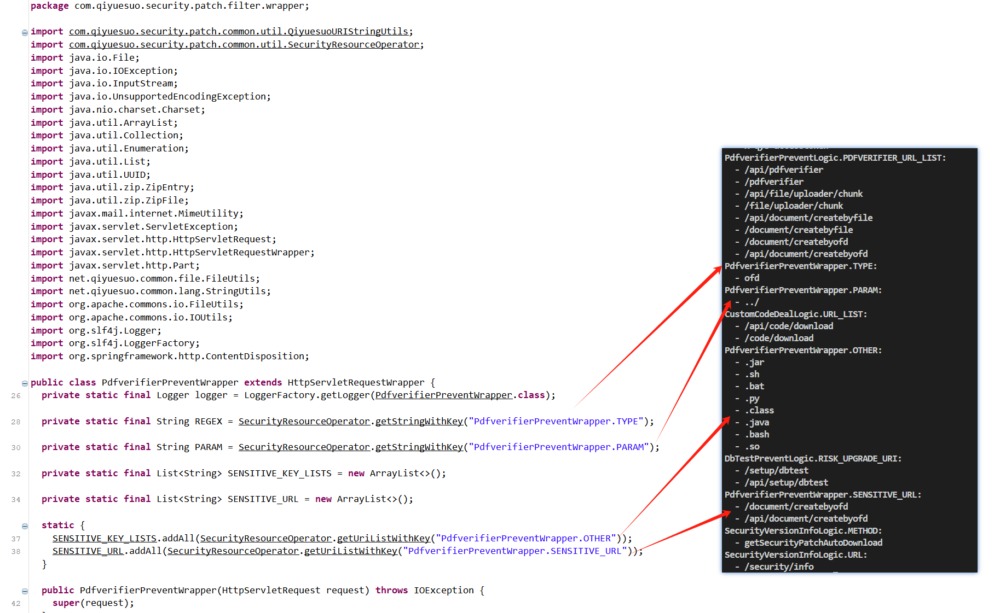然后重写 `getParts()` 方法（处理上传文件）：

* 获取上传的所有 `Part`；
* 提取 `filename` 并判断后缀是否为 `pdf`；
* 如果不是 `pdf`，或 URL 是敏感的，则进一步检查是否存在路径穿越；
* 如果是路径穿越或命中敏感后缀，则记录日志并丢弃该文件；
* 否则保留该 `Part`。

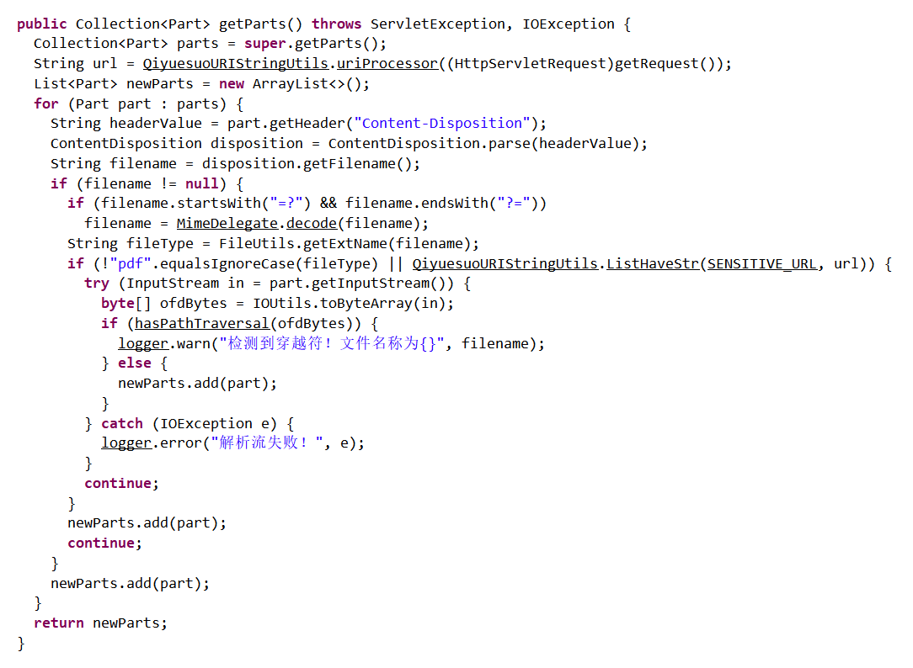跟进路径穿越与敏感文件检测函数 `hasPathTraversal(byte[])`，其主要逻辑为：

* 将上传的文件字节保存成临时 `.ofd` 压缩包；
* 使用 `ZipFile` 解压读取所有 `ZipEntry`；
* 遍历每个条目：

* 是否包含 `PARAM` 字符串，即上文rsc文件中解密得到的路径穿越符`../`；
* 是否以配置中敏感后缀结尾，即上文rsc文件中解密得到的 `.sh`, `.jar`, `.bat`, `.py`等）；

* 发现异常条目则返回 true，表示文件非法；
* 最后删除临时生成的文件。

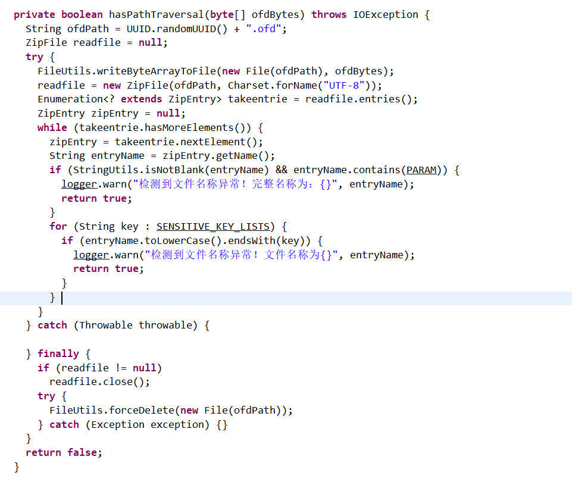补丁包中还包含了一个辅助类MimeDelegate，用于解码 MIME 格式的文件名（避免上传文件名被编码而绕过过滤）：

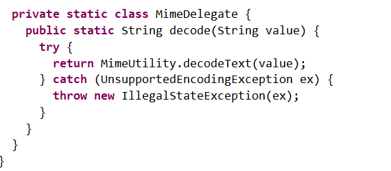

从补丁包中可以推断出这是一个上传ofd后解压过程中的路径穿越任意文件上传漏洞：如果构造的ofd压缩包中的文件含有目录穿越符，那么解压的时候系统就会将该文件解压到目录穿越符指定的文件夹中，从而造成文件覆盖或者上传恶意脚本到任意文件夹。

# 四、环境搭建（资产测绘）

hunter：web.body="qyswebapp"

fofa：app="契约锁-电子签署平台"

# 五、漏洞复现

漏洞复现考虑到避免影响其他系统，还是在本地复现：

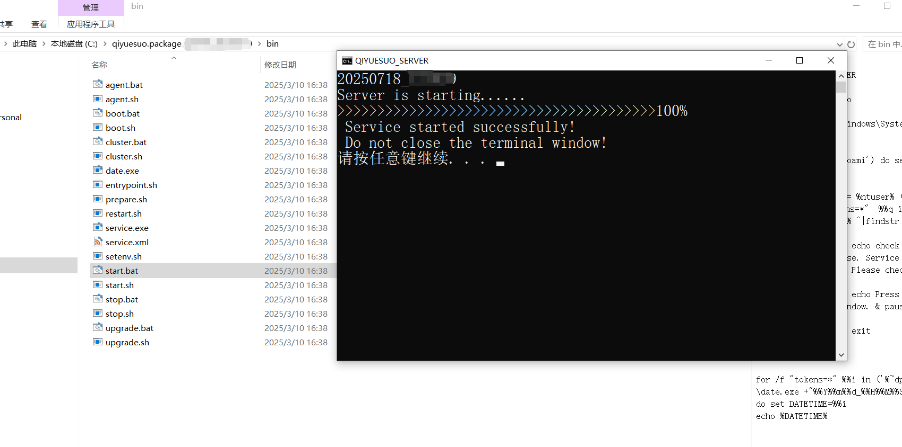用脚本构造含有路径穿越符的压缩包：

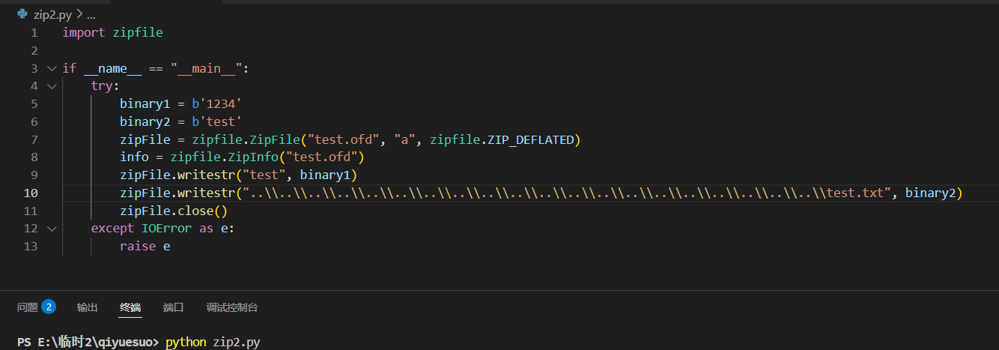构造请求包上传，可以看到test.txt文件成功被上传：

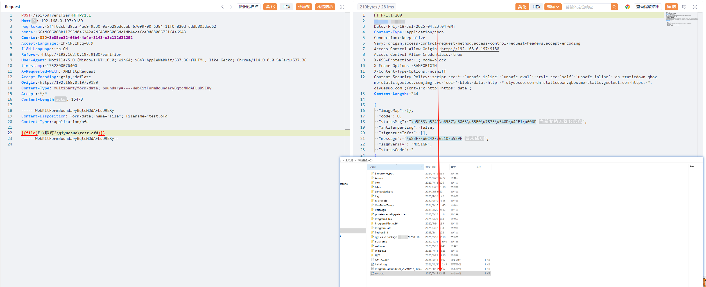

# 六、修复建议

契约锁官方已发布安全补丁，请及时更新安全补丁：  
下载地址：<https://www.qiyuesuo.com/more/security/servicepack>

# 七、总结

这个漏洞进一步的利用方式可以是通过覆盖已知契约锁的前端文件来达到修改页面的目的，或者通过将恶意文件写入/etc/cron.d等目录，通过定时任务来执行任意命令，危害还是挺大的，建议尽快修复。

​
