# JAVA代码审计之jshERP-先知社区

> **来源**: https://xz.aliyun.com/news/18485  
> **文章ID**: 18485

---

#### 项目介绍

管伊佳ERP(原名华夏ERP)基于SpringBoot框架和SaaS模式并立志为中小企业提供开源好用的ERP软件，目前专注进销存+财务功能，主要模块有零售管理、采购管理、销售管理、仓库管理、财务管理、报表查询、系统管理等。支持预付款、收入支出、仓库调拨、组装拆卸、订单等特色功能，拥有库存状况、出入库统计等报表。同时对角色和权限进行了细致全面控制，精确到每个按钮和菜单

#### 环境搭建

下载产品源代码文件到本地

<https://github.com/jishenghua/jshERP>

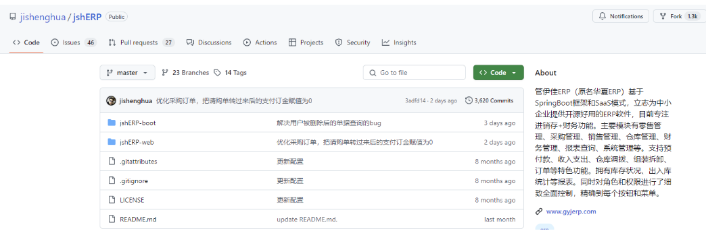

随后使用IDEA打开工程文件并根据配置文件中对应的数据库凭据创建数据库，同时导入doc下的数据库文件到数据库启动项目：

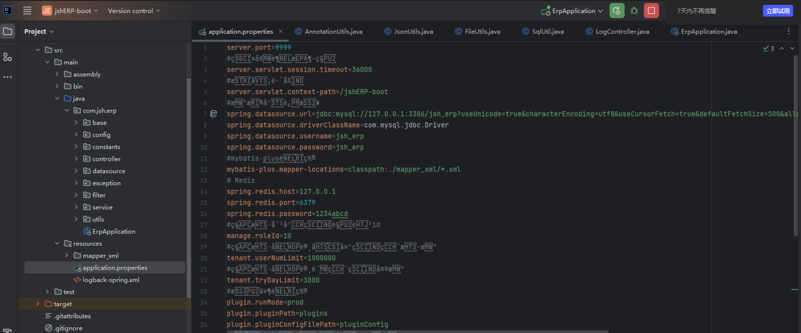

​

#### 代码审计

##### 硬编码类

同样还是首先来看配置文件，从配置文件中可以看到这里依旧是存在诸如数据库明文凭据、Redis明文凭据信息，针对此类问题建议安全的使用Nacos或者使用jasypt加密库来进行安全配置对接

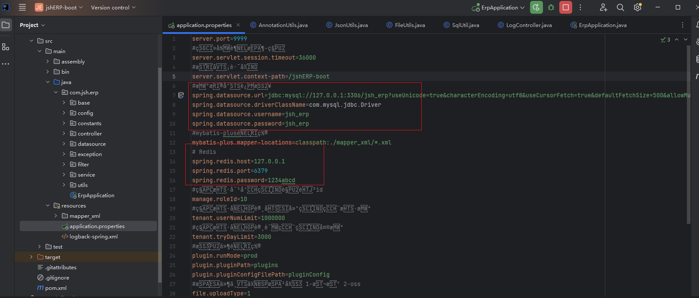

##### log4j组件风险

首先查看jshERP项目中使用的第三方组件，可以看到使用了风险版本的log4j，但是1.2.17版本之前的利用需要Apache Log4j开启的socket端口暴露，同时项目中存在第三方已知可利用的Gadget，其中第一个条件就不满足，所以也无法进行后续利用

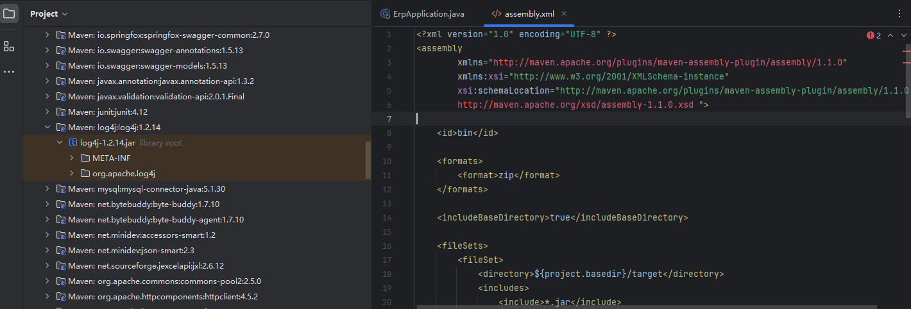

##### RestFul API未授权

应用启动后会自动启动一个后端API服务，其中有托管对应的后端接口的doc.html文件

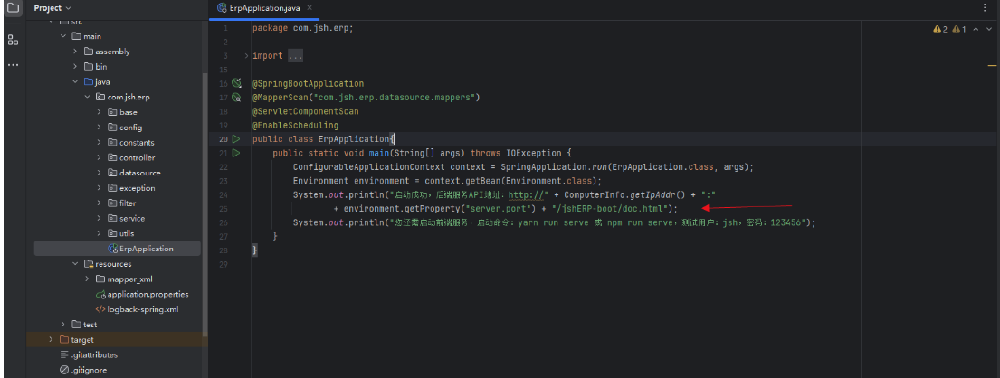

同时在filter一层对于请求的处理上如果用户的请求路径不为空且包含/doc.html，那么直接放行

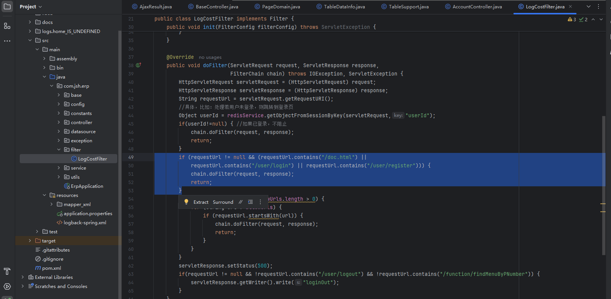

所以这里的doc.html其实是一个未授权访问的地址，我们直接访问可以看到后端ERP RestFul API接口文档信息，其中包含了所有的交互接口和参数说明信息：

<http://192.168.204.224:9999/jshERP-boot/doc.html>

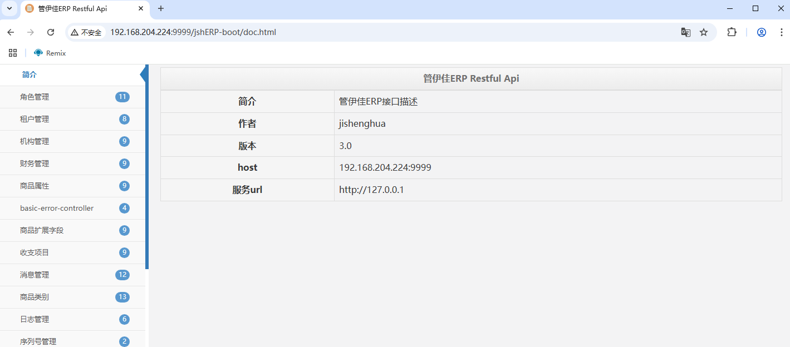

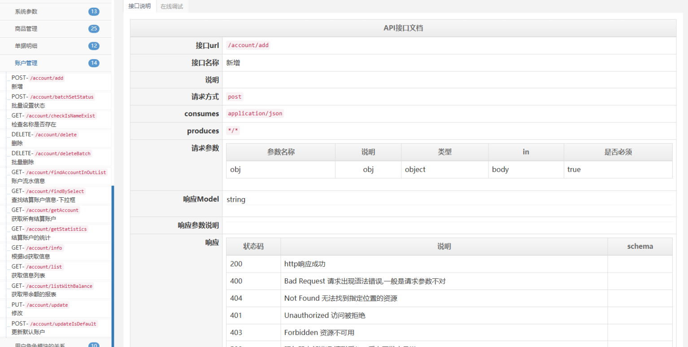

##### 任意用户密码重置

我们随后来到controller层中的UserController，可以从中发现用户注册、登录相关的请求处理逻辑，其中的重置密码引起了我们的注意，可以看到在进行用户密码重置时是根据用户的uid来执行的重置操作，同时默认的初始密码被写死在了源代码文件中，所以我们在登录系统之后可以对任意用户进行密码重置操作，同时可以使用默认的密码123456实现登录操作，那么这里有人会问，你都登录系统了，重置密码不是很正常的操作吗？难道不应该吗？确实不应该，因为这里的ERP是多租户模式，在进行对用户的密码重置时应该遵循"租户ID+用户ID"维度对自己的密码凭证进行重置，或者"租户ID+租户管理权限+用户ID"使用租户管理员对当前租户下的租户子用户进行密码重置操作才对：

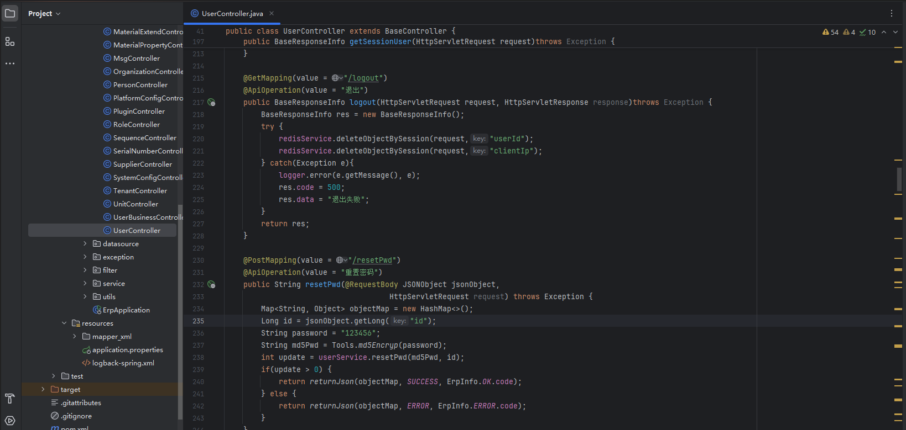

而在上面可以看到这里直接是获取请求中的ID，随后使用默认的硬编码的密码凭据123456进行Md5哈希处理后调用restPwd进行密码重置的操作，在这里你可以看到这么几个风险点：

1、默认密码使用弱口令且硬编码在源代码中

2、密码使用不安全的Md5进行哈希处理

随后我们跟进来到userService.resetPwd，可以看到这里直接根据uid进行的密码重置操作，期间除了不能重置admin的其余都可以重置：

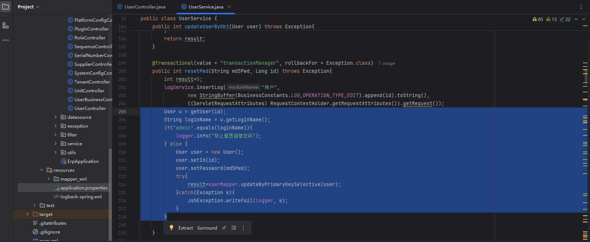

关于租户的这个可以在注册接口中看后端的处理业务逻辑，在这里可以看到用户注册后其实是注册的一个租户：

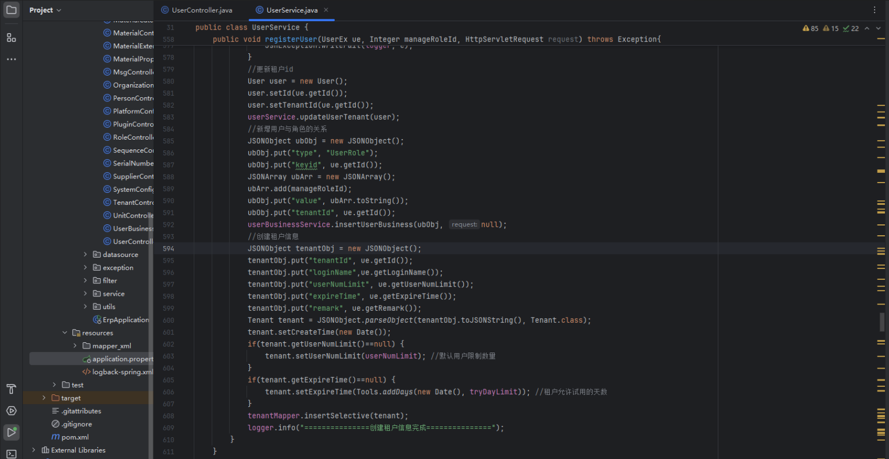

##### 租户之间多处水平越权

随后我们在审计UserController的时候我们发现存在多处的租户之间水平越权的问题，这里以用户列表接口为例进行分析，可以看到这里调用了getUser，随后我们跟进

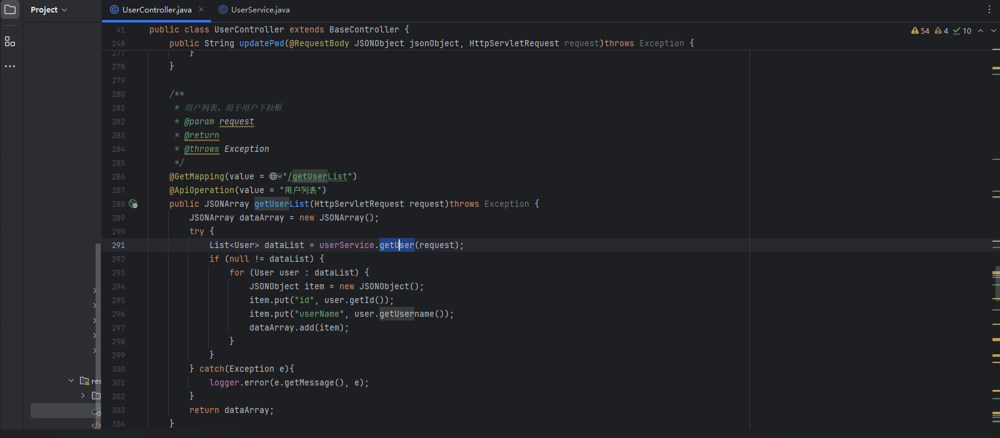

随后直接去查询对应的入参的UID并根据UID进行SQL语句的构造直接从数据库中进行查询，仅单一的uid维度的用户数据检索而为考虑租户级别：

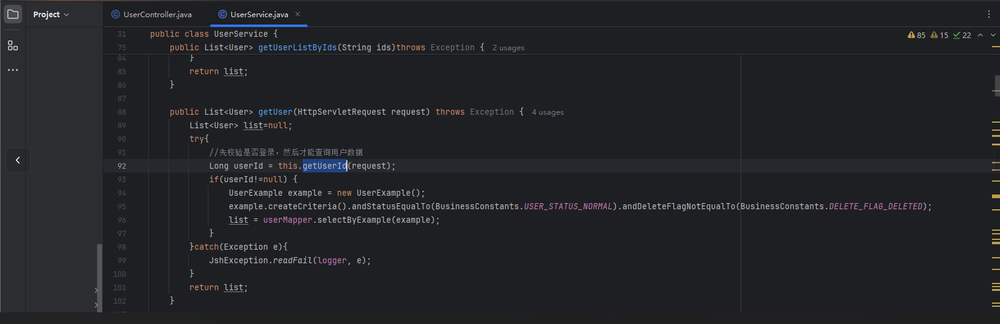

同样的还有用户删除等业务接口，这里太多了就不再去赘述了：

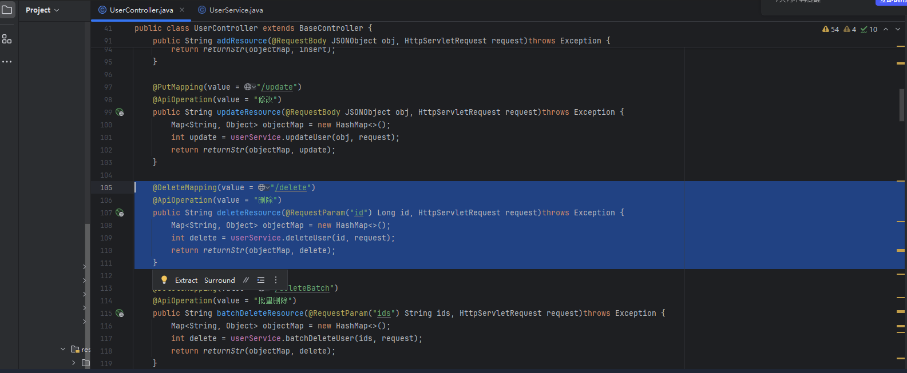

##### SQL注入问题-无果

随后我们在找寻SQL注入的时候发现这里的使用${}进行拼接的都是条件语句，这里的条件是条件，值是值，而我们控制的值都被做了预编译处理，所以SQL注入搜寻失败~

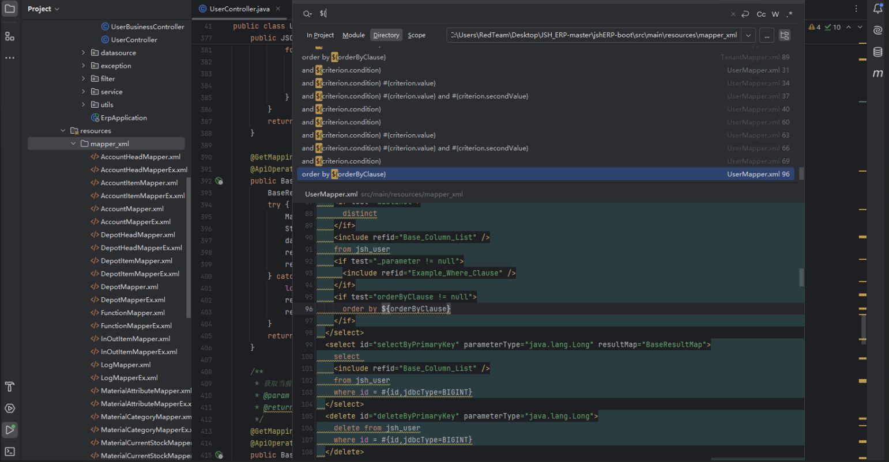

##### 普通租户到系统管理员的垂直越权

在多租户模式下有一个系统管理员来进行管理租户，用户注册成为租户并根据企业的业务来创建用户账号给企业下的用户，企业下的用户使用账号进行登录租户操作空间进行协作，而在我们查看TenantController的时候我们本以为这里会对租户进行一个严格的鉴权处理，但是很是失望，这里的接口也是未做任何的角色层面的filter拦截处理等操作，同时操作的数据也是id维度的，导致存在租户到系统管理员之间的垂直越权安全问题

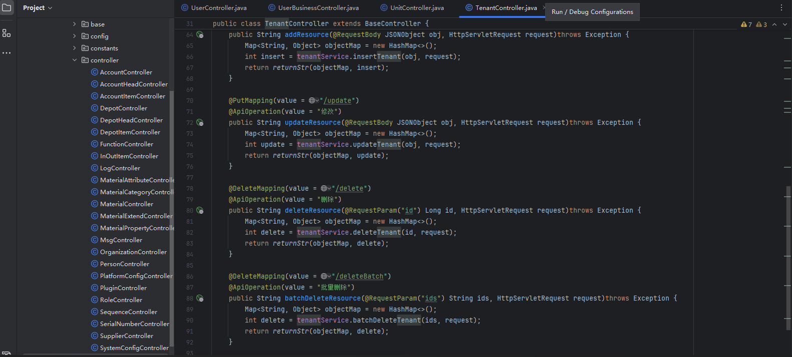

最起码的连当前用户的权限是否是admin都没有进行判断直接就进行的增删改操作：

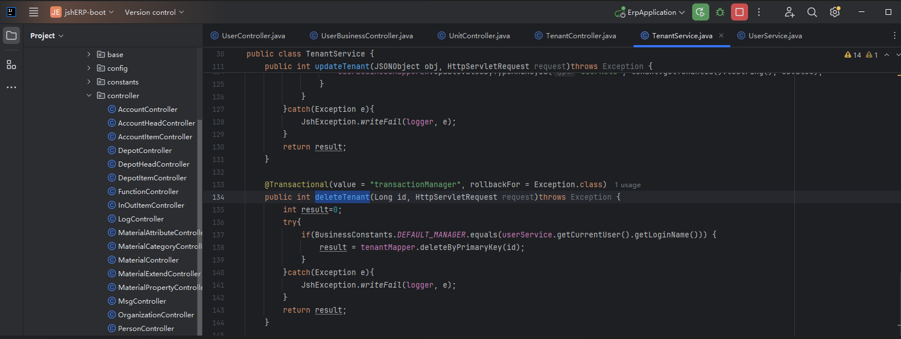

##### 任意文件上传-失败

随后我们在查看controller的时候发现一处文件上传统一处理方法，可以看到这里的文件存储方式提供了本地的物理磁盘存储或者是阿里云OSS存储方式，随后我们跟进这里的物理存储方式

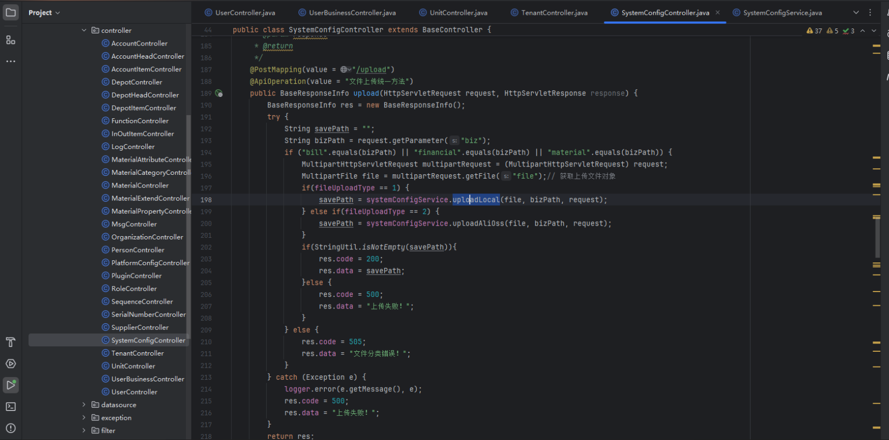

可以看到这里对文件路径中的".."以及"/"进行了检查，同时还有Token凭证X-Access-Token和租户信息，随后拼凑了一个路径并且对文件的白名单进行了校验检查，虽然这里无法GetShell但是可以使用PDF的XSS漏洞来打其他租户用户的Cookie信息

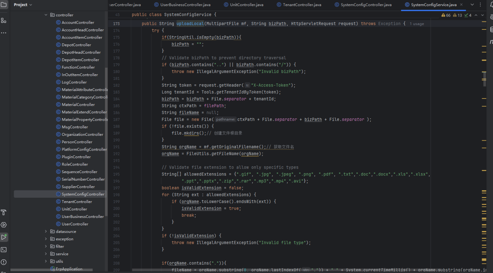

#### 文末小结

本篇文章我们主要从代码审计视角对jshERP的代码安全进行了评估，其中有一个非常值得关注的点就是多租户模式下用户的鉴权体系的设计，与此同时还可以关联到的几个问题，例如：多租户模式下是否采用分库分表来存储用户的数据，物理隔离还是逻辑隔离，还有就是多租户模式下如何实现对租户的安全管理、租户如何实现角色的划分、多租户模式下如何对调用的接口进行多租户之间的鉴权等问题的思考
