# 深度解析一键加解密插件autoDecoder，让你像测试明文一样简单-先知社区

> **来源**: https://xz.aliyun.com/news/18487  
> **文章ID**: 18487

---

# 概述

现在很多网站都会遇到加解密的情况，需要一款不错的加解密插件帮你解决这个问题，部分网站只需要找到加密方法，直接在该软件中填写加密方式、key、iv等即可正常渗透测试，但是很多情况自带的加解密方法无法满足我们的需求，这时候我们需要自己编写autodecoder加解密脚本来解决，今天我们讲讲编写autodecoder加解密脚本可能会遇到的问题（autodecoder是一个burpsuite加解密的插件）

加解密脚本有很大一部分是加解密算法的类型、编码、填充相关的问题，今天我会从常见加解密算法、流程图、类型问题、编码、调试等进行解析，帮你避坑，让你减少报错，一路绿灯，快速编写一个autodecoder加解密脚本

# 流程图

了解流程可以很大程度帮你提高编写脚本的效率

​

**官方流程图**

正常流程

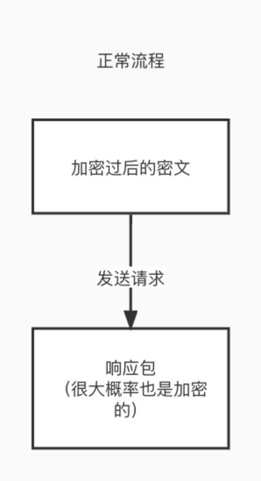

对密文的处理流程

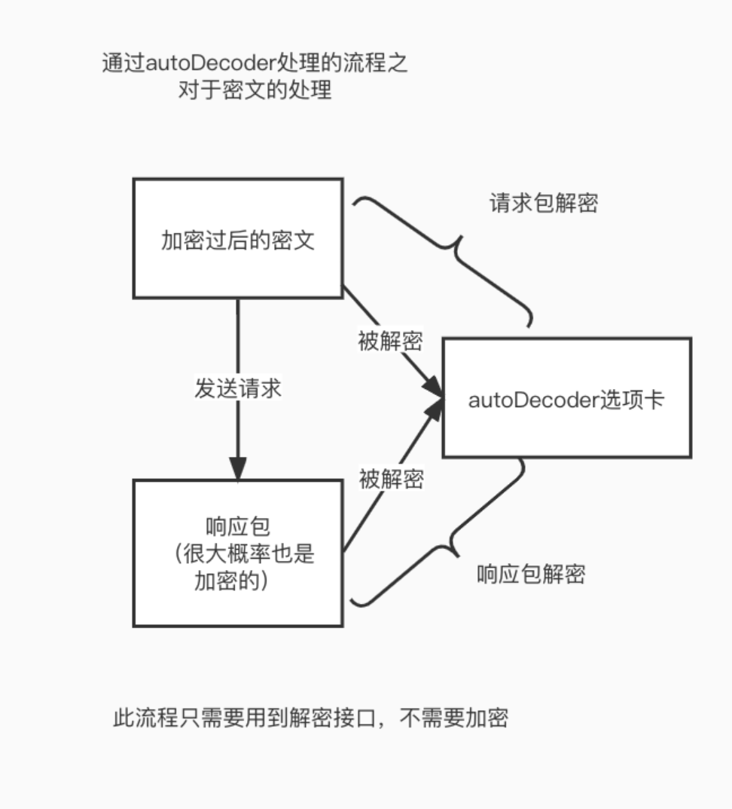

对明文的处理流程

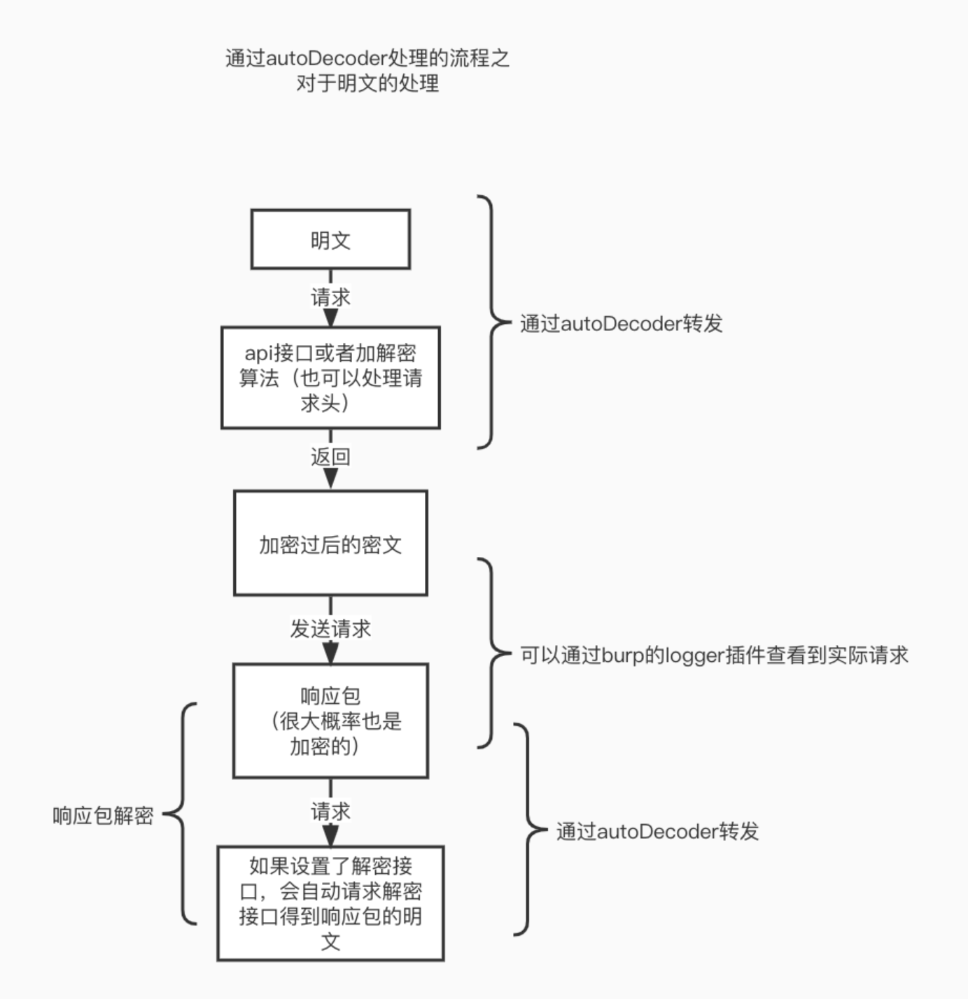

**数据类型流程图**

根据官方提供的案例，总结出的数据类型流程图，如果数据类型处理不好，会很麻烦，了解了加解密需要注意的数据类型，可以帮助你快速上手编写autodecoder加解密脚本

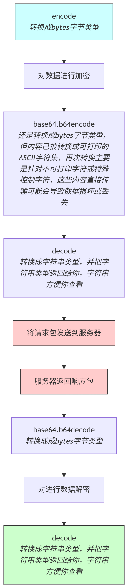

# 常见加密算法总结

根据autodecoder加解密脚本的需要，整理了一个常见解密算法，对加密输入要求，解密输入要求、key要求、iv要求、填充要求进行了说明

​

这个表可以很直观的看出对参数类型的要求，后面python写autodecoder加解密脚本的时候会用到

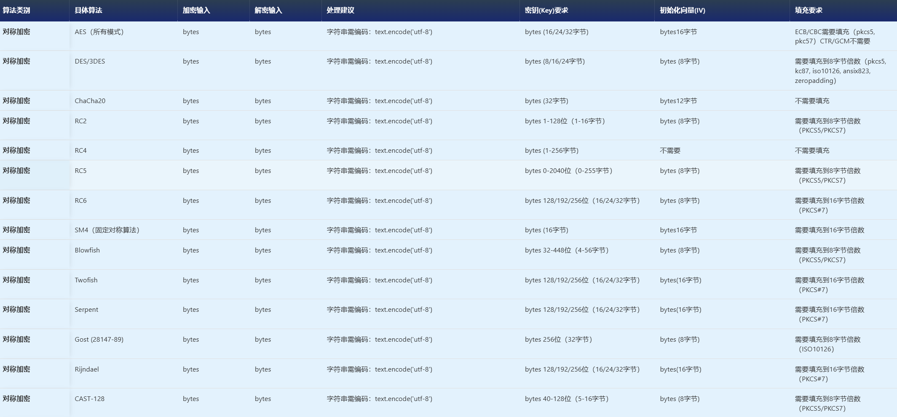

​

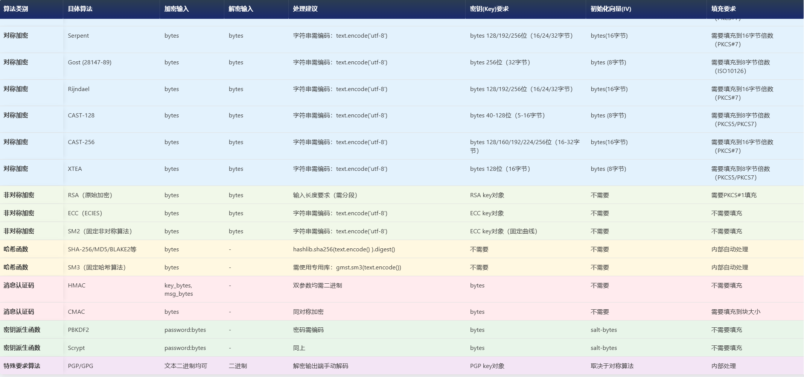

如果参数类型不对，可能会抛出以下异常

```
TypeError: Object type <class 'str'> cannot be passed to C code
```

# 填充相关

**注意**

即使指定了填充方式为Pkcs7或者Pkcs5，还是要使用pad进行填充和unpad去除填充

​

aes填充

```
# 使用pad进行自动填充，推荐自动填充
padded = pad(b"Hello", AES.block_size)

# 使用pad自动去除填充，推荐自动填充
unpadded = unpad(padded, AES.block_size)
```

des填充

```
# 使用pad进行自动填充，推荐自动填充
padded = pad(b"Hello", DES.block_size)

# 使用pad自动去除填充，推荐自动填充
unpadded = unpad(padded, DES.block_size)
```

3des填充

```
# 使用pad进行自动填充，推荐自动填充
padded = pad(b"Hello", DES3.block_size)

# 使用pad自动去除填充，推荐自动填充
unpadded = unpad(padded, DES3.block_size)
```

# 类型问题

为啥需要一会儿encode，一会儿decode

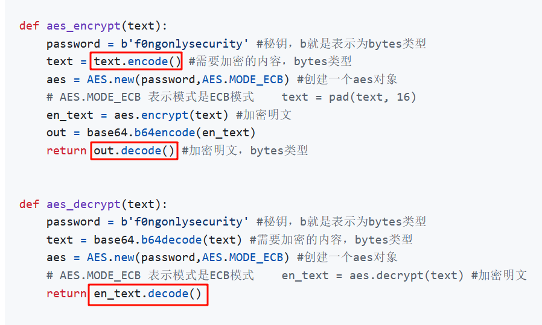

encode是需要将数据转换为字节类型(bytes)，因为常见的算法加解密需要是bytes类型，具体的请参考《常见加密算法总结》，可以理解为encode是在本地加解密的时候使用

​

decode是需要将数据数据转换为字符串类型(str)，因为Flask需要使用字符串类型，否则会导致Flask报错，为什么要用Flask，详情请参考《Flask用途》，可以理解为decode是在网络传输的时候使用

​

# 编码问题

在官方的aes和des加密案例中会看到使用不同的Base64编码方式，无论使用哪种编码方式都行，他们的区别如下

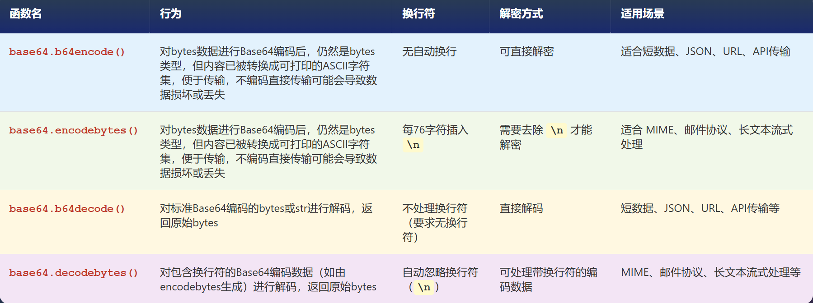

​

如果使用base64.encodebytes(data)可以使用以下方式去除换行符，注意：需要去除换行符以后才能解密

```
strip("
")
```

​

案例

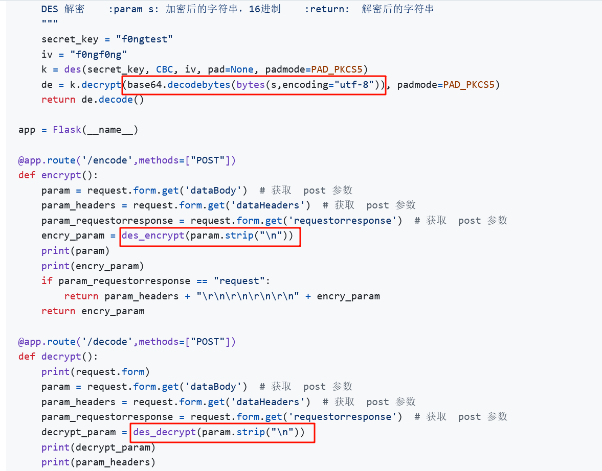

# Flask用途

Flask在autodecoder自定义python加解密脚本中的用途

**​**

**创建 Web API 接口**

```
接口路径	                                                用途
@app.route('/encode',methods=["POST"])      对客户端传入的数据进行 AES 加密，并返回 Base64 编码后的加密结果
@app.route('/decode',methods=["POST"])  	对客户端传入的加密数据进行 Base64 解码和 AES 解密，返回原始明文
```

**​**

**接收客户端请求和参数**

Flask 通过 request.form.get() 接收客户端发送的 POST 请求参数

```
body = request.form.get('dataBody')  # 获取  post 参数 必需  
headers = request.form.get('dataHeaders')  # 获取  post 参数  可选  
```

**​**

**模拟加密网关服务**

Flask 服务模拟了一个加密/解密网关：

前后端加密通信：前端发送敏感数据前加密，后端解密处理。

中间代理服务：拦截请求/响应，对数据进行加解密处理。

测试调试工具：模拟加密服务，测试加密接口的兼容性和稳定性。

**​**

**启动服务**

使用 app.run() 启动本地 Web 服务

```
app.debug = True
app.run(host="0.0.0.0", port="8888")
```

# JSON数据处理

针对于请求包和返回包需要自定义的情况，比如需要对请求包在加密后在添加特定的数据，或者只需要对返回包中特定的数据进行解密，而不需要全部解密，这里需要注意的是：一个是在加密后对数据进行处理，一个是对数据进行处理后进行解密

**​**

**添加数据案例（请求包）**

```
原始数据（加密方式忘了，但不影响理解）
{"id"：1,"kfc":"vwo50"}

对原始数据进行加密
At/tP0QUeDw/Y9yZmznl2DLyE4f6uXjA9qbHqKHJgb8=

加密后再对数据进行一次处理，最终发出去的数据为
{"data":"At/tP0QUeDw/Y9yZmznl2DLyE4f6uXjA9qbHqKHJgb8="}
```

​

使用官方的案例

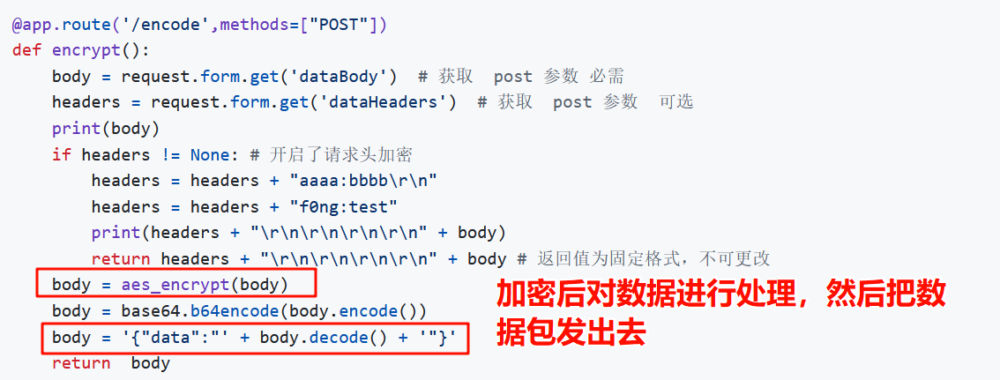

关键代码

```
body = aes_encrypt(body) 
body = '{"data":"' + body.decode() + '"}'
```

**获取数据案例（响应包）**

```
原始数据
{"status":"200","result":"At/tP0QUeDw/Y9yZmznl2DLyE4f6uXjA9qbHqKHJgb8=","crayz":50}

只需要获取result中的数据进行解密
At/tP0QUeDw/Y9yZmznl2DLyE4f6uXjA9qbHqKHJgb8=
```

​

使用官方的案例（我添加了几行代码）

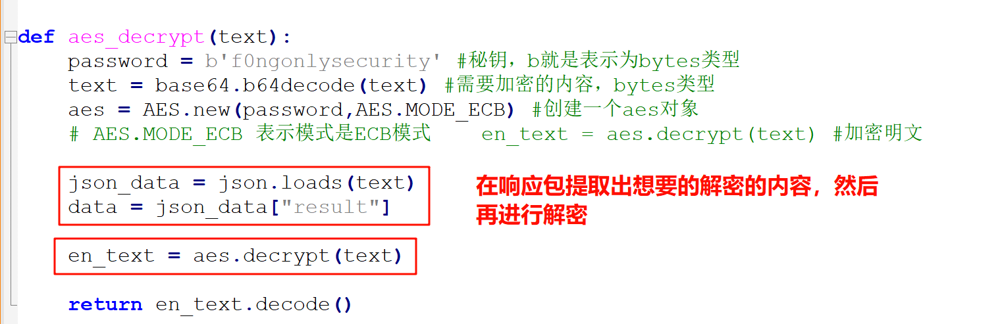

​

关键代码

```
json_data = json.loads(text)
data = json_data["result"]
```

# 接口调试

**概述**

autoDecoder调试接口文章，相比原文这里的教程使用的autodecoder版本更新，且更加细致

```
https://github.com/f0ng/autoDecoder-usages/blob/main/autoDecoder%E7%9A%84%E8%B0%83%E8%AF%95%E5%8A%9E%E6%B3%95/%E6%8E%A5%E5%8F%A3%E5%8A%A0%E8%A7%A3%E5%AF%86%E8%B0%83%E8%AF%95/%E6%8E%A5%E5%8F%A3%E5%8A%A0%E8%A7%A3%E5%AF%86%E8%B0%83%E8%AF%95.md
```

**​**

**配置**

算法为DES/CBC/PKCS5Padding算法，密钥为f0ngtest，iv为f0ngf0ng

​

请求体为

```
I9z1fsH5QQ2NUbJi/7a8lw==
```

响应体为

```
dCtLdlmk7wI=
```

​

python文件如下（将以下内容保存到一个python文件中，我这里命名为autoDecoderTest.py）

```
# -*- coding:utf-8 -*-  
# author:f0ngf0ng  
  
from flask import Flask,Response,request  
from pyDes import *  
import base64  
  
def des_encrypt(s):  
    """  
    DES 加密    :param s: 原始字符串    :return: 加密后字符串，16进制  
    """    
    secret_key = "f0ngtest"  
    iv = "f0ngf0ng"  
    k = des(secret_key, CBC, iv, pad=None, padmode=PAD_PKCS5)  
    en = k.encrypt(s, padmode=PAD_PKCS5)  
    return base64.encodebytes(en).decode()  
  
def des_decrypt(s):  
    """  
    DES 解密    :param s: 加密后的字符串，16进制    :return:  解密后的字符串  
    """    
    secret_key = "f0ngtest"  
    iv = "f0ngf0ng"  
    k = des(secret_key, CBC, iv, pad=None, padmode=PAD_PKCS5)  
    de = k.decrypt(base64.decodebytes(bytes(s,encoding="utf-8")), padmode=PAD_PKCS5)  
    return de.decode()  
  
app = Flask(__name__)  
  
@app.route('/encode',methods=["POST"])  
def encrypt():  
    param = request.form.get('dataBody')  # 获取  post 参数  
    param_headers = request.form.get('dataHeaders')  # 获取  post 参数  
    param_requestorresponse = request.form.get('requestorresponse')  # 获取  post 参数  
    encry_param = des_encrypt(param.strip("
"))  
    print(param)  
    print(encry_param)  
    if param_requestorresponse == "request":  
        return param_headers + "\r
\r
\r
\r
" + encry_param  
    return encry_param  
  
@app.route('/decode',methods=["POST"])  
def decrypt():  
    print(request.form)  
    param = request.form.get('dataBody')  # 获取  post 参数  
    param_headers = request.form.get('dataHeaders')  # 获取  post 参数  
    param_requestorresponse = request.form.get('requestorresponse')  # 获取  post 参数  
    decrypt_param = des_decrypt(param.strip("
"))  
    print(decrypt_param)  
    print(param_headers)  
    print(param_requestorresponse)  
    if param_requestorresponse == "request":  
        return param_headers + "\r
\r
\r
\r
" + decrypt_param  
    else:  
        return decrypt_param  
  
if __name__ == '__main__':  
    app.debug = True # 设置调试模式，生产模式的时候要关掉debug  
    app.run(host="0.0.0.0",port="8888")
```

​

IP

```
10.211.55.4
```

​

burpsuite中进行设置

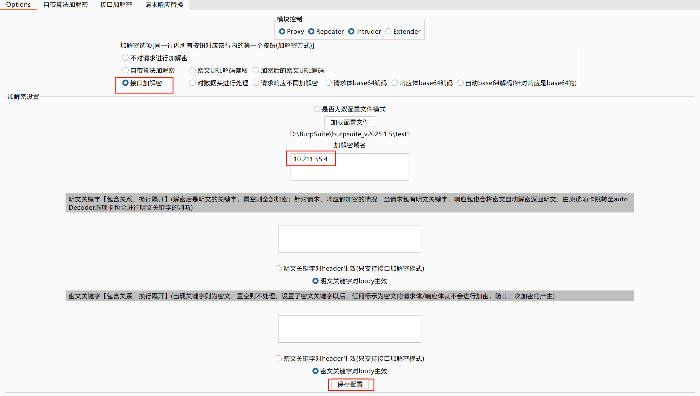

**调试**

启动autoDecoderTest.py

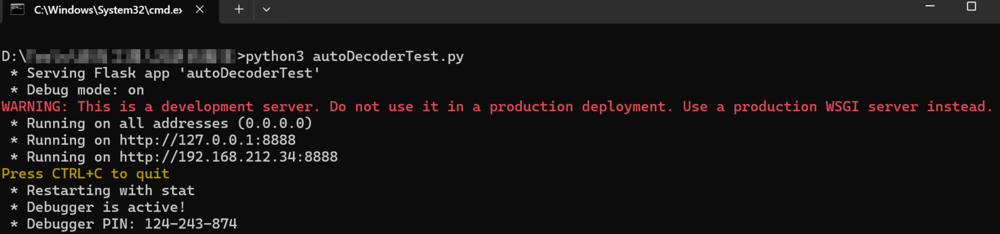

如果启动报错，大概率是库的原因，根据提示安装需要的库即可，如果安装完还报错，就换一个高版本的python，免得折腾浪费时间，我这里用的3.9.7的版本，用python2会有很多问题


复制以下内容在autodecoder中进行测试

解密测试

```
POST /testsql.php HTTP/1.1
Host: 10.211.55.4
User-Agent: Mozilla/5.0 (Macintosh; Intel Mac OS X 10.15; rv:109.0) Gecko/20100101 Firefox/109.0
Accept: text/html,application/xhtml+xml,application/xml;q=0.9,image/avif,image/webp,*/*;q=0.8
Accept-Language: zh-CN,zh;q=0.8,zh-TW;q=0.7,zh-HK;q=0.5,en-US;q=0.3,en;q=0.2
Accept-Encoding: gzip, deflate
Connection: keep-alive
Upgrade-Insecure-Requests: 1
Content-Type: application/x-www-form-urlencoded
Content-Length: 24

I9z1fsH5QQ2NUbJi/7a8lw==
```

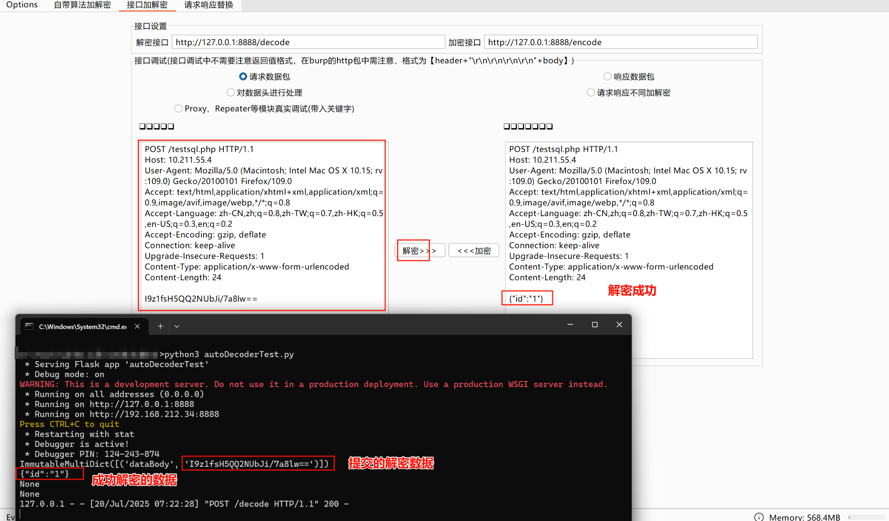

加密测试

```
POST /testsql.php HTTP/1.1
Host: 10.211.55.4
User-Agent: Mozilla/5.0 (Macintosh; Intel Mac OS X 10.15; rv:109.0) Gecko/20100101 Firefox/109.0
Accept: text/html,application/xhtml+xml,application/xml;q=0.9,image/avif,image/webp,*/*;q=0.8
Accept-Language: zh-CN,zh;q=0.8,zh-TW;q=0.7,zh-HK;q=0.5,en-US;q=0.3,en;q=0.2
Accept-Encoding: gzip, deflate
Connection: keep-alive
Upgrade-Insecure-Requests: 1
Content-Type: application/x-www-form-urlencoded
Content-Length: 24

 {"userName":"admin","userPwd":"123456"}
```

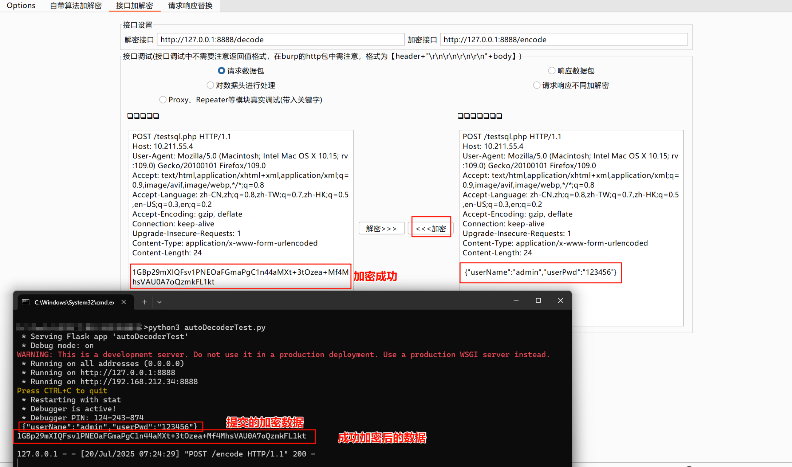

调试成功以后，就可以基于这个脚本修改为自己的加解密脚本，可以多增加一些信息，帮你快速定位出错的位置，还有就是我上面写的那些注意事项可以多看一下

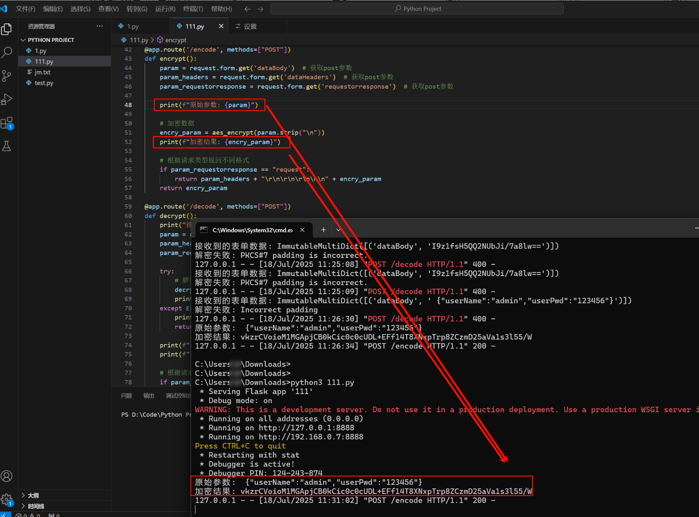

**其他需要注意的点**

修改改脚本后不需要关闭之前运行的py文件然后重新运行，会自动运行之前修改后的文件

修改目标ip以后，在配置文件中修改ip，即可进行相应的脚本编写和调试

假设这里192.168.1.1是正式环境测试地址

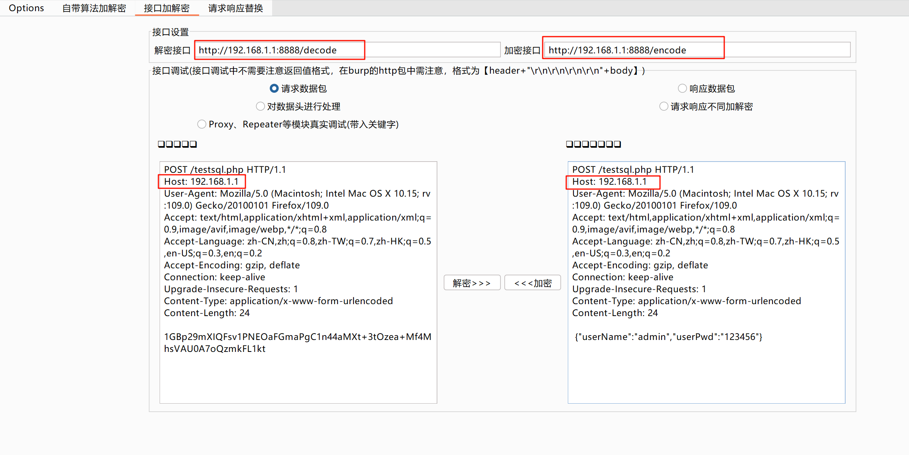

一定要点击保存配置，否则设置不生效

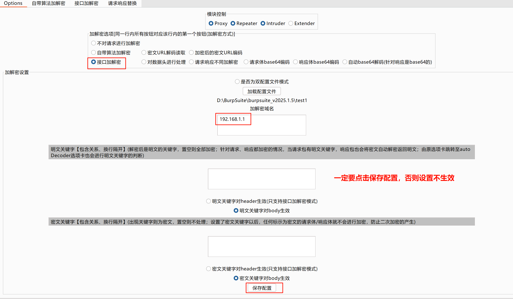

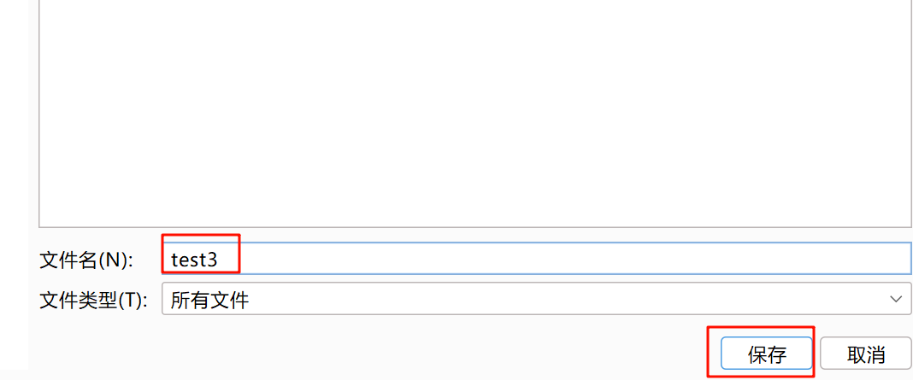

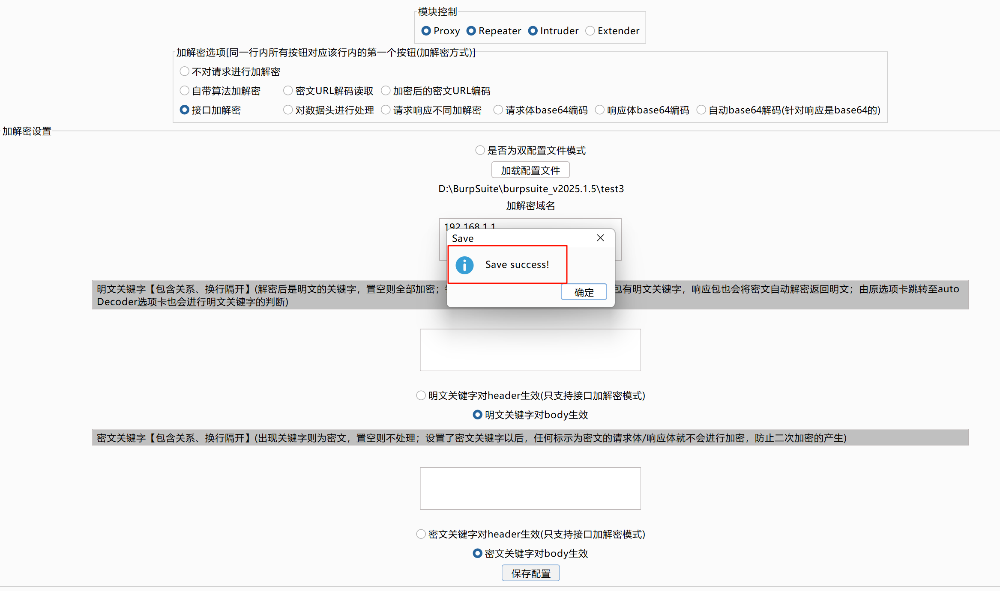
