# Reverse入门参考(一)-先知社区

> **来源**: https://xz.aliyun.com/news/18513  
> **文章ID**: 18513

---

# Reverse入门参考

主要分为9个模块

1.汇编与IDA使用

2.静态分析

3.动态调试(本地+远程)

4. 迷宫maze逆向

5.壳与混淆

6.各类算法逆向

7.花指令基础

8.SMC基础

9. Python逆向基础

# 汇编与ida使用

ida使用参考鄙人之前写过的

## 汇编知识点

基础就是对寄存器和汇编码操作指令的了解，实际最主要还是根据main函数入口定位，五六百行汇编码人肉分析是基本功

快速入门版

1. 核心概念

本质： 机器指令的助记符（MOV, ADD 等），是机器码的“人类可读”形式。直接对应CPU硬件操作。

核心任务： 操作 寄存器(Registers) 和 内存(Memory) 中的数据。

指令结构： 操作码 [操作数1] [, 操作数2] (如 MOV AX, 5)

低级性： 无高级语言的变量、类型系统（需手动管理内存）、复杂控制结构（需跳转实现）。

平台依赖： 汇编指令集和寄存器结构完全依赖于特定的CPU架构（如 x86, ARM, MIPS）。

2. 关键硬件组件（程序员视角）

寄存器 (Registers)： CPU内部超高速存储单元。

通用寄存器 (GPRs)： 存放数据和地址（如 x86: AX, BX, CX, DX, EAX, RAX； ARM: R0-R12）。

指令指针 (IP / PC)： 指向下一条要执行的指令地址（x86: EIP/RIP； ARM: R15(PC)）。

堆栈指针 (SP)： 指向当前栈顶（x86: ESP/RSP； ARM: R13(SP)）。

标志寄存器 (Flags)： 存储上一条指令执行结果的状态（如 ZF 零标志, CF 进位标志, SF 符号标志）。控制条件跳转 (JZ, JC 等)。

内存 (Memory)： RAM，按字节编址。寄存器操作速度远快于内存。

总线 (Bus)： CPU、内存、外设间传输数据的通道。

3. 基本指令类型

数据传输：

MOV dest, src： 复制数据（寄存器<->寄存器， 寄存器<->内存， 立即数->寄存器/内存）。内存间不能直接MOV！

算术运算：

ADD dest, src： 加法（影响标志位）

SUB dest, src： 减法（影响标志位）

INC dest： 加1

DEC dest： 减1

MUL / IMUL： 无/有符号乘法

DIV / IDIV： 无/有符号除法

逻辑运算：

AND dest, src： 按位与

OR dest, src： 按位或

XOR dest, src： 按位异或（常用清零寄存器 XOR AX, AX）

NOT dest： 按位取反

SHL / SHR / SAL / SAR： 逻辑/算术左移/右移

控制流：

JMP label： 无条件跳转到标签处。

条件跳转： 根据标志寄存器跳转（JE/JZ 等于/零, JNE/JNZ 不等于/非零, JG/JNLE 大于, JL/JNGE 小于, JC 进位, JNC 无进位 等）。

CALL func\_label： 调用子程序（将下一条指令地址压栈，并跳转）。

RET： 从子程序返回（从栈顶弹出地址并跳回）。

堆栈操作：

PUSH src： 将数据压入栈顶（SP减小）。

POP dest： 从栈顶弹出数据到目标（SP增大）。遵循 LIFO (后进先出) 原则。

用途： 函数调用参数传递/局部变量存储、保存寄存器状态、中断处理。

4. 寻址方式 (如何指定操作数位置)

立即寻址： 操作数是指令本身的一部分（常数），如 MOV AX, 42

寄存器寻址： 操作数在寄存器中，如 ADD BX, CX

直接寻址： 操作数在内存中，地址直接给出，如 MOV AX, [0x1234] (早期/特定场景)

寄存器间接寻址： 操作数地址在寄存器中，如 MOV AL, [BX] (x86), LDR R0, [R1] (ARM)

寄存器相对寻址： 地址 = 寄存器内容 + 偏移量，如 MOV AX, [SI + 10] (x86), LDR R0, [R1, #4] (ARM) - 访问数组/结构体成员常用

基址变址寻址： 地址 = 基址寄存器 + 变址寄存器，如 MOV AX, [BX + SI] (x86)

基址变址相对寻址： 地址 = 基址寄存器 + 变址寄存器 + 偏移量，如 MOV AX, [BX + SI + 8] (x86) - 访问二维数组常用

5. 程序结构 (简化)

数据段 (.data / .section .data): 定义已初始化的全局/静态变量 (DB 字节, DW 字, DD 双字, DQ 四字)。

BSS段 (.bss): 定义未初始化的全局/静态变量空间 (RESB, RESW 等)。

代码段 (.text / .section .text): 存放程序指令 (\_start: 或 main: 通常是入口点)。

堆栈段: 通常由操作系统自动分配和管理，通过 SP 寄存器访问。

## 静态分析与动态调试

f5看代码加交叉引用分析以及linux下的远程动调，网上参考很多，不过多赘述

## 迷宫题型

算是对大一数据结构BFS和DFS的复习重温，用相应代码跑一遍路径即可，深度和广度对答案的影响考虑过，一般没太大问题

eg

```
import hashlib

# 固定迷宫布局
FIXED_MAZE = [
    [1, 1, 1, 1, 1, 1, 1, 1, 1, 1],
    [1, 0, 1, 1, 0, 0, 0, 0, 0, 1],
    [1, 0, 0, 1, 0, 1, 1, 1, 0, 1],
    [1, 0, 1, 1, 1, 1, 0, 1, 0, 1],
    [1, 0, 0, 0, 0, 1, 0, 1, 0, 1],
    [1, 1, 1, 1, 0, 1, 0, 1, 0, 1],
    [1, 0, 0, 0, 0, 1, 0, 0, 0, 1],
    [1, 0, 1, 1, 1, 1, 1, 1, 0, 1],
    [1, 0, 0, 0, 0, 0, 0, 0, 0, 1],
    [1, 1, 1, 1, 1, 1, 1, 1, 1, 1]
]

# 迷宫大小
WIDTH = 10
HEIGHT = 10


# 打印迷宫
def print_maze(maze, player_pos):
    for y in range(len(maze)):
        for x in range(len(maze[y])):
            if (x, y) == player_pos:
                print("P", end=" ")
            elif maze[y][x] == 0:
                print(".", end=" ")
            else:
                print("#", end=" ")
        print()


# 移动玩家
def move_player(maze, player_pos, direction):
    x, y = player_pos
    if direction == 'w':
        new_x, new_y = x, y - 1
    elif direction == 's':
        new_x, new_y = x, y + 1
    elif direction == 'a':
        new_x, new_y = x - 1, y
    elif direction == 'd':
        new_x, new_y = x + 1, y
    else:
        return player_pos

    if 0 <= new_x < len(maze[0]) and 0 <= new_y < len(maze) and maze[new_y][new_x] == 0:
        return (new_x, new_y)
    return player_pos


# 主函数
def main():
    maze = FIXED_MAZE
    player_pos = (1, 1)
    path = ""

    while True:
        print_maze(maze, player_pos)
        direction = input("Move (w/a/s/d): ").lower()
        if direction not in ['w', 'a', 's', 'd']:
            print("Invalid input! Use w/a/s/d to move.")
            continue

        player_pos = move_player(maze, player_pos, direction)
        path += direction

        if player_pos == (WIDTH - 2, HEIGHT - 2):
            print("Congratulations! You've reached the end of the maze.")
            break

    # 计算路径的 MD5 哈希值
    md5_hash = hashlib.md5(path.encode()).hexdigest()
    print("Your path: {}".format(path))
    print("the flag is polis{{{}}}".format(md5_hash))


if __name__ == "__main__":
    main()

#polis{538cc457b229b25d6bdbf7bae9ef357b}
#sssdddssaaassddddddd
```

对应代码

```
#include <stdio.h>
#include <stdlib.h>
#include <string.h>

// 定义迷宫大小
#define WIDTH 10
#define HEIGHT 10

// 定义方向数组（上、左、下、右）
int dx[] = {-1, 0, 1, 0};
int dy[] = {0, -1, 0, 1};
char dir[] = {'w', 'a', 's', 'd'}; // 对应的方向字符

// 定义队列结构
typedef struct {
    int x, y;       // 当前坐标
    char path[100]; // 记录路径
} Node;

// BFS 函数
void bfs(int maze[HEIGHT][WIDTH], int start[2], int end[2]) {
    int visited[HEIGHT][WIDTH] = {0}; // 记录是否访问过
    Node queue[1000];                 // 队列
    int front = 0, rear = 0;          // 队头和队尾

    // 初始化起点
    queue[rear].x = start[0];
    queue[rear].y = start[1];
    strcpy(queue[rear].path, "");
    visited[start[0]][start[1]] = 1;
    rear++;

    while (front < rear) {
        Node current = queue[front++]; // 取出队头节点

        // 如果到达终点
        if (current.x == end[0] && current.y == end[1]) {
            printf("Path found: %s
", current.path);
            return;
        }

        // 遍历四个方向
        for (int i = 0; i < 4; i++) {
            int nx = current.x + dx[i];
            int ny = current.y + dy[i];

            // 检查新位置是否合法
            if (nx >= 0 && nx < HEIGHT && ny >= 0 && ny < WIDTH &&
                maze[nx][ny] == 0 && !visited[nx][ny]) {
                // 记录新节点
                queue[rear].x = nx;
                queue[rear].y = ny;
                strcpy(queue[rear].path, current.path);
                queue[rear].path[strlen(current.path)] = dir[i]; // 添加方向
                queue[rear].path[strlen(current.path) + 1] = '\0';
                visited[nx][ny] = 1;
                rear++;
            }
        }
    }

    printf("No path found.
");
}

int main() {
    // 定义迷宫
    int maze[HEIGHT][WIDTH] = {
        {1, 1, 1, 1, 1, 1, 1, 1, 1, 1},
        {1, 0, 1, 1, 0, 0, 0, 0, 0, 1},
        {1, 0, 0, 1, 0, 1, 1, 1, 0, 1},
        {1, 0, 1, 1, 1, 1, 0, 1, 0, 1},
        {1, 0, 0, 0, 0, 1, 0, 1, 0, 1},
        {1, 1, 1, 1, 0, 1, 0, 1, 0, 1},
        {1, 0, 0, 0, 0, 1, 0, 0, 0, 1},
        {1, 0, 1, 1, 1, 1, 1, 1, 0, 1},
        {1, 0, 0, 0, 0, 0, 0, 0, 0, 1},
        {1, 1, 1, 1, 1, 1, 1, 1, 1, 1}
    };

    // 定义起点和终点
    int start[] = {1, 1};
    int end[] = {8, 8};

    // 调用 BFS 算法
    bfs(maze, start, end);

    return 0;
}
```

# 壳与混淆

ctf比赛中常用upx壳，安卓题目脱壳目前鄙人还未做到，混淆难的不用看，对于新师傅来说不太友好，关注简单的函数名变量名混淆，简单汇编代码混淆即可

## 壳的概念

“壳”，顾名思义，是程序外面的 **“保护层”**，主要分为压缩壳和加密壳两种。比赛中常见的一般是压缩壳，它在程序中加入一些代码隐藏程序真正的入口，使其难以被反编译。

进一步讲

壳实质上是⼀个⼦程序，在程序运⾏时⾸先取得控制权并对程序进⾏压缩，同时隐藏程序真正的OEP。 脱壳的⽬的就是找到真正的OEP。

OEP：程序的⼊⼝点，软件加壳就是隐藏了OEP（或者⽤了假的OEP）， 只要我们找到程序真正的 OEP，就可以脱壳。

PUSHAD （所有寄存器压栈） 代表程序的⼊⼝点，POPAD （出栈） 代表程序的 出⼝点。

DLL(Dynamic Link Library)⽂件为动态链接库⽂件，很多Windows可执⾏⽂件并不是⼀个可以完整执⾏ 的⽂件，⽽是被分割成了多个DLL⽂件。当我们执⾏⼀个⽂件的时候，对应的DLL⽂件就会被调⽤。

ITA(Import Address Table)：导⼊地址表。在不同版本的Windows系统中DLL的版本不同，那么我们需要借助ITA，获取函数的真实地址。

## 查壳

软件：EXEInfoPE、PEID、StudyPE+、DIE 等

它们的使用都差不多，下面以 DIE 为例： 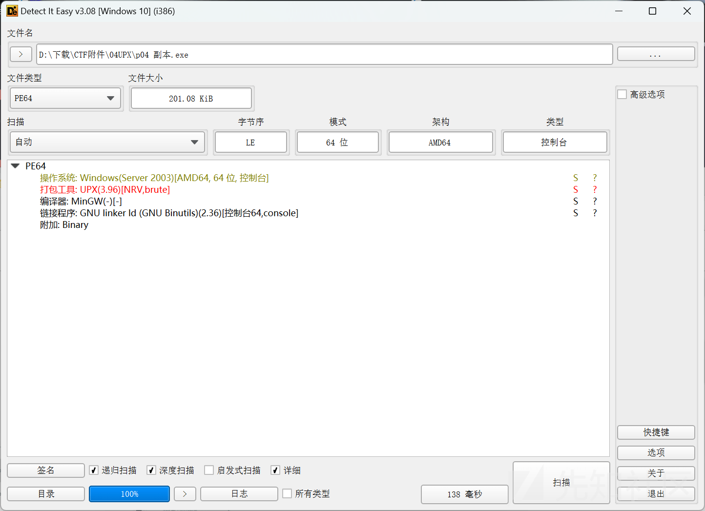

exeinfope eg:

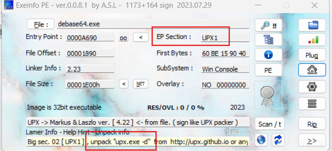

我们可以看到程序使用的操作系统位数、加壳的情况等等。

如果对应EP Section被修改，需要使用二进制编辑工具修改相关内容，UPX需为大写且共有三处

## 脱壳

### 工具脱

使用官方工具 upx.exe ，使用命令即为 upx.exe -d <文件(加后缀)>

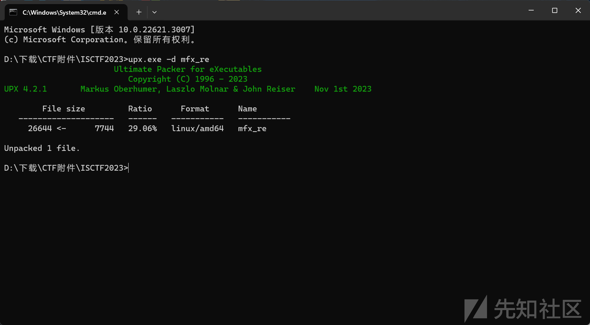

### 手脱UPX壳--x64dbg为例

### 原理

upx壳压缩过程：

1.在程序的开头或者其他合适的地方插入一段代码

2.将程序的其他地方压缩，顺带起到混淆作用

解压缩过程：

upx壳在程序执行时实时解压，原理如下

```
参考：https://blog.csdn.net/zacklin/article/details/7419001
1==>2==>3==>4==>5==>6  
假设1是upx插入的代码，2，3，4是压缩后的代码。5，6是随便的什么东西。  
程序从1开始执行。而1的功能是将2，3，4解压缩为7，8，9。7，8，9就是2，3，4在压缩之前的形式。  
1==>7==>8==>9==>5==>6  

连起来就是：  

最初代码的形式就应该是：7==>8==>9==>5==>6 
用upx压缩之后形式为：1==>2==>3==>4==>5==>6 
执行时的形式变为：1==>7==>8==>9==>5==>6  
```

### 实操

```
#include<stdio.h>
int main()
{
	printf("hello_world");
	puts("a test for decompresing");
}
```

一个简单样例加个壳: upx 1.exe

x64dbg进入

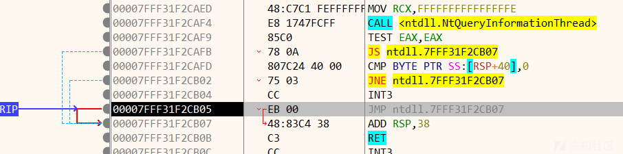

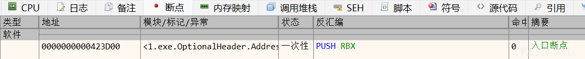

可以看到系统断点，f9运行至断点处

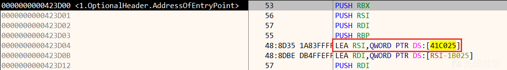

f7步进完压栈内容至lea指令处，找到rsp对应位置下硬件断点

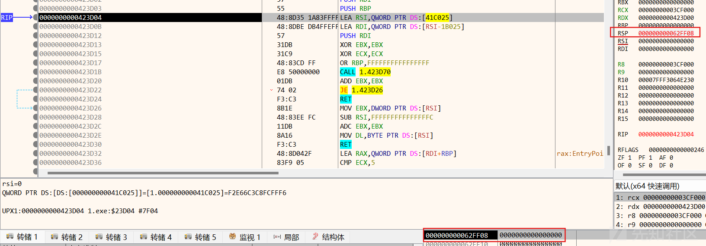

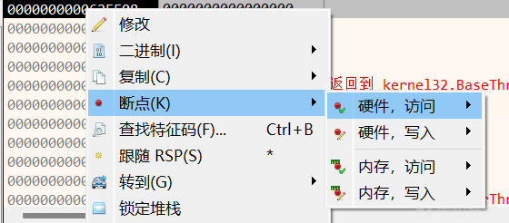字节影响不大

然后f9可以看到pop和1.exe程序对应的函数调用，中间的jne循环用于补齐缺失的栈段空间

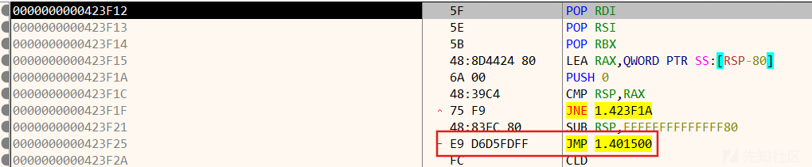

下断点运行至该处然后步进

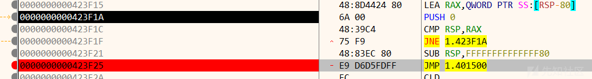

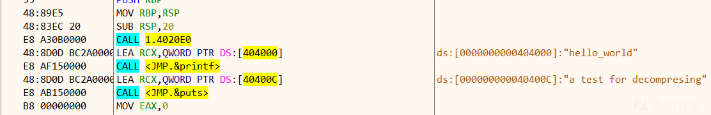

可以看到进入源程序内部了，使用自带插件Scylla dump(丢弃；脱壳 )

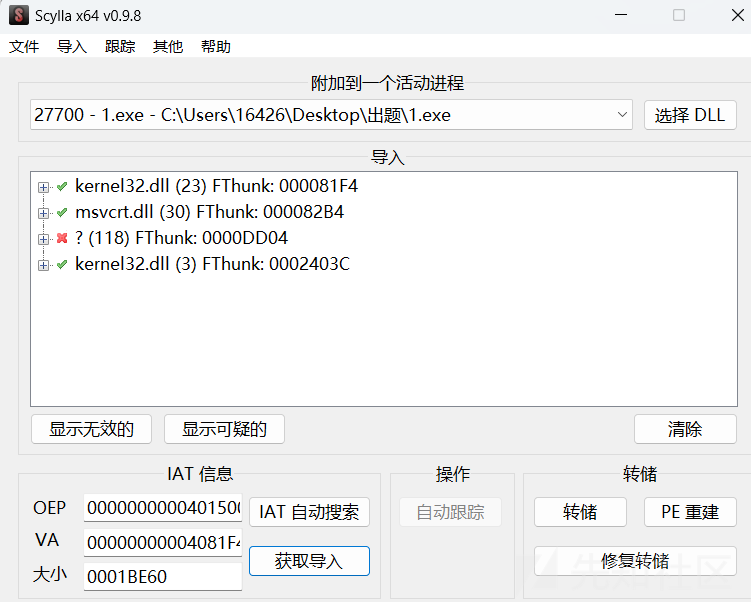

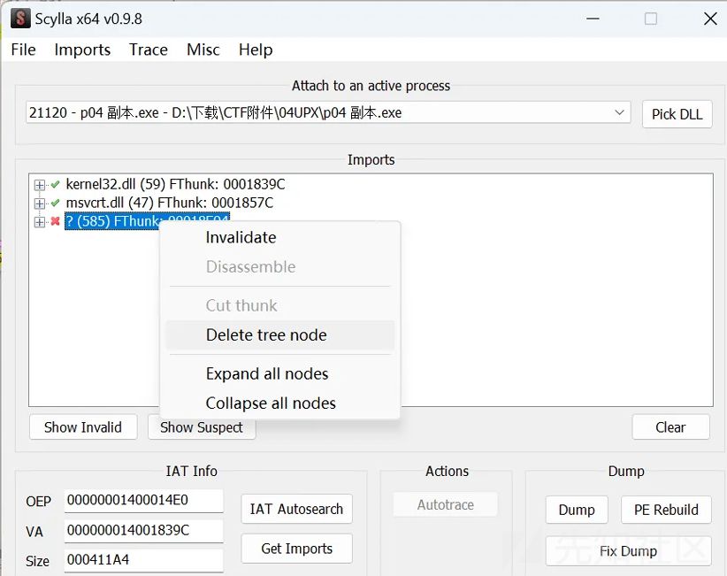

1.IAT自动搜索/IAT Autosearch; 2. 获取导入/Get Imports; 3.删除红叉所在行； 4.转储/Dump;

5.修复转储/Fix Dump 选择dump的文件即可

### 总结

push过程的栈内容用于解压代码，下断点跟踪栈内容至pop指令下方找到程序函数调用确定程序入口点再插件记录脱壳即可

# 算法逆向

新手入门就常见两个base64和rc4，rsa等加密算法其余学长会给予介绍

## base64

严格来讲，base系列不能说是加密，更像是一种编码方式，用于传输协议仅支持ascii字符的情况

原理：

首先将输入数据分割成每三个字节（共 24 位）一组，接着将这 24 位分割为四个 6 位的块（因为 Base64 中每个字符代表 6 位二进制数据）。最后，通过查找表将这些 6 位块映射为相应的 Base64 字符。若输入数据的字节数非 3 的倍数，则在数据末尾添加 = 字符作为填充，以确保编码结果的长度符合 Base64 规范。

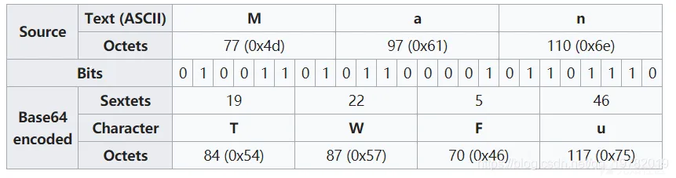

涉及字符：A-Za-z0-9+/= (这也是标准base64表)

补位：

网上介绍算法的有很多，但是补位不太详细，参考这篇文章<https://xie.infoq.cn/article/d4ea16f136f588f41e9d8b73f>

如果字节数不是 3 的倍数，那么余数可能是 1 或 2，所以补位也需要分两种情况。

余数为 1，二进制末尾补 4 个 0，最后多出来的这个字符会编码成 2 个 base64 字符，最后再补两个=，比如宋的拼音 song，余数为 1

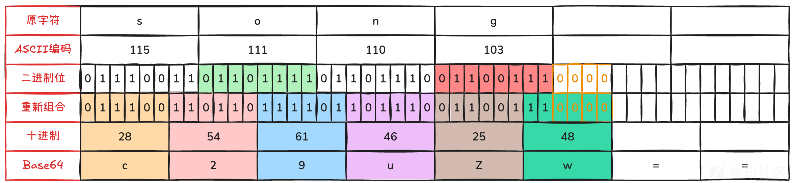

在这基础上最后还得补上 2 个 =，最终 song 编码为 c29uZw==

余数为 2，二进制末尾补 2 个 0，编码后末尾再补 1 个 =，比如 ab，余数为 2

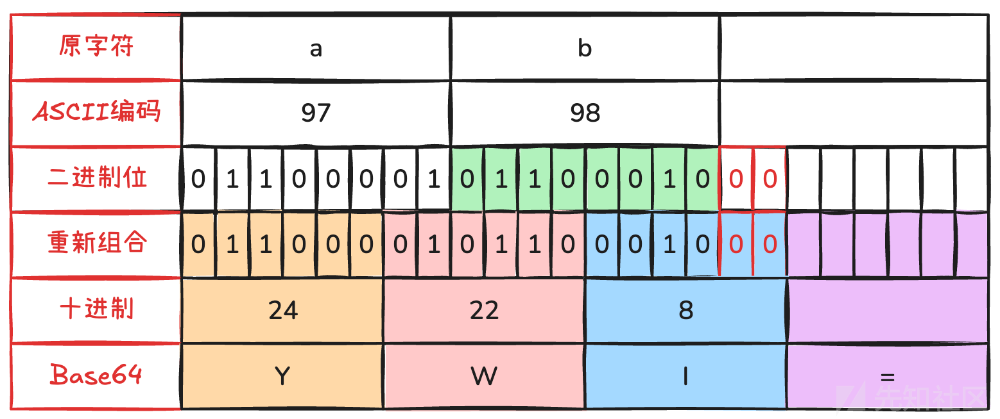

最终 ab 编码为 YWI=

加解密实现：

工具：网上有很多加解密base的在线网站，首推cyberchef，misc学长有介绍过

手搓：

```
import base64

def base64_encode(data):
    """
    Base64编码过程：
    1. 将输入字符串转换为字节序列
    2. 将每个字节转换为8位二进制
    3. 重新分组为6位二进制段
    4. 将6位二进制转换为十进制索引
    5. 根据索引表替换为对应字符
    6. 处理填充（添加=字符）
    """
    # Base64索引表
    base64_chars = "ABCDEFGHIJKLMNOPQRSTUVWXYZabcdefghijklmnopqrstuvwxyz0123456789+/"

    # 将输入字符串转换为字节
    if isinstance(data, str):
        data_bytes = data.encode('utf-8')
    else:
        data_bytes = data

    binary_str = ''
    # 将每个字节转换为8位二进制并拼接
    for byte in data_bytes:
        binary_str += format(byte, '08b')

    # 计算需要填充的位数（6位一组）
    padding = 0
    if len(binary_str) % 6 != 0:
        padding = (6 - len(binary_str) % 6) % 6
        binary_str += '0' * padding

    # 每6位一组转换为十进制索引
    encoded = []
    for i in range(0, len(binary_str), 6):
        chunk = binary_str[i:i+6]
        index = int(chunk, 2)
        encoded.append(base64_chars[index])

    # 添加填充字符'='
    # 原始数据字节数不是3的倍数时进行填充
    if padding > 0:
        # 实际填充字符数 = 缺少的字节数（每缺1字节补一个=）
        padding_chars = (padding // 2)  # 每2个填充位对应一个填充字符
        for _ in range(padding_chars):
            encoded.append('=')

    return ''.join(encoded)

def base64_decode(encoded_data):
    """
    Base64解码过程：
    1. 移除填充字符'='并计算原始数据长度
    2. 将每个字符转换为6位二进制
    3. 重新分组为8位二进制段
    4. 将8位二进制转换为字节
    5. 将字节序列解码为字符串
    """
    # Base64索引表
    base64_chars = "ABCDEFGHIJKLMNOPQRSTUVWXYZabcdefghijklmnopqrstuvwxyz0123456789+/"

    # 计算填充字符数量
    padding = encoded_data.count('=')
    # 移除填充字符
    encoded_data = encoded_data.rstrip('=')

    binary_str = ''
    # 将每个字符转换为6位二进制
    for char in encoded_data:
        if char not in base64_chars:
            continue
        index = base64_chars.index(char)
        binary_str += format(index, '06b')

    # 移除填充添加的额外0位
    if padding:
        binary_str = binary_str[:-(padding * 2)]  # 每个=对应移除2位

    # 每8位一组转换为字节
    decoded_bytes = bytearray()
    for i in range(0, len(binary_str), 8):
        chunk = binary_str[i:i+8]
        if len(chunk) < 8:
            break  # 丢弃不完整的字节
        byte_val = int(chunk, 2)
        decoded_bytes.append(byte_val)

    return bytes(decoded_bytes).decode('utf-8')

# 测试示例
if __name__ == "__main__":
    original = "Hello, 世界! ✨"
    print("原始数据:", original)

    # 自定义编码
    encoded_custom = base64_encode(original)
    print("
自定义编码结果:", encoded_custom)

    # 标准库编码验证
    encoded_std = base64.b64encode(original.encode('utf-8')).decode()
    print("标准库编码结果:", encoded_std)
    print("编码结果一致:", encoded_custom == encoded_std)

    # 自定义解码
    decoded_custom = base64_decode(encoded_custom)
    print("
自定义解码结果:", decoded_custom)

    # 标准库解码验证
    decoded_std = base64.b64decode(encoded_std).decode('utf-8')
    print("标准库解码结果:", decoded_std)
    print("解码结果一致:", decoded_custom == decoded_std)
```

代码理解为主，现在很多解密基本都是调用相关库函数解密，涉及密文密钥之类的格式处理，不外显具体加解密过程，前面的算法介绍有点简陋，这里结合ai注释理解更方便一点

## rc4

rc4算是序列密码里的经典了，序列密码主要重心放在密钥流生成，加解密其实就是一个xor，很多时候没有魔改的话直接动态调试一遍输入密文就能得到明文，参考下图

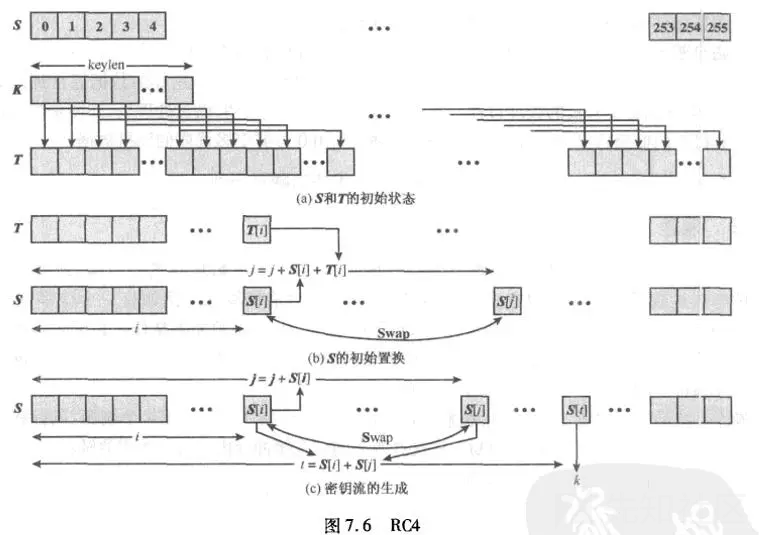

结合代码看应该更清楚

```
def rc4(key, data):
    """
    RC4加密/解密函数
    :param key: 密钥（字节串或字符串）
    :param data: 要加密/解密的数据（字节串）
    :return: 加密/解密后的字节串
    """
    # 如果密钥是字符串，转换为字节串
    if isinstance(key, str):
        key = key.encode('utf-8')
    
    # 1. 初始化S盒
    S = list(range(256))
    j = 0
    
    # 2. 密钥调度算法（KSA）
    for i in range(256):
        j = (j + S[i] + key[i % len(key)]) % 256
        S[i], S[j] = S[j], S[i]  # 交换元素
    
    # 3. 伪随机生成算法（PRGA）和加密
    i = j = 0
    result = bytearray()
    
    for char in data:
        i = (i + 1) % 256
        j = (j + S[i]) % 256
        S[i], S[j] = S[j], S[i]  # 交换元素
        k = S[(S[i] + S[j]) % 256]  # 生成密钥流字节
        result.append(char ^ k)  # 异或操作
    
    return bytes(result)

# 示例用法
if __name__ == "__main__":
    # 加密演示
    plaintext = "Hello, World! 你好，世界！"
    key = "SecretKey"
    
    # 加密
    ciphertext = rc4(key, plaintext.encode('utf-8'))
    print("加密结果（十六进制）:", ciphertext.hex())
    print("加密结果（Base64）: ", ciphertext.hex())
    
    # 解密演示
    decrypted = rc4(key, ciphertext)
    print("解密结果:", decrypted.decode('utf-8'))
```

**1. 初始化阶段**

```
S = list(range(256))
j = 0
```

* **创建S盒**：初始化一个长度为256的数组 S，值从0到255（ [ 0, 1, 2, ..., 255 ] ）

**2. 密钥调度算法（KSA）**

```
for i in range(256):
    j = (j + S[i] + key[i % len(key)]) % 256
    S[i], S[j] = S[j], S[i]  # 交换元素
```

* **密钥混合**：

* 遍历 i 从0到255。
* 计算索引 j ：  
  j = (当前j + S[i] + 密钥字节) % 256  
  其中 密钥字节 = key[i % len(key)]（循环使用密钥）。
* **交换** S[i]和S[j]：打乱S盒的初始顺序。

* **目的**：将密钥的随机性扩散到整个S盒中。

**示例**：密钥"Secret"（十六进制53 65 63 72 65 74）

当i=0时：j = (0 + S[0] + key[0]) % 256 = (0 + 0 + 0x53) % 256 = 83，交换S[0]和S[83]。

**3. 伪随机生成算法（PRGA）与加密**

```
i = j = 0
result = bytearray()

for char in data:
    i = (i + 1) % 256
    j = (j + S[i]) % 256
    S[i], S[j] = S[j], S[i]  # 交换元素
    k = S[(S[i] + S[j]) % 256]  # 生成密钥流字节
    result.append(char ^ k)  # 异或加密
```

* **生成密钥流字节**：

a. 更新索引i = (i + 1) % 256。

b. 更新索引j = (j + S[i]) % 256。

c. 交换S[i]和S[j]（动态修改S盒）。

d. 计算密钥字节k = S[(S[i] + S[j]) % 256]。

* **加密/解密**：  
  将明文/密文字节char与密钥流字节k进行异或操作（char ^ k）。
