# Reverse入门参考(二)-先知社区

> **来源**: https://xz.aliyun.com/news/18514  
> **文章ID**: 18514

---

pyc，tea类加解密，花指令

# pyc反编译

## 引言

逆向就是逆向应用程序，代码，算法的过程，途中会涉及很多类型的文件基于不同平台生成

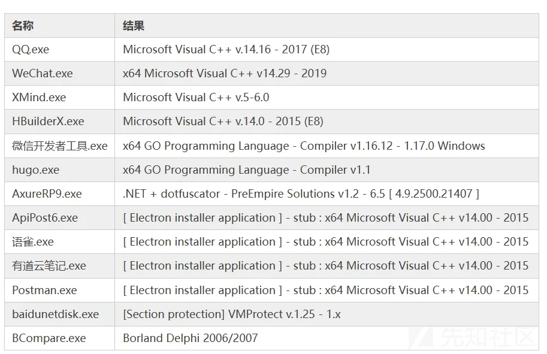

不同的exe有不同的逆法，当然可以直接手撕，但效率低很多

而pyc文件则是python代码编译后生成exe的中间产物，所以通常用工具将其还原为python原代码进行逆向

## 知识点介绍

### PYC文件格式

.pyc文件是python解释器在编译.py文件后生成的二进制文件，其格式类似于java的.class文件，具有跨平台性。.pyc文件包含Python字节码，这些字节码是由Python虚拟机执行的，与Java或.NET的虚拟机概念相似，实现了跨平台运行。.pyc文件的生成提高了程序的加载速度，并且它们是pycodeobject对象的持久化保存方式。PyCodeObject是Python完全面向对象语言在解释器中解释执行时生成的对象。当Python程序运行结束时，解释器会将PyCodeObject写回到.pyc文件中，以便下次运行时可以直接加载，提高运行效率。

.pyc文件的基本格式包括：

* 一个[**Magic int**](https://www.baidu.com/s?wd=Magic%20int&rsv_idx=2&tn=baiduhome_pg&usm=2&ie=utf-8&rsv_pq=e184d3af00081af7&oq=pyc%E6%96%87%E4%BB%B6%E6%A0%BC%E5%BC%8F&rsv_t=4ce8p1nrYiaD0A9YmnmciqnmPZkqBYQUWK8RG5vvjXDBkXAWtKNRY9h%2FMA0iNr2116nj&sa=re_dqa_zy&icon=1)，标识pyc的版本信息。
* 一个int，表示pyc产生的时间（从1970年1月1日到产生pyc时的秒数）。
* 一个序列化的PyCodeObject，包含Python代码的字节码表示。

PyCodeObject的序列化过程涉及写入不同类型的PyObject，每种PyObject都有一个标识其类型的[**byte**](https://www.baidu.com/s?wd=byte&rsv_idx=2&tn=baiduhome_pg&usm=2&ie=utf-8&rsv_pq=e184d3af00081af7&oq=pyc%E6%96%87%E4%BB%B6%E6%A0%BC%E5%BC%8F&rsv_t=4ce8p1nrYiaD0A9YmnmciqnmPZkqBYQUWK8RG5vvjXDBkXAWtKNRY9h%2FMA0iNr2116nj&sa=re_dqa_zy&icon=1)，以及PyObject的具体数据内容。例如，变长对象（如str, tuple, list等）通常还包含一个4字节的长度。

此外，Python提供了优化编译的选项，如-O用于生成优化的字节码文件.pyo，而-m用于导入并运行指定的模块，生成.pyc文件。这些优化对于减少嵌入式系统的容量需求或提高程序运行效率是有益的。

### **4个字节的****Magic number**

魔数介绍：[python magic number\_编程中的「魔数」（magic number）是什么意思？平时我们能接触到哪些魔数？...-CSDN博客](https://blog.csdn.net/weixin_39787628/article/details/110835123)

各版本魔术头：[Python逆向全版本MagicNumber表\_python magic number-CSDN博客](https://blog.csdn.net/OrientalGlass/article/details/134612786)

```
enum PycMagic {
    MAGIC_1_0 = 0x00999902,
    MAGIC_1_1 = 0x00999903, /* Also covers 1.2 */
    MAGIC_1_3 = 0x0A0D2E89,
    MAGIC_1_4 = 0x0A0D1704,
    MAGIC_1_5 = 0x0A0D4E99,
    MAGIC_1_6 = 0x0A0DC4FC,
 
    MAGIC_2_0 = 0x0A0DC687,
    MAGIC_2_1 = 0x0A0DEB2A,
    MAGIC_2_2 = 0x0A0DED2D,
    MAGIC_2_3 = 0x0A0DF23B,
    MAGIC_2_4 = 0x0A0DF26D,
    MAGIC_2_5 = 0x0A0DF2B3,
    MAGIC_2_6 = 0x0A0DF2D1,
    MAGIC_2_7 = 0x0A0DF303,
 
    MAGIC_3_0 = 0x0A0D0C3A,
    MAGIC_3_1 = 0x0A0D0C4E,
    MAGIC_3_2 = 0x0A0D0C6C,
    MAGIC_3_3 = 0x0A0D0C9E,
    MAGIC_3_4 = 0x0A0D0CEE,
    MAGIC_3_5 = 0x0A0D0D16,
    MAGIC_3_5_3 = 0x0A0D0D17,
    MAGIC_3_6 = 0x0A0D0D33,
    MAGIC_3_7 = 0x0A0D0D42,
    MAGIC_3_8 = 0x0A0D0D55,
    MAGIC_3_9 = 0x0A0D0D61,
    MAGIC_3_10 = 0x0A0D0D6F,
    MAGIC_3_11 = 0x0A0D0DA7,
    MAGIC_3_12 = 0x0A0D0DCB,
 
    INVALID = 0,
};
```

遇到魔改题目修改的时候注意调整端序，此处涉及大小端序问题，可自行上网搜索

### **12 个字节的源代码文件信息**

（不同版本的 Python 包含的⻓度和信息都不⼀样）

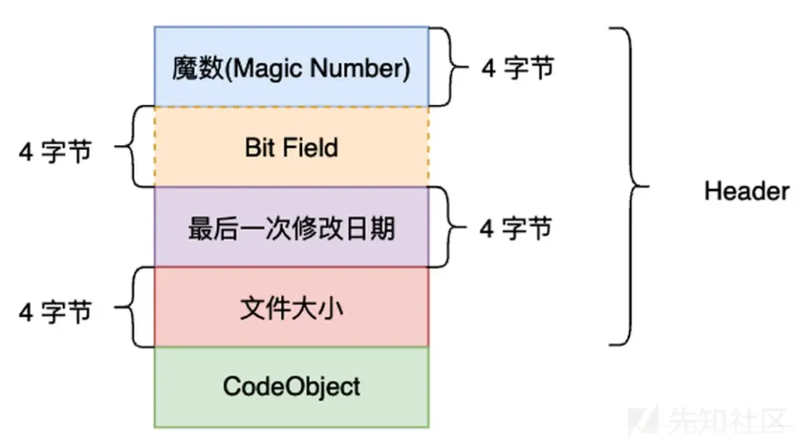

bit field：位域是指信息在存储时,并不需要占用一个完整的字节,而只需占一个或几个二进制位

例如在存放一个开关量时,只有0和1两种状态,用一位二进位即可

为了节省存储空间,C语言又提供了一种数据结构,称为"位域"

所谓"位域"就是把一个字节中的二进位划分为几个不同的区域,并说明每个区域的位数

每个域有一个域名,允许在程序中按域名进行操作

这样就可以把几个不同的对象用一个字节的二进制位域来表示

比如cpu中的[程序状态字](https://baike.baidu.com/item/%E7%A8%8B%E5%BA%8F%E7%8A%B6%E6%80%81%E5%AD%97/0?fromModule=lemma_inlink)PSW，字节中不同的位表示不同的状态信息，称位标志位。

### **序列化之后的 PyCodeObject**

PyCodeObject是Python中代码对象的内部表示，它是编译后的Python代码的内部结构。序列化指的是将对象或数据结构转换成可存储或传输的格式的过程。在Python中，你可以使用 pickle 模块来序列化PyCodeObject

大致流程： .exe --> .pyc --> .py

参考链接：[https://xz.aliyun.com/news/12546](https://xz.aliyun.com/news/12546?time__1311=eqUxu7DtD%3DPmqDKDsuRRBbEx0KGQqdCbq4D&u_atoken=c2be98df2b175a1d2ceb006eef71232d&u_asig=1a0c381017439881621575469e0045)

## 工具

exe->pyc 涉及文件 **pyinstxtractor.py**

pyc->py 常见的就 **pycdc** 和 **uncompyle6(**python环境自行pip安装**)** ，uncompyle6对应python3.8及以下版本，pycdc对应3.8及以上版本，推荐直接使用在线网站反编译

网站链接：<https://tool.lu/pyc>

懒人选项： **pydumpck**

参考链接：[**https://blog.csdn.net/u012132482/article/details/127131503**](https://blog.csdn.net/u012132482/article/details/127131503)

## 使用

拿到一个exe文件

开放实验网站原题pymaze

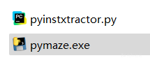

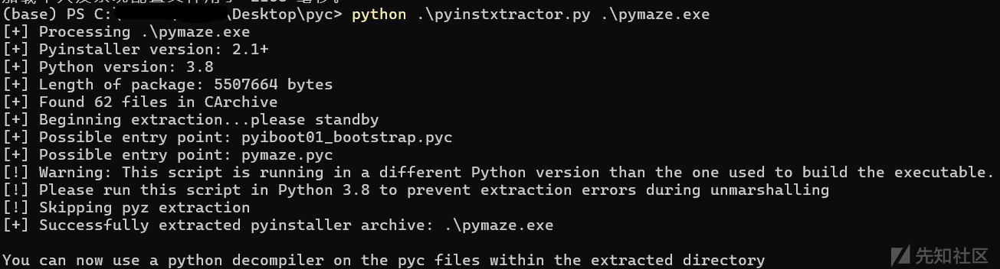

会在当前目录下生成一个提取的文件夹


找到里面对应exe的pyc文件

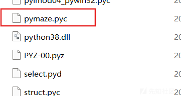

使用对应版本工具

eg:

```
uncompyle6 pymaze.pyc > 1.py
pycdc.exe pymaze.pyc > 2.py
```

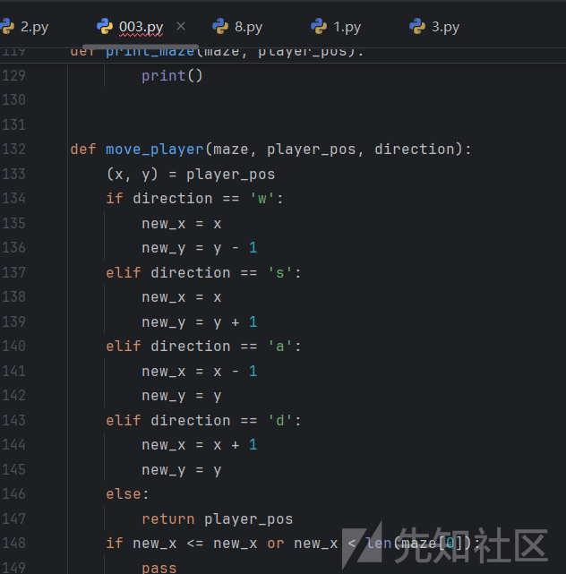

## 特殊情况

exe->pyc这一步pyinstxtractor.py运行可能会报错，因为python exe文件是基于本地python版本生成的，不同版本会出现兼容问题

解决方法：

1.（不推荐）tips:如果你使用 pyinstxtractor，请在 pyinstxtractor.py 找到 # Skip PYZ extraction if not running under the same python version 然后将它下面五行的 return 注释掉（让 return 不生效）。否则，你运行 pyinstxtractor.py 时使用的 Python 小版本号必须与附件相同。或者，你也可以尝试使用更方便的工具，例如 pydumpck 。

2. 使用anaconda管理本地python版本，可根据version的提示创建对应版本虚拟环境

有些题目会遇到py代码里导入相关自定义函数，可以在提取的文件夹里找对应名字的pyc文件反编译成py放入应用程序py文件同一目录下即可

还有些恶心题目无法反编译，需要用到pycdas将pyc文件编译成字节码，分析类似汇编代码

## 拓展(反编译加密pyc文件)

提一嘴(\_.--.\_)小插曲

PYD文件: PYD文件是Python的一种拓展模块文件格式，本质上是windows动态链接库(DLL)，转为Python涉及，

以后的题目会接触到PYD逆向

### 分析

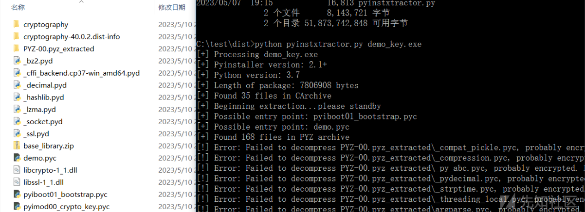

在反编译python生成可执行文件exe时，引用的类库文件经常遇到使用Crypto 模块AES算法加密，解包生成的并不是pyc文件，而是加密的pyc.encrypted文件，此类加密文件无法反编译

主要跟pyinstaller生成exe时的操作有关

```
picture.ico为图标：
PyInstaller -F -i picture.ico -n noPac.exe noPac.py
 
打包成独立exe：
PyInstaller -F --version-file ver.txt noPac.py
# 多文件
pyinstaller -D noPac.py
# 单个可执行文件
pyinstaller -F noPac.py
 
加密打包exe（加密只针对依赖库）：
但是要安装tinyaes：pip install tinyaes
pyinstaller -F --key 123456 xxx.py
```

PYZ-00.pyz\_extracted 文件夹里面为依赖库

### 解密流程

第一步，获取Crypto 的key，这是打包时由开发者指定的。解包完成后将在根目录形成名为"pyimod00\_crypto\_key.pyc"的文件，将它转为py文件即可查看key文件；

eg.iscc2025-re-看小品

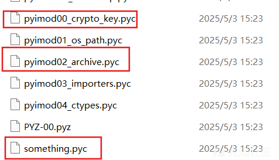

重点就在这三个用pyinstxtractor.py解包后的pyc文件，something是源代码pyc

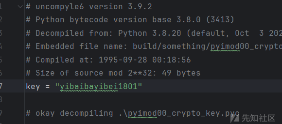

crypto\_key会给出密钥

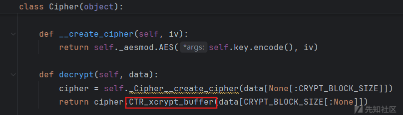

archive则关注Cipher类，会有加密方式和图示类，该类归属于package tinyaes

这里涉及pyinstaller版本问题


不同版本对应不同的解密脚本

### 解密代码

备注：解密后的内容写入创建的pyc文件时需要写入magic number等头文件信息

```
Python 2.7: \x03\xf3\x0d\x0a\0\0\0\0
Python 3.0: \x3b\x0c\x0d\x0a\0\0\0\0
Python 3.1: \x4f\x0c\x0d\x0a\0\0\0\0
Python 3.2: \x6c\x0c\x0d\x0a\0\0\0\0
Python 3.3: \x9e\x0c\x0d\x0a\0\0\0\0\0\0\0\0
Python 3.4: \xee\x0c\x0d\x0a\0\0\0\0\0\0\0\0
Python 3.5: \x17\x0d\x0d\x0a\0\0\0\0\0\0\0\0
Python 3.6: \x33\x0d\x0d\x0a\0\0\0\0\0\0\0\0
Python 3.7: \x42\x0d\x0d\x0a\0\0\0\0\0\0\0\0\0\0\0\0
Python 3.8: \x55\x0d\x0d\x0a\0\0\0\0\0\0\0\0\0\0\0\0
Python 3.9: \x61\x0d\x0d\x0a\0\0\0\0\0\0\0\0\0\0\0\0
Python 3.10: \x6f\x0d\x0d\x0a\0\0\0\0\0\0\0\0\0\0\0\0
```

pyinstaller < 4.0

```
# For pyinstaller < 4.0
import glob
import zlib
from Crypto.Cipher import AES
from pathlib import Path
 
CRYPT_BLOCK_SIZE = 16
 
# key obtained from pyimod00_crypto_key
key = bytes('MySup3rS3cr3tK3y', 'utf-8')
 
for p in Path("PYZ-00.pyz_extracted").glob("**/*.pyc.encrypted"):
	inf = open(p, 'rb') # encrypted file input
	outf = open(p.with_name(p.stem), 'wb') # output file 
 
	# Initialization vector
	iv = inf.read(CRYPT_BLOCK_SIZE)
 
	cipher = AES.new(key, AES.MODE_CFB, iv)
 
	# Decrypt and decompress
	plaintext = zlib.decompress(cipher.decrypt(inf.read()))
 
	# Write pyc header
	# The header below is for Python 3.8
	outf.write(b'\x55\x0d\x0d\x0a\0\0\0\0\0\0\0\0\0\0\0\0')
 
	# Write decrypted data
	outf.write(plaintext)
 
	inf.close()
	outf.close()
 
	# Delete .pyc.encrypted file
	p.unlink()
```

版本>= 4.0

```
# For pyinstaller >=4.0
import glob
import zlib
import tinyaes
from pathlib import Path
 
CRYPT_BLOCK_SIZE = 16
 
# key obtained from pyimod00_crypto_key
key = bytes('MySup3rS3cr3tK3y', 'utf-8')
 
for p in Path("PYZ-00.pyz_extracted").glob("**/*.pyc.encrypted"):
	inf = open(p, 'rb') # encrypted file input
	outf = open(p.with_name(p.stem), 'wb') # output file 
 
	# Initialization vector
	iv = inf.read(CRYPT_BLOCK_SIZE)
 
	cipher = tinyaes.AES(key, iv)
 
	# Decrypt and decompress
	plaintext = zlib.decompress(cipher.CTR_xcrypt_buffer(inf.read()))
 
	# Write pyc header
	# The header below is for Python 3.8
	outf.write(b'\x55\x0d\x0d\x0a\0\0\0\0\0\0\0\0\0\0\0\0')
 
	# Write decrypted data
	outf.write(plaintext)
 
	inf.close()
	outf.close()
 
	# Delete .pyc.encrypted file
	p.unlink()
```

# TEA加密解密

如下是一个示例参考代码

```
import struct

def encrypt(plaintext, key):
    """
    TEA 加密函数
    :param plaintext: 8字节明文字符串
    :param key: 16字节密钥字符串
    :return: 8字节密文字符串
    """
    # 将输入拆分为两个32位整数
    v0, v1 = struct.unpack(">2I", plaintext)
    
    # 将密钥拆分为四个32位整数
    k = struct.unpack(">4I", key)
    
    # 初始化常量
    delta = 0x9E3779B9
    sum_val = 0
    
    # 进行32轮加密
    for _ in range(32):
        sum_val = (sum_val + delta) & 0xFFFFFFFF
        v0 += ((v1 << 4) + k[0]) ^ (v1 + sum_val) ^ ((v1 >> 5) + k[1])
        v0 &= 0xFFFFFFFF
        v1 += ((v0 << 4) + k[2]) ^ (v0 + sum_val) ^ ((v0 >> 5) + k[3])
        v1 &= 0xFFFFFFFF
    
    # 返回拼接后的密文
    return struct.pack(">2I", v0, v1)

def decrypt(ciphertext, key):
    """
    TEA 解密函数
    :param ciphertext: 8字节密文字符串
    :param key: 16字节密钥字符串
    :return: 8字节明文字符串
    """
    # 将输入拆分为两个32位整数
    v0, v1 = struct.unpack(">2I", ciphertext)
    
    # 将密钥拆分为四个32位整数
    k = struct.unpack(">4I", key)
    
    # 初始化常量
    delta = 0x9E3779B9
    sum_val = (delta * 32) & 0xFFFFFFFF
    
    # 进行32轮解密
    for _ in range(32):
        v1 -= ((v0 << 4) + k[2]) ^ (v0 + sum_val) ^ ((v0 >> 5) + k[3])
        v1 &= 0xFFFFFFFF
        v0 -= ((v1 << 4) + k[0]) ^ (v1 + sum_val) ^ ((v1 >> 5) + k[1])
        v0 &= 0xFFFFFFFF
        sum_val = (sum_val - delta) & 0xFFFFFFFF
    
    # 返回拼接后的明文
    return struct.pack(">2I", v0, v1)

# 测试代码
if __name__ == "__main__":
    # 测试密钥 (16字节)
    key = b"1234567890abcdef"
    
    # 测试明文 (8字节)
    plaintext = b"ABCDabcd"
    
    print("原始明文:", plaintext)
    
    # 加密
    ciphertext = encrypt(plaintext, key)
    print("加密结果:", ciphertext.hex())
    
    # 解密
    decrypted = decrypt(ciphertext, key)
    print("解密结果:", decrypted)
    
    # 验证
    assert decrypted == plaintext, "解密结果与原始明文不匹配"
    print("验证成功: 解密结果与原始明文一致")
```

## 逆向

介绍一个ida插件findcrypto，具体原理是识别对应加密算法特征字样，在魔改环境中收效甚微

这里用findcypto插件来进行识别测试，0x9e3779b9特征码被识别

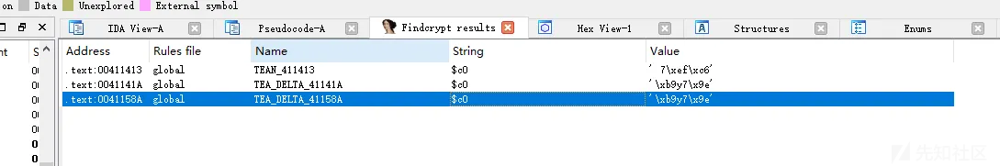

其实看出tea算法不难，当初鄙人主要卡在unsigned int 之类的变量类型上导致不会写解密代码

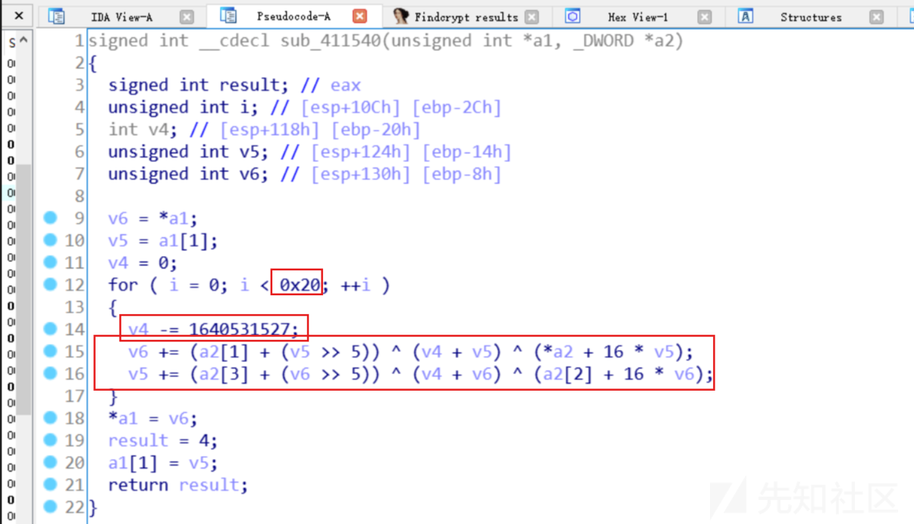

上图即逆向过程中遇到的实际加密过程呈现，32轮，对应sum，delta和两个变量

这里总结了下ida以及C语言等的变量类型，主要是不同平台和语言导致的一些细节处理

### \_int类

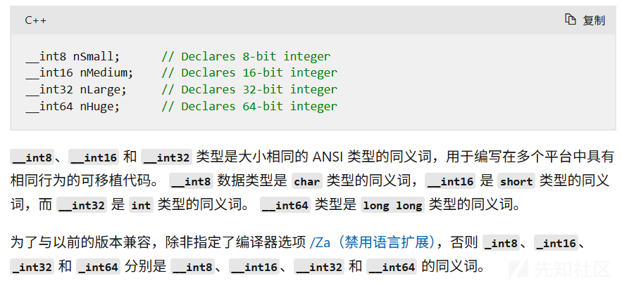

### unsigned int

unsigned int 和 signed int Eg. 00000000 0 | 0000000 (方便理解，实际unsigned int 为四字节32位)

主要就是最高位符号位，前者un不考虑符号位，8位用于0-2^8-1，后者1位符号位，1表示负数，0表示正数，剩余七位表示数字大小

### uint类

主要有uint8\_t / uint16\_t / uint32\_t / uint64\_t

由 C99标准（ISO/IEC 9899:1999） 引入，在头文件 <stdint.h> 中定义（C++中可包含<cstdint>）。

定义原理：通过typedef将基础类型映射到固定宽度的别名，具体实现依赖编译器和平台

这些是C/C++标准中定义的固定宽度的无符号整数类型别名，通过typedef实现。

它们明确指定了整数的位宽度：

uint8\_t：精确占用 8位 的无符号整数

uint16\_t：精确占用 16位 的无符号整数

uint32\_t：精确占用 32位 的无符号整数

uint64\_t：精确占用 64位 的无符号整数

核心作用：

提供跨平台的一致性。不同硬件/编译器的基础类型（如int、long的大小可能不同），而uintX\_t能确保在任何平台上宽度固定，适合底层编程（如网络协议、硬件寄存器操作）。

有符号版本：int8\_t, int16\_t, int32\_t, int64\_t 参考\_int类

### 注意事项

编写解密代码更推荐用C语言，用python会出现一些精度问题

```
#include <stdio.h>
#include <stdint.h>

int main() {
    uint32_t v[2] = {1, 2};
    uint32_t v0 = v[0], v1 = v[1], sum, i; /* set up */
    uint32_t delta = 0x61C88647;
    uint32_t v5[10] = {0x85336dd3,0x2a7a7c3b,0x64306238,0x36396434,0x62336364,0x38376533,0x37323664,0x33363463,0xf8ee8ea2,0xc9b65cce};
    unsigned int k[4] = {2,0,2,4}, l = 0, r = 0;
    uint32_t k0 = k[0], k1 = k[1], k2 = k[2], k3 = k[3];
    for (int m = 0; m < 10; m += 2) {
        sum = delta*(-32);
        for (i = 0; i < 32; i++) { 
            v5[m + 1] -= ((v5[m] << 4) + k2) ^ (v5[m] + sum) ^ ((v5[m] >> 5) + k3);
            v5[m] -= ((v5[m + 1] << 4) + k0) ^ (v5[m + 1] + sum) ^ ((v5[m + 1] >> 5) + k1);
            sum += delta;
        } 
    }

    for (int i = 0; i < 10; i++) {
        for (int m = 0; m <= 3; m++) {
            printf("%c", (v5[i] >> (8 * m)) & 0xff);
        }
    }
    return 0;
}
```

明密文是32位32位取的，两位为一组，32轮循环只是其中的一轮加密，重点关注明密文存取的对应代码块，有些是1 2 3 4俩俩一组，有些则是1 2 2 3这样有关联的分组，还有些是按其顺序倒序解密

## 进阶

涉及到xtea和xxtea算法了，这里仅对后两者特征做一个介绍

xtea为tea的升级版，摒弃了 TEA 固定循环使用密钥的方式，引入了一个更复杂的密钥生成函数。子密钥不再是直接从密钥数组中按固定顺序取出，而是根据当前的轮次 i 和部分明文（通常是 sum 的值）动态计算出来：

( (sum >> 11) & 3 )

这个值用于索引密钥数组 K[0..3]，然后结合 sum 和密钥 K[index] 计算出该轮实际使用的子密钥 Delta。

xxtea则是拓展版，用于解决tea系列加密的分组大小限制，但是受选择明文攻击威胁

以下是两种算法代码

```
#include <stdio.h>
#include <stdint.h>
void encipher(unsigned int num_rounds, uint32_t v[2], uint32_t const key[4])
{
    unsigned int i;
    uint32_t v0=v[0], v1=v[1], sum=0, delta=0x9E3779B9;
    for (i=0; i < num_rounds; i++) {
        v0 += (((v1 << 4) ^ (v1 >> 5)) + v1) ^ (sum + key[sum & 3]);
        sum += delta;
        v1 += (((v0 << 4) ^ (v0 >> 5)) + v0) ^ (sum + key[(sum>>11) & 3]);
    }
    v[0]=v0; v[1]=v1;
}

void decipher(unsigned int num_rounds, uint32_t v[2], uint32_t const key[4]) {
    unsigned int i;
    uint32_t v0=v[0], v1=v[1], delta=0x9E3779B9, sum=delta*num_rounds;
    for (i=0; i < num_rounds; i++) {
        v1 -= (((v0 << 4) ^ (v0 >> 5)) + v0) ^ (sum + key[(sum>>11) & 3]);
        sum -= delta;
        v0 -= (((v1 << 4) ^ (v1 >> 5)) + v1) ^ (sum + key[sum & 3]);
    }
    v[0]=v0; v[1]=v1;
}

int main()
{
    uint32_t v[2]={1,2};
    uint32_t const k[4]={2,2,3,4};
    unsigned int r=32;//num_rounds建议取值为32// v为要加密的数据是两个32位无符号整数// k为加密解密密钥，为4个32位无符号整数，即密钥长度为128位
    printf("加密前原始数据：%u %u
",v[0],v[1]);
    encipher(r, v, k);
    printf("加密后的数据：%u %u
",v[0],v[1]);
    decipher(r, v, k);
    printf("解密后的数据：%u %u
",v[0],v[1]);
    return 0;
}
```

```
#include <stdio.h>
#include <stdint.h>
#define DELTA 0x9e3779b9
#define MX (((z>>5^y<<2) + (y>>3^z<<4)) ^ ((sum^y) + (key[(p&3)^e] ^ z)))

void btea(uint32_t *v, int n, uint32_t const key[4]) {
    uint32_t y, z, sum;
    unsigned p, rounds, e;
    if (n > 1) {         
        rounds = 6 + 52 / n;
        sum = 0;
        z = v[n - 1];
        do {
            sum += DELTA;
            e = (sum >> 2) & 3;
            for (p = 0; p < n - 1; p++) {
                y = v[p + 1];
                z = v[p] += MX;
            }
            y = v[0];
            z = v[n - 1] += MX;
        } while (--rounds);
    } else if (n < -1) {  
        n = -n;
        rounds = 6 + 52 / n;
        sum = rounds * DELTA;
        y = v[0];
        do {
            e = (sum >> 2) & 3;
            for (p = n - 1; p > 0; p--) {
                z = v[p - 1];
                y = v[p] -= MX;
            }
            z = v[n - 1];
            y = v[0] -= MX;
            sum -= DELTA;
        } while (--rounds);
    }
}

int main() {
    uint32_t v[9] = {0x78e1f564,0xa835f0e1,0x512ff34,0xb0e913fb,0x89b9a350,0xc943dab1,0x1dbc84f,0xaf16db20,0x961767ed};
    uint32_t const k[4] = {0x63656f6d,0x30326674,0x21213432,0xCCFFBBBB};
    int n = 9;
    btea(v, -n, k);
    for (int i = 0; i < 9; i ++) {
        printf("%c", v[i] & 0xff);
        printf("%c", v[i] >> 8 & 0xff);
        printf("%c", v[i] >> 16 & 0xff);
        printf("%c", v[i] >> 24 & 0xff);
    }
    printf("
");


    return 0;
}
```

```
#include <iostream>
#define DELTA 0x61C88646
#define MX (((z >> 5 ^ y << 2) + (y >> 3 ^ z << 4)) ^ ((sum ^ y) + (key[(p & 3) ^ e] ^ z)))

void xxtea(uint32_t *v, int n, uint32_t const key[4])
{
    uint32_t y, z, sum;
    unsigned p, rounds, e;
    if (n > 1) /* Coding Part */
    {
        rounds = 7;
        sum = 0;
        z = v[n - 1];
        do
        {
            sum += DELTA;
            e = (sum >> 2) & 3;
            for (p = 0; p < n - 1; p++)
            {
                y = v[p + 1];
                z = v[p] += MX;
                if (z == 0xA4F41487)
                    printf("11
");
                if (y == 0xA4F41487)
                    printf("11
");
            }
            y = v[0];
            z = v[n - 1] += MX;

        } while (--rounds);
    }
    else if (n < -1) /* Decoding Part */
    {
        n = -n;
        rounds = 7;
        sum = rounds * DELTA;
        y = v[0];
        do
        {
            e = (sum >> 2) & 3;
            for (p = n - 1; p > 0; p--)
            {
                z = v[p - 1];
                y = v[p] -= MX;
            }
            z = v[n - 1];
            y = v[0] -= MX;
            sum -= DELTA;
        } while (--rounds);
    }
}

int main()
{
    srand(0xAABB);
    uint32_t key[4]{};
    uint32_t Enc[]{
        0xa9934e2f, 0x30b90fa, 0xdcbf1d3, 0x328b5bde,
        0x44fab4e, 0x1dcf0051, 0x85ebbe55, 0x93aa773a};

    for (int i = 0; i < 4; i++)
    {
        key[i] = rand();
    }
    xxtea(Enc, -8, key);
    printf("%.32s
", Enc);
    return 0;
}
```

# 花指令

这一块原理比较好掌握，但是具体操作还是多接触样例进步得快

## 什么是花指令?

花指令实质就是一串垃圾指令，它与程序本身的功能无关，并不影响程序本身的逻辑。在软件保护中，花指令被作为一种手段来增加静态分析的难度，花指令也可以被用在病毒或木马上，通过加入花指令改变程序的特征码，躲避杀软的扫描，从而达到免杀的目的，本文将介绍一些常见的花指令的形式，花指令一般被分为两类，被执行的和不会被执行的。

## 不会被执行的花指令

花指令虽然被插入到了正常代码的中间，但是并不意味着它一定会得到执行，这类花指令通常形式为在代码中出现了类似数据的代码，或者IDA反汇编后为jmupout(xxxxx).

这类花指令一般不属于CPU可以识别的操作码，那么就需要在上面用跳转跳过这些花指令才能保证程序的正常运行。

## 参考链接：

<https://blog.csdn.net/m0_51246873/article/details/127167749>

<https://www.cnblogs.com/YenKoc/p/14136012.html>

<https://www.xjx100.cn/news/40167.html?action=onClick>

<https://mp.weixin.qq.com/s/MUth1Qw-Fl2a5OrLw_2_0g>

+j1ya✌的教学和xk老师博客的参考

## 背景

反汇编引擎主要有两种算法，一种是线性扫描算法，一种是递归行进算法。

线性扫描算法将遇到的每一条指令都解析成汇编指令，没有对反汇编的内容进行判断，因而无法正确区分代码和数据，一些数据也会被当成代码来解码，从而导致反汇编出现错误，这种错误将会影响对下一条指令的正确识别。

递归行进算法按照代码可能的执行顺序来反汇编程序，对每条可能的路径进行扫描，当解码出分支指令后，反汇编工具就将这么地址记录下来，并分别反汇编各个分支中的指令，这种算法比较灵活，可以避免将代码中的数据作为指令来解码。

* 线性扫描算法：逐行反汇编（无法将数据和内容进行区分）
* 递归行进算法：按照代码可能的执行顺序进行反汇编程序。（难以准确定位）

正是因为这两种反汇编的规格和缺陷机制，所以才导致了会有花指令的诞生。

ida是线性扫描，动调的时候能f4跳过循环就是这个道理，正是因为线性导致程序结构混乱的时候会无法反编译

花指令简单的说就是在代码中混入一些垃圾数据阻碍你的静态分析

要么可执行不改变值，要么反汇编后为jumpout(xxxxx)，需要在上面用跳转跳过这些花指令才能保证程序的正常运行。

反汇编错误通常会有三个特征

1.call目的地址畸形

2.跳转到某条指令的中间,IDA中形如地址+x的样子

3.大量不常见、不合理的指令(由于反汇编错位而出现)

## 常见指令

* 0xE8 call + 4字节偏移地址
* 0xE9 jmp + 4字节偏移地址
* 0xEB jmp + 2字节偏移地址
* 0xFF15 call + 4字节地址
* 0xFF25 jmp + 4字节地址
* 0xcc int 3
* 0xe2 loop
* 0x0f84 jz
* 0x0f85 jnz

## 具体例子

### 1.简单jmp

OD能被骗过去，但是因为ida采用的是递归扫描的办法所以能够正常识别。

```
start://花指令开始
    jmp label1
    DB junkcode
label1:
     jmp label2
     DB junkcode
label2：
    jmp label3
    DB junkcode
label3   
```

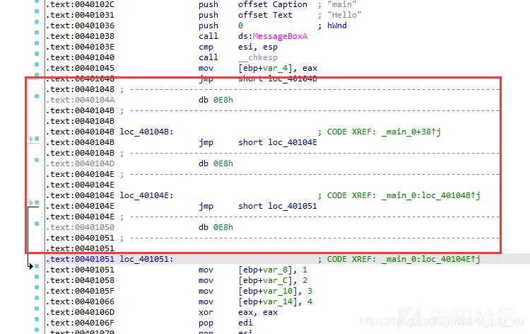

### 2.jx+jnx（x可为e,z,l）

第一种为替代jmp指令

```
_asm{
    jz label1
    jnz label1
    db junkcode
label1:    
}
```

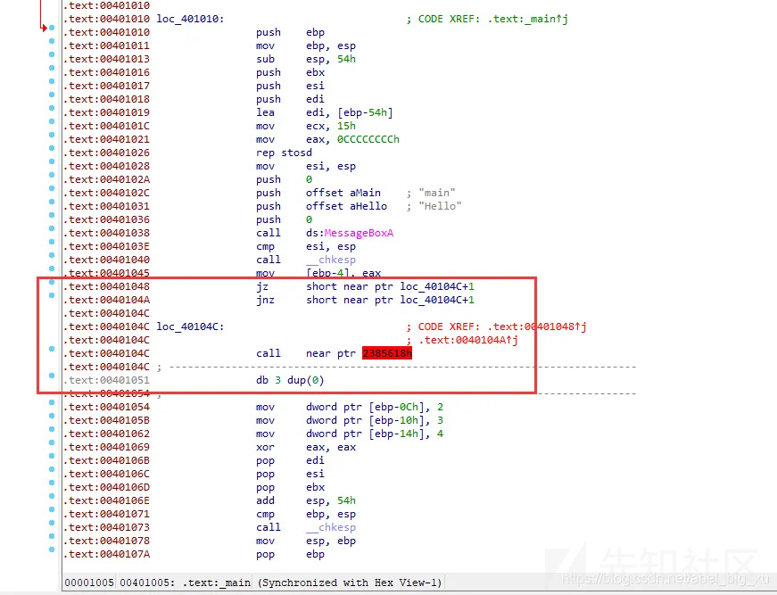

第二种用于永真条件跳转

```
__asm{
    push ebx
    xor ebx,ebx
    test ebx,ebx
    jnz label1
    jz label2
label1:
    _emit junkcode
label2:
   pop ebx//需要恢复ebx寄存器    
}

__asm{
	clc
	jnz label1:
	_emit junkcode
label1:
}
```

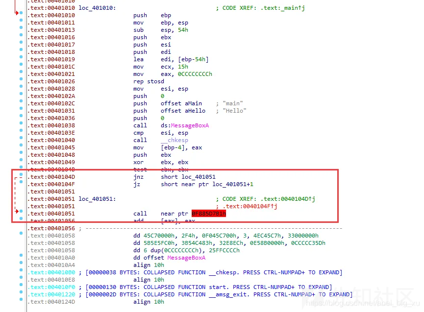

### 3.call +add esp，4或call + add [esp], n + retn

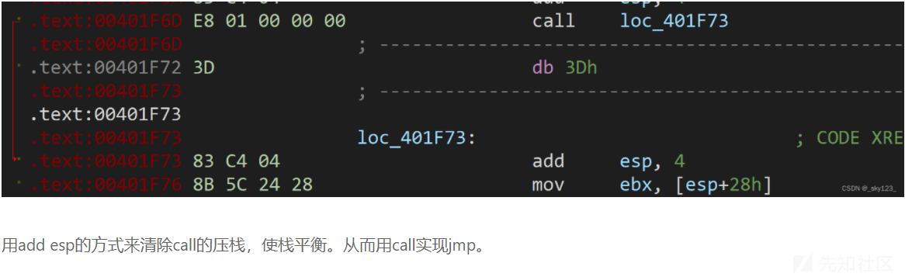

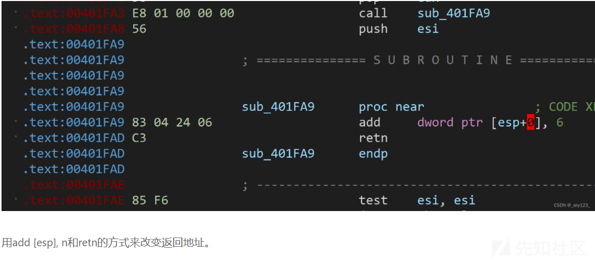

这里call指令，其实本质就是jmp&push 下一条指令的地址，但是这里其实就是一个jmp指令，所以push这条指令是多余的，需要add esp,4 调整堆栈，但是ida会默认把call 后面的那个地址当成一个函数

### 4.jmp XXX（红色）

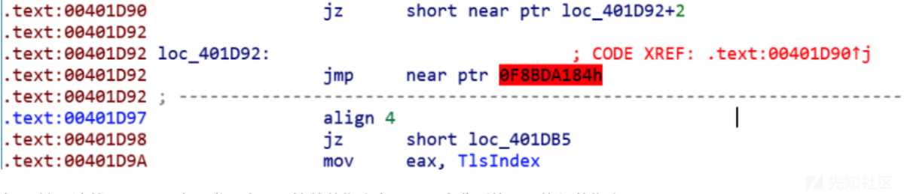

可以看到一串爆红的地址，但是虚拟地址不可能那么大，以下是花指令源代码

```
asm {
    _emit 075h   #jmp $+4
    _emit 2h    
    _emit 0E9h 
    _emit 0EDh    
}
```

E9是jmp指令对应的机器码,当反汇编器读取到E9时,接着会往下读取四个字节的数据作为跳转地址的偏移,所以才会看到错误的汇编代码。ida会默认将e9后面的4个字节当成地址，导致出现上述情况，nop掉jmp(E9)即可

### 5.call+ret

凌武杯2023 flower\_tea

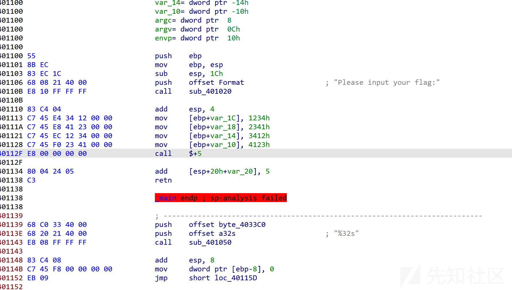

NCTF2024 ezDOS

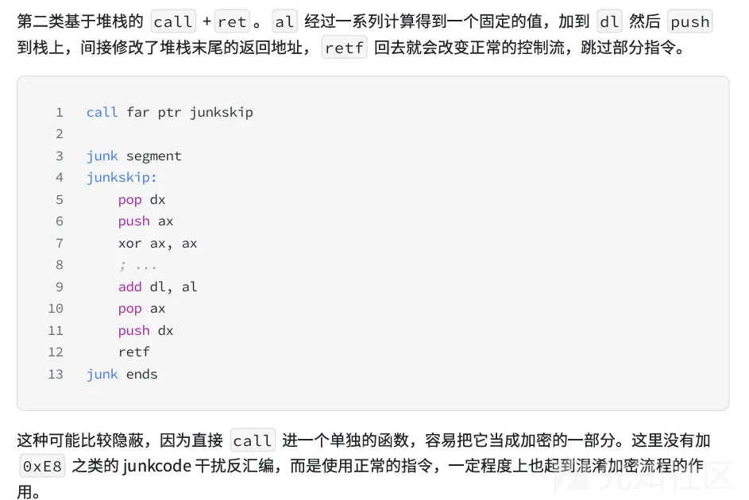

### 6.stx/jx

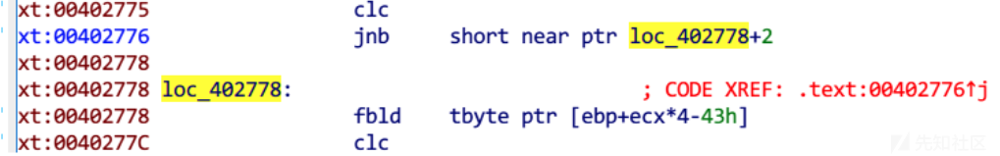

clc是清除EFlags寄存器的carry位的标志，而jnb是根据cf==0时跳转的，然而jnb这个分支指令，ida又将后面的部分认作成了另外的分支。

## 去花

刚好有人提问，就借着这道例题( **[MoeCTF 2022]chicken\_soup** )讲解过程

首先介绍下前提操作知识点

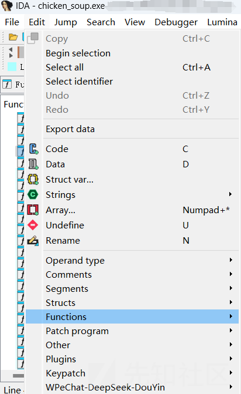

patch program下有个nop，用于将机器码注销，值为90，各版本ida快捷键等不同

用于去除不需要的汇编代码

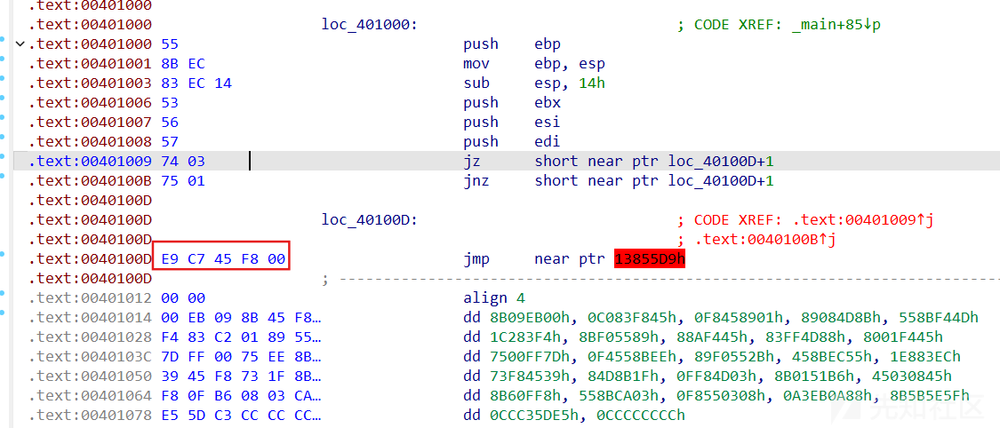

图二为找到的花指令位置，图一的u将汇编码内容取消定义恢复成机器码(框出部分)，c将对应机器码分析成汇编代码，p则在function里用于创建函数(function里也可以设定函数结束地址，一些特定情况需要用到，我的ida9里对应快捷键没有设置，对应E键)

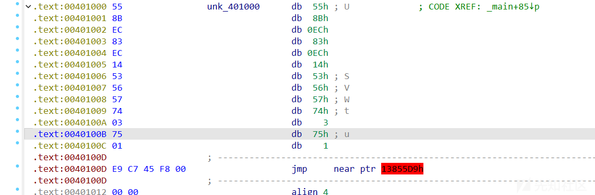

上图为u后效果，至于如何在ida里显示机器码

option->general

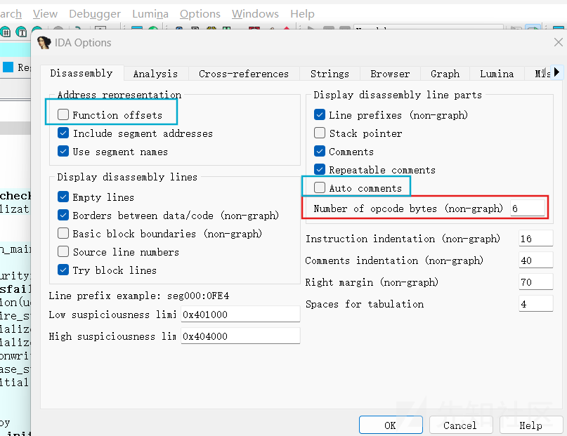

红色为机器码，蓝框左为显示函数地址，用于堆栈指针复原，方便sp(stack pointer)分析

**[网鼎杯 2020 青龙组]jocker**

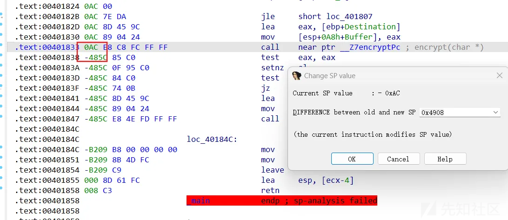

修改负值为0即可，这里了解即可

蓝框右推荐打开，帮助分析汇编代码并注释

想永久保存设置的话需到ida.cfg文件里去修改对应内容

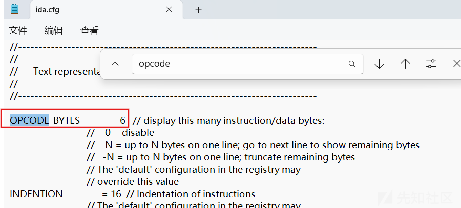

回到题目上

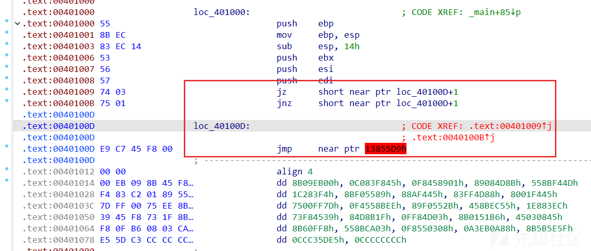

永真跳转，jmp一个大地址，两处一样，nop永真判断，nop jmp对应的E9

nop e9 : 在jmp处u

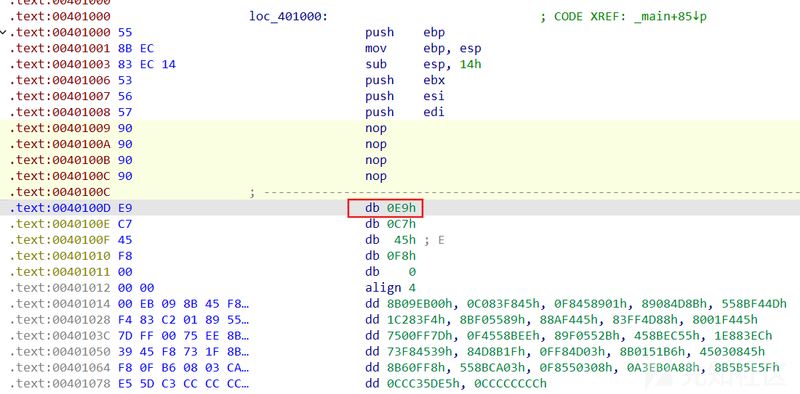

再单独nop，然后在对应标签处p创建函数，两处操作一样

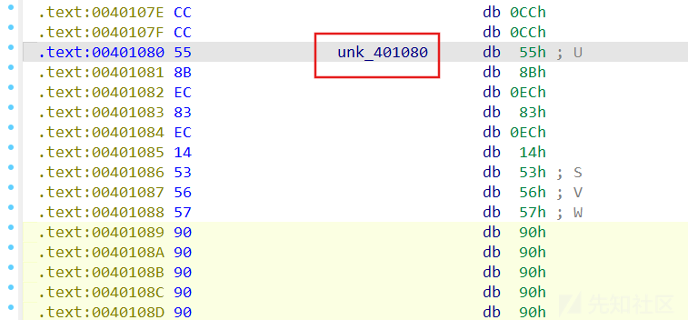

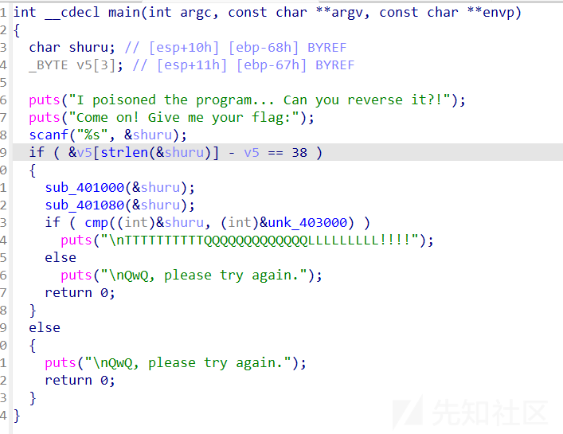

至此，去花完毕

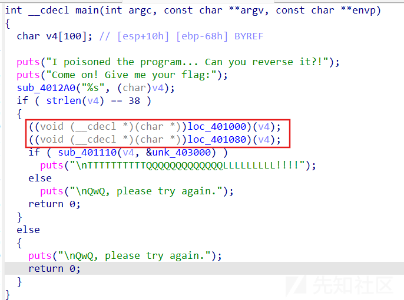

主要是针对两个函数做了混淆
