# 利用phply分析函数调用链-先知社区

> **来源**: https://xz.aliyun.com/news/18519  
> **文章ID**: 18519

---

参考：

[https://github.com/LoRexxar/Kunlun-M/](https://github.com/LoRexxar/Kunlun-M/blob/master/core/plugins/phpunserializechain/main.py)

<https://github.com/viraptor/phply>

<https://github.com/wh1t3p1g/tabby>

###### 工具功能

利用phply分析函数调用关系，将分析结果导入neo4j中，

之后利用Cypher查询语句查找函数调用链（可以自定义source、sink点查询函数调用链）。

###### 函数说明

convert\_php7\_to\_php5将php高版本转化成php5，因为phply没有一直更新，

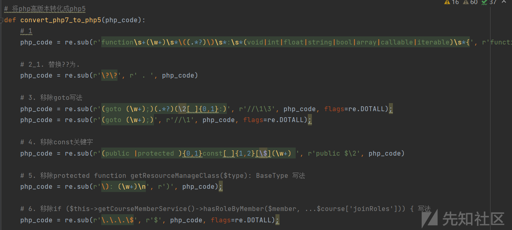

parse\_php\_file利用phply解析php文件成ast抽象语法树，

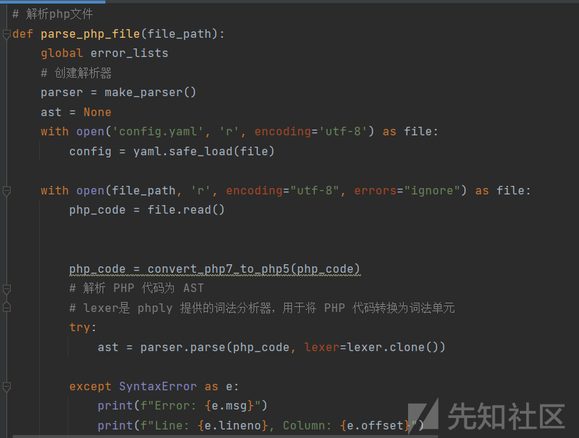

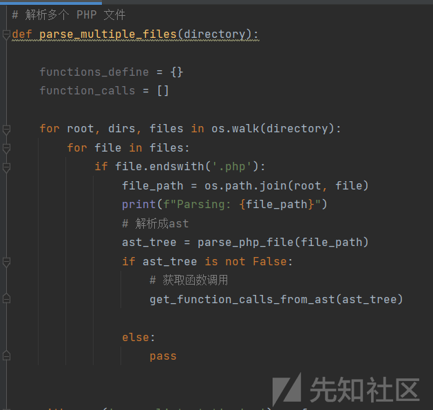

解析函数函数调用关系，

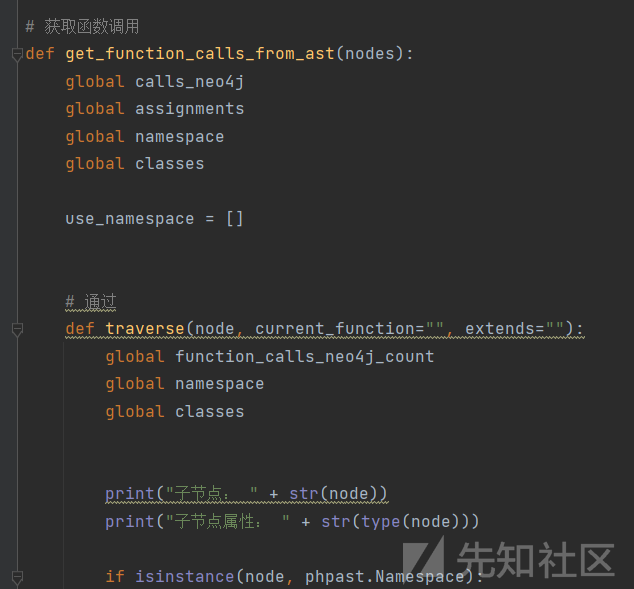

需要更改parse\_multiple\_files函数的扫描路径，

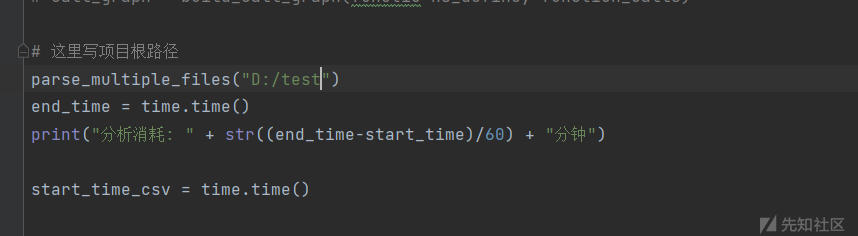

以下代码是分析函数调用关系，

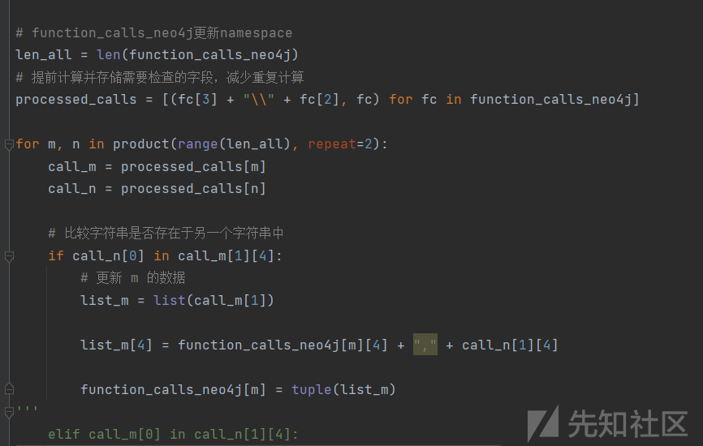

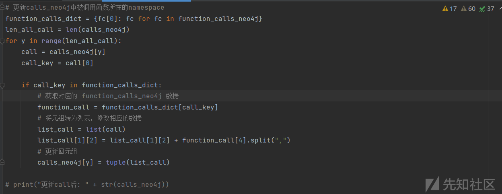

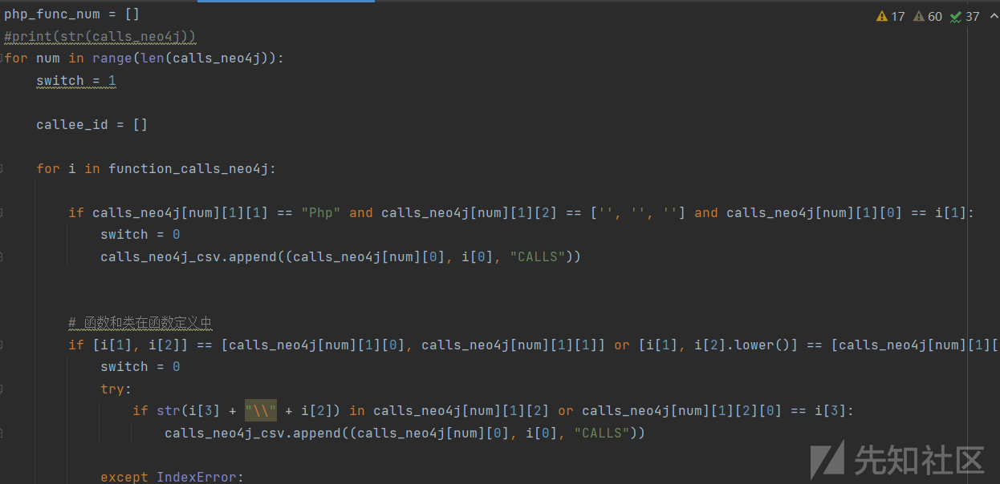

将分析结果导入neo4j数据库，

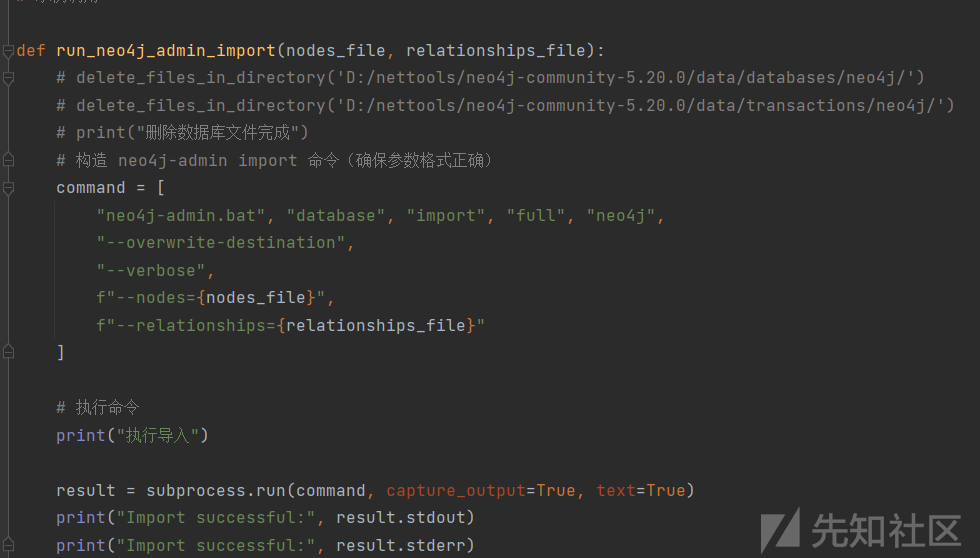

最后将分析结果导入导入neo4j数据库，

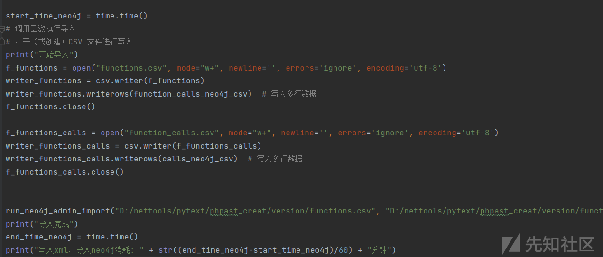

定义默认sink点，定义默认函数调用链查询语句，

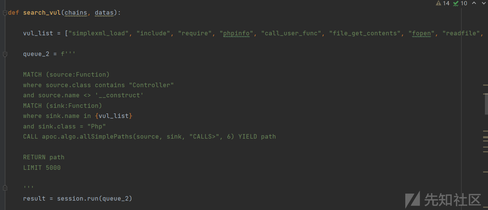

将查询语句输出并保存道xlsx表格中，

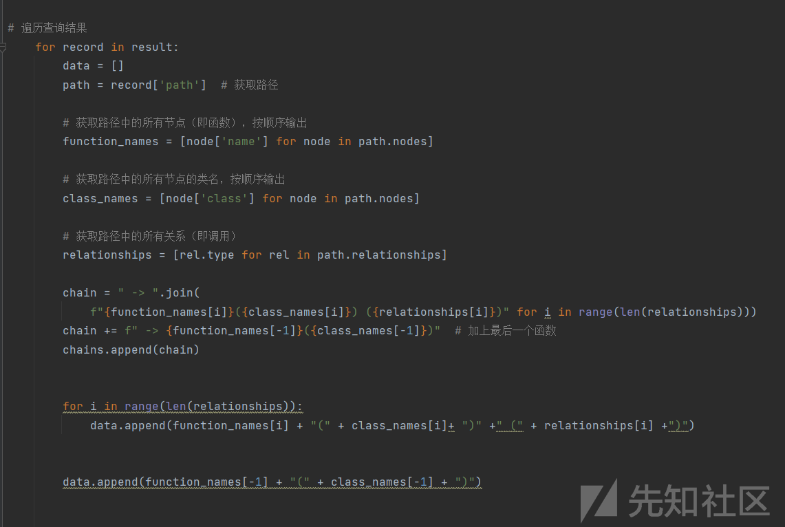

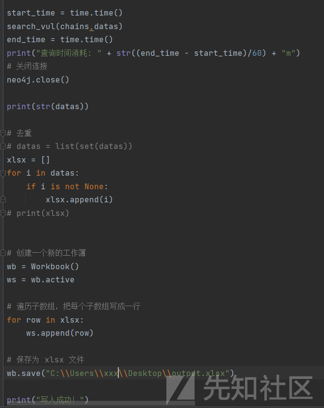

###### neo4j和apoc安装

安装neo4j数据库（neo4j-community-5.20.0），并安装apoc插件(需要和数据库同版本)，安装方式可以参考[https://github.com/wh1t3p1g/tabby](https://github.com/wh1t3p1g/tabby)，

neo4j下载地址：<https://neo4j.com/deployment-center/>

apoc插件：<https://github.com/neo4j/apoc/>

启动neo4j.bat console，默认 neo4j/ neo4j，

配置neo4j的apoc，neo4j.conf，

```
# 注释下面的配置，允许从本地任意位置载入csv文件
#server.directories.import=import

dbms.security.procedures.unrestricted=jwt.security.*,apoc.*,tabby.*

server.memory.heap.initial_size=4G
server.memory.heap.max_size=4G
server.memory.pagecache.size=4G
```

再新建apoc.conf 文件，

```
apoc.import.file.enabled=true
apoc.import.file.use_neo4j_config=false
```

将插件放入neo4j的plugins中，

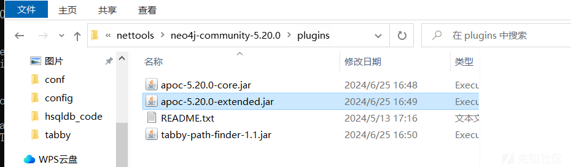

然后使用CALL apoc.help('all')查询，

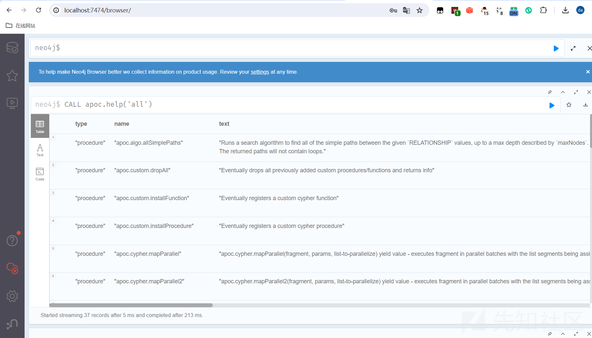

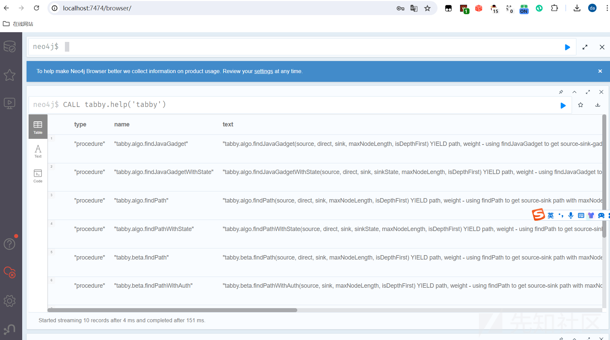

###### 使用方式

更改config.yaml配置文件，

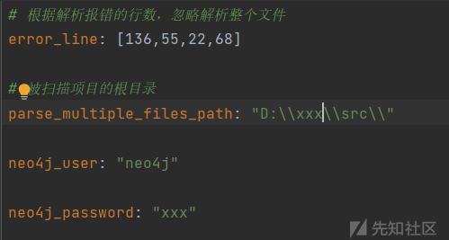

search\_vul函数中queue\_2变量（自定义查询语句，source和sink点可以自定义）

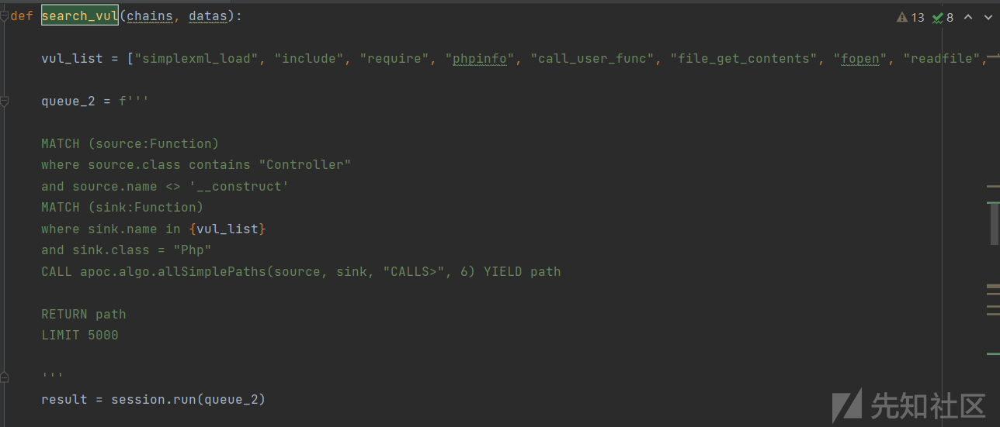

运行phpast\_creat\_1\_18.py，

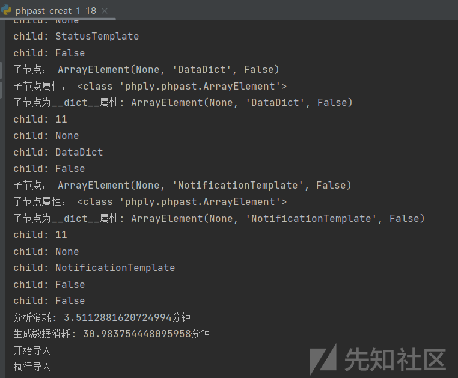

导入结果，这里是离线导入，不能开启neo4j，等导入成功后，再开启neo4j进行函数调用查询，

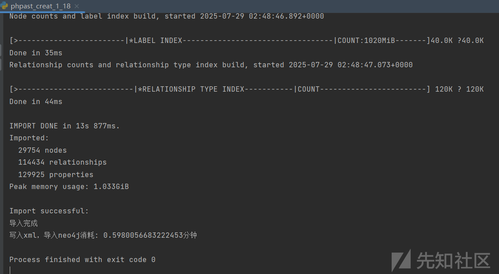

开启neo4j console，

运行search\_neo4j\_19.py查询函数调用链，

输出结果，并保存到xlsx文件中，

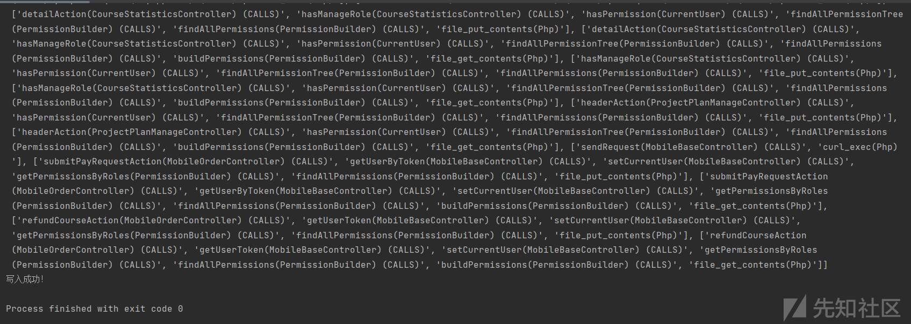

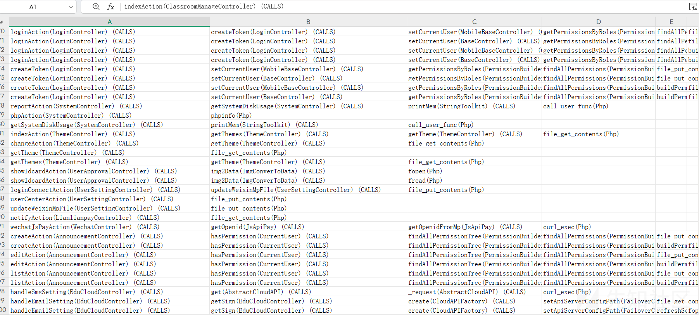

一些常用的查询语句，

```
queue_1 = '''
MATCH path = (start:Function)-[:CALLS*]->(end:Function)
WHERE start.name = 'copyAddress' AND end.name = 'batchCopy'
RETURN path

MATCH path = (start:Function)-[:CALLS*]->(end:Function)
WHERE start.name = 'editPrivateAddress' AND end.name = 'editData'
RETURN path

MATCH path = (start:Function)-[:CALLS*]->(end:Function)
WHERE start.name = 'aaa' AND end.name = 'ddd'
RETURN path

MATCH (source:Function)
where source.class contains "Controller"
MATCH (sink:Function {name: "connection"})
CALL apoc.algo.allSimplePaths(source, sink, "CALLS>", 5) YIELD path
RETURN path
LIMIT 5

MATCH (source:Function)
where source.class contains "Controller"
MATCH (sink:Function {name: "fwrite"})
CALL apoc.algo.allSimplePaths(source, sink, "CALLS>", 5) YIELD path
RETURN path
LIMIT 5


MATCH (source:Function)
where source.class contains "Controller"
and source.name <> '__construct'
MATCH (sink:Function)
where sink.name in {vul_list}
CALL apoc.algo.allSimplePaths(source, sink, "CALLS>", 5) YIELD path
where none(n in nodes(path) where n.class <> 'Controller')
RETURN path
LIMIT 1000

    
MATCH (source:Function)
where source.class contains "Controller"
and source.name <> '__construct'
MATCH (sink:Function)
where sink.name in {vul_list}
CALL apoc.algo.allSimplePaths(source, sink, "CALLS>", 5) YIELD path
WHERE ALL(i IN range(0, size(nodes(path)) - 2) 
      WHERE nodes(path)[i].name <> 'request')
and length(path) > 1 and nodes(path)[0].namespace = nodes(path)[1].namespace
RETURN path
LIMIT 2000


and sink.class = "Php"
where size(nodes(path)) = 4
'''

```

###### 项目地址

https://github.com/tj00000000/phpast\_creat
