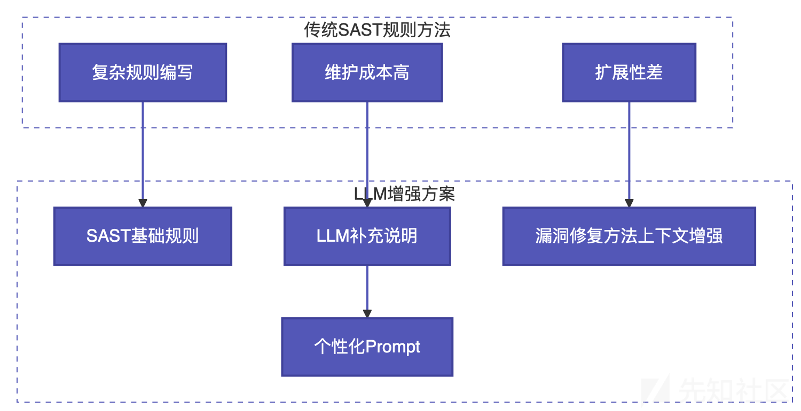
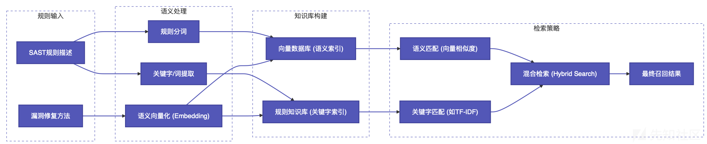
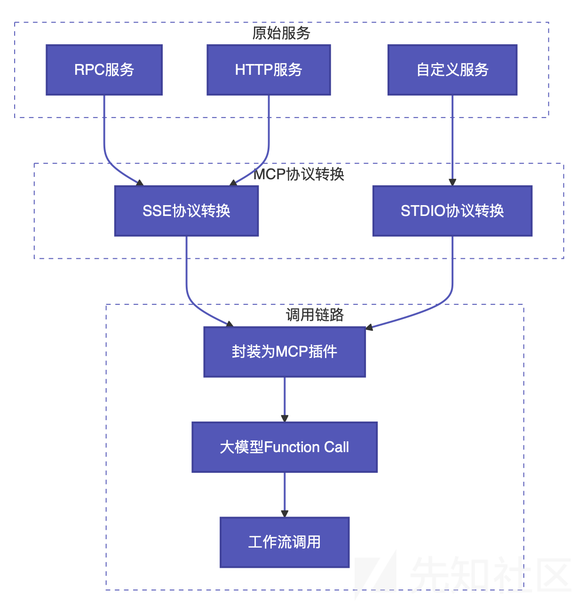

# 基于RAG与MCP的LLM辅助SAST实践与优化-先知社区

> **来源**: https://xz.aliyun.com/news/18522  
> **文章ID**: 18522

---

# 基于RAG与MCP的LLM辅助SAST实践与优化

## 背景与演进

去年我分享了《[使用LLM辅助静态扫描的人工审计](https://xz.aliyun.com/news/13808)》的技术思路（这玩意前年就写完了，只是一直在拖着）。随着工作流平台（如Coze、Dify等）的快速发展与日益成熟，我们看到了更多将大语言模型（LLM）能力集成到安全审计流程中的可能性。

在之前的探讨中，我特别强调了**优化SAST（静态应用安全测试）规则描述**的重要性。这为利用LLM提升审计效率和精度提供了一个值得深入探索的技术方向。

## SAST规则描述优化策略

### 传统方法的局限性

比如以前写的，传统的SAST规则在描述复杂安全场景时存在局限性。以XXE（XML External Entity）漏洞修复为例，直接使用Semgrep等工具编写精确规则来识别“阻止外部实体”这一修复逻辑可能较为复杂。然而，LLM可以有效地弥补这一不足。关键在于：**在提供基础白盒规则的同时，向LLM补充说明XXE漏洞的典型修复方法**，从而显著增强其识别能力。

### XXE漏洞修复示例

以下Java代码展示了通过配置XML解析器来防止XXE攻击的典型修复方法：

```
// 配置XML解析器防止XXE攻击
xmlReader.setFeature("http://apache.org/xml/features/disallow-doctype-decl", true);
xmlReader.setFeature("http://xml.org/sax/features/external-general-entities", false);
xmlReader.setFeature("http://xml.org/sax/features/external-parameter-entities", false);

// 设置外部访问限制
factory.setProperty(XMLConstants.ACCESS_EXTERNAL_DTD, "");
factory.setProperty(XMLConstants.ACCESS_EXTERNAL_SCHEMA, "");

// 禁用DTD和外部实体支持
factory.setProperty(XMLInputFactory.SUPPORT_DTD, false);
factory.setProperty("javax.xml.stream.isSupportingExternalEntities", false);
```

### LLM增强方案与企业定制化优势



**定制化优势：** 不同公司通常拥有独特的代码框架和特定的安全修复实践。LLM增强方案的核心优势在于能够通过**个性化Prompt**轻松融入这些定制化信息。通过为LLM提供针对企业特定修复方案的上下文和说明，可以极大地提升模型在审计过程中的针对性和准确性，使其更有效地识别特定代码实现中的漏洞和安全隐患。这不仅强化了模型的识别能力，也促进了自动化审计系统与企业内部开发流程的无缝契合。

## RAG技术引入

### 从Agent到RAG的演进

在接触并实践了RAG（Retrieval-Augmented Generation，检索增强生成）技术后，我发现它为实现上述LLM增强方案提供了一条更为便捷高效的路径。当前主流的智能体平台（如Coze, Dify）大多已集成RAG知识库功能，进一步降低了实施门槛。

### 为什么选择RAG？

或许有人认为一条精心设计的Prompt就足够了。然而，实践经验表明，仅靠单一Prompt在处理复杂、多样的规则和修复场景时效果会显著受限。我主张为**一个或一组相似的安全扫描规则**配置专门的Prompt（通常通过RAG知识库检索获取），理由如下：

LLM在需要深度理解能力的任务上表现出色。虽然让LLM直接审计庞大项目或进行极其复杂的代码理解仍有挑战，但如果将其定位为一个优秀的“安全运营辅助人员”，其能力在当前基座模型水平下已完全胜任。关键在于为其提供精准、相关的上下文信息——这正是RAG的核心价值。

### 实践策略

当前大模型的能力相较两年前已有显著提升。基于实践经验，我认为最有效的落地策略是：**模拟人工分析路径**。即，让大模型像经验丰富的安全分析师审核白盒扫描结果那样去工作——分析扫描结果、理解代码上下文、结合专业知识进行判断。这是目前验证可行且效果较好的技术路径。

## Agent vs Workflow的选择

### Agent的现状

上篇文章曾探讨利用Agent（智能体）实现流程化工作，这仍是未来颇具潜力的方向。两年前，Agent技术多停留在论文层面，实际落地效果欠佳。令人惊讶的是，短短两年间，Agent技术已取得长足进步，能够支持众多实际场景。

### Workflow的优势

然而，在当前的实践探索中，我们发现大部分需求场景下，**Workflow（工作流）** 已足够满足要求。与Agent相比，Workflow的扩展性可能稍弱，但其核心优势在于**极高的稳定性和可控性**。Agent的运作涉及意图识别、Function Calling等多个需要调用大模型的环节，不仅耗时，且当前意图识别的成熟度与可靠性仍存在挑战，失败率在关键应用中不容忽视。因此，在追求稳定输出的场景下，Workflow通常是更优选择。

## RAG增强架构设计

### 核心思路


### 工作流处理中间数据

工作流处理的核心在于对静态扫描工具产生的中间数据进行预处理和增强，其本质是模拟人工分析师的预处理步骤，为后续大模型分析提供更清晰、更聚焦的输入。例如：

#### 数据流分析与剪枝

* **复杂路径简化**：当数据流分析路径复杂（如存在大量条件分支或复杂函数处理）时，通过策略性剪枝简化分析路径，突出关键风险点
* **依赖关系梳理**：识别并标记关键的数据依赖关系，过滤无关的中间变量
* **调用链优化**：对深度嵌套的函数调用链进行压缩，保留关键的安全检查点

#### 敏感信息检测增强

* **硬编码凭证识别**：通过MCP插件增强对API密钥、数据库连接串、密码等敏感配置的检测

#### 上下文信息补充

* **业务场景关联**：根据代码中的业务逻辑，补充相关的安全上下文信息
* **框架特性识别**：识别使用的安全框架（如Spring Security、Shiro等）并补充相关安全规则
* **依赖库分析**：分析第三方依赖库的安全版本和已知漏洞

#### 误报过滤与优化

* **测试代码过滤**：自动识别并过滤测试代码中的安全告警
* **已知安全模式**：识别企业内已知的安全编码模式，降低误报
* **历史告警学习**：基于历史误报数据，优化检测规则

## RAG规则知识库构建

### 技术选型

构建RAG规则知识库相对直接。开源平台如Dify和Coze提供了易用的向量数据库与检索集成方案。本文实践聚焦于规则描述的检索，业务逻辑复杂度适中。

### 检索策略优化



**优化要点：**

* 纯语义向量检索（稠密检索）在多数情况下表现良好。
* 当遇到语义相近但实际无关，或检索词与向量空间表达差异较大时，纯语义检索效果可能下降。
* **混合检索（Hybrid Search）策略：** 结合基于向量数据库的语义匹配（H）和基于传统倒排索引（如Elasticsearch提供的TF-IDF）的关键字/词匹配（I）。
* 通过对两种检索结果进行加权融合（J），可以显著提升最终召回结果（K）的召回率和准确率，满足实际应用预期。

## MCP插件实现

### 技术架构



MCP（Model Context Protocol）是一个标准化的协议，目前市面上的智能体平台大多支持将RPC或HTTP服务转换为MCP服务。在自研实现方面，主要有两种协议方式：SSE（Server-Sent Events）协议用于远程调用，STDIO（标准输入输出）协议用于本地调用。

从技术实现角度来看，MCP插件本质上是将各种服务能力封装成可供大模型调用的标准化接口，通过支持Function Call的大模型进行调用。这种设计使得实现相对简单直接。不过，基于实际应用经验，我建议在不需要复杂动态决策和自主规划任务的场景下，直接封装成HTTP服务并在工作流中调用会更加高效，因为MCP插件调用存在一定的时间开销和失败风险。

## 总结与展望

通过引入RAG技术增强MCP插件的规则匹配能力，采用语义+关键词混合检索策略，大幅提升规则与上下文的匹配精准度。同时，利用RAG知识库管理规则和修复方案，使得更新维护更加高效。

在工程落地层面，插件集成已经可以稳定运行，不过后续也可以尝试引入Agent——虽然Workflow方案目前足够稳健，但对于需要复杂决策链或自主规划的任务，Agent的灵活性可能更有优势。当然，Agent技术迭代快，可以先找合适的场景小规模验证。

至于RAG知识库，虽然当前已经能满足需求，但细节上仍有优化空间，比如索引结构调整、检索策略调优（动态平衡语义/关键词权重），甚至结合知识图谱增强关联推理，进一步提升召回率和推理效率。
